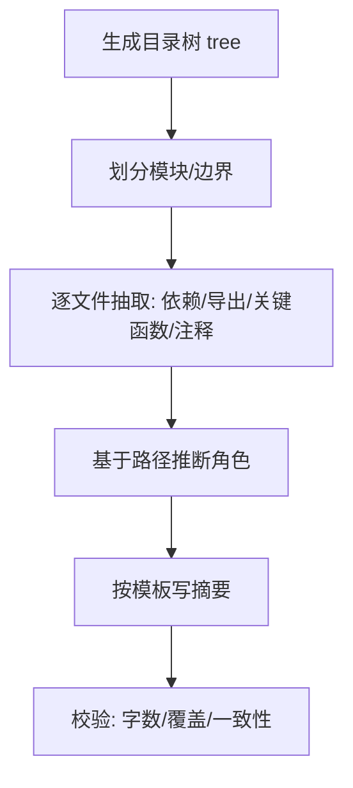

# 源码阅读规则（通用）

目标：用**可验证**的方法快速建立项目结构心智模型，并为每个**非测试代码文件**产出可检索的职责摘要。

## 1) 总体流程（从全局到局部）



### 1.1 生成全局结构
- 用 `tree`（或等价工具）输出目录结构，优先展示到能看出模块分层的深度（如 3~4 层）。
- 在结构图里标注：入口目录、核心模块、扩展/插件模块、共享库、工具链目录。

### 1.2 划分“运行侧/用途”
按路径与依赖特征把代码分为（可多选）：
- 前端运行时代码（UI/页面/组件/状态管理等）
- 后端运行时代码（服务/接口/任务/数据库访问等）
- 共享代码（类型、通用工具、协议模型）
- 工具链/构建测试代码（lint/build/test 配置、脚手架）

## 2) 单文件阅读与提炼规则（五要素）

对每个非测试代码文件，至少提炼以下信息，并保证**能在源码中被验证**：

### 2.1 位置与架构角色（Where + Role）
- 记录文件在项目结构中的位置（到模块级/子域级即可，如 `src/controllers` / `src/utils`）。
- 依据目录约定与命名后缀推断角色：控制器/服务/仓储/中间件/路由/工具/类型/组件/页面/Store/组合式函数等。
- 若无法确定，标记为“模块实现/通用模块”，避免硬猜。

### 2.2 导入/依赖关系（Imports/Deps）
- 抽取 `import/require` 依赖并分三类：
  - 外部依赖：来自包管理器的库（如 `react`、`express`、`zod`）
  - 内部依赖：项目内跨模块引用（别名路径、workspace 包、内部命名空间等）
  - 本地依赖：相对路径 `./` `../`
- 去噪：过滤运行时/标准库常见依赖（如 `fs/path`）或降权展示。
- 优先展示“协作对象”：与导出能力直接相关、或在关键函数里出现的依赖。
- 数量控制：只列最关键的若干项，并用“等 N 项”收尾。

### 2.3 导出接口/类（Exports）
- 识别并记录：
  - 命名导出（函数/类/常量/类型）
  - 默认导出（若有）
  - 再导出（`export * from ...` / barrel 文件）
- 判断文件性质：
  - **能力提供者**：导出业务能力/可复用能力
  - **装配/入口**：主要做注册、聚合导出、依赖注入、路由挂载等
  - **纯类型/常量**：主要导出类型或常量

### 2.4 关键函数/方法名（Key Logic Intent）
- 优先选择：
  - 直接导出的函数/类方法
  - 生命周期/流程类函数（如 `init/setup/run/execute/handle/validate/parse/build`）
  - 明确表达意图的函数（如 `createX/loadX/saveX/serializeX/migrateX`）
- 过滤：
  - 语义弱或样板化的函数（大量 getter/setter、简单包装）可不列
  - 测试/示例相关函数不纳入
- 若无法稳定抽取关键函数（如文件仅声明类型/常量），明确写“无明显关键函数/方法”。

### 2.5 摘要注释（Design Goal from Comments）
- 抽取文件顶部 docblock/连续行注释中“描述设计目标/约束/不变量”的句子。
- 排除 license、lint 指令、生成声明等无关内容。
- 若存在清晰的设计目标，优先放入摘要中（比路径推断更可信）。

## 3) 摘要写作规范（输出模板）

### 3.1 推荐模板（单段叙述 + 结构信息）
在 400 字以内写清“是什么、边界、对外能力、核心意图、设计目标”：

> 位于 `<位置>` 的`<角色>`，导入/依赖：外部 `<...>`、内部 `<...>`、本地 `<...>`；导出 `<...>`（含再导出 `<...>`）；关键函数/方法 `<...>`；用于 `<目的>`（供 `<调用方/协作模块>` 使用）。注释目标：`<...>`（若有）。

### 3.2 约束
- 每条摘要 **≤400 字**（中文语境下“字”为字符级约束）。
- 禁止“想象式总结”：摘要中的依赖/导出/函数名必须能在源码中找到依据。
- 信息优先级：注释目标 > 导出能力 > 关键函数 > 依赖协作 > 路径角色推断。

## 4) 覆盖与排除规则
- 覆盖范围：项目下所有**非测试**代码文件（按约定排除 `test/tests/__tests__`、`.spec.`/`.test.`/`-test` 等）。
- 配置文件（构建/ lint / test 配置）可单独归类为“工具链”，仍可输出摘要但需明确其用途。

## 5) 自检清单（生成/复核时必做）
- 覆盖率：是否包含所有非测试代码文件？
- 一致性：摘要中的导出名/函数名/依赖名是否真实存在？
- 可读性：是否能在不了解项目细节的情况下快速判断“文件地位与协作对象”？
- 信息密度：是否避免空话（如“封装实现细节”）而提供可追踪线索（导出/函数/依赖）？

## 6) 报告文档格式（与 `系统分析.md` 对齐）

后续生成的源码阅读报告，文档结构与排版需保持一致，便于对比与检索。

### 6.1 顶层结构（固定顺序）
1. 一级标题：`# 系统分析（<分析范围>）`
2. 元信息列表（Markdown 无序列表，固定字段顺序）：
   - `- 生成时间: <YYYY-MM-DD HH:mm:ss>`
   - `- 覆盖: <根目录/范围> 下所有非测试代码文件（<扩展名集合>）`
   - `- 每条职责≤400字，包含：位置/角色、导入/依赖、导出、关键函数/方法、注释目标（若有）`
3. 目录结构章节：
   - 二级标题：`## 目录结构（tree <参数>）`
   - 代码块：使用 ```text 包裹 `tree` 输出（保留原始缩进与符号）
4. 文件职责章节：
   - 二级标题：`## 文件职责清单（≤400字/条）`
   - Markdown 表格（固定两列）：`文件`、`职责摘要`

### 6.2 表格行格式（固定）
- `文件` 列：使用反引号包裹的**仓库相对路径**，如 `` `path/to/file.ts` ``
- `职责摘要` 列：按第 2 节五要素写成**单段描述**，并满足：
  - 必须显式包含字段：`位于 <位置> 的<角色>。`、`导入/依赖:`、`导出:`、`关键函数/方法:`
  - `|` 字符必须替换为全角 `｜`（或转义）以避免破坏表格
  - 列表项过多时用“等 N 项”收尾（保持信息密度与可读性）

### 6.3 排序与稳定性（便于 diff）
- 表格按文件路径**字典序**排序（稳定输出，方便版本对比）。
- 同一文件多次生成时，字段顺序与标点保持一致（降低噪声 diff）。

### 6.4 大仓库输出约束
- 允许文档很大，但单条摘要必须 ≤400 字。
- 若为保证 ≤400 字需要裁剪，裁剪优先级：
  1) 依赖列表的数量
  2) 关键函数/方法列表的数量
  3) 导出列表的数量
  4) 注释目标文本长度
  5) 仅在最后才省略“用途/目的”句
