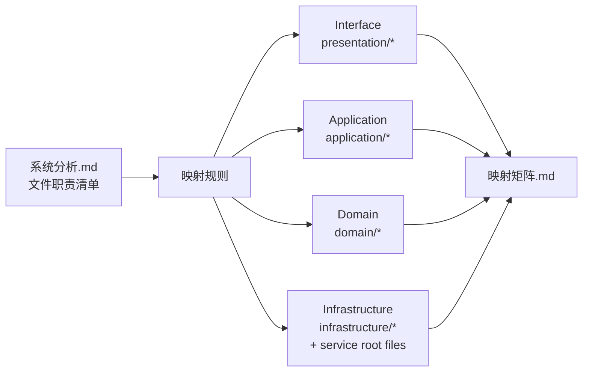

# DDD 迁移映射矩阵（由 系统分析.md 自动生成）

- 源文档：`系统分析.md`（生成时间：2026-01-18 10:45:03）
- 目标模板：`ddd四层微服务目录结构-python.md`
- 生成时间：2026-01-18 17:16:23
- 微服务映射策略：单服务（single）（services/n8n/...）
- 文件映射条目（file-level）：5739（High 4871 | Medium 868 | Low 0）
- 微服务数量（target_context 去重）：1

## 本文档包含内容（单一真源）

- 映射约定/规则（用于解释自动归类逻辑）
- 包级映射矩阵：`packages/*` → `services/*` + DDD 四层
- 文件级映射清单：包含 `系统分析.md` 中每个文件的 old_path→new_path（表格；按包分组）

## 映射约定

- **目标上下文（target_context）**：默认按源路径的包名生成
  - `packages/<pkg>/...` → `services/<pkg>/...`
  - `packages/@n8n/<pkg>/...` → `services/n8n-<pkg>/...`（并将 `.` 转为 `-`）
- **目标分层（target_layer）**：采用 `Domain|Application|Interface|Infrastructure` 四层
  - DDD 模板中的 `presentation/*` → `Interface`
  - DDD 模板中的 `infrastructure/*` 与服务根目录配置文件 → `Infrastructure`
- **目标文件名**：为便于落到 Python 目录中，按如下规则做“占位式”转换
  - `index.ts|js|...` → `__init__.py`
  - 其他代码文件：扩展名转为 `.py`，并将 `-`、`.` 转为 `_`（不做 CamelCase 拆分）

### 规则概览（按优先级）

0. 源码信号优先（逐文件读取源码后判定）
   - `@n8n/decorators` + `@RestController/@Controller` → `presentation/api/v1/controllers/**`（Interface）
   - `express` + `RequestHandler|NextFunction|(req,res,next)` → `presentation/api/middleware/**`（Interface）
   - `express` + `Request|Response`（非 middleware）→ `presentation/api/**`（Interface）
   - `ws` + `WebSocket` → `presentation/api/ws/**`（Interface）
   - `@playwright/test|vitest|jest|describe()/it()/test()` → `tests/**`（标记为 Infrastructure；非生产代码）
   - `ResponseError`（定义或继承）→ `presentation/api/errors/**`（Interface）
   - `typeorm|@n8n/typeorm` + `@Entity` → `infrastructure/persistence/models/**`（Infrastructure）
   - `typeorm|@n8n/typeorm` + `MigrationInterface` → `infrastructure/persistence/migrations/**`（Infrastructure）
   - `typeorm|@n8n/typeorm` + `Repository|EntityManager` → `infrastructure/persistence/repositories/**`（Infrastructure）
   - `n8n-workflow` + `implements ICredentialType` → `infrastructure/external_services/adapters/credentials/**`（Infrastructure）
   - `n8n-workflow` + `implements INodeType` → `infrastructure/external_services/adapters/nodes/**`（Infrastructure）
   - `@n8n/di` + `@Service` → `application/services/**`（Application）
   - `xmllint-wasm` + `XMLFileInfo` → `infrastructure/configuration/**`（Infrastructure）
   - `fs|http|child_process|axios|fetch` → `infrastructure/**`（Infrastructure；I/O/外部交互）
1. 包级强规则（高置信度；用于补齐源码信号不足的文件）
   - `@n8n/api-types/src/**` → `presentation/dto/**`；包根配置 → `infrastructure/configuration/tooling/**`
   - `@n8n/db/src/**` → `infrastructure/persistence/**`；包根配置 → `infrastructure/configuration/tooling/**`
   - `nodes-base/**`、`@n8n/nodes-langchain/**` → `infrastructure/external_services/**`；包根配置 → `infrastructure/configuration/tooling/**`
   - `@n8n/errors/src/**` → `domain/exceptions/**`；包根配置 → `infrastructure/configuration/tooling/**`
   - `workflow/src/**` → `domain/services/**`（errors → `domain/exceptions/**`）；包根配置 → `infrastructure/configuration/tooling/**`
   - `@n8n/permissions/src/**` → `domain/policies/**`（Domain）
   - `@n8n/constants/src/**` → `domain/models/constants/**`（Domain）
   - `testing/**` → `tests/**`（Infrastructure；测试工具包）
   - `@n8n/benchmark/**` → `tests/functional/benchmarks/**`、`infrastructure/container/bin/**` 等（Infrastructure）
   - `@n8n/eslint-config|...` → `infrastructure/configuration/tooling/**`（Infrastructure；工具包）
2. 目录启发式（当源码信号不足时）
   - `*/src/commands/**`：CLI 类包 → `presentation/cli/commands/**`；非 CLI 包 → `application/commands/handlers/**`
   - `cli/bin/n8n|n8n.cmd` → `main.py`
   - `*/routes|routers/**` → `presentation/api/v1/routers/**`（Interface）
   - `core/src/execution-engine/**` → `application/services/execution_engine/**`（Application）
   - `core/src/binary-data/**` → `infrastructure/.../file_storage/binary_data/**`（Infrastructure）
   - `*/databases|repositories|migrations|entities/**` → `infrastructure/persistence/**`
   - `*/config|configs/**` → `infrastructure/configuration/**`
   - `*/eventbus|events/**` → `infrastructure/event_bus/**`
   - `*/telemetry|metrics|posthog|logging|tracing/**` → `infrastructure/monitoring/**`
3. 兜底（需人工复核）
   - 未命中的代码文件 → `application/services/**`（`confidence=Low`）

> 说明：该映射为“预重构”阶段的启发式归类；正式迁移批次仍需按职责/依赖关系人工复核与拆分。

## 映射矩阵（包级）

| 原模块/包名 | 核心职责 | 对应DDD上下文 | 对应分层 | 映射置信度 |
|-------------|----------|---------------|----------|------------|
| `@n8n/ai-workflow-builder.ee` | 关键词：工作流, 类型, test | `n8n` | `Application` | `Medium` |
| `@n8n/api-types` | 关键词：schema, 工作流, 配置 | `n8n` | `Interface` | `High` |
| `@n8n/backend-common` | 关键词：配置, 类型 | `n8n` | `Infrastructure` | `High` |
| `@n8n/backend-test-utils` | 关键词：test, 工作流, 配置 | `n8n` | `Infrastructure` | `High` |
| `@n8n/benchmark` | 关键词：test, 执行, 类型 | `n8n` | `Infrastructure` | `High` |
| `@n8n/client-oauth2` | 关键词：配置, 类型 | `n8n` | `Infrastructure` | `High` |
| `@n8n/config` | 关键词：配置, 工作流, 执行 | `n8n` | `Infrastructure` | `High` |
| `@n8n/constants` | 关键词：执行, 配置 | `n8n` | `Domain` | `High` |
| `@n8n/create-node` | （待补充：请基于职责摘要确认） | `n8n` | `Infrastructure` | `High` |
| `@n8n/db` | 关键词：迁移, 数据库, 工作流 | `n8n` | `Infrastructure` | `High` |
| `@n8n/decorators` | 关键词：类型, 执行, 配置 | `n8n` | `Infrastructure` | `Medium` |
| `@n8n/di` | 关键词：配置 | `n8n` | `Infrastructure` | `High` |
| `@n8n/errors` | 关键词：类型 | `n8n` | `Domain` | `High` |
| `@n8n/eslint-config` | 关键词：类型, 配置, test | `n8n` | `Infrastructure` | `High` |
| `@n8n/eslint-plugin-community-nodes` | 关键词：配置, test, 工作流 | `n8n` | `Infrastructure` | `High` |
| `@n8n/extension-sdk` | 关键词：类型, 配置, schema | `n8n` | `Interface` | `High` |
| `@n8n/imap` | 关键词：配置, 类型, test | `n8n` | `Infrastructure` | `High` |
| `@n8n/json-schema-to-zod` | 关键词：schema, 配置, 类型 | `n8n` | `Application` | `High` |
| `@n8n/node-cli` | 关键词：节点, 工作流, 执行 | `n8n` | `Infrastructure` | `High` |
| `@n8n/nodes-langchain` | 关键词：节点, 工作流, 执行 | `n8n` | `Infrastructure` | `High` |
| `@n8n/permissions` | 关键词：配置, 工作流, 类型 | `n8n` | `Domain` | `High` |
| `@n8n/scan-community-package` | （待补充：请基于职责摘要确认） | `n8n` | `Infrastructure` | `High` |
| `@n8n/stylelint-config` | 关键词：配置 | `n8n` | `Infrastructure` | `High` |
| `@n8n/syslog-client` | 关键词：配置, 类型, schema | `n8n` | `Infrastructure` | `High` |
| `@n8n/task-runner` | 关键词：配置, 类型, 执行 | `n8n` | `Infrastructure` | `High` |
| `@n8n/utils` | 关键词：test | `n8n` | `Application` | `High` |
| `@n8n/vitest-config` | 关键词：test | `n8n` | `Infrastructure` | `High` |
| `cli` | 关键词：工作流, 类型, 仓储 | `n8n` | `Application` | `Medium` |
| `core` | 关键词：执行, 类型, 工作流 | `n8n` | `Application` | `High` |
| `extensions` | 关键词：配置, 类型, test | `n8n` | `Infrastructure` | `High` |
| `node-dev` | 关键词：配置, 凭证, 节点 | `n8n` | `Infrastructure` | `Medium` |
| `nodes-base` | 关键词：节点, 工作流, 执行 | `n8n` | `Infrastructure` | `High` |
| `testing` | 关键词：test, 配置, 工作流 | `n8n` | `Infrastructure` | `High` |
| `workflow` | 关键词：工作流, 配置, 类型 | `n8n` | `Domain` | `High` |

## 置信度判定标准（简述）

- `High`：清晰且占比≥70% 的分层归属（例如 DTO/DB/Integration 等包或目录结构强约束）
- `Medium`：占比≥50% 或依赖/职责较一致，但仍存在明显混层或需人工复核
- `Low`：无明显主层、职责混杂或大量回退规则命中

## 文件级映射清单（按包分组；表格）

### `@n8n/ai-workflow-builder.ee` → `n8n`

| old_path | new_path | target_context | target_layer | reason | confidence |
|---------|----------|---------------|--------------|--------|------------|
| `packages/@n8n/ai-workflow-builder.ee/eslint.config.mjs` | `services/n8n/application/services/eslint_config.py` | `n8n` | `Application` | AI workflow builder package -> application/services | `High` |
| `packages/@n8n/ai-workflow-builder.ee/evaluations/chains/evaluators/base.ts` | `services/n8n/infrastructure/configuration/tooling/evaluations/evaluations/chains/evaluators/base.py` | `n8n` | `Infrastructure` | AI builder evaluation harness/scripts -> infrastructure/configuration/tooling | `High` |
| `packages/@n8n/ai-workflow-builder.ee/evaluations/chains/evaluators/best-practices-evaluator.ts` | `services/n8n/tests/unit/evaluations/chains/evaluators/best_practices_evaluator.py` | `n8n` | `Infrastructure` | Detected test/non-production code -> tests/* | `High` |
| `packages/@n8n/ai-workflow-builder.ee/evaluations/chains/evaluators/connections-evaluator.ts` | `services/n8n/tests/unit/evaluations/chains/evaluators/connections_evaluator.py` | `n8n` | `Infrastructure` | Detected test/non-production code -> tests/* | `High` |
| `packages/@n8n/ai-workflow-builder.ee/evaluations/chains/evaluators/data-flow-evaluator.ts` | `services/n8n/tests/unit/evaluations/chains/evaluators/data_flow_evaluator.py` | `n8n` | `Infrastructure` | Detected test/non-production code -> tests/* | `High` |
| `packages/@n8n/ai-workflow-builder.ee/evaluations/chains/evaluators/efficiency-evaluator.ts` | `services/n8n/tests/unit/evaluations/chains/evaluators/efficiency_evaluator.py` | `n8n` | `Infrastructure` | Detected test/non-production code -> tests/* | `High` |
| `packages/@n8n/ai-workflow-builder.ee/evaluations/chains/evaluators/expressions-evaluator.ts` | `services/n8n/tests/unit/evaluations/chains/evaluators/expressions_evaluator.py` | `n8n` | `Infrastructure` | Detected test/non-production code -> tests/* | `High` |
| `packages/@n8n/ai-workflow-builder.ee/evaluations/chains/evaluators/functionality-evaluator.ts` | `services/n8n/tests/unit/evaluations/chains/evaluators/functionality_evaluator.py` | `n8n` | `Infrastructure` | Detected test/non-production code -> tests/* | `High` |
| `packages/@n8n/ai-workflow-builder.ee/evaluations/chains/evaluators/index.ts` | `services/n8n/infrastructure/configuration/tooling/evaluations/evaluations/chains/evaluators/__init__.py` | `n8n` | `Infrastructure` | AI builder evaluation harness/scripts -> infrastructure/configuration/tooling | `High` |
| `packages/@n8n/ai-workflow-builder.ee/evaluations/chains/evaluators/maintainability-evaluator.ts` | `services/n8n/tests/unit/evaluations/chains/evaluators/maintainability_evaluator.py` | `n8n` | `Infrastructure` | Detected test/non-production code -> tests/* | `High` |
| `packages/@n8n/ai-workflow-builder.ee/evaluations/chains/evaluators/node-configuration-evaluator.ts` | `services/n8n/tests/unit/evaluations/chains/evaluators/node_configuration_evaluator.py` | `n8n` | `Infrastructure` | Detected test/non-production code -> tests/* | `High` |
| `packages/@n8n/ai-workflow-builder.ee/evaluations/chains/test-case-generator.ts` | `services/n8n/infrastructure/container/evaluations/chains/test_case_generator.py` | `n8n` | `Infrastructure` | Detected runtime IO/external interaction -> infrastructure/container | `Medium` |
| `packages/@n8n/ai-workflow-builder.ee/evaluations/chains/workflow-evaluator.ts` | `services/n8n/infrastructure/configuration/tooling/evaluations/evaluations/chains/workflow_evaluator.py` | `n8n` | `Infrastructure` | AI builder evaluation harness/scripts -> infrastructure/configuration/tooling | `High` |
| `packages/@n8n/ai-workflow-builder.ee/evaluations/cli/display.ts` | `services/n8n/infrastructure/configuration/tooling/evaluations/evaluations/cli/display.py` | `n8n` | `Infrastructure` | AI builder evaluation harness/scripts -> infrastructure/configuration/tooling | `High` |
| `packages/@n8n/ai-workflow-builder.ee/evaluations/cli/runner.ts` | `services/n8n/tests/unit/evaluations/cli/runner.py` | `n8n` | `Infrastructure` | Detected test/non-production code -> tests/* | `High` |
| `packages/@n8n/ai-workflow-builder.ee/evaluations/constants.ts` | `services/n8n/infrastructure/configuration/tooling/evaluations/evaluations/constants.py` | `n8n` | `Infrastructure` | AI builder evaluation harness/scripts -> infrastructure/configuration/tooling | `High` |
| `packages/@n8n/ai-workflow-builder.ee/evaluations/core/environment.ts` | `services/n8n/infrastructure/configuration/tooling/evaluations/evaluations/core/environment.py` | `n8n` | `Infrastructure` | AI builder evaluation harness/scripts -> infrastructure/configuration/tooling | `High` |
| `packages/@n8n/ai-workflow-builder.ee/evaluations/core/test-runner.ts` | `services/n8n/infrastructure/configuration/tooling/evaluations/evaluations/core/test_runner.py` | `n8n` | `Infrastructure` | AI builder evaluation harness/scripts -> infrastructure/configuration/tooling | `High` |
| `packages/@n8n/ai-workflow-builder.ee/evaluations/index.ts` | `services/n8n/infrastructure/configuration/tooling/evaluations/evaluations/__init__.py` | `n8n` | `Infrastructure` | AI builder evaluation harness/scripts -> infrastructure/configuration/tooling | `High` |
| `packages/@n8n/ai-workflow-builder.ee/evaluations/langsmith/evaluator.ts` | `services/n8n/infrastructure/configuration/tooling/evaluations/evaluations/langsmith/evaluator.py` | `n8n` | `Infrastructure` | AI builder evaluation harness/scripts -> infrastructure/configuration/tooling | `High` |
| `packages/@n8n/ai-workflow-builder.ee/evaluations/langsmith/runner.ts` | `services/n8n/infrastructure/configuration/tooling/evaluations/evaluations/langsmith/runner.py` | `n8n` | `Infrastructure` | AI builder evaluation harness/scripts -> infrastructure/configuration/tooling | `High` |
| `packages/@n8n/ai-workflow-builder.ee/evaluations/load-nodes.ts` | `services/n8n/infrastructure/container/evaluations/load_nodes.py` | `n8n` | `Infrastructure` | Detected runtime IO/external interaction -> infrastructure/container | `Medium` |
| `packages/@n8n/ai-workflow-builder.ee/evaluations/pairwise/generator.ts` | `services/n8n/infrastructure/configuration/tooling/evaluations/evaluations/pairwise/generator.py` | `n8n` | `Infrastructure` | AI builder evaluation harness/scripts -> infrastructure/configuration/tooling | `High` |
| `packages/@n8n/ai-workflow-builder.ee/evaluations/pairwise/judge-chain.ts` | `services/n8n/tests/unit/evaluations/pairwise/judge_chain.py` | `n8n` | `Infrastructure` | Detected test/non-production code -> tests/* | `High` |
| `packages/@n8n/ai-workflow-builder.ee/evaluations/pairwise/judge-panel.ts` | `services/n8n/infrastructure/configuration/tooling/evaluations/evaluations/pairwise/judge_panel.py` | `n8n` | `Infrastructure` | AI builder evaluation harness/scripts -> infrastructure/configuration/tooling | `High` |
| `packages/@n8n/ai-workflow-builder.ee/evaluations/pairwise/metrics-builder.ts` | `services/n8n/infrastructure/configuration/tooling/evaluations/evaluations/pairwise/metrics_builder.py` | `n8n` | `Infrastructure` | AI builder evaluation harness/scripts -> infrastructure/configuration/tooling | `High` |
| `packages/@n8n/ai-workflow-builder.ee/evaluations/pairwise/runner.ts` | `services/n8n/infrastructure/configuration/tooling/evaluations/evaluations/pairwise/runner.py` | `n8n` | `Infrastructure` | AI builder evaluation harness/scripts -> infrastructure/configuration/tooling | `High` |
| `packages/@n8n/ai-workflow-builder.ee/evaluations/pairwise/types.ts` | `services/n8n/infrastructure/configuration/tooling/evaluations/evaluations/pairwise/types.py` | `n8n` | `Infrastructure` | AI builder evaluation harness/scripts -> infrastructure/configuration/tooling | `High` |
| `packages/@n8n/ai-workflow-builder.ee/evaluations/programmatic/evaluators/agent-prompt.ts` | `services/n8n/infrastructure/configuration/tooling/evaluations/evaluations/programmatic/evaluators/agent_prompt.py` | `n8n` | `Infrastructure` | AI builder evaluation harness/scripts -> infrastructure/configuration/tooling | `High` |
| `packages/@n8n/ai-workflow-builder.ee/evaluations/programmatic/evaluators/connections.ts` | `services/n8n/infrastructure/configuration/tooling/evaluations/evaluations/programmatic/evaluators/connections.py` | `n8n` | `Infrastructure` | AI builder evaluation harness/scripts -> infrastructure/configuration/tooling | `High` |
| `packages/@n8n/ai-workflow-builder.ee/evaluations/programmatic/evaluators/credentials.ts` | `services/n8n/infrastructure/configuration/tooling/evaluations/evaluations/programmatic/evaluators/credentials.py` | `n8n` | `Infrastructure` | AI builder evaluation harness/scripts -> infrastructure/configuration/tooling | `High` |
| `packages/@n8n/ai-workflow-builder.ee/evaluations/programmatic/evaluators/from-ai.ts` | `services/n8n/infrastructure/configuration/tooling/evaluations/evaluations/programmatic/evaluators/from_ai.py` | `n8n` | `Infrastructure` | AI builder evaluation harness/scripts -> infrastructure/configuration/tooling | `High` |
| `packages/@n8n/ai-workflow-builder.ee/evaluations/programmatic/evaluators/index.ts` | `services/n8n/infrastructure/configuration/tooling/evaluations/evaluations/programmatic/evaluators/__init__.py` | `n8n` | `Infrastructure` | AI builder evaluation harness/scripts -> infrastructure/configuration/tooling | `High` |
| `packages/@n8n/ai-workflow-builder.ee/evaluations/programmatic/evaluators/nodes.ts` | `services/n8n/infrastructure/configuration/tooling/evaluations/evaluations/programmatic/evaluators/nodes.py` | `n8n` | `Infrastructure` | AI builder evaluation harness/scripts -> infrastructure/configuration/tooling | `High` |
| `packages/@n8n/ai-workflow-builder.ee/evaluations/programmatic/evaluators/tools.ts` | `services/n8n/infrastructure/configuration/tooling/evaluations/evaluations/programmatic/evaluators/tools.py` | `n8n` | `Infrastructure` | AI builder evaluation harness/scripts -> infrastructure/configuration/tooling | `High` |
| `packages/@n8n/ai-workflow-builder.ee/evaluations/programmatic/evaluators/trigger.ts` | `services/n8n/infrastructure/configuration/tooling/evaluations/evaluations/programmatic/evaluators/trigger.py` | `n8n` | `Infrastructure` | AI builder evaluation harness/scripts -> infrastructure/configuration/tooling | `High` |
| `packages/@n8n/ai-workflow-builder.ee/evaluations/programmatic/evaluators/workflow-similarity.ts` | `services/n8n/infrastructure/container/bin/evaluations/programmatic/evaluators/workflow_similarity.py` | `n8n` | `Infrastructure` | Detected child_process execution -> infrastructure/container/bin | `High` |
| `packages/@n8n/ai-workflow-builder.ee/evaluations/programmatic/programmatic-evaluation.ts` | `services/n8n/infrastructure/configuration/tooling/evaluations/evaluations/programmatic/programmatic_evaluation.py` | `n8n` | `Infrastructure` | AI builder evaluation harness/scripts -> infrastructure/configuration/tooling | `High` |
| `packages/@n8n/ai-workflow-builder.ee/evaluations/prompts-example.ts` | `services/n8n/infrastructure/configuration/tooling/evaluations/evaluations/prompts_example.py` | `n8n` | `Infrastructure` | AI builder evaluation harness/scripts -> infrastructure/configuration/tooling | `High` |
| `packages/@n8n/ai-workflow-builder.ee/evaluations/types/categorization-evaluation.ts` | `services/n8n/infrastructure/configuration/tooling/evaluations/evaluations/types/categorization_evaluation.py` | `n8n` | `Infrastructure` | AI builder evaluation harness/scripts -> infrastructure/configuration/tooling | `High` |
| `packages/@n8n/ai-workflow-builder.ee/evaluations/types/evaluation.ts` | `services/n8n/tests/unit/evaluations/types/evaluation.py` | `n8n` | `Infrastructure` | Detected test/non-production code -> tests/* | `High` |
| `packages/@n8n/ai-workflow-builder.ee/evaluations/types/langsmith.ts` | `services/n8n/infrastructure/configuration/tooling/evaluations/evaluations/types/langsmith.py` | `n8n` | `Infrastructure` | AI builder evaluation harness/scripts -> infrastructure/configuration/tooling | `High` |
| `packages/@n8n/ai-workflow-builder.ee/evaluations/types/test-result.ts` | `services/n8n/infrastructure/configuration/tooling/evaluations/evaluations/types/test_result.py` | `n8n` | `Infrastructure` | AI builder evaluation harness/scripts -> infrastructure/configuration/tooling | `High` |
| `packages/@n8n/ai-workflow-builder.ee/evaluations/utils/artifact-saver.ts` | `services/n8n/infrastructure/container/evaluations/utils/artifact_saver.py` | `n8n` | `Infrastructure` | Detected runtime IO/external interaction -> infrastructure/container | `Medium` |
| `packages/@n8n/ai-workflow-builder.ee/evaluations/utils/cache-analyzer.ts` | `services/n8n/infrastructure/configuration/tooling/evaluations/evaluations/utils/cache_analyzer.py` | `n8n` | `Infrastructure` | AI builder evaluation harness/scripts -> infrastructure/configuration/tooling | `High` |
| `packages/@n8n/ai-workflow-builder.ee/evaluations/utils/csv-prompt-loader.ts` | `services/n8n/infrastructure/container/evaluations/utils/csv_prompt_loader.py` | `n8n` | `Infrastructure` | Detected runtime IO/external interaction -> infrastructure/container | `Medium` |
| `packages/@n8n/ai-workflow-builder.ee/evaluations/utils/evaluation-calculator.ts` | `services/n8n/infrastructure/configuration/tooling/evaluations/evaluations/utils/evaluation_calculator.py` | `n8n` | `Infrastructure` | AI builder evaluation harness/scripts -> infrastructure/configuration/tooling | `High` |
| `packages/@n8n/ai-workflow-builder.ee/evaluations/utils/evaluation-helpers.ts` | `services/n8n/infrastructure/container/evaluations/utils/evaluation_helpers.py` | `n8n` | `Infrastructure` | Detected runtime IO/external interaction -> infrastructure/container | `Medium` |
| `packages/@n8n/ai-workflow-builder.ee/evaluations/utils/evaluation-reporter.ts` | `services/n8n/infrastructure/configuration/tooling/evaluations/evaluations/utils/evaluation_reporter.py` | `n8n` | `Infrastructure` | AI builder evaluation harness/scripts -> infrastructure/configuration/tooling | `High` |
| `packages/@n8n/ai-workflow-builder.ee/evaluations/utils/logger.ts` | `services/n8n/infrastructure/configuration/tooling/evaluations/evaluations/utils/logger.py` | `n8n` | `Infrastructure` | AI builder evaluation harness/scripts -> infrastructure/configuration/tooling | `High` |
| `packages/@n8n/ai-workflow-builder.ee/evaluations/utils/score.ts` | `services/n8n/infrastructure/configuration/tooling/evaluations/evaluations/utils/score.py` | `n8n` | `Infrastructure` | AI builder evaluation harness/scripts -> infrastructure/configuration/tooling | `High` |
| `packages/@n8n/ai-workflow-builder.ee/jest.config.integration.js` | `services/n8n/tests/unit/jest_config_integration.py` | `n8n` | `Infrastructure` | Detected test/non-production code -> tests/* | `High` |
| `packages/@n8n/ai-workflow-builder.ee/jest.config.js` | `services/n8n/tests/unit/jest_config.py` | `n8n` | `Infrastructure` | Detected test/non-production code -> tests/* | `High` |
| `packages/@n8n/ai-workflow-builder.ee/jest.config.unit.js` | `services/n8n/tests/unit/jest_config_unit.py` | `n8n` | `Infrastructure` | Detected test/non-production code -> tests/* | `High` |
| `packages/@n8n/ai-workflow-builder.ee/scripts/categorize-prompts.ts` | `services/n8n/infrastructure/container/scripts/categorize_prompts.py` | `n8n` | `Infrastructure` | Detected runtime IO/external interaction -> infrastructure/container | `Medium` |
| `packages/@n8n/ai-workflow-builder.ee/scripts/workflow-to-mermaid.ts` | `services/n8n/infrastructure/container/scripts/workflow_to_mermaid.py` | `n8n` | `Infrastructure` | Detected runtime IO/external interaction -> infrastructure/container | `Medium` |
| `packages/@n8n/ai-workflow-builder.ee/src/agents/responder.agent.ts` | `services/n8n/application/services/agents/responder_agent.py` | `n8n` | `Application` | AI workflow builder package -> application/services | `High` |
| `packages/@n8n/ai-workflow-builder.ee/src/agents/supervisor.agent.ts` | `services/n8n/tests/unit/agents/supervisor_agent.py` | `n8n` | `Infrastructure` | Detected test/non-production code -> tests/* | `High` |
| `packages/@n8n/ai-workflow-builder.ee/src/ai-workflow-builder-agent.service.ts` | `services/n8n/application/services/ai_workflow_builder_agent_service.py` | `n8n` | `Application` | Detected @Service from @n8n/di | `Medium` |
| `packages/@n8n/ai-workflow-builder.ee/src/chains/conversation-compact.ts` | `services/n8n/tests/unit/chains/conversation_compact.py` | `n8n` | `Infrastructure` | Detected test/non-production code -> tests/* | `High` |
| `packages/@n8n/ai-workflow-builder.ee/src/chains/parameter-updater.ts` | `services/n8n/tests/unit/chains/parameter_updater.py` | `n8n` | `Infrastructure` | Detected test/non-production code -> tests/* | `High` |
| `packages/@n8n/ai-workflow-builder.ee/src/chains/prompt-categorization.ts` | `services/n8n/tests/unit/chains/prompt_categorization.py` | `n8n` | `Infrastructure` | Detected test/non-production code -> tests/* | `High` |
| `packages/@n8n/ai-workflow-builder.ee/src/chains/workflow-name.ts` | `services/n8n/tests/unit/chains/workflow_name.py` | `n8n` | `Infrastructure` | Detected test/non-production code -> tests/* | `High` |
| `packages/@n8n/ai-workflow-builder.ee/src/constants.ts` | `services/n8n/application/services/constants.py` | `n8n` | `Application` | AI workflow builder package -> application/services | `High` |
| `packages/@n8n/ai-workflow-builder.ee/src/errors/index.ts` | `services/n8n/application/services/errors/__init__.py` | `n8n` | `Application` | AI workflow builder package -> application/services | `High` |
| `packages/@n8n/ai-workflow-builder.ee/src/index.ts` | `services/n8n/application/services/__init__.py` | `n8n` | `Application` | AI workflow builder package -> application/services | `High` |
| `packages/@n8n/ai-workflow-builder.ee/src/llm-config.ts` | `services/n8n/application/services/llm_config.py` | `n8n` | `Application` | AI workflow builder package -> application/services | `High` |
| `packages/@n8n/ai-workflow-builder.ee/src/multi-agent-workflow-subgraphs.ts` | `services/n8n/application/services/multi_agent_workflow_subgraphs.py` | `n8n` | `Application` | AI workflow builder package -> application/services | `High` |
| `packages/@n8n/ai-workflow-builder.ee/src/parent-graph-state.ts` | `services/n8n/application/services/parent_graph_state.py` | `n8n` | `Application` | AI workflow builder package -> application/services | `High` |
| `packages/@n8n/ai-workflow-builder.ee/src/prompts/agents/builder.prompt.ts` | `services/n8n/application/services/prompts/agents/builder_prompt.py` | `n8n` | `Application` | AI workflow builder package -> application/services | `High` |
| `packages/@n8n/ai-workflow-builder.ee/src/prompts/agents/configurator.prompt.ts` | `services/n8n/tests/unit/prompts/agents/configurator_prompt.py` | `n8n` | `Infrastructure` | Detected test/non-production code -> tests/* | `High` |
| `packages/@n8n/ai-workflow-builder.ee/src/prompts/agents/discovery.prompt.ts` | `services/n8n/application/services/prompts/agents/discovery_prompt.py` | `n8n` | `Application` | AI workflow builder package -> application/services | `High` |
| `packages/@n8n/ai-workflow-builder.ee/src/prompts/agents/responder.prompt.ts` | `services/n8n/application/services/prompts/agents/responder_prompt.py` | `n8n` | `Application` | AI workflow builder package -> application/services | `High` |
| `packages/@n8n/ai-workflow-builder.ee/src/prompts/agents/supervisor.prompt.ts` | `services/n8n/application/services/prompts/agents/supervisor_prompt.py` | `n8n` | `Application` | AI workflow builder package -> application/services | `High` |
| `packages/@n8n/ai-workflow-builder.ee/src/prompts/builder/index.ts` | `services/n8n/application/services/prompts/builder/__init__.py` | `n8n` | `Application` | AI workflow builder package -> application/services | `High` |
| `packages/@n8n/ai-workflow-builder.ee/src/prompts/builder/prompt-builder.ts` | `services/n8n/application/services/prompts/builder/prompt_builder.py` | `n8n` | `Application` | AI workflow builder package -> application/services | `High` |
| `packages/@n8n/ai-workflow-builder.ee/src/prompts/builder/types.ts` | `services/n8n/application/services/prompts/builder/types.py` | `n8n` | `Application` | AI workflow builder package -> application/services | `High` |
| `packages/@n8n/ai-workflow-builder.ee/src/prompts/chains/categorization.prompt.ts` | `services/n8n/application/services/prompts/chains/categorization_prompt.py` | `n8n` | `Application` | AI workflow builder package -> application/services | `High` |
| `packages/@n8n/ai-workflow-builder.ee/src/prompts/chains/compact.prompt.ts` | `services/n8n/application/services/prompts/chains/compact_prompt.py` | `n8n` | `Application` | AI workflow builder package -> application/services | `High` |
| `packages/@n8n/ai-workflow-builder.ee/src/prompts/chains/parameter-updater/examples/if-node.ts` | `services/n8n/application/services/prompts/chains/parameter-updater/examples/if_node.py` | `n8n` | `Application` | AI workflow builder package -> application/services | `High` |
| `packages/@n8n/ai-workflow-builder.ee/src/prompts/chains/parameter-updater/examples/index.ts` | `services/n8n/application/services/prompts/chains/parameter-updater/examples/__init__.py` | `n8n` | `Application` | AI workflow builder package -> application/services | `High` |
| `packages/@n8n/ai-workflow-builder.ee/src/prompts/chains/parameter-updater/examples/resource-locator.ts` | `services/n8n/application/services/prompts/chains/parameter-updater/examples/resource_locator.py` | `n8n` | `Application` | AI workflow builder package -> application/services | `High` |
| `packages/@n8n/ai-workflow-builder.ee/src/prompts/chains/parameter-updater/examples/set-node.ts` | `services/n8n/application/services/prompts/chains/parameter-updater/examples/set_node.py` | `n8n` | `Application` | AI workflow builder package -> application/services | `High` |
| `packages/@n8n/ai-workflow-builder.ee/src/prompts/chains/parameter-updater/examples/simple-updates.ts` | `services/n8n/application/services/prompts/chains/parameter-updater/examples/simple_updates.py` | `n8n` | `Application` | AI workflow builder package -> application/services | `High` |
| `packages/@n8n/ai-workflow-builder.ee/src/prompts/chains/parameter-updater/examples/switch-node.ts` | `services/n8n/application/services/prompts/chains/parameter-updater/examples/switch_node.py` | `n8n` | `Application` | AI workflow builder package -> application/services | `High` |
| `packages/@n8n/ai-workflow-builder.ee/src/prompts/chains/parameter-updater/examples/tool-nodes.ts` | `services/n8n/application/services/prompts/chains/parameter-updater/examples/tool_nodes.py` | `n8n` | `Application` | AI workflow builder package -> application/services | `High` |
| `packages/@n8n/ai-workflow-builder.ee/src/prompts/chains/parameter-updater/guides/embedding-nodes.ts` | `services/n8n/application/services/prompts/chains/parameter-updater/guides/embedding_nodes.py` | `n8n` | `Application` | AI workflow builder package -> application/services | `High` |
| `packages/@n8n/ai-workflow-builder.ee/src/prompts/chains/parameter-updater/guides/gmail.ts` | `services/n8n/application/services/prompts/chains/parameter-updater/guides/gmail.py` | `n8n` | `Application` | AI workflow builder package -> application/services | `High` |
| `packages/@n8n/ai-workflow-builder.ee/src/prompts/chains/parameter-updater/guides/http-request.ts` | `services/n8n/application/services/prompts/chains/parameter-updater/guides/http_request.py` | `n8n` | `Application` | AI workflow builder package -> application/services | `High` |
| `packages/@n8n/ai-workflow-builder.ee/src/prompts/chains/parameter-updater/guides/if-node.ts` | `services/n8n/application/services/prompts/chains/parameter-updater/guides/if_node.py` | `n8n` | `Application` | AI workflow builder package -> application/services | `High` |
| `packages/@n8n/ai-workflow-builder.ee/src/prompts/chains/parameter-updater/guides/index.ts` | `services/n8n/application/services/prompts/chains/parameter-updater/guides/__init__.py` | `n8n` | `Application` | AI workflow builder package -> application/services | `High` |
| `packages/@n8n/ai-workflow-builder.ee/src/prompts/chains/parameter-updater/guides/resource-locator.ts` | `services/n8n/application/services/prompts/chains/parameter-updater/guides/resource_locator.py` | `n8n` | `Application` | AI workflow builder package -> application/services | `High` |
| `packages/@n8n/ai-workflow-builder.ee/src/prompts/chains/parameter-updater/guides/set-node.ts` | `services/n8n/application/services/prompts/chains/parameter-updater/guides/set_node.py` | `n8n` | `Application` | AI workflow builder package -> application/services | `High` |
| `packages/@n8n/ai-workflow-builder.ee/src/prompts/chains/parameter-updater/guides/switch-node.ts` | `services/n8n/application/services/prompts/chains/parameter-updater/guides/switch_node.py` | `n8n` | `Application` | AI workflow builder package -> application/services | `High` |
| `packages/@n8n/ai-workflow-builder.ee/src/prompts/chains/parameter-updater/guides/system-message.ts` | `services/n8n/application/services/prompts/chains/parameter-updater/guides/system_message.py` | `n8n` | `Application` | AI workflow builder package -> application/services | `High` |
| `packages/@n8n/ai-workflow-builder.ee/src/prompts/chains/parameter-updater/guides/text-fields.ts` | `services/n8n/application/services/prompts/chains/parameter-updater/guides/text_fields.py` | `n8n` | `Application` | AI workflow builder package -> application/services | `High` |
| `packages/@n8n/ai-workflow-builder.ee/src/prompts/chains/parameter-updater/guides/tool-nodes.ts` | `services/n8n/application/services/prompts/chains/parameter-updater/guides/tool_nodes.py` | `n8n` | `Application` | AI workflow builder package -> application/services | `High` |
| `packages/@n8n/ai-workflow-builder.ee/src/prompts/chains/parameter-updater/index.ts` | `services/n8n/application/services/prompts/chains/parameter-updater/__init__.py` | `n8n` | `Application` | AI workflow builder package -> application/services | `High` |
| `packages/@n8n/ai-workflow-builder.ee/src/prompts/chains/parameter-updater/instance-url.ts` | `services/n8n/application/services/prompts/chains/parameter-updater/instance_url.py` | `n8n` | `Application` | AI workflow builder package -> application/services | `High` |
| `packages/@n8n/ai-workflow-builder.ee/src/prompts/chains/parameter-updater/parameter-updater.prompt.ts` | `services/n8n/application/services/prompts/chains/parameter-updater/parameter_updater_prompt.py` | `n8n` | `Application` | AI workflow builder package -> application/services | `High` |
| `packages/@n8n/ai-workflow-builder.ee/src/prompts/chains/parameter-updater/registry.ts` | `services/n8n/application/services/prompts/chains/parameter-updater/registry.py` | `n8n` | `Application` | AI workflow builder package -> application/services | `High` |
| `packages/@n8n/ai-workflow-builder.ee/src/prompts/chains/parameter-updater/types.ts` | `services/n8n/application/services/prompts/chains/parameter-updater/types.py` | `n8n` | `Application` | AI workflow builder package -> application/services | `High` |
| `packages/@n8n/ai-workflow-builder.ee/src/prompts/chains/parameter-updater/utils.ts` | `services/n8n/application/services/prompts/chains/parameter-updater/utils.py` | `n8n` | `Application` | AI workflow builder package -> application/services | `High` |
| `packages/@n8n/ai-workflow-builder.ee/src/prompts/chains/workflow-name.prompt.ts` | `services/n8n/application/services/prompts/chains/workflow_name_prompt.py` | `n8n` | `Application` | AI workflow builder package -> application/services | `High` |
| `packages/@n8n/ai-workflow-builder.ee/src/prompts/index.ts` | `services/n8n/application/services/prompts/__init__.py` | `n8n` | `Application` | AI workflow builder package -> application/services | `High` |
| `packages/@n8n/ai-workflow-builder.ee/src/prompts/legacy-agent.prompt.ts` | `services/n8n/application/services/prompts/legacy_agent_prompt.py` | `n8n` | `Application` | AI workflow builder package -> application/services | `High` |
| `packages/@n8n/ai-workflow-builder.ee/src/prompts/shared/node-guidance/index.ts` | `services/n8n/application/services/prompts/shared/node-guidance/__init__.py` | `n8n` | `Application` | AI workflow builder package -> application/services | `High` |
| `packages/@n8n/ai-workflow-builder.ee/src/prompts/shared/node-guidance/structured-output-parser.ts` | `services/n8n/application/services/prompts/shared/node-guidance/structured_output_parser.py` | `n8n` | `Application` | AI workflow builder package -> application/services | `High` |
| `packages/@n8n/ai-workflow-builder.ee/src/session-manager.service.ts` | `services/n8n/application/services/session_manager_service.py` | `n8n` | `Application` | Detected @Service from @n8n/di | `Medium` |
| `packages/@n8n/ai-workflow-builder.ee/src/subgraphs/builder.subgraph.ts` | `services/n8n/application/services/subgraphs/builder_subgraph.py` | `n8n` | `Application` | AI workflow builder package -> application/services | `High` |
| `packages/@n8n/ai-workflow-builder.ee/src/subgraphs/configurator.subgraph.ts` | `services/n8n/application/services/subgraphs/configurator_subgraph.py` | `n8n` | `Application` | AI workflow builder package -> application/services | `High` |
| `packages/@n8n/ai-workflow-builder.ee/src/subgraphs/discovery.subgraph.ts` | `services/n8n/tests/unit/subgraphs/discovery_subgraph.py` | `n8n` | `Infrastructure` | Detected test/non-production code -> tests/* | `High` |
| `packages/@n8n/ai-workflow-builder.ee/src/subgraphs/subgraph-interface.ts` | `services/n8n/application/services/subgraphs/subgraph_interface.py` | `n8n` | `Application` | AI workflow builder package -> application/services | `High` |
| `packages/@n8n/ai-workflow-builder.ee/src/tools/add-node.tool.ts` | `services/n8n/tests/unit/tools/add_node_tool.py` | `n8n` | `Infrastructure` | Detected test/non-production code -> tests/* | `High` |
| `packages/@n8n/ai-workflow-builder.ee/src/tools/best-practices/chatbot.ts` | `services/n8n/application/services/tools/best-practices/chatbot.py` | `n8n` | `Application` | AI workflow builder package -> application/services | `High` |
| `packages/@n8n/ai-workflow-builder.ee/src/tools/best-practices/content-generation.ts` | `services/n8n/application/services/tools/best-practices/content_generation.py` | `n8n` | `Application` | AI workflow builder package -> application/services | `High` |
| `packages/@n8n/ai-workflow-builder.ee/src/tools/best-practices/data-analysis.ts` | `services/n8n/application/services/tools/best-practices/data_analysis.py` | `n8n` | `Application` | AI workflow builder package -> application/services | `High` |
| `packages/@n8n/ai-workflow-builder.ee/src/tools/best-practices/data-extraction.ts` | `services/n8n/application/services/tools/best-practices/data_extraction.py` | `n8n` | `Application` | AI workflow builder package -> application/services | `High` |
| `packages/@n8n/ai-workflow-builder.ee/src/tools/best-practices/data-persistence.ts` | `services/n8n/application/services/tools/best-practices/data_persistence.py` | `n8n` | `Application` | AI workflow builder package -> application/services | `High` |
| `packages/@n8n/ai-workflow-builder.ee/src/tools/best-practices/data-transformation.ts` | `services/n8n/application/services/tools/best-practices/data_transformation.py` | `n8n` | `Application` | AI workflow builder package -> application/services | `High` |
| `packages/@n8n/ai-workflow-builder.ee/src/tools/best-practices/document-processing.ts` | `services/n8n/application/services/tools/best-practices/document_processing.py` | `n8n` | `Application` | AI workflow builder package -> application/services | `High` |
| `packages/@n8n/ai-workflow-builder.ee/src/tools/best-practices/enrichment.ts` | `services/n8n/application/services/tools/best-practices/enrichment.py` | `n8n` | `Application` | AI workflow builder package -> application/services | `High` |
| `packages/@n8n/ai-workflow-builder.ee/src/tools/best-practices/form-input.ts` | `services/n8n/application/services/tools/best-practices/form_input.py` | `n8n` | `Application` | AI workflow builder package -> application/services | `High` |
| `packages/@n8n/ai-workflow-builder.ee/src/tools/best-practices/human-in-the-loop.ts` | `services/n8n/application/services/tools/best-practices/human_in_the_loop.py` | `n8n` | `Application` | AI workflow builder package -> application/services | `High` |
| `packages/@n8n/ai-workflow-builder.ee/src/tools/best-practices/index.ts` | `services/n8n/application/services/tools/best-practices/__init__.py` | `n8n` | `Application` | AI workflow builder package -> application/services | `High` |
| `packages/@n8n/ai-workflow-builder.ee/src/tools/best-practices/knowledge-base.ts` | `services/n8n/application/services/tools/best-practices/knowledge_base.py` | `n8n` | `Application` | AI workflow builder package -> application/services | `High` |
| `packages/@n8n/ai-workflow-builder.ee/src/tools/best-practices/monitoring.ts` | `services/n8n/application/services/tools/best-practices/monitoring.py` | `n8n` | `Application` | AI workflow builder package -> application/services | `High` |
| `packages/@n8n/ai-workflow-builder.ee/src/tools/best-practices/notification.ts` | `services/n8n/application/services/tools/best-practices/notification.py` | `n8n` | `Application` | AI workflow builder package -> application/services | `High` |
| `packages/@n8n/ai-workflow-builder.ee/src/tools/best-practices/scheduling.ts` | `services/n8n/application/services/tools/best-practices/scheduling.py` | `n8n` | `Application` | AI workflow builder package -> application/services | `High` |
| `packages/@n8n/ai-workflow-builder.ee/src/tools/best-practices/scraping-and-research.ts` | `services/n8n/application/services/tools/best-practices/scraping_and_research.py` | `n8n` | `Application` | AI workflow builder package -> application/services | `High` |
| `packages/@n8n/ai-workflow-builder.ee/src/tools/best-practices/triage.ts` | `services/n8n/application/services/tools/best-practices/triage.py` | `n8n` | `Application` | AI workflow builder package -> application/services | `High` |
| `packages/@n8n/ai-workflow-builder.ee/src/tools/builder-tools.ts` | `services/n8n/application/services/tools/builder_tools.py` | `n8n` | `Application` | AI workflow builder package -> application/services | `High` |
| `packages/@n8n/ai-workflow-builder.ee/src/tools/categorize-prompt.tool.ts` | `services/n8n/tests/unit/tools/categorize_prompt_tool.py` | `n8n` | `Infrastructure` | Detected test/non-production code -> tests/* | `High` |
| `packages/@n8n/ai-workflow-builder.ee/src/tools/connect-nodes.tool.ts` | `services/n8n/tests/unit/tools/connect_nodes_tool.py` | `n8n` | `Infrastructure` | Detected test/non-production code -> tests/* | `High` |
| `packages/@n8n/ai-workflow-builder.ee/src/tools/engines/node-search-engine.ts` | `services/n8n/application/services/tools/engines/node_search_engine.py` | `n8n` | `Application` | AI workflow builder package -> application/services | `High` |
| `packages/@n8n/ai-workflow-builder.ee/src/tools/get-best-practices.tool.ts` | `services/n8n/tests/unit/tools/get_best_practices_tool.py` | `n8n` | `Infrastructure` | Detected test/non-production code -> tests/* | `High` |
| `packages/@n8n/ai-workflow-builder.ee/src/tools/get-node-examples.tool.ts` | `services/n8n/tests/unit/tools/get_node_examples_tool.py` | `n8n` | `Infrastructure` | Detected test/non-production code -> tests/* | `High` |
| `packages/@n8n/ai-workflow-builder.ee/src/tools/get-node-parameter.tool.ts` | `services/n8n/tests/unit/tools/get_node_parameter_tool.py` | `n8n` | `Infrastructure` | Detected test/non-production code -> tests/* | `High` |
| `packages/@n8n/ai-workflow-builder.ee/src/tools/get-workflow-examples.tool.ts` | `services/n8n/tests/unit/tools/get_workflow_examples_tool.py` | `n8n` | `Infrastructure` | Detected test/non-production code -> tests/* | `High` |
| `packages/@n8n/ai-workflow-builder.ee/src/tools/helpers/index.ts` | `services/n8n/application/services/tools/helpers/__init__.py` | `n8n` | `Application` | AI workflow builder package -> application/services | `High` |
| `packages/@n8n/ai-workflow-builder.ee/src/tools/helpers/progress.ts` | `services/n8n/application/services/tools/helpers/progress.py` | `n8n` | `Application` | AI workflow builder package -> application/services | `High` |
| `packages/@n8n/ai-workflow-builder.ee/src/tools/helpers/response.ts` | `services/n8n/application/services/tools/helpers/response.py` | `n8n` | `Application` | AI workflow builder package -> application/services | `High` |
| `packages/@n8n/ai-workflow-builder.ee/src/tools/helpers/state.ts` | `services/n8n/application/services/tools/helpers/state.py` | `n8n` | `Application` | AI workflow builder package -> application/services | `High` |
| `packages/@n8n/ai-workflow-builder.ee/src/tools/helpers/validation.ts` | `services/n8n/application/services/tools/helpers/validation.py` | `n8n` | `Application` | AI workflow builder package -> application/services | `High` |
| `packages/@n8n/ai-workflow-builder.ee/src/tools/node-details.tool.ts` | `services/n8n/tests/unit/tools/node_details_tool.py` | `n8n` | `Infrastructure` | Detected test/non-production code -> tests/* | `High` |
| `packages/@n8n/ai-workflow-builder.ee/src/tools/node-search.tool.ts` | `services/n8n/tests/unit/tools/node_search_tool.py` | `n8n` | `Infrastructure` | Detected test/non-production code -> tests/* | `High` |
| `packages/@n8n/ai-workflow-builder.ee/src/tools/remove-connection.tool.ts` | `services/n8n/tests/unit/tools/remove_connection_tool.py` | `n8n` | `Infrastructure` | Detected test/non-production code -> tests/* | `High` |
| `packages/@n8n/ai-workflow-builder.ee/src/tools/remove-node.tool.ts` | `services/n8n/tests/unit/tools/remove_node_tool.py` | `n8n` | `Infrastructure` | Detected test/non-production code -> tests/* | `High` |
| `packages/@n8n/ai-workflow-builder.ee/src/tools/update-node-parameters.tool.ts` | `services/n8n/tests/unit/tools/update_node_parameters_tool.py` | `n8n` | `Infrastructure` | Detected test/non-production code -> tests/* | `High` |
| `packages/@n8n/ai-workflow-builder.ee/src/tools/utils/connection-parameters.utils.ts` | `services/n8n/application/services/tools/utils/connection_parameters_utils.py` | `n8n` | `Application` | AI workflow builder package -> application/services | `High` |
| `packages/@n8n/ai-workflow-builder.ee/src/tools/utils/connection.utils.ts` | `services/n8n/tests/unit/tools/utils/connection_utils.py` | `n8n` | `Infrastructure` | Detected test/non-production code -> tests/* | `High` |
| `packages/@n8n/ai-workflow-builder.ee/src/tools/utils/mermaid.utils.ts` | `services/n8n/application/services/tools/utils/mermaid_utils.py` | `n8n` | `Application` | AI workflow builder package -> application/services | `High` |
| `packages/@n8n/ai-workflow-builder.ee/src/tools/utils/node-configuration.utils.ts` | `services/n8n/application/services/tools/utils/node_configuration_utils.py` | `n8n` | `Application` | AI workflow builder package -> application/services | `High` |
| `packages/@n8n/ai-workflow-builder.ee/src/tools/utils/node-creation.utils.ts` | `services/n8n/application/services/tools/utils/node_creation_utils.py` | `n8n` | `Application` | AI workflow builder package -> application/services | `High` |
| `packages/@n8n/ai-workflow-builder.ee/src/tools/utils/node-positioning.utils.ts` | `services/n8n/application/services/tools/utils/node_positioning_utils.py` | `n8n` | `Application` | AI workflow builder package -> application/services | `High` |
| `packages/@n8n/ai-workflow-builder.ee/src/tools/utils/parameter-update.utils.ts` | `services/n8n/application/services/tools/utils/parameter_update_utils.py` | `n8n` | `Application` | AI workflow builder package -> application/services | `High` |
| `packages/@n8n/ai-workflow-builder.ee/src/tools/validate-configuration.tool.ts` | `services/n8n/application/services/tools/validate_configuration_tool.py` | `n8n` | `Application` | AI workflow builder package -> application/services | `High` |
| `packages/@n8n/ai-workflow-builder.ee/src/tools/validate-structure.tool.ts` | `services/n8n/application/services/tools/validate_structure_tool.py` | `n8n` | `Application` | AI workflow builder package -> application/services | `High` |
| `packages/@n8n/ai-workflow-builder.ee/src/tools/validate-workflow.tool.ts` | `services/n8n/application/services/tools/validate_workflow_tool.py` | `n8n` | `Application` | AI workflow builder package -> application/services | `High` |
| `packages/@n8n/ai-workflow-builder.ee/src/tools/web/templates.ts` | `services/n8n/infrastructure/external_services/clients/tools/web/templates.py` | `n8n` | `Infrastructure` | Detected external HTTP client usage -> infrastructure/external_services/clients | `High` |
| `packages/@n8n/ai-workflow-builder.ee/src/types/best-practices.ts` | `services/n8n/application/services/types/best_practices.py` | `n8n` | `Application` | AI workflow builder package -> application/services | `High` |
| `packages/@n8n/ai-workflow-builder.ee/src/types/categorization.ts` | `services/n8n/application/services/types/categorization.py` | `n8n` | `Application` | AI workflow builder package -> application/services | `High` |
| `packages/@n8n/ai-workflow-builder.ee/src/types/config.ts` | `services/n8n/application/services/types/config.py` | `n8n` | `Application` | AI workflow builder package -> application/services | `High` |
| `packages/@n8n/ai-workflow-builder.ee/src/types/connections.ts` | `services/n8n/application/services/types/connections.py` | `n8n` | `Application` | AI workflow builder package -> application/services | `High` |
| `packages/@n8n/ai-workflow-builder.ee/src/types/coordination.ts` | `services/n8n/application/services/types/coordination.py` | `n8n` | `Application` | AI workflow builder package -> application/services | `High` |
| `packages/@n8n/ai-workflow-builder.ee/src/types/discovery-types.ts` | `services/n8n/application/services/types/discovery_types.py` | `n8n` | `Application` | AI workflow builder package -> application/services | `High` |
| `packages/@n8n/ai-workflow-builder.ee/src/types/index.ts` | `services/n8n/application/services/types/__init__.py` | `n8n` | `Application` | AI workflow builder package -> application/services | `High` |
| `packages/@n8n/ai-workflow-builder.ee/src/types/langchain.ts` | `services/n8n/application/services/types/langchain.py` | `n8n` | `Application` | AI workflow builder package -> application/services | `High` |
| `packages/@n8n/ai-workflow-builder.ee/src/types/messages.ts` | `services/n8n/application/services/types/messages.py` | `n8n` | `Application` | AI workflow builder package -> application/services | `High` |
| `packages/@n8n/ai-workflow-builder.ee/src/types/node-guidance.ts` | `services/n8n/application/services/types/node_guidance.py` | `n8n` | `Application` | AI workflow builder package -> application/services | `High` |
| `packages/@n8n/ai-workflow-builder.ee/src/types/nodes.ts` | `services/n8n/application/services/types/nodes.py` | `n8n` | `Application` | AI workflow builder package -> application/services | `High` |
| `packages/@n8n/ai-workflow-builder.ee/src/types/sessions.ts` | `services/n8n/application/services/types/sessions.py` | `n8n` | `Application` | AI workflow builder package -> application/services | `High` |
| `packages/@n8n/ai-workflow-builder.ee/src/types/streaming.ts` | `services/n8n/application/services/types/streaming.py` | `n8n` | `Application` | AI workflow builder package -> application/services | `High` |
| `packages/@n8n/ai-workflow-builder.ee/src/types/tools.ts` | `services/n8n/application/services/types/tools.py` | `n8n` | `Application` | AI workflow builder package -> application/services | `High` |
| `packages/@n8n/ai-workflow-builder.ee/src/types/utils.ts` | `services/n8n/application/services/types/utils.py` | `n8n` | `Application` | AI workflow builder package -> application/services | `High` |
| `packages/@n8n/ai-workflow-builder.ee/src/types/web/templates.ts` | `services/n8n/application/services/types/web/templates.py` | `n8n` | `Application` | AI workflow builder package -> application/services | `High` |
| `packages/@n8n/ai-workflow-builder.ee/src/types/workflow.ts` | `services/n8n/application/services/types/workflow.py` | `n8n` | `Application` | AI workflow builder package -> application/services | `High` |
| `packages/@n8n/ai-workflow-builder.ee/src/utils/cache-control/helpers.ts` | `services/n8n/application/services/utils/cache-control/helpers.py` | `n8n` | `Application` | AI workflow builder package -> application/services | `High` |
| `packages/@n8n/ai-workflow-builder.ee/src/utils/cache-control/index.ts` | `services/n8n/application/services/utils/cache-control/__init__.py` | `n8n` | `Application` | AI workflow builder package -> application/services | `High` |
| `packages/@n8n/ai-workflow-builder.ee/src/utils/cleanup-dangling-tool-call-messages.ts` | `services/n8n/application/services/utils/cleanup_dangling_tool_call_messages.py` | `n8n` | `Application` | AI workflow builder package -> application/services | `High` |
| `packages/@n8n/ai-workflow-builder.ee/src/utils/context-builders.ts` | `services/n8n/application/services/utils/context_builders.py` | `n8n` | `Application` | AI workflow builder package -> application/services | `High` |
| `packages/@n8n/ai-workflow-builder.ee/src/utils/coordination-log.ts` | `services/n8n/application/services/utils/coordination_log.py` | `n8n` | `Application` | AI workflow builder package -> application/services | `High` |
| `packages/@n8n/ai-workflow-builder.ee/src/utils/http-proxy-agent.ts` | `services/n8n/infrastructure/external_services/clients/utils/http_proxy_agent.py` | `n8n` | `Infrastructure` | Detected external HTTP client usage -> infrastructure/external_services/clients | `High` |
| `packages/@n8n/ai-workflow-builder.ee/src/utils/node-helpers.ts` | `services/n8n/application/services/utils/node_helpers.py` | `n8n` | `Application` | AI workflow builder package -> application/services | `High` |
| `packages/@n8n/ai-workflow-builder.ee/src/utils/operations-processor.ts` | `services/n8n/application/services/utils/operations_processor.py` | `n8n` | `Application` | AI workflow builder package -> application/services | `High` |
| `packages/@n8n/ai-workflow-builder.ee/src/utils/state-modifier.ts` | `services/n8n/tests/unit/utils/state_modifier.py` | `n8n` | `Infrastructure` | Detected test/non-production code -> tests/* | `High` |
| `packages/@n8n/ai-workflow-builder.ee/src/utils/state-reducers.ts` | `services/n8n/application/services/utils/state_reducers.py` | `n8n` | `Application` | AI workflow builder package -> application/services | `High` |
| `packages/@n8n/ai-workflow-builder.ee/src/utils/stream-processor.ts` | `services/n8n/application/services/utils/stream_processor.py` | `n8n` | `Application` | AI workflow builder package -> application/services | `High` |
| `packages/@n8n/ai-workflow-builder.ee/src/utils/subgraph-helpers.ts` | `services/n8n/application/services/utils/subgraph_helpers.py` | `n8n` | `Application` | AI workflow builder package -> application/services | `High` |
| `packages/@n8n/ai-workflow-builder.ee/src/utils/token-usage.ts` | `services/n8n/application/services/utils/token_usage.py` | `n8n` | `Application` | AI workflow builder package -> application/services | `High` |
| `packages/@n8n/ai-workflow-builder.ee/src/utils/tool-executor.ts` | `services/n8n/application/services/utils/tool_executor.py` | `n8n` | `Application` | AI workflow builder package -> application/services | `High` |
| `packages/@n8n/ai-workflow-builder.ee/src/utils/trim-workflow-context.ts` | `services/n8n/application/services/utils/trim_workflow_context.py` | `n8n` | `Application` | AI workflow builder package -> application/services | `High` |
| `packages/@n8n/ai-workflow-builder.ee/src/utils/workflow-validation.ts` | `services/n8n/application/services/utils/workflow_validation.py` | `n8n` | `Application` | AI workflow builder package -> application/services | `High` |
| `packages/@n8n/ai-workflow-builder.ee/src/validation/checks/agent-prompt.ts` | `services/n8n/application/services/validation/checks/agent_prompt.py` | `n8n` | `Application` | AI workflow builder package -> application/services | `High` |
| `packages/@n8n/ai-workflow-builder.ee/src/validation/checks/connections.ts` | `services/n8n/tests/unit/validation/checks/connections.py` | `n8n` | `Infrastructure` | Detected test/non-production code -> tests/* | `High` |
| `packages/@n8n/ai-workflow-builder.ee/src/validation/checks/credentials.ts` | `services/n8n/tests/unit/validation/checks/credentials.py` | `n8n` | `Infrastructure` | Detected test/non-production code -> tests/* | `High` |
| `packages/@n8n/ai-workflow-builder.ee/src/validation/checks/from-ai.ts` | `services/n8n/tests/unit/validation/checks/from_ai.py` | `n8n` | `Infrastructure` | Detected test/non-production code -> tests/* | `High` |
| `packages/@n8n/ai-workflow-builder.ee/src/validation/checks/index.ts` | `services/n8n/application/services/validation/checks/__init__.py` | `n8n` | `Application` | AI workflow builder package -> application/services | `High` |
| `packages/@n8n/ai-workflow-builder.ee/src/validation/checks/nodes.ts` | `services/n8n/application/services/validation/checks/nodes.py` | `n8n` | `Application` | AI workflow builder package -> application/services | `High` |
| `packages/@n8n/ai-workflow-builder.ee/src/validation/checks/tools.ts` | `services/n8n/application/services/validation/checks/tools.py` | `n8n` | `Application` | AI workflow builder package -> application/services | `High` |
| `packages/@n8n/ai-workflow-builder.ee/src/validation/checks/trigger.ts` | `services/n8n/application/services/validation/checks/trigger.py` | `n8n` | `Application` | AI workflow builder package -> application/services | `High` |
| `packages/@n8n/ai-workflow-builder.ee/src/validation/programmatic.ts` | `services/n8n/application/services/validation/programmatic.py` | `n8n` | `Application` | AI workflow builder package -> application/services | `High` |
| `packages/@n8n/ai-workflow-builder.ee/src/validation/types.ts` | `services/n8n/application/services/validation/types.py` | `n8n` | `Application` | AI workflow builder package -> application/services | `High` |
| `packages/@n8n/ai-workflow-builder.ee/src/validation/utils/expressions.ts` | `services/n8n/tests/unit/validation/utils/expressions.py` | `n8n` | `Infrastructure` | Detected test/non-production code -> tests/* | `High` |
| `packages/@n8n/ai-workflow-builder.ee/src/validation/utils/is-tool.ts` | `services/n8n/application/services/validation/utils/is_tool.py` | `n8n` | `Application` | AI workflow builder package -> application/services | `High` |
| `packages/@n8n/ai-workflow-builder.ee/src/validation/utils/node-type-map.ts` | `services/n8n/application/services/validation/utils/node_type_map.py` | `n8n` | `Application` | AI workflow builder package -> application/services | `High` |
| `packages/@n8n/ai-workflow-builder.ee/src/validation/utils/resolve-connections.ts` | `services/n8n/application/services/validation/utils/resolve_connections.py` | `n8n` | `Application` | AI workflow builder package -> application/services | `High` |
| `packages/@n8n/ai-workflow-builder.ee/src/workflow-builder-agent.ts` | `services/n8n/tests/unit/workflow_builder_agent.py` | `n8n` | `Infrastructure` | Detected test/non-production code -> tests/* | `High` |
| `packages/@n8n/ai-workflow-builder.ee/src/workflow-state.ts` | `services/n8n/application/services/workflow_state.py` | `n8n` | `Application` | AI workflow builder package -> application/services | `High` |

### `@n8n/api-types` → `n8n`

| old_path | new_path | target_context | target_layer | reason | confidence |
|---------|----------|---------------|--------------|--------|------------|
| `packages/@n8n/api-types/eslint.config.mjs` | `services/n8n/infrastructure/configuration/tooling/eslint_config.py` | `n8n` | `Infrastructure` | Package @n8n/api-types tooling/config file | `Medium` |
| `packages/@n8n/api-types/jest.config.js` | `services/n8n/tests/unit/jest_config.py` | `n8n` | `Infrastructure` | Detected test/non-production code -> tests/* | `High` |
| `packages/@n8n/api-types/src/api-keys.ts` | `services/n8n/presentation/dto/api_keys.py` | `n8n` | `Interface` | Package @n8n/api-types treated as presentation DTO contracts | `High` |
| `packages/@n8n/api-types/src/chat-hub.ts` | `services/n8n/presentation/dto/chat_hub.py` | `n8n` | `Interface` | Package @n8n/api-types treated as presentation DTO contracts | `High` |
| `packages/@n8n/api-types/src/community-node-types.ts` | `services/n8n/presentation/dto/community_node_types.py` | `n8n` | `Interface` | Package @n8n/api-types treated as presentation DTO contracts | `High` |
| `packages/@n8n/api-types/src/datetime.ts` | `services/n8n/presentation/dto/datetime.py` | `n8n` | `Interface` | Package @n8n/api-types treated as presentation DTO contracts | `High` |
| `packages/@n8n/api-types/src/dto/ai/ai-apply-suggestion-request.dto.ts` | `services/n8n/presentation/dto/dto/ai/ai_apply_suggestion_request_dto.py` | `n8n` | `Interface` | Package @n8n/api-types treated as presentation DTO contracts | `High` |
| `packages/@n8n/api-types/src/dto/ai/ai-ask-request.dto.ts` | `services/n8n/presentation/dto/dto/ai/ai_ask_request_dto.py` | `n8n` | `Interface` | Package @n8n/api-types treated as presentation DTO contracts | `High` |
| `packages/@n8n/api-types/src/dto/ai/ai-build-request.dto.ts` | `services/n8n/presentation/dto/dto/ai/ai_build_request_dto.py` | `n8n` | `Interface` | Package @n8n/api-types treated as presentation DTO contracts | `High` |
| `packages/@n8n/api-types/src/dto/ai/ai-chat-request.dto.ts` | `services/n8n/presentation/dto/dto/ai/ai_chat_request_dto.py` | `n8n` | `Interface` | Package @n8n/api-types treated as presentation DTO contracts | `High` |
| `packages/@n8n/api-types/src/dto/ai/ai-free-credits-request.dto.ts` | `services/n8n/presentation/dto/dto/ai/ai_free_credits_request_dto.py` | `n8n` | `Interface` | Package @n8n/api-types treated as presentation DTO contracts | `High` |
| `packages/@n8n/api-types/src/dto/ai/ai-session-metadata-response.dto.ts` | `services/n8n/presentation/dto/dto/ai/ai_session_metadata_response_dto.py` | `n8n` | `Interface` | Package @n8n/api-types treated as presentation DTO contracts | `High` |
| `packages/@n8n/api-types/src/dto/ai/ai-session-retrieval-request.dto.ts` | `services/n8n/presentation/dto/dto/ai/ai_session_retrieval_request_dto.py` | `n8n` | `Interface` | Package @n8n/api-types treated as presentation DTO contracts | `High` |
| `packages/@n8n/api-types/src/dto/ai/ai-truncate-messages-request.dto.ts` | `services/n8n/presentation/dto/dto/ai/ai_truncate_messages_request_dto.py` | `n8n` | `Interface` | Package @n8n/api-types treated as presentation DTO contracts | `High` |
| `packages/@n8n/api-types/src/dto/api-keys/create-api-key-request.dto.ts` | `services/n8n/presentation/dto/dto/api-keys/create_api_key_request_dto.py` | `n8n` | `Interface` | Package @n8n/api-types treated as presentation DTO contracts | `High` |
| `packages/@n8n/api-types/src/dto/api-keys/update-api-key-request.dto.ts` | `services/n8n/presentation/dto/dto/api-keys/update_api_key_request_dto.py` | `n8n` | `Interface` | Package @n8n/api-types treated as presentation DTO contracts | `High` |
| `packages/@n8n/api-types/src/dto/auth/login-request.dto.ts` | `services/n8n/presentation/dto/dto/auth/login_request_dto.py` | `n8n` | `Interface` | Package @n8n/api-types treated as presentation DTO contracts | `High` |
| `packages/@n8n/api-types/src/dto/auth/resolve-signup-token-query.dto.ts` | `services/n8n/presentation/dto/dto/auth/resolve_signup_token_query_dto.py` | `n8n` | `Interface` | Package @n8n/api-types treated as presentation DTO contracts | `High` |
| `packages/@n8n/api-types/src/dto/binary-data/binary-data-query.dto.ts` | `services/n8n/presentation/dto/dto/binary-data/binary_data_query_dto.py` | `n8n` | `Interface` | Package @n8n/api-types treated as presentation DTO contracts | `High` |
| `packages/@n8n/api-types/src/dto/binary-data/binary-data-signed-query.dto.ts` | `services/n8n/presentation/dto/dto/binary-data/binary_data_signed_query_dto.py` | `n8n` | `Interface` | Package @n8n/api-types treated as presentation DTO contracts | `High` |
| `packages/@n8n/api-types/src/dto/credential-resolver/create-credential-resolver.dto.ts` | `services/n8n/presentation/dto/dto/credential-resolver/create_credential_resolver_dto.py` | `n8n` | `Interface` | Package @n8n/api-types treated as presentation DTO contracts | `High` |
| `packages/@n8n/api-types/src/dto/credential-resolver/update-credential-resolver.dto.ts` | `services/n8n/presentation/dto/dto/credential-resolver/update_credential_resolver_dto.py` | `n8n` | `Interface` | Package @n8n/api-types treated as presentation DTO contracts | `High` |
| `packages/@n8n/api-types/src/dto/credentials/create-credential.dto.ts` | `services/n8n/presentation/dto/dto/credentials/create_credential_dto.py` | `n8n` | `Interface` | Package @n8n/api-types treated as presentation DTO contracts | `High` |
| `packages/@n8n/api-types/src/dto/credentials/credentials-get-many-request.dto.ts` | `services/n8n/presentation/dto/dto/credentials/credentials_get_many_request_dto.py` | `n8n` | `Interface` | Package @n8n/api-types treated as presentation DTO contracts | `High` |
| `packages/@n8n/api-types/src/dto/credentials/credentials-get-one-request.dto.ts` | `services/n8n/presentation/dto/dto/credentials/credentials_get_one_request_dto.py` | `n8n` | `Interface` | Package @n8n/api-types treated as presentation DTO contracts | `High` |
| `packages/@n8n/api-types/src/dto/credentials/generate-credential-name.dto.ts` | `services/n8n/presentation/dto/dto/credentials/generate_credential_name_dto.py` | `n8n` | `Interface` | Package @n8n/api-types treated as presentation DTO contracts | `High` |
| `packages/@n8n/api-types/src/dto/data-table/add-data-table-column.dto.ts` | `services/n8n/presentation/dto/dto/data-table/add_data_table_column_dto.py` | `n8n` | `Interface` | Package @n8n/api-types treated as presentation DTO contracts | `High` |
| `packages/@n8n/api-types/src/dto/data-table/add-data-table-rows.dto.ts` | `services/n8n/presentation/dto/dto/data-table/add_data_table_rows_dto.py` | `n8n` | `Interface` | Package @n8n/api-types treated as presentation DTO contracts | `High` |
| `packages/@n8n/api-types/src/dto/data-table/create-data-table-column.dto.ts` | `services/n8n/presentation/dto/dto/data-table/create_data_table_column_dto.py` | `n8n` | `Interface` | Package @n8n/api-types treated as presentation DTO contracts | `High` |
| `packages/@n8n/api-types/src/dto/data-table/create-data-table.dto.ts` | `services/n8n/presentation/dto/dto/data-table/create_data_table_dto.py` | `n8n` | `Interface` | Package @n8n/api-types treated as presentation DTO contracts | `High` |
| `packages/@n8n/api-types/src/dto/data-table/delete-data-table-rows.dto.ts` | `services/n8n/presentation/dto/dto/data-table/delete_data_table_rows_dto.py` | `n8n` | `Interface` | Package @n8n/api-types treated as presentation DTO contracts | `High` |
| `packages/@n8n/api-types/src/dto/data-table/list-data-table-content-query.dto.ts` | `services/n8n/presentation/dto/dto/data-table/list_data_table_content_query_dto.py` | `n8n` | `Interface` | Package @n8n/api-types treated as presentation DTO contracts | `High` |
| `packages/@n8n/api-types/src/dto/data-table/list-data-table-query.dto.ts` | `services/n8n/presentation/dto/dto/data-table/list_data_table_query_dto.py` | `n8n` | `Interface` | Package @n8n/api-types treated as presentation DTO contracts | `High` |
| `packages/@n8n/api-types/src/dto/data-table/move-data-table-column.dto.ts` | `services/n8n/presentation/dto/dto/data-table/move_data_table_column_dto.py` | `n8n` | `Interface` | Package @n8n/api-types treated as presentation DTO contracts | `High` |
| `packages/@n8n/api-types/src/dto/data-table/rename-data-table-column.dto.ts` | `services/n8n/presentation/dto/dto/data-table/rename_data_table_column_dto.py` | `n8n` | `Interface` | Package @n8n/api-types treated as presentation DTO contracts | `High` |
| `packages/@n8n/api-types/src/dto/data-table/update-data-table-row.dto.ts` | `services/n8n/presentation/dto/dto/data-table/update_data_table_row_dto.py` | `n8n` | `Interface` | Package @n8n/api-types treated as presentation DTO contracts | `High` |
| `packages/@n8n/api-types/src/dto/data-table/update-data-table.dto.ts` | `services/n8n/presentation/dto/dto/data-table/update_data_table_dto.py` | `n8n` | `Interface` | Package @n8n/api-types treated as presentation DTO contracts | `High` |
| `packages/@n8n/api-types/src/dto/data-table/upsert-data-table-row.dto.ts` | `services/n8n/presentation/dto/dto/data-table/upsert_data_table_row_dto.py` | `n8n` | `Interface` | Package @n8n/api-types treated as presentation DTO contracts | `High` |
| `packages/@n8n/api-types/src/dto/dynamic-node-parameters/action-result-request.dto.ts` | `services/n8n/presentation/dto/dto/dynamic-node-parameters/action_result_request_dto.py` | `n8n` | `Interface` | Package @n8n/api-types treated as presentation DTO contracts | `High` |
| `packages/@n8n/api-types/src/dto/dynamic-node-parameters/base-dynamic-parameters-request.dto.ts` | `services/n8n/presentation/dto/dto/dynamic-node-parameters/base_dynamic_parameters_request_dto.py` | `n8n` | `Interface` | Package @n8n/api-types treated as presentation DTO contracts | `High` |
| `packages/@n8n/api-types/src/dto/dynamic-node-parameters/options-request.dto.ts` | `services/n8n/presentation/dto/dto/dynamic-node-parameters/options_request_dto.py` | `n8n` | `Interface` | Package @n8n/api-types treated as presentation DTO contracts | `High` |
| `packages/@n8n/api-types/src/dto/dynamic-node-parameters/resource-locator-request.dto.ts` | `services/n8n/presentation/dto/dto/dynamic-node-parameters/resource_locator_request_dto.py` | `n8n` | `Interface` | Package @n8n/api-types treated as presentation DTO contracts | `High` |
| `packages/@n8n/api-types/src/dto/dynamic-node-parameters/resource-mapper-fields-request.dto.ts` | `services/n8n/presentation/dto/dto/dynamic-node-parameters/resource_mapper_fields_request_dto.py` | `n8n` | `Interface` | Package @n8n/api-types treated as presentation DTO contracts | `High` |
| `packages/@n8n/api-types/src/dto/folders/create-folder.dto.ts` | `services/n8n/presentation/dto/dto/folders/create_folder_dto.py` | `n8n` | `Interface` | Package @n8n/api-types treated as presentation DTO contracts | `High` |
| `packages/@n8n/api-types/src/dto/folders/delete-folder.dto.ts` | `services/n8n/presentation/dto/dto/folders/delete_folder_dto.py` | `n8n` | `Interface` | Package @n8n/api-types treated as presentation DTO contracts | `High` |
| `packages/@n8n/api-types/src/dto/folders/list-folder-query.dto.ts` | `services/n8n/presentation/dto/dto/folders/list_folder_query_dto.py` | `n8n` | `Interface` | Package @n8n/api-types treated as presentation DTO contracts | `High` |
| `packages/@n8n/api-types/src/dto/folders/transfer-folder.dto.ts` | `services/n8n/presentation/dto/dto/folders/transfer_folder_dto.py` | `n8n` | `Interface` | Package @n8n/api-types treated as presentation DTO contracts | `High` |
| `packages/@n8n/api-types/src/dto/folders/update-folder.dto.ts` | `services/n8n/presentation/dto/dto/folders/update_folder_dto.py` | `n8n` | `Interface` | Package @n8n/api-types treated as presentation DTO contracts | `High` |
| `packages/@n8n/api-types/src/dto/index.ts` | `services/n8n/presentation/dto/dto/__init__.py` | `n8n` | `Interface` | Package @n8n/api-types treated as presentation DTO contracts | `High` |
| `packages/@n8n/api-types/src/dto/insights/date-filter.dto.ts` | `services/n8n/presentation/dto/dto/insights/date_filter_dto.py` | `n8n` | `Interface` | Package @n8n/api-types treated as presentation DTO contracts | `High` |
| `packages/@n8n/api-types/src/dto/insights/list-workflow-query.dto.ts` | `services/n8n/presentation/dto/dto/insights/list_workflow_query_dto.py` | `n8n` | `Interface` | Package @n8n/api-types treated as presentation DTO contracts | `High` |
| `packages/@n8n/api-types/src/dto/invitation/accept-invitation-request.dto.ts` | `services/n8n/presentation/dto/dto/invitation/accept_invitation_request_dto.py` | `n8n` | `Interface` | Package @n8n/api-types treated as presentation DTO contracts | `High` |
| `packages/@n8n/api-types/src/dto/invitation/invite-users-request.dto.ts` | `services/n8n/presentation/dto/dto/invitation/invite_users_request_dto.py` | `n8n` | `Interface` | Package @n8n/api-types treated as presentation DTO contracts | `High` |
| `packages/@n8n/api-types/src/dto/license/community-registered-request.dto.ts` | `services/n8n/presentation/dto/dto/license/community_registered_request_dto.py` | `n8n` | `Interface` | Package @n8n/api-types treated as presentation DTO contracts | `High` |
| `packages/@n8n/api-types/src/dto/oauth/index.ts` | `services/n8n/presentation/dto/dto/oauth/__init__.py` | `n8n` | `Interface` | Package @n8n/api-types treated as presentation DTO contracts | `High` |
| `packages/@n8n/api-types/src/dto/oauth/oauth-client.dto.ts` | `services/n8n/presentation/dto/dto/oauth/oauth_client_dto.py` | `n8n` | `Interface` | Package @n8n/api-types treated as presentation DTO contracts | `High` |
| `packages/@n8n/api-types/src/dto/oidc/config.dto.ts` | `services/n8n/presentation/dto/dto/oidc/config_dto.py` | `n8n` | `Interface` | Package @n8n/api-types treated as presentation DTO contracts | `High` |
| `packages/@n8n/api-types/src/dto/owner/dismiss-banner-request.dto.ts` | `services/n8n/presentation/dto/dto/owner/dismiss_banner_request_dto.py` | `n8n` | `Interface` | Package @n8n/api-types treated as presentation DTO contracts | `High` |
| `packages/@n8n/api-types/src/dto/owner/owner-setup-request.dto.ts` | `services/n8n/presentation/dto/dto/owner/owner_setup_request_dto.py` | `n8n` | `Interface` | Package @n8n/api-types treated as presentation DTO contracts | `High` |
| `packages/@n8n/api-types/src/dto/pagination/pagination.dto.ts` | `services/n8n/presentation/dto/dto/pagination/pagination_dto.py` | `n8n` | `Interface` | Package @n8n/api-types treated as presentation DTO contracts | `High` |
| `packages/@n8n/api-types/src/dto/password-reset/change-password-request.dto.ts` | `services/n8n/presentation/dto/dto/password-reset/change_password_request_dto.py` | `n8n` | `Interface` | Package @n8n/api-types treated as presentation DTO contracts | `High` |
| `packages/@n8n/api-types/src/dto/password-reset/forgot-password-request.dto.ts` | `services/n8n/presentation/dto/dto/password-reset/forgot_password_request_dto.py` | `n8n` | `Interface` | Package @n8n/api-types treated as presentation DTO contracts | `High` |
| `packages/@n8n/api-types/src/dto/password-reset/resolve-password-token-query.dto.ts` | `services/n8n/presentation/dto/dto/password-reset/resolve_password_token_query_dto.py` | `n8n` | `Interface` | Package @n8n/api-types treated as presentation DTO contracts | `High` |
| `packages/@n8n/api-types/src/dto/project/add-users-to-project.dto.ts` | `services/n8n/presentation/dto/dto/project/add_users_to_project_dto.py` | `n8n` | `Interface` | Package @n8n/api-types treated as presentation DTO contracts | `High` |
| `packages/@n8n/api-types/src/dto/project/change-user-role-in-project.dto.ts` | `services/n8n/presentation/dto/dto/project/change_user_role_in_project_dto.py` | `n8n` | `Interface` | Package @n8n/api-types treated as presentation DTO contracts | `High` |
| `packages/@n8n/api-types/src/dto/project/create-project.dto.ts` | `services/n8n/presentation/dto/dto/project/create_project_dto.py` | `n8n` | `Interface` | Package @n8n/api-types treated as presentation DTO contracts | `High` |
| `packages/@n8n/api-types/src/dto/project/delete-project.dto.ts` | `services/n8n/presentation/dto/dto/project/delete_project_dto.py` | `n8n` | `Interface` | Package @n8n/api-types treated as presentation DTO contracts | `High` |
| `packages/@n8n/api-types/src/dto/project/update-project.dto.ts` | `services/n8n/presentation/dto/dto/project/update_project_dto.py` | `n8n` | `Interface` | Package @n8n/api-types treated as presentation DTO contracts | `High` |
| `packages/@n8n/api-types/src/dto/provisioning/config.dto.ts` | `services/n8n/presentation/dto/dto/provisioning/config_dto.py` | `n8n` | `Interface` | Package @n8n/api-types treated as presentation DTO contracts | `High` |
| `packages/@n8n/api-types/src/dto/roles/create-role.dto.ts` | `services/n8n/presentation/dto/dto/roles/create_role_dto.py` | `n8n` | `Interface` | Package @n8n/api-types treated as presentation DTO contracts | `High` |
| `packages/@n8n/api-types/src/dto/roles/role-get-query.dto.ts` | `services/n8n/presentation/dto/dto/roles/role_get_query_dto.py` | `n8n` | `Interface` | Package @n8n/api-types treated as presentation DTO contracts | `High` |
| `packages/@n8n/api-types/src/dto/roles/role-list-query.dto.ts` | `services/n8n/presentation/dto/dto/roles/role_list_query_dto.py` | `n8n` | `Interface` | Package @n8n/api-types treated as presentation DTO contracts | `High` |
| `packages/@n8n/api-types/src/dto/roles/update-role.dto.ts` | `services/n8n/presentation/dto/dto/roles/update_role_dto.py` | `n8n` | `Interface` | Package @n8n/api-types treated as presentation DTO contracts | `High` |
| `packages/@n8n/api-types/src/dto/saml/saml-acs.dto.ts` | `services/n8n/presentation/dto/dto/saml/saml_acs_dto.py` | `n8n` | `Interface` | Package @n8n/api-types treated as presentation DTO contracts | `High` |
| `packages/@n8n/api-types/src/dto/saml/saml-preferences.dto.ts` | `services/n8n/presentation/dto/dto/saml/saml_preferences_dto.py` | `n8n` | `Interface` | Package @n8n/api-types treated as presentation DTO contracts | `High` |
| `packages/@n8n/api-types/src/dto/saml/saml-toggle.dto.ts` | `services/n8n/presentation/dto/dto/saml/saml_toggle_dto.py` | `n8n` | `Interface` | Package @n8n/api-types treated as presentation DTO contracts | `High` |
| `packages/@n8n/api-types/src/dto/source-control/pull-work-folder-request.dto.ts` | `services/n8n/presentation/dto/dto/source-control/pull_work_folder_request_dto.py` | `n8n` | `Interface` | Package @n8n/api-types treated as presentation DTO contracts | `High` |
| `packages/@n8n/api-types/src/dto/source-control/push-work-folder-request.dto.ts` | `services/n8n/presentation/dto/dto/source-control/push_work_folder_request_dto.py` | `n8n` | `Interface` | Package @n8n/api-types treated as presentation DTO contracts | `High` |
| `packages/@n8n/api-types/src/dto/source-control/push-work-folder-response.dto.ts` | `services/n8n/presentation/dto/dto/source-control/push_work_folder_response_dto.py` | `n8n` | `Interface` | Package @n8n/api-types treated as presentation DTO contracts | `High` |
| `packages/@n8n/api-types/src/dto/tag/create-or-update-tag-request.dto.ts` | `services/n8n/presentation/dto/dto/tag/create_or_update_tag_request_dto.py` | `n8n` | `Interface` | Package @n8n/api-types treated as presentation DTO contracts | `High` |
| `packages/@n8n/api-types/src/dto/tag/retrieve-tag-query.dto.ts` | `services/n8n/presentation/dto/dto/tag/retrieve_tag_query_dto.py` | `n8n` | `Interface` | Package @n8n/api-types treated as presentation DTO contracts | `High` |
| `packages/@n8n/api-types/src/dto/user/password-update-request.dto.ts` | `services/n8n/presentation/dto/dto/user/password_update_request_dto.py` | `n8n` | `Interface` | Package @n8n/api-types treated as presentation DTO contracts | `High` |
| `packages/@n8n/api-types/src/dto/user/role-change-request.dto.ts` | `services/n8n/presentation/dto/dto/user/role_change_request_dto.py` | `n8n` | `Interface` | Package @n8n/api-types treated as presentation DTO contracts | `High` |
| `packages/@n8n/api-types/src/dto/user/settings-update-request.dto.ts` | `services/n8n/presentation/dto/dto/user/settings_update_request_dto.py` | `n8n` | `Interface` | Package @n8n/api-types treated as presentation DTO contracts | `High` |
| `packages/@n8n/api-types/src/dto/user/user-update-request.dto.ts` | `services/n8n/tests/unit/dto/user/user_update_request_dto.py` | `n8n` | `Infrastructure` | Detected test/non-production code -> tests/* | `High` |
| `packages/@n8n/api-types/src/dto/user/users-list-filter.dto.ts` | `services/n8n/presentation/dto/dto/user/users_list_filter_dto.py` | `n8n` | `Interface` | Package @n8n/api-types treated as presentation DTO contracts | `High` |
| `packages/@n8n/api-types/src/dto/variables/base.dto.ts` | `services/n8n/presentation/dto/dto/variables/base_dto.py` | `n8n` | `Interface` | Package @n8n/api-types treated as presentation DTO contracts | `High` |
| `packages/@n8n/api-types/src/dto/variables/create-variable-request.dto.ts` | `services/n8n/presentation/dto/dto/variables/create_variable_request_dto.py` | `n8n` | `Interface` | Package @n8n/api-types treated as presentation DTO contracts | `High` |
| `packages/@n8n/api-types/src/dto/variables/update-variable-request.dto.ts` | `services/n8n/presentation/dto/dto/variables/update_variable_request_dto.py` | `n8n` | `Interface` | Package @n8n/api-types treated as presentation DTO contracts | `High` |
| `packages/@n8n/api-types/src/dto/variables/variables-list-request.dto.ts` | `services/n8n/presentation/dto/dto/variables/variables_list_request_dto.py` | `n8n` | `Interface` | Package @n8n/api-types treated as presentation DTO contracts | `High` |
| `packages/@n8n/api-types/src/dto/workflow-history/workflow-history-versions-by-ids.dto.ts` | `services/n8n/presentation/dto/dto/workflow-history/workflow_history_versions_by_ids_dto.py` | `n8n` | `Interface` | Package @n8n/api-types treated as presentation DTO contracts | `High` |
| `packages/@n8n/api-types/src/dto/workflows/activate-workflow.dto.ts` | `services/n8n/presentation/dto/dto/workflows/activate_workflow_dto.py` | `n8n` | `Interface` | Package @n8n/api-types treated as presentation DTO contracts | `High` |
| `packages/@n8n/api-types/src/dto/workflows/base-workflow.dto.ts` | `services/n8n/presentation/dto/dto/workflows/base_workflow_dto.py` | `n8n` | `Interface` | Package @n8n/api-types treated as presentation DTO contracts | `High` |
| `packages/@n8n/api-types/src/dto/workflows/create-workflow.dto.ts` | `services/n8n/presentation/dto/dto/workflows/create_workflow_dto.py` | `n8n` | `Interface` | Package @n8n/api-types treated as presentation DTO contracts | `High` |
| `packages/@n8n/api-types/src/dto/workflows/import-workflow-from-url.dto.ts` | `services/n8n/presentation/dto/dto/workflows/import_workflow_from_url_dto.py` | `n8n` | `Interface` | Package @n8n/api-types treated as presentation DTO contracts | `High` |
| `packages/@n8n/api-types/src/dto/workflows/transfer.dto.ts` | `services/n8n/presentation/dto/dto/workflows/transfer_dto.py` | `n8n` | `Interface` | Package @n8n/api-types treated as presentation DTO contracts | `High` |
| `packages/@n8n/api-types/src/dto/workflows/update-workflow.dto.ts` | `services/n8n/presentation/dto/dto/workflows/update_workflow_dto.py` | `n8n` | `Interface` | Package @n8n/api-types treated as presentation DTO contracts | `High` |
| `packages/@n8n/api-types/src/frontend-settings.ts` | `services/n8n/presentation/dto/frontend_settings.py` | `n8n` | `Interface` | Package @n8n/api-types treated as presentation DTO contracts | `High` |
| `packages/@n8n/api-types/src/index.ts` | `services/n8n/presentation/dto/__init__.py` | `n8n` | `Interface` | Package @n8n/api-types treated as presentation DTO contracts | `High` |
| `packages/@n8n/api-types/src/push/builder-credits.ts` | `services/n8n/presentation/dto/push/builder_credits.py` | `n8n` | `Interface` | Package @n8n/api-types treated as presentation DTO contracts | `High` |
| `packages/@n8n/api-types/src/push/collaboration.ts` | `services/n8n/presentation/dto/push/collaboration.py` | `n8n` | `Interface` | Package @n8n/api-types treated as presentation DTO contracts | `High` |
| `packages/@n8n/api-types/src/push/debug.ts` | `services/n8n/presentation/dto/push/debug.py` | `n8n` | `Interface` | Package @n8n/api-types treated as presentation DTO contracts | `High` |
| `packages/@n8n/api-types/src/push/execution.ts` | `services/n8n/presentation/dto/push/execution.py` | `n8n` | `Interface` | Package @n8n/api-types treated as presentation DTO contracts | `High` |
| `packages/@n8n/api-types/src/push/heartbeat.ts` | `services/n8n/presentation/dto/push/heartbeat.py` | `n8n` | `Interface` | Package @n8n/api-types treated as presentation DTO contracts | `High` |
| `packages/@n8n/api-types/src/push/hot-reload.ts` | `services/n8n/presentation/dto/push/hot_reload.py` | `n8n` | `Interface` | Package @n8n/api-types treated as presentation DTO contracts | `High` |
| `packages/@n8n/api-types/src/push/index.ts` | `services/n8n/presentation/dto/push/__init__.py` | `n8n` | `Interface` | Package @n8n/api-types treated as presentation DTO contracts | `High` |
| `packages/@n8n/api-types/src/push/webhook.ts` | `services/n8n/presentation/dto/push/webhook.py` | `n8n` | `Interface` | Package @n8n/api-types treated as presentation DTO contracts | `High` |
| `packages/@n8n/api-types/src/push/worker.ts` | `services/n8n/presentation/dto/push/worker.py` | `n8n` | `Interface` | Package @n8n/api-types treated as presentation DTO contracts | `High` |
| `packages/@n8n/api-types/src/push/workflow.ts` | `services/n8n/presentation/dto/push/workflow.py` | `n8n` | `Interface` | Package @n8n/api-types treated as presentation DTO contracts | `High` |
| `packages/@n8n/api-types/src/scaling.ts` | `services/n8n/presentation/dto/scaling.py` | `n8n` | `Interface` | Package @n8n/api-types treated as presentation DTO contracts | `High` |
| `packages/@n8n/api-types/src/schemas/banner-name.schema.ts` | `services/n8n/presentation/dto/schemas/banner_name_schema.py` | `n8n` | `Interface` | Package @n8n/api-types treated as presentation DTO contracts | `High` |
| `packages/@n8n/api-types/src/schemas/binary-data.schema.ts` | `services/n8n/presentation/dto/schemas/binary_data_schema.py` | `n8n` | `Interface` | Package @n8n/api-types treated as presentation DTO contracts | `High` |
| `packages/@n8n/api-types/src/schemas/boolean-from-string.ts` | `services/n8n/presentation/dto/schemas/boolean_from_string.py` | `n8n` | `Interface` | Package @n8n/api-types treated as presentation DTO contracts | `High` |
| `packages/@n8n/api-types/src/schemas/breaking-changes.schema.ts` | `services/n8n/presentation/dto/schemas/breaking_changes_schema.py` | `n8n` | `Interface` | Package @n8n/api-types treated as presentation DTO contracts | `High` |
| `packages/@n8n/api-types/src/schemas/credential-resolver.schema.ts` | `services/n8n/presentation/dto/schemas/credential_resolver_schema.py` | `n8n` | `Interface` | Package @n8n/api-types treated as presentation DTO contracts | `High` |
| `packages/@n8n/api-types/src/schemas/data-table-filter.schema.ts` | `services/n8n/presentation/dto/schemas/data_table_filter_schema.py` | `n8n` | `Interface` | Package @n8n/api-types treated as presentation DTO contracts | `High` |
| `packages/@n8n/api-types/src/schemas/data-table.schema.ts` | `services/n8n/presentation/dto/schemas/data_table_schema.py` | `n8n` | `Interface` | Package @n8n/api-types treated as presentation DTO contracts | `High` |
| `packages/@n8n/api-types/src/schemas/external-secrets.schema.ts` | `services/n8n/presentation/dto/schemas/external_secrets_schema.py` | `n8n` | `Interface` | Package @n8n/api-types treated as presentation DTO contracts | `High` |
| `packages/@n8n/api-types/src/schemas/folder.schema.ts` | `services/n8n/tests/unit/schemas/folder_schema.py` | `n8n` | `Infrastructure` | Detected test/non-production code -> tests/* | `High` |
| `packages/@n8n/api-types/src/schemas/insights.schema.ts` | `services/n8n/presentation/dto/schemas/insights_schema.py` | `n8n` | `Interface` | Package @n8n/api-types treated as presentation DTO contracts | `High` |
| `packages/@n8n/api-types/src/schemas/node-version.schema.ts` | `services/n8n/presentation/dto/schemas/node_version_schema.py` | `n8n` | `Interface` | Package @n8n/api-types treated as presentation DTO contracts | `High` |
| `packages/@n8n/api-types/src/schemas/password-reset-token.schema.ts` | `services/n8n/presentation/dto/schemas/password_reset_token_schema.py` | `n8n` | `Interface` | Package @n8n/api-types treated as presentation DTO contracts | `High` |
| `packages/@n8n/api-types/src/schemas/password.schema.ts` | `services/n8n/tests/unit/schemas/password_schema.py` | `n8n` | `Infrastructure` | Detected test/non-production code -> tests/* | `High` |
| `packages/@n8n/api-types/src/schemas/project.schema.ts` | `services/n8n/presentation/dto/schemas/project_schema.py` | `n8n` | `Interface` | Package @n8n/api-types treated as presentation DTO contracts | `High` |
| `packages/@n8n/api-types/src/schemas/scopes.schema.ts` | `services/n8n/presentation/dto/schemas/scopes_schema.py` | `n8n` | `Interface` | Package @n8n/api-types treated as presentation DTO contracts | `High` |
| `packages/@n8n/api-types/src/schemas/source-controlled-file.schema.ts` | `services/n8n/presentation/dto/schemas/source_controlled_file_schema.py` | `n8n` | `Interface` | Package @n8n/api-types treated as presentation DTO contracts | `High` |
| `packages/@n8n/api-types/src/schemas/usage.schema.ts` | `services/n8n/presentation/dto/schemas/usage_schema.py` | `n8n` | `Interface` | Package @n8n/api-types treated as presentation DTO contracts | `High` |
| `packages/@n8n/api-types/src/schemas/user-settings.schema.ts` | `services/n8n/presentation/dto/schemas/user_settings_schema.py` | `n8n` | `Interface` | Package @n8n/api-types treated as presentation DTO contracts | `High` |
| `packages/@n8n/api-types/src/schemas/user.schema.ts` | `services/n8n/presentation/dto/schemas/user_schema.py` | `n8n` | `Interface` | Package @n8n/api-types treated as presentation DTO contracts | `High` |
| `packages/@n8n/api-types/src/schemas/workflow-execution-status.schema.ts` | `services/n8n/presentation/dto/schemas/workflow_execution_status_schema.py` | `n8n` | `Interface` | Package @n8n/api-types treated as presentation DTO contracts | `High` |
| `packages/@n8n/api-types/src/schemas/workflow-version.schema.ts` | `services/n8n/presentation/dto/schemas/workflow_version_schema.py` | `n8n` | `Interface` | Package @n8n/api-types treated as presentation DTO contracts | `High` |
| `packages/@n8n/api-types/src/user.ts` | `services/n8n/presentation/dto/user.py` | `n8n` | `Interface` | Package @n8n/api-types treated as presentation DTO contracts | `High` |

### `@n8n/backend-common` → `n8n`

| old_path | new_path | target_context | target_layer | reason | confidence |
|---------|----------|---------------|--------------|--------|------------|
| `packages/@n8n/backend-common/eslint.config.mjs` | `services/n8n/infrastructure/configuration/eslint_config.py` | `n8n` | `Infrastructure` | Package @n8n/backend-common treated as infrastructure configuration/runtime environment | `High` |
| `packages/@n8n/backend-common/jest.config.js` | `services/n8n/tests/unit/jest_config.py` | `n8n` | `Infrastructure` | Detected test/non-production code -> tests/* | `High` |
| `packages/@n8n/backend-common/src/cli-parser.ts` | `services/n8n/application/services/cli_parser.py` | `n8n` | `Application` | Detected @Service from @n8n/di | `Medium` |
| `packages/@n8n/backend-common/src/environment.ts` | `services/n8n/infrastructure/configuration/environment.py` | `n8n` | `Infrastructure` | Package @n8n/backend-common treated as infrastructure configuration/runtime environment | `High` |
| `packages/@n8n/backend-common/src/index.ts` | `services/n8n/infrastructure/configuration/__init__.py` | `n8n` | `Infrastructure` | Package @n8n/backend-common treated as infrastructure configuration/runtime environment | `High` |
| `packages/@n8n/backend-common/src/license-state.ts` | `services/n8n/application/services/license_state.py` | `n8n` | `Application` | Detected @Service from @n8n/di | `Medium` |
| `packages/@n8n/backend-common/src/logging/index.ts` | `services/n8n/infrastructure/configuration/logging/__init__.py` | `n8n` | `Infrastructure` | Package @n8n/backend-common treated as infrastructure configuration/runtime environment | `High` |
| `packages/@n8n/backend-common/src/logging/logger.ts` | `services/n8n/application/services/logging/logger.py` | `n8n` | `Application` | Detected @Service from @n8n/di | `Medium` |
| `packages/@n8n/backend-common/src/modules/errors/missing-module.error.ts` | `services/n8n/infrastructure/configuration/modules/errors/missing_module_error.py` | `n8n` | `Infrastructure` | Package @n8n/backend-common treated as infrastructure configuration/runtime environment | `High` |
| `packages/@n8n/backend-common/src/modules/errors/module-confusion.error.ts` | `services/n8n/infrastructure/configuration/modules/errors/module_confusion_error.py` | `n8n` | `Infrastructure` | Package @n8n/backend-common treated as infrastructure configuration/runtime environment | `High` |
| `packages/@n8n/backend-common/src/modules/errors/unknown-module.error.ts` | `services/n8n/infrastructure/configuration/modules/errors/unknown_module_error.py` | `n8n` | `Infrastructure` | Package @n8n/backend-common treated as infrastructure configuration/runtime environment | `High` |
| `packages/@n8n/backend-common/src/modules/module-registry.ts` | `services/n8n/application/services/module_registry.py` | `n8n` | `Application` | Detected @Service from @n8n/di | `Medium` |
| `packages/@n8n/backend-common/src/modules/modules.config.ts` | `services/n8n/infrastructure/configuration/modules/modules_config.py` | `n8n` | `Infrastructure` | Package @n8n/backend-common treated as infrastructure configuration/runtime environment | `High` |
| `packages/@n8n/backend-common/src/types.ts` | `services/n8n/infrastructure/configuration/types.py` | `n8n` | `Infrastructure` | Package @n8n/backend-common treated as infrastructure configuration/runtime environment | `High` |
| `packages/@n8n/backend-common/src/utils/is-object-literal.ts` | `services/n8n/infrastructure/configuration/utils/is_object_literal.py` | `n8n` | `Infrastructure` | Package @n8n/backend-common treated as infrastructure configuration/runtime environment | `High` |
| `packages/@n8n/backend-common/src/utils/path-util.ts` | `services/n8n/infrastructure/configuration/utils/path_util.py` | `n8n` | `Infrastructure` | Package @n8n/backend-common treated as infrastructure configuration/runtime environment | `High` |

### `@n8n/backend-test-utils` → `n8n`

| old_path | new_path | target_context | target_layer | reason | confidence |
|---------|----------|---------------|--------------|--------|------------|
| `packages/@n8n/backend-test-utils/eslint.config.mjs` | `services/n8n/tests/mocks/eslint_config.py` | `n8n` | `Infrastructure` | Test utilities package -> tests/mocks | `High` |
| `packages/@n8n/backend-test-utils/src/db/projects.ts` | `services/n8n/tests/mocks/src/db/projects.py` | `n8n` | `Infrastructure` | Test utilities package -> tests/mocks | `High` |
| `packages/@n8n/backend-test-utils/src/db/workflows.ts` | `services/n8n/tests/mocks/src/db/workflows.py` | `n8n` | `Infrastructure` | Test utilities package -> tests/mocks | `High` |
| `packages/@n8n/backend-test-utils/src/index.ts` | `services/n8n/tests/mocks/src/__init__.py` | `n8n` | `Infrastructure` | Test utilities package -> tests/mocks | `High` |
| `packages/@n8n/backend-test-utils/src/migration-test-helpers.ts` | `services/n8n/tests/mocks/src/migration_test_helpers.py` | `n8n` | `Infrastructure` | Test utilities package -> tests/mocks | `High` |
| `packages/@n8n/backend-test-utils/src/mocking.ts` | `services/n8n/tests/mocks/src/mocking.py` | `n8n` | `Infrastructure` | Test utilities package -> tests/mocks | `High` |
| `packages/@n8n/backend-test-utils/src/random.ts` | `services/n8n/tests/mocks/src/random.py` | `n8n` | `Infrastructure` | Test utilities package -> tests/mocks | `High` |
| `packages/@n8n/backend-test-utils/src/test-db.ts` | `services/n8n/tests/mocks/src/test_db.py` | `n8n` | `Infrastructure` | Test utilities package -> tests/mocks | `High` |
| `packages/@n8n/backend-test-utils/src/test-modules.ts` | `services/n8n/tests/mocks/src/test_modules.py` | `n8n` | `Infrastructure` | Test utilities package -> tests/mocks | `High` |

### `@n8n/benchmark` → `n8n`

| old_path | new_path | target_context | target_layer | reason | confidence |
|---------|----------|---------------|--------------|--------|------------|
| `packages/@n8n/benchmark/eslint.config.mjs` | `services/n8n/application/services/eslint_config.py` | `n8n` | `Application` | Benchmark orchestration logic -> application/services | `Medium` |
| `packages/@n8n/benchmark/scenarios/binary-data/binary-data.script.js` | `services/n8n/tests/functional/benchmarks/scenarios/binary-data/binary_data_script.py` | `n8n` | `Infrastructure` | Benchmark scenarios -> tests/functional/benchmarks/scenarios | `High` |
| `packages/@n8n/benchmark/scenarios/credential-http-node/credential-http-node.script.js` | `services/n8n/tests/functional/benchmarks/scenarios/credential-http-node/credential_http_node_script.py` | `n8n` | `Infrastructure` | Benchmark scenarios -> tests/functional/benchmarks/scenarios | `High` |
| `packages/@n8n/benchmark/scenarios/data-table-node/data-table-node.script.js` | `services/n8n/tests/functional/benchmarks/scenarios/data-table-node/data_table_node_script.py` | `n8n` | `Infrastructure` | Benchmark scenarios -> tests/functional/benchmarks/scenarios | `High` |
| `packages/@n8n/benchmark/scenarios/http-node/http-node.script.js` | `services/n8n/tests/functional/benchmarks/scenarios/http-node/http_node_script.py` | `n8n` | `Infrastructure` | Benchmark scenarios -> tests/functional/benchmarks/scenarios | `High` |
| `packages/@n8n/benchmark/scenarios/js-code-node/js-code-node.script.js` | `services/n8n/tests/functional/benchmarks/scenarios/js-code-node/js_code_node_script.py` | `n8n` | `Infrastructure` | Benchmark scenarios -> tests/functional/benchmarks/scenarios | `High` |
| `packages/@n8n/benchmark/scenarios/multiple-webhooks/multiple-webhooks.script.js` | `services/n8n/tests/functional/benchmarks/scenarios/multiple-webhooks/multiple_webhooks_script.py` | `n8n` | `Infrastructure` | Benchmark scenarios -> tests/functional/benchmarks/scenarios | `High` |
| `packages/@n8n/benchmark/scenarios/py-code-node/py-code-node.script.js` | `services/n8n/tests/functional/benchmarks/scenarios/py-code-node/py_code_node_script.py` | `n8n` | `Infrastructure` | Benchmark scenarios -> tests/functional/benchmarks/scenarios | `High` |
| `packages/@n8n/benchmark/scenarios/set-node-expressions/set-node-expressions.script.js` | `services/n8n/tests/functional/benchmarks/scenarios/set-node-expressions/set_node_expressions_script.py` | `n8n` | `Infrastructure` | Benchmark scenarios -> tests/functional/benchmarks/scenarios | `High` |
| `packages/@n8n/benchmark/scenarios/single-webhook/single-webhook.script.js` | `services/n8n/tests/functional/benchmarks/scenarios/single-webhook/single_webhook_script.py` | `n8n` | `Infrastructure` | Benchmark scenarios -> tests/functional/benchmarks/scenarios | `High` |
| `packages/@n8n/benchmark/scripts/clients/docker-compose-client.mjs` | `services/n8n/infrastructure/container/bin/benchmark/clients/docker_compose_client.py` | `n8n` | `Infrastructure` | Benchmark scripts -> infrastructure/container/bin | `High` |
| `packages/@n8n/benchmark/scripts/clients/ssh-client.mjs` | `services/n8n/infrastructure/container/bin/benchmark/clients/ssh_client.py` | `n8n` | `Infrastructure` | Benchmark scripts -> infrastructure/container/bin | `High` |
| `packages/@n8n/benchmark/scripts/clients/terraform-client.mjs` | `services/n8n/infrastructure/container/bin/benchmark/clients/terraform_client.py` | `n8n` | `Infrastructure` | Benchmark scripts -> infrastructure/container/bin | `High` |
| `packages/@n8n/benchmark/scripts/destroy-cloud-env.mjs` | `services/n8n/infrastructure/container/bin/benchmark/destroy_cloud_env.py` | `n8n` | `Infrastructure` | Benchmark scripts -> infrastructure/container/bin | `High` |
| `packages/@n8n/benchmark/scripts/n8n-setups/postgres/setup.mjs` | `services/n8n/infrastructure/container/bin/benchmark/n8n-setups/postgres/setup.py` | `n8n` | `Infrastructure` | Benchmark scripts -> infrastructure/container/bin | `High` |
| `packages/@n8n/benchmark/scripts/n8n-setups/scaling-multi-main/setup.mjs` | `services/n8n/infrastructure/container/bin/benchmark/n8n-setups/scaling-multi-main/setup.py` | `n8n` | `Infrastructure` | Benchmark scripts -> infrastructure/container/bin | `High` |
| `packages/@n8n/benchmark/scripts/n8n-setups/scaling-single-main/setup.mjs` | `services/n8n/infrastructure/container/bin/benchmark/n8n-setups/scaling-single-main/setup.py` | `n8n` | `Infrastructure` | Benchmark scripts -> infrastructure/container/bin | `High` |
| `packages/@n8n/benchmark/scripts/n8n-setups/sqlite/setup.mjs` | `services/n8n/infrastructure/container/bin/benchmark/n8n-setups/sqlite/setup.py` | `n8n` | `Infrastructure` | Benchmark scripts -> infrastructure/container/bin | `High` |
| `packages/@n8n/benchmark/scripts/provision-cloud-env.mjs` | `services/n8n/infrastructure/container/bin/benchmark/provision_cloud_env.py` | `n8n` | `Infrastructure` | Benchmark scripts -> infrastructure/container/bin | `High` |
| `packages/@n8n/benchmark/scripts/run-for-n8n-setup.mjs` | `services/n8n/infrastructure/container/bin/benchmark/run_for_n8n_setup.py` | `n8n` | `Infrastructure` | Benchmark scripts -> infrastructure/container/bin | `High` |
| `packages/@n8n/benchmark/scripts/run-in-cloud.mjs` | `services/n8n/infrastructure/container/bin/benchmark/run_in_cloud.py` | `n8n` | `Infrastructure` | Benchmark scripts -> infrastructure/container/bin | `High` |
| `packages/@n8n/benchmark/scripts/run-locally.mjs` | `services/n8n/infrastructure/container/bin/benchmark/run_locally.py` | `n8n` | `Infrastructure` | Benchmark scripts -> infrastructure/container/bin | `High` |
| `packages/@n8n/benchmark/scripts/run.mjs` | `services/n8n/infrastructure/container/scripts/run.py` | `n8n` | `Infrastructure` | Detected runtime IO/external interaction -> infrastructure/container | `Medium` |
| `packages/@n8n/benchmark/scripts/utils/flags.mjs` | `services/n8n/infrastructure/container/bin/benchmark/utils/flags.py` | `n8n` | `Infrastructure` | Benchmark scripts -> infrastructure/container/bin | `High` |
| `packages/@n8n/benchmark/src/commands/list.ts` | `services/n8n/application/services/commands/list.py` | `n8n` | `Application` | Benchmark orchestration logic -> application/services | `Medium` |
| `packages/@n8n/benchmark/src/commands/run.ts` | `services/n8n/application/services/commands/run.py` | `n8n` | `Application` | Benchmark orchestration logic -> application/services | `Medium` |
| `packages/@n8n/benchmark/src/config/common-flags.ts` | `services/n8n/application/services/config/common_flags.py` | `n8n` | `Application` | Benchmark orchestration logic -> application/services | `Medium` |
| `packages/@n8n/benchmark/src/n8n-api-client/authenticated-n8n-api-client.ts` | `services/n8n/infrastructure/external_services/clients/n8n-api-client/authenticated_n8n_api_client.py` | `n8n` | `Infrastructure` | Detected external HTTP client usage -> infrastructure/external_services/clients | `High` |
| `packages/@n8n/benchmark/src/n8n-api-client/credentials-api-client.ts` | `services/n8n/infrastructure/external_services/clients/n8n_api_client/credentials_api_client.py` | `n8n` | `Infrastructure` | Benchmark n8n API client -> infrastructure/external_services/clients | `High` |
| `packages/@n8n/benchmark/src/n8n-api-client/data-table-api-client.ts` | `services/n8n/infrastructure/external_services/clients/n8n_api_client/data_table_api_client.py` | `n8n` | `Infrastructure` | Benchmark n8n API client -> infrastructure/external_services/clients | `High` |
| `packages/@n8n/benchmark/src/n8n-api-client/n8n-api-client.ts` | `services/n8n/infrastructure/external_services/clients/n8n-api-client/n8n_api_client.py` | `n8n` | `Infrastructure` | Detected external HTTP client usage -> infrastructure/external_services/clients | `High` |
| `packages/@n8n/benchmark/src/n8n-api-client/n8n-api-client.types.ts` | `services/n8n/infrastructure/external_services/clients/n8n_api_client/n8n_api_client_types.py` | `n8n` | `Infrastructure` | Benchmark n8n API client -> infrastructure/external_services/clients | `High` |
| `packages/@n8n/benchmark/src/n8n-api-client/project-api-client.ts` | `services/n8n/infrastructure/external_services/clients/n8n_api_client/project_api_client.py` | `n8n` | `Infrastructure` | Benchmark n8n API client -> infrastructure/external_services/clients | `High` |
| `packages/@n8n/benchmark/src/n8n-api-client/workflows-api-client.ts` | `services/n8n/infrastructure/external_services/clients/n8n_api_client/workflows_api_client.py` | `n8n` | `Infrastructure` | Benchmark n8n API client -> infrastructure/external_services/clients | `High` |
| `packages/@n8n/benchmark/src/scenario/scenario-data-loader.ts` | `services/n8n/infrastructure/container/scenario/scenario_data_loader.py` | `n8n` | `Infrastructure` | Detected runtime IO/external interaction -> infrastructure/container | `Medium` |
| `packages/@n8n/benchmark/src/scenario/scenario-loader.ts` | `services/n8n/infrastructure/container/scenario/scenario_loader.py` | `n8n` | `Infrastructure` | Detected runtime IO/external interaction -> infrastructure/container | `Medium` |
| `packages/@n8n/benchmark/src/test-execution/app-metrics-poller.ts` | `services/n8n/infrastructure/external_services/clients/test-execution/app_metrics_poller.py` | `n8n` | `Infrastructure` | Detected external HTTP client usage -> infrastructure/external_services/clients | `High` |
| `packages/@n8n/benchmark/src/test-execution/k6-executor.ts` | `services/n8n/infrastructure/external_services/clients/test-execution/k6_executor.py` | `n8n` | `Infrastructure` | Detected external HTTP client usage -> infrastructure/external_services/clients | `High` |
| `packages/@n8n/benchmark/src/test-execution/k6-summary.ts` | `services/n8n/infrastructure/container/k6_summary.py` | `n8n` | `Infrastructure` | Benchmark test execution (k6/process/metrics) -> infrastructure/container | `High` |
| `packages/@n8n/benchmark/src/test-execution/prometheus-metrics-parser.ts` | `services/n8n/infrastructure/container/prometheus_metrics_parser.py` | `n8n` | `Infrastructure` | Benchmark test execution (k6/process/metrics) -> infrastructure/container | `High` |
| `packages/@n8n/benchmark/src/test-execution/scenario-data-importer.ts` | `services/n8n/infrastructure/container/scenario_data_importer.py` | `n8n` | `Infrastructure` | Benchmark test execution (k6/process/metrics) -> infrastructure/container | `High` |
| `packages/@n8n/benchmark/src/test-execution/scenario-runner.ts` | `services/n8n/infrastructure/container/scenario_runner.py` | `n8n` | `Infrastructure` | Benchmark test execution (k6/process/metrics) -> infrastructure/container | `High` |
| `packages/@n8n/benchmark/src/test-execution/test-report.ts` | `services/n8n/infrastructure/container/test_report.py` | `n8n` | `Infrastructure` | Benchmark test execution (k6/process/metrics) -> infrastructure/container | `High` |
| `packages/@n8n/benchmark/src/types/scenario.ts` | `services/n8n/application/services/types/scenario.py` | `n8n` | `Application` | Benchmark orchestration logic -> application/services | `Medium` |

### `@n8n/client-oauth2` → `n8n`

| old_path | new_path | target_context | target_layer | reason | confidence |
|---------|----------|---------------|--------------|--------|------------|
| `packages/@n8n/client-oauth2/eslint.config.mjs` | `services/n8n/infrastructure/external_services/clients/eslint_config.py` | `n8n` | `Infrastructure` | Package @n8n/client-oauth2 treated as external service client library | `High` |
| `packages/@n8n/client-oauth2/jest.config.js` | `services/n8n/tests/unit/jest_config.py` | `n8n` | `Infrastructure` | Detected test/non-production code -> tests/* | `High` |
| `packages/@n8n/client-oauth2/src/client-oauth2-token.ts` | `services/n8n/infrastructure/external_services/clients/client_oauth2_token.py` | `n8n` | `Infrastructure` | Package @n8n/client-oauth2 treated as external service client library | `High` |
| `packages/@n8n/client-oauth2/src/client-oauth2.ts` | `services/n8n/presentation/api/errors/client_oauth2.py` | `n8n` | `Interface` | Detected ResponseError (HTTP-mapped error) | `High` |
| `packages/@n8n/client-oauth2/src/code-flow.ts` | `services/n8n/infrastructure/external_services/clients/code_flow.py` | `n8n` | `Infrastructure` | Package @n8n/client-oauth2 treated as external service client library | `High` |
| `packages/@n8n/client-oauth2/src/constants.ts` | `services/n8n/infrastructure/external_services/clients/constants.py` | `n8n` | `Infrastructure` | Package @n8n/client-oauth2 treated as external service client library | `High` |
| `packages/@n8n/client-oauth2/src/credentials-flow.ts` | `services/n8n/infrastructure/external_services/clients/credentials_flow.py` | `n8n` | `Infrastructure` | Package @n8n/client-oauth2 treated as external service client library | `High` |
| `packages/@n8n/client-oauth2/src/index.ts` | `services/n8n/infrastructure/external_services/clients/__init__.py` | `n8n` | `Infrastructure` | Package @n8n/client-oauth2 treated as external service client library | `High` |
| `packages/@n8n/client-oauth2/src/types.ts` | `services/n8n/infrastructure/external_services/clients/types.py` | `n8n` | `Infrastructure` | Package @n8n/client-oauth2 treated as external service client library | `High` |
| `packages/@n8n/client-oauth2/src/utils.ts` | `services/n8n/infrastructure/external_services/clients/utils.py` | `n8n` | `Infrastructure` | Package @n8n/client-oauth2 treated as external service client library | `High` |

### `@n8n/config` → `n8n`

| old_path | new_path | target_context | target_layer | reason | confidence |
|---------|----------|---------------|--------------|--------|------------|
| `packages/@n8n/config/eslint.config.mjs` | `services/n8n/infrastructure/configuration/eslint_config.py` | `n8n` | `Infrastructure` | Package @n8n/config treated as infrastructure configuration/runtime environment | `High` |
| `packages/@n8n/config/jest.config.js` | `services/n8n/tests/unit/jest_config.py` | `n8n` | `Infrastructure` | Detected test/non-production code -> tests/* | `High` |
| `packages/@n8n/config/src/configs/ai-assistant.config.ts` | `services/n8n/infrastructure/configuration/configs/ai_assistant_config.py` | `n8n` | `Infrastructure` | Package @n8n/config treated as infrastructure configuration/runtime environment | `High` |
| `packages/@n8n/config/src/configs/ai-builder.config.ts` | `services/n8n/infrastructure/configuration/configs/ai_builder_config.py` | `n8n` | `Infrastructure` | Package @n8n/config treated as infrastructure configuration/runtime environment | `High` |
| `packages/@n8n/config/src/configs/ai.config.ts` | `services/n8n/infrastructure/configuration/configs/ai_config.py` | `n8n` | `Infrastructure` | Package @n8n/config treated as infrastructure configuration/runtime environment | `High` |
| `packages/@n8n/config/src/configs/auth.config.ts` | `services/n8n/infrastructure/configuration/configs/auth_config.py` | `n8n` | `Infrastructure` | Package @n8n/config treated as infrastructure configuration/runtime environment | `High` |
| `packages/@n8n/config/src/configs/cache.config.ts` | `services/n8n/infrastructure/configuration/configs/cache_config.py` | `n8n` | `Infrastructure` | Package @n8n/config treated as infrastructure configuration/runtime environment | `High` |
| `packages/@n8n/config/src/configs/credentials.config.ts` | `services/n8n/infrastructure/configuration/configs/credentials_config.py` | `n8n` | `Infrastructure` | Package @n8n/config treated as infrastructure configuration/runtime environment | `High` |
| `packages/@n8n/config/src/configs/data-table.config.ts` | `services/n8n/infrastructure/configuration/configs/data_table_config.py` | `n8n` | `Infrastructure` | Package @n8n/config treated as infrastructure configuration/runtime environment | `High` |
| `packages/@n8n/config/src/configs/database.config.ts` | `services/n8n/infrastructure/configuration/configs/database_config.py` | `n8n` | `Infrastructure` | Package @n8n/config treated as infrastructure configuration/runtime environment | `High` |
| `packages/@n8n/config/src/configs/deployment.config.ts` | `services/n8n/infrastructure/configuration/configs/deployment_config.py` | `n8n` | `Infrastructure` | Package @n8n/config treated as infrastructure configuration/runtime environment | `High` |
| `packages/@n8n/config/src/configs/diagnostics.config.ts` | `services/n8n/infrastructure/configuration/configs/diagnostics_config.py` | `n8n` | `Infrastructure` | Package @n8n/config treated as infrastructure configuration/runtime environment | `High` |
| `packages/@n8n/config/src/configs/dynamic-banners.config.ts` | `services/n8n/infrastructure/configuration/configs/dynamic_banners_config.py` | `n8n` | `Infrastructure` | Package @n8n/config treated as infrastructure configuration/runtime environment | `High` |
| `packages/@n8n/config/src/configs/endpoints.config.ts` | `services/n8n/infrastructure/configuration/configs/endpoints_config.py` | `n8n` | `Infrastructure` | Package @n8n/config treated as infrastructure configuration/runtime environment | `High` |
| `packages/@n8n/config/src/configs/event-bus.config.ts` | `services/n8n/infrastructure/configuration/configs/event_bus_config.py` | `n8n` | `Infrastructure` | Package @n8n/config treated as infrastructure configuration/runtime environment | `High` |
| `packages/@n8n/config/src/configs/executions.config.ts` | `services/n8n/infrastructure/configuration/configs/executions_config.py` | `n8n` | `Infrastructure` | Package @n8n/config treated as infrastructure configuration/runtime environment | `High` |
| `packages/@n8n/config/src/configs/external-hooks.config.ts` | `services/n8n/infrastructure/configuration/configs/external_hooks_config.py` | `n8n` | `Infrastructure` | Package @n8n/config treated as infrastructure configuration/runtime environment | `High` |
| `packages/@n8n/config/src/configs/generic.config.ts` | `services/n8n/infrastructure/configuration/configs/generic_config.py` | `n8n` | `Infrastructure` | Package @n8n/config treated as infrastructure configuration/runtime environment | `High` |
| `packages/@n8n/config/src/configs/hiring-banner.config.ts` | `services/n8n/infrastructure/configuration/configs/hiring_banner_config.py` | `n8n` | `Infrastructure` | Package @n8n/config treated as infrastructure configuration/runtime environment | `High` |
| `packages/@n8n/config/src/configs/instance-settings-config.ts` | `services/n8n/infrastructure/configuration/configs/instance_settings_config.py` | `n8n` | `Infrastructure` | Package @n8n/config treated as infrastructure configuration/runtime environment | `High` |
| `packages/@n8n/config/src/configs/license.config.ts` | `services/n8n/infrastructure/configuration/configs/license_config.py` | `n8n` | `Infrastructure` | Package @n8n/config treated as infrastructure configuration/runtime environment | `High` |
| `packages/@n8n/config/src/configs/logging.config.ts` | `services/n8n/infrastructure/configuration/configs/logging_config.py` | `n8n` | `Infrastructure` | Package @n8n/config treated as infrastructure configuration/runtime environment | `High` |
| `packages/@n8n/config/src/configs/mfa.config.ts` | `services/n8n/infrastructure/configuration/configs/mfa_config.py` | `n8n` | `Infrastructure` | Package @n8n/config treated as infrastructure configuration/runtime environment | `High` |
| `packages/@n8n/config/src/configs/multi-main-setup.config.ts` | `services/n8n/infrastructure/configuration/configs/multi_main_setup_config.py` | `n8n` | `Infrastructure` | Package @n8n/config treated as infrastructure configuration/runtime environment | `High` |
| `packages/@n8n/config/src/configs/nodes.config.ts` | `services/n8n/infrastructure/configuration/configs/nodes_config.py` | `n8n` | `Infrastructure` | Package @n8n/config treated as infrastructure configuration/runtime environment | `High` |
| `packages/@n8n/config/src/configs/personalization.config.ts` | `services/n8n/infrastructure/configuration/configs/personalization_config.py` | `n8n` | `Infrastructure` | Package @n8n/config treated as infrastructure configuration/runtime environment | `High` |
| `packages/@n8n/config/src/configs/public-api.config.ts` | `services/n8n/infrastructure/configuration/configs/public_api_config.py` | `n8n` | `Infrastructure` | Package @n8n/config treated as infrastructure configuration/runtime environment | `High` |
| `packages/@n8n/config/src/configs/redis.config.ts` | `services/n8n/infrastructure/configuration/configs/redis_config.py` | `n8n` | `Infrastructure` | Package @n8n/config treated as infrastructure configuration/runtime environment | `High` |
| `packages/@n8n/config/src/configs/runners.config.ts` | `services/n8n/infrastructure/configuration/configs/runners_config.py` | `n8n` | `Infrastructure` | Package @n8n/config treated as infrastructure configuration/runtime environment | `High` |
| `packages/@n8n/config/src/configs/scaling-mode.config.ts` | `services/n8n/infrastructure/configuration/configs/scaling_mode_config.py` | `n8n` | `Infrastructure` | Package @n8n/config treated as infrastructure configuration/runtime environment | `High` |
| `packages/@n8n/config/src/configs/security.config.ts` | `services/n8n/infrastructure/configuration/configs/security_config.py` | `n8n` | `Infrastructure` | Package @n8n/config treated as infrastructure configuration/runtime environment | `High` |
| `packages/@n8n/config/src/configs/sentry.config.ts` | `services/n8n/infrastructure/configuration/configs/sentry_config.py` | `n8n` | `Infrastructure` | Package @n8n/config treated as infrastructure configuration/runtime environment | `High` |
| `packages/@n8n/config/src/configs/sso.config.ts` | `services/n8n/infrastructure/configuration/configs/sso_config.py` | `n8n` | `Infrastructure` | Package @n8n/config treated as infrastructure configuration/runtime environment | `High` |
| `packages/@n8n/config/src/configs/tags.config.ts` | `services/n8n/infrastructure/configuration/configs/tags_config.py` | `n8n` | `Infrastructure` | Package @n8n/config treated as infrastructure configuration/runtime environment | `High` |
| `packages/@n8n/config/src/configs/templates.config.ts` | `services/n8n/infrastructure/configuration/configs/templates_config.py` | `n8n` | `Infrastructure` | Package @n8n/config treated as infrastructure configuration/runtime environment | `High` |
| `packages/@n8n/config/src/configs/user-management.config.ts` | `services/n8n/infrastructure/configuration/configs/user_management_config.py` | `n8n` | `Infrastructure` | Package @n8n/config treated as infrastructure configuration/runtime environment | `High` |
| `packages/@n8n/config/src/configs/version-notifications.config.ts` | `services/n8n/infrastructure/configuration/configs/version_notifications_config.py` | `n8n` | `Infrastructure` | Package @n8n/config treated as infrastructure configuration/runtime environment | `High` |
| `packages/@n8n/config/src/configs/workflow-history-compaction.config.ts` | `services/n8n/infrastructure/configuration/configs/workflow_history_compaction_config.py` | `n8n` | `Infrastructure` | Package @n8n/config treated as infrastructure configuration/runtime environment | `High` |
| `packages/@n8n/config/src/configs/workflow-history.config.ts` | `services/n8n/infrastructure/configuration/configs/workflow_history_config.py` | `n8n` | `Infrastructure` | Package @n8n/config treated as infrastructure configuration/runtime environment | `High` |
| `packages/@n8n/config/src/configs/workflows.config.ts` | `services/n8n/infrastructure/configuration/configs/workflows_config.py` | `n8n` | `Infrastructure` | Package @n8n/config treated as infrastructure configuration/runtime environment | `High` |
| `packages/@n8n/config/src/custom-types.ts` | `services/n8n/infrastructure/configuration/custom_types.py` | `n8n` | `Infrastructure` | Package @n8n/config treated as infrastructure configuration/runtime environment | `High` |
| `packages/@n8n/config/src/decorators.ts` | `services/n8n/infrastructure/container/decorators.py` | `n8n` | `Infrastructure` | Detected runtime IO/external interaction -> infrastructure/container | `Medium` |
| `packages/@n8n/config/src/index.ts` | `services/n8n/infrastructure/configuration/__init__.py` | `n8n` | `Infrastructure` | Package @n8n/config treated as infrastructure configuration/runtime environment | `High` |
| `packages/@n8n/config/src/utils/utils.ts` | `services/n8n/infrastructure/configuration/utils/utils.py` | `n8n` | `Infrastructure` | Package @n8n/config treated as infrastructure configuration/runtime environment | `High` |

### `@n8n/constants` → `n8n`

| old_path | new_path | target_context | target_layer | reason | confidence |
|---------|----------|---------------|--------------|--------|------------|
| `packages/@n8n/constants/eslint.config.mjs` | `services/n8n/domain/models/constants/eslint_config.py` | `n8n` | `Domain` | Package @n8n/constants treated as domain constants | `High` |
| `packages/@n8n/constants/src/api.ts` | `services/n8n/domain/models/constants/api.py` | `n8n` | `Domain` | Package @n8n/constants treated as domain constants | `High` |
| `packages/@n8n/constants/src/browser.ts` | `services/n8n/domain/models/constants/browser.py` | `n8n` | `Domain` | Package @n8n/constants treated as domain constants | `High` |
| `packages/@n8n/constants/src/community-nodes.ts` | `services/n8n/domain/models/constants/community_nodes.py` | `n8n` | `Domain` | Package @n8n/constants treated as domain constants | `High` |
| `packages/@n8n/constants/src/execution.ts` | `services/n8n/domain/models/constants/execution.py` | `n8n` | `Domain` | Package @n8n/constants treated as domain constants | `High` |
| `packages/@n8n/constants/src/index.ts` | `services/n8n/domain/models/constants/__init__.py` | `n8n` | `Domain` | Package @n8n/constants treated as domain constants | `High` |
| `packages/@n8n/constants/src/instance.ts` | `services/n8n/domain/models/constants/instance.py` | `n8n` | `Domain` | Package @n8n/constants treated as domain constants | `High` |
| `packages/@n8n/constants/src/logstreaming.ts` | `services/n8n/domain/models/constants/logstreaming.py` | `n8n` | `Domain` | Package @n8n/constants treated as domain constants | `High` |
| `packages/@n8n/constants/src/time.ts` | `services/n8n/domain/models/constants/time.py` | `n8n` | `Domain` | Package @n8n/constants treated as domain constants | `High` |

### `@n8n/create-node` → `n8n`

| old_path | new_path | target_context | target_layer | reason | confidence |
|---------|----------|---------------|--------------|--------|------------|
| `packages/@n8n/create-node/bin/create-node.cjs` | `services/n8n/infrastructure/container/bin/bin/create_node.py` | `n8n` | `Infrastructure` | Detected child_process execution -> infrastructure/container/bin | `High` |

### `@n8n/db` → `n8n`

| old_path | new_path | target_context | target_layer | reason | confidence |
|---------|----------|---------------|--------------|--------|------------|
| `packages/@n8n/db/eslint.config.mjs` | `services/n8n/infrastructure/configuration/tooling/eslint_config.py` | `n8n` | `Infrastructure` | Package @n8n/db tooling/config file | `Medium` |
| `packages/@n8n/db/jest.config.js` | `services/n8n/tests/unit/jest_config.py` | `n8n` | `Infrastructure` | Detected test/non-production code -> tests/* | `High` |
| `packages/@n8n/db/src/connection/db-connection-options.ts` | `services/n8n/application/services/connection/db_connection_options.py` | `n8n` | `Application` | Detected @Service from @n8n/di | `Medium` |
| `packages/@n8n/db/src/connection/db-connection.ts` | `services/n8n/application/services/connection/db_connection.py` | `n8n` | `Application` | Detected @Service from @n8n/di | `Medium` |
| `packages/@n8n/db/src/constants.ts` | `services/n8n/infrastructure/persistence/constants.py` | `n8n` | `Infrastructure` | Package @n8n/db defaulted to persistence infrastructure | `Medium` |
| `packages/@n8n/db/src/entities/abstract-entity.ts` | `services/n8n/infrastructure/persistence/models/abstract_entity.py` | `n8n` | `Infrastructure` | DB entity -> infrastructure/persistence/models | `High` |
| `packages/@n8n/db/src/entities/annotation-tag-entity.ee.ts` | `services/n8n/infrastructure/persistence/models/annotation_tag_entity_ee.py` | `n8n` | `Infrastructure` | Detected TypeORM @Entity model | `High` |
| `packages/@n8n/db/src/entities/annotation-tag-mapping.ee.ts` | `services/n8n/infrastructure/persistence/models/annotation_tag_mapping_ee.py` | `n8n` | `Infrastructure` | Detected TypeORM @Entity model | `High` |
| `packages/@n8n/db/src/entities/api-key.ts` | `services/n8n/infrastructure/persistence/models/api_key.py` | `n8n` | `Infrastructure` | Detected TypeORM @Entity model | `High` |
| `packages/@n8n/db/src/entities/auth-identity.ts` | `services/n8n/infrastructure/persistence/models/auth_identity.py` | `n8n` | `Infrastructure` | Detected TypeORM @Entity model | `High` |
| `packages/@n8n/db/src/entities/auth-provider-sync-history.ts` | `services/n8n/infrastructure/persistence/models/auth_provider_sync_history.py` | `n8n` | `Infrastructure` | Detected TypeORM @Entity model | `High` |
| `packages/@n8n/db/src/entities/binary-data-file.ts` | `services/n8n/infrastructure/persistence/models/binary_data_file.py` | `n8n` | `Infrastructure` | Detected TypeORM @Entity model | `High` |
| `packages/@n8n/db/src/entities/credentials-entity.ts` | `services/n8n/infrastructure/persistence/models/credentials_entity.py` | `n8n` | `Infrastructure` | Detected TypeORM @Entity model | `High` |
| `packages/@n8n/db/src/entities/event-destinations.ts` | `services/n8n/infrastructure/persistence/models/event_destinations.py` | `n8n` | `Infrastructure` | Detected TypeORM @Entity model | `High` |
| `packages/@n8n/db/src/entities/execution-annotation.ee.ts` | `services/n8n/infrastructure/persistence/models/execution_annotation_ee.py` | `n8n` | `Infrastructure` | Detected TypeORM @Entity model | `High` |
| `packages/@n8n/db/src/entities/execution-data.ts` | `services/n8n/infrastructure/persistence/models/execution_data.py` | `n8n` | `Infrastructure` | Detected TypeORM @Entity model | `High` |
| `packages/@n8n/db/src/entities/execution-entity.ts` | `services/n8n/infrastructure/persistence/models/execution_entity.py` | `n8n` | `Infrastructure` | Detected TypeORM @Entity model | `High` |
| `packages/@n8n/db/src/entities/execution-metadata.ts` | `services/n8n/infrastructure/persistence/models/execution_metadata.py` | `n8n` | `Infrastructure` | Detected TypeORM @Entity model | `High` |
| `packages/@n8n/db/src/entities/folder-tag-mapping.ts` | `services/n8n/infrastructure/persistence/models/folder_tag_mapping.py` | `n8n` | `Infrastructure` | Detected TypeORM @Entity model | `High` |
| `packages/@n8n/db/src/entities/folder.ts` | `services/n8n/infrastructure/persistence/models/folder.py` | `n8n` | `Infrastructure` | Detected TypeORM @Entity model | `High` |
| `packages/@n8n/db/src/entities/index.ts` | `services/n8n/infrastructure/persistence/models/__init__.py` | `n8n` | `Infrastructure` | DB entity -> infrastructure/persistence/models | `High` |
| `packages/@n8n/db/src/entities/invalid-auth-token.ts` | `services/n8n/infrastructure/persistence/models/invalid_auth_token.py` | `n8n` | `Infrastructure` | Detected TypeORM @Entity model | `High` |
| `packages/@n8n/db/src/entities/processed-data.ts` | `services/n8n/infrastructure/persistence/models/processed_data.py` | `n8n` | `Infrastructure` | Detected TypeORM @Entity model | `High` |
| `packages/@n8n/db/src/entities/project-relation.ts` | `services/n8n/infrastructure/persistence/models/project_relation.py` | `n8n` | `Infrastructure` | Detected TypeORM @Entity model | `High` |
| `packages/@n8n/db/src/entities/project.ts` | `services/n8n/infrastructure/persistence/models/project.py` | `n8n` | `Infrastructure` | Detected TypeORM @Entity model | `High` |
| `packages/@n8n/db/src/entities/role.ts` | `services/n8n/infrastructure/persistence/models/role.py` | `n8n` | `Infrastructure` | Detected TypeORM @Entity model | `High` |
| `packages/@n8n/db/src/entities/scope.ts` | `services/n8n/infrastructure/persistence/models/scope.py` | `n8n` | `Infrastructure` | Detected TypeORM @Entity model | `High` |
| `packages/@n8n/db/src/entities/settings.ts` | `services/n8n/infrastructure/persistence/models/settings.py` | `n8n` | `Infrastructure` | Detected TypeORM @Entity model | `High` |
| `packages/@n8n/db/src/entities/shared-credentials.ts` | `services/n8n/infrastructure/persistence/models/shared_credentials.py` | `n8n` | `Infrastructure` | Detected TypeORM @Entity model | `High` |
| `packages/@n8n/db/src/entities/shared-workflow.ts` | `services/n8n/infrastructure/persistence/models/shared_workflow.py` | `n8n` | `Infrastructure` | Detected TypeORM @Entity model | `High` |
| `packages/@n8n/db/src/entities/tag-entity.ts` | `services/n8n/infrastructure/persistence/models/tag_entity.py` | `n8n` | `Infrastructure` | Detected TypeORM @Entity model | `High` |
| `packages/@n8n/db/src/entities/test-case-execution.ee.ts` | `services/n8n/infrastructure/persistence/models/test_case_execution_ee.py` | `n8n` | `Infrastructure` | Detected TypeORM @Entity model | `High` |
| `packages/@n8n/db/src/entities/test-run.ee.ts` | `services/n8n/infrastructure/persistence/models/test_run_ee.py` | `n8n` | `Infrastructure` | Detected TypeORM @Entity model | `High` |
| `packages/@n8n/db/src/entities/types-db.ts` | `services/n8n/presentation/api/entities/types_db.py` | `n8n` | `Interface` | Detected Express Request/Response adapter/helper | `Medium` |
| `packages/@n8n/db/src/entities/user.ts` | `services/n8n/infrastructure/persistence/models/user.py` | `n8n` | `Infrastructure` | Detected TypeORM @Entity model | `High` |
| `packages/@n8n/db/src/entities/variables.ts` | `services/n8n/infrastructure/persistence/models/variables.py` | `n8n` | `Infrastructure` | Detected TypeORM @Entity model | `High` |
| `packages/@n8n/db/src/entities/webhook-entity.ts` | `services/n8n/infrastructure/persistence/models/webhook_entity.py` | `n8n` | `Infrastructure` | Detected TypeORM @Entity model | `High` |
| `packages/@n8n/db/src/entities/workflow-dependency-entity.ts` | `services/n8n/infrastructure/persistence/models/workflow_dependency_entity.py` | `n8n` | `Infrastructure` | Detected TypeORM @Entity model | `High` |
| `packages/@n8n/db/src/entities/workflow-entity.ts` | `services/n8n/infrastructure/persistence/models/workflow_entity.py` | `n8n` | `Infrastructure` | Detected TypeORM @Entity model | `High` |
| `packages/@n8n/db/src/entities/workflow-history.ts` | `services/n8n/infrastructure/persistence/models/workflow_history.py` | `n8n` | `Infrastructure` | Detected TypeORM @Entity model | `High` |
| `packages/@n8n/db/src/entities/workflow-publish-history.ts` | `services/n8n/infrastructure/persistence/models/workflow_publish_history.py` | `n8n` | `Infrastructure` | Detected TypeORM @Entity model | `High` |
| `packages/@n8n/db/src/entities/workflow-statistics.ts` | `services/n8n/infrastructure/persistence/models/workflow_statistics.py` | `n8n` | `Infrastructure` | Detected TypeORM @Entity model | `High` |
| `packages/@n8n/db/src/entities/workflow-tag-mapping.ts` | `services/n8n/infrastructure/persistence/models/workflow_tag_mapping.py` | `n8n` | `Infrastructure` | Detected TypeORM @Entity model | `High` |
| `packages/@n8n/db/src/index.ts` | `services/n8n/infrastructure/persistence/repositories/__init__.py` | `n8n` | `Infrastructure` | Detected TypeORM Repository/EntityManager usage | `Medium` |
| `packages/@n8n/db/src/migrations/common/1620821879465-UniqueWorkflowNames.ts` | `services/n8n/infrastructure/persistence/migrations/common/1620821879465_UniqueWorkflowNames.py` | `n8n` | `Infrastructure` | Migration -> infrastructure/persistence/migrations | `High` |
| `packages/@n8n/db/src/migrations/common/1630330987096-UpdateWorkflowCredentials.ts` | `services/n8n/infrastructure/persistence/migrations/common/1630330987096_UpdateWorkflowCredentials.py` | `n8n` | `Infrastructure` | Migration -> infrastructure/persistence/migrations | `High` |
| `packages/@n8n/db/src/migrations/common/1658930531669-AddNodeIds.ts` | `services/n8n/infrastructure/persistence/migrations/common/1658930531669_AddNodeIds.py` | `n8n` | `Infrastructure` | Migration -> infrastructure/persistence/migrations | `High` |
| `packages/@n8n/db/src/migrations/common/1659888469333-AddJsonKeyPinData.ts` | `services/n8n/infrastructure/persistence/migrations/common/1659888469333_AddJsonKeyPinData.py` | `n8n` | `Infrastructure` | Migration -> infrastructure/persistence/migrations | `High` |
| `packages/@n8n/db/src/migrations/common/1669739707124-AddWorkflowVersionIdColumn.ts` | `services/n8n/infrastructure/persistence/migrations/common/1669739707124_AddWorkflowVersionIdColumn.py` | `n8n` | `Infrastructure` | Migration -> infrastructure/persistence/migrations | `High` |
| `packages/@n8n/db/src/migrations/common/1671726148419-RemoveWorkflowDataLoadedFlag.ts` | `services/n8n/infrastructure/persistence/migrations/common/1671726148419_RemoveWorkflowDataLoadedFlag.py` | `n8n` | `Infrastructure` | Migration -> infrastructure/persistence/migrations | `High` |
| `packages/@n8n/db/src/migrations/common/1674509946020-CreateLdapEntities.ts` | `services/n8n/infrastructure/persistence/migrations/common/1674509946020_CreateLdapEntities.py` | `n8n` | `Infrastructure` | Migration -> infrastructure/persistence/migrations | `High` |
| `packages/@n8n/db/src/migrations/common/1675940580449-PurgeInvalidWorkflowConnections.ts` | `services/n8n/infrastructure/persistence/migrations/common/1675940580449_PurgeInvalidWorkflowConnections.py` | `n8n` | `Infrastructure` | Migration -> infrastructure/persistence/migrations | `High` |
| `packages/@n8n/db/src/migrations/common/1690000000030-RemoveResetPasswordColumns.ts` | `services/n8n/infrastructure/persistence/migrations/common/1690000000030_RemoveResetPasswordColumns.py` | `n8n` | `Infrastructure` | Migration -> infrastructure/persistence/migrations | `High` |
| `packages/@n8n/db/src/migrations/common/1690000000040-AddMfaColumns.ts` | `services/n8n/infrastructure/persistence/migrations/common/1690000000040_AddMfaColumns.py` | `n8n` | `Infrastructure` | Migration -> infrastructure/persistence/migrations | `High` |
| `packages/@n8n/db/src/migrations/common/1691088862123-CreateWorkflowNameIndex.ts` | `services/n8n/infrastructure/persistence/migrations/common/1691088862123_CreateWorkflowNameIndex.py` | `n8n` | `Infrastructure` | Migration -> infrastructure/persistence/migrations | `High` |
| `packages/@n8n/db/src/migrations/common/1692967111175-CreateWorkflowHistoryTable.ts` | `services/n8n/infrastructure/persistence/migrations/common/1692967111175_CreateWorkflowHistoryTable.py` | `n8n` | `Infrastructure` | Migration -> infrastructure/persistence/migrations | `High` |
| `packages/@n8n/db/src/migrations/common/1693491613982-ExecutionSoftDelete.ts` | `services/n8n/infrastructure/persistence/migrations/common/1693491613982_ExecutionSoftDelete.py` | `n8n` | `Infrastructure` | Migration -> infrastructure/persistence/migrations | `High` |
| `packages/@n8n/db/src/migrations/common/1693554410387-DisallowOrphanExecutions.ts` | `services/n8n/infrastructure/persistence/migrations/common/1693554410387_DisallowOrphanExecutions.py` | `n8n` | `Infrastructure` | Migration -> infrastructure/persistence/migrations | `High` |
| `packages/@n8n/db/src/migrations/common/1695128658538-AddWorkflowMetadata.ts` | `services/n8n/infrastructure/persistence/migrations/common/1695128658538_AddWorkflowMetadata.py` | `n8n` | `Infrastructure` | Migration -> infrastructure/persistence/migrations | `High` |
| `packages/@n8n/db/src/migrations/common/1695829275184-ModifyWorkflowHistoryNodesAndConnections.ts` | `services/n8n/infrastructure/persistence/migrations/common/1695829275184_ModifyWorkflowHistoryNodesAndConnections.py` | `n8n` | `Infrastructure` | Migration -> infrastructure/persistence/migrations | `High` |
| `packages/@n8n/db/src/migrations/common/1700571993961-AddGlobalAdminRole.ts` | `services/n8n/infrastructure/persistence/migrations/common/1700571993961_AddGlobalAdminRole.py` | `n8n` | `Infrastructure` | Migration -> infrastructure/persistence/migrations | `High` |
| `packages/@n8n/db/src/migrations/common/1705429061930-DropRoleMapping.ts` | `services/n8n/infrastructure/persistence/migrations/common/1705429061930_DropRoleMapping.py` | `n8n` | `Infrastructure` | Migration -> infrastructure/persistence/migrations | `High` |
| `packages/@n8n/db/src/migrations/common/1711018413374-RemoveFailedExecutionStatus.ts` | `services/n8n/infrastructure/persistence/migrations/common/1711018413374_RemoveFailedExecutionStatus.py` | `n8n` | `Infrastructure` | Migration -> infrastructure/persistence/migrations | `High` |
| `packages/@n8n/db/src/migrations/common/1711390882123-MoveSshKeysToDatabase.ts` | `services/n8n/infrastructure/container/migrations/common/1711390882123_MoveSshKeysToDatabase.py` | `n8n` | `Infrastructure` | Detected runtime IO/external interaction -> infrastructure/container | `Medium` |
| `packages/@n8n/db/src/migrations/common/1712044305787-RemoveNodesAccess.ts` | `services/n8n/infrastructure/persistence/migrations/common/1712044305787_RemoveNodesAccess.py` | `n8n` | `Infrastructure` | Migration -> infrastructure/persistence/migrations | `High` |
| `packages/@n8n/db/src/migrations/common/1714133768519-CreateProject.ts` | `services/n8n/infrastructure/persistence/migrations/common/1714133768519_CreateProject.py` | `n8n` | `Infrastructure` | Migration -> infrastructure/persistence/migrations | `High` |
| `packages/@n8n/db/src/migrations/common/1714133768521-MakeExecutionStatusNonNullable.ts` | `services/n8n/infrastructure/persistence/migrations/common/1714133768521_MakeExecutionStatusNonNullable.py` | `n8n` | `Infrastructure` | Migration -> infrastructure/persistence/migrations | `High` |
| `packages/@n8n/db/src/migrations/common/1720101653148-AddConstraintToExecutionMetadata.ts` | `services/n8n/infrastructure/persistence/migrations/common/1720101653148_AddConstraintToExecutionMetadata.py` | `n8n` | `Infrastructure` | Migration -> infrastructure/persistence/migrations | `High` |
| `packages/@n8n/db/src/migrations/common/1723627610222-CreateInvalidAuthTokenTable.ts` | `services/n8n/infrastructure/persistence/migrations/common/1723627610222_CreateInvalidAuthTokenTable.py` | `n8n` | `Infrastructure` | Migration -> infrastructure/persistence/migrations | `High` |
| `packages/@n8n/db/src/migrations/common/1723796243146-RefactorExecutionIndices.ts` | `services/n8n/infrastructure/persistence/migrations/common/1723796243146_RefactorExecutionIndices.py` | `n8n` | `Infrastructure` | Migration -> infrastructure/persistence/migrations | `High` |
| `packages/@n8n/db/src/migrations/common/1724753530828-CreateExecutionAnnotationTables.ts` | `services/n8n/infrastructure/persistence/migrations/common/1724753530828_CreateExecutionAnnotationTables.py` | `n8n` | `Infrastructure` | Migration -> infrastructure/persistence/migrations | `High` |
| `packages/@n8n/db/src/migrations/common/1724951148974-AddApiKeysTable.ts` | `services/n8n/infrastructure/persistence/migrations/common/1724951148974_AddApiKeysTable.py` | `n8n` | `Infrastructure` | Migration -> infrastructure/persistence/migrations | `High` |
| `packages/@n8n/db/src/migrations/common/1726606152711-CreateProcessedDataTable.ts` | `services/n8n/infrastructure/persistence/migrations/common/1726606152711_CreateProcessedDataTable.py` | `n8n` | `Infrastructure` | Migration -> infrastructure/persistence/migrations | `High` |
| `packages/@n8n/db/src/migrations/common/1727427440136-SeparateExecutionCreationFromStart.ts` | `services/n8n/infrastructure/persistence/migrations/common/1727427440136_SeparateExecutionCreationFromStart.py` | `n8n` | `Infrastructure` | Migration -> infrastructure/persistence/migrations | `High` |
| `packages/@n8n/db/src/migrations/common/1728659839644-AddMissingPrimaryKeyOnAnnotationTagMapping.ts` | `services/n8n/infrastructure/persistence/migrations/common/1728659839644_AddMissingPrimaryKeyOnAnnotationTagMapping.py` | `n8n` | `Infrastructure` | Migration -> infrastructure/persistence/migrations | `High` |
| `packages/@n8n/db/src/migrations/common/1729607673464-UpdateProcessedDataValueColumnToText.ts` | `services/n8n/infrastructure/persistence/migrations/common/1729607673464_UpdateProcessedDataValueColumnToText.py` | `n8n` | `Infrastructure` | Migration -> infrastructure/persistence/migrations | `High` |
| `packages/@n8n/db/src/migrations/common/1729607673469-AddProjectIcons.ts` | `services/n8n/infrastructure/persistence/migrations/common/1729607673469_AddProjectIcons.py` | `n8n` | `Infrastructure` | Migration -> infrastructure/persistence/migrations | `High` |
| `packages/@n8n/db/src/migrations/common/1730386903556-CreateTestDefinitionTable.ts` | `services/n8n/infrastructure/persistence/migrations/common/1730386903556_CreateTestDefinitionTable.py` | `n8n` | `Infrastructure` | Migration -> infrastructure/persistence/migrations | `High` |
| `packages/@n8n/db/src/migrations/common/1731404028106-AddDescriptionToTestDefinition.ts` | `services/n8n/infrastructure/persistence/migrations/common/1731404028106_AddDescriptionToTestDefinition.py` | `n8n` | `Infrastructure` | Migration -> infrastructure/persistence/migrations | `High` |
| `packages/@n8n/db/src/migrations/common/1732271325258-CreateTestMetricTable.ts` | `services/n8n/infrastructure/persistence/migrations/common/1732271325258_CreateTestMetricTable.py` | `n8n` | `Infrastructure` | Migration -> infrastructure/persistence/migrations | `High` |
| `packages/@n8n/db/src/migrations/common/1732549866705-CreateTestRunTable.ts` | `services/n8n/infrastructure/persistence/migrations/common/1732549866705_CreateTestRunTable.py` | `n8n` | `Infrastructure` | Migration -> infrastructure/persistence/migrations | `High` |
| `packages/@n8n/db/src/migrations/common/1733133775640-AddMockedNodesColumnToTestDefinition.ts` | `services/n8n/infrastructure/persistence/migrations/common/1733133775640_AddMockedNodesColumnToTestDefinition.py` | `n8n` | `Infrastructure` | Migration -> infrastructure/persistence/migrations | `High` |
| `packages/@n8n/db/src/migrations/common/1734479635324-AddManagedColumnToCredentialsTable.ts` | `services/n8n/infrastructure/persistence/migrations/common/1734479635324_AddManagedColumnToCredentialsTable.py` | `n8n` | `Infrastructure` | Migration -> infrastructure/persistence/migrations | `High` |
| `packages/@n8n/db/src/migrations/common/1736172058779-AddStatsColumnsToTestRun.ts` | `services/n8n/infrastructure/persistence/migrations/common/1736172058779_AddStatsColumnsToTestRun.py` | `n8n` | `Infrastructure` | Migration -> infrastructure/persistence/migrations | `High` |
| `packages/@n8n/db/src/migrations/common/1736947513045-CreateTestCaseExecutionTable.ts` | `services/n8n/infrastructure/persistence/migrations/common/1736947513045_CreateTestCaseExecutionTable.py` | `n8n` | `Infrastructure` | Migration -> infrastructure/persistence/migrations | `High` |
| `packages/@n8n/db/src/migrations/common/1737715421462-AddErrorColumnsToTestRuns.ts` | `services/n8n/infrastructure/persistence/migrations/common/1737715421462_AddErrorColumnsToTestRuns.py` | `n8n` | `Infrastructure` | Migration -> infrastructure/persistence/migrations | `High` |
| `packages/@n8n/db/src/migrations/common/1738709609940-CreateFolderTable.ts` | `services/n8n/infrastructure/persistence/migrations/common/1738709609940_CreateFolderTable.py` | `n8n` | `Infrastructure` | Migration -> infrastructure/persistence/migrations | `High` |
| `packages/@n8n/db/src/migrations/common/1739549398681-CreateAnalyticsTables.ts` | `services/n8n/infrastructure/persistence/migrations/common/1739549398681_CreateAnalyticsTables.py` | `n8n` | `Infrastructure` | Migration -> infrastructure/persistence/migrations | `High` |
| `packages/@n8n/db/src/migrations/common/1741167584277-RenameAnalyticsToInsights.ts` | `services/n8n/infrastructure/persistence/migrations/common/1741167584277_RenameAnalyticsToInsights.py` | `n8n` | `Infrastructure` | Migration -> infrastructure/persistence/migrations | `High` |
| `packages/@n8n/db/src/migrations/common/1742918400000-AddScopesColumnToApiKeys.ts` | `services/n8n/infrastructure/persistence/migrations/common/1742918400000_AddScopesColumnToApiKeys.py` | `n8n` | `Infrastructure` | Migration -> infrastructure/persistence/migrations | `High` |
| `packages/@n8n/db/src/migrations/common/1745322634000-CleanEvaluations.ts` | `services/n8n/infrastructure/persistence/migrations/common/1745322634000_CleanEvaluations.py` | `n8n` | `Infrastructure` | Migration -> infrastructure/persistence/migrations | `High` |
| `packages/@n8n/db/src/migrations/common/1745587087521-AddWorkflowStatisticsRootCount.ts` | `services/n8n/infrastructure/persistence/migrations/common/1745587087521_AddWorkflowStatisticsRootCount.py` | `n8n` | `Infrastructure` | Migration -> infrastructure/persistence/migrations | `High` |
| `packages/@n8n/db/src/migrations/common/1745934666076-AddWorkflowArchivedColumn.ts` | `services/n8n/infrastructure/persistence/migrations/common/1745934666076_AddWorkflowArchivedColumn.py` | `n8n` | `Infrastructure` | Migration -> infrastructure/persistence/migrations | `High` |
| `packages/@n8n/db/src/migrations/common/1745934666077-DropRoleTable.ts` | `services/n8n/infrastructure/persistence/migrations/common/1745934666077_DropRoleTable.py` | `n8n` | `Infrastructure` | Migration -> infrastructure/persistence/migrations | `High` |
| `packages/@n8n/db/src/migrations/common/1747824239000-AddProjectDescriptionColumn.ts` | `services/n8n/infrastructure/persistence/migrations/common/1747824239000_AddProjectDescriptionColumn.py` | `n8n` | `Infrastructure` | Migration -> infrastructure/persistence/migrations | `High` |
| `packages/@n8n/db/src/migrations/common/1750252139166-AddLastActiveAtColumnToUser.ts` | `services/n8n/infrastructure/persistence/migrations/common/1750252139166_AddLastActiveAtColumnToUser.py` | `n8n` | `Infrastructure` | Migration -> infrastructure/persistence/migrations | `High` |
| `packages/@n8n/db/src/migrations/common/1750252139166-AddScopeTables.ts` | `services/n8n/infrastructure/persistence/migrations/common/1750252139166_AddScopeTables.py` | `n8n` | `Infrastructure` | Migration -> infrastructure/persistence/migrations | `High` |
| `packages/@n8n/db/src/migrations/common/1750252139167-AddRolesTables.ts` | `services/n8n/infrastructure/persistence/migrations/common/1750252139167_AddRolesTables.py` | `n8n` | `Infrastructure` | Migration -> infrastructure/persistence/migrations | `High` |
| `packages/@n8n/db/src/migrations/common/1750252139168-LinkRoleToUserTable.ts` | `services/n8n/infrastructure/persistence/migrations/common/1750252139168_LinkRoleToUserTable.py` | `n8n` | `Infrastructure` | Migration -> infrastructure/persistence/migrations | `High` |
| `packages/@n8n/db/src/migrations/common/1750252139170-RemoveOldRoleColumn.ts` | `services/n8n/infrastructure/persistence/migrations/common/1750252139170_RemoveOldRoleColumn.py` | `n8n` | `Infrastructure` | Migration -> infrastructure/persistence/migrations | `High` |
| `packages/@n8n/db/src/migrations/common/1752669793000-AddInputsOutputsToTestCaseExecution.ts` | `services/n8n/infrastructure/persistence/migrations/common/1752669793000_AddInputsOutputsToTestCaseExecution.py` | `n8n` | `Infrastructure` | Migration -> infrastructure/persistence/migrations | `High` |
| `packages/@n8n/db/src/migrations/common/1753953244168-LinkRoleToProjectRelationTable.ts` | `services/n8n/infrastructure/persistence/migrations/common/1753953244168_LinkRoleToProjectRelationTable.py` | `n8n` | `Infrastructure` | Migration -> infrastructure/persistence/migrations | `High` |
| `packages/@n8n/db/src/migrations/common/1754475614601-CreateDataStoreTables.ts` | `services/n8n/infrastructure/persistence/migrations/common/1754475614601_CreateDataStoreTables.py` | `n8n` | `Infrastructure` | Migration -> infrastructure/persistence/migrations | `High` |
| `packages/@n8n/db/src/migrations/common/1754475614602-ReplaceDataStoreTablesWithDataTables.ts` | `services/n8n/infrastructure/persistence/migrations/common/1754475614602_ReplaceDataStoreTablesWithDataTables.py` | `n8n` | `Infrastructure` | Migration -> infrastructure/persistence/migrations | `High` |
| `packages/@n8n/db/src/migrations/common/1756906557570-AddTimestampsToRoleAndRoleIndexes.ts` | `services/n8n/infrastructure/persistence/migrations/common/1756906557570_AddTimestampsToRoleAndRoleIndexes.py` | `n8n` | `Infrastructure` | Migration -> infrastructure/persistence/migrations | `High` |
| `packages/@n8n/db/src/migrations/common/1758731786132-AddAudienceColumnToApiKey.ts` | `services/n8n/infrastructure/persistence/migrations/common/1758731786132_AddAudienceColumnToApiKey.py` | `n8n` | `Infrastructure` | Migration -> infrastructure/persistence/migrations | `High` |
| `packages/@n8n/db/src/migrations/common/1759399811000-ChangeValueTypesForInsights.ts` | `services/n8n/infrastructure/persistence/migrations/common/1759399811000_ChangeValueTypesForInsights.py` | `n8n` | `Infrastructure` | Migration -> infrastructure/persistence/migrations | `High` |
| `packages/@n8n/db/src/migrations/common/1760019379982-CreateChatHubTables.ts` | `services/n8n/infrastructure/persistence/migrations/common/1760019379982_CreateChatHubTables.py` | `n8n` | `Infrastructure` | Migration -> infrastructure/persistence/migrations | `High` |
| `packages/@n8n/db/src/migrations/common/1760020000000-CreateChatHubAgentTable.ts` | `services/n8n/infrastructure/persistence/migrations/common/1760020000000_CreateChatHubAgentTable.py` | `n8n` | `Infrastructure` | Migration -> infrastructure/persistence/migrations | `High` |
| `packages/@n8n/db/src/migrations/common/1760020838000-UniqueRoleNames.ts` | `services/n8n/infrastructure/persistence/migrations/common/1760020838000_UniqueRoleNames.py` | `n8n` | `Infrastructure` | Migration -> infrastructure/persistence/migrations | `High` |
| `packages/@n8n/db/src/migrations/common/1760116750277-CreateOAuthEntities.ts` | `services/n8n/infrastructure/persistence/migrations/common/1760116750277_CreateOAuthEntities.py` | `n8n` | `Infrastructure` | Migration -> infrastructure/persistence/migrations | `High` |
| `packages/@n8n/db/src/migrations/common/1760314000000-CreateWorkflowDependencyTable.ts` | `services/n8n/infrastructure/persistence/migrations/common/1760314000000_CreateWorkflowDependencyTable.py` | `n8n` | `Infrastructure` | Migration -> infrastructure/persistence/migrations | `High` |
| `packages/@n8n/db/src/migrations/common/1760965142113-DropUnusedChatHubColumns.ts` | `services/n8n/infrastructure/persistence/migrations/common/1760965142113_DropUnusedChatHubColumns.py` | `n8n` | `Infrastructure` | Migration -> infrastructure/persistence/migrations | `High` |
| `packages/@n8n/db/src/migrations/common/1761773155024-AddAttachmentsToChatHubMessages.ts` | `services/n8n/infrastructure/persistence/migrations/common/1761773155024_AddAttachmentsToChatHubMessages.py` | `n8n` | `Infrastructure` | Migration -> infrastructure/persistence/migrations | `High` |
| `packages/@n8n/db/src/migrations/common/1761830340990-AddToolsColumnToChatHubTables.ts` | `services/n8n/infrastructure/persistence/migrations/common/1761830340990_AddToolsColumnToChatHubTables.py` | `n8n` | `Infrastructure` | Migration -> infrastructure/persistence/migrations | `High` |
| `packages/@n8n/db/src/migrations/common/1762177736257-AddWorkflowDescriptionColumn.ts` | `services/n8n/infrastructure/persistence/migrations/common/1762177736257_AddWorkflowDescriptionColumn.py` | `n8n` | `Infrastructure` | Migration -> infrastructure/persistence/migrations | `High` |
| `packages/@n8n/db/src/migrations/common/1762763704614-BackfillMissingWorkflowHistoryRecords.ts` | `services/n8n/infrastructure/persistence/migrations/common/1762763704614_BackfillMissingWorkflowHistoryRecords.py` | `n8n` | `Infrastructure` | Migration -> infrastructure/persistence/migrations | `High` |
| `packages/@n8n/db/src/migrations/common/1762771954619-IsGlobalGlobalColumnToCredentialsTable.ts` | `services/n8n/infrastructure/persistence/migrations/common/1762771954619_IsGlobalGlobalColumnToCredentialsTable.py` | `n8n` | `Infrastructure` | Migration -> infrastructure/persistence/migrations | `High` |
| `packages/@n8n/db/src/migrations/common/1762847206508-AddWorkflowHistoryAutoSaveFields.ts` | `services/n8n/infrastructure/persistence/migrations/common/1762847206508_AddWorkflowHistoryAutoSaveFields.py` | `n8n` | `Infrastructure` | Migration -> infrastructure/persistence/migrations | `High` |
| `packages/@n8n/db/src/migrations/common/1763047800000-AddActiveVersionIdColumn.ts` | `services/n8n/infrastructure/persistence/migrations/common/1763047800000_AddActiveVersionIdColumn.py` | `n8n` | `Infrastructure` | Migration -> infrastructure/persistence/migrations | `High` |
| `packages/@n8n/db/src/migrations/common/1763048000000-ActivateExecuteWorkflowTriggerWorkflows.ts` | `services/n8n/infrastructure/persistence/migrations/common/1763048000000_ActivateExecuteWorkflowTriggerWorkflows.py` | `n8n` | `Infrastructure` | Migration -> infrastructure/persistence/migrations | `High` |
| `packages/@n8n/db/src/migrations/common/1763572724000-ChangeOAuthStateColumnToUnboundedVarchar.ts` | `services/n8n/infrastructure/persistence/migrations/common/1763572724000_ChangeOAuthStateColumnToUnboundedVarchar.py` | `n8n` | `Infrastructure` | Migration -> infrastructure/persistence/migrations | `High` |
| `packages/@n8n/db/src/migrations/common/1763716655000-CreateBinaryDataTable.ts` | `services/n8n/infrastructure/persistence/migrations/common/1763716655000_CreateBinaryDataTable.py` | `n8n` | `Infrastructure` | Migration -> infrastructure/persistence/migrations | `High` |
| `packages/@n8n/db/src/migrations/common/1764167920585-CreateWorkflowPublishHistoryTable.ts` | `services/n8n/infrastructure/persistence/migrations/common/1764167920585_CreateWorkflowPublishHistoryTable.py` | `n8n` | `Infrastructure` | Migration -> infrastructure/persistence/migrations | `High` |
| `packages/@n8n/db/src/migrations/common/1764276827837-AddCreatorIdToProjectTable.ts` | `services/n8n/infrastructure/persistence/migrations/common/1764276827837_AddCreatorIdToProjectTable.py` | `n8n` | `Infrastructure` | Migration -> infrastructure/persistence/migrations | `High` |
| `packages/@n8n/db/src/migrations/common/1764682447000-CreateCredentialResolverTable.ts` | `services/n8n/infrastructure/persistence/migrations/common/1764682447000_CreateCredentialResolverTable.py` | `n8n` | `Infrastructure` | Migration -> infrastructure/persistence/migrations | `High` |
| `packages/@n8n/db/src/migrations/common/1764689388394-AddDynamicCredentialEntryTable.ts` | `services/n8n/infrastructure/persistence/migrations/common/1764689388394_AddDynamicCredentialEntryTable.py` | `n8n` | `Infrastructure` | Migration -> infrastructure/persistence/migrations | `High` |
| `packages/@n8n/db/src/migrations/common/1765448186933-BackfillMissingWorkflowHistoryRecords.ts` | `services/n8n/infrastructure/persistence/migrations/common/1765448186933_BackfillMissingWorkflowHistoryRecords.py` | `n8n` | `Infrastructure` | Migration -> infrastructure/persistence/migrations | `High` |
| `packages/@n8n/db/src/migrations/common/1765459448000-AddResolvableFieldsToCredentials.ts` | `services/n8n/infrastructure/persistence/migrations/common/1765459448000_AddResolvableFieldsToCredentials.py` | `n8n` | `Infrastructure` | Migration -> infrastructure/persistence/migrations | `High` |
| `packages/@n8n/db/src/migrations/common/1765788427674-AddIconToAgentTable.ts` | `services/n8n/infrastructure/persistence/migrations/common/1765788427674_AddIconToAgentTable.py` | `n8n` | `Infrastructure` | Migration -> infrastructure/persistence/migrations | `High` |
| `packages/@n8n/db/src/migrations/common/1765886667897-AddAgentIdForeignKeys.ts` | `services/n8n/infrastructure/persistence/migrations/common/1765886667897_AddAgentIdForeignKeys.py` | `n8n` | `Infrastructure` | Migration -> infrastructure/persistence/migrations | `High` |
| `packages/@n8n/db/src/migrations/common/1765892199653-AddVersionIdToExecutionData.ts` | `services/n8n/infrastructure/persistence/migrations/common/1765892199653_AddVersionIdToExecutionData.py` | `n8n` | `Infrastructure` | Migration -> infrastructure/persistence/migrations | `High` |
| `packages/@n8n/db/src/migrations/common/1766064542000-AddWorkflowPublishScopeToProjectRoles.ts` | `services/n8n/infrastructure/persistence/migrations/common/1766064542000_AddWorkflowPublishScopeToProjectRoles.py` | `n8n` | `Infrastructure` | Migration -> infrastructure/persistence/migrations | `High` |
| `packages/@n8n/db/src/migrations/common/1766068346315-AddChatMessageIndices.ts` | `services/n8n/infrastructure/persistence/migrations/common/1766068346315_AddChatMessageIndices.py` | `n8n` | `Infrastructure` | Migration -> infrastructure/persistence/migrations | `High` |
| `packages/@n8n/db/src/migrations/dsl/column.ts` | `services/n8n/infrastructure/persistence/migrations/dsl/column.py` | `n8n` | `Infrastructure` | Migration -> infrastructure/persistence/migrations | `High` |
| `packages/@n8n/db/src/migrations/dsl/index.ts` | `services/n8n/infrastructure/persistence/migrations/dsl/__init__.py` | `n8n` | `Infrastructure` | Migration -> infrastructure/persistence/migrations | `High` |
| `packages/@n8n/db/src/migrations/dsl/indices.ts` | `services/n8n/infrastructure/persistence/migrations/dsl/indices.py` | `n8n` | `Infrastructure` | Migration -> infrastructure/persistence/migrations | `High` |
| `packages/@n8n/db/src/migrations/dsl/table.ts` | `services/n8n/infrastructure/persistence/migrations/dsl/table.py` | `n8n` | `Infrastructure` | Migration -> infrastructure/persistence/migrations | `High` |
| `packages/@n8n/db/src/migrations/migration-helpers.ts` | `services/n8n/infrastructure/container/migrations/migration_helpers.py` | `n8n` | `Infrastructure` | Detected runtime IO/external interaction -> infrastructure/container | `Medium` |
| `packages/@n8n/db/src/migrations/migration-types.ts` | `services/n8n/infrastructure/persistence/migrations/migration_types.py` | `n8n` | `Infrastructure` | Migration -> infrastructure/persistence/migrations | `High` |
| `packages/@n8n/db/src/migrations/mysqldb/1588157391238-InitialMigration.ts` | `services/n8n/infrastructure/persistence/migrations/mysqldb/1588157391238_InitialMigration.py` | `n8n` | `Infrastructure` | Migration -> infrastructure/persistence/migrations | `High` |
| `packages/@n8n/db/src/migrations/mysqldb/1592447867632-WebhookModel.ts` | `services/n8n/infrastructure/persistence/migrations/mysqldb/1592447867632_WebhookModel.py` | `n8n` | `Infrastructure` | Migration -> infrastructure/persistence/migrations | `High` |
| `packages/@n8n/db/src/migrations/mysqldb/1594902918301-CreateIndexStoppedAt.ts` | `services/n8n/infrastructure/persistence/migrations/mysqldb/1594902918301_CreateIndexStoppedAt.py` | `n8n` | `Infrastructure` | Migration -> infrastructure/persistence/migrations | `High` |
| `packages/@n8n/db/src/migrations/mysqldb/1607431743767-MakeStoppedAtNullable.ts` | `services/n8n/infrastructure/persistence/migrations/mysqldb/1607431743767_MakeStoppedAtNullable.py` | `n8n` | `Infrastructure` | Migration -> infrastructure/persistence/migrations | `High` |
| `packages/@n8n/db/src/migrations/mysqldb/1611149998770-AddWebhookId.ts` | `services/n8n/infrastructure/persistence/migrations/mysqldb/1611149998770_AddWebhookId.py` | `n8n` | `Infrastructure` | Migration -> infrastructure/persistence/migrations | `High` |
| `packages/@n8n/db/src/migrations/mysqldb/1615306975123-ChangeDataSize.ts` | `services/n8n/infrastructure/persistence/migrations/mysqldb/1615306975123_ChangeDataSize.py` | `n8n` | `Infrastructure` | Migration -> infrastructure/persistence/migrations | `High` |
| `packages/@n8n/db/src/migrations/mysqldb/1617268711084-CreateTagEntity.ts` | `services/n8n/infrastructure/persistence/migrations/mysqldb/1617268711084_CreateTagEntity.py` | `n8n` | `Infrastructure` | Migration -> infrastructure/persistence/migrations | `High` |
| `packages/@n8n/db/src/migrations/mysqldb/1620729500000-ChangeCredentialDataSize.ts` | `services/n8n/infrastructure/persistence/migrations/mysqldb/1620729500000_ChangeCredentialDataSize.py` | `n8n` | `Infrastructure` | Migration -> infrastructure/persistence/migrations | `High` |
| `packages/@n8n/db/src/migrations/mysqldb/1620826335440-UniqueWorkflowNames.ts` | `services/n8n/infrastructure/persistence/migrations/mysqldb/1620826335440_UniqueWorkflowNames.py` | `n8n` | `Infrastructure` | Migration -> infrastructure/persistence/migrations | `High` |
| `packages/@n8n/db/src/migrations/mysqldb/1623936588000-CertifyCorrectCollation.ts` | `services/n8n/infrastructure/persistence/migrations/mysqldb/1623936588000_CertifyCorrectCollation.py` | `n8n` | `Infrastructure` | Migration -> infrastructure/persistence/migrations | `High` |
| `packages/@n8n/db/src/migrations/mysqldb/1626183952959-AddWaitColumn.ts` | `services/n8n/infrastructure/persistence/migrations/mysqldb/1626183952959_AddWaitColumn.py` | `n8n` | `Infrastructure` | Migration -> infrastructure/persistence/migrations | `High` |
| `packages/@n8n/db/src/migrations/mysqldb/1630451444017-UpdateWorkflowCredentials.ts` | `services/n8n/infrastructure/persistence/migrations/mysqldb/1630451444017_UpdateWorkflowCredentials.py` | `n8n` | `Infrastructure` | Migration -> infrastructure/persistence/migrations | `High` |
| `packages/@n8n/db/src/migrations/mysqldb/1644424784709-AddExecutionEntityIndexes.ts` | `services/n8n/infrastructure/persistence/migrations/mysqldb/1644424784709_AddExecutionEntityIndexes.py` | `n8n` | `Infrastructure` | Migration -> infrastructure/persistence/migrations | `High` |
| `packages/@n8n/db/src/migrations/mysqldb/1646992772331-CreateUserManagement.ts` | `services/n8n/infrastructure/persistence/migrations/mysqldb/1646992772331_CreateUserManagement.py` | `n8n` | `Infrastructure` | Migration -> infrastructure/persistence/migrations | `High` |
| `packages/@n8n/db/src/migrations/mysqldb/1648740597343-LowerCaseUserEmail.ts` | `services/n8n/infrastructure/persistence/migrations/mysqldb/1648740597343_LowerCaseUserEmail.py` | `n8n` | `Infrastructure` | Migration -> infrastructure/persistence/migrations | `High` |
| `packages/@n8n/db/src/migrations/mysqldb/1652254514003-CommunityNodes.ts` | `services/n8n/infrastructure/persistence/migrations/mysqldb/1652254514003_CommunityNodes.py` | `n8n` | `Infrastructure` | Migration -> infrastructure/persistence/migrations | `High` |
| `packages/@n8n/db/src/migrations/mysqldb/1652367743993-AddUserSettings.ts` | `services/n8n/infrastructure/persistence/migrations/mysqldb/1652367743993_AddUserSettings.py` | `n8n` | `Infrastructure` | Migration -> infrastructure/persistence/migrations | `High` |
| `packages/@n8n/db/src/migrations/mysqldb/1652905585850-AddAPIKeyColumn.ts` | `services/n8n/infrastructure/persistence/migrations/mysqldb/1652905585850_AddAPIKeyColumn.py` | `n8n` | `Infrastructure` | Migration -> infrastructure/persistence/migrations | `High` |
| `packages/@n8n/db/src/migrations/mysqldb/1654090101303-IntroducePinData.ts` | `services/n8n/infrastructure/persistence/migrations/mysqldb/1654090101303_IntroducePinData.py` | `n8n` | `Infrastructure` | Migration -> infrastructure/persistence/migrations | `High` |
| `packages/@n8n/db/src/migrations/mysqldb/1658932910559-AddNodeIds.ts` | `services/n8n/infrastructure/persistence/migrations/mysqldb/1658932910559_AddNodeIds.py` | `n8n` | `Infrastructure` | Migration -> infrastructure/persistence/migrations | `High` |
| `packages/@n8n/db/src/migrations/mysqldb/1659895550980-AddJsonKeyPinData.ts` | `services/n8n/infrastructure/persistence/migrations/mysqldb/1659895550980_AddJsonKeyPinData.py` | `n8n` | `Infrastructure` | Migration -> infrastructure/persistence/migrations | `High` |
| `packages/@n8n/db/src/migrations/mysqldb/1660062385367-CreateCredentialsUserRole.ts` | `services/n8n/infrastructure/persistence/migrations/mysqldb/1660062385367_CreateCredentialsUserRole.py` | `n8n` | `Infrastructure` | Migration -> infrastructure/persistence/migrations | `High` |
| `packages/@n8n/db/src/migrations/mysqldb/1663755770894-CreateWorkflowsEditorRole.ts` | `services/n8n/infrastructure/persistence/migrations/mysqldb/1663755770894_CreateWorkflowsEditorRole.py` | `n8n` | `Infrastructure` | Migration -> infrastructure/persistence/migrations | `High` |
| `packages/@n8n/db/src/migrations/mysqldb/1664196174002-WorkflowStatistics.ts` | `services/n8n/infrastructure/persistence/migrations/mysqldb/1664196174002_WorkflowStatistics.py` | `n8n` | `Infrastructure` | Migration -> infrastructure/persistence/migrations | `High` |
| `packages/@n8n/db/src/migrations/mysqldb/1665484192213-CreateCredentialUsageTable.ts` | `services/n8n/infrastructure/persistence/migrations/mysqldb/1665484192213_CreateCredentialUsageTable.py` | `n8n` | `Infrastructure` | Migration -> infrastructure/persistence/migrations | `High` |
| `packages/@n8n/db/src/migrations/mysqldb/1665754637026-RemoveCredentialUsageTable.ts` | `services/n8n/infrastructure/persistence/migrations/mysqldb/1665754637026_RemoveCredentialUsageTable.py` | `n8n` | `Infrastructure` | Migration -> infrastructure/persistence/migrations | `High` |
| `packages/@n8n/db/src/migrations/mysqldb/1669739707125-AddWorkflowVersionIdColumn.ts` | `services/n8n/infrastructure/persistence/migrations/mysqldb/1669739707125_AddWorkflowVersionIdColumn.py` | `n8n` | `Infrastructure` | Migration -> infrastructure/persistence/migrations | `High` |
| `packages/@n8n/db/src/migrations/mysqldb/1669823906994-AddTriggerCountColumn.ts` | `services/n8n/infrastructure/persistence/migrations/mysqldb/1669823906994_AddTriggerCountColumn.py` | `n8n` | `Infrastructure` | Migration -> infrastructure/persistence/migrations | `High` |
| `packages/@n8n/db/src/migrations/mysqldb/1671535397530-MessageEventBusDestinations.ts` | `services/n8n/infrastructure/persistence/migrations/mysqldb/1671535397530_MessageEventBusDestinations.py` | `n8n` | `Infrastructure` | Migration -> infrastructure/persistence/migrations | `High` |
| `packages/@n8n/db/src/migrations/mysqldb/1671726148420-RemoveWorkflowDataLoadedFlag.ts` | `services/n8n/infrastructure/persistence/migrations/mysqldb/1671726148420_RemoveWorkflowDataLoadedFlag.py` | `n8n` | `Infrastructure` | Migration -> infrastructure/persistence/migrations | `High` |
| `packages/@n8n/db/src/migrations/mysqldb/1673268682475-DeleteExecutionsWithWorkflows.ts` | `services/n8n/infrastructure/persistence/migrations/mysqldb/1673268682475_DeleteExecutionsWithWorkflows.py` | `n8n` | `Infrastructure` | Migration -> infrastructure/persistence/migrations | `High` |
| `packages/@n8n/db/src/migrations/mysqldb/1674138566000-AddStatusToExecutions.ts` | `services/n8n/infrastructure/persistence/migrations/mysqldb/1674138566000_AddStatusToExecutions.py` | `n8n` | `Infrastructure` | Migration -> infrastructure/persistence/migrations | `High` |
| `packages/@n8n/db/src/migrations/mysqldb/1676996103000-MigrateExecutionStatus.ts` | `services/n8n/infrastructure/persistence/migrations/mysqldb/1676996103000_MigrateExecutionStatus.py` | `n8n` | `Infrastructure` | Migration -> infrastructure/persistence/migrations | `High` |
| `packages/@n8n/db/src/migrations/mysqldb/1677236788851-UpdateRunningExecutionStatus.ts` | `services/n8n/infrastructure/persistence/migrations/mysqldb/1677236788851_UpdateRunningExecutionStatus.py` | `n8n` | `Infrastructure` | Migration -> infrastructure/persistence/migrations | `High` |
| `packages/@n8n/db/src/migrations/mysqldb/1677501636753-CreateVariables.ts` | `services/n8n/infrastructure/persistence/migrations/mysqldb/1677501636753_CreateVariables.py` | `n8n` | `Infrastructure` | Migration -> infrastructure/persistence/migrations | `High` |
| `packages/@n8n/db/src/migrations/mysqldb/1679416281779-CreateExecutionMetadataTable.ts` | `services/n8n/infrastructure/persistence/migrations/mysqldb/1679416281779_CreateExecutionMetadataTable.py` | `n8n` | `Infrastructure` | Migration -> infrastructure/persistence/migrations | `High` |
| `packages/@n8n/db/src/migrations/mysqldb/1681134145996-AddUserActivatedProperty.ts` | `services/n8n/infrastructure/persistence/migrations/mysqldb/1681134145996_AddUserActivatedProperty.py` | `n8n` | `Infrastructure` | Migration -> infrastructure/persistence/migrations | `High` |
| `packages/@n8n/db/src/migrations/mysqldb/1681134145997-RemoveSkipOwnerSetup.ts` | `services/n8n/infrastructure/persistence/migrations/mysqldb/1681134145997_RemoveSkipOwnerSetup.py` | `n8n` | `Infrastructure` | Migration -> infrastructure/persistence/migrations | `High` |
| `packages/@n8n/db/src/migrations/mysqldb/1690000000001-MigrateIntegerKeysToString.ts` | `services/n8n/infrastructure/persistence/migrations/mysqldb/1690000000001_MigrateIntegerKeysToString.py` | `n8n` | `Infrastructure` | Migration -> infrastructure/persistence/migrations | `High` |
| `packages/@n8n/db/src/migrations/mysqldb/1690000000030-SeparateExecutionData.ts` | `services/n8n/infrastructure/persistence/migrations/mysqldb/1690000000030_SeparateExecutionData.py` | `n8n` | `Infrastructure` | Migration -> infrastructure/persistence/migrations | `High` |
| `packages/@n8n/db/src/migrations/mysqldb/1690000000031-FixExecutionDataType.ts` | `services/n8n/infrastructure/persistence/migrations/mysqldb/1690000000031_FixExecutionDataType.py` | `n8n` | `Infrastructure` | Migration -> infrastructure/persistence/migrations | `High` |
| `packages/@n8n/db/src/migrations/mysqldb/1717498465931-AddActivatedAtUserSetting.ts` | `services/n8n/infrastructure/persistence/migrations/mysqldb/1717498465931_AddActivatedAtUserSetting.py` | `n8n` | `Infrastructure` | Migration -> infrastructure/persistence/migrations | `High` |
| `packages/@n8n/db/src/migrations/mysqldb/1731582748663-MigrateTestDefinitionKeyToString.ts` | `services/n8n/infrastructure/persistence/migrations/mysqldb/1731582748663_MigrateTestDefinitionKeyToString.py` | `n8n` | `Infrastructure` | Migration -> infrastructure/persistence/migrations | `High` |
| `packages/@n8n/db/src/migrations/mysqldb/1732271325258-CreateTestMetricTable.ts` | `services/n8n/infrastructure/persistence/migrations/mysqldb/1732271325258_CreateTestMetricTable.py` | `n8n` | `Infrastructure` | Migration -> infrastructure/persistence/migrations | `High` |
| `packages/@n8n/db/src/migrations/mysqldb/1736172058779-AddStatsColumnsToTestRun.ts` | `services/n8n/infrastructure/persistence/migrations/mysqldb/1736172058779_AddStatsColumnsToTestRun.py` | `n8n` | `Infrastructure` | Migration -> infrastructure/persistence/migrations | `High` |
| `packages/@n8n/db/src/migrations/mysqldb/1739873751194-FixTestDefinitionPrimaryKey.ts` | `services/n8n/infrastructure/persistence/migrations/mysqldb/1739873751194_FixTestDefinitionPrimaryKey.py` | `n8n` | `Infrastructure` | Migration -> infrastructure/persistence/migrations | `High` |
| `packages/@n8n/db/src/migrations/mysqldb/1740445074052-UpdateParentFolderIdColumn.ts` | `services/n8n/infrastructure/persistence/migrations/mysqldb/1740445074052_UpdateParentFolderIdColumn.py` | `n8n` | `Infrastructure` | Migration -> infrastructure/persistence/migrations | `High` |
| `packages/@n8n/db/src/migrations/mysqldb/1758794506893-AddProjectIdToVariableTable.ts` | `services/n8n/infrastructure/persistence/migrations/mysqldb/1758794506893_AddProjectIdToVariableTable.py` | `n8n` | `Infrastructure` | Migration -> infrastructure/persistence/migrations | `High` |
| `packages/@n8n/db/src/migrations/mysqldb/1760965142113-DropUnusedChatHubColumns.ts` | `services/n8n/infrastructure/persistence/migrations/mysqldb/1760965142113_DropUnusedChatHubColumns.py` | `n8n` | `Infrastructure` | Migration -> infrastructure/persistence/migrations | `High` |
| `packages/@n8n/db/src/migrations/mysqldb/1761047826451-AddWorkflowVersionColumn.ts` | `services/n8n/infrastructure/persistence/migrations/mysqldb/1761047826451_AddWorkflowVersionColumn.py` | `n8n` | `Infrastructure` | Migration -> infrastructure/persistence/migrations | `High` |
| `packages/@n8n/db/src/migrations/mysqldb/1761655473000-ChangeDependencyInfoToJson.ts` | `services/n8n/infrastructure/persistence/migrations/mysqldb/1761655473000_ChangeDependencyInfoToJson.py` | `n8n` | `Infrastructure` | Migration -> infrastructure/persistence/migrations | `High` |
| `packages/@n8n/db/src/migrations/mysqldb/1761830340990-AddToolsColumnToChatHubTables.ts` | `services/n8n/infrastructure/persistence/migrations/mysqldb/1761830340990_AddToolsColumnToChatHubTables.py` | `n8n` | `Infrastructure` | Migration -> infrastructure/persistence/migrations | `High` |
| `packages/@n8n/db/src/migrations/mysqldb/index.ts` | `services/n8n/infrastructure/persistence/migrations/mysqldb/__init__.py` | `n8n` | `Infrastructure` | Migration -> infrastructure/persistence/migrations | `High` |
| `packages/@n8n/db/src/migrations/postgresdb/1587669153312-InitialMigration.ts` | `services/n8n/infrastructure/persistence/migrations/postgresdb/1587669153312_InitialMigration.py` | `n8n` | `Infrastructure` | Migration -> infrastructure/persistence/migrations | `High` |
| `packages/@n8n/db/src/migrations/postgresdb/1589476000887-WebhookModel.ts` | `services/n8n/infrastructure/persistence/migrations/postgresdb/1589476000887_WebhookModel.py` | `n8n` | `Infrastructure` | Migration -> infrastructure/persistence/migrations | `High` |
| `packages/@n8n/db/src/migrations/postgresdb/1594828256133-CreateIndexStoppedAt.ts` | `services/n8n/infrastructure/persistence/migrations/postgresdb/1594828256133_CreateIndexStoppedAt.py` | `n8n` | `Infrastructure` | Migration -> infrastructure/persistence/migrations | `High` |
| `packages/@n8n/db/src/migrations/postgresdb/1607431743768-MakeStoppedAtNullable.ts` | `services/n8n/infrastructure/persistence/migrations/postgresdb/1607431743768_MakeStoppedAtNullable.py` | `n8n` | `Infrastructure` | Migration -> infrastructure/persistence/migrations | `High` |
| `packages/@n8n/db/src/migrations/postgresdb/1611144599516-AddWebhookId.ts` | `services/n8n/infrastructure/persistence/migrations/postgresdb/1611144599516_AddWebhookId.py` | `n8n` | `Infrastructure` | Migration -> infrastructure/persistence/migrations | `High` |
| `packages/@n8n/db/src/migrations/postgresdb/1617270242566-CreateTagEntity.ts` | `services/n8n/infrastructure/persistence/migrations/postgresdb/1617270242566_CreateTagEntity.py` | `n8n` | `Infrastructure` | Migration -> infrastructure/persistence/migrations | `High` |
| `packages/@n8n/db/src/migrations/postgresdb/1620824779533-UniqueWorkflowNames.ts` | `services/n8n/infrastructure/persistence/migrations/postgresdb/1620824779533_UniqueWorkflowNames.py` | `n8n` | `Infrastructure` | Migration -> infrastructure/persistence/migrations | `High` |
| `packages/@n8n/db/src/migrations/postgresdb/1626176912946-AddwaitTill.ts` | `services/n8n/infrastructure/persistence/migrations/postgresdb/1626176912946_AddwaitTill.py` | `n8n` | `Infrastructure` | Migration -> infrastructure/persistence/migrations | `High` |
| `packages/@n8n/db/src/migrations/postgresdb/1630419189837-UpdateWorkflowCredentials.ts` | `services/n8n/infrastructure/persistence/migrations/postgresdb/1630419189837_UpdateWorkflowCredentials.py` | `n8n` | `Infrastructure` | Migration -> infrastructure/persistence/migrations | `High` |
| `packages/@n8n/db/src/migrations/postgresdb/1644422880309-AddExecutionEntityIndexes.ts` | `services/n8n/infrastructure/persistence/migrations/postgresdb/1644422880309_AddExecutionEntityIndexes.py` | `n8n` | `Infrastructure` | Migration -> infrastructure/persistence/migrations | `High` |
| `packages/@n8n/db/src/migrations/postgresdb/1646834195327-IncreaseTypeVarcharLimit.ts` | `services/n8n/infrastructure/persistence/migrations/postgresdb/1646834195327_IncreaseTypeVarcharLimit.py` | `n8n` | `Infrastructure` | Migration -> infrastructure/persistence/migrations | `High` |
| `packages/@n8n/db/src/migrations/postgresdb/1646992772331-CreateUserManagement.ts` | `services/n8n/infrastructure/persistence/migrations/postgresdb/1646992772331_CreateUserManagement.py` | `n8n` | `Infrastructure` | Migration -> infrastructure/persistence/migrations | `High` |
| `packages/@n8n/db/src/migrations/postgresdb/1648740597343-LowerCaseUserEmail.ts` | `services/n8n/infrastructure/persistence/migrations/postgresdb/1648740597343_LowerCaseUserEmail.py` | `n8n` | `Infrastructure` | Migration -> infrastructure/persistence/migrations | `High` |
| `packages/@n8n/db/src/migrations/postgresdb/1652254514002-CommunityNodes.ts` | `services/n8n/infrastructure/persistence/migrations/postgresdb/1652254514002_CommunityNodes.py` | `n8n` | `Infrastructure` | Migration -> infrastructure/persistence/migrations | `High` |
| `packages/@n8n/db/src/migrations/postgresdb/1652367743993-AddUserSettings.ts` | `services/n8n/infrastructure/persistence/migrations/postgresdb/1652367743993_AddUserSettings.py` | `n8n` | `Infrastructure` | Migration -> infrastructure/persistence/migrations | `High` |
| `packages/@n8n/db/src/migrations/postgresdb/1652905585850-AddAPIKeyColumn.ts` | `services/n8n/infrastructure/persistence/migrations/postgresdb/1652905585850_AddAPIKeyColumn.py` | `n8n` | `Infrastructure` | Migration -> infrastructure/persistence/migrations | `High` |
| `packages/@n8n/db/src/migrations/postgresdb/1654090467022-IntroducePinData.ts` | `services/n8n/infrastructure/persistence/migrations/postgresdb/1654090467022_IntroducePinData.py` | `n8n` | `Infrastructure` | Migration -> infrastructure/persistence/migrations | `High` |
| `packages/@n8n/db/src/migrations/postgresdb/1658932090381-AddNodeIds.ts` | `services/n8n/infrastructure/persistence/migrations/postgresdb/1658932090381_AddNodeIds.py` | `n8n` | `Infrastructure` | Migration -> infrastructure/persistence/migrations | `High` |
| `packages/@n8n/db/src/migrations/postgresdb/1659902242948-AddJsonKeyPinData.ts` | `services/n8n/infrastructure/persistence/migrations/postgresdb/1659902242948_AddJsonKeyPinData.py` | `n8n` | `Infrastructure` | Migration -> infrastructure/persistence/migrations | `High` |
| `packages/@n8n/db/src/migrations/postgresdb/1660062385367-CreateCredentialsUserRole.ts` | `services/n8n/infrastructure/persistence/migrations/postgresdb/1660062385367_CreateCredentialsUserRole.py` | `n8n` | `Infrastructure` | Migration -> infrastructure/persistence/migrations | `High` |
| `packages/@n8n/db/src/migrations/postgresdb/1663755770893-CreateWorkflowsEditorRole.ts` | `services/n8n/infrastructure/persistence/migrations/postgresdb/1663755770893_CreateWorkflowsEditorRole.py` | `n8n` | `Infrastructure` | Migration -> infrastructure/persistence/migrations | `High` |
| `packages/@n8n/db/src/migrations/postgresdb/1664196174001-WorkflowStatistics.ts` | `services/n8n/infrastructure/persistence/migrations/postgresdb/1664196174001_WorkflowStatistics.py` | `n8n` | `Infrastructure` | Migration -> infrastructure/persistence/migrations | `High` |
| `packages/@n8n/db/src/migrations/postgresdb/1665484192212-CreateCredentialUsageTable.ts` | `services/n8n/infrastructure/persistence/migrations/postgresdb/1665484192212_CreateCredentialUsageTable.py` | `n8n` | `Infrastructure` | Migration -> infrastructure/persistence/migrations | `High` |
| `packages/@n8n/db/src/migrations/postgresdb/1665754637025-RemoveCredentialUsageTable.ts` | `services/n8n/infrastructure/persistence/migrations/postgresdb/1665754637025_RemoveCredentialUsageTable.py` | `n8n` | `Infrastructure` | Migration -> infrastructure/persistence/migrations | `High` |
| `packages/@n8n/db/src/migrations/postgresdb/1669739707126-AddWorkflowVersionIdColumn.ts` | `services/n8n/infrastructure/persistence/migrations/postgresdb/1669739707126_AddWorkflowVersionIdColumn.py` | `n8n` | `Infrastructure` | Migration -> infrastructure/persistence/migrations | `High` |
| `packages/@n8n/db/src/migrations/postgresdb/1669823906995-AddTriggerCountColumn.ts` | `services/n8n/infrastructure/persistence/migrations/postgresdb/1669823906995_AddTriggerCountColumn.py` | `n8n` | `Infrastructure` | Migration -> infrastructure/persistence/migrations | `High` |
| `packages/@n8n/db/src/migrations/postgresdb/1671535397530-MessageEventBusDestinations.ts` | `services/n8n/infrastructure/persistence/migrations/postgresdb/1671535397530_MessageEventBusDestinations.py` | `n8n` | `Infrastructure` | Migration -> infrastructure/persistence/migrations | `High` |
| `packages/@n8n/db/src/migrations/postgresdb/1671726148421-RemoveWorkflowDataLoadedFlag.ts` | `services/n8n/infrastructure/persistence/migrations/postgresdb/1671726148421_RemoveWorkflowDataLoadedFlag.py` | `n8n` | `Infrastructure` | Migration -> infrastructure/persistence/migrations | `High` |
| `packages/@n8n/db/src/migrations/postgresdb/1673268682475-DeleteExecutionsWithWorkflows.ts` | `services/n8n/infrastructure/persistence/migrations/postgresdb/1673268682475_DeleteExecutionsWithWorkflows.py` | `n8n` | `Infrastructure` | Migration -> infrastructure/persistence/migrations | `High` |
| `packages/@n8n/db/src/migrations/postgresdb/1674138566000-AddStatusToExecutions.ts` | `services/n8n/infrastructure/persistence/migrations/postgresdb/1674138566000_AddStatusToExecutions.py` | `n8n` | `Infrastructure` | Migration -> infrastructure/persistence/migrations | `High` |
| `packages/@n8n/db/src/migrations/postgresdb/1676996103000-MigrateExecutionStatus.ts` | `services/n8n/infrastructure/persistence/migrations/postgresdb/1676996103000_MigrateExecutionStatus.py` | `n8n` | `Infrastructure` | Migration -> infrastructure/persistence/migrations | `High` |
| `packages/@n8n/db/src/migrations/postgresdb/1677236854063-UpdateRunningExecutionStatus.ts` | `services/n8n/infrastructure/persistence/migrations/postgresdb/1677236854063_UpdateRunningExecutionStatus.py` | `n8n` | `Infrastructure` | Migration -> infrastructure/persistence/migrations | `High` |
| `packages/@n8n/db/src/migrations/postgresdb/1677501636754-CreateVariables.ts` | `services/n8n/infrastructure/persistence/migrations/postgresdb/1677501636754_CreateVariables.py` | `n8n` | `Infrastructure` | Migration -> infrastructure/persistence/migrations | `High` |
| `packages/@n8n/db/src/migrations/postgresdb/1679416281778-CreateExecutionMetadataTable.ts` | `services/n8n/infrastructure/persistence/migrations/postgresdb/1679416281778_CreateExecutionMetadataTable.py` | `n8n` | `Infrastructure` | Migration -> infrastructure/persistence/migrations | `High` |
| `packages/@n8n/db/src/migrations/postgresdb/1681134145996-AddUserActivatedProperty.ts` | `services/n8n/infrastructure/persistence/migrations/postgresdb/1681134145996_AddUserActivatedProperty.py` | `n8n` | `Infrastructure` | Migration -> infrastructure/persistence/migrations | `High` |
| `packages/@n8n/db/src/migrations/postgresdb/1681134145997-RemoveSkipOwnerSetup.ts` | `services/n8n/infrastructure/persistence/migrations/postgresdb/1681134145997_RemoveSkipOwnerSetup.py` | `n8n` | `Infrastructure` | Migration -> infrastructure/persistence/migrations | `High` |
| `packages/@n8n/db/src/migrations/postgresdb/1690000000000-MigrateIntegerKeysToString.ts` | `services/n8n/infrastructure/persistence/migrations/postgresdb/1690000000000_MigrateIntegerKeysToString.py` | `n8n` | `Infrastructure` | Migration -> infrastructure/persistence/migrations | `High` |
| `packages/@n8n/db/src/migrations/postgresdb/1690000000020-SeparateExecutionData.ts` | `services/n8n/infrastructure/persistence/migrations/postgresdb/1690000000020_SeparateExecutionData.py` | `n8n` | `Infrastructure` | Migration -> infrastructure/persistence/migrations | `High` |
| `packages/@n8n/db/src/migrations/postgresdb/1690787606731-AddMissingPrimaryKeyOnExecutionData.ts` | `services/n8n/infrastructure/persistence/migrations/postgresdb/1690787606731_AddMissingPrimaryKeyOnExecutionData.py` | `n8n` | `Infrastructure` | Migration -> infrastructure/persistence/migrations | `High` |
| `packages/@n8n/db/src/migrations/postgresdb/1694091729095-MigrateToTimestampTz.ts` | `services/n8n/infrastructure/persistence/migrations/postgresdb/1694091729095_MigrateToTimestampTz.py` | `n8n` | `Infrastructure` | Migration -> infrastructure/persistence/migrations | `High` |
| `packages/@n8n/db/src/migrations/postgresdb/1717498465931-AddActivatedAtUserSetting.ts` | `services/n8n/infrastructure/persistence/migrations/postgresdb/1717498465931_AddActivatedAtUserSetting.py` | `n8n` | `Infrastructure` | Migration -> infrastructure/persistence/migrations | `High` |
| `packages/@n8n/db/src/migrations/postgresdb/1721377157740-FixExecutionMetadataSequence.ts` | `services/n8n/infrastructure/persistence/migrations/postgresdb/1721377157740_FixExecutionMetadataSequence.py` | `n8n` | `Infrastructure` | Migration -> infrastructure/persistence/migrations | `High` |
| `packages/@n8n/db/src/migrations/postgresdb/1731582748663-MigrateTestDefinitionKeyToString.ts` | `services/n8n/infrastructure/persistence/migrations/postgresdb/1731582748663_MigrateTestDefinitionKeyToString.py` | `n8n` | `Infrastructure` | Migration -> infrastructure/persistence/migrations | `High` |
| `packages/@n8n/db/src/migrations/postgresdb/1740445074052-UpdateParentFolderIdColumn.ts` | `services/n8n/infrastructure/persistence/migrations/postgresdb/1740445074052_UpdateParentFolderIdColumn.py` | `n8n` | `Infrastructure` | Migration -> infrastructure/persistence/migrations | `High` |
| `packages/@n8n/db/src/migrations/postgresdb/1758794506893-AddProjectIdToVariableTable.ts` | `services/n8n/infrastructure/persistence/migrations/postgresdb/1758794506893_AddProjectIdToVariableTable.py` | `n8n` | `Infrastructure` | Migration -> infrastructure/persistence/migrations | `High` |
| `packages/@n8n/db/src/migrations/postgresdb/1761047826451-AddWorkflowVersionColumn.ts` | `services/n8n/infrastructure/persistence/migrations/postgresdb/1761047826451_AddWorkflowVersionColumn.py` | `n8n` | `Infrastructure` | Migration -> infrastructure/persistence/migrations | `High` |
| `packages/@n8n/db/src/migrations/postgresdb/1761655473000-ChangeDependencyInfoToJson.ts` | `services/n8n/infrastructure/persistence/migrations/postgresdb/1761655473000_ChangeDependencyInfoToJson.py` | `n8n` | `Infrastructure` | Migration -> infrastructure/persistence/migrations | `High` |
| `packages/@n8n/db/src/migrations/postgresdb/1762771264000-ChangeDefaultForIdInUserTable.ts` | `services/n8n/infrastructure/persistence/migrations/postgresdb/1762771264000_ChangeDefaultForIdInUserTable.py` | `n8n` | `Infrastructure` | Migration -> infrastructure/persistence/migrations | `High` |
| `packages/@n8n/db/src/migrations/postgresdb/1765804780000-ConvertAgentIdToUuid.ts` | `services/n8n/infrastructure/persistence/migrations/postgresdb/1765804780000_ConvertAgentIdToUuid.py` | `n8n` | `Infrastructure` | Migration -> infrastructure/persistence/migrations | `High` |
| `packages/@n8n/db/src/migrations/postgresdb/1766500000000-ExpandInsightsWorkflowIdLength.ts` | `services/n8n/infrastructure/persistence/migrations/postgresdb/1766500000000_ExpandInsightsWorkflowIdLength.py` | `n8n` | `Infrastructure` | Migration -> infrastructure/persistence/migrations | `High` |
| `packages/@n8n/db/src/migrations/postgresdb/index.ts` | `services/n8n/infrastructure/persistence/migrations/postgresdb/__init__.py` | `n8n` | `Infrastructure` | Migration -> infrastructure/persistence/migrations | `High` |
| `packages/@n8n/db/src/migrations/sqlite/1588102412422-InitialMigration.ts` | `services/n8n/infrastructure/persistence/migrations/sqlite/1588102412422_InitialMigration.py` | `n8n` | `Infrastructure` | Migration -> infrastructure/persistence/migrations | `High` |
| `packages/@n8n/db/src/migrations/sqlite/1592445003908-WebhookModel.ts` | `services/n8n/infrastructure/persistence/migrations/sqlite/1592445003908_WebhookModel.py` | `n8n` | `Infrastructure` | Migration -> infrastructure/persistence/migrations | `High` |
| `packages/@n8n/db/src/migrations/sqlite/1594825041918-CreateIndexStoppedAt.ts` | `services/n8n/infrastructure/persistence/migrations/sqlite/1594825041918_CreateIndexStoppedAt.py` | `n8n` | `Infrastructure` | Migration -> infrastructure/persistence/migrations | `High` |
| `packages/@n8n/db/src/migrations/sqlite/1607431743769-MakeStoppedAtNullable.ts` | `services/n8n/infrastructure/persistence/migrations/sqlite/1607431743769_MakeStoppedAtNullable.py` | `n8n` | `Infrastructure` | Migration -> infrastructure/persistence/migrations | `High` |
| `packages/@n8n/db/src/migrations/sqlite/1611071044839-AddWebhookId.ts` | `services/n8n/infrastructure/persistence/migrations/sqlite/1611071044839_AddWebhookId.py` | `n8n` | `Infrastructure` | Migration -> infrastructure/persistence/migrations | `High` |
| `packages/@n8n/db/src/migrations/sqlite/1617213344594-CreateTagEntity.ts` | `services/n8n/infrastructure/persistence/migrations/sqlite/1617213344594_CreateTagEntity.py` | `n8n` | `Infrastructure` | Migration -> infrastructure/persistence/migrations | `High` |
| `packages/@n8n/db/src/migrations/sqlite/1621707690587-AddWaitColumn.ts` | `services/n8n/infrastructure/persistence/migrations/sqlite/1621707690587_AddWaitColumn.py` | `n8n` | `Infrastructure` | Migration -> infrastructure/persistence/migrations | `High` |
| `packages/@n8n/db/src/migrations/sqlite/1644421939510-AddExecutionEntityIndexes.ts` | `services/n8n/infrastructure/persistence/migrations/sqlite/1644421939510_AddExecutionEntityIndexes.py` | `n8n` | `Infrastructure` | Migration -> infrastructure/persistence/migrations | `High` |
| `packages/@n8n/db/src/migrations/sqlite/1646992772331-CreateUserManagement.ts` | `services/n8n/infrastructure/persistence/migrations/sqlite/1646992772331_CreateUserManagement.py` | `n8n` | `Infrastructure` | Migration -> infrastructure/persistence/migrations | `High` |
| `packages/@n8n/db/src/migrations/sqlite/1648740597343-LowerCaseUserEmail.ts` | `services/n8n/infrastructure/persistence/migrations/sqlite/1648740597343_LowerCaseUserEmail.py` | `n8n` | `Infrastructure` | Migration -> infrastructure/persistence/migrations | `High` |
| `packages/@n8n/db/src/migrations/sqlite/1652254514001-CommunityNodes.ts` | `services/n8n/infrastructure/persistence/migrations/sqlite/1652254514001_CommunityNodes.py` | `n8n` | `Infrastructure` | Migration -> infrastructure/persistence/migrations | `High` |
| `packages/@n8n/db/src/migrations/sqlite/1652367743993-AddUserSettings.ts` | `services/n8n/infrastructure/persistence/migrations/sqlite/1652367743993_AddUserSettings.py` | `n8n` | `Infrastructure` | Migration -> infrastructure/persistence/migrations | `High` |
| `packages/@n8n/db/src/migrations/sqlite/1652905585850-AddAPIKeyColumn.ts` | `services/n8n/infrastructure/persistence/migrations/sqlite/1652905585850_AddAPIKeyColumn.py` | `n8n` | `Infrastructure` | Migration -> infrastructure/persistence/migrations | `High` |
| `packages/@n8n/db/src/migrations/sqlite/1654089251344-IntroducePinData.ts` | `services/n8n/infrastructure/persistence/migrations/sqlite/1654089251344_IntroducePinData.py` | `n8n` | `Infrastructure` | Migration -> infrastructure/persistence/migrations | `High` |
| `packages/@n8n/db/src/migrations/sqlite/1660062385367-CreateCredentialsUserRole.ts` | `services/n8n/infrastructure/persistence/migrations/sqlite/1660062385367_CreateCredentialsUserRole.py` | `n8n` | `Infrastructure` | Migration -> infrastructure/persistence/migrations | `High` |
| `packages/@n8n/db/src/migrations/sqlite/1663755770892-CreateWorkflowsUserRole.ts` | `services/n8n/infrastructure/persistence/migrations/sqlite/1663755770892_CreateWorkflowsUserRole.py` | `n8n` | `Infrastructure` | Migration -> infrastructure/persistence/migrations | `High` |
| `packages/@n8n/db/src/migrations/sqlite/1664196174000-WorkflowStatistics.ts` | `services/n8n/infrastructure/persistence/migrations/sqlite/1664196174000_WorkflowStatistics.py` | `n8n` | `Infrastructure` | Migration -> infrastructure/persistence/migrations | `High` |
| `packages/@n8n/db/src/migrations/sqlite/1665484192211-CreateCredentialUsageTable.ts` | `services/n8n/infrastructure/persistence/migrations/sqlite/1665484192211_CreateCredentialUsageTable.py` | `n8n` | `Infrastructure` | Migration -> infrastructure/persistence/migrations | `High` |
| `packages/@n8n/db/src/migrations/sqlite/1665754637024-RemoveCredentialUsageTable.ts` | `services/n8n/infrastructure/persistence/migrations/sqlite/1665754637024_RemoveCredentialUsageTable.py` | `n8n` | `Infrastructure` | Migration -> infrastructure/persistence/migrations | `High` |
| `packages/@n8n/db/src/migrations/sqlite/1669823906993-AddTriggerCountColumn.ts` | `services/n8n/infrastructure/persistence/migrations/sqlite/1669823906993_AddTriggerCountColumn.py` | `n8n` | `Infrastructure` | Migration -> infrastructure/persistence/migrations | `High` |
| `packages/@n8n/db/src/migrations/sqlite/1671535397530-MessageEventBusDestinations.ts` | `services/n8n/infrastructure/persistence/migrations/sqlite/1671535397530_MessageEventBusDestinations.py` | `n8n` | `Infrastructure` | Migration -> infrastructure/persistence/migrations | `High` |
| `packages/@n8n/db/src/migrations/sqlite/1673268682475-DeleteExecutionsWithWorkflows.ts` | `services/n8n/infrastructure/persistence/migrations/sqlite/1673268682475_DeleteExecutionsWithWorkflows.py` | `n8n` | `Infrastructure` | Migration -> infrastructure/persistence/migrations | `High` |
| `packages/@n8n/db/src/migrations/sqlite/1674138566000-AddStatusToExecutions.ts` | `services/n8n/infrastructure/persistence/migrations/sqlite/1674138566000_AddStatusToExecutions.py` | `n8n` | `Infrastructure` | Migration -> infrastructure/persistence/migrations | `High` |
| `packages/@n8n/db/src/migrations/sqlite/1676996103000-MigrateExecutionStatus.ts` | `services/n8n/infrastructure/persistence/migrations/sqlite/1676996103000_MigrateExecutionStatus.py` | `n8n` | `Infrastructure` | Migration -> infrastructure/persistence/migrations | `High` |
| `packages/@n8n/db/src/migrations/sqlite/1677237073720-UpdateRunningExecutionStatus.ts` | `services/n8n/infrastructure/persistence/migrations/sqlite/1677237073720_UpdateRunningExecutionStatus.py` | `n8n` | `Infrastructure` | Migration -> infrastructure/persistence/migrations | `High` |
| `packages/@n8n/db/src/migrations/sqlite/1677501636752-CreateVariables.ts` | `services/n8n/infrastructure/persistence/migrations/sqlite/1677501636752_CreateVariables.py` | `n8n` | `Infrastructure` | Migration -> infrastructure/persistence/migrations | `High` |
| `packages/@n8n/db/src/migrations/sqlite/1679416281777-CreateExecutionMetadataTable.ts` | `services/n8n/infrastructure/persistence/migrations/sqlite/1679416281777_CreateExecutionMetadataTable.py` | `n8n` | `Infrastructure` | Migration -> infrastructure/persistence/migrations | `High` |
| `packages/@n8n/db/src/migrations/sqlite/1681134145996-AddUserActivatedProperty.ts` | `services/n8n/infrastructure/persistence/migrations/sqlite/1681134145996_AddUserActivatedProperty.py` | `n8n` | `Infrastructure` | Migration -> infrastructure/persistence/migrations | `High` |
| `packages/@n8n/db/src/migrations/sqlite/1681134145997-RemoveSkipOwnerSetup.ts` | `services/n8n/infrastructure/persistence/migrations/sqlite/1681134145997_RemoveSkipOwnerSetup.py` | `n8n` | `Infrastructure` | Migration -> infrastructure/persistence/migrations | `High` |
| `packages/@n8n/db/src/migrations/sqlite/1690000000002-MigrateIntegerKeysToString.ts` | `services/n8n/infrastructure/container/migrations/sqlite/1690000000002_MigrateIntegerKeysToString.py` | `n8n` | `Infrastructure` | Detected runtime IO/external interaction -> infrastructure/container | `Medium` |
| `packages/@n8n/db/src/migrations/sqlite/1690000000010-SeparateExecutionData.ts` | `services/n8n/infrastructure/persistence/migrations/sqlite/1690000000010_SeparateExecutionData.py` | `n8n` | `Infrastructure` | Migration -> infrastructure/persistence/migrations | `High` |
| `packages/@n8n/db/src/migrations/sqlite/1690000000020-FixMissingIndicesFromStringIdMigration.ts` | `services/n8n/infrastructure/persistence/migrations/sqlite/1690000000020_FixMissingIndicesFromStringIdMigration.py` | `n8n` | `Infrastructure` | Migration -> infrastructure/persistence/migrations | `High` |
| `packages/@n8n/db/src/migrations/sqlite/1690000000030-RemoveResetPasswordColumns.ts` | `services/n8n/infrastructure/persistence/migrations/sqlite/1690000000030_RemoveResetPasswordColumns.py` | `n8n` | `Infrastructure` | Migration -> infrastructure/persistence/migrations | `High` |
| `packages/@n8n/db/src/migrations/sqlite/1690000000040-AddMfaColumns.ts` | `services/n8n/infrastructure/persistence/migrations/sqlite/1690000000040_AddMfaColumns.py` | `n8n` | `Infrastructure` | Migration -> infrastructure/persistence/migrations | `High` |
| `packages/@n8n/db/src/migrations/sqlite/1693491613982-ExecutionSoftDelete.ts` | `services/n8n/infrastructure/persistence/migrations/sqlite/1693491613982_ExecutionSoftDelete.py` | `n8n` | `Infrastructure` | Migration -> infrastructure/persistence/migrations | `High` |
| `packages/@n8n/db/src/migrations/sqlite/1695128658538-AddWorkflowMetadata.ts` | `services/n8n/infrastructure/persistence/migrations/sqlite/1695128658538_AddWorkflowMetadata.py` | `n8n` | `Infrastructure` | Migration -> infrastructure/persistence/migrations | `High` |
| `packages/@n8n/db/src/migrations/sqlite/1705429061930-DropRoleMapping.ts` | `services/n8n/infrastructure/persistence/migrations/sqlite/1705429061930_DropRoleMapping.py` | `n8n` | `Infrastructure` | Migration -> infrastructure/persistence/migrations | `High` |
| `packages/@n8n/db/src/migrations/sqlite/1717498465931-AddActivatedAtUserSetting.ts` | `services/n8n/infrastructure/persistence/migrations/sqlite/1717498465931_AddActivatedAtUserSetting.py` | `n8n` | `Infrastructure` | Migration -> infrastructure/persistence/migrations | `High` |
| `packages/@n8n/db/src/migrations/sqlite/1724951148974-AddApiKeysTable.ts` | `services/n8n/infrastructure/persistence/migrations/sqlite/1724951148974_AddApiKeysTable.py` | `n8n` | `Infrastructure` | Migration -> infrastructure/persistence/migrations | `High` |
| `packages/@n8n/db/src/migrations/sqlite/1728659839644-AddMissingPrimaryKeyOnAnnotationTagMapping.ts` | `services/n8n/infrastructure/persistence/migrations/sqlite/1728659839644_AddMissingPrimaryKeyOnAnnotationTagMapping.py` | `n8n` | `Infrastructure` | Migration -> infrastructure/persistence/migrations | `High` |
| `packages/@n8n/db/src/migrations/sqlite/1729607673469-AddProjectIcons.ts` | `services/n8n/infrastructure/persistence/migrations/sqlite/1729607673469_AddProjectIcons.py` | `n8n` | `Infrastructure` | Migration -> infrastructure/persistence/migrations | `High` |
| `packages/@n8n/db/src/migrations/sqlite/1731404028106-AddDescriptionToTestDefinition.ts` | `services/n8n/infrastructure/persistence/migrations/sqlite/1731404028106_AddDescriptionToTestDefinition.py` | `n8n` | `Infrastructure` | Migration -> infrastructure/persistence/migrations | `High` |
| `packages/@n8n/db/src/migrations/sqlite/1731582748663-MigrateTestDefinitionKeyToString.ts` | `services/n8n/infrastructure/persistence/migrations/sqlite/1731582748663_MigrateTestDefinitionKeyToString.py` | `n8n` | `Infrastructure` | Migration -> infrastructure/persistence/migrations | `High` |
| `packages/@n8n/db/src/migrations/sqlite/1738709609940-CreateFolderTable.ts` | `services/n8n/infrastructure/persistence/migrations/sqlite/1738709609940_CreateFolderTable.py` | `n8n` | `Infrastructure` | Migration -> infrastructure/persistence/migrations | `High` |
| `packages/@n8n/db/src/migrations/sqlite/1740445074052-UpdateParentFolderIdColumn.ts` | `services/n8n/infrastructure/persistence/migrations/sqlite/1740445074052_UpdateParentFolderIdColumn.py` | `n8n` | `Infrastructure` | Migration -> infrastructure/persistence/migrations | `High` |
| `packages/@n8n/db/src/migrations/sqlite/1742918400000-AddScopesColumnToApiKeys.ts` | `services/n8n/infrastructure/persistence/migrations/sqlite/1742918400000_AddScopesColumnToApiKeys.py` | `n8n` | `Infrastructure` | Migration -> infrastructure/persistence/migrations | `High` |
| `packages/@n8n/db/src/migrations/sqlite/1758794506893-AddProjectIdToVariableTable.ts` | `services/n8n/infrastructure/persistence/migrations/sqlite/1758794506893_AddProjectIdToVariableTable.py` | `n8n` | `Infrastructure` | Migration -> infrastructure/persistence/migrations | `High` |
| `packages/@n8n/db/src/migrations/sqlite/1761047826451-AddWorkflowVersionColumn.ts` | `services/n8n/infrastructure/persistence/migrations/sqlite/1761047826451_AddWorkflowVersionColumn.py` | `n8n` | `Infrastructure` | Migration -> infrastructure/persistence/migrations | `High` |
| `packages/@n8n/db/src/migrations/sqlite/1761655473000-ChangeDependencyInfoToJson.ts` | `services/n8n/infrastructure/persistence/migrations/sqlite/1761655473000_ChangeDependencyInfoToJson.py` | `n8n` | `Infrastructure` | Migration -> infrastructure/persistence/migrations | `High` |
| `packages/@n8n/db/src/migrations/sqlite/1764276827837-AddCreatorIdToProjectTable.ts` | `services/n8n/infrastructure/persistence/migrations/sqlite/1764276827837_AddCreatorIdToProjectTable.py` | `n8n` | `Infrastructure` | Migration -> infrastructure/persistence/migrations | `High` |
| `packages/@n8n/db/src/migrations/sqlite/1764689448000-AddResolvableFieldsToCredentials.ts` | `services/n8n/infrastructure/persistence/migrations/sqlite/1764689448000_AddResolvableFieldsToCredentials.py` | `n8n` | `Infrastructure` | Migration -> infrastructure/persistence/migrations | `High` |
| `packages/@n8n/db/src/migrations/sqlite/1765886667897-AddAgentIdForeignKeys.ts` | `services/n8n/infrastructure/persistence/migrations/sqlite/1765886667897_AddAgentIdForeignKeys.py` | `n8n` | `Infrastructure` | Migration -> infrastructure/persistence/migrations | `High` |
| `packages/@n8n/db/src/migrations/sqlite/1766068346315-AddChatMessageIndices.ts` | `services/n8n/infrastructure/persistence/migrations/sqlite/1766068346315_AddChatMessageIndices.py` | `n8n` | `Infrastructure` | Migration -> infrastructure/persistence/migrations | `High` |
| `packages/@n8n/db/src/migrations/sqlite/index.ts` | `services/n8n/infrastructure/persistence/migrations/sqlite/__init__.py` | `n8n` | `Infrastructure` | Migration -> infrastructure/persistence/migrations | `High` |
| `packages/@n8n/db/src/repositories/annotation-tag-mapping.repository.ee.ts` | `services/n8n/infrastructure/persistence/repositories/annotation_tag_mapping_repository_ee.py` | `n8n` | `Infrastructure` | Detected TypeORM Repository/EntityManager usage | `Medium` |
| `packages/@n8n/db/src/repositories/annotation-tag.repository.ee.ts` | `services/n8n/infrastructure/persistence/repositories/annotation_tag_repository_ee.py` | `n8n` | `Infrastructure` | Detected TypeORM Repository/EntityManager usage | `Medium` |
| `packages/@n8n/db/src/repositories/api-key.repository.ts` | `services/n8n/infrastructure/persistence/repositories/api_key_repository.py` | `n8n` | `Infrastructure` | Detected TypeORM Repository/EntityManager usage | `Medium` |
| `packages/@n8n/db/src/repositories/auth-identity.repository.ts` | `services/n8n/infrastructure/persistence/repositories/auth_identity_repository.py` | `n8n` | `Infrastructure` | Detected TypeORM Repository/EntityManager usage | `Medium` |
| `packages/@n8n/db/src/repositories/auth-provider-sync-history.repository.ts` | `services/n8n/infrastructure/persistence/repositories/auth_provider_sync_history_repository.py` | `n8n` | `Infrastructure` | Detected TypeORM Repository/EntityManager usage | `Medium` |
| `packages/@n8n/db/src/repositories/binary-data.repository.ts` | `services/n8n/infrastructure/persistence/repositories/binary_data_repository.py` | `n8n` | `Infrastructure` | Detected TypeORM Repository/EntityManager usage | `Medium` |
| `packages/@n8n/db/src/repositories/credentials.repository.ts` | `services/n8n/infrastructure/persistence/repositories/credentials_repository.py` | `n8n` | `Infrastructure` | Detected TypeORM Repository/EntityManager usage | `Medium` |
| `packages/@n8n/db/src/repositories/event-destinations.repository.ts` | `services/n8n/infrastructure/persistence/repositories/event_destinations_repository.py` | `n8n` | `Infrastructure` | Detected TypeORM Repository/EntityManager usage | `Medium` |
| `packages/@n8n/db/src/repositories/execution-annotation.repository.ts` | `services/n8n/infrastructure/persistence/repositories/execution_annotation_repository.py` | `n8n` | `Infrastructure` | Detected TypeORM Repository/EntityManager usage | `Medium` |
| `packages/@n8n/db/src/repositories/execution-data.repository.ts` | `services/n8n/infrastructure/persistence/repositories/execution_data_repository.py` | `n8n` | `Infrastructure` | Detected TypeORM Repository/EntityManager usage | `Medium` |
| `packages/@n8n/db/src/repositories/execution-metadata.repository.ts` | `services/n8n/infrastructure/persistence/repositories/execution_metadata_repository.py` | `n8n` | `Infrastructure` | Detected TypeORM Repository/EntityManager usage | `Medium` |
| `packages/@n8n/db/src/repositories/execution.repository.ts` | `services/n8n/infrastructure/persistence/repositories/execution_repository.py` | `n8n` | `Infrastructure` | Detected TypeORM Repository/EntityManager usage | `Medium` |
| `packages/@n8n/db/src/repositories/folder-tag-mapping.repository.ts` | `services/n8n/infrastructure/persistence/repositories/folder_tag_mapping_repository.py` | `n8n` | `Infrastructure` | Detected TypeORM Repository/EntityManager usage | `Medium` |
| `packages/@n8n/db/src/repositories/folder.repository.ts` | `services/n8n/infrastructure/persistence/repositories/folder_repository.py` | `n8n` | `Infrastructure` | Detected TypeORM Repository/EntityManager usage | `Medium` |
| `packages/@n8n/db/src/repositories/index.ts` | `services/n8n/infrastructure/persistence/repositories/__init__.py` | `n8n` | `Infrastructure` | Repository implementation -> infrastructure/persistence/repositories | `High` |
| `packages/@n8n/db/src/repositories/invalid-auth-token.repository.ts` | `services/n8n/infrastructure/persistence/repositories/invalid_auth_token_repository.py` | `n8n` | `Infrastructure` | Detected TypeORM Repository/EntityManager usage | `Medium` |
| `packages/@n8n/db/src/repositories/license-metrics.repository.ts` | `services/n8n/infrastructure/persistence/models/repositories/license_metrics_repository.py` | `n8n` | `Infrastructure` | Detected TypeORM @Entity model | `High` |
| `packages/@n8n/db/src/repositories/processed-data.repository.ts` | `services/n8n/infrastructure/persistence/repositories/processed_data_repository.py` | `n8n` | `Infrastructure` | Detected TypeORM Repository/EntityManager usage | `Medium` |
| `packages/@n8n/db/src/repositories/project-relation.repository.ts` | `services/n8n/infrastructure/persistence/repositories/project_relation_repository.py` | `n8n` | `Infrastructure` | Detected TypeORM Repository/EntityManager usage | `Medium` |
| `packages/@n8n/db/src/repositories/project.repository.ts` | `services/n8n/infrastructure/persistence/repositories/project_repository.py` | `n8n` | `Infrastructure` | Detected TypeORM Repository/EntityManager usage | `Medium` |
| `packages/@n8n/db/src/repositories/role.repository.ts` | `services/n8n/infrastructure/persistence/repositories/role_repository.py` | `n8n` | `Infrastructure` | Detected TypeORM Repository/EntityManager usage | `Medium` |
| `packages/@n8n/db/src/repositories/scope.repository.ts` | `services/n8n/infrastructure/persistence/repositories/scope_repository.py` | `n8n` | `Infrastructure` | Detected TypeORM Repository/EntityManager usage | `Medium` |
| `packages/@n8n/db/src/repositories/settings.repository.ts` | `services/n8n/infrastructure/persistence/repositories/settings_repository.py` | `n8n` | `Infrastructure` | Detected TypeORM Repository/EntityManager usage | `Medium` |
| `packages/@n8n/db/src/repositories/shared-credentials.repository.ts` | `services/n8n/infrastructure/persistence/repositories/shared_credentials_repository.py` | `n8n` | `Infrastructure` | Detected TypeORM Repository/EntityManager usage | `Medium` |
| `packages/@n8n/db/src/repositories/shared-workflow.repository.ts` | `services/n8n/infrastructure/persistence/repositories/shared_workflow_repository.py` | `n8n` | `Infrastructure` | Detected TypeORM Repository/EntityManager usage | `Medium` |
| `packages/@n8n/db/src/repositories/tag.repository.ts` | `services/n8n/infrastructure/persistence/repositories/tag_repository.py` | `n8n` | `Infrastructure` | Detected TypeORM Repository/EntityManager usage | `Medium` |
| `packages/@n8n/db/src/repositories/test-case-execution.repository.ee.ts` | `services/n8n/infrastructure/persistence/repositories/test_case_execution_repository_ee.py` | `n8n` | `Infrastructure` | Detected TypeORM Repository/EntityManager usage | `Medium` |
| `packages/@n8n/db/src/repositories/test-run.repository.ee.ts` | `services/n8n/infrastructure/persistence/repositories/test_run_repository_ee.py` | `n8n` | `Infrastructure` | Detected TypeORM Repository/EntityManager usage | `Medium` |
| `packages/@n8n/db/src/repositories/user.repository.ts` | `services/n8n/tests/unit/repositories/user_repository.py` | `n8n` | `Infrastructure` | Detected test/non-production code -> tests/* | `High` |
| `packages/@n8n/db/src/repositories/variables.repository.ts` | `services/n8n/infrastructure/persistence/repositories/variables_repository.py` | `n8n` | `Infrastructure` | Detected TypeORM Repository/EntityManager usage | `Medium` |
| `packages/@n8n/db/src/repositories/webhook.repository.ts` | `services/n8n/infrastructure/persistence/repositories/webhook_repository.py` | `n8n` | `Infrastructure` | Detected TypeORM Repository/EntityManager usage | `Medium` |
| `packages/@n8n/db/src/repositories/workflow-dependency.repository.ts` | `services/n8n/infrastructure/persistence/repositories/workflow_dependency_repository.py` | `n8n` | `Infrastructure` | Detected TypeORM Repository/EntityManager usage | `Medium` |
| `packages/@n8n/db/src/repositories/workflow-history.repository.ts` | `services/n8n/infrastructure/persistence/repositories/workflow_history_repository.py` | `n8n` | `Infrastructure` | Detected TypeORM Repository/EntityManager usage | `Medium` |
| `packages/@n8n/db/src/repositories/workflow-publish-history.repository.ts` | `services/n8n/infrastructure/persistence/repositories/workflow_publish_history_repository.py` | `n8n` | `Infrastructure` | Detected TypeORM Repository/EntityManager usage | `Medium` |
| `packages/@n8n/db/src/repositories/workflow-statistics.repository.ts` | `services/n8n/infrastructure/persistence/repositories/workflow_statistics_repository.py` | `n8n` | `Infrastructure` | Detected TypeORM Repository/EntityManager usage | `Medium` |
| `packages/@n8n/db/src/repositories/workflow-tag-mapping.repository.ts` | `services/n8n/infrastructure/persistence/repositories/workflow_tag_mapping_repository.py` | `n8n` | `Infrastructure` | Detected TypeORM Repository/EntityManager usage | `Medium` |
| `packages/@n8n/db/src/repositories/workflow.repository.ts` | `services/n8n/infrastructure/persistence/repositories/workflow_repository.py` | `n8n` | `Infrastructure` | Detected TypeORM Repository/EntityManager usage | `Medium` |
| `packages/@n8n/db/src/services/auth.roles.service.ts` | `services/n8n/infrastructure/persistence/repositories/services/auth_roles_service.py` | `n8n` | `Infrastructure` | Detected TypeORM Repository/EntityManager usage | `Medium` |
| `packages/@n8n/db/src/services/index.ts` | `services/n8n/infrastructure/persistence/services/__init__.py` | `n8n` | `Infrastructure` | Package @n8n/db defaulted to persistence infrastructure | `Medium` |
| `packages/@n8n/db/src/subscribers/index.ts` | `services/n8n/infrastructure/persistence/subscribers/__init__.py` | `n8n` | `Infrastructure` | Package @n8n/db defaulted to persistence infrastructure | `Medium` |
| `packages/@n8n/db/src/subscribers/user-subscriber.ts` | `services/n8n/infrastructure/persistence/repositories/subscribers/user_subscriber.py` | `n8n` | `Infrastructure` | Detected TypeORM Repository/EntityManager usage | `Medium` |
| `packages/@n8n/db/src/utils/build-workflows-by-nodes-query.ts` | `services/n8n/infrastructure/persistence/utils/build_workflows_by_nodes_query.py` | `n8n` | `Infrastructure` | Package @n8n/db defaulted to persistence infrastructure | `Medium` |
| `packages/@n8n/db/src/utils/generators.ts` | `services/n8n/infrastructure/persistence/utils/generators.py` | `n8n` | `Infrastructure` | Package @n8n/db defaulted to persistence infrastructure | `Medium` |
| `packages/@n8n/db/src/utils/get-final-test-result.ts` | `services/n8n/infrastructure/persistence/utils/get_final_test_result.py` | `n8n` | `Infrastructure` | Package @n8n/db defaulted to persistence infrastructure | `Medium` |
| `packages/@n8n/db/src/utils/is-string-array.ts` | `services/n8n/infrastructure/persistence/utils/is_string_array.py` | `n8n` | `Infrastructure` | Package @n8n/db defaulted to persistence infrastructure | `Medium` |
| `packages/@n8n/db/src/utils/is-valid-email.ts` | `services/n8n/infrastructure/persistence/utils/is_valid_email.py` | `n8n` | `Infrastructure` | Package @n8n/db defaulted to persistence infrastructure | `Medium` |
| `packages/@n8n/db/src/utils/separate.ts` | `services/n8n/tests/unit/utils/separate.py` | `n8n` | `Infrastructure` | Detected test/non-production code -> tests/* | `High` |
| `packages/@n8n/db/src/utils/sql.ts` | `services/n8n/infrastructure/persistence/utils/sql.py` | `n8n` | `Infrastructure` | Package @n8n/db defaulted to persistence infrastructure | `Medium` |
| `packages/@n8n/db/src/utils/test-utils/mock-entity-manager.ts` | `services/n8n/infrastructure/persistence/repositories/utils/test-utils/mock_entity_manager.py` | `n8n` | `Infrastructure` | Detected TypeORM Repository/EntityManager usage | `Medium` |
| `packages/@n8n/db/src/utils/test-utils/mock-instance.ts` | `services/n8n/infrastructure/persistence/utils/test-utils/mock_instance.py` | `n8n` | `Infrastructure` | Package @n8n/db defaulted to persistence infrastructure | `Medium` |
| `packages/@n8n/db/src/utils/timed-query.ts` | `services/n8n/application/services/utils/timed_query.py` | `n8n` | `Application` | Detected @Service from @n8n/di | `Medium` |
| `packages/@n8n/db/src/utils/transaction.ts` | `services/n8n/infrastructure/persistence/repositories/utils/transaction.py` | `n8n` | `Infrastructure` | Detected TypeORM Repository/EntityManager usage | `Medium` |
| `packages/@n8n/db/src/utils/transformers.ts` | `services/n8n/infrastructure/persistence/utils/transformers.py` | `n8n` | `Infrastructure` | Package @n8n/db defaulted to persistence infrastructure | `Medium` |
| `packages/@n8n/db/src/utils/validators/no-url.validator.ts` | `services/n8n/tests/unit/utils/validators/no_url_validator.py` | `n8n` | `Infrastructure` | Detected test/non-production code -> tests/* | `High` |
| `packages/@n8n/db/src/utils/validators/no-xss.validator.ts` | `services/n8n/infrastructure/persistence/utils/validators/no_xss_validator.py` | `n8n` | `Infrastructure` | Package @n8n/db defaulted to persistence infrastructure | `Medium` |

### `@n8n/decorators` → `n8n`

| old_path | new_path | target_context | target_layer | reason | confidence |
|---------|----------|---------------|--------------|--------|------------|
| `packages/@n8n/decorators/eslint.config.mjs` | `services/n8n/infrastructure/configuration/tooling/eslint_config.py` | `n8n` | `Infrastructure` | Package root tooling/config file | `Medium` |
| `packages/@n8n/decorators/jest.config.js` | `services/n8n/tests/unit/jest_config.py` | `n8n` | `Infrastructure` | Detected test/non-production code -> tests/* | `High` |
| `packages/@n8n/decorators/src/command/command-metadata.ts` | `services/n8n/application/services/command/command_metadata.py` | `n8n` | `Application` | Detected @Service from @n8n/di | `Medium` |
| `packages/@n8n/decorators/src/command/command.ts` | `services/n8n/infrastructure/container/src/command/command.py` | `n8n` | `Infrastructure` | DI/container wiring -> infrastructure/container | `Medium` |
| `packages/@n8n/decorators/src/command/index.ts` | `services/n8n/infrastructure/container/src/command/__init__.py` | `n8n` | `Infrastructure` | DI/container wiring -> infrastructure/container | `Medium` |
| `packages/@n8n/decorators/src/command/types.ts` | `services/n8n/infrastructure/container/src/command/types.py` | `n8n` | `Infrastructure` | DI/container wiring -> infrastructure/container | `Medium` |
| `packages/@n8n/decorators/src/context-establishment/context-establishment-hook-metadata.ts` | `services/n8n/application/services/context-establishment/context_establishment_hook_metadata.py` | `n8n` | `Application` | Detected @Service from @n8n/di | `Medium` |
| `packages/@n8n/decorators/src/context-establishment/context-establishment-hook.ts` | `services/n8n/infrastructure/container/src/context-establishment/context_establishment_hook.py` | `n8n` | `Infrastructure` | DI/container wiring -> infrastructure/container | `Medium` |
| `packages/@n8n/decorators/src/context-establishment/index.ts` | `services/n8n/infrastructure/container/src/context-establishment/__init__.py` | `n8n` | `Infrastructure` | DI/container wiring -> infrastructure/container | `Medium` |
| `packages/@n8n/decorators/src/controller/args.ts` | `services/n8n/infrastructure/container/src/controller/args.py` | `n8n` | `Infrastructure` | DI/container wiring -> infrastructure/container | `Medium` |
| `packages/@n8n/decorators/src/controller/controller-registry-metadata.ts` | `services/n8n/application/services/controller/controller_registry_metadata.py` | `n8n` | `Application` | Detected @Service from @n8n/di | `Medium` |
| `packages/@n8n/decorators/src/controller/index.ts` | `services/n8n/infrastructure/container/src/controller/__init__.py` | `n8n` | `Infrastructure` | DI/container wiring -> infrastructure/container | `Medium` |
| `packages/@n8n/decorators/src/controller/licensed.ts` | `services/n8n/infrastructure/container/src/controller/licensed.py` | `n8n` | `Infrastructure` | DI/container wiring -> infrastructure/container | `Medium` |
| `packages/@n8n/decorators/src/controller/middleware.ts` | `services/n8n/infrastructure/container/src/controller/middleware.py` | `n8n` | `Infrastructure` | DI/container wiring -> infrastructure/container | `Medium` |
| `packages/@n8n/decorators/src/controller/rest-controller.ts` | `services/n8n/infrastructure/container/src/controller/rest_controller.py` | `n8n` | `Infrastructure` | DI/container wiring -> infrastructure/container | `Medium` |
| `packages/@n8n/decorators/src/controller/root-level-controller.ts` | `services/n8n/infrastructure/container/src/controller/root_level_controller.py` | `n8n` | `Infrastructure` | DI/container wiring -> infrastructure/container | `Medium` |
| `packages/@n8n/decorators/src/controller/route.ts` | `services/n8n/presentation/api/middleware/controller/route.py` | `n8n` | `Interface` | Detected Express RequestHandler-style middleware | `High` |
| `packages/@n8n/decorators/src/controller/scoped.ts` | `services/n8n/infrastructure/container/src/controller/scoped.py` | `n8n` | `Infrastructure` | DI/container wiring -> infrastructure/container | `Medium` |
| `packages/@n8n/decorators/src/controller/types.ts` | `services/n8n/presentation/api/middleware/controller/types.py` | `n8n` | `Interface` | Detected Express RequestHandler-style middleware | `High` |
| `packages/@n8n/decorators/src/credential-resolver/credential-resolver-metadata.ts` | `services/n8n/application/services/credential-resolver/credential_resolver_metadata.py` | `n8n` | `Application` | Detected @Service from @n8n/di | `Medium` |
| `packages/@n8n/decorators/src/credential-resolver/credential-resolver.ts` | `services/n8n/infrastructure/container/src/credential-resolver/credential_resolver.py` | `n8n` | `Infrastructure` | DI/container wiring -> infrastructure/container | `Medium` |
| `packages/@n8n/decorators/src/credential-resolver/errors.ts` | `services/n8n/infrastructure/container/src/credential-resolver/errors.py` | `n8n` | `Infrastructure` | DI/container wiring -> infrastructure/container | `Medium` |
| `packages/@n8n/decorators/src/credential-resolver/index.ts` | `services/n8n/infrastructure/container/src/credential-resolver/__init__.py` | `n8n` | `Infrastructure` | DI/container wiring -> infrastructure/container | `Medium` |
| `packages/@n8n/decorators/src/debounce.ts` | `services/n8n/infrastructure/container/src/debounce.py` | `n8n` | `Infrastructure` | DI/container wiring -> infrastructure/container | `Medium` |
| `packages/@n8n/decorators/src/errors.ts` | `services/n8n/infrastructure/container/src/errors.py` | `n8n` | `Infrastructure` | DI/container wiring -> infrastructure/container | `Medium` |
| `packages/@n8n/decorators/src/execution-lifecycle/index.ts` | `services/n8n/infrastructure/container/src/execution-lifecycle/__init__.py` | `n8n` | `Infrastructure` | DI/container wiring -> infrastructure/container | `Medium` |
| `packages/@n8n/decorators/src/execution-lifecycle/lifecycle-metadata.ts` | `services/n8n/application/services/execution-lifecycle/lifecycle_metadata.py` | `n8n` | `Application` | Detected @Service from @n8n/di | `Medium` |
| `packages/@n8n/decorators/src/execution-lifecycle/on-lifecycle-event.ts` | `services/n8n/application/services/execution-lifecycle/on_lifecycle_event.py` | `n8n` | `Application` | Detected @Service from @n8n/di | `Medium` |
| `packages/@n8n/decorators/src/index.ts` | `services/n8n/infrastructure/container/src/__init__.py` | `n8n` | `Infrastructure` | DI/container wiring -> infrastructure/container | `Medium` |
| `packages/@n8n/decorators/src/memoized.ts` | `services/n8n/infrastructure/container/src/memoized.py` | `n8n` | `Infrastructure` | DI/container wiring -> infrastructure/container | `Medium` |
| `packages/@n8n/decorators/src/module/index.ts` | `services/n8n/infrastructure/container/src/module/__init__.py` | `n8n` | `Infrastructure` | DI/container wiring -> infrastructure/container | `Medium` |
| `packages/@n8n/decorators/src/module/module-metadata.ts` | `services/n8n/application/services/module/module_metadata.py` | `n8n` | `Application` | Detected @Service from @n8n/di | `Medium` |
| `packages/@n8n/decorators/src/module/module.ts` | `services/n8n/infrastructure/container/src/module/module.py` | `n8n` | `Infrastructure` | DI/container wiring -> infrastructure/container | `Medium` |
| `packages/@n8n/decorators/src/multi-main/index.ts` | `services/n8n/infrastructure/container/src/multi-main/__init__.py` | `n8n` | `Infrastructure` | DI/container wiring -> infrastructure/container | `Medium` |
| `packages/@n8n/decorators/src/multi-main/multi-main-metadata.ts` | `services/n8n/application/services/multi-main/multi_main_metadata.py` | `n8n` | `Application` | Detected @Service from @n8n/di | `Medium` |
| `packages/@n8n/decorators/src/multi-main/on-multi-main-event.ts` | `services/n8n/application/services/multi-main/on_multi_main_event.py` | `n8n` | `Application` | Detected @Service from @n8n/di | `Medium` |
| `packages/@n8n/decorators/src/pubsub/index.ts` | `services/n8n/infrastructure/container/src/pubsub/__init__.py` | `n8n` | `Infrastructure` | DI/container wiring -> infrastructure/container | `Medium` |
| `packages/@n8n/decorators/src/pubsub/on-pubsub-event.ts` | `services/n8n/application/services/pubsub/on_pubsub_event.py` | `n8n` | `Application` | Detected @Service from @n8n/di | `Medium` |
| `packages/@n8n/decorators/src/pubsub/pubsub-metadata.ts` | `services/n8n/application/services/pubsub/pubsub_metadata.py` | `n8n` | `Application` | Detected @Service from @n8n/di | `Medium` |
| `packages/@n8n/decorators/src/redactable.ts` | `services/n8n/infrastructure/container/src/redactable.py` | `n8n` | `Infrastructure` | DI/container wiring -> infrastructure/container | `Medium` |
| `packages/@n8n/decorators/src/shutdown/constants.ts` | `services/n8n/infrastructure/container/src/shutdown/constants.py` | `n8n` | `Infrastructure` | DI/container wiring -> infrastructure/container | `Medium` |
| `packages/@n8n/decorators/src/shutdown/index.ts` | `services/n8n/infrastructure/container/src/shutdown/__init__.py` | `n8n` | `Infrastructure` | DI/container wiring -> infrastructure/container | `Medium` |
| `packages/@n8n/decorators/src/shutdown/on-shutdown.ts` | `services/n8n/application/services/shutdown/on_shutdown.py` | `n8n` | `Application` | Detected @Service from @n8n/di | `Medium` |
| `packages/@n8n/decorators/src/shutdown/shutdown-metadata.ts` | `services/n8n/application/services/shutdown/shutdown_metadata.py` | `n8n` | `Application` | Detected @Service from @n8n/di | `Medium` |
| `packages/@n8n/decorators/src/shutdown/types.ts` | `services/n8n/infrastructure/container/src/shutdown/types.py` | `n8n` | `Infrastructure` | DI/container wiring -> infrastructure/container | `Medium` |
| `packages/@n8n/decorators/src/timed.ts` | `services/n8n/infrastructure/container/src/timed.py` | `n8n` | `Infrastructure` | DI/container wiring -> infrastructure/container | `Medium` |
| `packages/@n8n/decorators/src/types.ts` | `services/n8n/infrastructure/container/src/types.py` | `n8n` | `Infrastructure` | DI/container wiring -> infrastructure/container | `Medium` |

### `@n8n/di` → `n8n`

| old_path | new_path | target_context | target_layer | reason | confidence |
|---------|----------|---------------|--------------|--------|------------|
| `packages/@n8n/di/eslint.config.mjs` | `services/n8n/infrastructure/configuration/tooling/eslint_config.py` | `n8n` | `Infrastructure` | Package root tooling/config file | `Medium` |
| `packages/@n8n/di/jest.config.js` | `services/n8n/tests/unit/jest_config.py` | `n8n` | `Infrastructure` | Detected test/non-production code -> tests/* | `High` |
| `packages/@n8n/di/src/di.ts` | `services/n8n/infrastructure/container/src/di.py` | `n8n` | `Infrastructure` | DI/container wiring -> infrastructure/container | `Medium` |

### `@n8n/errors` → `n8n`

| old_path | new_path | target_context | target_layer | reason | confidence |
|---------|----------|---------------|--------------|--------|------------|
| `packages/@n8n/errors/eslint.config.mjs` | `services/n8n/infrastructure/configuration/tooling/eslint_config.py` | `n8n` | `Infrastructure` | Package @n8n/errors tooling/config file | `Medium` |
| `packages/@n8n/errors/src/application.error.ts` | `services/n8n/domain/exceptions/application_error.py` | `n8n` | `Domain` | Shared error types -> domain/exceptions | `High` |
| `packages/@n8n/errors/src/index.ts` | `services/n8n/domain/exceptions/__init__.py` | `n8n` | `Domain` | Shared error types -> domain/exceptions | `High` |
| `packages/@n8n/errors/src/types.ts` | `services/n8n/domain/exceptions/types.py` | `n8n` | `Domain` | Shared error types -> domain/exceptions | `High` |

### `@n8n/eslint-config` → `n8n`

| old_path | new_path | target_context | target_layer | reason | confidence |
|---------|----------|---------------|--------------|--------|------------|
| `packages/@n8n/eslint-config/src/configs/base.ts` | `services/n8n/infrastructure/configuration/tooling/src/configs/base.py` | `n8n` | `Infrastructure` | Tooling package (lint/test config) -> infrastructure/configuration/tooling | `High` |
| `packages/@n8n/eslint-config/src/configs/frontend.ts` | `services/n8n/infrastructure/configuration/tooling/src/configs/frontend.py` | `n8n` | `Infrastructure` | Tooling package (lint/test config) -> infrastructure/configuration/tooling | `High` |
| `packages/@n8n/eslint-config/src/configs/node.ts` | `services/n8n/infrastructure/configuration/tooling/src/configs/node.py` | `n8n` | `Infrastructure` | Tooling package (lint/test config) -> infrastructure/configuration/tooling | `High` |
| `packages/@n8n/eslint-config/src/plugin.ts` | `services/n8n/infrastructure/configuration/tooling/src/plugin.py` | `n8n` | `Infrastructure` | Tooling package (lint/test config) -> infrastructure/configuration/tooling | `High` |
| `packages/@n8n/eslint-config/src/plugins.d.ts` | `services/n8n/infrastructure/configuration/tooling/src/plugins_d.py` | `n8n` | `Infrastructure` | Tooling package (lint/test config) -> infrastructure/configuration/tooling | `High` |
| `packages/@n8n/eslint-config/src/rules/index.ts` | `services/n8n/infrastructure/configuration/tooling/src/rules/__init__.py` | `n8n` | `Infrastructure` | Tooling package (lint/test config) -> infrastructure/configuration/tooling | `High` |
| `packages/@n8n/eslint-config/src/rules/misplaced-n8n-typeorm-import.ts` | `services/n8n/infrastructure/configuration/tooling/src/rules/misplaced_n8n_typeorm_import.py` | `n8n` | `Infrastructure` | Tooling package (lint/test config) -> infrastructure/configuration/tooling | `High` |
| `packages/@n8n/eslint-config/src/rules/no-argument-spread.ts` | `services/n8n/infrastructure/configuration/tooling/src/rules/no_argument_spread.py` | `n8n` | `Infrastructure` | Tooling package (lint/test config) -> infrastructure/configuration/tooling | `High` |
| `packages/@n8n/eslint-config/src/rules/no-constructor-in-backend-module.ts` | `services/n8n/infrastructure/configuration/tooling/src/rules/no_constructor_in_backend_module.py` | `n8n` | `Infrastructure` | Tooling package (lint/test config) -> infrastructure/configuration/tooling | `High` |
| `packages/@n8n/eslint-config/src/rules/no-dynamic-import-template.ts` | `services/n8n/infrastructure/configuration/tooling/src/rules/no_dynamic_import_template.py` | `n8n` | `Infrastructure` | Tooling package (lint/test config) -> infrastructure/configuration/tooling | `High` |
| `packages/@n8n/eslint-config/src/rules/no-import-enterprise-edition.ts` | `services/n8n/infrastructure/configuration/tooling/src/rules/no_import_enterprise_edition.py` | `n8n` | `Infrastructure` | Tooling package (lint/test config) -> infrastructure/configuration/tooling | `High` |
| `packages/@n8n/eslint-config/src/rules/no-internal-package-import.ts` | `services/n8n/infrastructure/configuration/tooling/src/rules/no_internal_package_import.py` | `n8n` | `Infrastructure` | Tooling package (lint/test config) -> infrastructure/configuration/tooling | `High` |
| `packages/@n8n/eslint-config/src/rules/no-interpolation-in-regular-string.ts` | `services/n8n/tests/unit/rules/no_interpolation_in_regular_string.py` | `n8n` | `Infrastructure` | Detected test/non-production code -> tests/* | `High` |
| `packages/@n8n/eslint-config/src/rules/no-json-parse-json-stringify.ts` | `services/n8n/infrastructure/configuration/tooling/src/rules/no_json_parse_json_stringify.py` | `n8n` | `Infrastructure` | Tooling package (lint/test config) -> infrastructure/configuration/tooling | `High` |
| `packages/@n8n/eslint-config/src/rules/no-plain-errors.ts` | `services/n8n/infrastructure/configuration/tooling/src/rules/no_plain_errors.py` | `n8n` | `Infrastructure` | Tooling package (lint/test config) -> infrastructure/configuration/tooling | `High` |
| `packages/@n8n/eslint-config/src/rules/no-skipped-tests.ts` | `services/n8n/infrastructure/configuration/tooling/src/rules/no_skipped_tests.py` | `n8n` | `Infrastructure` | Tooling package (lint/test config) -> infrastructure/configuration/tooling | `High` |
| `packages/@n8n/eslint-config/src/rules/no-top-level-relative-imports-in-backend-module.ts` | `services/n8n/infrastructure/configuration/tooling/src/rules/no_top_level_relative_imports_in_backend_module.py` | `n8n` | `Infrastructure` | Tooling package (lint/test config) -> infrastructure/configuration/tooling | `High` |
| `packages/@n8n/eslint-config/src/rules/no-type-only-import-in-di.ts` | `services/n8n/infrastructure/configuration/tooling/src/rules/no_type_only_import_in_di.py` | `n8n` | `Infrastructure` | Tooling package (lint/test config) -> infrastructure/configuration/tooling | `High` |
| `packages/@n8n/eslint-config/src/rules/no-type-unsafe-event-emitter.ts` | `services/n8n/infrastructure/configuration/tooling/src/rules/no_type_unsafe_event_emitter.py` | `n8n` | `Infrastructure` | Tooling package (lint/test config) -> infrastructure/configuration/tooling | `High` |
| `packages/@n8n/eslint-config/src/rules/no-uncaught-json-parse.ts` | `services/n8n/infrastructure/configuration/tooling/src/rules/no_uncaught_json_parse.py` | `n8n` | `Infrastructure` | Tooling package (lint/test config) -> infrastructure/configuration/tooling | `High` |
| `packages/@n8n/eslint-config/src/rules/no-unneeded-backticks.ts` | `services/n8n/infrastructure/configuration/tooling/src/rules/no_unneeded_backticks.py` | `n8n` | `Infrastructure` | Tooling package (lint/test config) -> infrastructure/configuration/tooling | `High` |
| `packages/@n8n/eslint-config/src/rules/no-untyped-config-class-field.ts` | `services/n8n/infrastructure/configuration/tooling/src/rules/no_untyped_config_class_field.py` | `n8n` | `Infrastructure` | Tooling package (lint/test config) -> infrastructure/configuration/tooling | `High` |
| `packages/@n8n/eslint-config/src/rules/no-unused-param-catch-clause.ts` | `services/n8n/infrastructure/configuration/tooling/src/rules/no_unused_param_catch_clause.py` | `n8n` | `Infrastructure` | Tooling package (lint/test config) -> infrastructure/configuration/tooling | `High` |
| `packages/@n8n/eslint-config/src/rules/no-useless-catch-throw.ts` | `services/n8n/infrastructure/configuration/tooling/src/rules/no_useless_catch_throw.py` | `n8n` | `Infrastructure` | Tooling package (lint/test config) -> infrastructure/configuration/tooling | `High` |
| `packages/@n8n/eslint-config/src/utils/json.ts` | `services/n8n/infrastructure/configuration/tooling/src/utils/json.py` | `n8n` | `Infrastructure` | Tooling package (lint/test config) -> infrastructure/configuration/tooling | `High` |
| `packages/@n8n/eslint-config/vite.config.ts` | `services/n8n/infrastructure/configuration/tooling/vite_config.py` | `n8n` | `Infrastructure` | Tooling package (lint/test config) -> infrastructure/configuration/tooling | `High` |

### `@n8n/eslint-plugin-community-nodes` → `n8n`

| old_path | new_path | target_context | target_layer | reason | confidence |
|---------|----------|---------------|--------------|--------|------------|
| `packages/@n8n/eslint-plugin-community-nodes/eslint.config.mjs` | `services/n8n/infrastructure/configuration/tooling/eslint_config.py` | `n8n` | `Infrastructure` | Tooling package (lint/test config) -> infrastructure/configuration/tooling | `High` |
| `packages/@n8n/eslint-plugin-community-nodes/src/plugin.ts` | `services/n8n/infrastructure/configuration/tooling/src/plugin.py` | `n8n` | `Infrastructure` | Tooling package (lint/test config) -> infrastructure/configuration/tooling | `High` |
| `packages/@n8n/eslint-plugin-community-nodes/src/rules/credential-documentation-url.ts` | `services/n8n/tests/unit/rules/credential_documentation_url.py` | `n8n` | `Infrastructure` | Detected test/non-production code -> tests/* | `High` |
| `packages/@n8n/eslint-plugin-community-nodes/src/rules/credential-password-field.ts` | `services/n8n/infrastructure/configuration/tooling/src/rules/credential_password_field.py` | `n8n` | `Infrastructure` | Tooling package (lint/test config) -> infrastructure/configuration/tooling | `High` |
| `packages/@n8n/eslint-plugin-community-nodes/src/rules/credential-test-required.ts` | `services/n8n/infrastructure/configuration/tooling/src/rules/credential_test_required.py` | `n8n` | `Infrastructure` | Tooling package (lint/test config) -> infrastructure/configuration/tooling | `High` |
| `packages/@n8n/eslint-plugin-community-nodes/src/rules/icon-validation.ts` | `services/n8n/infrastructure/configuration/tooling/src/rules/icon_validation.py` | `n8n` | `Infrastructure` | Tooling package (lint/test config) -> infrastructure/configuration/tooling | `High` |
| `packages/@n8n/eslint-plugin-community-nodes/src/rules/index.ts` | `services/n8n/infrastructure/configuration/tooling/src/rules/__init__.py` | `n8n` | `Infrastructure` | Tooling package (lint/test config) -> infrastructure/configuration/tooling | `High` |
| `packages/@n8n/eslint-plugin-community-nodes/src/rules/no-credential-reuse.ts` | `services/n8n/infrastructure/configuration/tooling/src/rules/no_credential_reuse.py` | `n8n` | `Infrastructure` | Tooling package (lint/test config) -> infrastructure/configuration/tooling | `High` |
| `packages/@n8n/eslint-plugin-community-nodes/src/rules/no-deprecated-workflow-functions.ts` | `services/n8n/infrastructure/configuration/tooling/src/rules/no_deprecated_workflow_functions.py` | `n8n` | `Infrastructure` | Tooling package (lint/test config) -> infrastructure/configuration/tooling | `High` |
| `packages/@n8n/eslint-plugin-community-nodes/src/rules/no-restricted-globals.ts` | `services/n8n/infrastructure/configuration/tooling/src/rules/no_restricted_globals.py` | `n8n` | `Infrastructure` | Tooling package (lint/test config) -> infrastructure/configuration/tooling | `High` |
| `packages/@n8n/eslint-plugin-community-nodes/src/rules/no-restricted-imports.ts` | `services/n8n/infrastructure/configuration/tooling/src/rules/no_restricted_imports.py` | `n8n` | `Infrastructure` | Tooling package (lint/test config) -> infrastructure/configuration/tooling | `High` |
| `packages/@n8n/eslint-plugin-community-nodes/src/rules/node-usable-as-tool.ts` | `services/n8n/infrastructure/configuration/tooling/src/rules/node_usable_as_tool.py` | `n8n` | `Infrastructure` | Tooling package (lint/test config) -> infrastructure/configuration/tooling | `High` |
| `packages/@n8n/eslint-plugin-community-nodes/src/rules/package-name-convention.ts` | `services/n8n/tests/unit/rules/package_name_convention.py` | `n8n` | `Infrastructure` | Detected test/non-production code -> tests/* | `High` |
| `packages/@n8n/eslint-plugin-community-nodes/src/rules/resource-operation-pattern.ts` | `services/n8n/infrastructure/configuration/tooling/src/rules/resource_operation_pattern.py` | `n8n` | `Infrastructure` | Tooling package (lint/test config) -> infrastructure/configuration/tooling | `High` |
| `packages/@n8n/eslint-plugin-community-nodes/src/utils/ast-utils.ts` | `services/n8n/infrastructure/configuration/tooling/src/utils/ast_utils.py` | `n8n` | `Infrastructure` | Tooling package (lint/test config) -> infrastructure/configuration/tooling | `High` |
| `packages/@n8n/eslint-plugin-community-nodes/src/utils/file-utils.ts` | `services/n8n/infrastructure/container/utils/file_utils.py` | `n8n` | `Infrastructure` | Detected runtime IO/external interaction -> infrastructure/container | `Medium` |
| `packages/@n8n/eslint-plugin-community-nodes/src/utils/index.ts` | `services/n8n/infrastructure/configuration/tooling/src/utils/__init__.py` | `n8n` | `Infrastructure` | Tooling package (lint/test config) -> infrastructure/configuration/tooling | `High` |
| `packages/@n8n/eslint-plugin-community-nodes/src/utils/rule-creator.ts` | `services/n8n/infrastructure/configuration/tooling/src/utils/rule_creator.py` | `n8n` | `Infrastructure` | Tooling package (lint/test config) -> infrastructure/configuration/tooling | `High` |
| `packages/@n8n/eslint-plugin-community-nodes/vite.config.ts` | `services/n8n/infrastructure/configuration/tooling/vite_config.py` | `n8n` | `Infrastructure` | Tooling package (lint/test config) -> infrastructure/configuration/tooling | `High` |

### `@n8n/extension-sdk` → `n8n`

| old_path | new_path | target_context | target_layer | reason | confidence |
|---------|----------|---------------|--------------|--------|------------|
| `packages/@n8n/extension-sdk/eslint.config.mjs` | `services/n8n/presentation/dto/extension_sdk/eslint_config.py` | `n8n` | `Interface` | Extension SDK contracts/helpers -> presentation/dto | `High` |
| `packages/@n8n/extension-sdk/scripts/create-json-schema.ts` | `services/n8n/infrastructure/container/scripts/create_json_schema.py` | `n8n` | `Infrastructure` | Detected runtime IO/external interaction -> infrastructure/container | `Medium` |
| `packages/@n8n/extension-sdk/src/backend/define.ts` | `services/n8n/presentation/dto/extension_sdk/backend/define.py` | `n8n` | `Interface` | Extension SDK contracts/helpers -> presentation/dto | `High` |
| `packages/@n8n/extension-sdk/src/backend/index.ts` | `services/n8n/presentation/dto/extension_sdk/backend/__init__.py` | `n8n` | `Interface` | Extension SDK contracts/helpers -> presentation/dto | `High` |
| `packages/@n8n/extension-sdk/src/backend/types.ts` | `services/n8n/presentation/dto/extension_sdk/backend/types.py` | `n8n` | `Interface` | Extension SDK contracts/helpers -> presentation/dto | `High` |
| `packages/@n8n/extension-sdk/src/frontend/define.ts` | `services/n8n/presentation/dto/extension_sdk/frontend/define.py` | `n8n` | `Interface` | Extension SDK contracts/helpers -> presentation/dto | `High` |
| `packages/@n8n/extension-sdk/src/frontend/index.ts` | `services/n8n/presentation/dto/extension_sdk/frontend/__init__.py` | `n8n` | `Interface` | Extension SDK contracts/helpers -> presentation/dto | `High` |
| `packages/@n8n/extension-sdk/src/frontend/types.ts` | `services/n8n/presentation/dto/extension_sdk/frontend/types.py` | `n8n` | `Interface` | Extension SDK contracts/helpers -> presentation/dto | `High` |
| `packages/@n8n/extension-sdk/src/index.ts` | `services/n8n/presentation/dto/extension_sdk/__init__.py` | `n8n` | `Interface` | Extension SDK contracts/helpers -> presentation/dto | `High` |
| `packages/@n8n/extension-sdk/src/schema.ts` | `services/n8n/presentation/dto/extension_sdk/schema.py` | `n8n` | `Interface` | Extension SDK contracts/helpers -> presentation/dto | `High` |
| `packages/@n8n/extension-sdk/src/shims.d.ts` | `services/n8n/presentation/dto/extension_sdk/shims_d.py` | `n8n` | `Interface` | Extension SDK contracts/helpers -> presentation/dto | `High` |
| `packages/@n8n/extension-sdk/tsdown.config.ts` | `services/n8n/presentation/dto/extension_sdk/tsdown_config.py` | `n8n` | `Interface` | Extension SDK contracts/helpers -> presentation/dto | `High` |

### `@n8n/imap` → `n8n`

| old_path | new_path | target_context | target_layer | reason | confidence |
|---------|----------|---------------|--------------|--------|------------|
| `packages/@n8n/imap/eslint.config.mjs` | `services/n8n/infrastructure/external_services/clients/eslint_config.py` | `n8n` | `Infrastructure` | Package @n8n/imap treated as external service client library | `High` |
| `packages/@n8n/imap/src/errors.ts` | `services/n8n/infrastructure/external_services/clients/errors.py` | `n8n` | `Infrastructure` | Package @n8n/imap treated as external service client library | `High` |
| `packages/@n8n/imap/src/helpers/get-message.ts` | `services/n8n/tests/unit/helpers/get_message.py` | `n8n` | `Infrastructure` | Detected test/non-production code -> tests/* | `High` |
| `packages/@n8n/imap/src/imap-simple.ts` | `services/n8n/infrastructure/external_services/clients/imap_simple.py` | `n8n` | `Infrastructure` | Detected external HTTP client usage -> infrastructure/external_services/clients | `High` |
| `packages/@n8n/imap/src/index.ts` | `services/n8n/infrastructure/external_services/clients/__init__.py` | `n8n` | `Infrastructure` | Package @n8n/imap treated as external service client library | `High` |
| `packages/@n8n/imap/src/part-data.ts` | `services/n8n/infrastructure/external_services/clients/part_data.py` | `n8n` | `Infrastructure` | Package @n8n/imap treated as external service client library | `High` |
| `packages/@n8n/imap/src/types.ts` | `services/n8n/infrastructure/external_services/clients/types.py` | `n8n` | `Infrastructure` | Package @n8n/imap treated as external service client library | `High` |
| `packages/@n8n/imap/vite.config.ts` | `services/n8n/infrastructure/external_services/clients/vite_config.py` | `n8n` | `Infrastructure` | Package @n8n/imap treated as external service client library | `High` |

### `@n8n/json-schema-to-zod` → `n8n`

| old_path | new_path | target_context | target_layer | reason | confidence |
|---------|----------|---------------|--------------|--------|------------|
| `packages/@n8n/json-schema-to-zod/eslint.config.mjs` | `services/n8n/application/services/eslint_config.py` | `n8n` | `Application` | Pure schema->validator transformation library -> application/services | `High` |
| `packages/@n8n/json-schema-to-zod/jest.config.js` | `services/n8n/tests/unit/jest_config.py` | `n8n` | `Infrastructure` | Detected test/non-production code -> tests/* | `High` |
| `packages/@n8n/json-schema-to-zod/postcjs.cjs` | `services/n8n/infrastructure/container/postcjs.py` | `n8n` | `Infrastructure` | Detected runtime IO/external interaction -> infrastructure/container | `Medium` |
| `packages/@n8n/json-schema-to-zod/postesm.cjs` | `services/n8n/infrastructure/container/postesm.py` | `n8n` | `Infrastructure` | Detected runtime IO/external interaction -> infrastructure/container | `Medium` |
| `packages/@n8n/json-schema-to-zod/src/index.ts` | `services/n8n/application/services/__init__.py` | `n8n` | `Application` | Pure schema->validator transformation library -> application/services | `High` |
| `packages/@n8n/json-schema-to-zod/src/json-schema-to-zod.ts` | `services/n8n/application/services/json_schema_to_zod.py` | `n8n` | `Application` | Pure schema->validator transformation library -> application/services | `High` |
| `packages/@n8n/json-schema-to-zod/src/parsers/parse-all-of.ts` | `services/n8n/application/services/parsers/parse_all_of.py` | `n8n` | `Application` | Pure schema->validator transformation library -> application/services | `High` |
| `packages/@n8n/json-schema-to-zod/src/parsers/parse-any-of.ts` | `services/n8n/application/services/parsers/parse_any_of.py` | `n8n` | `Application` | Pure schema->validator transformation library -> application/services | `High` |
| `packages/@n8n/json-schema-to-zod/src/parsers/parse-array.ts` | `services/n8n/application/services/parsers/parse_array.py` | `n8n` | `Application` | Pure schema->validator transformation library -> application/services | `High` |
| `packages/@n8n/json-schema-to-zod/src/parsers/parse-boolean.ts` | `services/n8n/application/services/parsers/parse_boolean.py` | `n8n` | `Application` | Pure schema->validator transformation library -> application/services | `High` |
| `packages/@n8n/json-schema-to-zod/src/parsers/parse-const.ts` | `services/n8n/application/services/parsers/parse_const.py` | `n8n` | `Application` | Pure schema->validator transformation library -> application/services | `High` |
| `packages/@n8n/json-schema-to-zod/src/parsers/parse-default.ts` | `services/n8n/application/services/parsers/parse_default.py` | `n8n` | `Application` | Pure schema->validator transformation library -> application/services | `High` |
| `packages/@n8n/json-schema-to-zod/src/parsers/parse-enum.ts` | `services/n8n/application/services/parsers/parse_enum.py` | `n8n` | `Application` | Pure schema->validator transformation library -> application/services | `High` |
| `packages/@n8n/json-schema-to-zod/src/parsers/parse-if-then-else.ts` | `services/n8n/application/services/parsers/parse_if_then_else.py` | `n8n` | `Application` | Pure schema->validator transformation library -> application/services | `High` |
| `packages/@n8n/json-schema-to-zod/src/parsers/parse-multiple-type.ts` | `services/n8n/application/services/parsers/parse_multiple_type.py` | `n8n` | `Application` | Pure schema->validator transformation library -> application/services | `High` |
| `packages/@n8n/json-schema-to-zod/src/parsers/parse-not.ts` | `services/n8n/application/services/parsers/parse_not.py` | `n8n` | `Application` | Pure schema->validator transformation library -> application/services | `High` |
| `packages/@n8n/json-schema-to-zod/src/parsers/parse-null.ts` | `services/n8n/application/services/parsers/parse_null.py` | `n8n` | `Application` | Pure schema->validator transformation library -> application/services | `High` |
| `packages/@n8n/json-schema-to-zod/src/parsers/parse-nullable.ts` | `services/n8n/application/services/parsers/parse_nullable.py` | `n8n` | `Application` | Pure schema->validator transformation library -> application/services | `High` |
| `packages/@n8n/json-schema-to-zod/src/parsers/parse-number.ts` | `services/n8n/application/services/parsers/parse_number.py` | `n8n` | `Application` | Pure schema->validator transformation library -> application/services | `High` |
| `packages/@n8n/json-schema-to-zod/src/parsers/parse-object.ts` | `services/n8n/application/services/parsers/parse_object.py` | `n8n` | `Application` | Pure schema->validator transformation library -> application/services | `High` |
| `packages/@n8n/json-schema-to-zod/src/parsers/parse-one-of.ts` | `services/n8n/application/services/parsers/parse_one_of.py` | `n8n` | `Application` | Pure schema->validator transformation library -> application/services | `High` |
| `packages/@n8n/json-schema-to-zod/src/parsers/parse-schema.ts` | `services/n8n/tests/unit/parsers/parse_schema.py` | `n8n` | `Infrastructure` | Detected test/non-production code -> tests/* | `High` |
| `packages/@n8n/json-schema-to-zod/src/parsers/parse-string.ts` | `services/n8n/application/services/parsers/parse_string.py` | `n8n` | `Application` | Pure schema->validator transformation library -> application/services | `High` |
| `packages/@n8n/json-schema-to-zod/src/types.ts` | `services/n8n/application/services/types.py` | `n8n` | `Application` | Pure schema->validator transformation library -> application/services | `High` |
| `packages/@n8n/json-schema-to-zod/src/utils/extend-schema.ts` | `services/n8n/application/services/utils/extend_schema.py` | `n8n` | `Application` | Pure schema->validator transformation library -> application/services | `High` |
| `packages/@n8n/json-schema-to-zod/src/utils/half.ts` | `services/n8n/application/services/utils/half.py` | `n8n` | `Application` | Pure schema->validator transformation library -> application/services | `High` |
| `packages/@n8n/json-schema-to-zod/src/utils/its.ts` | `services/n8n/application/services/utils/its.py` | `n8n` | `Application` | Pure schema->validator transformation library -> application/services | `High` |
| `packages/@n8n/json-schema-to-zod/src/utils/omit.ts` | `services/n8n/application/services/utils/omit.py` | `n8n` | `Application` | Pure schema->validator transformation library -> application/services | `High` |

### `@n8n/node-cli` → `n8n`

| old_path | new_path | target_context | target_layer | reason | confidence |
|---------|----------|---------------|--------------|--------|------------|
| `packages/@n8n/node-cli/bin/n8n-node.mjs` | `services/n8n/presentation/cli/bin/n8n_node.py` | `n8n` | `Interface` | CLI package default -> presentation/cli | `Medium` |
| `packages/@n8n/node-cli/eslint.config.mjs` | `services/n8n/presentation/cli/eslint_config.py` | `n8n` | `Interface` | CLI package default -> presentation/cli | `Medium` |
| `packages/@n8n/node-cli/scripts/copy-templates.mjs` | `services/n8n/infrastructure/container/scripts/copy_templates.py` | `n8n` | `Infrastructure` | Detected runtime IO/external interaction -> infrastructure/container | `Medium` |
| `packages/@n8n/node-cli/src/commands/build.ts` | `services/n8n/infrastructure/container/commands/build.py` | `n8n` | `Infrastructure` | Detected runtime IO/external interaction -> infrastructure/container | `Medium` |
| `packages/@n8n/node-cli/src/commands/cloud-support.ts` | `services/n8n/infrastructure/container/commands/cloud_support.py` | `n8n` | `Infrastructure` | Detected runtime IO/external interaction -> infrastructure/container | `Medium` |
| `packages/@n8n/node-cli/src/commands/dev/index.ts` | `services/n8n/presentation/cli/commands/dev/__init__.py` | `n8n` | `Interface` | CLI package default -> presentation/cli | `Medium` |
| `packages/@n8n/node-cli/src/commands/dev/utils.ts` | `services/n8n/infrastructure/container/bin/commands/dev/utils.py` | `n8n` | `Infrastructure` | Detected child_process execution -> infrastructure/container/bin | `High` |
| `packages/@n8n/node-cli/src/commands/lint.ts` | `services/n8n/infrastructure/container/commands/lint.py` | `n8n` | `Infrastructure` | Detected runtime IO/external interaction -> infrastructure/container | `Medium` |
| `packages/@n8n/node-cli/src/commands/new/index.ts` | `services/n8n/infrastructure/container/commands/new/__init__.py` | `n8n` | `Infrastructure` | Detected runtime IO/external interaction -> infrastructure/container | `Medium` |
| `packages/@n8n/node-cli/src/commands/new/prompts.ts` | `services/n8n/presentation/cli/commands/new/prompts.py` | `n8n` | `Interface` | CLI package default -> presentation/cli | `Medium` |
| `packages/@n8n/node-cli/src/commands/new/utils.ts` | `services/n8n/presentation/cli/commands/new/utils.py` | `n8n` | `Interface` | CLI package default -> presentation/cli | `Medium` |
| `packages/@n8n/node-cli/src/commands/prerelease.ts` | `services/n8n/presentation/cli/commands/prerelease.py` | `n8n` | `Interface` | CLI package default -> presentation/cli | `Medium` |
| `packages/@n8n/node-cli/src/commands/release.ts` | `services/n8n/presentation/cli/commands/release.py` | `n8n` | `Interface` | CLI package default -> presentation/cli | `Medium` |
| `packages/@n8n/node-cli/src/configs/eslint.ts` | `services/n8n/presentation/cli/configs/eslint.py` | `n8n` | `Interface` | CLI package default -> presentation/cli | `Medium` |
| `packages/@n8n/node-cli/src/index.ts` | `services/n8n/presentation/cli/__init__.py` | `n8n` | `Interface` | CLI package default -> presentation/cli | `Medium` |
| `packages/@n8n/node-cli/src/modules.d.ts` | `services/n8n/presentation/cli/modules_d.py` | `n8n` | `Interface` | CLI package default -> presentation/cli | `Medium` |
| `packages/@n8n/node-cli/src/template/core.ts` | `services/n8n/infrastructure/container/template/core.py` | `n8n` | `Infrastructure` | Detected runtime IO/external interaction -> infrastructure/container | `Medium` |
| `packages/@n8n/node-cli/src/template/templates/declarative/custom/ast.ts` | `services/n8n/infrastructure/configuration/tooling/templates/templates/declarative/custom/ast.py` | `n8n` | `Infrastructure` | CLI code templates -> infrastructure/configuration/tooling/templates | `High` |
| `packages/@n8n/node-cli/src/template/templates/declarative/custom/prompts.ts` | `services/n8n/infrastructure/configuration/tooling/templates/templates/declarative/custom/prompts.py` | `n8n` | `Infrastructure` | CLI code templates -> infrastructure/configuration/tooling/templates | `High` |
| `packages/@n8n/node-cli/src/template/templates/declarative/custom/template.ts` | `services/n8n/infrastructure/configuration/tooling/templates/templates/declarative/custom/template.py` | `n8n` | `Infrastructure` | CLI code templates -> infrastructure/configuration/tooling/templates | `High` |
| `packages/@n8n/node-cli/src/template/templates/declarative/custom/template/nodes/Example/Example.node.ts` | `services/n8n/infrastructure/external_services/adapters/nodes/Example/Example_node.py` | `n8n` | `Infrastructure` | Detected INodeType adapter | `High` |
| `packages/@n8n/node-cli/src/template/templates/declarative/custom/template/nodes/Example/resources/company/getAll.ts` | `services/n8n/infrastructure/configuration/tooling/templates/templates/declarative/custom/template/nodes/Example/resources/company/getAll.py` | `n8n` | `Infrastructure` | CLI code templates -> infrastructure/configuration/tooling/templates | `High` |
| `packages/@n8n/node-cli/src/template/templates/declarative/custom/template/nodes/Example/resources/company/index.ts` | `services/n8n/infrastructure/configuration/tooling/templates/templates/declarative/custom/template/nodes/Example/resources/company/__init__.py` | `n8n` | `Infrastructure` | CLI code templates -> infrastructure/configuration/tooling/templates | `High` |
| `packages/@n8n/node-cli/src/template/templates/declarative/custom/template/nodes/Example/resources/user/create.ts` | `services/n8n/infrastructure/configuration/tooling/templates/templates/declarative/custom/template/nodes/Example/resources/user/create.py` | `n8n` | `Infrastructure` | CLI code templates -> infrastructure/configuration/tooling/templates | `High` |
| `packages/@n8n/node-cli/src/template/templates/declarative/custom/template/nodes/Example/resources/user/get.ts` | `services/n8n/infrastructure/configuration/tooling/templates/templates/declarative/custom/template/nodes/Example/resources/user/get.py` | `n8n` | `Infrastructure` | CLI code templates -> infrastructure/configuration/tooling/templates | `High` |
| `packages/@n8n/node-cli/src/template/templates/declarative/custom/template/nodes/Example/resources/user/index.ts` | `services/n8n/infrastructure/configuration/tooling/templates/templates/declarative/custom/template/nodes/Example/resources/user/__init__.py` | `n8n` | `Infrastructure` | CLI code templates -> infrastructure/configuration/tooling/templates | `High` |
| `packages/@n8n/node-cli/src/template/templates/declarative/custom/types.ts` | `services/n8n/infrastructure/configuration/tooling/templates/templates/declarative/custom/types.py` | `n8n` | `Infrastructure` | CLI code templates -> infrastructure/configuration/tooling/templates | `High` |
| `packages/@n8n/node-cli/src/template/templates/declarative/github-issues/template.ts` | `services/n8n/infrastructure/configuration/tooling/templates/templates/declarative/github-issues/template.py` | `n8n` | `Infrastructure` | CLI code templates -> infrastructure/configuration/tooling/templates | `High` |
| `packages/@n8n/node-cli/src/template/templates/declarative/github-issues/template/credentials/GithubIssuesApi.credentials.ts` | `services/n8n/infrastructure/external_services/adapters/credentials/GithubIssuesApi_credentials.py` | `n8n` | `Infrastructure` | Detected ICredentialType adapter | `High` |
| `packages/@n8n/node-cli/src/template/templates/declarative/github-issues/template/credentials/GithubIssuesOAuth2Api.credentials.ts` | `services/n8n/infrastructure/external_services/adapters/credentials/GithubIssuesOAuth2Api_credentials.py` | `n8n` | `Infrastructure` | Detected ICredentialType adapter | `High` |
| `packages/@n8n/node-cli/src/template/templates/declarative/github-issues/template/nodes/GithubIssues/GithubIssues.node.ts` | `services/n8n/infrastructure/external_services/adapters/nodes/GithubIssues/GithubIssues_node.py` | `n8n` | `Infrastructure` | Detected INodeType adapter | `High` |
| `packages/@n8n/node-cli/src/template/templates/declarative/github-issues/template/nodes/GithubIssues/listSearch/getIssues.ts` | `services/n8n/infrastructure/configuration/tooling/templates/templates/declarative/github-issues/template/nodes/GithubIssues/listSearch/getIssues.py` | `n8n` | `Infrastructure` | CLI code templates -> infrastructure/configuration/tooling/templates | `High` |
| `packages/@n8n/node-cli/src/template/templates/declarative/github-issues/template/nodes/GithubIssues/listSearch/getRepositories.ts` | `services/n8n/infrastructure/configuration/tooling/templates/templates/declarative/github-issues/template/nodes/GithubIssues/listSearch/getRepositories.py` | `n8n` | `Infrastructure` | CLI code templates -> infrastructure/configuration/tooling/templates | `High` |
| `packages/@n8n/node-cli/src/template/templates/declarative/github-issues/template/nodes/GithubIssues/listSearch/getUsers.ts` | `services/n8n/infrastructure/configuration/tooling/templates/templates/declarative/github-issues/template/nodes/GithubIssues/listSearch/getUsers.py` | `n8n` | `Infrastructure` | CLI code templates -> infrastructure/configuration/tooling/templates | `High` |
| `packages/@n8n/node-cli/src/template/templates/declarative/github-issues/template/nodes/GithubIssues/resources/issue/create.ts` | `services/n8n/infrastructure/configuration/tooling/templates/templates/declarative/github-issues/template/nodes/GithubIssues/resources/issue/create.py` | `n8n` | `Infrastructure` | CLI code templates -> infrastructure/configuration/tooling/templates | `High` |
| `packages/@n8n/node-cli/src/template/templates/declarative/github-issues/template/nodes/GithubIssues/resources/issue/get.ts` | `services/n8n/infrastructure/configuration/tooling/templates/templates/declarative/github-issues/template/nodes/GithubIssues/resources/issue/get.py` | `n8n` | `Infrastructure` | CLI code templates -> infrastructure/configuration/tooling/templates | `High` |
| `packages/@n8n/node-cli/src/template/templates/declarative/github-issues/template/nodes/GithubIssues/resources/issue/getAll.ts` | `services/n8n/infrastructure/configuration/tooling/templates/templates/declarative/github-issues/template/nodes/GithubIssues/resources/issue/getAll.py` | `n8n` | `Infrastructure` | CLI code templates -> infrastructure/configuration/tooling/templates | `High` |
| `packages/@n8n/node-cli/src/template/templates/declarative/github-issues/template/nodes/GithubIssues/resources/issue/index.ts` | `services/n8n/infrastructure/configuration/tooling/templates/templates/declarative/github-issues/template/nodes/GithubIssues/resources/issue/__init__.py` | `n8n` | `Infrastructure` | CLI code templates -> infrastructure/configuration/tooling/templates | `High` |
| `packages/@n8n/node-cli/src/template/templates/declarative/github-issues/template/nodes/GithubIssues/resources/issueComment/getAll.ts` | `services/n8n/infrastructure/configuration/tooling/templates/templates/declarative/github-issues/template/nodes/GithubIssues/resources/issueComment/getAll.py` | `n8n` | `Infrastructure` | CLI code templates -> infrastructure/configuration/tooling/templates | `High` |
| `packages/@n8n/node-cli/src/template/templates/declarative/github-issues/template/nodes/GithubIssues/resources/issueComment/index.ts` | `services/n8n/infrastructure/configuration/tooling/templates/templates/declarative/github-issues/template/nodes/GithubIssues/resources/issueComment/__init__.py` | `n8n` | `Infrastructure` | CLI code templates -> infrastructure/configuration/tooling/templates | `High` |
| `packages/@n8n/node-cli/src/template/templates/declarative/github-issues/template/nodes/GithubIssues/shared/descriptions.ts` | `services/n8n/infrastructure/configuration/tooling/templates/templates/declarative/github-issues/template/nodes/GithubIssues/shared/descriptions.py` | `n8n` | `Infrastructure` | CLI code templates -> infrastructure/configuration/tooling/templates | `High` |
| `packages/@n8n/node-cli/src/template/templates/declarative/github-issues/template/nodes/GithubIssues/shared/transport.ts` | `services/n8n/infrastructure/configuration/tooling/templates/templates/declarative/github-issues/template/nodes/GithubIssues/shared/transport.py` | `n8n` | `Infrastructure` | CLI code templates -> infrastructure/configuration/tooling/templates | `High` |
| `packages/@n8n/node-cli/src/template/templates/declarative/github-issues/template/nodes/GithubIssues/shared/utils.ts` | `services/n8n/infrastructure/configuration/tooling/templates/templates/declarative/github-issues/template/nodes/GithubIssues/shared/utils.py` | `n8n` | `Infrastructure` | CLI code templates -> infrastructure/configuration/tooling/templates | `High` |
| `packages/@n8n/node-cli/src/template/templates/index.ts` | `services/n8n/infrastructure/configuration/tooling/templates/templates/__init__.py` | `n8n` | `Infrastructure` | CLI code templates -> infrastructure/configuration/tooling/templates | `High` |
| `packages/@n8n/node-cli/src/template/templates/programmatic/example/template.ts` | `services/n8n/infrastructure/configuration/tooling/templates/templates/programmatic/example/template.py` | `n8n` | `Infrastructure` | CLI code templates -> infrastructure/configuration/tooling/templates | `High` |
| `packages/@n8n/node-cli/src/template/templates/programmatic/example/template/nodes/Example/Example.node.ts` | `services/n8n/infrastructure/external_services/adapters/nodes/Example/Example_node.py` | `n8n` | `Infrastructure` | Detected INodeType adapter | `High` |
| `packages/@n8n/node-cli/src/template/templates/shared/credentials/apiKey.credentials.ts` | `services/n8n/infrastructure/external_services/adapters/credentials/apiKey_credentials.py` | `n8n` | `Infrastructure` | Detected ICredentialType adapter | `High` |
| `packages/@n8n/node-cli/src/template/templates/shared/credentials/basicAuth.credentials.ts` | `services/n8n/infrastructure/external_services/adapters/credentials/basicAuth_credentials.py` | `n8n` | `Infrastructure` | Detected ICredentialType adapter | `High` |
| `packages/@n8n/node-cli/src/template/templates/shared/credentials/bearer.credentials.ts` | `services/n8n/infrastructure/external_services/adapters/credentials/bearer_credentials.py` | `n8n` | `Infrastructure` | Detected ICredentialType adapter | `High` |
| `packages/@n8n/node-cli/src/template/templates/shared/credentials/custom.credentials.ts` | `services/n8n/infrastructure/external_services/adapters/credentials/custom_credentials.py` | `n8n` | `Infrastructure` | Detected ICredentialType adapter | `High` |
| `packages/@n8n/node-cli/src/template/templates/shared/credentials/oauth2AuthorizationCode.credentials.ts` | `services/n8n/infrastructure/external_services/adapters/credentials/oauth2AuthorizationCode_credentials.py` | `n8n` | `Infrastructure` | Detected ICredentialType adapter | `High` |
| `packages/@n8n/node-cli/src/template/templates/shared/credentials/oauth2ClientCredentials.credentials.ts` | `services/n8n/infrastructure/external_services/adapters/credentials/oauth2ClientCredentials_credentials.py` | `n8n` | `Infrastructure` | Detected ICredentialType adapter | `High` |
| `packages/@n8n/node-cli/src/template/templates/shared/default/.prettierrc.js` | `services/n8n/infrastructure/configuration/tooling/templates/templates/shared/default/_prettierrc.py` | `n8n` | `Infrastructure` | CLI code templates -> infrastructure/configuration/tooling/templates | `High` |
| `packages/@n8n/node-cli/src/template/templates/shared/default/eslint.config.mjs` | `services/n8n/infrastructure/configuration/tooling/templates/templates/shared/default/eslint_config.py` | `n8n` | `Infrastructure` | CLI code templates -> infrastructure/configuration/tooling/templates | `High` |
| `packages/@n8n/node-cli/src/test-utils/command-tester.ts` | `services/n8n/tests/mocks/command_tester.py` | `n8n` | `Infrastructure` | CLI test utilities -> tests/mocks | `High` |
| `packages/@n8n/node-cli/src/test-utils/index.ts` | `services/n8n/tests/mocks/__init__.py` | `n8n` | `Infrastructure` | CLI test utilities -> tests/mocks | `High` |
| `packages/@n8n/node-cli/src/test-utils/matchers.ts` | `services/n8n/tests/mocks/test-utils/matchers.py` | `n8n` | `Infrastructure` | Detected test/non-production code -> tests/* | `High` |
| `packages/@n8n/node-cli/src/test-utils/mock-child-process.ts` | `services/n8n/tests/mocks/test-utils/mock_child_process.py` | `n8n` | `Infrastructure` | Detected test/non-production code -> tests/* | `High` |
| `packages/@n8n/node-cli/src/test-utils/mock-prompts.ts` | `services/n8n/tests/mocks/mock_prompts.py` | `n8n` | `Infrastructure` | CLI test utilities -> tests/mocks | `High` |
| `packages/@n8n/node-cli/src/test-utils/package-setup.ts` | `services/n8n/infrastructure/container/test-utils/package_setup.py` | `n8n` | `Infrastructure` | Detected runtime IO/external interaction -> infrastructure/container | `Medium` |
| `packages/@n8n/node-cli/src/test-utils/setup.ts` | `services/n8n/tests/mocks/setup.py` | `n8n` | `Infrastructure` | CLI test utilities -> tests/mocks | `High` |
| `packages/@n8n/node-cli/src/test-utils/temp-fs.ts` | `services/n8n/tests/mocks/test-utils/temp_fs.py` | `n8n` | `Infrastructure` | Detected test/non-production code -> tests/* | `High` |
| `packages/@n8n/node-cli/src/utils/ast.ts` | `services/n8n/presentation/cli/utils/ast.py` | `n8n` | `Interface` | CLI package default -> presentation/cli | `Medium` |
| `packages/@n8n/node-cli/src/utils/child-process.ts` | `services/n8n/infrastructure/container/bin/utils/child_process.py` | `n8n` | `Infrastructure` | Detected child_process execution -> infrastructure/container/bin | `High` |
| `packages/@n8n/node-cli/src/utils/command-suggestions.ts` | `services/n8n/presentation/cli/utils/command_suggestions.py` | `n8n` | `Interface` | CLI package default -> presentation/cli | `Medium` |
| `packages/@n8n/node-cli/src/utils/filesystem.ts` | `services/n8n/infrastructure/container/utils/filesystem.py` | `n8n` | `Infrastructure` | Detected runtime IO/external interaction -> infrastructure/container | `Medium` |
| `packages/@n8n/node-cli/src/utils/git.ts` | `services/n8n/infrastructure/container/bin/utils/git.py` | `n8n` | `Infrastructure` | Detected child_process execution -> infrastructure/container/bin | `High` |
| `packages/@n8n/node-cli/src/utils/json.ts` | `services/n8n/presentation/cli/utils/json.py` | `n8n` | `Interface` | CLI package default -> presentation/cli | `Medium` |
| `packages/@n8n/node-cli/src/utils/package-manager.ts` | `services/n8n/infrastructure/container/utils/package_manager.py` | `n8n` | `Infrastructure` | Detected runtime IO/external interaction -> infrastructure/container | `Medium` |
| `packages/@n8n/node-cli/src/utils/package.ts` | `services/n8n/infrastructure/container/utils/package.py` | `n8n` | `Infrastructure` | Detected runtime IO/external interaction -> infrastructure/container | `Medium` |
| `packages/@n8n/node-cli/src/utils/prompts.ts` | `services/n8n/infrastructure/container/utils/prompts.py` | `n8n` | `Infrastructure` | Detected runtime IO/external interaction -> infrastructure/container | `Medium` |
| `packages/@n8n/node-cli/src/utils/validation.ts` | `services/n8n/tests/unit/utils/validation.py` | `n8n` | `Infrastructure` | Detected test/non-production code -> tests/* | `High` |
| `packages/@n8n/node-cli/vite.config.ts` | `services/n8n/presentation/cli/vite_config.py` | `n8n` | `Interface` | CLI package default -> presentation/cli | `Medium` |

### `@n8n/nodes-langchain` → `n8n`

| old_path | new_path | target_context | target_layer | reason | confidence |
|---------|----------|---------------|--------------|--------|------------|
| `packages/@n8n/nodes-langchain/credentials/AnthropicApi.credentials.ts` | `services/n8n/infrastructure/external_services/adapters/credentials/AnthropicApi_credentials.py` | `n8n` | `Infrastructure` | Detected ICredentialType adapter | `High` |
| `packages/@n8n/nodes-langchain/credentials/AzureAiSearchApi.credentials.ts` | `services/n8n/infrastructure/external_services/adapters/credentials/AzureAiSearchApi_credentials.py` | `n8n` | `Infrastructure` | Detected ICredentialType adapter | `High` |
| `packages/@n8n/nodes-langchain/credentials/AzureEntraCognitiveServicesOAuth2Api.credentials.ts` | `services/n8n/infrastructure/external_services/adapters/credentials/AzureEntraCognitiveServicesOAuth2Api_credentials.py` | `n8n` | `Infrastructure` | Detected ICredentialType adapter | `High` |
| `packages/@n8n/nodes-langchain/credentials/AzureOpenAiApi.credentials.ts` | `services/n8n/infrastructure/external_services/adapters/credentials/AzureOpenAiApi_credentials.py` | `n8n` | `Infrastructure` | Detected ICredentialType adapter | `High` |
| `packages/@n8n/nodes-langchain/credentials/CohereApi.credentials.ts` | `services/n8n/infrastructure/external_services/adapters/credentials/CohereApi_credentials.py` | `n8n` | `Infrastructure` | Detected ICredentialType adapter | `High` |
| `packages/@n8n/nodes-langchain/credentials/DeepSeekApi.credentials.ts` | `services/n8n/infrastructure/external_services/adapters/credentials/DeepSeekApi_credentials.py` | `n8n` | `Infrastructure` | Detected ICredentialType adapter | `High` |
| `packages/@n8n/nodes-langchain/credentials/GooglePalmApi.credentials.ts` | `services/n8n/infrastructure/external_services/adapters/credentials/GooglePalmApi_credentials.py` | `n8n` | `Infrastructure` | Detected ICredentialType adapter | `High` |
| `packages/@n8n/nodes-langchain/credentials/GroqApi.credentials.ts` | `services/n8n/infrastructure/external_services/adapters/credentials/GroqApi_credentials.py` | `n8n` | `Infrastructure` | Detected ICredentialType adapter | `High` |
| `packages/@n8n/nodes-langchain/credentials/HuggingFaceApi.credentials.ts` | `services/n8n/infrastructure/external_services/adapters/credentials/HuggingFaceApi_credentials.py` | `n8n` | `Infrastructure` | Detected ICredentialType adapter | `High` |
| `packages/@n8n/nodes-langchain/credentials/LemonadeApi.credentials.ts` | `services/n8n/infrastructure/external_services/adapters/credentials/LemonadeApi_credentials.py` | `n8n` | `Infrastructure` | Detected ICredentialType adapter | `High` |
| `packages/@n8n/nodes-langchain/credentials/McpOAuth2Api.credentials.ts` | `services/n8n/infrastructure/external_services/adapters/credentials/McpOAuth2Api_credentials.py` | `n8n` | `Infrastructure` | Detected ICredentialType adapter | `High` |
| `packages/@n8n/nodes-langchain/credentials/MilvusApi.credentials.ts` | `services/n8n/infrastructure/external_services/adapters/credentials/MilvusApi_credentials.py` | `n8n` | `Infrastructure` | Detected ICredentialType adapter | `High` |
| `packages/@n8n/nodes-langchain/credentials/MistralCloudApi.credentials.ts` | `services/n8n/infrastructure/external_services/adapters/credentials/MistralCloudApi_credentials.py` | `n8n` | `Infrastructure` | Detected ICredentialType adapter | `High` |
| `packages/@n8n/nodes-langchain/credentials/MotorheadApi.credentials.ts` | `services/n8n/infrastructure/external_services/adapters/credentials/MotorheadApi_credentials.py` | `n8n` | `Infrastructure` | Detected ICredentialType adapter | `High` |
| `packages/@n8n/nodes-langchain/credentials/OllamaApi.credentials.ts` | `services/n8n/infrastructure/external_services/adapters/credentials/OllamaApi_credentials.py` | `n8n` | `Infrastructure` | Detected ICredentialType adapter | `High` |
| `packages/@n8n/nodes-langchain/credentials/OpenRouterApi.credentials.ts` | `services/n8n/infrastructure/external_services/adapters/credentials/OpenRouterApi_credentials.py` | `n8n` | `Infrastructure` | Detected ICredentialType adapter | `High` |
| `packages/@n8n/nodes-langchain/credentials/PineconeApi.credentials.ts` | `services/n8n/infrastructure/external_services/adapters/credentials/PineconeApi_credentials.py` | `n8n` | `Infrastructure` | Detected ICredentialType adapter | `High` |
| `packages/@n8n/nodes-langchain/credentials/QdrantApi.credentials.ts` | `services/n8n/infrastructure/external_services/adapters/credentials/QdrantApi_credentials.py` | `n8n` | `Infrastructure` | Detected ICredentialType adapter | `High` |
| `packages/@n8n/nodes-langchain/credentials/SearXngApi.credentials.ts` | `services/n8n/infrastructure/external_services/adapters/credentials/SearXngApi_credentials.py` | `n8n` | `Infrastructure` | Detected ICredentialType adapter | `High` |
| `packages/@n8n/nodes-langchain/credentials/SerpApi.credentials.ts` | `services/n8n/infrastructure/external_services/adapters/credentials/SerpApi_credentials.py` | `n8n` | `Infrastructure` | Detected ICredentialType adapter | `High` |
| `packages/@n8n/nodes-langchain/credentials/VercelAiGatewayApi.credentials.ts` | `services/n8n/infrastructure/external_services/adapters/credentials/VercelAiGatewayApi_credentials.py` | `n8n` | `Infrastructure` | Detected ICredentialType adapter | `High` |
| `packages/@n8n/nodes-langchain/credentials/WeaviateApi.credentials.ts` | `services/n8n/infrastructure/external_services/adapters/credentials/WeaviateApi_credentials.py` | `n8n` | `Infrastructure` | Detected ICredentialType adapter | `High` |
| `packages/@n8n/nodes-langchain/credentials/WolframAlphaApi.credentials.ts` | `services/n8n/infrastructure/external_services/adapters/credentials/WolframAlphaApi_credentials.py` | `n8n` | `Infrastructure` | Detected ICredentialType adapter | `High` |
| `packages/@n8n/nodes-langchain/credentials/XAiApi.credentials.ts` | `services/n8n/infrastructure/external_services/adapters/credentials/XAiApi_credentials.py` | `n8n` | `Infrastructure` | Detected ICredentialType adapter | `High` |
| `packages/@n8n/nodes-langchain/credentials/XataApi.credentials.ts` | `services/n8n/infrastructure/external_services/adapters/credentials/XataApi_credentials.py` | `n8n` | `Infrastructure` | Detected ICredentialType adapter | `High` |
| `packages/@n8n/nodes-langchain/credentials/ZepApi.credentials.ts` | `services/n8n/infrastructure/external_services/adapters/credentials/ZepApi_credentials.py` | `n8n` | `Infrastructure` | Detected ICredentialType adapter | `High` |
| `packages/@n8n/nodes-langchain/eslint.config.mjs` | `services/n8n/infrastructure/configuration/tooling/eslint_config.py` | `n8n` | `Infrastructure` | Integration package tooling/config file | `Medium` |
| `packages/@n8n/nodes-langchain/index.js` | `services/n8n/infrastructure/configuration/tooling/__init__.py` | `n8n` | `Infrastructure` | Integration package tooling/config file | `Medium` |
| `packages/@n8n/nodes-langchain/jest.config.js` | `services/n8n/tests/unit/jest_config.py` | `n8n` | `Infrastructure` | Detected test/non-production code -> tests/* | `High` |
| `packages/@n8n/nodes-langchain/nodes/Guardrails/Guardrails.node.ts` | `services/n8n/infrastructure/external_services/adapters/nodes/Guardrails/Guardrails_node.py` | `n8n` | `Infrastructure` | Node integration -> external_services adapters (ACL) | `High` |
| `packages/@n8n/nodes-langchain/nodes/Guardrails/actions/checks/jailbreak.ts` | `services/n8n/infrastructure/external_services/adapters/nodes/Guardrails/actions/checks/jailbreak.py` | `n8n` | `Infrastructure` | Node integration -> external_services adapters (ACL) | `High` |
| `packages/@n8n/nodes-langchain/nodes/Guardrails/actions/checks/keywords.ts` | `services/n8n/tests/unit/nodes/Guardrails/actions/checks/keywords.py` | `n8n` | `Infrastructure` | Detected test/non-production code -> tests/* | `High` |
| `packages/@n8n/nodes-langchain/nodes/Guardrails/actions/checks/nsfw.ts` | `services/n8n/infrastructure/external_services/adapters/nodes/Guardrails/actions/checks/nsfw.py` | `n8n` | `Infrastructure` | Node integration -> external_services adapters (ACL) | `High` |
| `packages/@n8n/nodes-langchain/nodes/Guardrails/actions/checks/pii.ts` | `services/n8n/infrastructure/external_services/adapters/nodes/Guardrails/actions/checks/pii.py` | `n8n` | `Infrastructure` | Node integration -> external_services adapters (ACL) | `High` |
| `packages/@n8n/nodes-langchain/nodes/Guardrails/actions/checks/secretKeys.ts` | `services/n8n/tests/unit/nodes/Guardrails/actions/checks/secretKeys.py` | `n8n` | `Infrastructure` | Detected test/non-production code -> tests/* | `High` |
| `packages/@n8n/nodes-langchain/nodes/Guardrails/actions/checks/topicalAlignment.ts` | `services/n8n/infrastructure/external_services/adapters/nodes/Guardrails/actions/checks/topicalAlignment.py` | `n8n` | `Infrastructure` | Node integration -> external_services adapters (ACL) | `High` |
| `packages/@n8n/nodes-langchain/nodes/Guardrails/actions/checks/urls.ts` | `services/n8n/tests/unit/nodes/Guardrails/actions/checks/urls.py` | `n8n` | `Infrastructure` | Detected test/non-production code -> tests/* | `High` |
| `packages/@n8n/nodes-langchain/nodes/Guardrails/actions/execute.ts` | `services/n8n/infrastructure/external_services/adapters/nodes/Guardrails/actions/execute.py` | `n8n` | `Infrastructure` | Node integration -> external_services adapters (ACL) | `High` |
| `packages/@n8n/nodes-langchain/nodes/Guardrails/actions/process.ts` | `services/n8n/infrastructure/external_services/adapters/nodes/Guardrails/actions/process.py` | `n8n` | `Infrastructure` | Node integration -> external_services adapters (ACL) | `High` |
| `packages/@n8n/nodes-langchain/nodes/Guardrails/actions/types.ts` | `services/n8n/infrastructure/external_services/adapters/nodes/Guardrails/actions/types.py` | `n8n` | `Infrastructure` | Node integration -> external_services adapters (ACL) | `High` |
| `packages/@n8n/nodes-langchain/nodes/Guardrails/description.ts` | `services/n8n/tests/unit/nodes/Guardrails/description.py` | `n8n` | `Infrastructure` | Detected test/non-production code -> tests/* | `High` |
| `packages/@n8n/nodes-langchain/nodes/Guardrails/helpers/base.ts` | `services/n8n/infrastructure/external_services/adapters/nodes/Guardrails/helpers/base.py` | `n8n` | `Infrastructure` | Node integration -> external_services adapters (ACL) | `High` |
| `packages/@n8n/nodes-langchain/nodes/Guardrails/helpers/common.ts` | `services/n8n/infrastructure/external_services/adapters/nodes/Guardrails/helpers/common.py` | `n8n` | `Infrastructure` | Node integration -> external_services adapters (ACL) | `High` |
| `packages/@n8n/nodes-langchain/nodes/Guardrails/helpers/configureNodeInputs.ts` | `services/n8n/infrastructure/external_services/adapters/nodes/Guardrails/helpers/configureNodeInputs.py` | `n8n` | `Infrastructure` | Node integration -> external_services adapters (ACL) | `High` |
| `packages/@n8n/nodes-langchain/nodes/Guardrails/helpers/mappers.ts` | `services/n8n/infrastructure/external_services/adapters/nodes/Guardrails/helpers/mappers.py` | `n8n` | `Infrastructure` | Node integration -> external_services adapters (ACL) | `High` |
| `packages/@n8n/nodes-langchain/nodes/Guardrails/helpers/model.ts` | `services/n8n/tests/unit/nodes/Guardrails/helpers/model.py` | `n8n` | `Infrastructure` | Detected test/non-production code -> tests/* | `High` |
| `packages/@n8n/nodes-langchain/nodes/Guardrails/helpers/preflight.ts` | `services/n8n/infrastructure/external_services/adapters/nodes/Guardrails/helpers/preflight.py` | `n8n` | `Infrastructure` | Node integration -> external_services adapters (ACL) | `High` |
| `packages/@n8n/nodes-langchain/nodes/Guardrails/v1/GuardrailsV1.node.ts` | `services/n8n/infrastructure/external_services/adapters/nodes/Guardrails/v1/GuardrailsV1_node.py` | `n8n` | `Infrastructure` | Detected INodeType adapter | `High` |
| `packages/@n8n/nodes-langchain/nodes/Guardrails/v2/GuardrailsV2.node.ts` | `services/n8n/infrastructure/external_services/adapters/nodes/Guardrails/v2/GuardrailsV2_node.py` | `n8n` | `Infrastructure` | Detected INodeType adapter | `High` |
| `packages/@n8n/nodes-langchain/nodes/ModelSelector/ModelSelector.node.ts` | `services/n8n/infrastructure/external_services/adapters/nodes/ModelSelector/ModelSelector_node.py` | `n8n` | `Infrastructure` | Detected INodeType adapter | `High` |
| `packages/@n8n/nodes-langchain/nodes/ModelSelector/helpers.ts` | `services/n8n/infrastructure/external_services/adapters/nodes/ModelSelector/helpers.py` | `n8n` | `Infrastructure` | Node integration -> external_services adapters (ACL) | `High` |
| `packages/@n8n/nodes-langchain/nodes/ToolExecutor/ToolExecutor.node.ts` | `services/n8n/infrastructure/external_services/adapters/nodes/ToolExecutor/ToolExecutor_node.py` | `n8n` | `Infrastructure` | Detected INodeType adapter | `High` |
| `packages/@n8n/nodes-langchain/nodes/ToolExecutor/utils/convertToSchema.ts` | `services/n8n/infrastructure/external_services/adapters/nodes/ToolExecutor/utils/convertToSchema.py` | `n8n` | `Infrastructure` | Node integration -> external_services adapters (ACL) | `High` |
| `packages/@n8n/nodes-langchain/nodes/ToolExecutor/utils/executeTool.ts` | `services/n8n/infrastructure/external_services/adapters/nodes/ToolExecutor/utils/executeTool.py` | `n8n` | `Infrastructure` | Node integration -> external_services adapters (ACL) | `High` |
| `packages/@n8n/nodes-langchain/nodes/agents/Agent/Agent.node.ts` | `services/n8n/infrastructure/external_services/adapters/nodes/agents/Agent/Agent_node.py` | `n8n` | `Infrastructure` | Node integration -> external_services adapters (ACL) | `High` |
| `packages/@n8n/nodes-langchain/nodes/agents/Agent/AgentTool.node.ts` | `services/n8n/infrastructure/external_services/adapters/nodes/agents/Agent/AgentTool_node.py` | `n8n` | `Infrastructure` | Node integration -> external_services adapters (ACL) | `High` |
| `packages/@n8n/nodes-langchain/nodes/agents/Agent/V1/AgentV1.node.ts` | `services/n8n/infrastructure/external_services/adapters/nodes/agents/Agent/V1/AgentV1_node.py` | `n8n` | `Infrastructure` | Detected INodeType adapter | `High` |
| `packages/@n8n/nodes-langchain/nodes/agents/Agent/V2/AgentToolV2.node.ts` | `services/n8n/infrastructure/external_services/adapters/nodes/agents/Agent/V2/AgentToolV2_node.py` | `n8n` | `Infrastructure` | Detected INodeType adapter | `High` |
| `packages/@n8n/nodes-langchain/nodes/agents/Agent/V2/AgentV2.node.ts` | `services/n8n/infrastructure/external_services/adapters/nodes/agents/Agent/V2/AgentV2_node.py` | `n8n` | `Infrastructure` | Detected INodeType adapter | `High` |
| `packages/@n8n/nodes-langchain/nodes/agents/Agent/V2/utils.ts` | `services/n8n/infrastructure/external_services/adapters/nodes/agents/Agent/V2/utils.py` | `n8n` | `Infrastructure` | Node integration -> external_services adapters (ACL) | `High` |
| `packages/@n8n/nodes-langchain/nodes/agents/Agent/V3/AgentToolV3.node.ts` | `services/n8n/infrastructure/external_services/adapters/nodes/agents/Agent/V3/AgentToolV3_node.py` | `n8n` | `Infrastructure` | Detected INodeType adapter | `High` |
| `packages/@n8n/nodes-langchain/nodes/agents/Agent/V3/AgentV3.node.ts` | `services/n8n/infrastructure/external_services/adapters/nodes/agents/Agent/V3/AgentV3_node.py` | `n8n` | `Infrastructure` | Detected INodeType adapter | `High` |
| `packages/@n8n/nodes-langchain/nodes/agents/Agent/agents/ConversationalAgent/description.ts` | `services/n8n/infrastructure/external_services/adapters/nodes/agents/Agent/agents/ConversationalAgent/description.py` | `n8n` | `Infrastructure` | Node integration -> external_services adapters (ACL) | `High` |
| `packages/@n8n/nodes-langchain/nodes/agents/Agent/agents/ConversationalAgent/execute.ts` | `services/n8n/infrastructure/external_services/adapters/nodes/agents/Agent/agents/ConversationalAgent/execute.py` | `n8n` | `Infrastructure` | Node integration -> external_services adapters (ACL) | `High` |
| `packages/@n8n/nodes-langchain/nodes/agents/Agent/agents/ConversationalAgent/prompt.ts` | `services/n8n/infrastructure/external_services/adapters/nodes/agents/Agent/agents/ConversationalAgent/prompt.py` | `n8n` | `Infrastructure` | Node integration -> external_services adapters (ACL) | `High` |
| `packages/@n8n/nodes-langchain/nodes/agents/Agent/agents/OpenAiFunctionsAgent/description.ts` | `services/n8n/infrastructure/external_services/adapters/nodes/agents/Agent/agents/OpenAiFunctionsAgent/description.py` | `n8n` | `Infrastructure` | Node integration -> external_services adapters (ACL) | `High` |
| `packages/@n8n/nodes-langchain/nodes/agents/Agent/agents/OpenAiFunctionsAgent/execute.ts` | `services/n8n/infrastructure/external_services/adapters/nodes/agents/Agent/agents/OpenAiFunctionsAgent/execute.py` | `n8n` | `Infrastructure` | Node integration -> external_services adapters (ACL) | `High` |
| `packages/@n8n/nodes-langchain/nodes/agents/Agent/agents/OpenAiFunctionsAgent/prompt.ts` | `services/n8n/infrastructure/external_services/adapters/nodes/agents/Agent/agents/OpenAiFunctionsAgent/prompt.py` | `n8n` | `Infrastructure` | Node integration -> external_services adapters (ACL) | `High` |
| `packages/@n8n/nodes-langchain/nodes/agents/Agent/agents/PlanAndExecuteAgent/description.ts` | `services/n8n/infrastructure/external_services/adapters/nodes/agents/Agent/agents/PlanAndExecuteAgent/description.py` | `n8n` | `Infrastructure` | Node integration -> external_services adapters (ACL) | `High` |
| `packages/@n8n/nodes-langchain/nodes/agents/Agent/agents/PlanAndExecuteAgent/execute.ts` | `services/n8n/infrastructure/external_services/adapters/nodes/agents/Agent/agents/PlanAndExecuteAgent/execute.py` | `n8n` | `Infrastructure` | Node integration -> external_services adapters (ACL) | `High` |
| `packages/@n8n/nodes-langchain/nodes/agents/Agent/agents/PlanAndExecuteAgent/prompt.ts` | `services/n8n/infrastructure/external_services/adapters/nodes/agents/Agent/agents/PlanAndExecuteAgent/prompt.py` | `n8n` | `Infrastructure` | Node integration -> external_services adapters (ACL) | `High` |
| `packages/@n8n/nodes-langchain/nodes/agents/Agent/agents/ReActAgent/description.ts` | `services/n8n/infrastructure/external_services/adapters/nodes/agents/Agent/agents/ReActAgent/description.py` | `n8n` | `Infrastructure` | Node integration -> external_services adapters (ACL) | `High` |
| `packages/@n8n/nodes-langchain/nodes/agents/Agent/agents/ReActAgent/execute.ts` | `services/n8n/infrastructure/external_services/adapters/nodes/agents/Agent/agents/ReActAgent/execute.py` | `n8n` | `Infrastructure` | Node integration -> external_services adapters (ACL) | `High` |
| `packages/@n8n/nodes-langchain/nodes/agents/Agent/agents/ReActAgent/prompt.ts` | `services/n8n/infrastructure/external_services/adapters/nodes/agents/Agent/agents/ReActAgent/prompt.py` | `n8n` | `Infrastructure` | Node integration -> external_services adapters (ACL) | `High` |
| `packages/@n8n/nodes-langchain/nodes/agents/Agent/agents/SqlAgent/description.ts` | `services/n8n/infrastructure/external_services/adapters/nodes/agents/Agent/agents/SqlAgent/description.py` | `n8n` | `Infrastructure` | Node integration -> external_services adapters (ACL) | `High` |
| `packages/@n8n/nodes-langchain/nodes/agents/Agent/agents/SqlAgent/execute.ts` | `services/n8n/infrastructure/external_services/adapters/nodes/agents/Agent/agents/SqlAgent/execute.py` | `n8n` | `Infrastructure` | Node integration -> external_services adapters (ACL) | `High` |
| `packages/@n8n/nodes-langchain/nodes/agents/Agent/agents/SqlAgent/other/handlers/mysql.ts` | `services/n8n/infrastructure/external_services/adapters/nodes/agents/Agent/agents/SqlAgent/other/handlers/mysql.py` | `n8n` | `Infrastructure` | Node integration -> external_services adapters (ACL) | `High` |
| `packages/@n8n/nodes-langchain/nodes/agents/Agent/agents/SqlAgent/other/handlers/postgres.ts` | `services/n8n/infrastructure/external_services/adapters/nodes/agents/Agent/agents/SqlAgent/other/handlers/postgres.py` | `n8n` | `Infrastructure` | Node integration -> external_services adapters (ACL) | `High` |
| `packages/@n8n/nodes-langchain/nodes/agents/Agent/agents/SqlAgent/other/handlers/sqlite.ts` | `services/n8n/infrastructure/container/nodes/agents/Agent/agents/SqlAgent/other/handlers/sqlite.py` | `n8n` | `Infrastructure` | Detected runtime IO/external interaction -> infrastructure/container | `Medium` |
| `packages/@n8n/nodes-langchain/nodes/agents/Agent/agents/SqlAgent/other/prompts.ts` | `services/n8n/infrastructure/external_services/adapters/nodes/agents/Agent/agents/SqlAgent/other/prompts.py` | `n8n` | `Infrastructure` | Node integration -> external_services adapters (ACL) | `High` |
| `packages/@n8n/nodes-langchain/nodes/agents/Agent/agents/ToolsAgent/V1/description.ts` | `services/n8n/infrastructure/external_services/adapters/nodes/agents/Agent/agents/ToolsAgent/V1/description.py` | `n8n` | `Infrastructure` | Node integration -> external_services adapters (ACL) | `High` |
| `packages/@n8n/nodes-langchain/nodes/agents/Agent/agents/ToolsAgent/V1/execute.ts` | `services/n8n/infrastructure/external_services/adapters/nodes/agents/Agent/agents/ToolsAgent/V1/execute.py` | `n8n` | `Infrastructure` | Node integration -> external_services adapters (ACL) | `High` |
| `packages/@n8n/nodes-langchain/nodes/agents/Agent/agents/ToolsAgent/V2/description.ts` | `services/n8n/infrastructure/external_services/adapters/nodes/agents/Agent/agents/ToolsAgent/V2/description.py` | `n8n` | `Infrastructure` | Node integration -> external_services adapters (ACL) | `High` |
| `packages/@n8n/nodes-langchain/nodes/agents/Agent/agents/ToolsAgent/V2/execute.ts` | `services/n8n/infrastructure/external_services/adapters/nodes/agents/Agent/agents/ToolsAgent/V2/execute.py` | `n8n` | `Infrastructure` | Node integration -> external_services adapters (ACL) | `High` |
| `packages/@n8n/nodes-langchain/nodes/agents/Agent/agents/ToolsAgent/V3/description.ts` | `services/n8n/infrastructure/external_services/adapters/nodes/agents/Agent/agents/ToolsAgent/V3/description.py` | `n8n` | `Infrastructure` | Node integration -> external_services adapters (ACL) | `High` |
| `packages/@n8n/nodes-langchain/nodes/agents/Agent/agents/ToolsAgent/V3/execute.ts` | `services/n8n/infrastructure/external_services/adapters/nodes/agents/Agent/agents/ToolsAgent/V3/execute.py` | `n8n` | `Infrastructure` | Node integration -> external_services adapters (ACL) | `High` |
| `packages/@n8n/nodes-langchain/nodes/agents/Agent/agents/ToolsAgent/V3/helpers/buildExecutionContext.ts` | `services/n8n/infrastructure/external_services/adapters/nodes/agents/Agent/agents/ToolsAgent/V3/helpers/buildExecutionContext.py` | `n8n` | `Infrastructure` | Node integration -> external_services adapters (ACL) | `High` |
| `packages/@n8n/nodes-langchain/nodes/agents/Agent/agents/ToolsAgent/V3/helpers/buildResponseMetadata.ts` | `services/n8n/infrastructure/external_services/adapters/nodes/agents/Agent/agents/ToolsAgent/V3/helpers/buildResponseMetadata.py` | `n8n` | `Infrastructure` | Node integration -> external_services adapters (ACL) | `High` |
| `packages/@n8n/nodes-langchain/nodes/agents/Agent/agents/ToolsAgent/V3/helpers/checkMaxIterations.ts` | `services/n8n/infrastructure/external_services/adapters/nodes/agents/Agent/agents/ToolsAgent/V3/helpers/checkMaxIterations.py` | `n8n` | `Infrastructure` | Node integration -> external_services adapters (ACL) | `High` |
| `packages/@n8n/nodes-langchain/nodes/agents/Agent/agents/ToolsAgent/V3/helpers/createAgentSequence.ts` | `services/n8n/infrastructure/external_services/adapters/nodes/agents/Agent/agents/ToolsAgent/V3/helpers/createAgentSequence.py` | `n8n` | `Infrastructure` | Node integration -> external_services adapters (ACL) | `High` |
| `packages/@n8n/nodes-langchain/nodes/agents/Agent/agents/ToolsAgent/V3/helpers/executeBatch.ts` | `services/n8n/infrastructure/external_services/adapters/nodes/agents/Agent/agents/ToolsAgent/V3/helpers/executeBatch.py` | `n8n` | `Infrastructure` | Node integration -> external_services adapters (ACL) | `High` |
| `packages/@n8n/nodes-langchain/nodes/agents/Agent/agents/ToolsAgent/V3/helpers/finalizeResult.ts` | `services/n8n/infrastructure/external_services/adapters/nodes/agents/Agent/agents/ToolsAgent/V3/helpers/finalizeResult.py` | `n8n` | `Infrastructure` | Node integration -> external_services adapters (ACL) | `High` |
| `packages/@n8n/nodes-langchain/nodes/agents/Agent/agents/ToolsAgent/V3/helpers/index.ts` | `services/n8n/infrastructure/external_services/adapters/nodes/agents/Agent/agents/ToolsAgent/V3/helpers/__init__.py` | `n8n` | `Infrastructure` | Node integration -> external_services adapters (ACL) | `High` |
| `packages/@n8n/nodes-langchain/nodes/agents/Agent/agents/ToolsAgent/V3/helpers/prepareItemContext.ts` | `services/n8n/infrastructure/external_services/adapters/nodes/agents/Agent/agents/ToolsAgent/V3/helpers/prepareItemContext.py` | `n8n` | `Infrastructure` | Node integration -> external_services adapters (ACL) | `High` |
| `packages/@n8n/nodes-langchain/nodes/agents/Agent/agents/ToolsAgent/V3/helpers/runAgent.ts` | `services/n8n/infrastructure/external_services/adapters/nodes/agents/Agent/agents/ToolsAgent/V3/helpers/runAgent.py` | `n8n` | `Infrastructure` | Node integration -> external_services adapters (ACL) | `High` |
| `packages/@n8n/nodes-langchain/nodes/agents/Agent/agents/ToolsAgent/V3/types.ts` | `services/n8n/infrastructure/external_services/adapters/nodes/agents/Agent/agents/ToolsAgent/V3/types.py` | `n8n` | `Infrastructure` | Node integration -> external_services adapters (ACL) | `High` |
| `packages/@n8n/nodes-langchain/nodes/agents/Agent/agents/ToolsAgent/common.ts` | `services/n8n/infrastructure/external_services/adapters/nodes/agents/Agent/agents/ToolsAgent/common.py` | `n8n` | `Infrastructure` | Node integration -> external_services adapters (ACL) | `High` |
| `packages/@n8n/nodes-langchain/nodes/agents/Agent/agents/ToolsAgent/options.ts` | `services/n8n/infrastructure/external_services/adapters/nodes/agents/Agent/agents/ToolsAgent/options.py` | `n8n` | `Infrastructure` | Node integration -> external_services adapters (ACL) | `High` |
| `packages/@n8n/nodes-langchain/nodes/agents/Agent/agents/ToolsAgent/prompt.ts` | `services/n8n/infrastructure/external_services/adapters/nodes/agents/Agent/agents/ToolsAgent/prompt.py` | `n8n` | `Infrastructure` | Node integration -> external_services adapters (ACL) | `High` |
| `packages/@n8n/nodes-langchain/nodes/agents/Agent/agents/utils.ts` | `services/n8n/infrastructure/external_services/adapters/nodes/agents/Agent/agents/utils.py` | `n8n` | `Infrastructure` | Node integration -> external_services adapters (ACL) | `High` |
| `packages/@n8n/nodes-langchain/nodes/agents/Agent/utils.ts` | `services/n8n/infrastructure/external_services/adapters/nodes/agents/Agent/utils.py` | `n8n` | `Infrastructure` | Node integration -> external_services adapters (ACL) | `High` |
| `packages/@n8n/nodes-langchain/nodes/agents/OpenAiAssistant/OpenAiAssistant.node.ts` | `services/n8n/infrastructure/external_services/adapters/nodes/agents/OpenAiAssistant/OpenAiAssistant_node.py` | `n8n` | `Infrastructure` | Detected INodeType adapter | `High` |
| `packages/@n8n/nodes-langchain/nodes/agents/OpenAiAssistant/utils.ts` | `services/n8n/infrastructure/external_services/adapters/nodes/agents/OpenAiAssistant/utils.py` | `n8n` | `Infrastructure` | Node integration -> external_services adapters (ACL) | `High` |
| `packages/@n8n/nodes-langchain/nodes/chains/ChainLLM/ChainLlm.node.ts` | `services/n8n/infrastructure/external_services/adapters/nodes/chains/ChainLLM/ChainLlm_node.py` | `n8n` | `Infrastructure` | Detected INodeType adapter | `High` |
| `packages/@n8n/nodes-langchain/nodes/chains/ChainLLM/methods/chainExecutor.ts` | `services/n8n/infrastructure/external_services/adapters/nodes/chains/ChainLLM/methods/chainExecutor.py` | `n8n` | `Infrastructure` | Node integration -> external_services adapters (ACL) | `High` |
| `packages/@n8n/nodes-langchain/nodes/chains/ChainLLM/methods/config.ts` | `services/n8n/infrastructure/external_services/adapters/nodes/chains/ChainLLM/methods/config.py` | `n8n` | `Infrastructure` | Node integration -> external_services adapters (ACL) | `High` |
| `packages/@n8n/nodes-langchain/nodes/chains/ChainLLM/methods/imageUtils.ts` | `services/n8n/infrastructure/external_services/adapters/nodes/chains/ChainLLM/methods/imageUtils.py` | `n8n` | `Infrastructure` | Node integration -> external_services adapters (ACL) | `High` |
| `packages/@n8n/nodes-langchain/nodes/chains/ChainLLM/methods/index.ts` | `services/n8n/infrastructure/external_services/adapters/nodes/chains/ChainLLM/methods/__init__.py` | `n8n` | `Infrastructure` | Node integration -> external_services adapters (ACL) | `High` |
| `packages/@n8n/nodes-langchain/nodes/chains/ChainLLM/methods/processItem.ts` | `services/n8n/infrastructure/external_services/adapters/nodes/chains/ChainLLM/methods/processItem.py` | `n8n` | `Infrastructure` | Node integration -> external_services adapters (ACL) | `High` |
| `packages/@n8n/nodes-langchain/nodes/chains/ChainLLM/methods/promptUtils.ts` | `services/n8n/infrastructure/external_services/adapters/nodes/chains/ChainLLM/methods/promptUtils.py` | `n8n` | `Infrastructure` | Node integration -> external_services adapters (ACL) | `High` |
| `packages/@n8n/nodes-langchain/nodes/chains/ChainLLM/methods/responseFormatter.ts` | `services/n8n/infrastructure/external_services/adapters/nodes/chains/ChainLLM/methods/responseFormatter.py` | `n8n` | `Infrastructure` | Node integration -> external_services adapters (ACL) | `High` |
| `packages/@n8n/nodes-langchain/nodes/chains/ChainLLM/methods/types.ts` | `services/n8n/infrastructure/external_services/adapters/nodes/chains/ChainLLM/methods/types.py` | `n8n` | `Infrastructure` | Node integration -> external_services adapters (ACL) | `High` |
| `packages/@n8n/nodes-langchain/nodes/chains/ChainRetrievalQA/ChainRetrievalQa.node.ts` | `services/n8n/infrastructure/external_services/adapters/nodes/chains/ChainRetrievalQA/ChainRetrievalQa_node.py` | `n8n` | `Infrastructure` | Detected INodeType adapter | `High` |
| `packages/@n8n/nodes-langchain/nodes/chains/ChainRetrievalQA/constants.ts` | `services/n8n/infrastructure/external_services/adapters/nodes/chains/ChainRetrievalQA/constants.py` | `n8n` | `Infrastructure` | Node integration -> external_services adapters (ACL) | `High` |
| `packages/@n8n/nodes-langchain/nodes/chains/ChainRetrievalQA/processItem.ts` | `services/n8n/infrastructure/external_services/adapters/nodes/chains/ChainRetrievalQA/processItem.py` | `n8n` | `Infrastructure` | Node integration -> external_services adapters (ACL) | `High` |
| `packages/@n8n/nodes-langchain/nodes/chains/ChainSummarization/ChainSummarization.node.ts` | `services/n8n/infrastructure/external_services/adapters/nodes/chains/ChainSummarization/ChainSummarization_node.py` | `n8n` | `Infrastructure` | Node integration -> external_services adapters (ACL) | `High` |
| `packages/@n8n/nodes-langchain/nodes/chains/ChainSummarization/V1/ChainSummarizationV1.node.ts` | `services/n8n/infrastructure/external_services/adapters/nodes/chains/ChainSummarization/V1/ChainSummarizationV1_node.py` | `n8n` | `Infrastructure` | Detected INodeType adapter | `High` |
| `packages/@n8n/nodes-langchain/nodes/chains/ChainSummarization/V2/ChainSummarizationV2.node.ts` | `services/n8n/infrastructure/external_services/adapters/nodes/chains/ChainSummarization/V2/ChainSummarizationV2_node.py` | `n8n` | `Infrastructure` | Detected INodeType adapter | `High` |
| `packages/@n8n/nodes-langchain/nodes/chains/ChainSummarization/V2/processItem.ts` | `services/n8n/infrastructure/external_services/adapters/nodes/chains/ChainSummarization/V2/processItem.py` | `n8n` | `Infrastructure` | Node integration -> external_services adapters (ACL) | `High` |
| `packages/@n8n/nodes-langchain/nodes/chains/ChainSummarization/helpers.ts` | `services/n8n/infrastructure/external_services/adapters/nodes/chains/ChainSummarization/helpers.py` | `n8n` | `Infrastructure` | Node integration -> external_services adapters (ACL) | `High` |
| `packages/@n8n/nodes-langchain/nodes/chains/ChainSummarization/prompt.ts` | `services/n8n/infrastructure/external_services/adapters/nodes/chains/ChainSummarization/prompt.py` | `n8n` | `Infrastructure` | Node integration -> external_services adapters (ACL) | `High` |
| `packages/@n8n/nodes-langchain/nodes/chains/InformationExtractor/InformationExtractor.node.ts` | `services/n8n/infrastructure/external_services/adapters/nodes/chains/InformationExtractor/InformationExtractor_node.py` | `n8n` | `Infrastructure` | Detected INodeType adapter | `High` |
| `packages/@n8n/nodes-langchain/nodes/chains/InformationExtractor/constants.ts` | `services/n8n/infrastructure/external_services/adapters/nodes/chains/InformationExtractor/constants.py` | `n8n` | `Infrastructure` | Node integration -> external_services adapters (ACL) | `High` |
| `packages/@n8n/nodes-langchain/nodes/chains/InformationExtractor/helpers.ts` | `services/n8n/tests/unit/nodes/chains/InformationExtractor/helpers.py` | `n8n` | `Infrastructure` | Detected test/non-production code -> tests/* | `High` |
| `packages/@n8n/nodes-langchain/nodes/chains/InformationExtractor/processItem.ts` | `services/n8n/infrastructure/external_services/adapters/nodes/chains/InformationExtractor/processItem.py` | `n8n` | `Infrastructure` | Node integration -> external_services adapters (ACL) | `High` |
| `packages/@n8n/nodes-langchain/nodes/chains/InformationExtractor/types.ts` | `services/n8n/infrastructure/external_services/adapters/nodes/chains/InformationExtractor/types.py` | `n8n` | `Infrastructure` | Node integration -> external_services adapters (ACL) | `High` |
| `packages/@n8n/nodes-langchain/nodes/chains/SentimentAnalysis/SentimentAnalysis.node.ts` | `services/n8n/tests/unit/nodes/chains/SentimentAnalysis/SentimentAnalysis_node.py` | `n8n` | `Infrastructure` | Detected test/non-production code -> tests/* | `High` |
| `packages/@n8n/nodes-langchain/nodes/chains/TextClassifier/TextClassifier.node.ts` | `services/n8n/tests/unit/nodes/chains/TextClassifier/TextClassifier_node.py` | `n8n` | `Infrastructure` | Detected test/non-production code -> tests/* | `High` |
| `packages/@n8n/nodes-langchain/nodes/chains/TextClassifier/constants.ts` | `services/n8n/infrastructure/external_services/adapters/nodes/chains/TextClassifier/constants.py` | `n8n` | `Infrastructure` | Node integration -> external_services adapters (ACL) | `High` |
| `packages/@n8n/nodes-langchain/nodes/chains/TextClassifier/processItem.ts` | `services/n8n/infrastructure/external_services/adapters/nodes/chains/TextClassifier/processItem.py` | `n8n` | `Infrastructure` | Node integration -> external_services adapters (ACL) | `High` |
| `packages/@n8n/nodes-langchain/nodes/code/Code.node.ts` | `services/n8n/infrastructure/external_services/adapters/nodes/code/Code_node.py` | `n8n` | `Infrastructure` | Detected INodeType adapter | `High` |
| `packages/@n8n/nodes-langchain/nodes/document_loaders/DocumentBinaryInputLoader/DocumentBinaryInputLoader.node.ts` | `services/n8n/infrastructure/external_services/adapters/nodes/document_loaders/DocumentBinaryInputLoader/DocumentBinaryInputLoader_node.py` | `n8n` | `Infrastructure` | Detected INodeType adapter | `High` |
| `packages/@n8n/nodes-langchain/nodes/document_loaders/DocumentDefaultDataLoader/DocumentDefaultDataLoader.node.ts` | `services/n8n/infrastructure/external_services/adapters/nodes/document_loaders/DocumentDefaultDataLoader/DocumentDefaultDataLoader_node.py` | `n8n` | `Infrastructure` | Detected INodeType adapter | `High` |
| `packages/@n8n/nodes-langchain/nodes/document_loaders/DocumentGithubLoader/DocumentGithubLoader.node.ts` | `services/n8n/infrastructure/external_services/adapters/nodes/document_loaders/DocumentGithubLoader/DocumentGithubLoader_node.py` | `n8n` | `Infrastructure` | Detected INodeType adapter | `High` |
| `packages/@n8n/nodes-langchain/nodes/document_loaders/DocumentJSONInputLoader/DocumentJsonInputLoader.node.ts` | `services/n8n/infrastructure/external_services/adapters/nodes/document_loaders/DocumentJSONInputLoader/DocumentJsonInputLoader_node.py` | `n8n` | `Infrastructure` | Detected INodeType adapter | `High` |
| `packages/@n8n/nodes-langchain/nodes/embeddings/EmbeddingsAwsBedrock/EmbeddingsAwsBedrock.node.ts` | `services/n8n/infrastructure/external_services/adapters/nodes/embeddings/EmbeddingsAwsBedrock/EmbeddingsAwsBedrock_node.py` | `n8n` | `Infrastructure` | Detected INodeType adapter | `High` |
| `packages/@n8n/nodes-langchain/nodes/embeddings/EmbeddingsAzureOpenAi/EmbeddingsAzureOpenAi.node.ts` | `services/n8n/infrastructure/external_services/adapters/nodes/embeddings/EmbeddingsAzureOpenAi/EmbeddingsAzureOpenAi_node.py` | `n8n` | `Infrastructure` | Detected INodeType adapter | `High` |
| `packages/@n8n/nodes-langchain/nodes/embeddings/EmbeddingsCohere/EmbeddingsCohere.node.ts` | `services/n8n/infrastructure/external_services/adapters/nodes/embeddings/EmbeddingsCohere/EmbeddingsCohere_node.py` | `n8n` | `Infrastructure` | Detected INodeType adapter | `High` |
| `packages/@n8n/nodes-langchain/nodes/embeddings/EmbeddingsGoogleGemini/EmbeddingsGoogleGemini.node.ts` | `services/n8n/infrastructure/external_services/adapters/nodes/embeddings/EmbeddingsGoogleGemini/EmbeddingsGoogleGemini_node.py` | `n8n` | `Infrastructure` | Detected INodeType adapter | `High` |
| `packages/@n8n/nodes-langchain/nodes/embeddings/EmbeddingsGoogleVertex/EmbeddingsGoogleVertex.node.ts` | `services/n8n/infrastructure/external_services/adapters/nodes/embeddings/EmbeddingsGoogleVertex/EmbeddingsGoogleVertex_node.py` | `n8n` | `Infrastructure` | Detected INodeType adapter | `High` |
| `packages/@n8n/nodes-langchain/nodes/embeddings/EmbeddingsHuggingFaceInference/EmbeddingsHuggingFaceInference.node.ts` | `services/n8n/infrastructure/external_services/adapters/nodes/embeddings/EmbeddingsHuggingFaceInference/EmbeddingsHuggingFaceInference_node.py` | `n8n` | `Infrastructure` | Detected INodeType adapter | `High` |
| `packages/@n8n/nodes-langchain/nodes/embeddings/EmbeddingsLemonade/EmbeddingsLemonade.node.ts` | `services/n8n/infrastructure/external_services/adapters/nodes/embeddings/EmbeddingsLemonade/EmbeddingsLemonade_node.py` | `n8n` | `Infrastructure` | Detected INodeType adapter | `High` |
| `packages/@n8n/nodes-langchain/nodes/embeddings/EmbeddingsMistralCloud/EmbeddingsMistralCloud.node.ts` | `services/n8n/infrastructure/external_services/adapters/nodes/embeddings/EmbeddingsMistralCloud/EmbeddingsMistralCloud_node.py` | `n8n` | `Infrastructure` | Detected INodeType adapter | `High` |
| `packages/@n8n/nodes-langchain/nodes/embeddings/EmbeddingsOllama/EmbeddingsOllama.node.ts` | `services/n8n/infrastructure/external_services/adapters/nodes/embeddings/EmbeddingsOllama/EmbeddingsOllama_node.py` | `n8n` | `Infrastructure` | Detected INodeType adapter | `High` |
| `packages/@n8n/nodes-langchain/nodes/embeddings/EmbeddingsOpenAI/EmbeddingsOpenAi.node.ts` | `services/n8n/infrastructure/external_services/adapters/nodes/embeddings/EmbeddingsOpenAI/EmbeddingsOpenAi_node.py` | `n8n` | `Infrastructure` | Detected INodeType adapter | `High` |
| `packages/@n8n/nodes-langchain/nodes/llms/LMChatAnthropic/LmChatAnthropic.node.ts` | `services/n8n/infrastructure/external_services/adapters/nodes/llms/LMChatAnthropic/LmChatAnthropic_node.py` | `n8n` | `Infrastructure` | Detected INodeType adapter | `High` |
| `packages/@n8n/nodes-langchain/nodes/llms/LMChatAnthropic/methods/searchModels.ts` | `services/n8n/infrastructure/external_services/adapters/nodes/llms/LMChatAnthropic/methods/searchModels.py` | `n8n` | `Infrastructure` | Node integration -> external_services adapters (ACL) | `High` |
| `packages/@n8n/nodes-langchain/nodes/llms/LMChatLemonade/LmChatLemonade.node.ts` | `services/n8n/infrastructure/external_services/adapters/nodes/llms/LMChatLemonade/LmChatLemonade_node.py` | `n8n` | `Infrastructure` | Detected INodeType adapter | `High` |
| `packages/@n8n/nodes-langchain/nodes/llms/LMChatOllama/LmChatOllama.node.ts` | `services/n8n/infrastructure/external_services/adapters/nodes/llms/LMChatOllama/LmChatOllama_node.py` | `n8n` | `Infrastructure` | Detected INodeType adapter | `High` |
| `packages/@n8n/nodes-langchain/nodes/llms/LMChatOpenAi/LmChatOpenAi.node.ts` | `services/n8n/infrastructure/external_services/adapters/nodes/llms/LMChatOpenAi/LmChatOpenAi_node.py` | `n8n` | `Infrastructure` | Detected INodeType adapter | `High` |
| `packages/@n8n/nodes-langchain/nodes/llms/LMChatOpenAi/common.ts` | `services/n8n/infrastructure/external_services/adapters/nodes/llms/LMChatOpenAi/common.py` | `n8n` | `Infrastructure` | Node integration -> external_services adapters (ACL) | `High` |
| `packages/@n8n/nodes-langchain/nodes/llms/LMChatOpenAi/methods/loadModels.ts` | `services/n8n/infrastructure/external_services/adapters/nodes/llms/LMChatOpenAi/methods/loadModels.py` | `n8n` | `Infrastructure` | Node integration -> external_services adapters (ACL) | `High` |
| `packages/@n8n/nodes-langchain/nodes/llms/LMChatOpenAi/types.ts` | `services/n8n/infrastructure/external_services/adapters/nodes/llms/LMChatOpenAi/types.py` | `n8n` | `Infrastructure` | Node integration -> external_services adapters (ACL) | `High` |
| `packages/@n8n/nodes-langchain/nodes/llms/LMCohere/LmCohere.node.ts` | `services/n8n/infrastructure/external_services/adapters/nodes/llms/LMCohere/LmCohere_node.py` | `n8n` | `Infrastructure` | Detected INodeType adapter | `High` |
| `packages/@n8n/nodes-langchain/nodes/llms/LMLemonade/LmLemonade.node.ts` | `services/n8n/infrastructure/external_services/adapters/nodes/llms/LMLemonade/LmLemonade_node.py` | `n8n` | `Infrastructure` | Detected INodeType adapter | `High` |
| `packages/@n8n/nodes-langchain/nodes/llms/LMLemonade/description.ts` | `services/n8n/infrastructure/external_services/adapters/nodes/llms/LMLemonade/description.py` | `n8n` | `Infrastructure` | Node integration -> external_services adapters (ACL) | `High` |
| `packages/@n8n/nodes-langchain/nodes/llms/LMOllama/LmOllama.node.ts` | `services/n8n/infrastructure/external_services/adapters/nodes/llms/LMOllama/LmOllama_node.py` | `n8n` | `Infrastructure` | Detected INodeType adapter | `High` |
| `packages/@n8n/nodes-langchain/nodes/llms/LMOllama/description.ts` | `services/n8n/infrastructure/external_services/adapters/nodes/llms/LMOllama/description.py` | `n8n` | `Infrastructure` | Node integration -> external_services adapters (ACL) | `High` |
| `packages/@n8n/nodes-langchain/nodes/llms/LMOpenAi/LmOpenAi.node.ts` | `services/n8n/infrastructure/external_services/adapters/nodes/llms/LMOpenAi/LmOpenAi_node.py` | `n8n` | `Infrastructure` | Detected INodeType adapter | `High` |
| `packages/@n8n/nodes-langchain/nodes/llms/LMOpenHuggingFaceInference/LmOpenHuggingFaceInference.node.ts` | `services/n8n/infrastructure/external_services/adapters/nodes/llms/LMOpenHuggingFaceInference/LmOpenHuggingFaceInference_node.py` | `n8n` | `Infrastructure` | Detected INodeType adapter | `High` |
| `packages/@n8n/nodes-langchain/nodes/llms/LmChatAwsBedrock/LmChatAwsBedrock.node.ts` | `services/n8n/infrastructure/external_services/adapters/nodes/llms/LmChatAwsBedrock/LmChatAwsBedrock_node.py` | `n8n` | `Infrastructure` | Detected INodeType adapter | `High` |
| `packages/@n8n/nodes-langchain/nodes/llms/LmChatAzureOpenAi/LmChatAzureOpenAi.node.ts` | `services/n8n/infrastructure/external_services/adapters/nodes/llms/LmChatAzureOpenAi/LmChatAzureOpenAi_node.py` | `n8n` | `Infrastructure` | Detected INodeType adapter | `High` |
| `packages/@n8n/nodes-langchain/nodes/llms/LmChatAzureOpenAi/credentials/N8nOAuth2TokenCredential.ts` | `services/n8n/infrastructure/external_services/adapters/nodes/llms/LmChatAzureOpenAi/credentials/N8nOAuth2TokenCredential.py` | `n8n` | `Infrastructure` | Node integration -> external_services adapters (ACL) | `High` |
| `packages/@n8n/nodes-langchain/nodes/llms/LmChatAzureOpenAi/credentials/api-key.ts` | `services/n8n/infrastructure/external_services/adapters/nodes/llms/LmChatAzureOpenAi/credentials/api_key.py` | `n8n` | `Infrastructure` | Node integration -> external_services adapters (ACL) | `High` |
| `packages/@n8n/nodes-langchain/nodes/llms/LmChatAzureOpenAi/credentials/oauth2.ts` | `services/n8n/infrastructure/external_services/adapters/nodes/llms/LmChatAzureOpenAi/credentials/oauth2.py` | `n8n` | `Infrastructure` | Node integration -> external_services adapters (ACL) | `High` |
| `packages/@n8n/nodes-langchain/nodes/llms/LmChatAzureOpenAi/properties.ts` | `services/n8n/infrastructure/external_services/adapters/nodes/llms/LmChatAzureOpenAi/properties.py` | `n8n` | `Infrastructure` | Node integration -> external_services adapters (ACL) | `High` |
| `packages/@n8n/nodes-langchain/nodes/llms/LmChatAzureOpenAi/types.ts` | `services/n8n/infrastructure/external_services/adapters/nodes/llms/LmChatAzureOpenAi/types.py` | `n8n` | `Infrastructure` | Node integration -> external_services adapters (ACL) | `High` |
| `packages/@n8n/nodes-langchain/nodes/llms/LmChatCohere/LmChatCohere.node.ts` | `services/n8n/infrastructure/external_services/adapters/nodes/llms/LmChatCohere/LmChatCohere_node.py` | `n8n` | `Infrastructure` | Detected INodeType adapter | `High` |
| `packages/@n8n/nodes-langchain/nodes/llms/LmChatDeepSeek/LmChatDeepSeek.node.ts` | `services/n8n/infrastructure/external_services/adapters/nodes/llms/LmChatDeepSeek/LmChatDeepSeek_node.py` | `n8n` | `Infrastructure` | Detected INodeType adapter | `High` |
| `packages/@n8n/nodes-langchain/nodes/llms/LmChatGoogleGemini/LmChatGoogleGemini.node.ts` | `services/n8n/infrastructure/external_services/adapters/nodes/llms/LmChatGoogleGemini/LmChatGoogleGemini_node.py` | `n8n` | `Infrastructure` | Detected INodeType adapter | `High` |
| `packages/@n8n/nodes-langchain/nodes/llms/LmChatGoogleVertex/LmChatGoogleVertex.node.ts` | `services/n8n/infrastructure/external_services/adapters/nodes/llms/LmChatGoogleVertex/LmChatGoogleVertex_node.py` | `n8n` | `Infrastructure` | Detected INodeType adapter | `High` |
| `packages/@n8n/nodes-langchain/nodes/llms/LmChatGoogleVertex/error-handling.ts` | `services/n8n/infrastructure/external_services/adapters/nodes/llms/LmChatGoogleVertex/error_handling.py` | `n8n` | `Infrastructure` | Node integration -> external_services adapters (ACL) | `High` |
| `packages/@n8n/nodes-langchain/nodes/llms/LmChatGroq/LmChatGroq.node.ts` | `services/n8n/infrastructure/external_services/adapters/nodes/llms/LmChatGroq/LmChatGroq_node.py` | `n8n` | `Infrastructure` | Detected INodeType adapter | `High` |
| `packages/@n8n/nodes-langchain/nodes/llms/LmChatMistralCloud/LmChatMistralCloud.node.ts` | `services/n8n/infrastructure/external_services/adapters/nodes/llms/LmChatMistralCloud/LmChatMistralCloud_node.py` | `n8n` | `Infrastructure` | Detected INodeType adapter | `High` |
| `packages/@n8n/nodes-langchain/nodes/llms/LmChatOpenRouter/LmChatOpenRouter.node.ts` | `services/n8n/infrastructure/external_services/adapters/nodes/llms/LmChatOpenRouter/LmChatOpenRouter_node.py` | `n8n` | `Infrastructure` | Detected INodeType adapter | `High` |
| `packages/@n8n/nodes-langchain/nodes/llms/LmChatVercelAiGateway/LmChatVercelAiGateway.node.ts` | `services/n8n/infrastructure/external_services/adapters/nodes/llms/LmChatVercelAiGateway/LmChatVercelAiGateway_node.py` | `n8n` | `Infrastructure` | Detected INodeType adapter | `High` |
| `packages/@n8n/nodes-langchain/nodes/llms/LmChatXAiGrok/LmChatXAiGrok.node.ts` | `services/n8n/infrastructure/external_services/adapters/nodes/llms/LmChatXAiGrok/LmChatXAiGrok_node.py` | `n8n` | `Infrastructure` | Detected INodeType adapter | `High` |
| `packages/@n8n/nodes-langchain/nodes/llms/N8nLlmTracing.ts` | `services/n8n/infrastructure/external_services/adapters/nodes/llms/N8nLlmTracing.py` | `n8n` | `Infrastructure` | Node integration -> external_services adapters (ACL) | `High` |
| `packages/@n8n/nodes-langchain/nodes/llms/N8nNonEstimatingTracing.ts` | `services/n8n/infrastructure/external_services/adapters/nodes/llms/N8nNonEstimatingTracing.py` | `n8n` | `Infrastructure` | Node integration -> external_services adapters (ACL) | `High` |
| `packages/@n8n/nodes-langchain/nodes/llms/gemini-common/additional-options.ts` | `services/n8n/infrastructure/external_services/adapters/nodes/llms/gemini-common/additional_options.py` | `n8n` | `Infrastructure` | Node integration -> external_services adapters (ACL) | `High` |
| `packages/@n8n/nodes-langchain/nodes/llms/gemini-common/safety-options.ts` | `services/n8n/infrastructure/external_services/adapters/nodes/llms/gemini-common/safety_options.py` | `n8n` | `Infrastructure` | Node integration -> external_services adapters (ACL) | `High` |
| `packages/@n8n/nodes-langchain/nodes/llms/n8nDefaultFailedAttemptHandler.ts` | `services/n8n/infrastructure/external_services/adapters/nodes/llms/n8nDefaultFailedAttemptHandler.py` | `n8n` | `Infrastructure` | Node integration -> external_services adapters (ACL) | `High` |
| `packages/@n8n/nodes-langchain/nodes/llms/n8nLlmFailedAttemptHandler.ts` | `services/n8n/infrastructure/external_services/adapters/nodes/llms/n8nLlmFailedAttemptHandler.py` | `n8n` | `Infrastructure` | Node integration -> external_services adapters (ACL) | `High` |
| `packages/@n8n/nodes-langchain/nodes/mcp/McpClient/McpClient.node.ts` | `services/n8n/infrastructure/external_services/adapters/nodes/mcp/McpClient/McpClient_node.py` | `n8n` | `Infrastructure` | Detected INodeType adapter | `High` |
| `packages/@n8n/nodes-langchain/nodes/mcp/McpClient/listSearch.ts` | `services/n8n/infrastructure/external_services/adapters/nodes/mcp/McpClient/listSearch.py` | `n8n` | `Infrastructure` | Node integration -> external_services adapters (ACL) | `High` |
| `packages/@n8n/nodes-langchain/nodes/mcp/McpClient/resourceMapping.ts` | `services/n8n/infrastructure/external_services/adapters/nodes/mcp/McpClient/resourceMapping.py` | `n8n` | `Infrastructure` | Node integration -> external_services adapters (ACL) | `High` |
| `packages/@n8n/nodes-langchain/nodes/mcp/McpClient/utils.ts` | `services/n8n/infrastructure/external_services/adapters/nodes/mcp/McpClient/utils.py` | `n8n` | `Infrastructure` | Node integration -> external_services adapters (ACL) | `High` |
| `packages/@n8n/nodes-langchain/nodes/mcp/McpClientTool/McpClientTool.node.ts` | `services/n8n/infrastructure/external_services/adapters/nodes/mcp/McpClientTool/McpClientTool_node.py` | `n8n` | `Infrastructure` | Detected INodeType adapter | `High` |
| `packages/@n8n/nodes-langchain/nodes/mcp/McpClientTool/loadOptions.ts` | `services/n8n/infrastructure/external_services/adapters/nodes/mcp/McpClientTool/loadOptions.py` | `n8n` | `Infrastructure` | Node integration -> external_services adapters (ACL) | `High` |
| `packages/@n8n/nodes-langchain/nodes/mcp/McpClientTool/types.ts` | `services/n8n/infrastructure/external_services/adapters/nodes/mcp/McpClientTool/types.py` | `n8n` | `Infrastructure` | Node integration -> external_services adapters (ACL) | `High` |
| `packages/@n8n/nodes-langchain/nodes/mcp/McpClientTool/utils.ts` | `services/n8n/infrastructure/external_services/adapters/nodes/mcp/McpClientTool/utils.py` | `n8n` | `Infrastructure` | Node integration -> external_services adapters (ACL) | `High` |
| `packages/@n8n/nodes-langchain/nodes/mcp/McpTrigger/FlushingTransport.ts` | `services/n8n/presentation/api/nodes/mcp/McpTrigger/FlushingTransport.py` | `n8n` | `Interface` | Detected Express Request/Response adapter/helper | `Medium` |
| `packages/@n8n/nodes-langchain/nodes/mcp/McpTrigger/McpServer.ts` | `services/n8n/presentation/api/middleware/nodes/mcp/McpTrigger/McpServer.py` | `n8n` | `Interface` | Detected Express RequestHandler-style middleware | `High` |
| `packages/@n8n/nodes-langchain/nodes/mcp/McpTrigger/McpTrigger.node.ts` | `services/n8n/infrastructure/external_services/adapters/nodes/mcp/McpTrigger/McpTrigger_node.py` | `n8n` | `Infrastructure` | Node integration -> external_services adapters (ACL) | `High` |
| `packages/@n8n/nodes-langchain/nodes/mcp/shared/descriptions.ts` | `services/n8n/infrastructure/external_services/adapters/nodes/mcp/shared/descriptions.py` | `n8n` | `Infrastructure` | Node integration -> external_services adapters (ACL) | `High` |
| `packages/@n8n/nodes-langchain/nodes/mcp/shared/types.ts` | `services/n8n/infrastructure/external_services/adapters/nodes/mcp/shared/types.py` | `n8n` | `Infrastructure` | Node integration -> external_services adapters (ACL) | `High` |
| `packages/@n8n/nodes-langchain/nodes/mcp/shared/utils.ts` | `services/n8n/tests/unit/nodes/mcp/shared/utils.py` | `n8n` | `Infrastructure` | Detected test/non-production code -> tests/* | `High` |
| `packages/@n8n/nodes-langchain/nodes/memory/MemoryBufferWindow/MemoryBufferWindow.node.ts` | `services/n8n/infrastructure/external_services/adapters/nodes/memory/MemoryBufferWindow/MemoryBufferWindow_node.py` | `n8n` | `Infrastructure` | Detected INodeType adapter | `High` |
| `packages/@n8n/nodes-langchain/nodes/memory/MemoryChatRetriever/MemoryChatRetriever.node.ts` | `services/n8n/infrastructure/external_services/adapters/nodes/memory/MemoryChatRetriever/MemoryChatRetriever_node.py` | `n8n` | `Infrastructure` | Detected INodeType adapter | `High` |
| `packages/@n8n/nodes-langchain/nodes/memory/MemoryManager/MemoryManager.node.ts` | `services/n8n/infrastructure/external_services/adapters/nodes/memory/MemoryManager/MemoryManager_node.py` | `n8n` | `Infrastructure` | Detected INodeType adapter | `High` |
| `packages/@n8n/nodes-langchain/nodes/memory/MemoryMongoDbChat/MemoryMongoDbChat.node.ts` | `services/n8n/infrastructure/external_services/adapters/nodes/memory/MemoryMongoDbChat/MemoryMongoDbChat_node.py` | `n8n` | `Infrastructure` | Detected INodeType adapter | `High` |
| `packages/@n8n/nodes-langchain/nodes/memory/MemoryMotorhead/MemoryMotorhead.node.ts` | `services/n8n/infrastructure/external_services/adapters/nodes/memory/MemoryMotorhead/MemoryMotorhead_node.py` | `n8n` | `Infrastructure` | Detected INodeType adapter | `High` |
| `packages/@n8n/nodes-langchain/nodes/memory/MemoryPostgresChat/MemoryPostgresChat.node.ts` | `services/n8n/infrastructure/external_services/adapters/nodes/memory/MemoryPostgresChat/MemoryPostgresChat_node.py` | `n8n` | `Infrastructure` | Detected INodeType adapter | `High` |
| `packages/@n8n/nodes-langchain/nodes/memory/MemoryRedisChat/MemoryRedisChat.node.ts` | `services/n8n/infrastructure/external_services/adapters/nodes/memory/MemoryRedisChat/MemoryRedisChat_node.py` | `n8n` | `Infrastructure` | Detected INodeType adapter | `High` |
| `packages/@n8n/nodes-langchain/nodes/memory/MemoryXata/MemoryXata.node.ts` | `services/n8n/infrastructure/external_services/adapters/nodes/memory/MemoryXata/MemoryXata_node.py` | `n8n` | `Infrastructure` | Detected INodeType adapter | `High` |
| `packages/@n8n/nodes-langchain/nodes/memory/MemoryZep/MemoryZep.node.ts` | `services/n8n/infrastructure/external_services/adapters/nodes/memory/MemoryZep/MemoryZep_node.py` | `n8n` | `Infrastructure` | Detected INodeType adapter | `High` |
| `packages/@n8n/nodes-langchain/nodes/memory/descriptions.ts` | `services/n8n/infrastructure/external_services/adapters/nodes/memory/descriptions.py` | `n8n` | `Infrastructure` | Node integration -> external_services adapters (ACL) | `High` |
| `packages/@n8n/nodes-langchain/nodes/output_parser/OutputParserAutofixing/OutputParserAutofixing.node.ts` | `services/n8n/infrastructure/external_services/adapters/nodes/output_parser/OutputParserAutofixing/OutputParserAutofixing_node.py` | `n8n` | `Infrastructure` | Detected INodeType adapter | `High` |
| `packages/@n8n/nodes-langchain/nodes/output_parser/OutputParserAutofixing/prompt.ts` | `services/n8n/infrastructure/external_services/adapters/nodes/output_parser/OutputParserAutofixing/prompt.py` | `n8n` | `Infrastructure` | Node integration -> external_services adapters (ACL) | `High` |
| `packages/@n8n/nodes-langchain/nodes/output_parser/OutputParserItemList/OutputParserItemList.node.ts` | `services/n8n/infrastructure/external_services/adapters/nodes/output_parser/OutputParserItemList/OutputParserItemList_node.py` | `n8n` | `Infrastructure` | Detected INodeType adapter | `High` |
| `packages/@n8n/nodes-langchain/nodes/output_parser/OutputParserStructured/OutputParserStructured.node.ts` | `services/n8n/infrastructure/external_services/adapters/nodes/output_parser/OutputParserStructured/OutputParserStructured_node.py` | `n8n` | `Infrastructure` | Detected INodeType adapter | `High` |
| `packages/@n8n/nodes-langchain/nodes/output_parser/OutputParserStructured/prompt.ts` | `services/n8n/infrastructure/external_services/adapters/nodes/output_parser/OutputParserStructured/prompt.py` | `n8n` | `Infrastructure` | Node integration -> external_services adapters (ACL) | `High` |
| `packages/@n8n/nodes-langchain/nodes/rerankers/RerankerCohere/RerankerCohere.node.ts` | `services/n8n/infrastructure/external_services/adapters/nodes/rerankers/RerankerCohere/RerankerCohere_node.py` | `n8n` | `Infrastructure` | Detected INodeType adapter | `High` |
| `packages/@n8n/nodes-langchain/nodes/retrievers/RetrieverContextualCompression/RetrieverContextualCompression.node.ts` | `services/n8n/infrastructure/external_services/adapters/nodes/retrievers/RetrieverContextualCompression/RetrieverContextualCompression_node.py` | `n8n` | `Infrastructure` | Detected INodeType adapter | `High` |
| `packages/@n8n/nodes-langchain/nodes/retrievers/RetrieverMultiQuery/RetrieverMultiQuery.node.ts` | `services/n8n/infrastructure/external_services/adapters/nodes/retrievers/RetrieverMultiQuery/RetrieverMultiQuery_node.py` | `n8n` | `Infrastructure` | Detected INodeType adapter | `High` |
| `packages/@n8n/nodes-langchain/nodes/retrievers/RetrieverVectorStore/RetrieverVectorStore.node.ts` | `services/n8n/infrastructure/external_services/adapters/nodes/retrievers/RetrieverVectorStore/RetrieverVectorStore_node.py` | `n8n` | `Infrastructure` | Detected INodeType adapter | `High` |
| `packages/@n8n/nodes-langchain/nodes/retrievers/RetrieverWorkflow/RetrieverWorkflow.node.ts` | `services/n8n/infrastructure/external_services/adapters/nodes/retrievers/RetrieverWorkflow/RetrieverWorkflow_node.py` | `n8n` | `Infrastructure` | Detected INodeType adapter | `High` |
| `packages/@n8n/nodes-langchain/nodes/text_splitters/TextSplitterCharacterTextSplitter/TextSplitterCharacterTextSplitter.node.ts` | `services/n8n/infrastructure/external_services/adapters/nodes/text_splitters/TextSplitterCharacterTextSplitter/TextSplitterCharacterTextSplitter_node.py` | `n8n` | `Infrastructure` | Detected INodeType adapter | `High` |
| `packages/@n8n/nodes-langchain/nodes/text_splitters/TextSplitterRecursiveCharacterTextSplitter/TextSplitterRecursiveCharacterTextSplitter.node.ts` | `services/n8n/infrastructure/external_services/adapters/nodes/text_splitters/TextSplitterRecursiveCharacterTextSplitter/TextSplitterRecursiveCharacterTextSplitter_node.py` | `n8n` | `Infrastructure` | Detected INodeType adapter | `High` |
| `packages/@n8n/nodes-langchain/nodes/text_splitters/TextSplitterTokenSplitter/TextSplitterTokenSplitter.node.ts` | `services/n8n/infrastructure/external_services/adapters/nodes/text_splitters/TextSplitterTokenSplitter/TextSplitterTokenSplitter_node.py` | `n8n` | `Infrastructure` | Detected INodeType adapter | `High` |
| `packages/@n8n/nodes-langchain/nodes/text_splitters/TextSplitterTokenSplitter/TokenTextSplitter.ts` | `services/n8n/infrastructure/external_services/adapters/nodes/text_splitters/TextSplitterTokenSplitter/TokenTextSplitter.py` | `n8n` | `Infrastructure` | Node integration -> external_services adapters (ACL) | `High` |
| `packages/@n8n/nodes-langchain/nodes/tools/ToolCalculator/ToolCalculator.node.ts` | `services/n8n/infrastructure/external_services/adapters/nodes/tools/ToolCalculator/ToolCalculator_node.py` | `n8n` | `Infrastructure` | Detected INodeType adapter | `High` |
| `packages/@n8n/nodes-langchain/nodes/tools/ToolCode/ToolCode.node.ts` | `services/n8n/infrastructure/external_services/adapters/nodes/tools/ToolCode/ToolCode_node.py` | `n8n` | `Infrastructure` | Detected INodeType adapter | `High` |
| `packages/@n8n/nodes-langchain/nodes/tools/ToolHttpRequest/ToolHttpRequest.node.ts` | `services/n8n/infrastructure/external_services/adapters/nodes/tools/ToolHttpRequest/ToolHttpRequest_node.py` | `n8n` | `Infrastructure` | Detected INodeType adapter | `High` |
| `packages/@n8n/nodes-langchain/nodes/tools/ToolHttpRequest/descriptions.ts` | `services/n8n/infrastructure/external_services/adapters/nodes/tools/ToolHttpRequest/descriptions.py` | `n8n` | `Infrastructure` | Node integration -> external_services adapters (ACL) | `High` |
| `packages/@n8n/nodes-langchain/nodes/tools/ToolHttpRequest/interfaces.ts` | `services/n8n/infrastructure/external_services/adapters/nodes/tools/ToolHttpRequest/interfaces.py` | `n8n` | `Infrastructure` | Node integration -> external_services adapters (ACL) | `High` |
| `packages/@n8n/nodes-langchain/nodes/tools/ToolHttpRequest/utils.ts` | `services/n8n/tests/unit/nodes/tools/ToolHttpRequest/utils.py` | `n8n` | `Infrastructure` | Detected test/non-production code -> tests/* | `High` |
| `packages/@n8n/nodes-langchain/nodes/tools/ToolSearXng/ToolSearXng.node.ts` | `services/n8n/infrastructure/external_services/adapters/nodes/tools/ToolSearXng/ToolSearXng_node.py` | `n8n` | `Infrastructure` | Detected INodeType adapter | `High` |
| `packages/@n8n/nodes-langchain/nodes/tools/ToolSerpApi/ToolSerpApi.node.ts` | `services/n8n/infrastructure/external_services/adapters/nodes/tools/ToolSerpApi/ToolSerpApi_node.py` | `n8n` | `Infrastructure` | Detected INodeType adapter | `High` |
| `packages/@n8n/nodes-langchain/nodes/tools/ToolThink/ToolThink.node.ts` | `services/n8n/infrastructure/external_services/adapters/nodes/tools/ToolThink/ToolThink_node.py` | `n8n` | `Infrastructure` | Detected INodeType adapter | `High` |
| `packages/@n8n/nodes-langchain/nodes/tools/ToolVectorStore/ToolVectorStore.node.ts` | `services/n8n/infrastructure/external_services/adapters/nodes/tools/ToolVectorStore/ToolVectorStore_node.py` | `n8n` | `Infrastructure` | Detected INodeType adapter | `High` |
| `packages/@n8n/nodes-langchain/nodes/tools/ToolWikipedia/ToolWikipedia.node.ts` | `services/n8n/infrastructure/external_services/adapters/nodes/tools/ToolWikipedia/ToolWikipedia_node.py` | `n8n` | `Infrastructure` | Detected INodeType adapter | `High` |
| `packages/@n8n/nodes-langchain/nodes/tools/ToolWolframAlpha/ToolWolframAlpha.node.ts` | `services/n8n/infrastructure/external_services/adapters/nodes/tools/ToolWolframAlpha/ToolWolframAlpha_node.py` | `n8n` | `Infrastructure` | Detected INodeType adapter | `High` |
| `packages/@n8n/nodes-langchain/nodes/tools/ToolWorkflow/ToolWorkflow.node.ts` | `services/n8n/infrastructure/external_services/adapters/nodes/tools/ToolWorkflow/ToolWorkflow_node.py` | `n8n` | `Infrastructure` | Node integration -> external_services adapters (ACL) | `High` |
| `packages/@n8n/nodes-langchain/nodes/tools/ToolWorkflow/v1/ToolWorkflowV1.node.ts` | `services/n8n/infrastructure/external_services/adapters/nodes/tools/ToolWorkflow/v1/ToolWorkflowV1_node.py` | `n8n` | `Infrastructure` | Detected INodeType adapter | `High` |
| `packages/@n8n/nodes-langchain/nodes/tools/ToolWorkflow/v1/versionDescription.ts` | `services/n8n/infrastructure/external_services/adapters/nodes/tools/ToolWorkflow/v1/versionDescription.py` | `n8n` | `Infrastructure` | Node integration -> external_services adapters (ACL) | `High` |
| `packages/@n8n/nodes-langchain/nodes/tools/ToolWorkflow/v2/ToolWorkflowV2.node.ts` | `services/n8n/infrastructure/external_services/adapters/nodes/tools/ToolWorkflow/v2/ToolWorkflowV2_node.py` | `n8n` | `Infrastructure` | Detected INodeType adapter | `High` |
| `packages/@n8n/nodes-langchain/nodes/tools/ToolWorkflow/v2/methods/index.ts` | `services/n8n/infrastructure/external_services/adapters/nodes/tools/ToolWorkflow/v2/methods/__init__.py` | `n8n` | `Infrastructure` | Node integration -> external_services adapters (ACL) | `High` |
| `packages/@n8n/nodes-langchain/nodes/tools/ToolWorkflow/v2/methods/localResourceMapping.ts` | `services/n8n/infrastructure/external_services/adapters/nodes/tools/ToolWorkflow/v2/methods/localResourceMapping.py` | `n8n` | `Infrastructure` | Node integration -> external_services adapters (ACL) | `High` |
| `packages/@n8n/nodes-langchain/nodes/tools/ToolWorkflow/v2/utils/WorkflowToolService.ts` | `services/n8n/infrastructure/external_services/adapters/nodes/tools/ToolWorkflow/v2/utils/WorkflowToolService.py` | `n8n` | `Infrastructure` | Node integration -> external_services adapters (ACL) | `High` |
| `packages/@n8n/nodes-langchain/nodes/tools/ToolWorkflow/v2/versionDescription.ts` | `services/n8n/infrastructure/external_services/adapters/nodes/tools/ToolWorkflow/v2/versionDescription.py` | `n8n` | `Infrastructure` | Node integration -> external_services adapters (ACL) | `High` |
| `packages/@n8n/nodes-langchain/nodes/trigger/ChatTrigger/Chat.node.ts` | `services/n8n/infrastructure/external_services/adapters/nodes/trigger/ChatTrigger/Chat_node.py` | `n8n` | `Infrastructure` | Detected INodeType adapter | `High` |
| `packages/@n8n/nodes-langchain/nodes/trigger/ChatTrigger/ChatTrigger.node.ts` | `services/n8n/infrastructure/external_services/adapters/nodes/trigger/ChatTrigger/ChatTrigger_node.py` | `n8n` | `Infrastructure` | Node integration -> external_services adapters (ACL) | `High` |
| `packages/@n8n/nodes-langchain/nodes/trigger/ChatTrigger/GenericFunctions.ts` | `services/n8n/infrastructure/external_services/adapters/nodes/trigger/ChatTrigger/GenericFunctions.py` | `n8n` | `Infrastructure` | Node integration -> external_services adapters (ACL) | `High` |
| `packages/@n8n/nodes-langchain/nodes/trigger/ChatTrigger/constants.ts` | `services/n8n/infrastructure/external_services/adapters/nodes/trigger/ChatTrigger/constants.py` | `n8n` | `Infrastructure` | Node integration -> external_services adapters (ACL) | `High` |
| `packages/@n8n/nodes-langchain/nodes/trigger/ChatTrigger/error.ts` | `services/n8n/infrastructure/external_services/adapters/nodes/trigger/ChatTrigger/error.py` | `n8n` | `Infrastructure` | Node integration -> external_services adapters (ACL) | `High` |
| `packages/@n8n/nodes-langchain/nodes/trigger/ChatTrigger/templates.ts` | `services/n8n/infrastructure/external_services/clients/nodes/trigger/ChatTrigger/templates.py` | `n8n` | `Infrastructure` | Detected external HTTP client usage -> infrastructure/external_services/clients | `High` |
| `packages/@n8n/nodes-langchain/nodes/trigger/ChatTrigger/types.ts` | `services/n8n/infrastructure/external_services/adapters/nodes/trigger/ChatTrigger/types.py` | `n8n` | `Infrastructure` | Node integration -> external_services adapters (ACL) | `High` |
| `packages/@n8n/nodes-langchain/nodes/trigger/ChatTrigger/util.ts` | `services/n8n/infrastructure/external_services/adapters/nodes/trigger/ChatTrigger/util.py` | `n8n` | `Infrastructure` | Node integration -> external_services adapters (ACL) | `High` |
| `packages/@n8n/nodes-langchain/nodes/trigger/ManualChatTrigger/ManualChatTrigger.node.ts` | `services/n8n/infrastructure/external_services/adapters/nodes/trigger/ManualChatTrigger/ManualChatTrigger_node.py` | `n8n` | `Infrastructure` | Detected INodeType adapter | `High` |
| `packages/@n8n/nodes-langchain/nodes/vector_store/VectorStoreAzureAISearch/VectorStoreAzureAISearch.node.ts` | `services/n8n/infrastructure/external_services/adapters/nodes/vector_store/VectorStoreAzureAISearch/VectorStoreAzureAISearch_node.py` | `n8n` | `Infrastructure` | Node integration -> external_services adapters (ACL) | `High` |
| `packages/@n8n/nodes-langchain/nodes/vector_store/VectorStoreInMemory/VectorStoreInMemory.node.ts` | `services/n8n/infrastructure/external_services/adapters/nodes/vector_store/VectorStoreInMemory/VectorStoreInMemory_node.py` | `n8n` | `Infrastructure` | Node integration -> external_services adapters (ACL) | `High` |
| `packages/@n8n/nodes-langchain/nodes/vector_store/VectorStoreInMemoryInsert/VectorStoreInMemoryInsert.node.ts` | `services/n8n/infrastructure/external_services/adapters/nodes/vector_store/VectorStoreInMemoryInsert/VectorStoreInMemoryInsert_node.py` | `n8n` | `Infrastructure` | Detected INodeType adapter | `High` |
| `packages/@n8n/nodes-langchain/nodes/vector_store/VectorStoreInMemoryLoad/VectorStoreInMemoryLoad.node.ts` | `services/n8n/infrastructure/external_services/adapters/nodes/vector_store/VectorStoreInMemoryLoad/VectorStoreInMemoryLoad_node.py` | `n8n` | `Infrastructure` | Detected INodeType adapter | `High` |
| `packages/@n8n/nodes-langchain/nodes/vector_store/VectorStoreMilvus/VectorStoreMilvus.node.ts` | `services/n8n/infrastructure/external_services/adapters/nodes/vector_store/VectorStoreMilvus/VectorStoreMilvus_node.py` | `n8n` | `Infrastructure` | Node integration -> external_services adapters (ACL) | `High` |
| `packages/@n8n/nodes-langchain/nodes/vector_store/VectorStoreMongoDBAtlas/VectorStoreMongoDBAtlas.node.ts` | `services/n8n/infrastructure/external_services/adapters/nodes/vector_store/VectorStoreMongoDBAtlas/VectorStoreMongoDBAtlas_node.py` | `n8n` | `Infrastructure` | Node integration -> external_services adapters (ACL) | `High` |
| `packages/@n8n/nodes-langchain/nodes/vector_store/VectorStorePGVector/VectorStorePGVector.node.ts` | `services/n8n/infrastructure/external_services/adapters/nodes/vector_store/VectorStorePGVector/VectorStorePGVector_node.py` | `n8n` | `Infrastructure` | Node integration -> external_services adapters (ACL) | `High` |
| `packages/@n8n/nodes-langchain/nodes/vector_store/VectorStorePinecone/VectorStorePinecone.node.ts` | `services/n8n/infrastructure/external_services/adapters/nodes/vector_store/VectorStorePinecone/VectorStorePinecone_node.py` | `n8n` | `Infrastructure` | Node integration -> external_services adapters (ACL) | `High` |
| `packages/@n8n/nodes-langchain/nodes/vector_store/VectorStorePineconeInsert/VectorStorePineconeInsert.node.ts` | `services/n8n/infrastructure/external_services/adapters/nodes/vector_store/VectorStorePineconeInsert/VectorStorePineconeInsert_node.py` | `n8n` | `Infrastructure` | Detected INodeType adapter | `High` |
| `packages/@n8n/nodes-langchain/nodes/vector_store/VectorStorePineconeLoad/VectorStorePineconeLoad.node.ts` | `services/n8n/infrastructure/external_services/adapters/nodes/vector_store/VectorStorePineconeLoad/VectorStorePineconeLoad_node.py` | `n8n` | `Infrastructure` | Detected INodeType adapter | `High` |
| `packages/@n8n/nodes-langchain/nodes/vector_store/VectorStoreQdrant/Qdrant.utils.ts` | `services/n8n/infrastructure/external_services/adapters/nodes/vector_store/VectorStoreQdrant/Qdrant_utils.py` | `n8n` | `Infrastructure` | Node integration -> external_services adapters (ACL) | `High` |
| `packages/@n8n/nodes-langchain/nodes/vector_store/VectorStoreQdrant/VectorStoreQdrant.node.ts` | `services/n8n/infrastructure/external_services/adapters/nodes/vector_store/VectorStoreQdrant/VectorStoreQdrant_node.py` | `n8n` | `Infrastructure` | Node integration -> external_services adapters (ACL) | `High` |
| `packages/@n8n/nodes-langchain/nodes/vector_store/VectorStoreRedis/VectorStoreRedis.node.ts` | `services/n8n/infrastructure/external_services/adapters/nodes/vector_store/VectorStoreRedis/VectorStoreRedis_node.py` | `n8n` | `Infrastructure` | Node integration -> external_services adapters (ACL) | `High` |
| `packages/@n8n/nodes-langchain/nodes/vector_store/VectorStoreSupabase/VectorStoreSupabase.node.ts` | `services/n8n/infrastructure/external_services/adapters/nodes/vector_store/VectorStoreSupabase/VectorStoreSupabase_node.py` | `n8n` | `Infrastructure` | Node integration -> external_services adapters (ACL) | `High` |
| `packages/@n8n/nodes-langchain/nodes/vector_store/VectorStoreSupabaseInsert/VectorStoreSupabaseInsert.node.ts` | `services/n8n/infrastructure/external_services/adapters/nodes/vector_store/VectorStoreSupabaseInsert/VectorStoreSupabaseInsert_node.py` | `n8n` | `Infrastructure` | Detected INodeType adapter | `High` |
| `packages/@n8n/nodes-langchain/nodes/vector_store/VectorStoreSupabaseLoad/VectorStoreSupabaseLoad.node.ts` | `services/n8n/infrastructure/external_services/adapters/nodes/vector_store/VectorStoreSupabaseLoad/VectorStoreSupabaseLoad_node.py` | `n8n` | `Infrastructure` | Detected INodeType adapter | `High` |
| `packages/@n8n/nodes-langchain/nodes/vector_store/VectorStoreWeaviate/VectorStoreWeaviate.node.ts` | `services/n8n/infrastructure/external_services/adapters/nodes/vector_store/VectorStoreWeaviate/VectorStoreWeaviate_node.py` | `n8n` | `Infrastructure` | Node integration -> external_services adapters (ACL) | `High` |
| `packages/@n8n/nodes-langchain/nodes/vector_store/VectorStoreWeaviate/Weaviate.utils.ts` | `services/n8n/infrastructure/external_services/adapters/nodes/vector_store/VectorStoreWeaviate/Weaviate_utils.py` | `n8n` | `Infrastructure` | Node integration -> external_services adapters (ACL) | `High` |
| `packages/@n8n/nodes-langchain/nodes/vector_store/VectorStoreZep/VectorStoreZep.node.ts` | `services/n8n/infrastructure/external_services/adapters/nodes/vector_store/VectorStoreZep/VectorStoreZep_node.py` | `n8n` | `Infrastructure` | Node integration -> external_services adapters (ACL) | `High` |
| `packages/@n8n/nodes-langchain/nodes/vector_store/VectorStoreZepInsert/VectorStoreZepInsert.node.ts` | `services/n8n/infrastructure/external_services/adapters/nodes/vector_store/VectorStoreZepInsert/VectorStoreZepInsert_node.py` | `n8n` | `Infrastructure` | Detected INodeType adapter | `High` |
| `packages/@n8n/nodes-langchain/nodes/vector_store/VectorStoreZepLoad/VectorStoreZepLoad.node.ts` | `services/n8n/infrastructure/external_services/adapters/nodes/vector_store/VectorStoreZepLoad/VectorStoreZepLoad_node.py` | `n8n` | `Infrastructure` | Detected INodeType adapter | `High` |
| `packages/@n8n/nodes-langchain/nodes/vector_store/shared/MemoryManager/MemoryCalculator.ts` | `services/n8n/infrastructure/external_services/adapters/nodes/vector_store/shared/MemoryManager/MemoryCalculator.py` | `n8n` | `Infrastructure` | Node integration -> external_services adapters (ACL) | `High` |
| `packages/@n8n/nodes-langchain/nodes/vector_store/shared/MemoryManager/MemoryVectorStoreManager.ts` | `services/n8n/infrastructure/external_services/adapters/nodes/vector_store/shared/MemoryManager/MemoryVectorStoreManager.py` | `n8n` | `Infrastructure` | Node integration -> external_services adapters (ACL) | `High` |
| `packages/@n8n/nodes-langchain/nodes/vector_store/shared/MemoryManager/StoreCleanupService.ts` | `services/n8n/infrastructure/external_services/adapters/nodes/vector_store/shared/MemoryManager/StoreCleanupService.py` | `n8n` | `Infrastructure` | Node integration -> external_services adapters (ACL) | `High` |
| `packages/@n8n/nodes-langchain/nodes/vector_store/shared/MemoryManager/config.ts` | `services/n8n/infrastructure/external_services/adapters/nodes/vector_store/shared/MemoryManager/config.py` | `n8n` | `Infrastructure` | Node integration -> external_services adapters (ACL) | `High` |
| `packages/@n8n/nodes-langchain/nodes/vector_store/shared/MemoryManager/types.ts` | `services/n8n/infrastructure/external_services/adapters/nodes/vector_store/shared/MemoryManager/types.py` | `n8n` | `Infrastructure` | Node integration -> external_services adapters (ACL) | `High` |
| `packages/@n8n/nodes-langchain/nodes/vector_store/shared/createVectorStoreNode/constants.ts` | `services/n8n/infrastructure/external_services/adapters/nodes/vector_store/shared/createVectorStoreNode/constants.py` | `n8n` | `Infrastructure` | Node integration -> external_services adapters (ACL) | `High` |
| `packages/@n8n/nodes-langchain/nodes/vector_store/shared/createVectorStoreNode/createVectorStoreNode.ts` | `services/n8n/infrastructure/external_services/adapters/nodes/vector_store/shared/createVectorStoreNode/createVectorStoreNode.py` | `n8n` | `Infrastructure` | Detected INodeType adapter | `High` |
| `packages/@n8n/nodes-langchain/nodes/vector_store/shared/createVectorStoreNode/methods/listSearch.ts` | `services/n8n/infrastructure/external_services/adapters/nodes/vector_store/shared/createVectorStoreNode/methods/listSearch.py` | `n8n` | `Infrastructure` | Node integration -> external_services adapters (ACL) | `High` |
| `packages/@n8n/nodes-langchain/nodes/vector_store/shared/createVectorStoreNode/operations/index.ts` | `services/n8n/infrastructure/external_services/adapters/nodes/vector_store/shared/createVectorStoreNode/operations/__init__.py` | `n8n` | `Infrastructure` | Node integration -> external_services adapters (ACL) | `High` |
| `packages/@n8n/nodes-langchain/nodes/vector_store/shared/createVectorStoreNode/operations/insertOperation.ts` | `services/n8n/infrastructure/external_services/adapters/nodes/vector_store/shared/createVectorStoreNode/operations/insertOperation.py` | `n8n` | `Infrastructure` | Node integration -> external_services adapters (ACL) | `High` |
| `packages/@n8n/nodes-langchain/nodes/vector_store/shared/createVectorStoreNode/operations/loadOperation.ts` | `services/n8n/infrastructure/external_services/adapters/nodes/vector_store/shared/createVectorStoreNode/operations/loadOperation.py` | `n8n` | `Infrastructure` | Node integration -> external_services adapters (ACL) | `High` |
| `packages/@n8n/nodes-langchain/nodes/vector_store/shared/createVectorStoreNode/operations/retrieveAsToolExecuteOperation.ts` | `services/n8n/infrastructure/external_services/adapters/nodes/vector_store/shared/createVectorStoreNode/operations/retrieveAsToolExecuteOperation.py` | `n8n` | `Infrastructure` | Node integration -> external_services adapters (ACL) | `High` |
| `packages/@n8n/nodes-langchain/nodes/vector_store/shared/createVectorStoreNode/operations/retrieveAsToolOperation.ts` | `services/n8n/infrastructure/external_services/adapters/nodes/vector_store/shared/createVectorStoreNode/operations/retrieveAsToolOperation.py` | `n8n` | `Infrastructure` | Node integration -> external_services adapters (ACL) | `High` |
| `packages/@n8n/nodes-langchain/nodes/vector_store/shared/createVectorStoreNode/operations/retrieveOperation.ts` | `services/n8n/infrastructure/external_services/adapters/nodes/vector_store/shared/createVectorStoreNode/operations/retrieveOperation.py` | `n8n` | `Infrastructure` | Node integration -> external_services adapters (ACL) | `High` |
| `packages/@n8n/nodes-langchain/nodes/vector_store/shared/createVectorStoreNode/operations/updateOperation.ts` | `services/n8n/infrastructure/external_services/adapters/nodes/vector_store/shared/createVectorStoreNode/operations/updateOperation.py` | `n8n` | `Infrastructure` | Node integration -> external_services adapters (ACL) | `High` |
| `packages/@n8n/nodes-langchain/nodes/vector_store/shared/createVectorStoreNode/types.ts` | `services/n8n/infrastructure/external_services/adapters/nodes/vector_store/shared/createVectorStoreNode/types.py` | `n8n` | `Infrastructure` | Node integration -> external_services adapters (ACL) | `High` |
| `packages/@n8n/nodes-langchain/nodes/vector_store/shared/createVectorStoreNode/utils.ts` | `services/n8n/infrastructure/external_services/adapters/nodes/vector_store/shared/createVectorStoreNode/utils.py` | `n8n` | `Infrastructure` | Node integration -> external_services adapters (ACL) | `High` |
| `packages/@n8n/nodes-langchain/nodes/vector_store/shared/descriptions.ts` | `services/n8n/infrastructure/external_services/adapters/nodes/vector_store/shared/descriptions.py` | `n8n` | `Infrastructure` | Node integration -> external_services adapters (ACL) | `High` |
| `packages/@n8n/nodes-langchain/nodes/vector_store/shared/processDocuments.ts` | `services/n8n/infrastructure/external_services/adapters/nodes/vector_store/shared/processDocuments.py` | `n8n` | `Infrastructure` | Node integration -> external_services adapters (ACL) | `High` |
| `packages/@n8n/nodes-langchain/nodes/vendors/Anthropic/Anthropic.node.ts` | `services/n8n/infrastructure/external_services/adapters/nodes/vendors/Anthropic/Anthropic_node.py` | `n8n` | `Infrastructure` | Detected INodeType adapter | `High` |
| `packages/@n8n/nodes-langchain/nodes/vendors/Anthropic/actions/descriptions.ts` | `services/n8n/infrastructure/external_services/adapters/nodes/vendors/Anthropic/actions/descriptions.py` | `n8n` | `Infrastructure` | Node integration -> external_services adapters (ACL) | `High` |
| `packages/@n8n/nodes-langchain/nodes/vendors/Anthropic/actions/document/analyze.operation.ts` | `services/n8n/infrastructure/external_services/adapters/nodes/vendors/Anthropic/actions/document/analyze_operation.py` | `n8n` | `Infrastructure` | Node integration -> external_services adapters (ACL) | `High` |
| `packages/@n8n/nodes-langchain/nodes/vendors/Anthropic/actions/document/index.ts` | `services/n8n/infrastructure/external_services/adapters/nodes/vendors/Anthropic/actions/document/__init__.py` | `n8n` | `Infrastructure` | Node integration -> external_services adapters (ACL) | `High` |
| `packages/@n8n/nodes-langchain/nodes/vendors/Anthropic/actions/file/delete.operation.ts` | `services/n8n/infrastructure/external_services/adapters/nodes/vendors/Anthropic/actions/file/delete_operation.py` | `n8n` | `Infrastructure` | Node integration -> external_services adapters (ACL) | `High` |
| `packages/@n8n/nodes-langchain/nodes/vendors/Anthropic/actions/file/get.operation.ts` | `services/n8n/infrastructure/external_services/adapters/nodes/vendors/Anthropic/actions/file/get_operation.py` | `n8n` | `Infrastructure` | Node integration -> external_services adapters (ACL) | `High` |
| `packages/@n8n/nodes-langchain/nodes/vendors/Anthropic/actions/file/index.ts` | `services/n8n/infrastructure/external_services/adapters/nodes/vendors/Anthropic/actions/file/__init__.py` | `n8n` | `Infrastructure` | Node integration -> external_services adapters (ACL) | `High` |
| `packages/@n8n/nodes-langchain/nodes/vendors/Anthropic/actions/file/list.operation.ts` | `services/n8n/infrastructure/external_services/adapters/nodes/vendors/Anthropic/actions/file/list_operation.py` | `n8n` | `Infrastructure` | Node integration -> external_services adapters (ACL) | `High` |
| `packages/@n8n/nodes-langchain/nodes/vendors/Anthropic/actions/file/upload.operation.ts` | `services/n8n/infrastructure/external_services/adapters/nodes/vendors/Anthropic/actions/file/upload_operation.py` | `n8n` | `Infrastructure` | Node integration -> external_services adapters (ACL) | `High` |
| `packages/@n8n/nodes-langchain/nodes/vendors/Anthropic/actions/image/analyze.operation.ts` | `services/n8n/infrastructure/external_services/adapters/nodes/vendors/Anthropic/actions/image/analyze_operation.py` | `n8n` | `Infrastructure` | Node integration -> external_services adapters (ACL) | `High` |
| `packages/@n8n/nodes-langchain/nodes/vendors/Anthropic/actions/image/index.ts` | `services/n8n/infrastructure/external_services/adapters/nodes/vendors/Anthropic/actions/image/__init__.py` | `n8n` | `Infrastructure` | Node integration -> external_services adapters (ACL) | `High` |
| `packages/@n8n/nodes-langchain/nodes/vendors/Anthropic/actions/node.type.ts` | `services/n8n/infrastructure/external_services/adapters/nodes/vendors/Anthropic/actions/node_type.py` | `n8n` | `Infrastructure` | Node integration -> external_services adapters (ACL) | `High` |
| `packages/@n8n/nodes-langchain/nodes/vendors/Anthropic/actions/prompt/generate.operation.ts` | `services/n8n/infrastructure/external_services/adapters/nodes/vendors/Anthropic/actions/prompt/generate_operation.py` | `n8n` | `Infrastructure` | Node integration -> external_services adapters (ACL) | `High` |
| `packages/@n8n/nodes-langchain/nodes/vendors/Anthropic/actions/prompt/improve.operation.ts` | `services/n8n/infrastructure/external_services/adapters/nodes/vendors/Anthropic/actions/prompt/improve_operation.py` | `n8n` | `Infrastructure` | Node integration -> external_services adapters (ACL) | `High` |
| `packages/@n8n/nodes-langchain/nodes/vendors/Anthropic/actions/prompt/index.ts` | `services/n8n/infrastructure/external_services/adapters/nodes/vendors/Anthropic/actions/prompt/__init__.py` | `n8n` | `Infrastructure` | Node integration -> external_services adapters (ACL) | `High` |
| `packages/@n8n/nodes-langchain/nodes/vendors/Anthropic/actions/prompt/templatize.operation.ts` | `services/n8n/infrastructure/external_services/adapters/nodes/vendors/Anthropic/actions/prompt/templatize_operation.py` | `n8n` | `Infrastructure` | Node integration -> external_services adapters (ACL) | `High` |
| `packages/@n8n/nodes-langchain/nodes/vendors/Anthropic/actions/router.ts` | `services/n8n/infrastructure/external_services/adapters/nodes/vendors/Anthropic/actions/router.py` | `n8n` | `Infrastructure` | Node integration -> external_services adapters (ACL) | `High` |
| `packages/@n8n/nodes-langchain/nodes/vendors/Anthropic/actions/text/index.ts` | `services/n8n/infrastructure/external_services/adapters/nodes/vendors/Anthropic/actions/text/__init__.py` | `n8n` | `Infrastructure` | Node integration -> external_services adapters (ACL) | `High` |
| `packages/@n8n/nodes-langchain/nodes/vendors/Anthropic/actions/text/message.operation.ts` | `services/n8n/infrastructure/external_services/adapters/nodes/vendors/Anthropic/actions/text/message_operation.py` | `n8n` | `Infrastructure` | Node integration -> external_services adapters (ACL) | `High` |
| `packages/@n8n/nodes-langchain/nodes/vendors/Anthropic/actions/versionDescription.ts` | `services/n8n/infrastructure/external_services/adapters/nodes/vendors/Anthropic/actions/versionDescription.py` | `n8n` | `Infrastructure` | Node integration -> external_services adapters (ACL) | `High` |
| `packages/@n8n/nodes-langchain/nodes/vendors/Anthropic/helpers/baseAnalyze.ts` | `services/n8n/infrastructure/external_services/adapters/nodes/vendors/Anthropic/helpers/baseAnalyze.py` | `n8n` | `Infrastructure` | Node integration -> external_services adapters (ACL) | `High` |
| `packages/@n8n/nodes-langchain/nodes/vendors/Anthropic/helpers/interfaces.ts` | `services/n8n/infrastructure/external_services/adapters/nodes/vendors/Anthropic/helpers/interfaces.py` | `n8n` | `Infrastructure` | Node integration -> external_services adapters (ACL) | `High` |
| `packages/@n8n/nodes-langchain/nodes/vendors/Anthropic/helpers/utils.ts` | `services/n8n/infrastructure/external_services/adapters/nodes/vendors/Anthropic/helpers/utils.py` | `n8n` | `Infrastructure` | Node integration -> external_services adapters (ACL) | `High` |
| `packages/@n8n/nodes-langchain/nodes/vendors/Anthropic/methods/index.ts` | `services/n8n/infrastructure/external_services/adapters/nodes/vendors/Anthropic/methods/__init__.py` | `n8n` | `Infrastructure` | Node integration -> external_services adapters (ACL) | `High` |
| `packages/@n8n/nodes-langchain/nodes/vendors/Anthropic/methods/listSearch.ts` | `services/n8n/infrastructure/external_services/adapters/nodes/vendors/Anthropic/methods/listSearch.py` | `n8n` | `Infrastructure` | Node integration -> external_services adapters (ACL) | `High` |
| `packages/@n8n/nodes-langchain/nodes/vendors/Anthropic/transport/index.ts` | `services/n8n/infrastructure/external_services/adapters/nodes/vendors/Anthropic/transport/__init__.py` | `n8n` | `Infrastructure` | Node integration -> external_services adapters (ACL) | `High` |
| `packages/@n8n/nodes-langchain/nodes/vendors/GoogleGemini/GoogleGemini.node.ts` | `services/n8n/infrastructure/external_services/adapters/nodes/vendors/GoogleGemini/GoogleGemini_node.py` | `n8n` | `Infrastructure` | Detected INodeType adapter | `High` |
| `packages/@n8n/nodes-langchain/nodes/vendors/GoogleGemini/actions/audio/analyze.operation.ts` | `services/n8n/infrastructure/external_services/adapters/nodes/vendors/GoogleGemini/actions/audio/analyze_operation.py` | `n8n` | `Infrastructure` | Node integration -> external_services adapters (ACL) | `High` |
| `packages/@n8n/nodes-langchain/nodes/vendors/GoogleGemini/actions/audio/index.ts` | `services/n8n/infrastructure/external_services/adapters/nodes/vendors/GoogleGemini/actions/audio/__init__.py` | `n8n` | `Infrastructure` | Node integration -> external_services adapters (ACL) | `High` |
| `packages/@n8n/nodes-langchain/nodes/vendors/GoogleGemini/actions/audio/transcribe.operation.ts` | `services/n8n/infrastructure/external_services/adapters/nodes/vendors/GoogleGemini/actions/audio/transcribe_operation.py` | `n8n` | `Infrastructure` | Node integration -> external_services adapters (ACL) | `High` |
| `packages/@n8n/nodes-langchain/nodes/vendors/GoogleGemini/actions/descriptions.ts` | `services/n8n/infrastructure/external_services/adapters/nodes/vendors/GoogleGemini/actions/descriptions.py` | `n8n` | `Infrastructure` | Node integration -> external_services adapters (ACL) | `High` |
| `packages/@n8n/nodes-langchain/nodes/vendors/GoogleGemini/actions/document/analyze.operation.ts` | `services/n8n/infrastructure/external_services/adapters/nodes/vendors/GoogleGemini/actions/document/analyze_operation.py` | `n8n` | `Infrastructure` | Node integration -> external_services adapters (ACL) | `High` |
| `packages/@n8n/nodes-langchain/nodes/vendors/GoogleGemini/actions/document/index.ts` | `services/n8n/infrastructure/external_services/adapters/nodes/vendors/GoogleGemini/actions/document/__init__.py` | `n8n` | `Infrastructure` | Node integration -> external_services adapters (ACL) | `High` |
| `packages/@n8n/nodes-langchain/nodes/vendors/GoogleGemini/actions/file/index.ts` | `services/n8n/infrastructure/external_services/adapters/nodes/vendors/GoogleGemini/actions/file/__init__.py` | `n8n` | `Infrastructure` | Node integration -> external_services adapters (ACL) | `High` |
| `packages/@n8n/nodes-langchain/nodes/vendors/GoogleGemini/actions/file/upload.operation.ts` | `services/n8n/infrastructure/external_services/adapters/nodes/vendors/GoogleGemini/actions/file/upload_operation.py` | `n8n` | `Infrastructure` | Node integration -> external_services adapters (ACL) | `High` |
| `packages/@n8n/nodes-langchain/nodes/vendors/GoogleGemini/actions/fileSearch/createStore.operation.ts` | `services/n8n/infrastructure/external_services/adapters/nodes/vendors/GoogleGemini/actions/fileSearch/createStore_operation.py` | `n8n` | `Infrastructure` | Node integration -> external_services adapters (ACL) | `High` |
| `packages/@n8n/nodes-langchain/nodes/vendors/GoogleGemini/actions/fileSearch/deleteStore.operation.ts` | `services/n8n/infrastructure/external_services/adapters/nodes/vendors/GoogleGemini/actions/fileSearch/deleteStore_operation.py` | `n8n` | `Infrastructure` | Node integration -> external_services adapters (ACL) | `High` |
| `packages/@n8n/nodes-langchain/nodes/vendors/GoogleGemini/actions/fileSearch/index.ts` | `services/n8n/infrastructure/external_services/adapters/nodes/vendors/GoogleGemini/actions/fileSearch/__init__.py` | `n8n` | `Infrastructure` | Node integration -> external_services adapters (ACL) | `High` |
| `packages/@n8n/nodes-langchain/nodes/vendors/GoogleGemini/actions/fileSearch/listStores.operation.ts` | `services/n8n/infrastructure/external_services/adapters/nodes/vendors/GoogleGemini/actions/fileSearch/listStores_operation.py` | `n8n` | `Infrastructure` | Node integration -> external_services adapters (ACL) | `High` |
| `packages/@n8n/nodes-langchain/nodes/vendors/GoogleGemini/actions/fileSearch/uploadToStore.operation.ts` | `services/n8n/infrastructure/external_services/adapters/nodes/vendors/GoogleGemini/actions/fileSearch/uploadToStore_operation.py` | `n8n` | `Infrastructure` | Node integration -> external_services adapters (ACL) | `High` |
| `packages/@n8n/nodes-langchain/nodes/vendors/GoogleGemini/actions/image/analyze.operation.ts` | `services/n8n/infrastructure/external_services/adapters/nodes/vendors/GoogleGemini/actions/image/analyze_operation.py` | `n8n` | `Infrastructure` | Node integration -> external_services adapters (ACL) | `High` |
| `packages/@n8n/nodes-langchain/nodes/vendors/GoogleGemini/actions/image/edit.operation.ts` | `services/n8n/infrastructure/external_services/adapters/nodes/vendors/GoogleGemini/actions/image/edit_operation.py` | `n8n` | `Infrastructure` | Node integration -> external_services adapters (ACL) | `High` |
| `packages/@n8n/nodes-langchain/nodes/vendors/GoogleGemini/actions/image/generate.operation.ts` | `services/n8n/infrastructure/external_services/adapters/nodes/vendors/GoogleGemini/actions/image/generate_operation.py` | `n8n` | `Infrastructure` | Node integration -> external_services adapters (ACL) | `High` |
| `packages/@n8n/nodes-langchain/nodes/vendors/GoogleGemini/actions/image/index.ts` | `services/n8n/infrastructure/external_services/adapters/nodes/vendors/GoogleGemini/actions/image/__init__.py` | `n8n` | `Infrastructure` | Node integration -> external_services adapters (ACL) | `High` |
| `packages/@n8n/nodes-langchain/nodes/vendors/GoogleGemini/actions/node.type.ts` | `services/n8n/infrastructure/external_services/adapters/nodes/vendors/GoogleGemini/actions/node_type.py` | `n8n` | `Infrastructure` | Node integration -> external_services adapters (ACL) | `High` |
| `packages/@n8n/nodes-langchain/nodes/vendors/GoogleGemini/actions/router.ts` | `services/n8n/infrastructure/external_services/adapters/nodes/vendors/GoogleGemini/actions/router.py` | `n8n` | `Infrastructure` | Node integration -> external_services adapters (ACL) | `High` |
| `packages/@n8n/nodes-langchain/nodes/vendors/GoogleGemini/actions/text/index.ts` | `services/n8n/infrastructure/external_services/adapters/nodes/vendors/GoogleGemini/actions/text/__init__.py` | `n8n` | `Infrastructure` | Node integration -> external_services adapters (ACL) | `High` |
| `packages/@n8n/nodes-langchain/nodes/vendors/GoogleGemini/actions/text/message.operation.ts` | `services/n8n/infrastructure/external_services/adapters/nodes/vendors/GoogleGemini/actions/text/message_operation.py` | `n8n` | `Infrastructure` | Node integration -> external_services adapters (ACL) | `High` |
| `packages/@n8n/nodes-langchain/nodes/vendors/GoogleGemini/actions/versionDescription.ts` | `services/n8n/infrastructure/external_services/adapters/nodes/vendors/GoogleGemini/actions/versionDescription.py` | `n8n` | `Infrastructure` | Node integration -> external_services adapters (ACL) | `High` |
| `packages/@n8n/nodes-langchain/nodes/vendors/GoogleGemini/actions/video/analyze.operation.ts` | `services/n8n/infrastructure/external_services/adapters/nodes/vendors/GoogleGemini/actions/video/analyze_operation.py` | `n8n` | `Infrastructure` | Node integration -> external_services adapters (ACL) | `High` |
| `packages/@n8n/nodes-langchain/nodes/vendors/GoogleGemini/actions/video/download.operation.ts` | `services/n8n/infrastructure/external_services/adapters/nodes/vendors/GoogleGemini/actions/video/download_operation.py` | `n8n` | `Infrastructure` | Node integration -> external_services adapters (ACL) | `High` |
| `packages/@n8n/nodes-langchain/nodes/vendors/GoogleGemini/actions/video/generate.operation.ts` | `services/n8n/infrastructure/external_services/adapters/nodes/vendors/GoogleGemini/actions/video/generate_operation.py` | `n8n` | `Infrastructure` | Node integration -> external_services adapters (ACL) | `High` |
| `packages/@n8n/nodes-langchain/nodes/vendors/GoogleGemini/actions/video/index.ts` | `services/n8n/infrastructure/external_services/adapters/nodes/vendors/GoogleGemini/actions/video/__init__.py` | `n8n` | `Infrastructure` | Node integration -> external_services adapters (ACL) | `High` |
| `packages/@n8n/nodes-langchain/nodes/vendors/GoogleGemini/helpers/baseAnalyze.ts` | `services/n8n/infrastructure/external_services/adapters/nodes/vendors/GoogleGemini/helpers/baseAnalyze.py` | `n8n` | `Infrastructure` | Node integration -> external_services adapters (ACL) | `High` |
| `packages/@n8n/nodes-langchain/nodes/vendors/GoogleGemini/helpers/interfaces.ts` | `services/n8n/infrastructure/external_services/adapters/nodes/vendors/GoogleGemini/helpers/interfaces.py` | `n8n` | `Infrastructure` | Node integration -> external_services adapters (ACL) | `High` |
| `packages/@n8n/nodes-langchain/nodes/vendors/GoogleGemini/helpers/utils.ts` | `services/n8n/infrastructure/external_services/clients/nodes/vendors/GoogleGemini/helpers/utils.py` | `n8n` | `Infrastructure` | Detected external HTTP client usage -> infrastructure/external_services/clients | `High` |
| `packages/@n8n/nodes-langchain/nodes/vendors/GoogleGemini/methods/index.ts` | `services/n8n/infrastructure/external_services/adapters/nodes/vendors/GoogleGemini/methods/__init__.py` | `n8n` | `Infrastructure` | Node integration -> external_services adapters (ACL) | `High` |
| `packages/@n8n/nodes-langchain/nodes/vendors/GoogleGemini/methods/listSearch.ts` | `services/n8n/infrastructure/external_services/adapters/nodes/vendors/GoogleGemini/methods/listSearch.py` | `n8n` | `Infrastructure` | Node integration -> external_services adapters (ACL) | `High` |
| `packages/@n8n/nodes-langchain/nodes/vendors/GoogleGemini/transport/index.ts` | `services/n8n/infrastructure/external_services/adapters/nodes/vendors/GoogleGemini/transport/__init__.py` | `n8n` | `Infrastructure` | Node integration -> external_services adapters (ACL) | `High` |
| `packages/@n8n/nodes-langchain/nodes/vendors/Ollama/Ollama.node.ts` | `services/n8n/infrastructure/external_services/adapters/nodes/vendors/Ollama/Ollama_node.py` | `n8n` | `Infrastructure` | Detected INodeType adapter | `High` |
| `packages/@n8n/nodes-langchain/nodes/vendors/Ollama/actions/descriptions.ts` | `services/n8n/infrastructure/external_services/adapters/nodes/vendors/Ollama/actions/descriptions.py` | `n8n` | `Infrastructure` | Node integration -> external_services adapters (ACL) | `High` |
| `packages/@n8n/nodes-langchain/nodes/vendors/Ollama/actions/image/analyze.operation.ts` | `services/n8n/infrastructure/external_services/adapters/nodes/vendors/Ollama/actions/image/analyze_operation.py` | `n8n` | `Infrastructure` | Node integration -> external_services adapters (ACL) | `High` |
| `packages/@n8n/nodes-langchain/nodes/vendors/Ollama/actions/image/index.ts` | `services/n8n/infrastructure/external_services/adapters/nodes/vendors/Ollama/actions/image/__init__.py` | `n8n` | `Infrastructure` | Node integration -> external_services adapters (ACL) | `High` |
| `packages/@n8n/nodes-langchain/nodes/vendors/Ollama/actions/node.type.ts` | `services/n8n/infrastructure/external_services/adapters/nodes/vendors/Ollama/actions/node_type.py` | `n8n` | `Infrastructure` | Node integration -> external_services adapters (ACL) | `High` |
| `packages/@n8n/nodes-langchain/nodes/vendors/Ollama/actions/router.ts` | `services/n8n/infrastructure/external_services/adapters/nodes/vendors/Ollama/actions/router.py` | `n8n` | `Infrastructure` | Node integration -> external_services adapters (ACL) | `High` |
| `packages/@n8n/nodes-langchain/nodes/vendors/Ollama/actions/text/index.ts` | `services/n8n/infrastructure/external_services/adapters/nodes/vendors/Ollama/actions/text/__init__.py` | `n8n` | `Infrastructure` | Node integration -> external_services adapters (ACL) | `High` |
| `packages/@n8n/nodes-langchain/nodes/vendors/Ollama/actions/text/message.operation.ts` | `services/n8n/infrastructure/external_services/adapters/nodes/vendors/Ollama/actions/text/message_operation.py` | `n8n` | `Infrastructure` | Node integration -> external_services adapters (ACL) | `High` |
| `packages/@n8n/nodes-langchain/nodes/vendors/Ollama/actions/versionDescription.ts` | `services/n8n/infrastructure/external_services/adapters/nodes/vendors/Ollama/actions/versionDescription.py` | `n8n` | `Infrastructure` | Node integration -> external_services adapters (ACL) | `High` |
| `packages/@n8n/nodes-langchain/nodes/vendors/Ollama/helpers/index.ts` | `services/n8n/infrastructure/external_services/adapters/nodes/vendors/Ollama/helpers/__init__.py` | `n8n` | `Infrastructure` | Node integration -> external_services adapters (ACL) | `High` |
| `packages/@n8n/nodes-langchain/nodes/vendors/Ollama/helpers/interfaces.ts` | `services/n8n/infrastructure/external_services/adapters/nodes/vendors/Ollama/helpers/interfaces.py` | `n8n` | `Infrastructure` | Node integration -> external_services adapters (ACL) | `High` |
| `packages/@n8n/nodes-langchain/nodes/vendors/Ollama/methods/index.ts` | `services/n8n/infrastructure/external_services/adapters/nodes/vendors/Ollama/methods/__init__.py` | `n8n` | `Infrastructure` | Node integration -> external_services adapters (ACL) | `High` |
| `packages/@n8n/nodes-langchain/nodes/vendors/Ollama/methods/listSearch.ts` | `services/n8n/infrastructure/external_services/adapters/nodes/vendors/Ollama/methods/listSearch.py` | `n8n` | `Infrastructure` | Node integration -> external_services adapters (ACL) | `High` |
| `packages/@n8n/nodes-langchain/nodes/vendors/Ollama/transport/index.ts` | `services/n8n/infrastructure/external_services/adapters/nodes/vendors/Ollama/transport/__init__.py` | `n8n` | `Infrastructure` | Node integration -> external_services adapters (ACL) | `High` |
| `packages/@n8n/nodes-langchain/nodes/vendors/OpenAi/OpenAi.node.ts` | `services/n8n/infrastructure/external_services/adapters/nodes/vendors/OpenAi/OpenAi_node.py` | `n8n` | `Infrastructure` | Node integration -> external_services adapters (ACL) | `High` |
| `packages/@n8n/nodes-langchain/nodes/vendors/OpenAi/helpers/binary-data.ts` | `services/n8n/infrastructure/external_services/adapters/nodes/vendors/OpenAi/helpers/binary_data.py` | `n8n` | `Infrastructure` | Node integration -> external_services adapters (ACL) | `High` |
| `packages/@n8n/nodes-langchain/nodes/vendors/OpenAi/helpers/constants.ts` | `services/n8n/infrastructure/external_services/adapters/nodes/vendors/OpenAi/helpers/constants.py` | `n8n` | `Infrastructure` | Node integration -> external_services adapters (ACL) | `High` |
| `packages/@n8n/nodes-langchain/nodes/vendors/OpenAi/helpers/description.ts` | `services/n8n/infrastructure/external_services/adapters/nodes/vendors/OpenAi/helpers/description.py` | `n8n` | `Infrastructure` | Node integration -> external_services adapters (ACL) | `High` |
| `packages/@n8n/nodes-langchain/nodes/vendors/OpenAi/helpers/error-handling.ts` | `services/n8n/infrastructure/external_services/adapters/nodes/vendors/OpenAi/helpers/error_handling.py` | `n8n` | `Infrastructure` | Node integration -> external_services adapters (ACL) | `High` |
| `packages/@n8n/nodes-langchain/nodes/vendors/OpenAi/helpers/interfaces.ts` | `services/n8n/infrastructure/external_services/adapters/nodes/vendors/OpenAi/helpers/interfaces.py` | `n8n` | `Infrastructure` | Node integration -> external_services adapters (ACL) | `High` |
| `packages/@n8n/nodes-langchain/nodes/vendors/OpenAi/helpers/modelFiltering.ts` | `services/n8n/infrastructure/external_services/adapters/nodes/vendors/OpenAi/helpers/modelFiltering.py` | `n8n` | `Infrastructure` | Node integration -> external_services adapters (ACL) | `High` |
| `packages/@n8n/nodes-langchain/nodes/vendors/OpenAi/helpers/polling.ts` | `services/n8n/infrastructure/external_services/adapters/nodes/vendors/OpenAi/helpers/polling.py` | `n8n` | `Infrastructure` | Node integration -> external_services adapters (ACL) | `High` |
| `packages/@n8n/nodes-langchain/nodes/vendors/OpenAi/helpers/utils.ts` | `services/n8n/infrastructure/external_services/adapters/nodes/vendors/OpenAi/helpers/utils.py` | `n8n` | `Infrastructure` | Node integration -> external_services adapters (ACL) | `High` |
| `packages/@n8n/nodes-langchain/nodes/vendors/OpenAi/methods/index.ts` | `services/n8n/infrastructure/external_services/adapters/nodes/vendors/OpenAi/methods/__init__.py` | `n8n` | `Infrastructure` | Node integration -> external_services adapters (ACL) | `High` |
| `packages/@n8n/nodes-langchain/nodes/vendors/OpenAi/methods/listSearch.ts` | `services/n8n/infrastructure/external_services/adapters/nodes/vendors/OpenAi/methods/listSearch.py` | `n8n` | `Infrastructure` | Node integration -> external_services adapters (ACL) | `High` |
| `packages/@n8n/nodes-langchain/nodes/vendors/OpenAi/methods/loadOptions.ts` | `services/n8n/infrastructure/external_services/adapters/nodes/vendors/OpenAi/methods/loadOptions.py` | `n8n` | `Infrastructure` | Node integration -> external_services adapters (ACL) | `High` |
| `packages/@n8n/nodes-langchain/nodes/vendors/OpenAi/transport/index.ts` | `services/n8n/infrastructure/external_services/adapters/nodes/vendors/OpenAi/transport/__init__.py` | `n8n` | `Infrastructure` | Node integration -> external_services adapters (ACL) | `High` |
| `packages/@n8n/nodes-langchain/nodes/vendors/OpenAi/v1/OpenAiV1.node.ts` | `services/n8n/infrastructure/external_services/adapters/nodes/vendors/OpenAi/v1/OpenAiV1_node.py` | `n8n` | `Infrastructure` | Detected INodeType adapter | `High` |
| `packages/@n8n/nodes-langchain/nodes/vendors/OpenAi/v1/actions/assistant/create.operation.ts` | `services/n8n/infrastructure/external_services/adapters/nodes/vendors/OpenAi/v1/actions/assistant/create_operation.py` | `n8n` | `Infrastructure` | Node integration -> external_services adapters (ACL) | `High` |
| `packages/@n8n/nodes-langchain/nodes/vendors/OpenAi/v1/actions/assistant/deleteAssistant.operation.ts` | `services/n8n/infrastructure/external_services/adapters/nodes/vendors/OpenAi/v1/actions/assistant/deleteAssistant_operation.py` | `n8n` | `Infrastructure` | Node integration -> external_services adapters (ACL) | `High` |
| `packages/@n8n/nodes-langchain/nodes/vendors/OpenAi/v1/actions/assistant/index.ts` | `services/n8n/infrastructure/external_services/adapters/nodes/vendors/OpenAi/v1/actions/assistant/__init__.py` | `n8n` | `Infrastructure` | Node integration -> external_services adapters (ACL) | `High` |
| `packages/@n8n/nodes-langchain/nodes/vendors/OpenAi/v1/actions/assistant/list.operation.ts` | `services/n8n/infrastructure/external_services/adapters/nodes/vendors/OpenAi/v1/actions/assistant/list_operation.py` | `n8n` | `Infrastructure` | Node integration -> external_services adapters (ACL) | `High` |
| `packages/@n8n/nodes-langchain/nodes/vendors/OpenAi/v1/actions/assistant/message.operation.ts` | `services/n8n/infrastructure/external_services/adapters/nodes/vendors/OpenAi/v1/actions/assistant/message_operation.py` | `n8n` | `Infrastructure` | Node integration -> external_services adapters (ACL) | `High` |
| `packages/@n8n/nodes-langchain/nodes/vendors/OpenAi/v1/actions/assistant/update.operation.ts` | `services/n8n/infrastructure/external_services/adapters/nodes/vendors/OpenAi/v1/actions/assistant/update_operation.py` | `n8n` | `Infrastructure` | Node integration -> external_services adapters (ACL) | `High` |
| `packages/@n8n/nodes-langchain/nodes/vendors/OpenAi/v1/actions/audio/generate.operation.ts` | `services/n8n/infrastructure/external_services/adapters/nodes/vendors/OpenAi/v1/actions/audio/generate_operation.py` | `n8n` | `Infrastructure` | Node integration -> external_services adapters (ACL) | `High` |
| `packages/@n8n/nodes-langchain/nodes/vendors/OpenAi/v1/actions/audio/index.ts` | `services/n8n/infrastructure/external_services/adapters/nodes/vendors/OpenAi/v1/actions/audio/__init__.py` | `n8n` | `Infrastructure` | Node integration -> external_services adapters (ACL) | `High` |
| `packages/@n8n/nodes-langchain/nodes/vendors/OpenAi/v1/actions/audio/transcribe.operation.ts` | `services/n8n/infrastructure/external_services/adapters/nodes/vendors/OpenAi/v1/actions/audio/transcribe_operation.py` | `n8n` | `Infrastructure` | Node integration -> external_services adapters (ACL) | `High` |
| `packages/@n8n/nodes-langchain/nodes/vendors/OpenAi/v1/actions/audio/translate.operation.ts` | `services/n8n/infrastructure/external_services/adapters/nodes/vendors/OpenAi/v1/actions/audio/translate_operation.py` | `n8n` | `Infrastructure` | Node integration -> external_services adapters (ACL) | `High` |
| `packages/@n8n/nodes-langchain/nodes/vendors/OpenAi/v1/actions/descriptions.ts` | `services/n8n/infrastructure/external_services/adapters/nodes/vendors/OpenAi/v1/actions/descriptions.py` | `n8n` | `Infrastructure` | Node integration -> external_services adapters (ACL) | `High` |
| `packages/@n8n/nodes-langchain/nodes/vendors/OpenAi/v1/actions/file/deleteFile.operation.ts` | `services/n8n/infrastructure/external_services/adapters/nodes/vendors/OpenAi/v1/actions/file/deleteFile_operation.py` | `n8n` | `Infrastructure` | Node integration -> external_services adapters (ACL) | `High` |
| `packages/@n8n/nodes-langchain/nodes/vendors/OpenAi/v1/actions/file/index.ts` | `services/n8n/infrastructure/external_services/adapters/nodes/vendors/OpenAi/v1/actions/file/__init__.py` | `n8n` | `Infrastructure` | Node integration -> external_services adapters (ACL) | `High` |
| `packages/@n8n/nodes-langchain/nodes/vendors/OpenAi/v1/actions/file/list.operation.ts` | `services/n8n/infrastructure/external_services/adapters/nodes/vendors/OpenAi/v1/actions/file/list_operation.py` | `n8n` | `Infrastructure` | Node integration -> external_services adapters (ACL) | `High` |
| `packages/@n8n/nodes-langchain/nodes/vendors/OpenAi/v1/actions/file/upload.operation.ts` | `services/n8n/infrastructure/external_services/adapters/nodes/vendors/OpenAi/v1/actions/file/upload_operation.py` | `n8n` | `Infrastructure` | Node integration -> external_services adapters (ACL) | `High` |
| `packages/@n8n/nodes-langchain/nodes/vendors/OpenAi/v1/actions/image/analyze.operation.ts` | `services/n8n/infrastructure/external_services/adapters/nodes/vendors/OpenAi/v1/actions/image/analyze_operation.py` | `n8n` | `Infrastructure` | Node integration -> external_services adapters (ACL) | `High` |
| `packages/@n8n/nodes-langchain/nodes/vendors/OpenAi/v1/actions/image/generate.operation.ts` | `services/n8n/infrastructure/external_services/adapters/nodes/vendors/OpenAi/v1/actions/image/generate_operation.py` | `n8n` | `Infrastructure` | Node integration -> external_services adapters (ACL) | `High` |
| `packages/@n8n/nodes-langchain/nodes/vendors/OpenAi/v1/actions/image/index.ts` | `services/n8n/infrastructure/external_services/adapters/nodes/vendors/OpenAi/v1/actions/image/__init__.py` | `n8n` | `Infrastructure` | Node integration -> external_services adapters (ACL) | `High` |
| `packages/@n8n/nodes-langchain/nodes/vendors/OpenAi/v1/actions/node.type.ts` | `services/n8n/infrastructure/external_services/adapters/nodes/vendors/OpenAi/v1/actions/node_type.py` | `n8n` | `Infrastructure` | Node integration -> external_services adapters (ACL) | `High` |
| `packages/@n8n/nodes-langchain/nodes/vendors/OpenAi/v1/actions/router.ts` | `services/n8n/infrastructure/external_services/adapters/nodes/vendors/OpenAi/v1/actions/router.py` | `n8n` | `Infrastructure` | Node integration -> external_services adapters (ACL) | `High` |
| `packages/@n8n/nodes-langchain/nodes/vendors/OpenAi/v1/actions/text/classify.operation.ts` | `services/n8n/infrastructure/external_services/adapters/nodes/vendors/OpenAi/v1/actions/text/classify_operation.py` | `n8n` | `Infrastructure` | Node integration -> external_services adapters (ACL) | `High` |
| `packages/@n8n/nodes-langchain/nodes/vendors/OpenAi/v1/actions/text/index.ts` | `services/n8n/infrastructure/external_services/adapters/nodes/vendors/OpenAi/v1/actions/text/__init__.py` | `n8n` | `Infrastructure` | Node integration -> external_services adapters (ACL) | `High` |
| `packages/@n8n/nodes-langchain/nodes/vendors/OpenAi/v1/actions/text/message.operation.ts` | `services/n8n/infrastructure/external_services/adapters/nodes/vendors/OpenAi/v1/actions/text/message_operation.py` | `n8n` | `Infrastructure` | Node integration -> external_services adapters (ACL) | `High` |
| `packages/@n8n/nodes-langchain/nodes/vendors/OpenAi/v2/OpenAiV2.node.ts` | `services/n8n/infrastructure/external_services/adapters/nodes/vendors/OpenAi/v2/OpenAiV2_node.py` | `n8n` | `Infrastructure` | Detected INodeType adapter | `High` |
| `packages/@n8n/nodes-langchain/nodes/vendors/OpenAi/v2/actions/audio/generate.operation.ts` | `services/n8n/infrastructure/external_services/adapters/nodes/vendors/OpenAi/v2/actions/audio/generate_operation.py` | `n8n` | `Infrastructure` | Node integration -> external_services adapters (ACL) | `High` |
| `packages/@n8n/nodes-langchain/nodes/vendors/OpenAi/v2/actions/audio/index.ts` | `services/n8n/infrastructure/external_services/adapters/nodes/vendors/OpenAi/v2/actions/audio/__init__.py` | `n8n` | `Infrastructure` | Node integration -> external_services adapters (ACL) | `High` |
| `packages/@n8n/nodes-langchain/nodes/vendors/OpenAi/v2/actions/audio/transcribe.operation.ts` | `services/n8n/infrastructure/external_services/adapters/nodes/vendors/OpenAi/v2/actions/audio/transcribe_operation.py` | `n8n` | `Infrastructure` | Node integration -> external_services adapters (ACL) | `High` |
| `packages/@n8n/nodes-langchain/nodes/vendors/OpenAi/v2/actions/audio/translate.operation.ts` | `services/n8n/infrastructure/external_services/adapters/nodes/vendors/OpenAi/v2/actions/audio/translate_operation.py` | `n8n` | `Infrastructure` | Node integration -> external_services adapters (ACL) | `High` |
| `packages/@n8n/nodes-langchain/nodes/vendors/OpenAi/v2/actions/conversation/create.operation.ts` | `services/n8n/infrastructure/external_services/adapters/nodes/vendors/OpenAi/v2/actions/conversation/create_operation.py` | `n8n` | `Infrastructure` | Node integration -> external_services adapters (ACL) | `High` |
| `packages/@n8n/nodes-langchain/nodes/vendors/OpenAi/v2/actions/conversation/get.operation.ts` | `services/n8n/infrastructure/external_services/adapters/nodes/vendors/OpenAi/v2/actions/conversation/get_operation.py` | `n8n` | `Infrastructure` | Node integration -> external_services adapters (ACL) | `High` |
| `packages/@n8n/nodes-langchain/nodes/vendors/OpenAi/v2/actions/conversation/index.ts` | `services/n8n/infrastructure/external_services/adapters/nodes/vendors/OpenAi/v2/actions/conversation/__init__.py` | `n8n` | `Infrastructure` | Node integration -> external_services adapters (ACL) | `High` |
| `packages/@n8n/nodes-langchain/nodes/vendors/OpenAi/v2/actions/conversation/remove.operation.ts` | `services/n8n/infrastructure/external_services/adapters/nodes/vendors/OpenAi/v2/actions/conversation/remove_operation.py` | `n8n` | `Infrastructure` | Node integration -> external_services adapters (ACL) | `High` |
| `packages/@n8n/nodes-langchain/nodes/vendors/OpenAi/v2/actions/conversation/update.operation.ts` | `services/n8n/infrastructure/external_services/adapters/nodes/vendors/OpenAi/v2/actions/conversation/update_operation.py` | `n8n` | `Infrastructure` | Node integration -> external_services adapters (ACL) | `High` |
| `packages/@n8n/nodes-langchain/nodes/vendors/OpenAi/v2/actions/descriptions.ts` | `services/n8n/infrastructure/external_services/adapters/nodes/vendors/OpenAi/v2/actions/descriptions.py` | `n8n` | `Infrastructure` | Node integration -> external_services adapters (ACL) | `High` |
| `packages/@n8n/nodes-langchain/nodes/vendors/OpenAi/v2/actions/file/deleteFile.operation.ts` | `services/n8n/infrastructure/external_services/adapters/nodes/vendors/OpenAi/v2/actions/file/deleteFile_operation.py` | `n8n` | `Infrastructure` | Node integration -> external_services adapters (ACL) | `High` |
| `packages/@n8n/nodes-langchain/nodes/vendors/OpenAi/v2/actions/file/index.ts` | `services/n8n/infrastructure/external_services/adapters/nodes/vendors/OpenAi/v2/actions/file/__init__.py` | `n8n` | `Infrastructure` | Node integration -> external_services adapters (ACL) | `High` |
| `packages/@n8n/nodes-langchain/nodes/vendors/OpenAi/v2/actions/file/list.operation.ts` | `services/n8n/infrastructure/external_services/adapters/nodes/vendors/OpenAi/v2/actions/file/list_operation.py` | `n8n` | `Infrastructure` | Node integration -> external_services adapters (ACL) | `High` |
| `packages/@n8n/nodes-langchain/nodes/vendors/OpenAi/v2/actions/file/upload.operation.ts` | `services/n8n/infrastructure/external_services/adapters/nodes/vendors/OpenAi/v2/actions/file/upload_operation.py` | `n8n` | `Infrastructure` | Node integration -> external_services adapters (ACL) | `High` |
| `packages/@n8n/nodes-langchain/nodes/vendors/OpenAi/v2/actions/image/analyze.operation.ts` | `services/n8n/infrastructure/external_services/adapters/nodes/vendors/OpenAi/v2/actions/image/analyze_operation.py` | `n8n` | `Infrastructure` | Node integration -> external_services adapters (ACL) | `High` |
| `packages/@n8n/nodes-langchain/nodes/vendors/OpenAi/v2/actions/image/edit.operation.ts` | `services/n8n/infrastructure/external_services/adapters/nodes/vendors/OpenAi/v2/actions/image/edit_operation.py` | `n8n` | `Infrastructure` | Node integration -> external_services adapters (ACL) | `High` |
| `packages/@n8n/nodes-langchain/nodes/vendors/OpenAi/v2/actions/image/generate.operation.ts` | `services/n8n/infrastructure/external_services/adapters/nodes/vendors/OpenAi/v2/actions/image/generate_operation.py` | `n8n` | `Infrastructure` | Node integration -> external_services adapters (ACL) | `High` |
| `packages/@n8n/nodes-langchain/nodes/vendors/OpenAi/v2/actions/image/index.ts` | `services/n8n/infrastructure/external_services/adapters/nodes/vendors/OpenAi/v2/actions/image/__init__.py` | `n8n` | `Infrastructure` | Node integration -> external_services adapters (ACL) | `High` |
| `packages/@n8n/nodes-langchain/nodes/vendors/OpenAi/v2/actions/node.type.ts` | `services/n8n/infrastructure/external_services/adapters/nodes/vendors/OpenAi/v2/actions/node_type.py` | `n8n` | `Infrastructure` | Node integration -> external_services adapters (ACL) | `High` |
| `packages/@n8n/nodes-langchain/nodes/vendors/OpenAi/v2/actions/router.ts` | `services/n8n/infrastructure/external_services/adapters/nodes/vendors/OpenAi/v2/actions/router.py` | `n8n` | `Infrastructure` | Node integration -> external_services adapters (ACL) | `High` |
| `packages/@n8n/nodes-langchain/nodes/vendors/OpenAi/v2/actions/text/classify.operation.ts` | `services/n8n/infrastructure/external_services/adapters/nodes/vendors/OpenAi/v2/actions/text/classify_operation.py` | `n8n` | `Infrastructure` | Node integration -> external_services adapters (ACL) | `High` |
| `packages/@n8n/nodes-langchain/nodes/vendors/OpenAi/v2/actions/text/helpers/responses.ts` | `services/n8n/infrastructure/external_services/adapters/nodes/vendors/OpenAi/v2/actions/text/helpers/responses.py` | `n8n` | `Infrastructure` | Node integration -> external_services adapters (ACL) | `High` |
| `packages/@n8n/nodes-langchain/nodes/vendors/OpenAi/v2/actions/text/index.ts` | `services/n8n/infrastructure/external_services/adapters/nodes/vendors/OpenAi/v2/actions/text/__init__.py` | `n8n` | `Infrastructure` | Node integration -> external_services adapters (ACL) | `High` |
| `packages/@n8n/nodes-langchain/nodes/vendors/OpenAi/v2/actions/text/response.operation.ts` | `services/n8n/infrastructure/external_services/adapters/nodes/vendors/OpenAi/v2/actions/text/response_operation.py` | `n8n` | `Infrastructure` | Node integration -> external_services adapters (ACL) | `High` |
| `packages/@n8n/nodes-langchain/nodes/vendors/OpenAi/v2/actions/video/generate.operation.ts` | `services/n8n/infrastructure/external_services/adapters/nodes/vendors/OpenAi/v2/actions/video/generate_operation.py` | `n8n` | `Infrastructure` | Node integration -> external_services adapters (ACL) | `High` |
| `packages/@n8n/nodes-langchain/nodes/vendors/OpenAi/v2/actions/video/index.ts` | `services/n8n/infrastructure/external_services/adapters/nodes/vendors/OpenAi/v2/actions/video/__init__.py` | `n8n` | `Infrastructure` | Node integration -> external_services adapters (ACL) | `High` |
| `packages/@n8n/nodes-langchain/scripts/copy-tokenizer-json.js` | `services/n8n/infrastructure/container/scripts/copy_tokenizer_json.py` | `n8n` | `Infrastructure` | Detected runtime IO/external interaction -> infrastructure/container | `Medium` |
| `packages/@n8n/nodes-langchain/scripts/post-build.js` | `services/n8n/infrastructure/container/bin/post_build.py` | `n8n` | `Infrastructure` | Detected child_process execution -> infrastructure/container/bin | `High` |
| `packages/@n8n/nodes-langchain/tsup.config.ts` | `services/n8n/infrastructure/configuration/tooling/tsup_config.py` | `n8n` | `Infrastructure` | Integration package tooling/config file | `Medium` |
| `packages/@n8n/nodes-langchain/types/generate-schema.d.ts` | `services/n8n/infrastructure/external_services/types/generate_schema_d.py` | `n8n` | `Infrastructure` | Integration package defaulted to infrastructure/external_services | `Medium` |
| `packages/@n8n/nodes-langchain/types/types.ts` | `services/n8n/infrastructure/external_services/types/types.py` | `n8n` | `Infrastructure` | Integration package defaulted to infrastructure/external_services | `Medium` |
| `packages/@n8n/nodes-langchain/types/zod.types.ts` | `services/n8n/infrastructure/external_services/types/zod_types.py` | `n8n` | `Infrastructure` | Integration package defaulted to infrastructure/external_services | `Medium` |
| `packages/@n8n/nodes-langchain/utils/N8nBinaryLoader.ts` | `services/n8n/infrastructure/container/utils/N8nBinaryLoader.py` | `n8n` | `Infrastructure` | Detected runtime IO/external interaction -> infrastructure/container | `Medium` |
| `packages/@n8n/nodes-langchain/utils/N8nJsonLoader.ts` | `services/n8n/infrastructure/external_services/utils/N8nJsonLoader.py` | `n8n` | `Infrastructure` | Integration package defaulted to infrastructure/external_services | `Medium` |
| `packages/@n8n/nodes-langchain/utils/N8nTool.ts` | `services/n8n/infrastructure/external_services/utils/N8nTool.py` | `n8n` | `Infrastructure` | Integration package defaulted to infrastructure/external_services | `Medium` |
| `packages/@n8n/nodes-langchain/utils/agent-execution/buildSteps.ts` | `services/n8n/infrastructure/external_services/utils/agent-execution/buildSteps.py` | `n8n` | `Infrastructure` | Integration package defaulted to infrastructure/external_services | `Medium` |
| `packages/@n8n/nodes-langchain/utils/agent-execution/createEngineRequests.ts` | `services/n8n/infrastructure/external_services/utils/agent-execution/createEngineRequests.py` | `n8n` | `Infrastructure` | Integration package defaulted to infrastructure/external_services | `Medium` |
| `packages/@n8n/nodes-langchain/utils/agent-execution/index.ts` | `services/n8n/infrastructure/external_services/utils/agent-execution/__init__.py` | `n8n` | `Infrastructure` | Integration package defaulted to infrastructure/external_services | `Medium` |
| `packages/@n8n/nodes-langchain/utils/agent-execution/memoryManagement.ts` | `services/n8n/infrastructure/external_services/utils/agent-execution/memoryManagement.py` | `n8n` | `Infrastructure` | Integration package defaulted to infrastructure/external_services | `Medium` |
| `packages/@n8n/nodes-langchain/utils/agent-execution/processEventStream.ts` | `services/n8n/infrastructure/external_services/utils/agent-execution/processEventStream.py` | `n8n` | `Infrastructure` | Integration package defaulted to infrastructure/external_services | `Medium` |
| `packages/@n8n/nodes-langchain/utils/agent-execution/types.ts` | `services/n8n/infrastructure/external_services/utils/agent-execution/types.py` | `n8n` | `Infrastructure` | Integration package defaulted to infrastructure/external_services | `Medium` |
| `packages/@n8n/nodes-langchain/utils/descriptions.ts` | `services/n8n/infrastructure/external_services/utils/descriptions.py` | `n8n` | `Infrastructure` | Integration package defaulted to infrastructure/external_services | `Medium` |
| `packages/@n8n/nodes-langchain/utils/embeddings/embeddingInputValidation.ts` | `services/n8n/infrastructure/external_services/utils/embeddings/embeddingInputValidation.py` | `n8n` | `Infrastructure` | Integration package defaulted to infrastructure/external_services | `Medium` |
| `packages/@n8n/nodes-langchain/utils/fromAIToolFactory.ts` | `services/n8n/infrastructure/external_services/utils/fromAIToolFactory.py` | `n8n` | `Infrastructure` | Integration package defaulted to infrastructure/external_services | `Medium` |
| `packages/@n8n/nodes-langchain/utils/helpers.ts` | `services/n8n/infrastructure/external_services/utils/helpers.py` | `n8n` | `Infrastructure` | Integration package defaulted to infrastructure/external_services | `Medium` |
| `packages/@n8n/nodes-langchain/utils/httpProxyAgent.ts` | `services/n8n/infrastructure/external_services/clients/utils/httpProxyAgent.py` | `n8n` | `Infrastructure` | Detected external HTTP client usage -> infrastructure/external_services/clients | `High` |
| `packages/@n8n/nodes-langchain/utils/logWrapper.ts` | `services/n8n/infrastructure/external_services/utils/logWrapper.py` | `n8n` | `Infrastructure` | Integration package defaulted to infrastructure/external_services | `Medium` |
| `packages/@n8n/nodes-langchain/utils/output_parsers/N8nItemListOutputParser.ts` | `services/n8n/infrastructure/external_services/utils/output_parsers/N8nItemListOutputParser.py` | `n8n` | `Infrastructure` | Integration package defaulted to infrastructure/external_services | `Medium` |
| `packages/@n8n/nodes-langchain/utils/output_parsers/N8nOutputFixingParser.ts` | `services/n8n/infrastructure/external_services/utils/output_parsers/N8nOutputFixingParser.py` | `n8n` | `Infrastructure` | Integration package defaulted to infrastructure/external_services | `Medium` |
| `packages/@n8n/nodes-langchain/utils/output_parsers/N8nOutputParser.ts` | `services/n8n/infrastructure/external_services/utils/output_parsers/N8nOutputParser.py` | `n8n` | `Infrastructure` | Integration package defaulted to infrastructure/external_services | `Medium` |
| `packages/@n8n/nodes-langchain/utils/output_parsers/N8nStructuredOutputParser.ts` | `services/n8n/tests/unit/utils/output_parsers/N8nStructuredOutputParser.py` | `n8n` | `Infrastructure` | Detected test/non-production code -> tests/* | `High` |
| `packages/@n8n/nodes-langchain/utils/output_parsers/prompt.ts` | `services/n8n/infrastructure/external_services/utils/output_parsers/prompt.py` | `n8n` | `Infrastructure` | Integration package defaulted to infrastructure/external_services | `Medium` |
| `packages/@n8n/nodes-langchain/utils/schemaParsing.ts` | `services/n8n/infrastructure/external_services/utils/schemaParsing.py` | `n8n` | `Infrastructure` | Integration package defaulted to infrastructure/external_services | `Medium` |
| `packages/@n8n/nodes-langchain/utils/sharedFields.ts` | `services/n8n/tests/unit/utils/sharedFields.py` | `n8n` | `Infrastructure` | Detected test/non-production code -> tests/* | `High` |
| `packages/@n8n/nodes-langchain/utils/tokenizer/tiktoken.ts` | `services/n8n/infrastructure/container/utils/tokenizer/tiktoken.py` | `n8n` | `Infrastructure` | Detected runtime IO/external interaction -> infrastructure/container | `Medium` |
| `packages/@n8n/nodes-langchain/utils/tokenizer/token-estimator.ts` | `services/n8n/infrastructure/external_services/utils/tokenizer/token_estimator.py` | `n8n` | `Infrastructure` | Integration package defaulted to infrastructure/external_services | `Medium` |
| `packages/@n8n/nodes-langchain/utils/tracing.ts` | `services/n8n/infrastructure/external_services/utils/tracing.py` | `n8n` | `Infrastructure` | Integration package defaulted to infrastructure/external_services | `Medium` |

### `@n8n/permissions` → `n8n`

| old_path | new_path | target_context | target_layer | reason | confidence |
|---------|----------|---------------|--------------|--------|------------|
| `packages/@n8n/permissions/eslint.config.mjs` | `services/n8n/domain/policies/eslint_config.py` | `n8n` | `Domain` | Package @n8n/permissions treated as domain authorization policies | `High` |
| `packages/@n8n/permissions/jest.config.js` | `services/n8n/tests/unit/jest_config.py` | `n8n` | `Infrastructure` | Detected test/non-production code -> tests/* | `High` |
| `packages/@n8n/permissions/src/constants.ee.ts` | `services/n8n/domain/policies/constants_ee.py` | `n8n` | `Domain` | Package @n8n/permissions treated as domain authorization policies | `High` |
| `packages/@n8n/permissions/src/index.ts` | `services/n8n/domain/policies/__init__.py` | `n8n` | `Domain` | Package @n8n/permissions treated as domain authorization policies | `High` |
| `packages/@n8n/permissions/src/public-api-permissions.ee.ts` | `services/n8n/domain/policies/public_api_permissions_ee.py` | `n8n` | `Domain` | Package @n8n/permissions treated as domain authorization policies | `High` |
| `packages/@n8n/permissions/src/roles/all-roles.ts` | `services/n8n/domain/policies/roles/all_roles.py` | `n8n` | `Domain` | Package @n8n/permissions treated as domain authorization policies | `High` |
| `packages/@n8n/permissions/src/roles/role-maps.ee.ts` | `services/n8n/domain/policies/roles/role_maps_ee.py` | `n8n` | `Domain` | Package @n8n/permissions treated as domain authorization policies | `High` |
| `packages/@n8n/permissions/src/roles/scopes/credential-sharing-scopes.ee.ts` | `services/n8n/domain/policies/roles/scopes/credential_sharing_scopes_ee.py` | `n8n` | `Domain` | Package @n8n/permissions treated as domain authorization policies | `High` |
| `packages/@n8n/permissions/src/roles/scopes/global-scopes.ee.ts` | `services/n8n/domain/policies/roles/scopes/global_scopes_ee.py` | `n8n` | `Domain` | Package @n8n/permissions treated as domain authorization policies | `High` |
| `packages/@n8n/permissions/src/roles/scopes/project-scopes.ee.ts` | `services/n8n/domain/policies/roles/scopes/project_scopes_ee.py` | `n8n` | `Domain` | Package @n8n/permissions treated as domain authorization policies | `High` |
| `packages/@n8n/permissions/src/roles/scopes/workflow-sharing-scopes.ee.ts` | `services/n8n/domain/policies/roles/scopes/workflow_sharing_scopes_ee.py` | `n8n` | `Domain` | Package @n8n/permissions treated as domain authorization policies | `High` |
| `packages/@n8n/permissions/src/schemas.ee.ts` | `services/n8n/domain/policies/schemas_ee.py` | `n8n` | `Domain` | Package @n8n/permissions treated as domain authorization policies | `High` |
| `packages/@n8n/permissions/src/scope-information.ts` | `services/n8n/domain/policies/scope_information.py` | `n8n` | `Domain` | Package @n8n/permissions treated as domain authorization policies | `High` |
| `packages/@n8n/permissions/src/types.ee.ts` | `services/n8n/domain/policies/types_ee.py` | `n8n` | `Domain` | Package @n8n/permissions treated as domain authorization policies | `High` |
| `packages/@n8n/permissions/src/utilities/combine-scopes.ee.ts` | `services/n8n/domain/policies/utilities/combine_scopes_ee.py` | `n8n` | `Domain` | Package @n8n/permissions treated as domain authorization policies | `High` |
| `packages/@n8n/permissions/src/utilities/get-global-scopes.ee.ts` | `services/n8n/domain/policies/utilities/get_global_scopes_ee.py` | `n8n` | `Domain` | Package @n8n/permissions treated as domain authorization policies | `High` |
| `packages/@n8n/permissions/src/utilities/get-resource-permissions.ee.ts` | `services/n8n/domain/policies/utilities/get_resource_permissions_ee.py` | `n8n` | `Domain` | Package @n8n/permissions treated as domain authorization policies | `High` |
| `packages/@n8n/permissions/src/utilities/get-role-scopes.ee.ts` | `services/n8n/domain/policies/utilities/get_role_scopes_ee.py` | `n8n` | `Domain` | Package @n8n/permissions treated as domain authorization policies | `High` |
| `packages/@n8n/permissions/src/utilities/has-global-scope.ee.ts` | `services/n8n/domain/policies/utilities/has_global_scope_ee.py` | `n8n` | `Domain` | Package @n8n/permissions treated as domain authorization policies | `High` |
| `packages/@n8n/permissions/src/utilities/has-scope.ee.ts` | `services/n8n/domain/policies/utilities/has_scope_ee.py` | `n8n` | `Domain` | Package @n8n/permissions treated as domain authorization policies | `High` |
| `packages/@n8n/permissions/src/utilities/static-roles-with-scope.ee.ts` | `services/n8n/domain/policies/utilities/static_roles_with_scope_ee.py` | `n8n` | `Domain` | Package @n8n/permissions treated as domain authorization policies | `High` |

### `@n8n/scan-community-package` → `n8n`

| old_path | new_path | target_context | target_layer | reason | confidence |
|---------|----------|---------------|--------------|--------|------------|
| `packages/@n8n/scan-community-package/scanner/cli.mjs` | `services/n8n/infrastructure/container/bin/scanner/cli.py` | `n8n` | `Infrastructure` | Community package scanner CLI/tooling -> infrastructure/container/bin | `High` |
| `packages/@n8n/scan-community-package/scanner/scanner.mjs` | `services/n8n/tests/unit/scanner/scanner.py` | `n8n` | `Infrastructure` | Detected test/non-production code -> tests/* | `High` |

### `@n8n/stylelint-config` → `n8n`

| old_path | new_path | target_context | target_layer | reason | confidence |
|---------|----------|---------------|--------------|--------|------------|
| `packages/@n8n/stylelint-config/jest.config.cjs` | `services/n8n/tests/unit/jest_config.py` | `n8n` | `Infrastructure` | Detected test/non-production code -> tests/* | `High` |
| `packages/@n8n/stylelint-config/src/configs/base.ts` | `services/n8n/infrastructure/configuration/tooling/src/configs/base.py` | `n8n` | `Infrastructure` | Tooling package (lint/test config) -> infrastructure/configuration/tooling | `High` |
| `packages/@n8n/stylelint-config/src/rules/css-var-naming.ts` | `services/n8n/tests/unit/rules/css_var_naming.py` | `n8n` | `Infrastructure` | Detected test/non-production code -> tests/* | `High` |
| `packages/@n8n/stylelint-config/src/rules/index.ts` | `services/n8n/infrastructure/configuration/tooling/src/rules/__init__.py` | `n8n` | `Infrastructure` | Tooling package (lint/test config) -> infrastructure/configuration/tooling | `High` |

### `@n8n/syslog-client` → `n8n`

| old_path | new_path | target_context | target_layer | reason | confidence |
|---------|----------|---------------|--------------|--------|------------|
| `packages/@n8n/syslog-client/eslint.config.mjs` | `services/n8n/infrastructure/external_services/clients/eslint_config.py` | `n8n` | `Infrastructure` | Package @n8n/syslog-client treated as external service client library | `High` |
| `packages/@n8n/syslog-client/jest.config.js` | `services/n8n/tests/unit/jest_config.py` | `n8n` | `Infrastructure` | Detected test/non-production code -> tests/* | `High` |
| `packages/@n8n/syslog-client/src/client.ts` | `services/n8n/infrastructure/external_services/clients/client.py` | `n8n` | `Infrastructure` | Package @n8n/syslog-client treated as external service client library | `High` |
| `packages/@n8n/syslog-client/src/constants.ts` | `services/n8n/infrastructure/external_services/clients/constants.py` | `n8n` | `Infrastructure` | Package @n8n/syslog-client treated as external service client library | `High` |
| `packages/@n8n/syslog-client/src/errors.ts` | `services/n8n/infrastructure/external_services/clients/errors.py` | `n8n` | `Infrastructure` | Package @n8n/syslog-client treated as external service client library | `High` |
| `packages/@n8n/syslog-client/src/factory.ts` | `services/n8n/infrastructure/external_services/clients/factory.py` | `n8n` | `Infrastructure` | Package @n8n/syslog-client treated as external service client library | `High` |
| `packages/@n8n/syslog-client/src/index.ts` | `services/n8n/infrastructure/external_services/clients/__init__.py` | `n8n` | `Infrastructure` | Package @n8n/syslog-client treated as external service client library | `High` |
| `packages/@n8n/syslog-client/src/schemas.ts` | `services/n8n/infrastructure/external_services/clients/schemas.py` | `n8n` | `Infrastructure` | Package @n8n/syslog-client treated as external service client library | `High` |
| `packages/@n8n/syslog-client/src/types.ts` | `services/n8n/infrastructure/external_services/clients/types.py` | `n8n` | `Infrastructure` | Package @n8n/syslog-client treated as external service client library | `High` |
| `packages/@n8n/syslog-client/src/utils.ts` | `services/n8n/infrastructure/external_services/clients/utils.py` | `n8n` | `Infrastructure` | Package @n8n/syslog-client treated as external service client library | `High` |

### `@n8n/task-runner` → `n8n`

| old_path | new_path | target_context | target_layer | reason | confidence |
|---------|----------|---------------|--------------|--------|------------|
| `packages/@n8n/task-runner/eslint.config.mjs` | `services/n8n/infrastructure/container/eslint_config.py` | `n8n` | `Infrastructure` | Task runner process runtime -> infrastructure/container | `High` |
| `packages/@n8n/task-runner/jest.config.js` | `services/n8n/tests/unit/jest_config.py` | `n8n` | `Infrastructure` | Detected test/non-production code -> tests/* | `High` |
| `packages/@n8n/task-runner/src/config/base-runner-config.ts` | `services/n8n/infrastructure/container/config/base_runner_config.py` | `n8n` | `Infrastructure` | Task runner process runtime -> infrastructure/container | `High` |
| `packages/@n8n/task-runner/src/config/js-runner-config.ts` | `services/n8n/infrastructure/container/config/js_runner_config.py` | `n8n` | `Infrastructure` | Task runner process runtime -> infrastructure/container | `High` |
| `packages/@n8n/task-runner/src/config/main-config.ts` | `services/n8n/infrastructure/container/config/main_config.py` | `n8n` | `Infrastructure` | Task runner process runtime -> infrastructure/container | `High` |
| `packages/@n8n/task-runner/src/config/sentry-config.ts` | `services/n8n/infrastructure/container/config/sentry_config.py` | `n8n` | `Infrastructure` | Task runner process runtime -> infrastructure/container | `High` |
| `packages/@n8n/task-runner/src/data-request/data-request-response-reconstruct.ts` | `services/n8n/infrastructure/container/data-request/data_request_response_reconstruct.py` | `n8n` | `Infrastructure` | Task runner process runtime -> infrastructure/container | `High` |
| `packages/@n8n/task-runner/src/health-check-server.ts` | `services/n8n/infrastructure/container/health_check_server.py` | `n8n` | `Infrastructure` | Detected runtime IO/external interaction -> infrastructure/container | `Medium` |
| `packages/@n8n/task-runner/src/index.ts` | `services/n8n/infrastructure/container/__init__.py` | `n8n` | `Infrastructure` | Task runner process runtime -> infrastructure/container | `High` |
| `packages/@n8n/task-runner/src/js-task-runner/built-ins-parser/acorn-helpers.ts` | `services/n8n/infrastructure/container/js-task-runner/built-ins-parser/acorn_helpers.py` | `n8n` | `Infrastructure` | Task runner process runtime -> infrastructure/container | `High` |
| `packages/@n8n/task-runner/src/js-task-runner/built-ins-parser/built-ins-parser-state.ts` | `services/n8n/infrastructure/container/js-task-runner/built-ins-parser/built_ins_parser_state.py` | `n8n` | `Infrastructure` | Task runner process runtime -> infrastructure/container | `High` |
| `packages/@n8n/task-runner/src/js-task-runner/built-ins-parser/built-ins-parser.ts` | `services/n8n/infrastructure/container/js-task-runner/built-ins-parser/built_ins_parser.py` | `n8n` | `Infrastructure` | Task runner process runtime -> infrastructure/container | `High` |
| `packages/@n8n/task-runner/src/js-task-runner/errors/disallowed-module.error.ts` | `services/n8n/infrastructure/container/js-task-runner/errors/disallowed_module_error.py` | `n8n` | `Infrastructure` | Task runner process runtime -> infrastructure/container | `High` |
| `packages/@n8n/task-runner/src/js-task-runner/errors/error-like.ts` | `services/n8n/infrastructure/container/js-task-runner/errors/error_like.py` | `n8n` | `Infrastructure` | Task runner process runtime -> infrastructure/container | `High` |
| `packages/@n8n/task-runner/src/js-task-runner/errors/execution-error.ts` | `services/n8n/infrastructure/container/js-task-runner/errors/execution_error.py` | `n8n` | `Infrastructure` | Task runner process runtime -> infrastructure/container | `High` |
| `packages/@n8n/task-runner/src/js-task-runner/errors/serializable-error.ts` | `services/n8n/infrastructure/container/js-task-runner/errors/serializable_error.py` | `n8n` | `Infrastructure` | Task runner process runtime -> infrastructure/container | `High` |
| `packages/@n8n/task-runner/src/js-task-runner/errors/task-cancelled-error.ts` | `services/n8n/infrastructure/container/js-task-runner/errors/task_cancelled_error.py` | `n8n` | `Infrastructure` | Task runner process runtime -> infrastructure/container | `High` |
| `packages/@n8n/task-runner/src/js-task-runner/errors/timeout-error.ts` | `services/n8n/infrastructure/container/js-task-runner/errors/timeout_error.py` | `n8n` | `Infrastructure` | Task runner process runtime -> infrastructure/container | `High` |
| `packages/@n8n/task-runner/src/js-task-runner/errors/unsupported-function.error.ts` | `services/n8n/infrastructure/container/js-task-runner/errors/unsupported_function_error.py` | `n8n` | `Infrastructure` | Task runner process runtime -> infrastructure/container | `High` |
| `packages/@n8n/task-runner/src/js-task-runner/js-task-runner.ts` | `services/n8n/infrastructure/container/js-task-runner/js_task_runner.py` | `n8n` | `Infrastructure` | Task runner process runtime -> infrastructure/container | `High` |
| `packages/@n8n/task-runner/src/js-task-runner/obj-utils.ts` | `services/n8n/infrastructure/container/js-task-runner/obj_utils.py` | `n8n` | `Infrastructure` | Task runner process runtime -> infrastructure/container | `High` |
| `packages/@n8n/task-runner/src/js-task-runner/require-resolver.ts` | `services/n8n/infrastructure/container/js-task-runner/require_resolver.py` | `n8n` | `Infrastructure` | Task runner process runtime -> infrastructure/container | `High` |
| `packages/@n8n/task-runner/src/message-types.ts` | `services/n8n/infrastructure/container/message_types.py` | `n8n` | `Infrastructure` | Task runner process runtime -> infrastructure/container | `High` |
| `packages/@n8n/task-runner/src/node-types.ts` | `services/n8n/infrastructure/external_services/adapters/nodes/node_types.py` | `n8n` | `Infrastructure` | Detected INodeType adapter | `High` |
| `packages/@n8n/task-runner/src/runner-types.ts` | `services/n8n/infrastructure/container/runner_types.py` | `n8n` | `Infrastructure` | Task runner process runtime -> infrastructure/container | `High` |
| `packages/@n8n/task-runner/src/start.ts` | `services/n8n/main.py` | `n8n` | `Infrastructure` | Task runner entrypoint -> main.py (BOOT) | `High` |
| `packages/@n8n/task-runner/src/task-runner-sentry.ts` | `services/n8n/application/services/task_runner_sentry.py` | `n8n` | `Application` | Detected @Service from @n8n/di | `Medium` |
| `packages/@n8n/task-runner/src/task-runner.ts` | `services/n8n/presentation/api/ws/task_runner.py` | `n8n` | `Interface` | Detected WebSocket adapter/types (ws) | `Medium` |
| `packages/@n8n/task-runner/src/task-state.ts` | `services/n8n/infrastructure/container/task_state.py` | `n8n` | `Infrastructure` | Task runner process runtime -> infrastructure/container | `High` |

### `@n8n/utils` → `n8n`

| old_path | new_path | target_context | target_layer | reason | confidence |
|---------|----------|---------------|--------------|--------|------------|
| `packages/@n8n/utils/eslint.config.mjs` | `services/n8n/application/services/utils/eslint_config.py` | `n8n` | `Application` | Generic shared utilities -> application/services/utils | `High` |
| `packages/@n8n/utils/src/assert.ts` | `services/n8n/application/services/utils/assert.py` | `n8n` | `Application` | Generic shared utilities -> application/services/utils | `High` |
| `packages/@n8n/utils/src/event-bus.ts` | `services/n8n/infrastructure/event_bus/event_bus.py` | `n8n` | `Infrastructure` | Event bus/queue helpers -> infrastructure/event_bus | `High` |
| `packages/@n8n/utils/src/event-queue.ts` | `services/n8n/infrastructure/event_bus/event_queue.py` | `n8n` | `Infrastructure` | Event bus/queue helpers -> infrastructure/event_bus | `High` |
| `packages/@n8n/utils/src/files/path.ts` | `services/n8n/tests/unit/files/path.py` | `n8n` | `Infrastructure` | Detected test/non-production code -> tests/* | `High` |
| `packages/@n8n/utils/src/files/sanitize.ts` | `services/n8n/infrastructure/container/files/files/sanitize.py` | `n8n` | `Infrastructure` | Filesystem/path helpers -> infrastructure/container/files | `High` |
| `packages/@n8n/utils/src/index.ts` | `services/n8n/application/services/utils/__init__.py` | `n8n` | `Application` | Generic shared utilities -> application/services/utils | `High` |
| `packages/@n8n/utils/src/number/smartDecimal.ts` | `services/n8n/application/services/utils/number/smartDecimal.py` | `n8n` | `Application` | Generic shared utilities -> application/services/utils | `High` |
| `packages/@n8n/utils/src/retry.ts` | `services/n8n/application/services/utils/retry.py` | `n8n` | `Application` | Generic shared utilities -> application/services/utils | `High` |
| `packages/@n8n/utils/src/search/reRankSearchResults.ts` | `services/n8n/application/services/utils/search/reRankSearchResults.py` | `n8n` | `Application` | Generic shared utilities -> application/services/utils | `High` |
| `packages/@n8n/utils/src/search/sublimeSearch.ts` | `services/n8n/application/services/utils/search/sublimeSearch.py` | `n8n` | `Application` | Generic shared utilities -> application/services/utils | `High` |
| `packages/@n8n/utils/src/shims.d.ts` | `services/n8n/application/services/utils/shims_d.py` | `n8n` | `Application` | Generic shared utilities -> application/services/utils | `High` |
| `packages/@n8n/utils/src/sort/sortByProperty.ts` | `services/n8n/application/services/utils/sort/sortByProperty.py` | `n8n` | `Application` | Generic shared utilities -> application/services/utils | `High` |
| `packages/@n8n/utils/src/string/truncate.ts` | `services/n8n/application/services/utils/string/truncate.py` | `n8n` | `Application` | Generic shared utilities -> application/services/utils | `High` |
| `packages/@n8n/utils/tsdown.config.ts` | `services/n8n/application/services/utils/tsdown_config.py` | `n8n` | `Application` | Generic shared utilities -> application/services/utils | `High` |
| `packages/@n8n/utils/vite.config.ts` | `services/n8n/application/services/utils/vite_config.py` | `n8n` | `Application` | Generic shared utilities -> application/services/utils | `High` |

### `@n8n/vitest-config` → `n8n`

| old_path | new_path | target_context | target_layer | reason | confidence |
|---------|----------|---------------|--------------|--------|------------|
| `packages/@n8n/vitest-config/frontend.ts` | `services/n8n/infrastructure/configuration/tooling/frontend.py` | `n8n` | `Infrastructure` | Tooling package (lint/test config) -> infrastructure/configuration/tooling | `High` |
| `packages/@n8n/vitest-config/node.ts` | `services/n8n/infrastructure/configuration/tooling/node.py` | `n8n` | `Infrastructure` | Tooling package (lint/test config) -> infrastructure/configuration/tooling | `High` |

### `cli` → `n8n`

| old_path | new_path | target_context | target_layer | reason | confidence |
|---------|----------|---------------|--------------|--------|------------|
| `packages/cli/eslint.config.mjs` | `services/n8n/infrastructure/configuration/tooling/eslint_config.py` | `n8n` | `Infrastructure` | Package root tooling/config file | `Medium` |
| `packages/cli/jest.config.integration.js` | `services/n8n/tests/unit/jest_config_integration.py` | `n8n` | `Infrastructure` | Detected test/non-production code -> tests/* | `High` |
| `packages/cli/jest.config.js` | `services/n8n/tests/unit/jest_config.py` | `n8n` | `Infrastructure` | Detected test/non-production code -> tests/* | `High` |
| `packages/cli/jest.config.unit.js` | `services/n8n/tests/unit/jest_config_unit.py` | `n8n` | `Infrastructure` | Detected test/non-production code -> tests/* | `High` |
| `packages/cli/scripts/build.mjs` | `services/n8n/infrastructure/container/scripts/build.py` | `n8n` | `Infrastructure` | Detected runtime IO/external interaction -> infrastructure/container | `Medium` |
| `packages/cli/src/abstract-server.ts` | `services/n8n/presentation/api/middleware/abstract_server.py` | `n8n` | `Interface` | Detected Express RequestHandler-style middleware | `High` |
| `packages/cli/src/activation-errors.service.ts` | `services/n8n/application/services/activation_errors_service.py` | `n8n` | `Application` | Detected @Service from @n8n/di | `Medium` |
| `packages/cli/src/active-executions.ts` | `services/n8n/application/services/active_executions.py` | `n8n` | `Application` | Detected @Service from @n8n/di | `Medium` |
| `packages/cli/src/active-workflow-manager.ts` | `services/n8n/application/services/active_workflow_manager.py` | `n8n` | `Application` | Detected @Service from @n8n/di | `Medium` |
| `packages/cli/src/auth/auth.service.ts` | `services/n8n/presentation/api/middleware/auth/auth_service.py` | `n8n` | `Interface` | Detected Express RequestHandler-style middleware | `High` |
| `packages/cli/src/auth/index.ts` | `services/n8n/application/services/auth/__init__.py` | `n8n` | `Application` | Authentication helpers/use-cases -> application/services/auth | `Medium` |
| `packages/cli/src/auth/jwt.ts` | `services/n8n/presentation/api/auth/jwt.py` | `n8n` | `Interface` | Detected Express Request/Response adapter/helper | `Medium` |
| `packages/cli/src/auth/methods/email.ts` | `services/n8n/application/services/auth/methods/email.py` | `n8n` | `Application` | Authentication helpers/use-cases -> application/services/auth | `Medium` |
| `packages/cli/src/binary-data/database.manager.ts` | `services/n8n/application/services/binary-data/database_manager.py` | `n8n` | `Application` | Detected @Service from @n8n/di | `Medium` |
| `packages/cli/src/chat/chat-execution-manager.ts` | `services/n8n/application/services/chat/chat_execution_manager.py` | `n8n` | `Application` | Detected @Service from @n8n/di | `Medium` |
| `packages/cli/src/chat/chat-server.ts` | `services/n8n/presentation/api/chat/chat_server.py` | `n8n` | `Interface` | Detected Express Request/Response adapter/helper | `Medium` |
| `packages/cli/src/chat/chat-service.ts` | `services/n8n/presentation/api/ws/chat/chat_service.py` | `n8n` | `Interface` | Detected WebSocket adapter/types (ws) | `Medium` |
| `packages/cli/src/chat/chat-service.types.ts` | `services/n8n/presentation/api/ws/chat/chat_service_types.py` | `n8n` | `Interface` | Detected WebSocket adapter/types (ws) | `Medium` |
| `packages/cli/src/chat/utils.ts` | `services/n8n/application/services/chat/utils.py` | `n8n` | `Application` | Chat feature helpers -> application/services/chat | `Medium` |
| `packages/cli/src/collaboration/collaboration.message.ts` | `services/n8n/presentation/dto/collaboration/collaboration_message.py` | `n8n` | `Interface` | Collaboration message contracts -> presentation/dto/collaboration | `Medium` |
| `packages/cli/src/collaboration/collaboration.service.ts` | `services/n8n/application/services/collaboration/collaboration_service.py` | `n8n` | `Application` | Detected @Service from @n8n/di | `Medium` |
| `packages/cli/src/collaboration/collaboration.state.ts` | `services/n8n/application/services/collaboration/collaboration_state.py` | `n8n` | `Application` | Detected @Service from @n8n/di | `Medium` |
| `packages/cli/src/command-registry.ts` | `services/n8n/tests/unit/command_registry.py` | `n8n` | `Infrastructure` | Detected test/non-production code -> tests/* | `High` |
| `packages/cli/src/commands/audit.ts` | `services/n8n/tests/unit/commands/audit.py` | `n8n` | `Infrastructure` | Detected test/non-production code -> tests/* | `High` |
| `packages/cli/src/commands/base-command.ts` | `services/n8n/presentation/cli/commands/base_command.py` | `n8n` | `Interface` | CLI command -> presentation/cli/commands | `High` |
| `packages/cli/src/commands/db/revert.ts` | `services/n8n/presentation/cli/commands/db/revert.py` | `n8n` | `Interface` | CLI command -> presentation/cli/commands | `High` |
| `packages/cli/src/commands/execute-batch.ts` | `services/n8n/tests/unit/commands/execute_batch.py` | `n8n` | `Infrastructure` | Detected test/non-production code -> tests/* | `High` |
| `packages/cli/src/commands/execute.ts` | `services/n8n/tests/unit/commands/execute.py` | `n8n` | `Infrastructure` | Detected test/non-production code -> tests/* | `High` |
| `packages/cli/src/commands/export/credentials.ts` | `services/n8n/tests/unit/commands/export/credentials.py` | `n8n` | `Infrastructure` | Detected test/non-production code -> tests/* | `High` |
| `packages/cli/src/commands/export/entities.ts` | `services/n8n/tests/unit/commands/export/entities.py` | `n8n` | `Infrastructure` | Detected test/non-production code -> tests/* | `High` |
| `packages/cli/src/commands/export/nodes.ts` | `services/n8n/tests/unit/commands/export/nodes.py` | `n8n` | `Infrastructure` | Detected test/non-production code -> tests/* | `High` |
| `packages/cli/src/commands/export/workflow.ts` | `services/n8n/tests/unit/commands/export/workflow.py` | `n8n` | `Infrastructure` | Detected test/non-production code -> tests/* | `High` |
| `packages/cli/src/commands/import/credentials.ts` | `services/n8n/tests/unit/commands/import/credentials.py` | `n8n` | `Infrastructure` | Detected test/non-production code -> tests/* | `High` |
| `packages/cli/src/commands/import/entities.ts` | `services/n8n/tests/unit/commands/import/entities.py` | `n8n` | `Infrastructure` | Detected test/non-production code -> tests/* | `High` |
| `packages/cli/src/commands/import/workflow.ts` | `services/n8n/tests/unit/commands/import/workflow.py` | `n8n` | `Infrastructure` | Detected test/non-production code -> tests/* | `High` |
| `packages/cli/src/commands/ldap/reset.ts` | `services/n8n/tests/unit/commands/ldap/reset.py` | `n8n` | `Infrastructure` | Detected test/non-production code -> tests/* | `High` |
| `packages/cli/src/commands/license/clear.ts` | `services/n8n/presentation/cli/commands/license/clear.py` | `n8n` | `Interface` | CLI command -> presentation/cli/commands | `High` |
| `packages/cli/src/commands/license/info.ts` | `services/n8n/presentation/cli/commands/license/info.py` | `n8n` | `Interface` | CLI command -> presentation/cli/commands | `High` |
| `packages/cli/src/commands/list/workflow.ts` | `services/n8n/tests/unit/commands/list/workflow.py` | `n8n` | `Infrastructure` | Detected test/non-production code -> tests/* | `High` |
| `packages/cli/src/commands/mfa/disable.ts` | `services/n8n/tests/unit/commands/mfa/disable.py` | `n8n` | `Infrastructure` | Detected test/non-production code -> tests/* | `High` |
| `packages/cli/src/commands/publish/workflow.ts` | `services/n8n/tests/unit/commands/publish/workflow.py` | `n8n` | `Infrastructure` | Detected test/non-production code -> tests/* | `High` |
| `packages/cli/src/commands/start.ts` | `services/n8n/tests/unit/commands/start.py` | `n8n` | `Infrastructure` | Detected test/non-production code -> tests/* | `High` |
| `packages/cli/src/commands/ttwf/generate.ts` | `services/n8n/tests/unit/commands/ttwf/generate.py` | `n8n` | `Infrastructure` | Detected test/non-production code -> tests/* | `High` |
| `packages/cli/src/commands/ttwf/worker-pool.ts` | `services/n8n/presentation/cli/commands/ttwf/worker_pool.py` | `n8n` | `Interface` | CLI command -> presentation/cli/commands | `High` |
| `packages/cli/src/commands/unpublish/workflow.ts` | `services/n8n/tests/unit/commands/unpublish/workflow.py` | `n8n` | `Infrastructure` | Detected test/non-production code -> tests/* | `High` |
| `packages/cli/src/commands/update/workflow.ts` | `services/n8n/tests/unit/commands/update/workflow.py` | `n8n` | `Infrastructure` | Detected test/non-production code -> tests/* | `High` |
| `packages/cli/src/commands/user-management/reset.ts` | `services/n8n/presentation/cli/commands/user-management/reset.py` | `n8n` | `Interface` | CLI command -> presentation/cli/commands | `High` |
| `packages/cli/src/commands/webhook.ts` | `services/n8n/presentation/cli/commands/webhook.py` | `n8n` | `Interface` | CLI command -> presentation/cli/commands | `High` |
| `packages/cli/src/commands/worker.ts` | `services/n8n/tests/unit/commands/worker.py` | `n8n` | `Infrastructure` | Detected test/non-production code -> tests/* | `High` |
| `packages/cli/src/concurrency/concurrency-control.service.ts` | `services/n8n/application/services/concurrency/concurrency_control_service.py` | `n8n` | `Application` | Detected @Service from @n8n/di | `Medium` |
| `packages/cli/src/concurrency/concurrency-queue.ts` | `services/n8n/application/services/concurrency/concurrency_queue.py` | `n8n` | `Application` | Detected @Service from @n8n/di | `Medium` |
| `packages/cli/src/config/index.ts` | `services/n8n/infrastructure/container/config/__init__.py` | `n8n` | `Infrastructure` | Detected runtime IO/external interaction -> infrastructure/container | `Medium` |
| `packages/cli/src/config/schema.ts` | `services/n8n/application/services/config/schema.py` | `n8n` | `Application` | CLI src/* defaulted to application/services after rule matching | `Medium` |
| `packages/cli/src/config/types.ts` | `services/n8n/application/services/config/types.py` | `n8n` | `Application` | CLI src/* defaulted to application/services after rule matching | `Medium` |
| `packages/cli/src/constants.ts` | `services/n8n/infrastructure/container/constants.py` | `n8n` | `Infrastructure` | Detected runtime IO/external interaction -> infrastructure/container | `Medium` |
| `packages/cli/src/controller.registry.ts` | `services/n8n/presentation/api/middleware/controller_registry.py` | `n8n` | `Interface` | Detected Express RequestHandler-style middleware | `High` |
| `packages/cli/src/controllers/active-workflows.controller.ts` | `services/n8n/presentation/api/v1/controllers/active_workflows_controller.py` | `n8n` | `Interface` | Detected @RestController/@Controller from @n8n/decorators | `High` |
| `packages/cli/src/controllers/ai.controller.ts` | `services/n8n/presentation/api/controllers/ai_controller.py` | `n8n` | `Interface` | Detected Express Request/Response adapter/helper | `Medium` |
| `packages/cli/src/controllers/annotation-tags.controller.ee.ts` | `services/n8n/presentation/api/v1/controllers/annotation_tags_controller_ee.py` | `n8n` | `Interface` | Detected @RestController/@Controller from @n8n/decorators | `High` |
| `packages/cli/src/controllers/api-keys.controller.ts` | `services/n8n/presentation/api/middleware/controllers/api_keys_controller.py` | `n8n` | `Interface` | Detected Express RequestHandler-style middleware | `High` |
| `packages/cli/src/controllers/auth.controller.ts` | `services/n8n/presentation/api/controllers/auth_controller.py` | `n8n` | `Interface` | Detected Express Request/Response adapter/helper | `Medium` |
| `packages/cli/src/controllers/binary-data.controller.ts` | `services/n8n/presentation/api/controllers/binary_data_controller.py` | `n8n` | `Interface` | Detected Express Request/Response adapter/helper | `Medium` |
| `packages/cli/src/controllers/cta.controller.ts` | `services/n8n/presentation/api/controllers/cta_controller.py` | `n8n` | `Interface` | Detected Express Request/Response adapter/helper | `Medium` |
| `packages/cli/src/controllers/debug.controller.ts` | `services/n8n/presentation/api/v1/controllers/debug_controller.py` | `n8n` | `Interface` | Detected @RestController/@Controller from @n8n/decorators | `High` |
| `packages/cli/src/controllers/dynamic-node-parameters.controller.ts` | `services/n8n/presentation/api/v1/controllers/dynamic_node_parameters_controller.py` | `n8n` | `Interface` | Detected @RestController/@Controller from @n8n/decorators | `High` |
| `packages/cli/src/controllers/e2e.controller.ts` | `services/n8n/presentation/api/controllers/e2e_controller.py` | `n8n` | `Interface` | Detected Express Request/Response adapter/helper | `Medium` |
| `packages/cli/src/controllers/folder.controller.ts` | `services/n8n/presentation/api/middleware/controllers/folder_controller.py` | `n8n` | `Interface` | Detected Express RequestHandler-style middleware | `High` |
| `packages/cli/src/controllers/invitation.controller.ts` | `services/n8n/presentation/api/controllers/invitation_controller.py` | `n8n` | `Interface` | Detected Express Request/Response adapter/helper | `Medium` |
| `packages/cli/src/controllers/me.controller.ts` | `services/n8n/presentation/api/controllers/me_controller.py` | `n8n` | `Interface` | Detected Express Request/Response adapter/helper | `Medium` |
| `packages/cli/src/controllers/mfa.controller.ts` | `services/n8n/presentation/api/controllers/mfa_controller.py` | `n8n` | `Interface` | Detected Express Request/Response adapter/helper | `Medium` |
| `packages/cli/src/controllers/module-settings.controller.ts` | `services/n8n/presentation/api/v1/controllers/module_settings_controller.py` | `n8n` | `Interface` | Detected @RestController/@Controller from @n8n/decorators | `High` |
| `packages/cli/src/controllers/node-types.controller.ts` | `services/n8n/presentation/api/controllers/node_types_controller.py` | `n8n` | `Interface` | Detected Express Request/Response adapter/helper | `Medium` |
| `packages/cli/src/controllers/oauth/oauth1-credential.controller.ts` | `services/n8n/presentation/api/controllers/oauth/oauth1_credential_controller.py` | `n8n` | `Interface` | Detected Express Request/Response adapter/helper | `Medium` |
| `packages/cli/src/controllers/oauth/oauth2-credential.controller.ts` | `services/n8n/presentation/api/controllers/oauth/oauth2_credential_controller.py` | `n8n` | `Interface` | Detected Express Request/Response adapter/helper | `Medium` |
| `packages/cli/src/controllers/oauth/oauth2-dynamic-client-registration.schema.ts` | `services/n8n/presentation/api/v1/controllers/oauth/oauth2_dynamic_client_registration_schema.py` | `n8n` | `Interface` | Controller -> presentation/api/v1/controllers | `High` |
| `packages/cli/src/controllers/orchestration.controller.ts` | `services/n8n/presentation/api/v1/controllers/orchestration_controller.py` | `n8n` | `Interface` | Detected @RestController/@Controller from @n8n/decorators | `High` |
| `packages/cli/src/controllers/owner.controller.ts` | `services/n8n/presentation/api/controllers/owner_controller.py` | `n8n` | `Interface` | Detected Express Request/Response adapter/helper | `Medium` |
| `packages/cli/src/controllers/password-reset.controller.ts` | `services/n8n/presentation/api/controllers/password_reset_controller.py` | `n8n` | `Interface` | Detected Express Request/Response adapter/helper | `Medium` |
| `packages/cli/src/controllers/posthog.controller.ts` | `services/n8n/presentation/api/middleware/controllers/posthog_controller.py` | `n8n` | `Interface` | Detected Express RequestHandler-style middleware | `High` |
| `packages/cli/src/controllers/project.controller.ts` | `services/n8n/presentation/api/controllers/project_controller.py` | `n8n` | `Interface` | Detected Express Request/Response adapter/helper | `Medium` |
| `packages/cli/src/controllers/role.controller.ts` | `services/n8n/presentation/api/v1/controllers/role_controller.py` | `n8n` | `Interface` | Detected @RestController/@Controller from @n8n/decorators | `High` |
| `packages/cli/src/controllers/survey-answers.dto.ts` | `services/n8n/presentation/api/v1/controllers/survey_answers_dto.py` | `n8n` | `Interface` | Controller -> presentation/api/v1/controllers | `High` |
| `packages/cli/src/controllers/tags.controller.ts` | `services/n8n/presentation/api/controllers/tags_controller.py` | `n8n` | `Interface` | Detected Express Request/Response adapter/helper | `Medium` |
| `packages/cli/src/controllers/telemetry.controller.ts` | `services/n8n/presentation/api/middleware/controllers/telemetry_controller.py` | `n8n` | `Interface` | Detected Express RequestHandler-style middleware | `High` |
| `packages/cli/src/controllers/third-party-licenses.controller.ts` | `services/n8n/presentation/api/controllers/third_party_licenses_controller.py` | `n8n` | `Interface` | Detected Express Request/Response adapter/helper | `Medium` |
| `packages/cli/src/controllers/translation.controller.ts` | `services/n8n/presentation/api/controllers/translation_controller.py` | `n8n` | `Interface` | Detected Express Request/Response adapter/helper | `Medium` |
| `packages/cli/src/controllers/user-settings.controller.ts` | `services/n8n/presentation/api/v1/controllers/user_settings_controller.py` | `n8n` | `Interface` | Detected @RestController/@Controller from @n8n/decorators | `High` |
| `packages/cli/src/controllers/users.controller.ts` | `services/n8n/presentation/api/controllers/users_controller.py` | `n8n` | `Interface` | Detected Express Request/Response adapter/helper | `Medium` |
| `packages/cli/src/controllers/workflow-statistics.controller.ts` | `services/n8n/presentation/api/middleware/controllers/workflow_statistics_controller.py` | `n8n` | `Interface` | Detected Express RequestHandler-style middleware | `High` |
| `packages/cli/src/controllers/workflow-statistics.types.ts` | `services/n8n/presentation/api/v1/controllers/workflow_statistics_types.py` | `n8n` | `Interface` | Controller -> presentation/api/v1/controllers | `High` |
| `packages/cli/src/crash-journal.ts` | `services/n8n/infrastructure/monitoring/crash_journal.py` | `n8n` | `Infrastructure` | Detected crash/telemetry/logging IO -> infrastructure/monitoring | `High` |
| `packages/cli/src/credential-types.ts` | `services/n8n/infrastructure/external_services/adapters/credentials/credential_types.py` | `n8n` | `Infrastructure` | Detected ICredentialType adapter | `High` |
| `packages/cli/src/credentials-helper.ts` | `services/n8n/application/services/credentials_helper.py` | `n8n` | `Application` | Detected @Service from @n8n/di | `Medium` |
| `packages/cli/src/credentials-overwrites.ts` | `services/n8n/presentation/api/middleware/credentials_overwrites.py` | `n8n` | `Interface` | Detected Express RequestHandler-style middleware | `High` |
| `packages/cli/src/credentials/credential-resolution-provider.interface.ts` | `services/n8n/application/ports/outbound/credentials/credential_resolution_provider_interface.py` | `n8n` | `Application` | Credential resolution/storage ports -> application/ports/outbound/credentials | `Medium` |
| `packages/cli/src/credentials/credentials-finder.service.ts` | `services/n8n/infrastructure/persistence/repositories/credentials/credentials_finder_service.py` | `n8n` | `Infrastructure` | Detected TypeORM Repository/EntityManager usage | `Medium` |
| `packages/cli/src/credentials/credentials.controller.ts` | `services/n8n/tests/unit/credentials/credentials_controller.py` | `n8n` | `Infrastructure` | Detected test/non-production code -> tests/* | `High` |
| `packages/cli/src/credentials/credentials.service.ee.ts` | `services/n8n/infrastructure/persistence/repositories/credentials/credentials_service_ee.py` | `n8n` | `Infrastructure` | Detected TypeORM Repository/EntityManager usage | `Medium` |
| `packages/cli/src/credentials/credentials.service.ts` | `services/n8n/tests/unit/credentials/credentials_service.py` | `n8n` | `Infrastructure` | Detected test/non-production code -> tests/* | `High` |
| `packages/cli/src/credentials/dynamic-credential-storage.interface.ts` | `services/n8n/application/ports/outbound/credentials/dynamic_credential_storage_interface.py` | `n8n` | `Application` | Credential resolution/storage ports -> application/ports/outbound/credentials | `Medium` |
| `packages/cli/src/credentials/dynamic-credentials-proxy.ts` | `services/n8n/application/services/credentials/dynamic_credentials_proxy.py` | `n8n` | `Application` | Detected @Service from @n8n/di | `Medium` |
| `packages/cli/src/deduplication/deduplication-helper.ts` | `services/n8n/application/services/deduplication/deduplication_helper.py` | `n8n` | `Application` | Deduplication helpers -> application/services/deduplication | `Medium` |
| `packages/cli/src/deduplication/index.ts` | `services/n8n/application/services/deduplication/__init__.py` | `n8n` | `Application` | Deduplication helpers -> application/services/deduplication | `Medium` |
| `packages/cli/src/deprecation/deprecation.service.ts` | `services/n8n/application/services/deprecation/deprecation_service.py` | `n8n` | `Application` | Detected @Service from @n8n/di | `Medium` |
| `packages/cli/src/environments.ee/variables/variables.controller.ee.ts` | `services/n8n/presentation/api/environments.ee/variables/variables_controller_ee.py` | `n8n` | `Interface` | Detected Express Request/Response adapter/helper | `Medium` |
| `packages/cli/src/environments.ee/variables/variables.service.ee.ts` | `services/n8n/application/services/environments.ee/variables/variables_service_ee.py` | `n8n` | `Application` | Detected @Service from @n8n/di | `Medium` |
| `packages/cli/src/errors/aborted-execution-retry.error.ts` | `services/n8n/application/services/errors/aborted_execution_retry_error.py` | `n8n` | `Application` | CLI src/* defaulted to application/services after rule matching | `Medium` |
| `packages/cli/src/errors/cache-errors/malformed-refresh-value.error.ts` | `services/n8n/application/services/errors/cache-errors/malformed_refresh_value_error.py` | `n8n` | `Application` | CLI src/* defaulted to application/services after rule matching | `Medium` |
| `packages/cli/src/errors/cache-errors/uncacheable-value.error.ts` | `services/n8n/application/services/errors/cache-errors/uncacheable_value_error.py` | `n8n` | `Application` | CLI src/* defaulted to application/services after rule matching | `Medium` |
| `packages/cli/src/errors/credential-not-found.error.ts` | `services/n8n/application/services/errors/credential_not_found_error.py` | `n8n` | `Application` | CLI src/* defaulted to application/services after rule matching | `Medium` |
| `packages/cli/src/errors/credentials-overwrites-already-set.error.ts` | `services/n8n/application/services/errors/credentials_overwrites_already_set_error.py` | `n8n` | `Application` | CLI src/* defaulted to application/services after rule matching | `Medium` |
| `packages/cli/src/errors/deduplication.error.ts` | `services/n8n/application/services/errors/deduplication_error.py` | `n8n` | `Application` | CLI src/* defaulted to application/services after rule matching | `Medium` |
| `packages/cli/src/errors/execution-already-resuming.error.ts` | `services/n8n/application/services/errors/execution_already_resuming_error.py` | `n8n` | `Application` | CLI src/* defaulted to application/services after rule matching | `Medium` |
| `packages/cli/src/errors/execution-not-found-error.ts` | `services/n8n/application/services/errors/execution_not_found_error.py` | `n8n` | `Application` | CLI src/* defaulted to application/services after rule matching | `Medium` |
| `packages/cli/src/errors/feature-not-licensed.error.ts` | `services/n8n/application/services/errors/feature_not_licensed_error.py` | `n8n` | `Application` | CLI src/* defaulted to application/services after rule matching | `Medium` |
| `packages/cli/src/errors/folder-not-found.error.ts` | `services/n8n/application/services/errors/folder_not_found_error.py` | `n8n` | `Application` | CLI src/* defaulted to application/services after rule matching | `Medium` |
| `packages/cli/src/errors/invalid-concurrency-limit.error.ts` | `services/n8n/application/services/errors/invalid_concurrency_limit_error.py` | `n8n` | `Application` | CLI src/* defaulted to application/services after rule matching | `Medium` |
| `packages/cli/src/errors/invalid-role.error.ts` | `services/n8n/application/services/errors/invalid_role_error.py` | `n8n` | `Application` | CLI src/* defaulted to application/services after rule matching | `Medium` |
| `packages/cli/src/errors/max-stalled-count.error.ts` | `services/n8n/application/services/errors/max_stalled_count_error.py` | `n8n` | `Application` | CLI src/* defaulted to application/services after rule matching | `Medium` |
| `packages/cli/src/errors/missing-execution-stop.error.ts` | `services/n8n/application/services/errors/missing_execution_stop_error.py` | `n8n` | `Application` | CLI src/* defaulted to application/services after rule matching | `Medium` |
| `packages/cli/src/errors/node-crashed.error.ts` | `services/n8n/application/services/errors/node_crashed_error.py` | `n8n` | `Application` | CLI src/* defaulted to application/services after rule matching | `Medium` |
| `packages/cli/src/errors/non-json-body.error.ts` | `services/n8n/application/services/errors/non_json_body_error.py` | `n8n` | `Application` | CLI src/* defaulted to application/services after rule matching | `Medium` |
| `packages/cli/src/errors/postgres-live-rows-retrieval.error.ts` | `services/n8n/application/services/errors/postgres_live_rows_retrieval_error.py` | `n8n` | `Application` | CLI src/* defaulted to application/services after rule matching | `Medium` |
| `packages/cli/src/errors/queued-execution-retry.error.ts` | `services/n8n/application/services/errors/queued_execution_retry_error.py` | `n8n` | `Application` | CLI src/* defaulted to application/services after rule matching | `Medium` |
| `packages/cli/src/errors/redactable.error.ts` | `services/n8n/application/services/errors/redactable_error.py` | `n8n` | `Application` | CLI src/* defaulted to application/services after rule matching | `Medium` |
| `packages/cli/src/errors/response-errors/abstract/response.error.ts` | `services/n8n/presentation/api/errors/response-errors/abstract/response_error.py` | `n8n` | `Interface` | Detected ResponseError (HTTP-mapped error) | `High` |
| `packages/cli/src/errors/response-errors/auth.error.ts` | `services/n8n/presentation/api/errors/response-errors/auth_error.py` | `n8n` | `Interface` | Detected ResponseError (HTTP-mapped error) | `High` |
| `packages/cli/src/errors/response-errors/bad-request.error.ts` | `services/n8n/presentation/api/errors/response-errors/bad_request_error.py` | `n8n` | `Interface` | Detected ResponseError (HTTP-mapped error) | `High` |
| `packages/cli/src/errors/response-errors/conflict.error.ts` | `services/n8n/presentation/api/errors/response-errors/conflict_error.py` | `n8n` | `Interface` | Detected ResponseError (HTTP-mapped error) | `High` |
| `packages/cli/src/errors/response-errors/content-too-large.error.ts` | `services/n8n/presentation/api/errors/response-errors/content_too_large_error.py` | `n8n` | `Interface` | Detected ResponseError (HTTP-mapped error) | `High` |
| `packages/cli/src/errors/response-errors/forbidden.error.ts` | `services/n8n/presentation/api/errors/response-errors/forbidden_error.py` | `n8n` | `Interface` | Detected ResponseError (HTTP-mapped error) | `High` |
| `packages/cli/src/errors/response-errors/internal-server.error.ts` | `services/n8n/presentation/api/errors/response-errors/internal_server_error.py` | `n8n` | `Interface` | Detected ResponseError (HTTP-mapped error) | `High` |
| `packages/cli/src/errors/response-errors/invalid-mfa-code.error.ts` | `services/n8n/application/services/errors/response-errors/invalid_mfa_code_error.py` | `n8n` | `Application` | CLI src/* defaulted to application/services after rule matching | `Medium` |
| `packages/cli/src/errors/response-errors/invalid-mfa-recovery-code-error.ts` | `services/n8n/application/services/errors/response-errors/invalid_mfa_recovery_code_error.py` | `n8n` | `Application` | CLI src/* defaulted to application/services after rule matching | `Medium` |
| `packages/cli/src/errors/response-errors/license-eula-required.error.ts` | `services/n8n/presentation/api/errors/response-errors/license_eula_required_error.py` | `n8n` | `Interface` | Detected ResponseError (HTTP-mapped error) | `High` |
| `packages/cli/src/errors/response-errors/not-found.error.ts` | `services/n8n/presentation/api/errors/response-errors/not_found_error.py` | `n8n` | `Interface` | Detected ResponseError (HTTP-mapped error) | `High` |
| `packages/cli/src/errors/response-errors/not-implemented.error.ts` | `services/n8n/presentation/api/errors/response-errors/not_implemented_error.py` | `n8n` | `Interface` | Detected ResponseError (HTTP-mapped error) | `High` |
| `packages/cli/src/errors/response-errors/service-unavailable.error.ts` | `services/n8n/presentation/api/errors/response-errors/service_unavailable_error.py` | `n8n` | `Interface` | Detected ResponseError (HTTP-mapped error) | `High` |
| `packages/cli/src/errors/response-errors/too-many-requests.error.ts` | `services/n8n/presentation/api/errors/response-errors/too_many_requests_error.py` | `n8n` | `Interface` | Detected ResponseError (HTTP-mapped error) | `High` |
| `packages/cli/src/errors/response-errors/transfer-credential.error.ts` | `services/n8n/presentation/api/errors/response-errors/transfer_credential_error.py` | `n8n` | `Interface` | Detected ResponseError (HTTP-mapped error) | `High` |
| `packages/cli/src/errors/response-errors/transfer-workflow.error.ts` | `services/n8n/presentation/api/errors/response-errors/transfer_workflow_error.py` | `n8n` | `Interface` | Detected ResponseError (HTTP-mapped error) | `High` |
| `packages/cli/src/errors/response-errors/unauthenticated.error.ts` | `services/n8n/presentation/api/errors/response-errors/unauthenticated_error.py` | `n8n` | `Interface` | Detected ResponseError (HTTP-mapped error) | `High` |
| `packages/cli/src/errors/response-errors/unprocessable.error.ts` | `services/n8n/presentation/api/errors/response-errors/unprocessable_error.py` | `n8n` | `Interface` | Detected ResponseError (HTTP-mapped error) | `High` |
| `packages/cli/src/errors/response-errors/webhook-not-found.error.ts` | `services/n8n/application/services/errors/response-errors/webhook_not_found_error.py` | `n8n` | `Application` | CLI src/* defaulted to application/services after rule matching | `Medium` |
| `packages/cli/src/errors/response-errors/workflow-validation.error.ts` | `services/n8n/application/services/errors/response-errors/workflow_validation_error.py` | `n8n` | `Application` | CLI src/* defaulted to application/services after rule matching | `Medium` |
| `packages/cli/src/errors/shared-workflow-not-found.error.ts` | `services/n8n/application/services/errors/shared_workflow_not_found_error.py` | `n8n` | `Application` | CLI src/* defaulted to application/services after rule matching | `Medium` |
| `packages/cli/src/errors/single-webhook-trigger.error.ts` | `services/n8n/application/services/errors/single_webhook_trigger_error.py` | `n8n` | `Application` | CLI src/* defaulted to application/services after rule matching | `Medium` |
| `packages/cli/src/errors/subworkflow-policy-denial.error.ts` | `services/n8n/application/services/errors/subworkflow_policy_denial_error.py` | `n8n` | `Application` | CLI src/* defaulted to application/services after rule matching | `Medium` |
| `packages/cli/src/errors/unknown-execution-mode.error.ts` | `services/n8n/application/services/errors/unknown_execution_mode_error.py` | `n8n` | `Application` | CLI src/* defaulted to application/services after rule matching | `Medium` |
| `packages/cli/src/errors/variable-count-limit-reached.error.ts` | `services/n8n/application/services/errors/variable_count_limit_reached_error.py` | `n8n` | `Application` | CLI src/* defaulted to application/services after rule matching | `Medium` |
| `packages/cli/src/errors/variable-validation.error.ts` | `services/n8n/application/services/errors/variable_validation_error.py` | `n8n` | `Application` | CLI src/* defaulted to application/services after rule matching | `Medium` |
| `packages/cli/src/errors/workflow-crashed.error.ts` | `services/n8n/application/services/errors/workflow_crashed_error.py` | `n8n` | `Application` | CLI src/* defaulted to application/services after rule matching | `Medium` |
| `packages/cli/src/errors/workflow-history-version-not-found.error.ts` | `services/n8n/application/services/errors/workflow_history_version_not_found_error.py` | `n8n` | `Application` | CLI src/* defaulted to application/services after rule matching | `Medium` |
| `packages/cli/src/errors/workflow-missing-id.error.ts` | `services/n8n/application/services/errors/workflow_missing_id_error.py` | `n8n` | `Application` | CLI src/* defaulted to application/services after rule matching | `Medium` |
| `packages/cli/src/evaluation.ee/test-runner/errors.ee.ts` | `services/n8n/application/services/evaluation.ee/test-runner/errors_ee.py` | `n8n` | `Application` | CLI src/* defaulted to application/services after rule matching | `Medium` |
| `packages/cli/src/evaluation.ee/test-runner/evaluation-metrics.ee.ts` | `services/n8n/application/services/evaluation.ee/test-runner/evaluation_metrics_ee.py` | `n8n` | `Application` | CLI src/* defaulted to application/services after rule matching | `Medium` |
| `packages/cli/src/evaluation.ee/test-runner/test-run-cleanup.service.ee.ts` | `services/n8n/application/services/evaluation.ee/test-runner/test_run_cleanup_service_ee.py` | `n8n` | `Application` | Detected @Service from @n8n/di | `Medium` |
| `packages/cli/src/evaluation.ee/test-runner/test-runner.service.ee.ts` | `services/n8n/application/services/evaluation.ee/test-runner/test_runner_service_ee.py` | `n8n` | `Application` | Detected @Service from @n8n/di | `Medium` |
| `packages/cli/src/evaluation.ee/test-runner/utils.ee.ts` | `services/n8n/application/services/evaluation.ee/test-runner/utils_ee.py` | `n8n` | `Application` | CLI src/* defaulted to application/services after rule matching | `Medium` |
| `packages/cli/src/evaluation.ee/test-runs.controller.ee.ts` | `services/n8n/presentation/api/evaluation.ee/test_runs_controller_ee.py` | `n8n` | `Interface` | Detected Express Request/Response adapter/helper | `Medium` |
| `packages/cli/src/evaluation.ee/test-runs.types.ee.ts` | `services/n8n/application/services/evaluation.ee/test_runs_types_ee.py` | `n8n` | `Application` | CLI src/* defaulted to application/services after rule matching | `Medium` |
| `packages/cli/src/eventbus/event-bus.controller.ts` | `services/n8n/presentation/api/eventbus/event_bus_controller.py` | `n8n` | `Interface` | Detected Express Request/Response adapter/helper | `Medium` |
| `packages/cli/src/eventbus/event-message-classes/abstract-event-message-options.ts` | `services/n8n/application/services/eventbus/event-message-classes/abstract_event_message_options.py` | `n8n` | `Application` | CLI src/* defaulted to application/services after rule matching | `Medium` |
| `packages/cli/src/eventbus/event-message-classes/abstract-event-message.ts` | `services/n8n/application/services/eventbus/event-message-classes/abstract_event_message.py` | `n8n` | `Application` | CLI src/* defaulted to application/services after rule matching | `Medium` |
| `packages/cli/src/eventbus/event-message-classes/abstract-event-payload.ts` | `services/n8n/application/services/eventbus/event-message-classes/abstract_event_payload.py` | `n8n` | `Application` | CLI src/* defaulted to application/services after rule matching | `Medium` |
| `packages/cli/src/eventbus/event-message-classes/event-message-ai-node.ts` | `services/n8n/application/services/eventbus/event-message-classes/event_message_ai_node.py` | `n8n` | `Application` | CLI src/* defaulted to application/services after rule matching | `Medium` |
| `packages/cli/src/eventbus/event-message-classes/event-message-audit.ts` | `services/n8n/application/services/eventbus/event-message-classes/event_message_audit.py` | `n8n` | `Application` | CLI src/* defaulted to application/services after rule matching | `Medium` |
| `packages/cli/src/eventbus/event-message-classes/event-message-confirm.ts` | `services/n8n/application/services/eventbus/event-message-classes/event_message_confirm.py` | `n8n` | `Application` | CLI src/* defaulted to application/services after rule matching | `Medium` |
| `packages/cli/src/eventbus/event-message-classes/event-message-execution.ts` | `services/n8n/application/services/eventbus/event-message-classes/event_message_execution.py` | `n8n` | `Application` | CLI src/* defaulted to application/services after rule matching | `Medium` |
| `packages/cli/src/eventbus/event-message-classes/event-message-generic.ts` | `services/n8n/application/services/eventbus/event-message-classes/event_message_generic.py` | `n8n` | `Application` | CLI src/* defaulted to application/services after rule matching | `Medium` |
| `packages/cli/src/eventbus/event-message-classes/event-message-node.ts` | `services/n8n/application/services/eventbus/event-message-classes/event_message_node.py` | `n8n` | `Application` | CLI src/* defaulted to application/services after rule matching | `Medium` |
| `packages/cli/src/eventbus/event-message-classes/event-message-queue.ts` | `services/n8n/application/services/eventbus/event-message-classes/event_message_queue.py` | `n8n` | `Application` | CLI src/* defaulted to application/services after rule matching | `Medium` |
| `packages/cli/src/eventbus/event-message-classes/event-message-runner.ts` | `services/n8n/application/services/eventbus/event-message-classes/event_message_runner.py` | `n8n` | `Application` | CLI src/* defaulted to application/services after rule matching | `Medium` |
| `packages/cli/src/eventbus/event-message-classes/event-message-workflow.ts` | `services/n8n/application/services/eventbus/event-message-classes/event_message_workflow.py` | `n8n` | `Application` | CLI src/* defaulted to application/services after rule matching | `Medium` |
| `packages/cli/src/eventbus/event-message-classes/index.ts` | `services/n8n/application/services/eventbus/event-message-classes/__init__.py` | `n8n` | `Application` | CLI src/* defaulted to application/services after rule matching | `Medium` |
| `packages/cli/src/eventbus/index.ts` | `services/n8n/application/services/eventbus/__init__.py` | `n8n` | `Application` | CLI src/* defaulted to application/services after rule matching | `Medium` |
| `packages/cli/src/eventbus/message-event-bus-destination/message-event-bus-destination-from-db.ts` | `services/n8n/application/services/eventbus/message-event-bus-destination/message_event_bus_destination_from_db.py` | `n8n` | `Application` | CLI src/* defaulted to application/services after rule matching | `Medium` |
| `packages/cli/src/eventbus/message-event-bus-destination/message-event-bus-destination-sentry.ee.ts` | `services/n8n/application/services/eventbus/message-event-bus-destination/message_event_bus_destination_sentry_ee.py` | `n8n` | `Application` | CLI src/* defaulted to application/services after rule matching | `Medium` |
| `packages/cli/src/eventbus/message-event-bus-destination/message-event-bus-destination-syslog.ee.ts` | `services/n8n/application/services/eventbus/message-event-bus-destination/message_event_bus_destination_syslog_ee.py` | `n8n` | `Application` | CLI src/* defaulted to application/services after rule matching | `Medium` |
| `packages/cli/src/eventbus/message-event-bus-destination/message-event-bus-destination-webhook.ee.ts` | `services/n8n/infrastructure/external_services/clients/eventbus/message-event-bus-destination/message_event_bus_destination_webhook_ee.py` | `n8n` | `Infrastructure` | Detected external HTTP client usage -> infrastructure/external_services/clients | `High` |
| `packages/cli/src/eventbus/message-event-bus-destination/message-event-bus-destination.ee.ts` | `services/n8n/application/services/eventbus/message-event-bus-destination/message_event_bus_destination_ee.py` | `n8n` | `Application` | CLI src/* defaulted to application/services after rule matching | `Medium` |
| `packages/cli/src/eventbus/message-event-bus-writer/message-event-bus-log-writer-worker.ts` | `services/n8n/infrastructure/container/eventbus/message-event-bus-writer/message_event_bus_log_writer_worker.py` | `n8n` | `Infrastructure` | Detected runtime IO/external interaction -> infrastructure/container | `Medium` |
| `packages/cli/src/eventbus/message-event-bus-writer/message-event-bus-log-writer.ts` | `services/n8n/infrastructure/container/eventbus/message-event-bus-writer/message_event_bus_log_writer.py` | `n8n` | `Infrastructure` | Detected runtime IO/external interaction -> infrastructure/container | `Medium` |
| `packages/cli/src/eventbus/message-event-bus/message-event-bus.ts` | `services/n8n/infrastructure/persistence/repositories/eventbus/message-event-bus/message_event_bus.py` | `n8n` | `Infrastructure` | Detected TypeORM Repository/EntityManager usage | `Medium` |
| `packages/cli/src/events/event.service.ts` | `services/n8n/application/services/events/event_service.py` | `n8n` | `Application` | Detected @Service from @n8n/di | `Medium` |
| `packages/cli/src/events/events.controller.ts` | `services/n8n/presentation/api/v1/controllers/events/events_controller.py` | `n8n` | `Interface` | Detected @RestController/@Controller from @n8n/decorators | `High` |
| `packages/cli/src/events/maps/ai.event-map.ts` | `services/n8n/application/services/events/maps/ai_event_map.py` | `n8n` | `Application` | CLI src/* defaulted to application/services after rule matching | `Medium` |
| `packages/cli/src/events/maps/queue-metrics.event-map.ts` | `services/n8n/application/services/events/maps/queue_metrics_event_map.py` | `n8n` | `Application` | CLI src/* defaulted to application/services after rule matching | `Medium` |
| `packages/cli/src/events/maps/relay.event-map.ts` | `services/n8n/application/services/events/maps/relay_event_map.py` | `n8n` | `Application` | CLI src/* defaulted to application/services after rule matching | `Medium` |
| `packages/cli/src/events/relays/event-relay.ts` | `services/n8n/application/services/events/relays/event_relay.py` | `n8n` | `Application` | Detected @Service from @n8n/di | `Medium` |
| `packages/cli/src/events/relays/log-streaming.event-relay.ts` | `services/n8n/application/services/events/relays/log_streaming_event_relay.py` | `n8n` | `Application` | Detected @Service from @n8n/di | `Medium` |
| `packages/cli/src/events/relays/telemetry.event-relay.ts` | `services/n8n/application/services/events/relays/telemetry_event_relay.py` | `n8n` | `Application` | Detected @Service from @n8n/di | `Medium` |
| `packages/cli/src/execution-lifecycle/execute-error-workflow.ts` | `services/n8n/application/services/execution_lifecycle/execute_error_workflow.py` | `n8n` | `Application` | Execution lifecycle hooks -> application/services/execution_lifecycle | `Medium` |
| `packages/cli/src/execution-lifecycle/execution-lifecycle-hooks.ts` | `services/n8n/application/services/execution-lifecycle/execution_lifecycle_hooks.py` | `n8n` | `Application` | Detected @Service from @n8n/di | `Medium` |
| `packages/cli/src/execution-lifecycle/restore-binary-data-id.ts` | `services/n8n/application/services/execution_lifecycle/restore_binary_data_id.py` | `n8n` | `Application` | Execution lifecycle hooks -> application/services/execution_lifecycle | `Medium` |
| `packages/cli/src/execution-lifecycle/save-execution-progress.ts` | `services/n8n/application/services/execution_lifecycle/save_execution_progress.py` | `n8n` | `Application` | Execution lifecycle hooks -> application/services/execution_lifecycle | `Medium` |
| `packages/cli/src/execution-lifecycle/shared/shared-hook-functions.ts` | `services/n8n/application/services/execution_lifecycle/shared/shared_hook_functions.py` | `n8n` | `Application` | Execution lifecycle hooks -> application/services/execution_lifecycle | `Medium` |
| `packages/cli/src/execution-lifecycle/to-save-settings.ts` | `services/n8n/application/services/execution_lifecycle/to_save_settings.py` | `n8n` | `Application` | Execution lifecycle hooks -> application/services/execution_lifecycle | `Medium` |
| `packages/cli/src/executions/execution-data.service.ts` | `services/n8n/application/services/executions/execution_data_service.py` | `n8n` | `Application` | Detected @Service from @n8n/di | `Medium` |
| `packages/cli/src/executions/execution-recovery.service.ts` | `services/n8n/application/services/executions/execution_recovery_service.py` | `n8n` | `Application` | Detected @Service from @n8n/di | `Medium` |
| `packages/cli/src/executions/execution.service.ee.ts` | `services/n8n/application/services/executions/execution_service_ee.py` | `n8n` | `Application` | Detected @Service from @n8n/di | `Medium` |
| `packages/cli/src/executions/execution.service.ts` | `services/n8n/application/services/executions/execution_service.py` | `n8n` | `Application` | Detected @Service from @n8n/di | `Medium` |
| `packages/cli/src/executions/execution.types.ts` | `services/n8n/application/services/executions/execution_types.py` | `n8n` | `Application` | Execution read/write helpers -> application/services/executions | `Medium` |
| `packages/cli/src/executions/execution.utils.ts` | `services/n8n/application/services/executions/execution_utils.py` | `n8n` | `Application` | Execution read/write helpers -> application/services/executions | `Medium` |
| `packages/cli/src/executions/executions.controller.ts` | `services/n8n/presentation/api/v1/controllers/executions/executions_controller.py` | `n8n` | `Interface` | Detected @RestController/@Controller from @n8n/decorators | `High` |
| `packages/cli/src/executions/legacy-sqlite-execution-recovery.service.ts` | `services/n8n/application/services/executions/legacy_sqlite_execution_recovery_service.py` | `n8n` | `Application` | Detected @Service from @n8n/di | `Medium` |
| `packages/cli/src/executions/parse-range-query.middleware.ts` | `services/n8n/presentation/api/middleware/executions/parse_range_query_middleware.py` | `n8n` | `Interface` | Detected Express RequestHandler-style middleware | `High` |
| `packages/cli/src/executions/pre-execution-checks/credentials-permission-checker.ts` | `services/n8n/application/services/executions/pre-execution-checks/credentials_permission_checker.py` | `n8n` | `Application` | Detected @Service from @n8n/di | `Medium` |
| `packages/cli/src/executions/pre-execution-checks/index.ts` | `services/n8n/application/services/executions/pre-execution-checks/__init__.py` | `n8n` | `Application` | Execution read/write helpers -> application/services/executions | `Medium` |
| `packages/cli/src/executions/pre-execution-checks/subworkflow-policy-checker.ts` | `services/n8n/application/services/executions/pre-execution-checks/subworkflow_policy_checker.py` | `n8n` | `Application` | Detected @Service from @n8n/di | `Medium` |
| `packages/cli/src/executions/validation.ts` | `services/n8n/application/services/executions/validation.py` | `n8n` | `Application` | Execution read/write helpers -> application/services/executions | `Medium` |
| `packages/cli/src/external-hooks.ts` | `services/n8n/application/services/external_hooks.py` | `n8n` | `Application` | Detected @Service from @n8n/di | `Medium` |
| `packages/cli/src/generic-helpers.ts` | `services/n8n/application/services/generic_helpers.py` | `n8n` | `Application` | CLI src/* defaulted to application/services after rule matching | `Medium` |
| `packages/cli/src/index.ts` | `services/n8n/application/services/__init__.py` | `n8n` | `Application` | CLI src/* defaulted to application/services after rule matching | `Medium` |
| `packages/cli/src/interfaces.ts` | `services/n8n/presentation/api/interfaces.py` | `n8n` | `Interface` | Detected Express Request/Response adapter/helper | `Medium` |
| `packages/cli/src/jest.d.ts` | `services/n8n/application/services/jest_d.py` | `n8n` | `Application` | CLI src/* defaulted to application/services after rule matching | `Medium` |
| `packages/cli/src/ldap.ee/constants.ts` | `services/n8n/application/services/ldap.ee/constants.py` | `n8n` | `Application` | CLI src/* defaulted to application/services after rule matching | `Medium` |
| `packages/cli/src/ldap.ee/helpers.ee.ts` | `services/n8n/application/services/ldap.ee/helpers_ee.py` | `n8n` | `Application` | CLI src/* defaulted to application/services after rule matching | `Medium` |
| `packages/cli/src/ldap.ee/ldap.controller.ee.ts` | `services/n8n/presentation/api/v1/controllers/ldap.ee/ldap_controller_ee.py` | `n8n` | `Interface` | Detected @RestController/@Controller from @n8n/decorators | `High` |
| `packages/cli/src/ldap.ee/ldap.service.ee.ts` | `services/n8n/infrastructure/persistence/repositories/ldap.ee/ldap_service_ee.py` | `n8n` | `Infrastructure` | Detected TypeORM Repository/EntityManager usage | `Medium` |
| `packages/cli/src/ldap.ee/types.ts` | `services/n8n/application/services/ldap.ee/types.py` | `n8n` | `Application` | CLI src/* defaulted to application/services after rule matching | `Medium` |
| `packages/cli/src/license.ts` | `services/n8n/application/services/license.py` | `n8n` | `Application` | Detected @Service from @n8n/di | `Medium` |
| `packages/cli/src/license/license.controller.ts` | `services/n8n/presentation/api/v1/controllers/license/license_controller.py` | `n8n` | `Interface` | Detected @RestController/@Controller from @n8n/decorators | `High` |
| `packages/cli/src/license/license.service.ts` | `services/n8n/application/services/license/license_service.py` | `n8n` | `Application` | Detected @Service from @n8n/di | `Medium` |
| `packages/cli/src/load-nodes-and-credentials.ts` | `services/n8n/application/services/load_nodes_and_credentials.py` | `n8n` | `Application` | Detected @Service from @n8n/di | `Medium` |
| `packages/cli/src/manual-execution.service.ts` | `services/n8n/application/services/manual_execution_service.py` | `n8n` | `Application` | Detected @Service from @n8n/di | `Medium` |
| `packages/cli/src/metrics/license-metrics.service.ts` | `services/n8n/application/services/metrics/license_metrics_service.py` | `n8n` | `Application` | Detected @Service from @n8n/di | `Medium` |
| `packages/cli/src/metrics/prometheus-metrics.service.ts` | `services/n8n/presentation/api/middleware/metrics/prometheus_metrics_service.py` | `n8n` | `Interface` | Detected Express RequestHandler-style middleware | `High` |
| `packages/cli/src/metrics/types.ts` | `services/n8n/application/services/metrics/types.py` | `n8n` | `Application` | CLI src/* defaulted to application/services after rule matching | `Medium` |
| `packages/cli/src/mfa/constants.ts` | `services/n8n/application/services/mfa/constants.py` | `n8n` | `Application` | CLI src/* defaulted to application/services after rule matching | `Medium` |
| `packages/cli/src/mfa/helpers.ts` | `services/n8n/application/services/mfa/helpers.py` | `n8n` | `Application` | CLI src/* defaulted to application/services after rule matching | `Medium` |
| `packages/cli/src/mfa/mfa.service.ts` | `services/n8n/application/services/mfa/mfa_service.py` | `n8n` | `Application` | Detected @Service from @n8n/di | `Medium` |
| `packages/cli/src/mfa/totp.service.ts` | `services/n8n/application/services/mfa/totp_service.py` | `n8n` | `Application` | Detected @Service from @n8n/di | `Medium` |
| `packages/cli/src/middlewares/body-parser.ts` | `services/n8n/presentation/api/middleware/body_parser.py` | `n8n` | `Interface` | Detected Express RequestHandler-style middleware | `High` |
| `packages/cli/src/middlewares/cors.ts` | `services/n8n/presentation/api/middleware/cors.py` | `n8n` | `Interface` | Detected Express RequestHandler-style middleware | `High` |
| `packages/cli/src/middlewares/index.ts` | `services/n8n/presentation/api/middleware/__init__.py` | `n8n` | `Interface` | Middleware -> presentation/api/middleware | `High` |
| `packages/cli/src/middlewares/list-query/dtos/base.filter.dto.ts` | `services/n8n/presentation/api/middleware/list-query/dtos/base_filter_dto.py` | `n8n` | `Interface` | Middleware -> presentation/api/middleware | `High` |
| `packages/cli/src/middlewares/list-query/dtos/base.select.dto.ts` | `services/n8n/presentation/api/middleware/list-query/dtos/base_select_dto.py` | `n8n` | `Interface` | Middleware -> presentation/api/middleware | `High` |
| `packages/cli/src/middlewares/list-query/dtos/credentials.filter.dto.ts` | `services/n8n/presentation/api/middleware/list-query/dtos/credentials_filter_dto.py` | `n8n` | `Interface` | Middleware -> presentation/api/middleware | `High` |
| `packages/cli/src/middlewares/list-query/dtos/credentials.select.dto.ts` | `services/n8n/presentation/api/middleware/list-query/dtos/credentials_select_dto.py` | `n8n` | `Interface` | Middleware -> presentation/api/middleware | `High` |
| `packages/cli/src/middlewares/list-query/dtos/pagination.dto.ts` | `services/n8n/presentation/api/middleware/list-query/dtos/pagination_dto.py` | `n8n` | `Interface` | Middleware -> presentation/api/middleware | `High` |
| `packages/cli/src/middlewares/list-query/dtos/user.filter.dto.ts` | `services/n8n/presentation/api/middleware/list-query/dtos/user_filter_dto.py` | `n8n` | `Interface` | Middleware -> presentation/api/middleware | `High` |
| `packages/cli/src/middlewares/list-query/dtos/user.select.dto.ts` | `services/n8n/presentation/api/middleware/list-query/dtos/user_select_dto.py` | `n8n` | `Interface` | Middleware -> presentation/api/middleware | `High` |
| `packages/cli/src/middlewares/list-query/dtos/workflow.filter.dto.ts` | `services/n8n/presentation/api/middleware/list-query/dtos/workflow_filter_dto.py` | `n8n` | `Interface` | Middleware -> presentation/api/middleware | `High` |
| `packages/cli/src/middlewares/list-query/dtos/workflow.select.dto.ts` | `services/n8n/presentation/api/middleware/list-query/dtos/workflow_select_dto.py` | `n8n` | `Interface` | Middleware -> presentation/api/middleware | `High` |
| `packages/cli/src/middlewares/list-query/dtos/workflow.sort-by.dto.ts` | `services/n8n/presentation/api/middleware/list-query/dtos/workflow_sort_by_dto.py` | `n8n` | `Interface` | Middleware -> presentation/api/middleware | `High` |
| `packages/cli/src/middlewares/list-query/filter.ts` | `services/n8n/presentation/api/middleware/list-query/filter.py` | `n8n` | `Interface` | Detected Express RequestHandler-style middleware | `High` |
| `packages/cli/src/middlewares/list-query/index.ts` | `services/n8n/presentation/api/middleware/list-query/__init__.py` | `n8n` | `Interface` | Detected Express RequestHandler-style middleware | `High` |
| `packages/cli/src/middlewares/list-query/pagination.ts` | `services/n8n/presentation/api/middleware/list-query/pagination.py` | `n8n` | `Interface` | Detected Express RequestHandler-style middleware | `High` |
| `packages/cli/src/middlewares/list-query/select.ts` | `services/n8n/presentation/api/middleware/list-query/select.py` | `n8n` | `Interface` | Detected Express RequestHandler-style middleware | `High` |
| `packages/cli/src/middlewares/list-query/sort-by.ts` | `services/n8n/presentation/api/middleware/list-query/sort_by.py` | `n8n` | `Interface` | Detected Express RequestHandler-style middleware | `High` |
| `packages/cli/src/modules/breaking-changes/breaking-changes.controller.ts` | `services/n8n/presentation/api/v1/controllers/modules/breaking-changes/breaking_changes_controller.py` | `n8n` | `Interface` | Detected @RestController/@Controller from @n8n/decorators | `High` |
| `packages/cli/src/modules/breaking-changes/breaking-changes.module.ts` | `services/n8n/application/services/modules/breaking-changes/breaking_changes_module.py` | `n8n` | `Application` | CLI src/* defaulted to application/services after rule matching | `Medium` |
| `packages/cli/src/modules/breaking-changes/breaking-changes.rule-registry.service.ts` | `services/n8n/application/services/breaking-changes/breaking_changes_rule_registry_service.py` | `n8n` | `Application` | Detected @Service from @n8n/di | `Medium` |
| `packages/cli/src/modules/breaking-changes/breaking-changes.service.ts` | `services/n8n/application/services/breaking-changes/breaking_changes_service.py` | `n8n` | `Application` | Detected @Service from @n8n/di | `Medium` |
| `packages/cli/src/modules/breaking-changes/rules/index.ts` | `services/n8n/application/services/modules/breaking-changes/rules/__init__.py` | `n8n` | `Application` | CLI src/* defaulted to application/services after rule matching | `Medium` |
| `packages/cli/src/modules/breaking-changes/rules/v2/binary-data-storage.rule.ts` | `services/n8n/application/services/breaking-changes/rules/v2/binary_data_storage_rule.py` | `n8n` | `Application` | Detected @Service from @n8n/di | `Medium` |
| `packages/cli/src/modules/breaking-changes/rules/v2/cli-replace-update-workflow-command.rule.ts` | `services/n8n/application/services/breaking-changes/rules/v2/cli_replace_update_workflow_command_rule.py` | `n8n` | `Application` | Detected @Service from @n8n/di | `Medium` |
| `packages/cli/src/modules/breaking-changes/rules/v2/disabled-nodes.rule.ts` | `services/n8n/application/services/breaking-changes/rules/v2/disabled_nodes_rule.py` | `n8n` | `Application` | Detected @Service from @n8n/di | `Medium` |
| `packages/cli/src/modules/breaking-changes/rules/v2/dotenv-upgrade.rule.ts` | `services/n8n/application/services/breaking-changes/rules/v2/dotenv_upgrade_rule.py` | `n8n` | `Application` | Detected @Service from @n8n/di | `Medium` |
| `packages/cli/src/modules/breaking-changes/rules/v2/file-access.rule.ts` | `services/n8n/application/services/breaking-changes/rules/v2/file_access_rule.py` | `n8n` | `Application` | Detected @Service from @n8n/di | `Medium` |
| `packages/cli/src/modules/breaking-changes/rules/v2/git-node-bare-repos.rule.ts` | `services/n8n/application/services/breaking-changes/rules/v2/git_node_bare_repos_rule.py` | `n8n` | `Application` | Detected @Service from @n8n/di | `Medium` |
| `packages/cli/src/modules/breaking-changes/rules/v2/index.ts` | `services/n8n/application/services/modules/breaking-changes/rules/v2/__init__.py` | `n8n` | `Application` | CLI src/* defaulted to application/services after rule matching | `Medium` |
| `packages/cli/src/modules/breaking-changes/rules/v2/oauth-callback-auth.rule.ts` | `services/n8n/application/services/breaking-changes/rules/v2/oauth_callback_auth_rule.py` | `n8n` | `Application` | Detected @Service from @n8n/di | `Medium` |
| `packages/cli/src/modules/breaking-changes/rules/v2/process-env-access.rule.ts` | `services/n8n/tests/unit/modules/breaking-changes/rules/v2/process_env_access_rule.py` | `n8n` | `Infrastructure` | Detected test/non-production code -> tests/* | `High` |
| `packages/cli/src/modules/breaking-changes/rules/v2/pyodide-removed.rule.ts` | `services/n8n/application/services/breaking-changes/rules/v2/pyodide_removed_rule.py` | `n8n` | `Application` | Detected @Service from @n8n/di | `Medium` |
| `packages/cli/src/modules/breaking-changes/rules/v2/queue-worker-max-stalled-count.rule.ts` | `services/n8n/application/services/breaking-changes/rules/v2/queue_worker_max_stalled_count_rule.py` | `n8n` | `Application` | Detected @Service from @n8n/di | `Medium` |
| `packages/cli/src/modules/breaking-changes/rules/v2/removed-database-types.rule.ts` | `services/n8n/application/services/breaking-changes/rules/v2/removed_database_types_rule.py` | `n8n` | `Application` | Detected @Service from @n8n/di | `Medium` |
| `packages/cli/src/modules/breaking-changes/rules/v2/removed-nodes.rule.ts` | `services/n8n/application/services/breaking-changes/rules/v2/removed_nodes_rule.py` | `n8n` | `Application` | Detected @Service from @n8n/di | `Medium` |
| `packages/cli/src/modules/breaking-changes/rules/v2/settings-file-permissions.rule.ts` | `services/n8n/application/services/breaking-changes/rules/v2/settings_file_permissions_rule.py` | `n8n` | `Application` | Detected @Service from @n8n/di | `Medium` |
| `packages/cli/src/modules/breaking-changes/rules/v2/sqlite-legacy-driver.rule.ts` | `services/n8n/application/services/breaking-changes/rules/v2/sqlite_legacy_driver_rule.py` | `n8n` | `Application` | Detected @Service from @n8n/di | `Medium` |
| `packages/cli/src/modules/breaking-changes/rules/v2/start-node-removed.rule.ts` | `services/n8n/application/services/breaking-changes/rules/v2/start_node_removed_rule.py` | `n8n` | `Application` | Detected @Service from @n8n/di | `Medium` |
| `packages/cli/src/modules/breaking-changes/rules/v2/task-runner-docker-image.rule.ts` | `services/n8n/application/services/breaking-changes/rules/v2/task_runner_docker_image_rule.py` | `n8n` | `Application` | Detected @Service from @n8n/di | `Medium` |
| `packages/cli/src/modules/breaking-changes/rules/v2/task-runners.rule.ts` | `services/n8n/application/services/breaking-changes/rules/v2/task_runners_rule.py` | `n8n` | `Application` | Detected @Service from @n8n/di | `Medium` |
| `packages/cli/src/modules/breaking-changes/rules/v2/tunnel-option.rule.ts` | `services/n8n/application/services/breaking-changes/rules/v2/tunnel_option_rule.py` | `n8n` | `Application` | Detected @Service from @n8n/di | `Medium` |
| `packages/cli/src/modules/breaking-changes/rules/v2/wait-node-subworkflow.rule.ts` | `services/n8n/application/services/breaking-changes/rules/v2/wait_node_subworkflow_rule.py` | `n8n` | `Application` | Detected @Service from @n8n/di | `Medium` |
| `packages/cli/src/modules/breaking-changes/rules/v2/workflow-hooks-deprecated.rule.ts` | `services/n8n/application/services/breaking-changes/rules/v2/workflow_hooks_deprecated_rule.py` | `n8n` | `Application` | Detected @Service from @n8n/di | `Medium` |
| `packages/cli/src/modules/breaking-changes/types/detection.types.ts` | `services/n8n/application/services/modules/breaking-changes/types/detection_types.py` | `n8n` | `Application` | CLI src/* defaulted to application/services after rule matching | `Medium` |
| `packages/cli/src/modules/breaking-changes/types/index.ts` | `services/n8n/application/services/modules/breaking-changes/types/__init__.py` | `n8n` | `Application` | CLI src/* defaulted to application/services after rule matching | `Medium` |
| `packages/cli/src/modules/breaking-changes/types/rule.types.ts` | `services/n8n/application/services/modules/breaking-changes/types/rule_types.py` | `n8n` | `Application` | CLI src/* defaulted to application/services after rule matching | `Medium` |
| `packages/cli/src/modules/chat-hub/chat-hub-agent.entity.ts` | `services/n8n/infrastructure/persistence/models/modules/chat-hub/chat_hub_agent_entity.py` | `n8n` | `Infrastructure` | Detected TypeORM @Entity model | `High` |
| `packages/cli/src/modules/chat-hub/chat-hub-agent.repository.ts` | `services/n8n/infrastructure/persistence/repositories/modules/chat-hub/chat_hub_agent_repository.py` | `n8n` | `Infrastructure` | Detected TypeORM Repository/EntityManager usage | `Medium` |
| `packages/cli/src/modules/chat-hub/chat-hub-agent.service.ts` | `services/n8n/application/services/chat-hub/chat_hub_agent_service.py` | `n8n` | `Application` | Detected @Service from @n8n/di | `Medium` |
| `packages/cli/src/modules/chat-hub/chat-hub-credentials.service.ts` | `services/n8n/infrastructure/persistence/repositories/modules/chat-hub/chat_hub_credentials_service.py` | `n8n` | `Infrastructure` | Detected TypeORM Repository/EntityManager usage | `Medium` |
| `packages/cli/src/modules/chat-hub/chat-hub-message.entity.ts` | `services/n8n/infrastructure/persistence/models/modules/chat-hub/chat_hub_message_entity.py` | `n8n` | `Infrastructure` | Detected TypeORM @Entity model | `High` |
| `packages/cli/src/modules/chat-hub/chat-hub-session.entity.ts` | `services/n8n/infrastructure/persistence/models/modules/chat-hub/chat_hub_session_entity.py` | `n8n` | `Infrastructure` | Detected TypeORM @Entity model | `High` |
| `packages/cli/src/modules/chat-hub/chat-hub-workflow.service.ts` | `services/n8n/infrastructure/persistence/repositories/modules/chat-hub/chat_hub_workflow_service.py` | `n8n` | `Infrastructure` | Detected TypeORM Repository/EntityManager usage | `Medium` |
| `packages/cli/src/modules/chat-hub/chat-hub.attachment.service.ts` | `services/n8n/infrastructure/persistence/repositories/modules/chat-hub/chat_hub_attachment_service.py` | `n8n` | `Infrastructure` | Detected TypeORM Repository/EntityManager usage | `Medium` |
| `packages/cli/src/modules/chat-hub/chat-hub.constants.ts` | `services/n8n/application/services/modules/chat-hub/chat_hub_constants.py` | `n8n` | `Application` | CLI src/* defaulted to application/services after rule matching | `Medium` |
| `packages/cli/src/modules/chat-hub/chat-hub.controller.ts` | `services/n8n/presentation/api/modules/chat-hub/chat_hub_controller.py` | `n8n` | `Interface` | Detected Express Request/Response adapter/helper | `Medium` |
| `packages/cli/src/modules/chat-hub/chat-hub.models.service.ts` | `services/n8n/application/services/chat-hub/chat_hub_models_service.py` | `n8n` | `Application` | Detected @Service from @n8n/di | `Medium` |
| `packages/cli/src/modules/chat-hub/chat-hub.module.ts` | `services/n8n/application/services/modules/chat-hub/chat_hub_module.py` | `n8n` | `Application` | CLI src/* defaulted to application/services after rule matching | `Medium` |
| `packages/cli/src/modules/chat-hub/chat-hub.service.ts` | `services/n8n/presentation/api/modules/chat-hub/chat_hub_service.py` | `n8n` | `Interface` | Detected Express Request/Response adapter/helper | `Medium` |
| `packages/cli/src/modules/chat-hub/chat-hub.settings.controller.ts` | `services/n8n/presentation/api/v1/controllers/modules/chat-hub/chat_hub_settings_controller.py` | `n8n` | `Interface` | Detected @RestController/@Controller from @n8n/decorators | `High` |
| `packages/cli/src/modules/chat-hub/chat-hub.settings.service.ts` | `services/n8n/application/services/chat-hub/chat_hub_settings_service.py` | `n8n` | `Application` | Detected @Service from @n8n/di | `Medium` |
| `packages/cli/src/modules/chat-hub/chat-hub.types.ts` | `services/n8n/application/services/modules/chat-hub/chat_hub_types.py` | `n8n` | `Application` | CLI src/* defaulted to application/services after rule matching | `Medium` |
| `packages/cli/src/modules/chat-hub/chat-message.repository.ts` | `services/n8n/infrastructure/persistence/repositories/modules/chat-hub/chat_message_repository.py` | `n8n` | `Infrastructure` | Detected TypeORM Repository/EntityManager usage | `Medium` |
| `packages/cli/src/modules/chat-hub/chat-session.repository.ts` | `services/n8n/infrastructure/persistence/repositories/modules/chat-hub/chat_session_repository.py` | `n8n` | `Infrastructure` | Detected TypeORM Repository/EntityManager usage | `Medium` |
| `packages/cli/src/modules/chat-hub/context-limits.ts` | `services/n8n/application/services/modules/chat-hub/context_limits.py` | `n8n` | `Application` | CLI src/* defaulted to application/services after rule matching | `Medium` |
| `packages/cli/src/modules/chat-hub/dto/chat-models-request.dto.ts` | `services/n8n/application/services/modules/chat-hub/dto/chat_models_request_dto.py` | `n8n` | `Application` | CLI src/* defaulted to application/services after rule matching | `Medium` |
| `packages/cli/src/modules/chat-hub/stream-capturer.ts` | `services/n8n/presentation/api/modules/chat-hub/stream_capturer.py` | `n8n` | `Interface` | Detected Express Request/Response adapter/helper | `Medium` |
| `packages/cli/src/modules/community-packages/community-node-types-utils.ts` | `services/n8n/application/services/modules/community-packages/community_node_types_utils.py` | `n8n` | `Application` | CLI src/* defaulted to application/services after rule matching | `Medium` |
| `packages/cli/src/modules/community-packages/community-node-types.controller.ts` | `services/n8n/presentation/api/modules/community-packages/community_node_types_controller.py` | `n8n` | `Interface` | Detected Express Request/Response adapter/helper | `Medium` |
| `packages/cli/src/modules/community-packages/community-node-types.service.ts` | `services/n8n/application/services/community-packages/community_node_types_service.py` | `n8n` | `Application` | Detected @Service from @n8n/di | `Medium` |
| `packages/cli/src/modules/community-packages/community-node.command.ts` | `services/n8n/tests/unit/modules/community-packages/community_node_command.py` | `n8n` | `Infrastructure` | Detected test/non-production code -> tests/* | `High` |
| `packages/cli/src/modules/community-packages/community-packages.config.ts` | `services/n8n/application/services/modules/community-packages/community_packages_config.py` | `n8n` | `Application` | CLI src/* defaulted to application/services after rule matching | `Medium` |
| `packages/cli/src/modules/community-packages/community-packages.controller.ts` | `services/n8n/presentation/api/v1/controllers/modules/community-packages/community_packages_controller.py` | `n8n` | `Interface` | Detected @RestController/@Controller from @n8n/decorators | `High` |
| `packages/cli/src/modules/community-packages/community-packages.module.ts` | `services/n8n/application/services/modules/community-packages/community_packages_module.py` | `n8n` | `Application` | CLI src/* defaulted to application/services after rule matching | `Medium` |
| `packages/cli/src/modules/community-packages/community-packages.service.ts` | `services/n8n/tests/unit/modules/community-packages/community_packages_service.py` | `n8n` | `Infrastructure` | Detected test/non-production code -> tests/* | `High` |
| `packages/cli/src/modules/community-packages/community-packages.types.ts` | `services/n8n/application/services/modules/community-packages/community_packages_types.py` | `n8n` | `Application` | CLI src/* defaulted to application/services after rule matching | `Medium` |
| `packages/cli/src/modules/community-packages/installed-nodes.entity.ts` | `services/n8n/infrastructure/persistence/models/modules/community-packages/installed_nodes_entity.py` | `n8n` | `Infrastructure` | Detected TypeORM @Entity model | `High` |
| `packages/cli/src/modules/community-packages/installed-nodes.repository.ts` | `services/n8n/infrastructure/persistence/repositories/modules/community-packages/installed_nodes_repository.py` | `n8n` | `Infrastructure` | Detected TypeORM Repository/EntityManager usage | `Medium` |
| `packages/cli/src/modules/community-packages/installed-packages.entity.ts` | `services/n8n/infrastructure/persistence/models/modules/community-packages/installed_packages_entity.py` | `n8n` | `Infrastructure` | Detected TypeORM @Entity model | `High` |
| `packages/cli/src/modules/community-packages/installed-packages.repository.ts` | `services/n8n/infrastructure/persistence/repositories/modules/community-packages/installed_packages_repository.py` | `n8n` | `Infrastructure` | Detected TypeORM Repository/EntityManager usage | `Medium` |
| `packages/cli/src/modules/community-packages/npm-utils.ts` | `services/n8n/infrastructure/container/bin/modules/community-packages/npm_utils.py` | `n8n` | `Infrastructure` | Detected child_process execution -> infrastructure/container/bin | `High` |
| `packages/cli/src/modules/community-packages/strapi-utils.ts` | `services/n8n/infrastructure/external_services/clients/modules/community-packages/strapi_utils.py` | `n8n` | `Infrastructure` | Detected external HTTP client usage -> infrastructure/external_services/clients | `High` |
| `packages/cli/src/modules/data-table/csv-parser.service.ts` | `services/n8n/tests/unit/modules/data-table/csv_parser_service.py` | `n8n` | `Infrastructure` | Detected test/non-production code -> tests/* | `High` |
| `packages/cli/src/modules/data-table/data-table-aggregate.controller.ts` | `services/n8n/presentation/api/v1/controllers/modules/data-table/data_table_aggregate_controller.py` | `n8n` | `Interface` | Detected @RestController/@Controller from @n8n/decorators | `High` |
| `packages/cli/src/modules/data-table/data-table-aggregate.service.ts` | `services/n8n/application/services/data-table/data_table_aggregate_service.py` | `n8n` | `Application` | Detected @Service from @n8n/di | `Medium` |
| `packages/cli/src/modules/data-table/data-table-column.entity.ts` | `services/n8n/infrastructure/persistence/models/modules/data-table/data_table_column_entity.py` | `n8n` | `Infrastructure` | Detected TypeORM @Entity model | `High` |
| `packages/cli/src/modules/data-table/data-table-column.repository.ts` | `services/n8n/infrastructure/persistence/repositories/modules/data-table/data_table_column_repository.py` | `n8n` | `Infrastructure` | Detected TypeORM Repository/EntityManager usage | `Medium` |
| `packages/cli/src/modules/data-table/data-table-ddl.service.ts` | `services/n8n/infrastructure/persistence/repositories/modules/data-table/data_table_ddl_service.py` | `n8n` | `Infrastructure` | Detected TypeORM Repository/EntityManager usage | `Medium` |
| `packages/cli/src/modules/data-table/data-table-file-cleanup.service.ts` | `services/n8n/application/services/data-table/data_table_file_cleanup_service.py` | `n8n` | `Application` | Detected @Service from @n8n/di | `Medium` |
| `packages/cli/src/modules/data-table/data-table-proxy.service.ts` | `services/n8n/application/services/data-table/data_table_proxy_service.py` | `n8n` | `Application` | Detected @Service from @n8n/di | `Medium` |
| `packages/cli/src/modules/data-table/data-table-rows.repository.ts` | `services/n8n/infrastructure/persistence/repositories/modules/data-table/data_table_rows_repository.py` | `n8n` | `Infrastructure` | Detected TypeORM Repository/EntityManager usage | `Medium` |
| `packages/cli/src/modules/data-table/data-table-size-validator.service.ts` | `services/n8n/application/services/data-table/data_table_size_validator_service.py` | `n8n` | `Application` | Detected @Service from @n8n/di | `Medium` |
| `packages/cli/src/modules/data-table/data-table-uploads.controller.ts` | `services/n8n/presentation/api/v1/controllers/modules/data-table/data_table_uploads_controller.py` | `n8n` | `Interface` | Detected @RestController/@Controller from @n8n/decorators | `High` |
| `packages/cli/src/modules/data-table/data-table.controller.ts` | `services/n8n/presentation/api/middleware/modules/data-table/data_table_controller.py` | `n8n` | `Interface` | Detected Express RequestHandler-style middleware | `High` |
| `packages/cli/src/modules/data-table/data-table.entity.ts` | `services/n8n/infrastructure/persistence/models/modules/data-table/data_table_entity.py` | `n8n` | `Infrastructure` | Detected TypeORM @Entity model | `High` |
| `packages/cli/src/modules/data-table/data-table.module.ts` | `services/n8n/application/services/modules/data-table/data_table_module.py` | `n8n` | `Application` | CLI src/* defaulted to application/services after rule matching | `Medium` |
| `packages/cli/src/modules/data-table/data-table.repository.ts` | `services/n8n/infrastructure/persistence/repositories/modules/data-table/data_table_repository.py` | `n8n` | `Infrastructure` | Detected TypeORM Repository/EntityManager usage | `Medium` |
| `packages/cli/src/modules/data-table/data-table.service.ts` | `services/n8n/application/services/data-table/data_table_service.py` | `n8n` | `Application` | Detected @Service from @n8n/di | `Medium` |
| `packages/cli/src/modules/data-table/data-table.types.ts` | `services/n8n/application/services/modules/data-table/data_table_types.py` | `n8n` | `Application` | CLI src/* defaulted to application/services after rule matching | `Medium` |
| `packages/cli/src/modules/data-table/errors/data-table-column-name-conflict.error.ts` | `services/n8n/application/services/modules/data-table/errors/data_table_column_name_conflict_error.py` | `n8n` | `Application` | CLI src/* defaulted to application/services after rule matching | `Medium` |
| `packages/cli/src/modules/data-table/errors/data-table-column-not-found.error.ts` | `services/n8n/application/services/modules/data-table/errors/data_table_column_not_found_error.py` | `n8n` | `Application` | CLI src/* defaulted to application/services after rule matching | `Medium` |
| `packages/cli/src/modules/data-table/errors/data-table-file-upload.error.ts` | `services/n8n/application/services/modules/data-table/errors/data_table_file_upload_error.py` | `n8n` | `Application` | CLI src/* defaulted to application/services after rule matching | `Medium` |
| `packages/cli/src/modules/data-table/errors/data-table-name-conflict.error.ts` | `services/n8n/application/services/modules/data-table/errors/data_table_name_conflict_error.py` | `n8n` | `Application` | CLI src/* defaulted to application/services after rule matching | `Medium` |
| `packages/cli/src/modules/data-table/errors/data-table-not-found.error.ts` | `services/n8n/application/services/modules/data-table/errors/data_table_not_found_error.py` | `n8n` | `Application` | CLI src/* defaulted to application/services after rule matching | `Medium` |
| `packages/cli/src/modules/data-table/errors/data-table-system-column-name-conflict.error.ts` | `services/n8n/application/services/modules/data-table/errors/data_table_system_column_name_conflict_error.py` | `n8n` | `Application` | CLI src/* defaulted to application/services after rule matching | `Medium` |
| `packages/cli/src/modules/data-table/errors/data-table-validation.error.ts` | `services/n8n/application/services/modules/data-table/errors/data_table_validation_error.py` | `n8n` | `Application` | CLI src/* defaulted to application/services after rule matching | `Medium` |
| `packages/cli/src/modules/data-table/multer-upload-middleware.ts` | `services/n8n/presentation/api/middleware/modules/data-table/multer_upload_middleware.py` | `n8n` | `Interface` | Detected Express RequestHandler-style middleware | `High` |
| `packages/cli/src/modules/data-table/types.ts` | `services/n8n/presentation/api/middleware/modules/data-table/types.py` | `n8n` | `Interface` | Detected Express RequestHandler-style middleware | `High` |
| `packages/cli/src/modules/data-table/utils/size-utils.ts` | `services/n8n/application/services/modules/data-table/utils/size_utils.py` | `n8n` | `Application` | CLI src/* defaulted to application/services after rule matching | `Medium` |
| `packages/cli/src/modules/data-table/utils/sql-utils.ts` | `services/n8n/application/services/modules/data-table/utils/sql_utils.py` | `n8n` | `Application` | CLI src/* defaulted to application/services after rule matching | `Medium` |
| `packages/cli/src/modules/dynamic-credentials.ee/context-establishment-hooks/bearer-token-extractor.ts` | `services/n8n/application/services/modules/dynamic-credentials.ee/context-establishment-hooks/bearer_token_extractor.py` | `n8n` | `Application` | CLI src/* defaulted to application/services after rule matching | `Medium` |
| `packages/cli/src/modules/dynamic-credentials.ee/context-establishment-hooks/http-header-extractor.ts` | `services/n8n/tests/unit/modules/dynamic-credentials.ee/context-establishment-hooks/http_header_extractor.py` | `n8n` | `Infrastructure` | Detected test/non-production code -> tests/* | `High` |
| `packages/cli/src/modules/dynamic-credentials.ee/context-establishment-hooks/index.ts` | `services/n8n/application/services/modules/dynamic-credentials.ee/context-establishment-hooks/__init__.py` | `n8n` | `Application` | CLI src/* defaulted to application/services after rule matching | `Medium` |
| `packages/cli/src/modules/dynamic-credentials.ee/credential-resolvers.controller.ts` | `services/n8n/presentation/api/modules/dynamic-credentials.ee/credential_resolvers_controller.py` | `n8n` | `Interface` | Detected Express Request/Response adapter/helper | `Medium` |
| `packages/cli/src/modules/dynamic-credentials.ee/credential-resolvers/identifiers/identifier-interface.ts` | `services/n8n/application/services/modules/dynamic-credentials.ee/credential-resolvers/identifiers/identifier_interface.py` | `n8n` | `Application` | CLI src/* defaulted to application/services after rule matching | `Medium` |
| `packages/cli/src/modules/dynamic-credentials.ee/credential-resolvers/identifiers/oauth2-introspection-identifier.ts` | `services/n8n/application/services/dynamic-credentials.ee/credential-resolvers/identifiers/oauth2_introspection_identifier.py` | `n8n` | `Application` | Detected @Service from @n8n/di | `Medium` |
| `packages/cli/src/modules/dynamic-credentials.ee/credential-resolvers/identifiers/oauth2-userinfo-identifier.ts` | `services/n8n/application/services/dynamic-credentials.ee/credential-resolvers/identifiers/oauth2_userinfo_identifier.py` | `n8n` | `Application` | Detected @Service from @n8n/di | `Medium` |
| `packages/cli/src/modules/dynamic-credentials.ee/credential-resolvers/identifiers/oauth2-utils.ts` | `services/n8n/application/services/modules/dynamic-credentials.ee/credential-resolvers/identifiers/oauth2_utils.py` | `n8n` | `Application` | CLI src/* defaulted to application/services after rule matching | `Medium` |
| `packages/cli/src/modules/dynamic-credentials.ee/credential-resolvers/index.ts` | `services/n8n/application/services/modules/dynamic-credentials.ee/credential-resolvers/__init__.py` | `n8n` | `Application` | CLI src/* defaulted to application/services after rule matching | `Medium` |
| `packages/cli/src/modules/dynamic-credentials.ee/credential-resolvers/oauth-credential-resolver.ts` | `services/n8n/application/services/modules/dynamic-credentials.ee/credential-resolvers/oauth_credential_resolver.py` | `n8n` | `Application` | CLI src/* defaulted to application/services after rule matching | `Medium` |
| `packages/cli/src/modules/dynamic-credentials.ee/credential-resolvers/storage/dynamic-credential-entry-storage.ts` | `services/n8n/application/services/dynamic-credentials.ee/credential-resolvers/storage/dynamic_credential_entry_storage.py` | `n8n` | `Application` | Detected @Service from @n8n/di | `Medium` |
| `packages/cli/src/modules/dynamic-credentials.ee/credential-resolvers/storage/storage-interface.ts` | `services/n8n/application/services/modules/dynamic-credentials.ee/credential-resolvers/storage/storage_interface.py` | `n8n` | `Application` | CLI src/* defaulted to application/services after rule matching | `Medium` |
| `packages/cli/src/modules/dynamic-credentials.ee/credential-resolvers/stub-credential-resolver.ts` | `services/n8n/application/services/modules/dynamic-credentials.ee/credential-resolvers/stub_credential_resolver.py` | `n8n` | `Application` | CLI src/* defaulted to application/services after rule matching | `Medium` |
| `packages/cli/src/modules/dynamic-credentials.ee/database/entities/credential-resolver.ts` | `services/n8n/infrastructure/persistence/models/credential_resolver.py` | `n8n` | `Infrastructure` | Detected TypeORM @Entity model | `High` |
| `packages/cli/src/modules/dynamic-credentials.ee/database/entities/dynamic-credential-entry.ts` | `services/n8n/infrastructure/persistence/models/dynamic_credential_entry.py` | `n8n` | `Infrastructure` | Detected TypeORM @Entity model | `High` |
| `packages/cli/src/modules/dynamic-credentials.ee/database/repositories/credential-resolver.repository.ts` | `services/n8n/infrastructure/persistence/repositories/credential_resolver_repository.py` | `n8n` | `Infrastructure` | Detected TypeORM Repository/EntityManager usage | `Medium` |
| `packages/cli/src/modules/dynamic-credentials.ee/database/repositories/dynamic-credential-entry.repository.ts` | `services/n8n/infrastructure/persistence/repositories/dynamic_credential_entry_repository.py` | `n8n` | `Infrastructure` | Detected TypeORM Repository/EntityManager usage | `Medium` |
| `packages/cli/src/modules/dynamic-credentials.ee/dynamic-credentials.controller.ts` | `services/n8n/presentation/api/modules/dynamic-credentials.ee/dynamic_credentials_controller.py` | `n8n` | `Interface` | Detected Express Request/Response adapter/helper | `Medium` |
| `packages/cli/src/modules/dynamic-credentials.ee/dynamic-credentials.module.ts` | `services/n8n/application/services/modules/dynamic-credentials.ee/dynamic_credentials_module.py` | `n8n` | `Application` | CLI src/* defaulted to application/services after rule matching | `Medium` |
| `packages/cli/src/modules/dynamic-credentials.ee/errors/credential-resolution.error.ts` | `services/n8n/application/services/modules/dynamic-credentials.ee/errors/credential_resolution_error.py` | `n8n` | `Application` | CLI src/* defaulted to application/services after rule matching | `Medium` |
| `packages/cli/src/modules/dynamic-credentials.ee/errors/credential-resolver-not-found.error.ts` | `services/n8n/application/services/modules/dynamic-credentials.ee/errors/credential_resolver_not_found_error.py` | `n8n` | `Application` | CLI src/* defaulted to application/services after rule matching | `Medium` |
| `packages/cli/src/modules/dynamic-credentials.ee/errors/credential-storage.error.ts` | `services/n8n/application/services/modules/dynamic-credentials.ee/errors/credential_storage_error.py` | `n8n` | `Application` | CLI src/* defaulted to application/services after rule matching | `Medium` |
| `packages/cli/src/modules/dynamic-credentials.ee/services/credential-resolver-registry.service.ts` | `services/n8n/application/services/credential_resolver_registry_service.py` | `n8n` | `Application` | Detected @Service from @n8n/di | `Medium` |
| `packages/cli/src/modules/dynamic-credentials.ee/services/credential-resolver-workflow.service.ts` | `services/n8n/application/services/credential_resolver_workflow_service.py` | `n8n` | `Application` | Detected @Service from @n8n/di | `Medium` |
| `packages/cli/src/modules/dynamic-credentials.ee/services/credential-resolver.service.ts` | `services/n8n/application/services/credential_resolver_service.py` | `n8n` | `Application` | Detected @Service from @n8n/di | `Medium` |
| `packages/cli/src/modules/dynamic-credentials.ee/services/dynamic-credential-storage.service.ts` | `services/n8n/application/services/dynamic_credential_storage_service.py` | `n8n` | `Application` | Detected @Service from @n8n/di | `Medium` |
| `packages/cli/src/modules/dynamic-credentials.ee/services/dynamic-credential.service.ts` | `services/n8n/application/services/dynamic_credential_service.py` | `n8n` | `Application` | Detected @Service from @n8n/di | `Medium` |
| `packages/cli/src/modules/dynamic-credentials.ee/services/index.ts` | `services/n8n/application/services/modules/dynamic-credentials.ee/services/__init__.py` | `n8n` | `Application` | CLI src/* defaulted to application/services after rule matching | `Medium` |
| `packages/cli/src/modules/dynamic-credentials.ee/services/resolver-config-expression.service.ts` | `services/n8n/application/services/resolver_config_expression_service.py` | `n8n` | `Application` | Detected @Service from @n8n/di | `Medium` |
| `packages/cli/src/modules/dynamic-credentials.ee/services/shared-fields.ts` | `services/n8n/application/services/modules/dynamic-credentials.ee/services/shared_fields.py` | `n8n` | `Application` | CLI src/* defaulted to application/services after rule matching | `Medium` |
| `packages/cli/src/modules/dynamic-credentials.ee/utils.ts` | `services/n8n/presentation/api/modules/dynamic-credentials.ee/utils.py` | `n8n` | `Interface` | Detected Express Request/Response adapter/helper | `Medium` |
| `packages/cli/src/modules/dynamic-credentials.ee/workflow-status.controller.ts` | `services/n8n/presentation/api/modules/dynamic-credentials.ee/workflow_status_controller.py` | `n8n` | `Interface` | Detected Express Request/Response adapter/helper | `Medium` |
| `packages/cli/src/modules/external-secrets.ee/constants.ts` | `services/n8n/application/services/modules/external-secrets.ee/constants.py` | `n8n` | `Application` | CLI src/* defaulted to application/services after rule matching | `Medium` |
| `packages/cli/src/modules/external-secrets.ee/errors/unknown-auth-type.error.ts` | `services/n8n/application/services/modules/external-secrets.ee/errors/unknown_auth_type_error.py` | `n8n` | `Application` | CLI src/* defaulted to application/services after rule matching | `Medium` |
| `packages/cli/src/modules/external-secrets.ee/external-secrets-manager.ee.ts` | `services/n8n/tests/unit/modules/external-secrets.ee/external_secrets_manager_ee.py` | `n8n` | `Infrastructure` | Detected test/non-production code -> tests/* | `High` |
| `packages/cli/src/modules/external-secrets.ee/external-secrets-providers.ee.ts` | `services/n8n/application/services/external-secrets.ee/external_secrets_providers_ee.py` | `n8n` | `Application` | Detected @Service from @n8n/di | `Medium` |
| `packages/cli/src/modules/external-secrets.ee/external-secrets.config.ts` | `services/n8n/application/services/modules/external-secrets.ee/external_secrets_config.py` | `n8n` | `Application` | CLI src/* defaulted to application/services after rule matching | `Medium` |
| `packages/cli/src/modules/external-secrets.ee/external-secrets.controller.ee.ts` | `services/n8n/presentation/api/middleware/modules/external-secrets.ee/external_secrets_controller_ee.py` | `n8n` | `Interface` | Detected Express RequestHandler-style middleware | `High` |
| `packages/cli/src/modules/external-secrets.ee/external-secrets.module.ts` | `services/n8n/application/services/modules/external-secrets.ee/external_secrets_module.py` | `n8n` | `Application` | CLI src/* defaulted to application/services after rule matching | `Medium` |
| `packages/cli/src/modules/external-secrets.ee/external-secrets.service.ee.ts` | `services/n8n/application/services/external-secrets.ee/external_secrets_service_ee.py` | `n8n` | `Application` | Detected @Service from @n8n/di | `Medium` |
| `packages/cli/src/modules/external-secrets.ee/provider-lifecycle.service.ts` | `services/n8n/application/services/external-secrets.ee/provider_lifecycle_service.py` | `n8n` | `Application` | Detected @Service from @n8n/di | `Medium` |
| `packages/cli/src/modules/external-secrets.ee/provider-registry.service.ts` | `services/n8n/application/services/external-secrets.ee/provider_registry_service.py` | `n8n` | `Application` | Detected @Service from @n8n/di | `Medium` |
| `packages/cli/src/modules/external-secrets.ee/providers/aws-secrets-manager.ts` | `services/n8n/tests/unit/modules/external-secrets.ee/providers/aws_secrets_manager.py` | `n8n` | `Infrastructure` | Detected test/non-production code -> tests/* | `High` |
| `packages/cli/src/modules/external-secrets.ee/providers/azure-key-vault/azure-key-vault.ts` | `services/n8n/tests/unit/modules/external-secrets.ee/providers/azure-key-vault/azure_key_vault.py` | `n8n` | `Infrastructure` | Detected test/non-production code -> tests/* | `High` |
| `packages/cli/src/modules/external-secrets.ee/providers/azure-key-vault/types.ts` | `services/n8n/application/services/modules/external-secrets.ee/providers/azure-key-vault/types.py` | `n8n` | `Application` | CLI src/* defaulted to application/services after rule matching | `Medium` |
| `packages/cli/src/modules/external-secrets.ee/providers/gcp-secrets-manager/gcp-secrets-manager.ts` | `services/n8n/tests/unit/modules/external-secrets.ee/providers/gcp-secrets-manager/gcp_secrets_manager.py` | `n8n` | `Infrastructure` | Detected test/non-production code -> tests/* | `High` |
| `packages/cli/src/modules/external-secrets.ee/providers/gcp-secrets-manager/types.ts` | `services/n8n/application/services/modules/external-secrets.ee/providers/gcp-secrets-manager/types.py` | `n8n` | `Application` | CLI src/* defaulted to application/services after rule matching | `Medium` |
| `packages/cli/src/modules/external-secrets.ee/providers/infisical.ts` | `services/n8n/tests/unit/modules/external-secrets.ee/providers/infisical.py` | `n8n` | `Infrastructure` | Detected test/non-production code -> tests/* | `High` |
| `packages/cli/src/modules/external-secrets.ee/providers/vault.ts` | `services/n8n/tests/unit/modules/external-secrets.ee/providers/vault.py` | `n8n` | `Infrastructure` | Detected test/non-production code -> tests/* | `High` |
| `packages/cli/src/modules/external-secrets.ee/retry-manager.service.ts` | `services/n8n/application/services/external-secrets.ee/retry_manager_service.py` | `n8n` | `Application` | Detected @Service from @n8n/di | `Medium` |
| `packages/cli/src/modules/external-secrets.ee/secrets-cache.service.ts` | `services/n8n/application/services/external-secrets.ee/secrets_cache_service.py` | `n8n` | `Application` | Detected @Service from @n8n/di | `Medium` |
| `packages/cli/src/modules/external-secrets.ee/settings-store.service.ts` | `services/n8n/application/services/external-secrets.ee/settings_store_service.py` | `n8n` | `Application` | Detected @Service from @n8n/di | `Medium` |
| `packages/cli/src/modules/external-secrets.ee/types.ts` | `services/n8n/tests/unit/modules/external-secrets.ee/types.py` | `n8n` | `Infrastructure` | Detected test/non-production code -> tests/* | `High` |
| `packages/cli/src/modules/insights/database/entities/insights-by-period.ts` | `services/n8n/infrastructure/persistence/models/insights_by_period.py` | `n8n` | `Infrastructure` | Detected TypeORM @Entity model | `High` |
| `packages/cli/src/modules/insights/database/entities/insights-metadata.ts` | `services/n8n/infrastructure/persistence/models/insights_metadata.py` | `n8n` | `Infrastructure` | Detected TypeORM @Entity model | `High` |
| `packages/cli/src/modules/insights/database/entities/insights-raw.ts` | `services/n8n/infrastructure/persistence/models/insights_raw.py` | `n8n` | `Infrastructure` | Detected TypeORM @Entity model | `High` |
| `packages/cli/src/modules/insights/database/entities/insights-shared.ts` | `services/n8n/application/services/modules/insights/database/entities/insights_shared.py` | `n8n` | `Application` | CLI src/* defaulted to application/services after rule matching | `Medium` |
| `packages/cli/src/modules/insights/database/repositories/insights-by-period-query.helper.ts` | `services/n8n/application/services/modules/insights/database/repositories/insights_by_period_query_helper.py` | `n8n` | `Application` | CLI src/* defaulted to application/services after rule matching | `Medium` |
| `packages/cli/src/modules/insights/database/repositories/insights-by-period.repository.ts` | `services/n8n/infrastructure/persistence/repositories/insights_by_period_repository.py` | `n8n` | `Infrastructure` | Detected TypeORM Repository/EntityManager usage | `Medium` |
| `packages/cli/src/modules/insights/database/repositories/insights-metadata.repository.ts` | `services/n8n/infrastructure/persistence/repositories/insights_metadata_repository.py` | `n8n` | `Infrastructure` | Detected TypeORM Repository/EntityManager usage | `Medium` |
| `packages/cli/src/modules/insights/database/repositories/insights-raw.repository.ts` | `services/n8n/infrastructure/persistence/repositories/insights_raw_repository.py` | `n8n` | `Infrastructure` | Detected TypeORM Repository/EntityManager usage | `Medium` |
| `packages/cli/src/modules/insights/insights-collection.service.ts` | `services/n8n/infrastructure/persistence/repositories/modules/insights/insights_collection_service.py` | `n8n` | `Infrastructure` | Detected TypeORM Repository/EntityManager usage | `Medium` |
| `packages/cli/src/modules/insights/insights-compaction.service.ts` | `services/n8n/application/services/insights/insights_compaction_service.py` | `n8n` | `Application` | Detected @Service from @n8n/di | `Medium` |
| `packages/cli/src/modules/insights/insights-pruning.service.ts` | `services/n8n/application/services/insights/insights_pruning_service.py` | `n8n` | `Application` | Detected @Service from @n8n/di | `Medium` |
| `packages/cli/src/modules/insights/insights.config.ts` | `services/n8n/application/services/modules/insights/insights_config.py` | `n8n` | `Application` | CLI src/* defaulted to application/services after rule matching | `Medium` |
| `packages/cli/src/modules/insights/insights.constants.ts` | `services/n8n/application/services/modules/insights/insights_constants.py` | `n8n` | `Application` | CLI src/* defaulted to application/services after rule matching | `Medium` |
| `packages/cli/src/modules/insights/insights.controller.ts` | `services/n8n/presentation/api/v1/controllers/modules/insights/insights_controller.py` | `n8n` | `Interface` | Detected @RestController/@Controller from @n8n/decorators | `High` |
| `packages/cli/src/modules/insights/insights.module.ts` | `services/n8n/application/services/modules/insights/insights_module.py` | `n8n` | `Application` | CLI src/* defaulted to application/services after rule matching | `Medium` |
| `packages/cli/src/modules/insights/insights.service.ts` | `services/n8n/application/services/insights/insights_service.py` | `n8n` | `Application` | Detected @Service from @n8n/di | `Medium` |
| `packages/cli/src/modules/insights/insights.settings.ts` | `services/n8n/application/services/insights/insights_settings.py` | `n8n` | `Application` | Detected @Service from @n8n/di | `Medium` |
| `packages/cli/src/modules/mcp/database/entities/oauth-access-token.entity.ts` | `services/n8n/infrastructure/persistence/models/oauth_access_token_entity.py` | `n8n` | `Infrastructure` | Detected TypeORM @Entity model | `High` |
| `packages/cli/src/modules/mcp/database/entities/oauth-authorization-code.entity.ts` | `services/n8n/infrastructure/persistence/models/oauth_authorization_code_entity.py` | `n8n` | `Infrastructure` | Detected TypeORM @Entity model | `High` |
| `packages/cli/src/modules/mcp/database/entities/oauth-client.entity.ts` | `services/n8n/infrastructure/persistence/models/oauth_client_entity.py` | `n8n` | `Infrastructure` | Detected TypeORM @Entity model | `High` |
| `packages/cli/src/modules/mcp/database/entities/oauth-refresh-token.entity.ts` | `services/n8n/infrastructure/persistence/models/oauth_refresh_token_entity.py` | `n8n` | `Infrastructure` | Detected TypeORM @Entity model | `High` |
| `packages/cli/src/modules/mcp/database/entities/oauth-user-consent.entity.ts` | `services/n8n/infrastructure/persistence/models/oauth_user_consent_entity.py` | `n8n` | `Infrastructure` | Detected TypeORM @Entity model | `High` |
| `packages/cli/src/modules/mcp/database/repositories/oauth-access-token.repository.ts` | `services/n8n/infrastructure/persistence/repositories/oauth_access_token_repository.py` | `n8n` | `Infrastructure` | Detected TypeORM Repository/EntityManager usage | `Medium` |
| `packages/cli/src/modules/mcp/database/repositories/oauth-authorization-code.repository.ts` | `services/n8n/infrastructure/persistence/repositories/oauth_authorization_code_repository.py` | `n8n` | `Infrastructure` | Detected TypeORM Repository/EntityManager usage | `Medium` |
| `packages/cli/src/modules/mcp/database/repositories/oauth-client.repository.ts` | `services/n8n/infrastructure/persistence/repositories/oauth_client_repository.py` | `n8n` | `Infrastructure` | Detected TypeORM Repository/EntityManager usage | `Medium` |
| `packages/cli/src/modules/mcp/database/repositories/oauth-refresh-token.repository.ts` | `services/n8n/infrastructure/persistence/repositories/oauth_refresh_token_repository.py` | `n8n` | `Infrastructure` | Detected TypeORM Repository/EntityManager usage | `Medium` |
| `packages/cli/src/modules/mcp/database/repositories/oauth-user-consent.repository.ts` | `services/n8n/infrastructure/persistence/repositories/oauth_user_consent_repository.py` | `n8n` | `Infrastructure` | Detected TypeORM Repository/EntityManager usage | `Medium` |
| `packages/cli/src/modules/mcp/dto/approve-consent-request.dto.ts` | `services/n8n/application/services/modules/mcp/dto/approve_consent_request_dto.py` | `n8n` | `Application` | CLI src/* defaulted to application/services after rule matching | `Medium` |
| `packages/cli/src/modules/mcp/dto/update-mcp-settings.dto.ts` | `services/n8n/application/services/modules/mcp/dto/update_mcp_settings_dto.py` | `n8n` | `Application` | CLI src/* defaulted to application/services after rule matching | `Medium` |
| `packages/cli/src/modules/mcp/dto/update-workflow-availability.dto.ts` | `services/n8n/application/services/modules/mcp/dto/update_workflow_availability_dto.py` | `n8n` | `Application` | CLI src/* defaulted to application/services after rule matching | `Medium` |
| `packages/cli/src/modules/mcp/mcp-api-key.service.ts` | `services/n8n/infrastructure/persistence/repositories/modules/mcp/mcp_api_key_service.py` | `n8n` | `Infrastructure` | Detected TypeORM Repository/EntityManager usage | `Medium` |
| `packages/cli/src/modules/mcp/mcp-oauth-authorization-code.service.ts` | `services/n8n/application/services/mcp/mcp_oauth_authorization_code_service.py` | `n8n` | `Application` | Detected @Service from @n8n/di | `Medium` |
| `packages/cli/src/modules/mcp/mcp-oauth-consent.service.ts` | `services/n8n/application/services/mcp/mcp_oauth_consent_service.py` | `n8n` | `Application` | Detected @Service from @n8n/di | `Medium` |
| `packages/cli/src/modules/mcp/mcp-oauth-service.ts` | `services/n8n/presentation/api/modules/mcp/mcp_oauth_service.py` | `n8n` | `Interface` | Detected Express Request/Response adapter/helper | `Medium` |
| `packages/cli/src/modules/mcp/mcp-oauth-token.service.ts` | `services/n8n/infrastructure/persistence/repositories/modules/mcp/mcp_oauth_token_service.py` | `n8n` | `Infrastructure` | Detected TypeORM Repository/EntityManager usage | `Medium` |
| `packages/cli/src/modules/mcp/mcp-oauth.helpers.ts` | `services/n8n/application/services/modules/mcp/mcp_oauth_helpers.py` | `n8n` | `Application` | CLI src/* defaulted to application/services after rule matching | `Medium` |
| `packages/cli/src/modules/mcp/mcp-server-middleware.service.ts` | `services/n8n/presentation/api/middleware/modules/mcp/mcp_server_middleware_service.py` | `n8n` | `Interface` | Detected Express RequestHandler-style middleware | `High` |
| `packages/cli/src/modules/mcp/mcp.auth.consent.controller.ts` | `services/n8n/presentation/api/modules/mcp/mcp_auth_consent_controller.py` | `n8n` | `Interface` | Detected Express Request/Response adapter/helper | `Medium` |
| `packages/cli/src/modules/mcp/mcp.constants.ts` | `services/n8n/application/services/modules/mcp/mcp_constants.py` | `n8n` | `Application` | CLI src/* defaulted to application/services after rule matching | `Medium` |
| `packages/cli/src/modules/mcp/mcp.controller.ts` | `services/n8n/presentation/api/modules/mcp/mcp_controller.py` | `n8n` | `Interface` | Detected Express Request/Response adapter/helper | `Medium` |
| `packages/cli/src/modules/mcp/mcp.errors.ts` | `services/n8n/application/services/modules/mcp/mcp_errors.py` | `n8n` | `Application` | CLI src/* defaulted to application/services after rule matching | `Medium` |
| `packages/cli/src/modules/mcp/mcp.event-relay.ts` | `services/n8n/application/services/mcp/mcp_event_relay.py` | `n8n` | `Application` | Detected @Service from @n8n/di | `Medium` |
| `packages/cli/src/modules/mcp/mcp.module.ts` | `services/n8n/application/services/modules/mcp/mcp_module.py` | `n8n` | `Application` | CLI src/* defaulted to application/services after rule matching | `Medium` |
| `packages/cli/src/modules/mcp/mcp.oauth-clients.controller.ts` | `services/n8n/presentation/api/modules/mcp/mcp_oauth_clients_controller.py` | `n8n` | `Interface` | Detected Express Request/Response adapter/helper | `Medium` |
| `packages/cli/src/modules/mcp/mcp.oauth.controller.ts` | `services/n8n/presentation/api/modules/mcp/mcp_oauth_controller.py` | `n8n` | `Interface` | Detected Express Request/Response adapter/helper | `Medium` |
| `packages/cli/src/modules/mcp/mcp.service.ts` | `services/n8n/application/services/mcp/mcp_service.py` | `n8n` | `Application` | Detected @Service from @n8n/di | `Medium` |
| `packages/cli/src/modules/mcp/mcp.settings.controller.ts` | `services/n8n/presentation/api/modules/mcp/mcp_settings_controller.py` | `n8n` | `Interface` | Detected Express Request/Response adapter/helper | `Medium` |
| `packages/cli/src/modules/mcp/mcp.settings.service.ts` | `services/n8n/application/services/mcp/mcp_settings_service.py` | `n8n` | `Application` | Detected @Service from @n8n/di | `Medium` |
| `packages/cli/src/modules/mcp/mcp.typeguards.ts` | `services/n8n/application/services/modules/mcp/mcp_typeguards.py` | `n8n` | `Application` | CLI src/* defaulted to application/services after rule matching | `Medium` |
| `packages/cli/src/modules/mcp/mcp.types.ts` | `services/n8n/application/services/modules/mcp/mcp_types.py` | `n8n` | `Application` | CLI src/* defaulted to application/services after rule matching | `Medium` |
| `packages/cli/src/modules/mcp/mcp.utils.ts` | `services/n8n/presentation/api/modules/mcp/mcp_utils.py` | `n8n` | `Interface` | Detected Express Request/Response adapter/helper | `Medium` |
| `packages/cli/src/modules/mcp/oauth-session.service.ts` | `services/n8n/presentation/api/modules/mcp/oauth_session_service.py` | `n8n` | `Interface` | Detected Express Request/Response adapter/helper | `Medium` |
| `packages/cli/src/modules/mcp/tools/execute-workflow.tool.ts` | `services/n8n/tests/unit/modules/mcp/tools/execute_workflow_tool.py` | `n8n` | `Infrastructure` | Detected test/non-production code -> tests/* | `High` |
| `packages/cli/src/modules/mcp/tools/get-workflow-details.tool.ts` | `services/n8n/tests/unit/modules/mcp/tools/get_workflow_details_tool.py` | `n8n` | `Infrastructure` | Detected test/non-production code -> tests/* | `High` |
| `packages/cli/src/modules/mcp/tools/schemas.ts` | `services/n8n/tests/unit/modules/mcp/tools/schemas.py` | `n8n` | `Infrastructure` | Detected test/non-production code -> tests/* | `High` |
| `packages/cli/src/modules/mcp/tools/search-workflows.tool.ts` | `services/n8n/tests/unit/modules/mcp/tools/search_workflows_tool.py` | `n8n` | `Infrastructure` | Detected test/non-production code -> tests/* | `High` |
| `packages/cli/src/modules/mcp/tools/webhook-utils.ts` | `services/n8n/application/services/modules/mcp/tools/webhook_utils.py` | `n8n` | `Application` | CLI src/* defaulted to application/services after rule matching | `Medium` |
| `packages/cli/src/modules/provisioning.ee/constants.ts` | `services/n8n/application/services/modules/provisioning.ee/constants.py` | `n8n` | `Application` | CLI src/* defaulted to application/services after rule matching | `Medium` |
| `packages/cli/src/modules/provisioning.ee/provisioning.controller.ee.ts` | `services/n8n/presentation/api/modules/provisioning.ee/provisioning_controller_ee.py` | `n8n` | `Interface` | Detected Express Request/Response adapter/helper | `Medium` |
| `packages/cli/src/modules/provisioning.ee/provisioning.module.ts` | `services/n8n/application/services/modules/provisioning.ee/provisioning_module.py` | `n8n` | `Application` | CLI src/* defaulted to application/services after rule matching | `Medium` |
| `packages/cli/src/modules/provisioning.ee/provisioning.service.ee.ts` | `services/n8n/application/services/provisioning.ee/provisioning_service_ee.py` | `n8n` | `Application` | Detected @Service from @n8n/di | `Medium` |
| `packages/cli/src/modules/source-control.ee/constants.ts` | `services/n8n/application/services/modules/source-control.ee/constants.py` | `n8n` | `Application` | CLI src/* defaulted to application/services after rule matching | `Medium` |
| `packages/cli/src/modules/source-control.ee/middleware/source-control-enabled-middleware.ee.ts` | `services/n8n/presentation/api/middleware/source_control_enabled_middleware_ee.py` | `n8n` | `Interface` | Detected Express RequestHandler-style middleware | `High` |
| `packages/cli/src/modules/source-control.ee/source-control-export.service.ee.ts` | `services/n8n/application/services/source-control.ee/source_control_export_service_ee.py` | `n8n` | `Application` | Detected @Service from @n8n/di | `Medium` |
| `packages/cli/src/modules/source-control.ee/source-control-git.service.ee.ts` | `services/n8n/application/services/source-control.ee/source_control_git_service_ee.py` | `n8n` | `Application` | Detected @Service from @n8n/di | `Medium` |
| `packages/cli/src/modules/source-control.ee/source-control-helper.ee.ts` | `services/n8n/tests/unit/modules/source-control.ee/source_control_helper_ee.py` | `n8n` | `Infrastructure` | Detected test/non-production code -> tests/* | `High` |
| `packages/cli/src/modules/source-control.ee/source-control-import.service.ee.ts` | `services/n8n/infrastructure/persistence/repositories/modules/source-control.ee/source_control_import_service_ee.py` | `n8n` | `Infrastructure` | Detected TypeORM Repository/EntityManager usage | `Medium` |
| `packages/cli/src/modules/source-control.ee/source-control-preferences.service.ee.ts` | `services/n8n/application/services/source-control.ee/source_control_preferences_service_ee.py` | `n8n` | `Application` | Detected @Service from @n8n/di | `Medium` |
| `packages/cli/src/modules/source-control.ee/source-control-resource-helper.ts` | `services/n8n/application/services/modules/source-control.ee/source_control_resource_helper.py` | `n8n` | `Application` | CLI src/* defaulted to application/services after rule matching | `Medium` |
| `packages/cli/src/modules/source-control.ee/source-control-scoped.service.ts` | `services/n8n/infrastructure/persistence/repositories/modules/source-control.ee/source_control_scoped_service.py` | `n8n` | `Infrastructure` | Detected TypeORM Repository/EntityManager usage | `Medium` |
| `packages/cli/src/modules/source-control.ee/source-control-status.service.ee.ts` | `services/n8n/application/services/source-control.ee/source_control_status_service_ee.py` | `n8n` | `Application` | Detected @Service from @n8n/di | `Medium` |
| `packages/cli/src/modules/source-control.ee/source-control.config.ts` | `services/n8n/application/services/modules/source-control.ee/source_control_config.py` | `n8n` | `Application` | CLI src/* defaulted to application/services after rule matching | `Medium` |
| `packages/cli/src/modules/source-control.ee/source-control.controller.ee.ts` | `services/n8n/presentation/api/modules/source-control.ee/source_control_controller_ee.py` | `n8n` | `Interface` | Detected Express Request/Response adapter/helper | `Medium` |
| `packages/cli/src/modules/source-control.ee/source-control.module.ts` | `services/n8n/application/services/modules/source-control.ee/source_control_module.py` | `n8n` | `Application` | CLI src/* defaulted to application/services after rule matching | `Medium` |
| `packages/cli/src/modules/source-control.ee/source-control.service.ee.ts` | `services/n8n/application/services/source-control.ee/source_control_service_ee.py` | `n8n` | `Application` | Detected @Service from @n8n/di | `Medium` |
| `packages/cli/src/modules/source-control.ee/types/export-result.ts` | `services/n8n/application/services/modules/source-control.ee/types/export_result.py` | `n8n` | `Application` | CLI src/* defaulted to application/services after rule matching | `Medium` |
| `packages/cli/src/modules/source-control.ee/types/exportable-credential.ts` | `services/n8n/application/services/modules/source-control.ee/types/exportable_credential.py` | `n8n` | `Application` | CLI src/* defaulted to application/services after rule matching | `Medium` |
| `packages/cli/src/modules/source-control.ee/types/exportable-folders.ts` | `services/n8n/application/services/modules/source-control.ee/types/exportable_folders.py` | `n8n` | `Application` | CLI src/* defaulted to application/services after rule matching | `Medium` |
| `packages/cli/src/modules/source-control.ee/types/exportable-project.ts` | `services/n8n/application/services/modules/source-control.ee/types/exportable_project.py` | `n8n` | `Application` | CLI src/* defaulted to application/services after rule matching | `Medium` |
| `packages/cli/src/modules/source-control.ee/types/exportable-tags.ts` | `services/n8n/application/services/modules/source-control.ee/types/exportable_tags.py` | `n8n` | `Application` | CLI src/* defaulted to application/services after rule matching | `Medium` |
| `packages/cli/src/modules/source-control.ee/types/exportable-variable.ts` | `services/n8n/application/services/modules/source-control.ee/types/exportable_variable.py` | `n8n` | `Application` | CLI src/* defaulted to application/services after rule matching | `Medium` |
| `packages/cli/src/modules/source-control.ee/types/exportable-workflow.ts` | `services/n8n/application/services/modules/source-control.ee/types/exportable_workflow.py` | `n8n` | `Application` | CLI src/* defaulted to application/services after rule matching | `Medium` |
| `packages/cli/src/modules/source-control.ee/types/import-result.ts` | `services/n8n/application/services/modules/source-control.ee/types/import_result.py` | `n8n` | `Application` | CLI src/* defaulted to application/services after rule matching | `Medium` |
| `packages/cli/src/modules/source-control.ee/types/key-pair-type.ts` | `services/n8n/application/services/modules/source-control.ee/types/key_pair_type.py` | `n8n` | `Application` | CLI src/* defaulted to application/services after rule matching | `Medium` |
| `packages/cli/src/modules/source-control.ee/types/key-pair.ts` | `services/n8n/application/services/modules/source-control.ee/types/key_pair.py` | `n8n` | `Application` | CLI src/* defaulted to application/services after rule matching | `Medium` |
| `packages/cli/src/modules/source-control.ee/types/requests.ts` | `services/n8n/application/services/modules/source-control.ee/types/requests.py` | `n8n` | `Application` | CLI src/* defaulted to application/services after rule matching | `Medium` |
| `packages/cli/src/modules/source-control.ee/types/resource-owner.ts` | `services/n8n/application/services/modules/source-control.ee/types/resource_owner.py` | `n8n` | `Application` | CLI src/* defaulted to application/services after rule matching | `Medium` |
| `packages/cli/src/modules/source-control.ee/types/source-control-commit.ts` | `services/n8n/application/services/modules/source-control.ee/types/source_control_commit.py` | `n8n` | `Application` | CLI src/* defaulted to application/services after rule matching | `Medium` |
| `packages/cli/src/modules/source-control.ee/types/source-control-context.ts` | `services/n8n/application/services/modules/source-control.ee/types/source_control_context.py` | `n8n` | `Application` | CLI src/* defaulted to application/services after rule matching | `Medium` |
| `packages/cli/src/modules/source-control.ee/types/source-control-disconnect.ts` | `services/n8n/application/services/modules/source-control.ee/types/source_control_disconnect.py` | `n8n` | `Application` | CLI src/* defaulted to application/services after rule matching | `Medium` |
| `packages/cli/src/modules/source-control.ee/types/source-control-generate-key-pair.ts` | `services/n8n/application/services/modules/source-control.ee/types/source_control_generate_key_pair.py` | `n8n` | `Application` | CLI src/* defaulted to application/services after rule matching | `Medium` |
| `packages/cli/src/modules/source-control.ee/types/source-control-get-status.ts` | `services/n8n/application/services/modules/source-control.ee/types/source_control_get_status.py` | `n8n` | `Application` | CLI src/* defaulted to application/services after rule matching | `Medium` |
| `packages/cli/src/modules/source-control.ee/types/source-control-preferences.ts` | `services/n8n/application/services/modules/source-control.ee/types/source_control_preferences.py` | `n8n` | `Application` | CLI src/* defaulted to application/services after rule matching | `Medium` |
| `packages/cli/src/modules/source-control.ee/types/source-control-push.ts` | `services/n8n/application/services/modules/source-control.ee/types/source_control_push.py` | `n8n` | `Application` | CLI src/* defaulted to application/services after rule matching | `Medium` |
| `packages/cli/src/modules/source-control.ee/types/source-control-set-branch.ts` | `services/n8n/application/services/modules/source-control.ee/types/source_control_set_branch.py` | `n8n` | `Application` | CLI src/* defaulted to application/services after rule matching | `Medium` |
| `packages/cli/src/modules/source-control.ee/types/source-control-set-read-only.ts` | `services/n8n/application/services/modules/source-control.ee/types/source_control_set_read_only.py` | `n8n` | `Application` | CLI src/* defaulted to application/services after rule matching | `Medium` |
| `packages/cli/src/modules/source-control.ee/types/source-control-stage.ts` | `services/n8n/application/services/modules/source-control.ee/types/source_control_stage.py` | `n8n` | `Application` | CLI src/* defaulted to application/services after rule matching | `Medium` |
| `packages/cli/src/modules/source-control.ee/types/source-control-workflow-version-id.ts` | `services/n8n/application/services/modules/source-control.ee/types/source_control_workflow_version_id.py` | `n8n` | `Application` | CLI src/* defaulted to application/services after rule matching | `Medium` |
| `packages/cli/src/modules/workflow-index/workflow-index.service.ts` | `services/n8n/application/services/workflow-index/workflow_index_service.py` | `n8n` | `Application` | Detected @Service from @n8n/di | `Medium` |
| `packages/cli/src/node-types.ts` | `services/n8n/infrastructure/external_services/adapters/nodes/node_types.py` | `n8n` | `Infrastructure` | Detected INodeType adapter | `High` |
| `packages/cli/src/oauth/oauth.service.ts` | `services/n8n/presentation/api/oauth/oauth_service.py` | `n8n` | `Interface` | Detected Express Request/Response adapter/helper | `Medium` |
| `packages/cli/src/oauth/types.ts` | `services/n8n/application/services/oauth/types.py` | `n8n` | `Application` | CLI src/* defaulted to application/services after rule matching | `Medium` |
| `packages/cli/src/permissions.ee/check-access.ts` | `services/n8n/application/services/permissions.ee/check_access.py` | `n8n` | `Application` | CLI src/* defaulted to application/services after rule matching | `Medium` |
| `packages/cli/src/posthog/index.ts` | `services/n8n/application/services/posthog/__init__.py` | `n8n` | `Application` | Detected @Service from @n8n/di | `Medium` |
| `packages/cli/src/public-api/index.ts` | `services/n8n/presentation/api/middleware/public-api/__init__.py` | `n8n` | `Interface` | Detected Express RequestHandler-style middleware | `High` |
| `packages/cli/src/public-api/types.ts` | `services/n8n/presentation/api/types.py` | `n8n` | `Interface` | Public API adapter -> presentation/api/* | `High` |
| `packages/cli/src/public-api/v1/handlers/audit/audit.handler.ts` | `services/n8n/presentation/api/public-api/v1/handlers/audit/audit_handler.py` | `n8n` | `Interface` | Detected Express Request/Response adapter/helper | `Medium` |
| `packages/cli/src/public-api/v1/handlers/credentials/credentials.handler.ts` | `services/n8n/presentation/api/public-api/v1/handlers/credentials/credentials_handler.py` | `n8n` | `Interface` | Detected Express Request/Response adapter/helper | `Medium` |
| `packages/cli/src/public-api/v1/handlers/credentials/credentials.middleware.ts` | `services/n8n/presentation/api/middleware/public-api/v1/handlers/credentials/credentials_middleware.py` | `n8n` | `Interface` | Detected Express RequestHandler-style middleware | `High` |
| `packages/cli/src/public-api/v1/handlers/credentials/credentials.service.ts` | `services/n8n/presentation/api/v1/handlers/credentials/credentials_service.py` | `n8n` | `Interface` | Public API adapter -> presentation/api/* | `High` |
| `packages/cli/src/public-api/v1/handlers/executions/executions.handler.ts` | `services/n8n/presentation/api/public-api/v1/handlers/executions/executions_handler.py` | `n8n` | `Interface` | Detected Express Request/Response adapter/helper | `Medium` |
| `packages/cli/src/public-api/v1/handlers/projects/projects.handler.ts` | `services/n8n/presentation/api/public-api/v1/handlers/projects/projects_handler.py` | `n8n` | `Interface` | Detected Express Request/Response adapter/helper | `Medium` |
| `packages/cli/src/public-api/v1/handlers/source-control/source-control.handler.ts` | `services/n8n/presentation/api/public-api/v1/handlers/source-control/source_control_handler.py` | `n8n` | `Interface` | Detected Express Request/Response adapter/helper | `Medium` |
| `packages/cli/src/public-api/v1/handlers/tags/tags.handler.ts` | `services/n8n/presentation/api/public-api/v1/handlers/tags/tags_handler.py` | `n8n` | `Interface` | Detected Express Request/Response adapter/helper | `Medium` |
| `packages/cli/src/public-api/v1/handlers/users/users.handler.ee.ts` | `services/n8n/presentation/api/public-api/v1/handlers/users/users_handler_ee.py` | `n8n` | `Interface` | Detected Express Request/Response adapter/helper | `Medium` |
| `packages/cli/src/public-api/v1/handlers/users/users.service.ee.ts` | `services/n8n/infrastructure/persistence/repositories/public-api/v1/handlers/users/users_service_ee.py` | `n8n` | `Infrastructure` | Detected TypeORM Repository/EntityManager usage | `Medium` |
| `packages/cli/src/public-api/v1/handlers/variables/variables.handler.ts` | `services/n8n/presentation/api/public-api/v1/handlers/variables/variables_handler.py` | `n8n` | `Interface` | Detected Express Request/Response adapter/helper | `Medium` |
| `packages/cli/src/public-api/v1/handlers/workflows/workflows.handler.ts` | `services/n8n/presentation/api/public-api/v1/handlers/workflows/workflows_handler.py` | `n8n` | `Interface` | Detected Express Request/Response adapter/helper | `Medium` |
| `packages/cli/src/public-api/v1/handlers/workflows/workflows.service.ts` | `services/n8n/presentation/api/v1/handlers/workflows/workflows_service.py` | `n8n` | `Interface` | Public API adapter -> presentation/api/* | `High` |
| `packages/cli/src/public-api/v1/shared/middlewares/global.middleware.ts` | `services/n8n/presentation/api/middleware/global_middleware.py` | `n8n` | `Interface` | Detected Express RequestHandler-style middleware | `High` |
| `packages/cli/src/public-api/v1/shared/services/pagination.service.ts` | `services/n8n/presentation/api/v1/shared/services/pagination_service.py` | `n8n` | `Interface` | Public API adapter -> presentation/api/* | `High` |
| `packages/cli/src/push/abstract.push.ts` | `services/n8n/application/services/push/abstract_push.py` | `n8n` | `Application` | Detected @Service from @n8n/di | `Medium` |
| `packages/cli/src/push/index.ts` | `services/n8n/presentation/api/push/__init__.py` | `n8n` | `Interface` | Detected Express Request/Response adapter/helper | `Medium` |
| `packages/cli/src/push/origin-validator.ts` | `services/n8n/presentation/api/push/origin_validator.py` | `n8n` | `Interface` | Detected Express Request/Response adapter/helper | `Medium` |
| `packages/cli/src/push/push.config.ts` | `services/n8n/presentation/api/push/push_config.py` | `n8n` | `Interface` | SSE/WebSocket push adapter -> presentation/api/push | `Medium` |
| `packages/cli/src/push/sse.push.ts` | `services/n8n/application/services/push/sse_push.py` | `n8n` | `Application` | Detected @Service from @n8n/di | `Medium` |
| `packages/cli/src/push/types.ts` | `services/n8n/presentation/api/push/types.py` | `n8n` | `Interface` | Detected Express Request/Response adapter/helper | `Medium` |
| `packages/cli/src/push/websocket.push.ts` | `services/n8n/presentation/api/ws/push/websocket_push.py` | `n8n` | `Interface` | Detected WebSocket adapter/types (ws) | `Medium` |
| `packages/cli/src/requests.ts` | `services/n8n/application/services/requests.py` | `n8n` | `Application` | CLI src/* defaulted to application/services after rule matching | `Medium` |
| `packages/cli/src/response-helper.ts` | `services/n8n/presentation/api/response_helper.py` | `n8n` | `Interface` | Detected Express Request/Response adapter/helper | `Medium` |
| `packages/cli/src/scaling/constants.ts` | `services/n8n/application/services/scaling/constants.py` | `n8n` | `Application` | CLI src/* defaulted to application/services after rule matching | `Medium` |
| `packages/cli/src/scaling/job-processor.ts` | `services/n8n/application/services/scaling/job_processor.py` | `n8n` | `Application` | Detected @Service from @n8n/di | `Medium` |
| `packages/cli/src/scaling/multi-main-setup.ee.ts` | `services/n8n/application/services/scaling/multi_main_setup_ee.py` | `n8n` | `Application` | Detected @Service from @n8n/di | `Medium` |
| `packages/cli/src/scaling/pubsub/publisher.service.ts` | `services/n8n/application/services/scaling/pubsub/publisher_service.py` | `n8n` | `Application` | Detected @Service from @n8n/di | `Medium` |
| `packages/cli/src/scaling/pubsub/pubsub.event-map.ts` | `services/n8n/application/services/scaling/pubsub/pubsub_event_map.py` | `n8n` | `Application` | CLI src/* defaulted to application/services after rule matching | `Medium` |
| `packages/cli/src/scaling/pubsub/pubsub.eventbus.ts` | `services/n8n/application/services/scaling/pubsub/pubsub_eventbus.py` | `n8n` | `Application` | Detected @Service from @n8n/di | `Medium` |
| `packages/cli/src/scaling/pubsub/pubsub.registry.ts` | `services/n8n/application/services/scaling/pubsub/pubsub_registry.py` | `n8n` | `Application` | Detected @Service from @n8n/di | `Medium` |
| `packages/cli/src/scaling/pubsub/pubsub.types.ts` | `services/n8n/application/services/scaling/pubsub/pubsub_types.py` | `n8n` | `Application` | CLI src/* defaulted to application/services after rule matching | `Medium` |
| `packages/cli/src/scaling/pubsub/subscriber.service.ts` | `services/n8n/application/services/scaling/pubsub/subscriber_service.py` | `n8n` | `Application` | Detected @Service from @n8n/di | `Medium` |
| `packages/cli/src/scaling/redis/redis.types.ts` | `services/n8n/application/services/scaling/redis/redis_types.py` | `n8n` | `Application` | CLI src/* defaulted to application/services after rule matching | `Medium` |
| `packages/cli/src/scaling/scaling.service.ts` | `services/n8n/application/services/scaling/scaling_service.py` | `n8n` | `Application` | Detected @Service from @n8n/di | `Medium` |
| `packages/cli/src/scaling/scaling.types.ts` | `services/n8n/application/services/scaling/scaling_types.py` | `n8n` | `Application` | CLI src/* defaulted to application/services after rule matching | `Medium` |
| `packages/cli/src/scaling/worker-server.ts` | `services/n8n/presentation/api/scaling/worker_server.py` | `n8n` | `Interface` | Detected Express Request/Response adapter/helper | `Medium` |
| `packages/cli/src/scaling/worker-status.service.ee.ts` | `services/n8n/application/services/scaling/worker_status_service_ee.py` | `n8n` | `Application` | Detected @Service from @n8n/di | `Medium` |
| `packages/cli/src/security-audit/constants.ts` | `services/n8n/application/services/security-audit/constants.py` | `n8n` | `Application` | CLI src/* defaulted to application/services after rule matching | `Medium` |
| `packages/cli/src/security-audit/risk-reporters/credentials-risk-reporter.ts` | `services/n8n/application/services/security-audit/risk-reporters/credentials_risk_reporter.py` | `n8n` | `Application` | Detected @Service from @n8n/di | `Medium` |
| `packages/cli/src/security-audit/risk-reporters/database-risk-reporter.ts` | `services/n8n/application/services/security-audit/risk-reporters/database_risk_reporter.py` | `n8n` | `Application` | Detected @Service from @n8n/di | `Medium` |
| `packages/cli/src/security-audit/risk-reporters/filesystem-risk-reporter.ts` | `services/n8n/application/services/security-audit/risk-reporters/filesystem_risk_reporter.py` | `n8n` | `Application` | Detected @Service from @n8n/di | `Medium` |
| `packages/cli/src/security-audit/risk-reporters/instance-risk-reporter.ts` | `services/n8n/application/services/security-audit/risk-reporters/instance_risk_reporter.py` | `n8n` | `Application` | Detected @Service from @n8n/di | `Medium` |
| `packages/cli/src/security-audit/risk-reporters/nodes-risk-reporter.ts` | `services/n8n/application/services/security-audit/risk-reporters/nodes_risk_reporter.py` | `n8n` | `Application` | Detected @Service from @n8n/di | `Medium` |
| `packages/cli/src/security-audit/security-audit.repository.ts` | `services/n8n/infrastructure/persistence/repositories/security-audit/security_audit_repository.py` | `n8n` | `Infrastructure` | Detected TypeORM Repository/EntityManager usage | `Medium` |
| `packages/cli/src/security-audit/security-audit.service.ts` | `services/n8n/application/services/security-audit/security_audit_service.py` | `n8n` | `Application` | Detected @Service from @n8n/di | `Medium` |
| `packages/cli/src/security-audit/types.ts` | `services/n8n/application/services/security-audit/types.py` | `n8n` | `Application` | CLI src/* defaulted to application/services after rule matching | `Medium` |
| `packages/cli/src/security-audit/utils.ts` | `services/n8n/tests/unit/security-audit/utils.py` | `n8n` | `Infrastructure` | Detected test/non-production code -> tests/* | `High` |
| `packages/cli/src/server.ts` | `services/n8n/tests/unit/server.py` | `n8n` | `Infrastructure` | Detected test/non-production code -> tests/* | `High` |
| `packages/cli/src/services/access.service.ts` | `services/n8n/application/services/access_service.py` | `n8n` | `Application` | Detected @Service from @n8n/di | `Medium` |
| `packages/cli/src/services/active-workflows.service.ts` | `services/n8n/application/services/active_workflows_service.py` | `n8n` | `Application` | Detected @Service from @n8n/di | `Medium` |
| `packages/cli/src/services/ai-workflow-builder.service.ts` | `services/n8n/application/services/ai_workflow_builder_service.py` | `n8n` | `Application` | Detected @Service from @n8n/di | `Medium` |
| `packages/cli/src/services/ai.service.ts` | `services/n8n/application/services/ai_service.py` | `n8n` | `Application` | Detected @Service from @n8n/di | `Medium` |
| `packages/cli/src/services/annotation-tag.service.ee.ts` | `services/n8n/application/services/annotation_tag_service_ee.py` | `n8n` | `Application` | Detected @Service from @n8n/di | `Medium` |
| `packages/cli/src/services/banner.service.ts` | `services/n8n/application/services/banner_service.py` | `n8n` | `Application` | Detected @Service from @n8n/di | `Medium` |
| `packages/cli/src/services/cache/cache.service.ts` | `services/n8n/application/services/cache/cache_service.py` | `n8n` | `Application` | Detected @Service from @n8n/di | `Medium` |
| `packages/cli/src/services/cache/cache.types.ts` | `services/n8n/application/services/services/cache/cache_types.py` | `n8n` | `Application` | CLI src/* defaulted to application/services after rule matching | `Medium` |
| `packages/cli/src/services/cache/redis.cache-manager.ts` | `services/n8n/application/services/services/cache/redis_cache_manager.py` | `n8n` | `Application` | CLI src/* defaulted to application/services after rule matching | `Medium` |
| `packages/cli/src/services/credentials-tester.service.ts` | `services/n8n/application/services/credentials_tester_service.py` | `n8n` | `Application` | Detected @Service from @n8n/di | `Medium` |
| `packages/cli/src/services/cta.service.ts` | `services/n8n/application/services/cta_service.py` | `n8n` | `Application` | Detected @Service from @n8n/di | `Medium` |
| `packages/cli/src/services/dynamic-node-parameters.service.ts` | `services/n8n/application/services/dynamic_node_parameters_service.py` | `n8n` | `Application` | Detected @Service from @n8n/di | `Medium` |
| `packages/cli/src/services/execution-metadata.service.ts` | `services/n8n/application/services/execution_metadata_service.py` | `n8n` | `Application` | Detected @Service from @n8n/di | `Medium` |
| `packages/cli/src/services/export.service.ts` | `services/n8n/application/services/export_service.py` | `n8n` | `Application` | Detected @Service from @n8n/di | `Medium` |
| `packages/cli/src/services/folder.service.ts` | `services/n8n/infrastructure/persistence/repositories/services/folder_service.py` | `n8n` | `Infrastructure` | Detected TypeORM Repository/EntityManager usage | `Medium` |
| `packages/cli/src/services/frontend.service.ts` | `services/n8n/application/services/frontend_service.py` | `n8n` | `Application` | Detected @Service from @n8n/di | `Medium` |
| `packages/cli/src/services/hooks.service.ts` | `services/n8n/presentation/api/middleware/services/hooks_service.py` | `n8n` | `Interface` | Detected Express RequestHandler-style middleware | `High` |
| `packages/cli/src/services/import.service.ts` | `services/n8n/infrastructure/persistence/repositories/services/import_service.py` | `n8n` | `Infrastructure` | Detected TypeORM Repository/EntityManager usage | `Medium` |
| `packages/cli/src/services/jwt.service.ts` | `services/n8n/application/services/jwt_service.py` | `n8n` | `Application` | Detected @Service from @n8n/di | `Medium` |
| `packages/cli/src/services/last-active-at.service.ts` | `services/n8n/presentation/api/middleware/services/last_active_at_service.py` | `n8n` | `Interface` | Detected Express RequestHandler-style middleware | `High` |
| `packages/cli/src/services/naming.service.ts` | `services/n8n/application/services/naming_service.py` | `n8n` | `Application` | Detected @Service from @n8n/di | `Medium` |
| `packages/cli/src/services/ownership.service.ts` | `services/n8n/infrastructure/persistence/repositories/services/ownership_service.py` | `n8n` | `Infrastructure` | Detected TypeORM Repository/EntityManager usage | `Medium` |
| `packages/cli/src/services/password.utility.ts` | `services/n8n/application/services/services/password_utility.py` | `n8n` | `Application` | CLI src/* defaulted to application/services after rule matching | `Medium` |
| `packages/cli/src/services/project.service.ee.ts` | `services/n8n/infrastructure/persistence/repositories/services/project_service_ee.py` | `n8n` | `Infrastructure` | Detected TypeORM Repository/EntityManager usage | `Medium` |
| `packages/cli/src/services/pruning/executions-pruning.service.ts` | `services/n8n/application/services/pruning/executions_pruning_service.py` | `n8n` | `Application` | Detected @Service from @n8n/di | `Medium` |
| `packages/cli/src/services/pruning/workflow-history-compaction.service.ts` | `services/n8n/application/services/pruning/workflow_history_compaction_service.py` | `n8n` | `Application` | Detected @Service from @n8n/di | `Medium` |
| `packages/cli/src/services/public-api-key.service.ts` | `services/n8n/presentation/api/middleware/services/public_api_key_service.py` | `n8n` | `Interface` | Detected Express RequestHandler-style middleware | `High` |
| `packages/cli/src/services/redis-client.service.ts` | `services/n8n/application/services/redis_client_service.py` | `n8n` | `Application` | Detected @Service from @n8n/di | `Medium` |
| `packages/cli/src/services/role-cache.service.ts` | `services/n8n/application/services/role_cache_service.py` | `n8n` | `Application` | Detected @Service from @n8n/di | `Medium` |
| `packages/cli/src/services/role.service.ts` | `services/n8n/application/services/role_service.py` | `n8n` | `Application` | Detected @Service from @n8n/di | `Medium` |
| `packages/cli/src/services/tag.service.ts` | `services/n8n/application/services/tag_service.py` | `n8n` | `Application` | Detected @Service from @n8n/di | `Medium` |
| `packages/cli/src/services/url.service.ts` | `services/n8n/application/services/url_service.py` | `n8n` | `Application` | Detected @Service from @n8n/di | `Medium` |
| `packages/cli/src/services/user.service.ts` | `services/n8n/application/services/user_service.py` | `n8n` | `Application` | Detected @Service from @n8n/di | `Medium` |
| `packages/cli/src/services/workflow-loader.service.ts` | `services/n8n/application/services/workflow_loader_service.py` | `n8n` | `Application` | Detected @Service from @n8n/di | `Medium` |
| `packages/cli/src/services/workflow-statistics.service.ts` | `services/n8n/application/services/workflow_statistics_service.py` | `n8n` | `Application` | Detected @Service from @n8n/di | `Medium` |
| `packages/cli/src/shutdown/shutdown.service.ts` | `services/n8n/application/services/shutdown/shutdown_service.py` | `n8n` | `Application` | Detected @Service from @n8n/di | `Medium` |
| `packages/cli/src/sso.ee/oidc/constants.ts` | `services/n8n/application/services/sso/oidc/constants.py` | `n8n` | `Application` | SSO integration orchestration -> application/services/sso | `Medium` |
| `packages/cli/src/sso.ee/oidc/oidc.service.ee.ts` | `services/n8n/tests/unit/sso.ee/oidc/oidc_service_ee.py` | `n8n` | `Infrastructure` | Detected test/non-production code -> tests/* | `High` |
| `packages/cli/src/sso.ee/oidc/routes/oidc.controller.ee.ts` | `services/n8n/presentation/api/sso.ee/oidc/routes/oidc_controller_ee.py` | `n8n` | `Interface` | Detected Express Request/Response adapter/helper | `Medium` |
| `packages/cli/src/sso.ee/saml/constants.ts` | `services/n8n/application/services/sso/saml/constants.py` | `n8n` | `Application` | SSO integration orchestration -> application/services/sso | `Medium` |
| `packages/cli/src/sso.ee/saml/errors/invalid-saml-metadata-url.error.ts` | `services/n8n/application/services/sso/saml/errors/invalid_saml_metadata_url_error.py` | `n8n` | `Application` | SSO integration orchestration -> application/services/sso | `Medium` |
| `packages/cli/src/sso.ee/saml/errors/invalid-saml-metadata.error.ts` | `services/n8n/application/services/sso/saml/errors/invalid_saml_metadata_error.py` | `n8n` | `Application` | SSO integration orchestration -> application/services/sso | `Medium` |
| `packages/cli/src/sso.ee/saml/middleware/saml-enabled-middleware.ts` | `services/n8n/presentation/api/middleware/saml_enabled_middleware.py` | `n8n` | `Interface` | Detected Express RequestHandler-style middleware | `High` |
| `packages/cli/src/sso.ee/saml/routes/saml.controller.ee.ts` | `services/n8n/presentation/api/sso.ee/saml/routes/saml_controller_ee.py` | `n8n` | `Interface` | Detected Express Request/Response adapter/helper | `Medium` |
| `packages/cli/src/sso.ee/saml/saml-helpers.ts` | `services/n8n/application/services/sso/saml/saml_helpers.py` | `n8n` | `Application` | SSO integration orchestration -> application/services/sso | `Medium` |
| `packages/cli/src/sso.ee/saml/saml-validator.ts` | `services/n8n/application/services/sso.ee/saml/saml_validator.py` | `n8n` | `Application` | Detected @Service from @n8n/di | `Medium` |
| `packages/cli/src/sso.ee/saml/saml.service.ee.ts` | `services/n8n/presentation/api/sso.ee/saml/saml_service_ee.py` | `n8n` | `Interface` | Detected Express Request/Response adapter/helper | `Medium` |
| `packages/cli/src/sso.ee/saml/schema/metadata-exchange.xsd.ts` | `services/n8n/infrastructure/configuration/sso.ee/saml/schema/metadata_exchange_xsd.py` | `n8n` | `Infrastructure` | Detected XML schema resource (xmllint-wasm XMLFileInfo) | `High` |
| `packages/cli/src/sso.ee/saml/schema/oasis-200401-wss-wssecurity-secext-1.0.xsd.ts` | `services/n8n/infrastructure/configuration/sso.ee/saml/schema/oasis_200401_wss_wssecurity_secext_1_0_xsd.py` | `n8n` | `Infrastructure` | Detected XML schema resource (xmllint-wasm XMLFileInfo) | `High` |
| `packages/cli/src/sso.ee/saml/schema/oasis-200401-wss-wssecurity-utility-1.0.xsd.ts` | `services/n8n/infrastructure/configuration/sso.ee/saml/schema/oasis_200401_wss_wssecurity_utility_1_0_xsd.py` | `n8n` | `Infrastructure` | Detected XML schema resource (xmllint-wasm XMLFileInfo) | `High` |
| `packages/cli/src/sso.ee/saml/schema/saml-schema-assertion-2.0.xsd.ts` | `services/n8n/infrastructure/configuration/sso.ee/saml/schema/saml_schema_assertion_2_0_xsd.py` | `n8n` | `Infrastructure` | Detected XML schema resource (xmllint-wasm XMLFileInfo) | `High` |
| `packages/cli/src/sso.ee/saml/schema/saml-schema-metadata-2.0.xsd.ts` | `services/n8n/infrastructure/configuration/sso.ee/saml/schema/saml_schema_metadata_2_0_xsd.py` | `n8n` | `Infrastructure` | Detected XML schema resource (xmllint-wasm XMLFileInfo) | `High` |
| `packages/cli/src/sso.ee/saml/schema/saml-schema-protocol-2.0.xsd.ts` | `services/n8n/infrastructure/configuration/sso.ee/saml/schema/saml_schema_protocol_2_0_xsd.py` | `n8n` | `Infrastructure` | Detected XML schema resource (xmllint-wasm XMLFileInfo) | `High` |
| `packages/cli/src/sso.ee/saml/schema/ws-addr.xsd.ts` | `services/n8n/infrastructure/configuration/sso.ee/saml/schema/ws_addr_xsd.py` | `n8n` | `Infrastructure` | Detected XML schema resource (xmllint-wasm XMLFileInfo) | `High` |
| `packages/cli/src/sso.ee/saml/schema/ws-authorization.xsd.ts` | `services/n8n/infrastructure/configuration/sso.ee/saml/schema/ws_authorization_xsd.py` | `n8n` | `Infrastructure` | Detected XML schema resource (xmllint-wasm XMLFileInfo) | `High` |
| `packages/cli/src/sso.ee/saml/schema/ws-federation.xsd.ts` | `services/n8n/infrastructure/configuration/sso.ee/saml/schema/ws_federation_xsd.py` | `n8n` | `Infrastructure` | Detected XML schema resource (xmllint-wasm XMLFileInfo) | `High` |
| `packages/cli/src/sso.ee/saml/schema/ws-securitypolicy-1.2.xsd.ts` | `services/n8n/infrastructure/configuration/sso.ee/saml/schema/ws_securitypolicy_1_2_xsd.py` | `n8n` | `Infrastructure` | Detected XML schema resource (xmllint-wasm XMLFileInfo) | `High` |
| `packages/cli/src/sso.ee/saml/schema/xenc-schema.xsd.ts` | `services/n8n/infrastructure/configuration/sso.ee/saml/schema/xenc_schema_xsd.py` | `n8n` | `Infrastructure` | Detected XML schema resource (xmllint-wasm XMLFileInfo) | `High` |
| `packages/cli/src/sso.ee/saml/schema/xml.xsd.ts` | `services/n8n/infrastructure/configuration/sso.ee/saml/schema/xml_xsd.py` | `n8n` | `Infrastructure` | Detected XML schema resource (xmllint-wasm XMLFileInfo) | `High` |
| `packages/cli/src/sso.ee/saml/schema/xmldsig-core-schema.xsd.ts` | `services/n8n/infrastructure/configuration/sso.ee/saml/schema/xmldsig_core_schema_xsd.py` | `n8n` | `Infrastructure` | Detected XML schema resource (xmllint-wasm XMLFileInfo) | `High` |
| `packages/cli/src/sso.ee/saml/service-provider.ee.ts` | `services/n8n/application/services/sso/saml/service_provider_ee.py` | `n8n` | `Application` | SSO integration orchestration -> application/services/sso | `Medium` |
| `packages/cli/src/sso.ee/saml/types.ts` | `services/n8n/application/services/sso/saml/types.py` | `n8n` | `Application` | SSO integration orchestration -> application/services/sso | `Medium` |
| `packages/cli/src/sso.ee/saml/views/init-sso-post.ts` | `services/n8n/application/services/sso/saml/views/init_sso_post.py` | `n8n` | `Application` | SSO integration orchestration -> application/services/sso | `Medium` |
| `packages/cli/src/sso.ee/sso-helpers.ts` | `services/n8n/application/services/sso/sso_helpers.py` | `n8n` | `Application` | SSO integration orchestration -> application/services/sso | `Medium` |
| `packages/cli/src/task-runners/default-task-runner-disconnect-analyzer.ts` | `services/n8n/application/services/task-runners/default_task_runner_disconnect_analyzer.py` | `n8n` | `Application` | Detected @Service from @n8n/di | `Medium` |
| `packages/cli/src/task-runners/errors/missing-auth-token.error.ts` | `services/n8n/application/services/task-runners/errors/missing_auth_token_error.py` | `n8n` | `Application` | CLI src/* defaulted to application/services after rule matching | `Medium` |
| `packages/cli/src/task-runners/errors/missing-requirements.error.ts` | `services/n8n/application/services/task-runners/errors/missing_requirements_error.py` | `n8n` | `Application` | CLI src/* defaulted to application/services after rule matching | `Medium` |
| `packages/cli/src/task-runners/errors/task-request-timeout.error.ts` | `services/n8n/application/services/task-runners/errors/task_request_timeout_error.py` | `n8n` | `Application` | CLI src/* defaulted to application/services after rule matching | `Medium` |
| `packages/cli/src/task-runners/errors/task-runner-disconnected-error.ts` | `services/n8n/application/services/task-runners/errors/task_runner_disconnected_error.py` | `n8n` | `Application` | CLI src/* defaulted to application/services after rule matching | `Medium` |
| `packages/cli/src/task-runners/errors/task-runner-failed-heartbeat.error.ts` | `services/n8n/application/services/task-runners/errors/task_runner_failed_heartbeat_error.py` | `n8n` | `Application` | CLI src/* defaulted to application/services after rule matching | `Medium` |
| `packages/cli/src/task-runners/errors/task-runner-oom-error.ts` | `services/n8n/application/services/task-runners/errors/task_runner_oom_error.py` | `n8n` | `Application` | CLI src/* defaulted to application/services after rule matching | `Medium` |
| `packages/cli/src/task-runners/errors/task-runner-restart-loop-error.ts` | `services/n8n/application/services/task-runners/errors/task_runner_restart_loop_error.py` | `n8n` | `Application` | CLI src/* defaulted to application/services after rule matching | `Medium` |
| `packages/cli/src/task-runners/forward-to-logger.ts` | `services/n8n/application/services/task-runners/forward_to_logger.py` | `n8n` | `Application` | CLI src/* defaulted to application/services after rule matching | `Medium` |
| `packages/cli/src/task-runners/internal-task-runner-disconnect-analyzer.ts` | `services/n8n/application/services/task-runners/internal_task_runner_disconnect_analyzer.py` | `n8n` | `Application` | Detected @Service from @n8n/di | `Medium` |
| `packages/cli/src/task-runners/node-process-oom-detector.ts` | `services/n8n/infrastructure/container/bin/task-runners/node_process_oom_detector.py` | `n8n` | `Infrastructure` | Detected child_process execution -> infrastructure/container/bin | `High` |
| `packages/cli/src/task-runners/sliding-window-signal.ts` | `services/n8n/application/services/task-runners/sliding_window_signal.py` | `n8n` | `Application` | CLI src/* defaulted to application/services after rule matching | `Medium` |
| `packages/cli/src/task-runners/task-broker/auth/task-broker-auth.controller.ts` | `services/n8n/presentation/api/middleware/task-runners/task-broker/auth/task_broker_auth_controller.py` | `n8n` | `Interface` | Detected Express RequestHandler-style middleware | `High` |
| `packages/cli/src/task-runners/task-broker/auth/task-broker-auth.schema.ts` | `services/n8n/application/services/task-runners/task-broker/auth/task_broker_auth_schema.py` | `n8n` | `Application` | CLI src/* defaulted to application/services after rule matching | `Medium` |
| `packages/cli/src/task-runners/task-broker/auth/task-broker-auth.service.ts` | `services/n8n/application/services/task-runners/task-broker/auth/task_broker_auth_service.py` | `n8n` | `Application` | Detected @Service from @n8n/di | `Medium` |
| `packages/cli/src/task-runners/task-broker/errors/task-deferred.error.ts` | `services/n8n/application/services/task-runners/task-broker/errors/task_deferred_error.py` | `n8n` | `Application` | CLI src/* defaulted to application/services after rule matching | `Medium` |
| `packages/cli/src/task-runners/task-broker/errors/task-reject.error.ts` | `services/n8n/application/services/task-runners/task-broker/errors/task_reject_error.py` | `n8n` | `Application` | CLI src/* defaulted to application/services after rule matching | `Medium` |
| `packages/cli/src/task-runners/task-broker/errors/task-runner-accept-timeout.error.ts` | `services/n8n/application/services/task-runners/task-broker/errors/task_runner_accept_timeout_error.py` | `n8n` | `Application` | CLI src/* defaulted to application/services after rule matching | `Medium` |
| `packages/cli/src/task-runners/task-broker/errors/task-runner-execution-timeout.error.ts` | `services/n8n/application/services/task-runners/task-broker/errors/task_runner_execution_timeout_error.py` | `n8n` | `Application` | CLI src/* defaulted to application/services after rule matching | `Medium` |
| `packages/cli/src/task-runners/task-broker/task-broker-server.ts` | `services/n8n/presentation/api/task-runners/task-broker/task_broker_server.py` | `n8n` | `Interface` | Detected Express Request/Response adapter/helper | `Medium` |
| `packages/cli/src/task-runners/task-broker/task-broker-types.ts` | `services/n8n/presentation/api/task-runners/task-broker/task_broker_types.py` | `n8n` | `Interface` | Detected Express Request/Response adapter/helper | `Medium` |
| `packages/cli/src/task-runners/task-broker/task-broker-ws-server.ts` | `services/n8n/presentation/api/ws/task-runners/task-broker/task_broker_ws_server.py` | `n8n` | `Interface` | Detected WebSocket adapter/types (ws) | `Medium` |
| `packages/cli/src/task-runners/task-broker/task-broker.service.ts` | `services/n8n/application/services/task-runners/task-broker/task_broker_service.py` | `n8n` | `Application` | Detected @Service from @n8n/di | `Medium` |
| `packages/cli/src/task-runners/task-managers/data-request-response-builder.ts` | `services/n8n/application/services/task-runners/task-managers/data_request_response_builder.py` | `n8n` | `Application` | CLI src/* defaulted to application/services after rule matching | `Medium` |
| `packages/cli/src/task-runners/task-managers/data-request-response-stripper.ts` | `services/n8n/application/services/task-runners/task-managers/data_request_response_stripper.py` | `n8n` | `Application` | CLI src/* defaulted to application/services after rule matching | `Medium` |
| `packages/cli/src/task-runners/task-managers/local-task-requester.ts` | `services/n8n/application/services/task-runners/task-managers/local_task_requester.py` | `n8n` | `Application` | Detected @Service from @n8n/di | `Medium` |
| `packages/cli/src/task-runners/task-managers/task-requester.ts` | `services/n8n/application/services/task-runners/task-managers/task_requester.py` | `n8n` | `Application` | Detected @Service from @n8n/di | `Medium` |
| `packages/cli/src/task-runners/task-runner-lifecycle-events.ts` | `services/n8n/application/services/task-runners/task_runner_lifecycle_events.py` | `n8n` | `Application` | Detected @Service from @n8n/di | `Medium` |
| `packages/cli/src/task-runners/task-runner-module.ts` | `services/n8n/application/services/task-runners/task_runner_module.py` | `n8n` | `Application` | Detected @Service from @n8n/di | `Medium` |
| `packages/cli/src/task-runners/task-runner-process-base.ts` | `services/n8n/application/services/task-runners/task_runner_process_base.py` | `n8n` | `Application` | Detected @Service from @n8n/di | `Medium` |
| `packages/cli/src/task-runners/task-runner-process-js.ts` | `services/n8n/application/services/task-runners/task_runner_process_js.py` | `n8n` | `Application` | Detected @Service from @n8n/di | `Medium` |
| `packages/cli/src/task-runners/task-runner-process-py.ts` | `services/n8n/application/services/task-runners/task_runner_process_py.py` | `n8n` | `Application` | Detected @Service from @n8n/di | `Medium` |
| `packages/cli/src/task-runners/task-runner-process-restart-loop-detector.ts` | `services/n8n/application/services/task-runners/task_runner_process_restart_loop_detector.py` | `n8n` | `Application` | CLI src/* defaulted to application/services after rule matching | `Medium` |
| `packages/cli/src/telemetry/index.ts` | `services/n8n/application/services/telemetry/__init__.py` | `n8n` | `Application` | Detected @Service from @n8n/di | `Medium` |
| `packages/cli/src/typed-emitter.ts` | `services/n8n/application/services/typed_emitter.py` | `n8n` | `Application` | CLI src/* defaulted to application/services after rule matching | `Medium` |
| `packages/cli/src/types/commands.types.ts` | `services/n8n/application/services/types/commands_types.py` | `n8n` | `Application` | CLI src/* defaulted to application/services after rule matching | `Medium` |
| `packages/cli/src/user-management/email/index.ts` | `services/n8n/application/services/user-management/email/__init__.py` | `n8n` | `Application` | CLI src/* defaulted to application/services after rule matching | `Medium` |
| `packages/cli/src/user-management/email/interfaces.ts` | `services/n8n/application/services/user-management/email/interfaces.py` | `n8n` | `Application` | CLI src/* defaulted to application/services after rule matching | `Medium` |
| `packages/cli/src/user-management/email/node-mailer.ts` | `services/n8n/application/services/user-management/email/node_mailer.py` | `n8n` | `Application` | Detected @Service from @n8n/di | `Medium` |
| `packages/cli/src/user-management/email/user-management-mailer.ts` | `services/n8n/application/services/user-management/email/user_management_mailer.py` | `n8n` | `Application` | Detected @Service from @n8n/di | `Medium` |
| `packages/cli/src/utils.ts` | `services/n8n/tests/unit/utils.py` | `n8n` | `Infrastructure` | Detected test/non-production code -> tests/* | `High` |
| `packages/cli/src/utils/circuit-breaker.ts` | `services/n8n/infrastructure/external_services/clients/utils/circuit_breaker.py` | `n8n` | `Infrastructure` | Detected external HTTP client usage -> infrastructure/external_services/clients | `High` |
| `packages/cli/src/utils/compression.util.ts` | `services/n8n/infrastructure/container/utils/compression_util.py` | `n8n` | `Infrastructure` | Detected runtime IO/external interaction -> infrastructure/container | `Medium` |
| `packages/cli/src/utils/cors.util.ts` | `services/n8n/presentation/api/utils/cors_util.py` | `n8n` | `Interface` | Detected Express Request/Response adapter/helper | `Medium` |
| `packages/cli/src/utils/get-item-count-by-connection-type.ts` | `services/n8n/application/services/utils/get_item_count_by_connection_type.py` | `n8n` | `Application` | CLI src/* defaulted to application/services after rule matching | `Medium` |
| `packages/cli/src/utils/handlebars.util.ts` | `services/n8n/application/services/utils/handlebars_util.py` | `n8n` | `Application` | CLI src/* defaulted to application/services after rule matching | `Medium` |
| `packages/cli/src/utils/object-to-error.ts` | `services/n8n/application/services/utils/object_to_error.py` | `n8n` | `Application` | CLI src/* defaulted to application/services after rule matching | `Medium` |
| `packages/cli/src/utils/sliding-window.ts` | `services/n8n/application/services/utils/sliding_window.py` | `n8n` | `Application` | CLI src/* defaulted to application/services after rule matching | `Medium` |
| `packages/cli/src/utils/validate-database-type.ts` | `services/n8n/application/services/utils/validate_database_type.py` | `n8n` | `Application` | CLI src/* defaulted to application/services after rule matching | `Medium` |
| `packages/cli/src/utlity.types.ts` | `services/n8n/application/services/utlity_types.py` | `n8n` | `Application` | CLI src/* defaulted to application/services after rule matching | `Medium` |
| `packages/cli/src/wait-tracker.ts` | `services/n8n/application/services/wait_tracker.py` | `n8n` | `Application` | Detected @Service from @n8n/di | `Medium` |
| `packages/cli/src/webhooks/constants.ts` | `services/n8n/presentation/api/v1/controllers/webhooks/constants.py` | `n8n` | `Interface` | Webhook HTTP entry -> presentation/api/v1/controllers/webhooks | `High` |
| `packages/cli/src/webhooks/live-webhooks.ts` | `services/n8n/presentation/api/webhooks/live_webhooks.py` | `n8n` | `Interface` | Detected Express Request/Response adapter/helper | `Medium` |
| `packages/cli/src/webhooks/test-webhook-registrations.service.ts` | `services/n8n/application/services/webhooks/test_webhook_registrations_service.py` | `n8n` | `Application` | Detected @Service from @n8n/di | `Medium` |
| `packages/cli/src/webhooks/test-webhooks.ts` | `services/n8n/presentation/api/webhooks/test_webhooks.py` | `n8n` | `Interface` | Detected Express Request/Response adapter/helper | `Medium` |
| `packages/cli/src/webhooks/waiting-forms.ts` | `services/n8n/presentation/api/webhooks/waiting_forms.py` | `n8n` | `Interface` | Detected Express Request/Response adapter/helper | `Medium` |
| `packages/cli/src/webhooks/waiting-webhooks.ts` | `services/n8n/presentation/api/webhooks/waiting_webhooks.py` | `n8n` | `Interface` | Detected Express Request/Response adapter/helper | `Medium` |
| `packages/cli/src/webhooks/webhook-execution-context.ts` | `services/n8n/presentation/api/v1/controllers/webhooks/webhook_execution_context.py` | `n8n` | `Interface` | Webhook HTTP entry -> presentation/api/v1/controllers/webhooks | `High` |
| `packages/cli/src/webhooks/webhook-form-data.ts` | `services/n8n/infrastructure/container/webhooks/webhook_form_data.py` | `n8n` | `Infrastructure` | Detected runtime IO/external interaction -> infrastructure/container | `Medium` |
| `packages/cli/src/webhooks/webhook-helpers.ts` | `services/n8n/presentation/api/webhooks/webhook_helpers.py` | `n8n` | `Interface` | Detected Express Request/Response adapter/helper | `Medium` |
| `packages/cli/src/webhooks/webhook-last-node-response-extractor.ts` | `services/n8n/presentation/api/v1/controllers/webhooks/webhook_last_node_response_extractor.py` | `n8n` | `Interface` | Webhook HTTP entry -> presentation/api/v1/controllers/webhooks | `High` |
| `packages/cli/src/webhooks/webhook-on-received-response-extractor.ts` | `services/n8n/presentation/api/v1/controllers/webhooks/webhook_on_received_response_extractor.py` | `n8n` | `Interface` | Webhook HTTP entry -> presentation/api/v1/controllers/webhooks | `High` |
| `packages/cli/src/webhooks/webhook-request-handler.ts` | `services/n8n/presentation/api/middleware/webhooks/webhook_request_handler.py` | `n8n` | `Interface` | Detected Express RequestHandler-style middleware | `High` |
| `packages/cli/src/webhooks/webhook-request-sanitizer.ts` | `services/n8n/presentation/api/webhooks/webhook_request_sanitizer.py` | `n8n` | `Interface` | Detected Express Request/Response adapter/helper | `Medium` |
| `packages/cli/src/webhooks/webhook-response.ts` | `services/n8n/presentation/api/v1/controllers/webhooks/webhook_response.py` | `n8n` | `Interface` | Webhook HTTP entry -> presentation/api/v1/controllers/webhooks | `High` |
| `packages/cli/src/webhooks/webhook-server.ts` | `services/n8n/application/services/webhooks/webhook_server.py` | `n8n` | `Application` | Detected @Service from @n8n/di | `Medium` |
| `packages/cli/src/webhooks/webhook.service.ts` | `services/n8n/application/services/webhooks/webhook_service.py` | `n8n` | `Application` | Detected @Service from @n8n/di | `Medium` |
| `packages/cli/src/webhooks/webhook.types.ts` | `services/n8n/presentation/api/webhooks/webhook_types.py` | `n8n` | `Interface` | Detected Express Request/Response adapter/helper | `Medium` |
| `packages/cli/src/webhooks/webhooks.controller.ts` | `services/n8n/presentation/api/webhooks/webhooks_controller.py` | `n8n` | `Interface` | Detected Express Request/Response adapter/helper | `Medium` |
| `packages/cli/src/workflow-execute-additional-data.ts` | `services/n8n/application/services/workflow_execute_additional_data.py` | `n8n` | `Application` | CLI src/* defaulted to application/services after rule matching | `Medium` |
| `packages/cli/src/workflow-helpers.ts` | `services/n8n/application/services/workflow_helpers.py` | `n8n` | `Application` | CLI src/* defaulted to application/services after rule matching | `Medium` |
| `packages/cli/src/workflow-runner.ts` | `services/n8n/application/services/workflow_runner.py` | `n8n` | `Application` | Detected @Service from @n8n/di | `Medium` |
| `packages/cli/src/workflows/workflow-execution.service.ts` | `services/n8n/presentation/api/workflows/workflow_execution_service.py` | `n8n` | `Interface` | Detected Express Request/Response adapter/helper | `Medium` |
| `packages/cli/src/workflows/workflow-finder.service.ts` | `services/n8n/infrastructure/persistence/repositories/workflows/workflow_finder_service.py` | `n8n` | `Infrastructure` | Detected TypeORM Repository/EntityManager usage | `Medium` |
| `packages/cli/src/workflows/workflow-history/workflow-history-helper.ts` | `services/n8n/application/services/workflows/workflow-history/workflow_history_helper.py` | `n8n` | `Application` | CLI src/* defaulted to application/services after rule matching | `Medium` |
| `packages/cli/src/workflows/workflow-history/workflow-history-manager.ts` | `services/n8n/application/services/workflows/workflow-history/workflow_history_manager.py` | `n8n` | `Application` | Detected @Service from @n8n/di | `Medium` |
| `packages/cli/src/workflows/workflow-history/workflow-history.controller.ts` | `services/n8n/presentation/api/v1/controllers/workflows/workflow-history/workflow_history_controller.py` | `n8n` | `Interface` | Detected @RestController/@Controller from @n8n/decorators | `High` |
| `packages/cli/src/workflows/workflow-history/workflow-history.service.ts` | `services/n8n/infrastructure/persistence/repositories/workflows/workflow-history/workflow_history_service.py` | `n8n` | `Infrastructure` | Detected TypeORM Repository/EntityManager usage | `Medium` |
| `packages/cli/src/workflows/workflow-sharing.service.ts` | `services/n8n/infrastructure/persistence/repositories/workflows/workflow_sharing_service.py` | `n8n` | `Infrastructure` | Detected TypeORM Repository/EntityManager usage | `Medium` |
| `packages/cli/src/workflows/workflow-static-data.service.ts` | `services/n8n/application/services/workflows/workflow_static_data_service.py` | `n8n` | `Application` | Detected @Service from @n8n/di | `Medium` |
| `packages/cli/src/workflows/workflow-validation.service.ts` | `services/n8n/application/services/workflows/workflow_validation_service.py` | `n8n` | `Application` | Detected @Service from @n8n/di | `Medium` |
| `packages/cli/src/workflows/workflow.formatter.ts` | `services/n8n/application/services/workflows/workflow_formatter.py` | `n8n` | `Application` | CLI src/* defaulted to application/services after rule matching | `Medium` |
| `packages/cli/src/workflows/workflow.request.ts` | `services/n8n/application/services/workflows/workflow_request.py` | `n8n` | `Application` | CLI src/* defaulted to application/services after rule matching | `Medium` |
| `packages/cli/src/workflows/workflow.service.ee.ts` | `services/n8n/infrastructure/persistence/repositories/workflows/workflow_service_ee.py` | `n8n` | `Infrastructure` | Detected TypeORM Repository/EntityManager usage | `Medium` |
| `packages/cli/src/workflows/workflow.service.ts` | `services/n8n/infrastructure/persistence/repositories/workflows/workflow_service.py` | `n8n` | `Infrastructure` | Detected TypeORM Repository/EntityManager usage | `Medium` |
| `packages/cli/src/workflows/workflows.controller.ts` | `services/n8n/presentation/api/workflows/workflows_controller.py` | `n8n` | `Interface` | Detected Express Request/Response adapter/helper | `Medium` |
| `packages/cli/src/zod-alias-support.ts` | `services/n8n/application/services/zod_alias_support.py` | `n8n` | `Application` | CLI src/* defaulted to application/services after rule matching | `Medium` |

### `core` → `n8n`

| old_path | new_path | target_context | target_layer | reason | confidence |
|---------|----------|---------------|--------------|--------|------------|
| `packages/core/bin/common.js` | `services/n8n/infrastructure/container/bin/common.py` | `n8n` | `Infrastructure` | Detected runtime IO/external interaction -> infrastructure/container | `Medium` |
| `packages/core/eslint.config.mjs` | `services/n8n/infrastructure/configuration/tooling/eslint_config.py` | `n8n` | `Infrastructure` | Package root tooling/config file | `Medium` |
| `packages/core/jest.config.js` | `services/n8n/tests/unit/jest_config.py` | `n8n` | `Infrastructure` | Detected test/non-production code -> tests/* | `High` |
| `packages/core/nodes-testing/credential-types.ts` | `services/n8n/infrastructure/external_services/adapters/credentials/nodes-testing/credential_types.py` | `n8n` | `Infrastructure` | Detected ICredentialType adapter | `High` |
| `packages/core/nodes-testing/credentials-helper.ts` | `services/n8n/application/services/nodes-testing/credentials_helper.py` | `n8n` | `Application` | Detected @Service from @n8n/di | `Medium` |
| `packages/core/nodes-testing/load-nodes-and-credentials.ts` | `services/n8n/application/services/nodes-testing/load_nodes_and_credentials.py` | `n8n` | `Application` | Detected @Service from @n8n/di | `Medium` |
| `packages/core/nodes-testing/node-test-harness.ts` | `services/n8n/tests/unit/nodes-testing/node_test_harness.py` | `n8n` | `Infrastructure` | Detected test/non-production code -> tests/* | `High` |
| `packages/core/nodes-testing/node-types.ts` | `services/n8n/infrastructure/external_services/adapters/nodes/nodes-testing/node_types.py` | `n8n` | `Infrastructure` | Detected INodeType adapter | `High` |
| `packages/core/src/binary-data/binary-data.config.ts` | `services/n8n/infrastructure/external_services/adapters/file_storage/binary_data/binary_data_config.py` | `n8n` | `Infrastructure` | Core binary-data storage -> infrastructure file_storage adapter | `High` |
| `packages/core/src/binary-data/binary-data.service.ts` | `services/n8n/application/services/binary-data/binary_data_service.py` | `n8n` | `Application` | Detected @Service from @n8n/di | `Medium` |
| `packages/core/src/binary-data/file-system.manager.ts` | `services/n8n/infrastructure/external_services/adapters/file_storage/binary_data/file_system_manager.py` | `n8n` | `Infrastructure` | Detected binary data storage IO -> infrastructure file_storage adapter | `High` |
| `packages/core/src/binary-data/index.ts` | `services/n8n/infrastructure/external_services/adapters/file_storage/binary_data/__init__.py` | `n8n` | `Infrastructure` | Core binary-data storage -> infrastructure file_storage adapter | `High` |
| `packages/core/src/binary-data/object-store.manager.ts` | `services/n8n/application/services/binary-data/object_store_manager.py` | `n8n` | `Application` | Detected @Service from @n8n/di | `Medium` |
| `packages/core/src/binary-data/object-store/object-store.config.ts` | `services/n8n/infrastructure/external_services/adapters/file_storage/binary_data/object-store/object_store_config.py` | `n8n` | `Infrastructure` | Core binary-data storage -> infrastructure file_storage adapter | `High` |
| `packages/core/src/binary-data/object-store/object-store.service.ee.ts` | `services/n8n/application/services/binary-data/object-store/object_store_service_ee.py` | `n8n` | `Application` | Detected @Service from @n8n/di | `Medium` |
| `packages/core/src/binary-data/object-store/types.ts` | `services/n8n/infrastructure/external_services/adapters/file_storage/binary_data/object-store/types.py` | `n8n` | `Infrastructure` | Core binary-data storage -> infrastructure file_storage adapter | `High` |
| `packages/core/src/binary-data/types.ts` | `services/n8n/infrastructure/external_services/adapters/file_storage/binary_data/types.py` | `n8n` | `Infrastructure` | Core binary-data storage -> infrastructure file_storage adapter | `High` |
| `packages/core/src/binary-data/utils.ts` | `services/n8n/infrastructure/external_services/adapters/file_storage/binary_data/utils.py` | `n8n` | `Infrastructure` | Detected binary data storage IO -> infrastructure file_storage adapter | `High` |
| `packages/core/src/constants.ts` | `services/n8n/application/services/execution_engine/constants.py` | `n8n` | `Application` | Core src/* defaulted to execution engine application services | `Medium` |
| `packages/core/src/credentials.ts` | `services/n8n/application/services/execution_engine/credentials.py` | `n8n` | `Application` | Core src/* defaulted to execution engine application services | `Medium` |
| `packages/core/src/data-deduplication-service.ts` | `services/n8n/application/services/execution_engine/data_deduplication_service.py` | `n8n` | `Application` | Core src/* defaulted to execution engine application services | `Medium` |
| `packages/core/src/encryption/cipher.ts` | `services/n8n/application/services/encryption/cipher.py` | `n8n` | `Application` | Detected @Service from @n8n/di | `Medium` |
| `packages/core/src/encryption/index.ts` | `services/n8n/infrastructure/container/security/encryption/__init__.py` | `n8n` | `Infrastructure` | Encryption implementation -> infrastructure/container/security | `High` |
| `packages/core/src/errors/abstract/binary-data.error.ts` | `services/n8n/application/services/execution_engine/errors/abstract/binary_data_error.py` | `n8n` | `Application` | Core src/* defaulted to execution engine application services | `Medium` |
| `packages/core/src/errors/abstract/filesystem.error.ts` | `services/n8n/application/services/execution_engine/errors/abstract/filesystem_error.py` | `n8n` | `Application` | Core src/* defaulted to execution engine application services | `Medium` |
| `packages/core/src/errors/binary-data-file-not-found.error.ts` | `services/n8n/application/services/execution_engine/errors/binary_data_file_not_found_error.py` | `n8n` | `Application` | Core src/* defaulted to execution engine application services | `Medium` |
| `packages/core/src/errors/disallowed-filepath.error.ts` | `services/n8n/application/services/execution_engine/errors/disallowed_filepath_error.py` | `n8n` | `Application` | Core src/* defaulted to execution engine application services | `Medium` |
| `packages/core/src/errors/error-reporter.ts` | `services/n8n/application/services/errors/error_reporter.py` | `n8n` | `Application` | Detected @Service from @n8n/di | `Medium` |
| `packages/core/src/errors/file-not-found.error.ts` | `services/n8n/application/services/execution_engine/errors/file_not_found_error.py` | `n8n` | `Application` | Core src/* defaulted to execution engine application services | `Medium` |
| `packages/core/src/errors/file-too-large.error.ts` | `services/n8n/application/services/execution_engine/errors/file_too_large_error.py` | `n8n` | `Application` | Core src/* defaulted to execution engine application services | `Medium` |
| `packages/core/src/errors/index.ts` | `services/n8n/application/services/execution_engine/errors/__init__.py` | `n8n` | `Application` | Core src/* defaulted to execution engine application services | `Medium` |
| `packages/core/src/errors/invalid-execution-metadata.error.ts` | `services/n8n/application/services/execution_engine/errors/invalid_execution_metadata_error.py` | `n8n` | `Application` | Core src/* defaulted to execution engine application services | `Medium` |
| `packages/core/src/errors/invalid-manager.error.ts` | `services/n8n/application/services/execution_engine/errors/invalid_manager_error.py` | `n8n` | `Application` | Core src/* defaulted to execution engine application services | `Medium` |
| `packages/core/src/errors/invalid-source-type.error.ts` | `services/n8n/application/services/execution_engine/errors/invalid_source_type_error.py` | `n8n` | `Application` | Core src/* defaulted to execution engine application services | `Medium` |
| `packages/core/src/errors/missing-source-id.error.ts` | `services/n8n/application/services/execution_engine/errors/missing_source_id_error.py` | `n8n` | `Application` | Core src/* defaulted to execution engine application services | `Medium` |
| `packages/core/src/errors/unrecognized-credential-type.error.ts` | `services/n8n/application/services/execution_engine/errors/unrecognized_credential_type_error.py` | `n8n` | `Application` | Core src/* defaulted to execution engine application services | `Medium` |
| `packages/core/src/errors/unrecognized-node-type.error.ts` | `services/n8n/application/services/execution_engine/errors/unrecognized_node_type_error.py` | `n8n` | `Application` | Core src/* defaulted to execution engine application services | `Medium` |
| `packages/core/src/errors/workflow-has-issues.error.ts` | `services/n8n/application/services/execution_engine/errors/workflow_has_issues_error.py` | `n8n` | `Application` | Core src/* defaulted to execution engine application services | `Medium` |
| `packages/core/src/execution-engine/active-workflows.ts` | `services/n8n/application/services/execution-engine/active_workflows.py` | `n8n` | `Application` | Detected @Service from @n8n/di | `Medium` |
| `packages/core/src/execution-engine/execution-context-hook-registry.service.ts` | `services/n8n/application/services/execution-engine/execution_context_hook_registry_service.py` | `n8n` | `Application` | Detected @Service from @n8n/di | `Medium` |
| `packages/core/src/execution-engine/execution-context.service.ts` | `services/n8n/application/services/execution-engine/execution_context_service.py` | `n8n` | `Application` | Detected @Service from @n8n/di | `Medium` |
| `packages/core/src/execution-engine/execution-context.ts` | `services/n8n/application/services/execution_engine/execution_context.py` | `n8n` | `Application` | Core execution engine -> application/services/execution_engine | `High` |
| `packages/core/src/execution-engine/execution-lifecycle-hooks.ts` | `services/n8n/application/services/execution_engine/execution_lifecycle_hooks.py` | `n8n` | `Application` | Core execution engine -> application/services/execution_engine | `High` |
| `packages/core/src/execution-engine/external-secrets-proxy.ts` | `services/n8n/application/services/execution-engine/external_secrets_proxy.py` | `n8n` | `Application` | Detected @Service from @n8n/di | `Medium` |
| `packages/core/src/execution-engine/index.ts` | `services/n8n/application/services/execution_engine/__init__.py` | `n8n` | `Application` | Core execution engine -> application/services/execution_engine | `High` |
| `packages/core/src/execution-engine/interfaces.ts` | `services/n8n/application/services/execution_engine/interfaces.py` | `n8n` | `Application` | Core execution engine -> application/services/execution_engine | `High` |
| `packages/core/src/execution-engine/node-execution-context/base-execute-context.ts` | `services/n8n/application/services/execution_engine/node-execution-context/base_execute_context.py` | `n8n` | `Application` | Core execution engine -> application/services/execution_engine | `High` |
| `packages/core/src/execution-engine/node-execution-context/credentials-test-context.ts` | `services/n8n/application/services/execution_engine/node-execution-context/credentials_test_context.py` | `n8n` | `Application` | Core execution engine -> application/services/execution_engine | `High` |
| `packages/core/src/execution-engine/node-execution-context/execute-context.ts` | `services/n8n/application/services/execution_engine/node-execution-context/execute_context.py` | `n8n` | `Application` | Core execution engine -> application/services/execution_engine | `High` |
| `packages/core/src/execution-engine/node-execution-context/execute-single-context.ts` | `services/n8n/application/services/execution_engine/node-execution-context/execute_single_context.py` | `n8n` | `Application` | Core execution engine -> application/services/execution_engine | `High` |
| `packages/core/src/execution-engine/node-execution-context/hook-context.ts` | `services/n8n/application/services/execution_engine/node-execution-context/hook_context.py` | `n8n` | `Application` | Core execution engine -> application/services/execution_engine | `High` |
| `packages/core/src/execution-engine/node-execution-context/index.ts` | `services/n8n/application/services/execution_engine/node-execution-context/__init__.py` | `n8n` | `Application` | Core execution engine -> application/services/execution_engine | `High` |
| `packages/core/src/execution-engine/node-execution-context/load-options-context.ts` | `services/n8n/application/services/execution_engine/node-execution-context/load_options_context.py` | `n8n` | `Application` | Core execution engine -> application/services/execution_engine | `High` |
| `packages/core/src/execution-engine/node-execution-context/local-load-options-context.ts` | `services/n8n/application/services/execution_engine/node-execution-context/local_load_options_context.py` | `n8n` | `Application` | Core execution engine -> application/services/execution_engine | `High` |
| `packages/core/src/execution-engine/node-execution-context/node-execution-context.ts` | `services/n8n/application/services/execution_engine/node-execution-context/node_execution_context.py` | `n8n` | `Application` | Core execution engine -> application/services/execution_engine | `High` |
| `packages/core/src/execution-engine/node-execution-context/poll-context.ts` | `services/n8n/application/services/execution_engine/node-execution-context/poll_context.py` | `n8n` | `Application` | Core execution engine -> application/services/execution_engine | `High` |
| `packages/core/src/execution-engine/node-execution-context/supply-data-context.ts` | `services/n8n/application/services/execution_engine/node-execution-context/supply_data_context.py` | `n8n` | `Application` | Core execution engine -> application/services/execution_engine | `High` |
| `packages/core/src/execution-engine/node-execution-context/trigger-context.ts` | `services/n8n/application/services/execution_engine/node-execution-context/trigger_context.py` | `n8n` | `Application` | Core execution engine -> application/services/execution_engine | `High` |
| `packages/core/src/execution-engine/node-execution-context/utils/binary-helper-functions.ts` | `services/n8n/infrastructure/container/execution-engine/node-execution-context/utils/binary_helper_functions.py` | `n8n` | `Infrastructure` | Detected runtime IO/external interaction -> infrastructure/container | `Medium` |
| `packages/core/src/execution-engine/node-execution-context/utils/cleanup-parameter-data.ts` | `services/n8n/application/services/execution_engine/node-execution-context/utils/cleanup_parameter_data.py` | `n8n` | `Application` | Core execution engine -> application/services/execution_engine | `High` |
| `packages/core/src/execution-engine/node-execution-context/utils/construct-execution-metadata.ts` | `services/n8n/application/services/execution_engine/node-execution-context/utils/construct_execution_metadata.py` | `n8n` | `Application` | Core execution engine -> application/services/execution_engine | `High` |
| `packages/core/src/execution-engine/node-execution-context/utils/copy-input-items.ts` | `services/n8n/application/services/execution_engine/node-execution-context/utils/copy_input_items.py` | `n8n` | `Application` | Core execution engine -> application/services/execution_engine | `High` |
| `packages/core/src/execution-engine/node-execution-context/utils/create-node-as-tool.ts` | `services/n8n/tests/unit/execution-engine/node-execution-context/utils/create_node_as_tool.py` | `n8n` | `Infrastructure` | Detected test/non-production code -> tests/* | `High` |
| `packages/core/src/execution-engine/node-execution-context/utils/data-table-helper-functions.ts` | `services/n8n/application/services/execution_engine/node-execution-context/utils/data_table_helper_functions.py` | `n8n` | `Application` | Core execution engine -> application/services/execution_engine | `High` |
| `packages/core/src/execution-engine/node-execution-context/utils/deduplication-helper-functions.ts` | `services/n8n/application/services/execution_engine/node-execution-context/utils/deduplication_helper_functions.py` | `n8n` | `Application` | Core execution engine -> application/services/execution_engine | `High` |
| `packages/core/src/execution-engine/node-execution-context/utils/ensure-type.ts` | `services/n8n/application/services/execution_engine/node-execution-context/utils/ensure_type.py` | `n8n` | `Application` | Core execution engine -> application/services/execution_engine | `High` |
| `packages/core/src/execution-engine/node-execution-context/utils/execution-metadata.ts` | `services/n8n/application/services/execution_engine/node-execution-context/utils/execution_metadata.py` | `n8n` | `Application` | Core execution engine -> application/services/execution_engine | `High` |
| `packages/core/src/execution-engine/node-execution-context/utils/extract-value.ts` | `services/n8n/application/services/execution_engine/node-execution-context/utils/extract_value.py` | `n8n` | `Application` | Core execution engine -> application/services/execution_engine | `High` |
| `packages/core/src/execution-engine/node-execution-context/utils/file-system-helper-functions.ts` | `services/n8n/tests/unit/execution-engine/node-execution-context/utils/file_system_helper_functions.py` | `n8n` | `Infrastructure` | Detected test/non-production code -> tests/* | `High` |
| `packages/core/src/execution-engine/node-execution-context/utils/get-additional-keys.ts` | `services/n8n/application/services/execution_engine/node-execution-context/utils/get_additional_keys.py` | `n8n` | `Application` | Core execution engine -> application/services/execution_engine | `High` |
| `packages/core/src/execution-engine/node-execution-context/utils/get-input-connection-data.ts` | `services/n8n/application/services/execution_engine/node-execution-context/utils/get_input_connection_data.py` | `n8n` | `Application` | Core execution engine -> application/services/execution_engine | `High` |
| `packages/core/src/execution-engine/node-execution-context/utils/get-secrets-proxy.ts` | `services/n8n/application/services/execution_engine/node-execution-context/utils/get_secrets_proxy.py` | `n8n` | `Application` | Core execution engine -> application/services/execution_engine | `High` |
| `packages/core/src/execution-engine/node-execution-context/utils/normalize-items.ts` | `services/n8n/application/services/execution_engine/node-execution-context/utils/normalize_items.py` | `n8n` | `Application` | Core execution engine -> application/services/execution_engine | `High` |
| `packages/core/src/execution-engine/node-execution-context/utils/parse-incoming-message.ts` | `services/n8n/infrastructure/container/execution-engine/node-execution-context/utils/parse_incoming_message.py` | `n8n` | `Infrastructure` | Detected runtime IO/external interaction -> infrastructure/container | `Medium` |
| `packages/core/src/execution-engine/node-execution-context/utils/request-helper-functions.ts` | `services/n8n/infrastructure/external_services/clients/execution-engine/node-execution-context/utils/request_helper_functions.py` | `n8n` | `Infrastructure` | Detected external HTTP client usage -> infrastructure/external_services/clients | `High` |
| `packages/core/src/execution-engine/node-execution-context/utils/return-json-array.ts` | `services/n8n/application/services/execution_engine/node-execution-context/utils/return_json_array.py` | `n8n` | `Application` | Core execution engine -> application/services/execution_engine | `High` |
| `packages/core/src/execution-engine/node-execution-context/utils/scheduling-helper-functions.ts` | `services/n8n/application/services/execution_engine/node-execution-context/utils/scheduling_helper_functions.py` | `n8n` | `Application` | Core execution engine -> application/services/execution_engine | `High` |
| `packages/core/src/execution-engine/node-execution-context/utils/ssh-tunnel-helper-functions.ts` | `services/n8n/application/services/execution_engine/node-execution-context/utils/ssh_tunnel_helper_functions.py` | `n8n` | `Application` | Core execution engine -> application/services/execution_engine | `High` |
| `packages/core/src/execution-engine/node-execution-context/utils/validate-value-against-schema.ts` | `services/n8n/application/services/execution_engine/node-execution-context/utils/validate_value_against_schema.py` | `n8n` | `Application` | Core execution engine -> application/services/execution_engine | `High` |
| `packages/core/src/execution-engine/node-execution-context/utils/webhook-helper-functions.ts` | `services/n8n/application/services/execution_engine/node-execution-context/utils/webhook_helper_functions.py` | `n8n` | `Application` | Core execution engine -> application/services/execution_engine | `High` |
| `packages/core/src/execution-engine/node-execution-context/webhook-context.ts` | `services/n8n/presentation/api/execution-engine/node-execution-context/webhook_context.py` | `n8n` | `Interface` | Detected Express Request/Response adapter/helper | `Medium` |
| `packages/core/src/execution-engine/node-execution-context/workflow-node-context.ts` | `services/n8n/application/services/execution_engine/node-execution-context/workflow_node_context.py` | `n8n` | `Application` | Core execution engine -> application/services/execution_engine | `High` |
| `packages/core/src/execution-engine/partial-execution-utils/clean-run-data.ts` | `services/n8n/application/services/execution_engine/partial-execution-utils/clean_run_data.py` | `n8n` | `Application` | Core execution engine -> application/services/execution_engine | `High` |
| `packages/core/src/execution-engine/partial-execution-utils/directed-graph.ts` | `services/n8n/application/services/execution_engine/partial-execution-utils/directed_graph.py` | `n8n` | `Application` | Core execution engine -> application/services/execution_engine | `High` |
| `packages/core/src/execution-engine/partial-execution-utils/filter-disabled-nodes.ts` | `services/n8n/application/services/execution_engine/partial-execution-utils/filter_disabled_nodes.py` | `n8n` | `Application` | Core execution engine -> application/services/execution_engine | `High` |
| `packages/core/src/execution-engine/partial-execution-utils/find-start-nodes.ts` | `services/n8n/application/services/execution_engine/partial-execution-utils/find_start_nodes.py` | `n8n` | `Application` | Core execution engine -> application/services/execution_engine | `High` |
| `packages/core/src/execution-engine/partial-execution-utils/find-subgraph.ts` | `services/n8n/application/services/execution_engine/partial-execution-utils/find_subgraph.py` | `n8n` | `Application` | Core execution engine -> application/services/execution_engine | `High` |
| `packages/core/src/execution-engine/partial-execution-utils/find-trigger-for-partial-execution.ts` | `services/n8n/application/services/execution_engine/partial-execution-utils/find_trigger_for_partial_execution.py` | `n8n` | `Application` | Core execution engine -> application/services/execution_engine | `High` |
| `packages/core/src/execution-engine/partial-execution-utils/get-incoming-data.ts` | `services/n8n/application/services/execution_engine/partial-execution-utils/get_incoming_data.py` | `n8n` | `Application` | Core execution engine -> application/services/execution_engine | `High` |
| `packages/core/src/execution-engine/partial-execution-utils/get-source-data-groups.ts` | `services/n8n/application/services/execution_engine/partial-execution-utils/get_source_data_groups.py` | `n8n` | `Application` | Core execution engine -> application/services/execution_engine | `High` |
| `packages/core/src/execution-engine/partial-execution-utils/handle-cycles.ts` | `services/n8n/application/services/execution_engine/partial-execution-utils/handle_cycles.py` | `n8n` | `Application` | Core execution engine -> application/services/execution_engine | `High` |
| `packages/core/src/execution-engine/partial-execution-utils/index.ts` | `services/n8n/application/services/execution_engine/partial-execution-utils/__init__.py` | `n8n` | `Application` | Core execution engine -> application/services/execution_engine | `High` |
| `packages/core/src/execution-engine/partial-execution-utils/recreate-node-execution-stack.ts` | `services/n8n/application/services/execution_engine/partial-execution-utils/recreate_node_execution_stack.py` | `n8n` | `Application` | Core execution engine -> application/services/execution_engine | `High` |
| `packages/core/src/execution-engine/partial-execution-utils/rewire-graph.ts` | `services/n8n/application/services/execution_engine/partial-execution-utils/rewire_graph.py` | `n8n` | `Application` | Core execution engine -> application/services/execution_engine | `High` |
| `packages/core/src/execution-engine/partial-execution-utils/run-data-utils.ts` | `services/n8n/application/services/execution_engine/partial-execution-utils/run_data_utils.py` | `n8n` | `Application` | Core execution engine -> application/services/execution_engine | `High` |
| `packages/core/src/execution-engine/requests-response.ts` | `services/n8n/application/services/execution_engine/requests_response.py` | `n8n` | `Application` | Core execution engine -> application/services/execution_engine | `High` |
| `packages/core/src/execution-engine/routing-node.ts` | `services/n8n/application/services/execution_engine/routing_node.py` | `n8n` | `Application` | Core execution engine -> application/services/execution_engine | `High` |
| `packages/core/src/execution-engine/scheduled-task-manager.ts` | `services/n8n/application/services/execution-engine/scheduled_task_manager.py` | `n8n` | `Application` | Detected @Service from @n8n/di | `Medium` |
| `packages/core/src/execution-engine/ssh-clients-manager.ts` | `services/n8n/application/services/execution-engine/ssh_clients_manager.py` | `n8n` | `Application` | Detected @Service from @n8n/di | `Medium` |
| `packages/core/src/execution-engine/triggers-and-pollers.ts` | `services/n8n/application/services/execution-engine/triggers_and_pollers.py` | `n8n` | `Application` | Detected @Service from @n8n/di | `Medium` |
| `packages/core/src/execution-engine/workflow-execute.ts` | `services/n8n/application/services/execution_engine/workflow_execute.py` | `n8n` | `Application` | Core execution engine -> application/services/execution_engine | `High` |
| `packages/core/src/html-sandbox.ts` | `services/n8n/application/services/execution_engine/html_sandbox.py` | `n8n` | `Application` | Core src/* defaulted to execution engine application services | `Medium` |
| `packages/core/src/http-proxy.ts` | `services/n8n/infrastructure/container/http_proxy.py` | `n8n` | `Infrastructure` | Detected runtime IO/external interaction -> infrastructure/container | `Medium` |
| `packages/core/src/http.d.ts` | `services/n8n/application/services/execution_engine/http_d.py` | `n8n` | `Application` | Core src/* defaulted to execution engine application services | `Medium` |
| `packages/core/src/index.ts` | `services/n8n/application/services/execution_engine/__init__.py` | `n8n` | `Application` | Core src/* defaulted to execution engine application services | `Medium` |
| `packages/core/src/instance-settings/index.ts` | `services/n8n/infrastructure/configuration/instance_settings/__init__.py` | `n8n` | `Infrastructure` | Instance settings wiring -> infrastructure/configuration | `High` |
| `packages/core/src/instance-settings/instance-settings.ts` | `services/n8n/application/services/instance-settings/instance_settings.py` | `n8n` | `Application` | Detected @Service from @n8n/di | `Medium` |
| `packages/core/src/instance-settings/worker-missing-encryption-key.error.ts` | `services/n8n/infrastructure/configuration/instance_settings/worker_missing_encryption_key_error.py` | `n8n` | `Infrastructure` | Instance settings wiring -> infrastructure/configuration | `High` |
| `packages/core/src/interfaces.ts` | `services/n8n/application/services/execution_engine/interfaces.py` | `n8n` | `Application` | Core src/* defaulted to execution engine application services | `Medium` |
| `packages/core/src/node-execute-functions.ts` | `services/n8n/application/services/execution_engine/node_execute_functions.py` | `n8n` | `Application` | Core src/* defaulted to execution engine application services | `Medium` |
| `packages/core/src/nodes-loader/constants.ts` | `services/n8n/infrastructure/container/nodes_loader/constants.py` | `n8n` | `Infrastructure` | Node loading/discovery -> infrastructure/container/nodes_loader | `High` |
| `packages/core/src/nodes-loader/custom-directory-loader.ts` | `services/n8n/infrastructure/container/nodes_loader/custom_directory_loader.py` | `n8n` | `Infrastructure` | Node loading/discovery -> infrastructure/container/nodes_loader | `High` |
| `packages/core/src/nodes-loader/directory-loader.ts` | `services/n8n/infrastructure/container/nodes-loader/directory_loader.py` | `n8n` | `Infrastructure` | Detected runtime IO/external interaction -> infrastructure/container | `Medium` |
| `packages/core/src/nodes-loader/index.ts` | `services/n8n/infrastructure/container/nodes_loader/__init__.py` | `n8n` | `Infrastructure` | Node loading/discovery -> infrastructure/container/nodes_loader | `High` |
| `packages/core/src/nodes-loader/lazy-package-directory-loader.ts` | `services/n8n/infrastructure/container/nodes_loader/lazy_package_directory_loader.py` | `n8n` | `Infrastructure` | Node loading/discovery -> infrastructure/container/nodes_loader | `High` |
| `packages/core/src/nodes-loader/load-class-in-isolation.ts` | `services/n8n/infrastructure/container/nodes_loader/load_class_in_isolation.py` | `n8n` | `Infrastructure` | Node loading/discovery -> infrastructure/container/nodes_loader | `High` |
| `packages/core/src/nodes-loader/package-directory-loader.ts` | `services/n8n/infrastructure/container/nodes-loader/package_directory_loader.py` | `n8n` | `Infrastructure` | Detected runtime IO/external interaction -> infrastructure/container | `Medium` |
| `packages/core/src/nodes-loader/types.ts` | `services/n8n/infrastructure/container/nodes_loader/types.py` | `n8n` | `Infrastructure` | Node loading/discovery -> infrastructure/container/nodes_loader | `High` |
| `packages/core/src/utils/assertions.ts` | `services/n8n/application/services/utils/assertions.py` | `n8n` | `Application` | Core utility helpers -> application/services/utils | `Medium` |
| `packages/core/src/utils/convert-binary-data.ts` | `services/n8n/application/services/utils/convert_binary_data.py` | `n8n` | `Application` | Core utility helpers -> application/services/utils | `Medium` |
| `packages/core/src/utils/deep-merge.ts` | `services/n8n/application/services/utils/deep_merge.py` | `n8n` | `Application` | Core utility helpers -> application/services/utils | `Medium` |
| `packages/core/src/utils/index.ts` | `services/n8n/application/services/utils/__init__.py` | `n8n` | `Application` | Core utility helpers -> application/services/utils | `Medium` |
| `packages/core/src/utils/is-json-compatible.ts` | `services/n8n/application/services/utils/is_json_compatible.py` | `n8n` | `Application` | Core utility helpers -> application/services/utils | `Medium` |
| `packages/core/src/utils/serialized-buffer.ts` | `services/n8n/application/services/utils/serialized_buffer.py` | `n8n` | `Application` | Core utility helpers -> application/services/utils | `Medium` |
| `packages/core/src/utils/signature-helpers.ts` | `services/n8n/application/services/utils/signature_helpers.py` | `n8n` | `Application` | Core utility helpers -> application/services/utils | `Medium` |

### `extensions` → `n8n`

| old_path | new_path | target_context | target_layer | reason | confidence |
|---------|----------|---------------|--------------|--------|------------|
| `packages/extensions/insights/eslint.config.mjs` | `services/n8n/infrastructure/configuration/tooling/extensions/insights/eslint_config.py` | `n8n` | `Infrastructure` | Extensions package -> infrastructure/configuration/tooling/extensions | `High` |
| `packages/extensions/insights/src/backend/index.ts` | `services/n8n/infrastructure/configuration/tooling/extensions/insights/src/backend/__init__.py` | `n8n` | `Infrastructure` | Extensions package -> infrastructure/configuration/tooling/extensions | `High` |
| `packages/extensions/insights/src/shims.d.ts` | `services/n8n/infrastructure/configuration/tooling/extensions/insights/src/shims_d.py` | `n8n` | `Infrastructure` | Extensions package -> infrastructure/configuration/tooling/extensions | `High` |
| `packages/extensions/insights/stylelint.config.mjs` | `services/n8n/infrastructure/configuration/tooling/extensions/insights/stylelint_config.py` | `n8n` | `Infrastructure` | Extensions package -> infrastructure/configuration/tooling/extensions | `High` |
| `packages/extensions/insights/tsdown.config.ts` | `services/n8n/infrastructure/configuration/tooling/extensions/insights/tsdown_config.py` | `n8n` | `Infrastructure` | Extensions package -> infrastructure/configuration/tooling/extensions | `High` |
| `packages/extensions/insights/vite.config.ts` | `services/n8n/infrastructure/configuration/tooling/extensions/insights/vite_config.py` | `n8n` | `Infrastructure` | Extensions package -> infrastructure/configuration/tooling/extensions | `High` |

### `node-dev` → `n8n`

| old_path | new_path | target_context | target_layer | reason | confidence |
|---------|----------|---------------|--------------|--------|------------|
| `packages/node-dev/commands/build.ts` | `services/n8n/presentation/cli/commands/build.py` | `n8n` | `Interface` | node-dev command -> presentation/cli/commands | `High` |
| `packages/node-dev/commands/new.ts` | `services/n8n/infrastructure/container/commands/new.py` | `n8n` | `Infrastructure` | Detected runtime IO/external interaction -> infrastructure/container | `Medium` |
| `packages/node-dev/eslint.config.mjs` | `services/n8n/presentation/cli/eslint_config.py` | `n8n` | `Interface` | node-dev CLI tool -> presentation/cli | `High` |
| `packages/node-dev/src/Build.ts` | `services/n8n/infrastructure/container/bin/Build.py` | `n8n` | `Infrastructure` | Detected child_process execution -> infrastructure/container/bin | `High` |
| `packages/node-dev/src/Create.ts` | `services/n8n/infrastructure/container/Create.py` | `n8n` | `Infrastructure` | Detected runtime IO/external interaction -> infrastructure/container | `Medium` |
| `packages/node-dev/src/Interfaces.ts` | `services/n8n/presentation/cli/Interfaces.py` | `n8n` | `Interface` | node-dev CLI tool -> presentation/cli | `High` |
| `packages/node-dev/src/index.ts` | `services/n8n/presentation/cli/__init__.py` | `n8n` | `Interface` | node-dev CLI tool -> presentation/cli | `High` |
| `packages/node-dev/templates/credentials/simple.ts` | `services/n8n/infrastructure/external_services/adapters/credentials/simple.py` | `n8n` | `Infrastructure` | Detected ICredentialType adapter | `High` |
| `packages/node-dev/templates/execute/simple.ts` | `services/n8n/infrastructure/external_services/adapters/nodes/templates/execute/simple.py` | `n8n` | `Infrastructure` | Detected INodeType adapter | `High` |
| `packages/node-dev/templates/trigger/simple.ts` | `services/n8n/infrastructure/external_services/adapters/nodes/templates/trigger/simple.py` | `n8n` | `Infrastructure` | Detected INodeType adapter | `High` |
| `packages/node-dev/templates/webhook/simple.ts` | `services/n8n/infrastructure/external_services/adapters/nodes/templates/webhook/simple.py` | `n8n` | `Infrastructure` | Detected INodeType adapter | `High` |

### `nodes-base` → `n8n`

| old_path | new_path | target_context | target_layer | reason | confidence |
|---------|----------|---------------|--------------|--------|------------|
| `packages/nodes-base/credentials/ActionNetworkApi.credentials.ts` | `services/n8n/infrastructure/external_services/adapters/credentials/ActionNetworkApi_credentials.py` | `n8n` | `Infrastructure` | Detected ICredentialType adapter | `High` |
| `packages/nodes-base/credentials/ActiveCampaignApi.credentials.ts` | `services/n8n/infrastructure/external_services/adapters/credentials/ActiveCampaignApi_credentials.py` | `n8n` | `Infrastructure` | Detected ICredentialType adapter | `High` |
| `packages/nodes-base/credentials/AcuitySchedulingApi.credentials.ts` | `services/n8n/infrastructure/external_services/adapters/credentials/AcuitySchedulingApi_credentials.py` | `n8n` | `Infrastructure` | Detected ICredentialType adapter | `High` |
| `packages/nodes-base/credentials/AcuitySchedulingOAuth2Api.credentials.ts` | `services/n8n/infrastructure/external_services/adapters/credentials/AcuitySchedulingOAuth2Api_credentials.py` | `n8n` | `Infrastructure` | Detected ICredentialType adapter | `High` |
| `packages/nodes-base/credentials/AdaloApi.credentials.ts` | `services/n8n/infrastructure/external_services/adapters/credentials/AdaloApi_credentials.py` | `n8n` | `Infrastructure` | Detected ICredentialType adapter | `High` |
| `packages/nodes-base/credentials/AffinityApi.credentials.ts` | `services/n8n/infrastructure/external_services/adapters/credentials/AffinityApi_credentials.py` | `n8n` | `Infrastructure` | Detected ICredentialType adapter | `High` |
| `packages/nodes-base/credentials/AgileCrmApi.credentials.ts` | `services/n8n/infrastructure/external_services/adapters/credentials/AgileCrmApi_credentials.py` | `n8n` | `Infrastructure` | Detected ICredentialType adapter | `High` |
| `packages/nodes-base/credentials/AirtableApi.credentials.ts` | `services/n8n/infrastructure/external_services/adapters/credentials/AirtableApi_credentials.py` | `n8n` | `Infrastructure` | Detected ICredentialType adapter | `High` |
| `packages/nodes-base/credentials/AirtableOAuth2Api.credentials.ts` | `services/n8n/infrastructure/external_services/adapters/credentials/AirtableOAuth2Api_credentials.py` | `n8n` | `Infrastructure` | Detected ICredentialType adapter | `High` |
| `packages/nodes-base/credentials/AirtableTokenApi.credentials.ts` | `services/n8n/infrastructure/external_services/adapters/credentials/AirtableTokenApi_credentials.py` | `n8n` | `Infrastructure` | Detected ICredentialType adapter | `High` |
| `packages/nodes-base/credentials/AirtopApi.credentials.ts` | `services/n8n/infrastructure/external_services/adapters/credentials/AirtopApi_credentials.py` | `n8n` | `Infrastructure` | Detected ICredentialType adapter | `High` |
| `packages/nodes-base/credentials/AlienVaultApi.credentials.ts` | `services/n8n/infrastructure/external_services/adapters/credentials/AlienVaultApi_credentials.py` | `n8n` | `Infrastructure` | Detected ICredentialType adapter | `High` |
| `packages/nodes-base/credentials/Amqp.credentials.ts` | `services/n8n/infrastructure/external_services/adapters/credentials/Amqp_credentials.py` | `n8n` | `Infrastructure` | Detected ICredentialType adapter | `High` |
| `packages/nodes-base/credentials/ApiTemplateIoApi.credentials.ts` | `services/n8n/infrastructure/external_services/adapters/credentials/ApiTemplateIoApi_credentials.py` | `n8n` | `Infrastructure` | Detected ICredentialType adapter | `High` |
| `packages/nodes-base/credentials/AsanaApi.credentials.ts` | `services/n8n/infrastructure/external_services/adapters/credentials/AsanaApi_credentials.py` | `n8n` | `Infrastructure` | Detected ICredentialType adapter | `High` |
| `packages/nodes-base/credentials/AsanaOAuth2Api.credentials.ts` | `services/n8n/infrastructure/external_services/adapters/credentials/AsanaOAuth2Api_credentials.py` | `n8n` | `Infrastructure` | Detected ICredentialType adapter | `High` |
| `packages/nodes-base/credentials/Auth0ManagementApi.credentials.ts` | `services/n8n/infrastructure/external_services/adapters/credentials/Auth0ManagementApi_credentials.py` | `n8n` | `Infrastructure` | Detected ICredentialType adapter | `High` |
| `packages/nodes-base/credentials/AutopilotApi.credentials.ts` | `services/n8n/infrastructure/external_services/adapters/credentials/AutopilotApi_credentials.py` | `n8n` | `Infrastructure` | Detected ICredentialType adapter | `High` |
| `packages/nodes-base/credentials/Aws.credentials.ts` | `services/n8n/infrastructure/external_services/adapters/credentials/Aws_credentials.py` | `n8n` | `Infrastructure` | Detected ICredentialType adapter | `High` |
| `packages/nodes-base/credentials/AwsAssumeRole.credentials.ts` | `services/n8n/infrastructure/external_services/adapters/credentials/AwsAssumeRole_credentials.py` | `n8n` | `Infrastructure` | Detected ICredentialType adapter | `High` |
| `packages/nodes-base/credentials/AzureStorageOAuth2Api.credentials.ts` | `services/n8n/infrastructure/external_services/adapters/credentials/AzureStorageOAuth2Api_credentials.py` | `n8n` | `Infrastructure` | Detected ICredentialType adapter | `High` |
| `packages/nodes-base/credentials/AzureStorageSharedKeyApi.credentials.ts` | `services/n8n/infrastructure/external_services/adapters/credentials/AzureStorageSharedKeyApi_credentials.py` | `n8n` | `Infrastructure` | Detected ICredentialType adapter | `High` |
| `packages/nodes-base/credentials/BambooHrApi.credentials.ts` | `services/n8n/infrastructure/external_services/adapters/credentials/BambooHrApi_credentials.py` | `n8n` | `Infrastructure` | Detected ICredentialType adapter | `High` |
| `packages/nodes-base/credentials/BannerbearApi.credentials.ts` | `services/n8n/infrastructure/external_services/adapters/credentials/BannerbearApi_credentials.py` | `n8n` | `Infrastructure` | Detected ICredentialType adapter | `High` |
| `packages/nodes-base/credentials/BaserowApi.credentials.ts` | `services/n8n/infrastructure/external_services/adapters/credentials/BaserowApi_credentials.py` | `n8n` | `Infrastructure` | Detected ICredentialType adapter | `High` |
| `packages/nodes-base/credentials/BeeminderApi.credentials.ts` | `services/n8n/infrastructure/external_services/adapters/credentials/BeeminderApi_credentials.py` | `n8n` | `Infrastructure` | Detected ICredentialType adapter | `High` |
| `packages/nodes-base/credentials/BeeminderOAuth2Api.credentials.ts` | `services/n8n/infrastructure/external_services/adapters/credentials/BeeminderOAuth2Api_credentials.py` | `n8n` | `Infrastructure` | Detected ICredentialType adapter | `High` |
| `packages/nodes-base/credentials/BitbucketAccessTokenApi.credentials.ts` | `services/n8n/infrastructure/external_services/adapters/credentials/BitbucketAccessTokenApi_credentials.py` | `n8n` | `Infrastructure` | Detected ICredentialType adapter | `High` |
| `packages/nodes-base/credentials/BitbucketApi.credentials.ts` | `services/n8n/infrastructure/external_services/adapters/credentials/BitbucketApi_credentials.py` | `n8n` | `Infrastructure` | Detected ICredentialType adapter | `High` |
| `packages/nodes-base/credentials/BitlyApi.credentials.ts` | `services/n8n/infrastructure/external_services/adapters/credentials/BitlyApi_credentials.py` | `n8n` | `Infrastructure` | Detected ICredentialType adapter | `High` |
| `packages/nodes-base/credentials/BitlyOAuth2Api.credentials.ts` | `services/n8n/infrastructure/external_services/adapters/credentials/BitlyOAuth2Api_credentials.py` | `n8n` | `Infrastructure` | Detected ICredentialType adapter | `High` |
| `packages/nodes-base/credentials/BitwardenApi.credentials.ts` | `services/n8n/infrastructure/external_services/adapters/credentials/BitwardenApi_credentials.py` | `n8n` | `Infrastructure` | Detected ICredentialType adapter | `High` |
| `packages/nodes-base/credentials/BoxOAuth2Api.credentials.ts` | `services/n8n/infrastructure/external_services/adapters/credentials/BoxOAuth2Api_credentials.py` | `n8n` | `Infrastructure` | Detected ICredentialType adapter | `High` |
| `packages/nodes-base/credentials/BrandfetchApi.credentials.ts` | `services/n8n/infrastructure/external_services/adapters/credentials/BrandfetchApi_credentials.py` | `n8n` | `Infrastructure` | Detected ICredentialType adapter | `High` |
| `packages/nodes-base/credentials/BrevoApi.credentials.ts` | `services/n8n/infrastructure/external_services/adapters/credentials/BrevoApi_credentials.py` | `n8n` | `Infrastructure` | Detected ICredentialType adapter | `High` |
| `packages/nodes-base/credentials/BubbleApi.credentials.ts` | `services/n8n/infrastructure/external_services/adapters/credentials/BubbleApi_credentials.py` | `n8n` | `Infrastructure` | Detected ICredentialType adapter | `High` |
| `packages/nodes-base/credentials/CalApi.credentials.ts` | `services/n8n/infrastructure/external_services/adapters/credentials/CalApi_credentials.py` | `n8n` | `Infrastructure` | Detected ICredentialType adapter | `High` |
| `packages/nodes-base/credentials/CalendlyApi.credentials.ts` | `services/n8n/infrastructure/external_services/adapters/credentials/CalendlyApi_credentials.py` | `n8n` | `Infrastructure` | Detected ICredentialType adapter | `High` |
| `packages/nodes-base/credentials/CalendlyOAuth2Api.credentials.ts` | `services/n8n/infrastructure/external_services/adapters/credentials/CalendlyOAuth2Api_credentials.py` | `n8n` | `Infrastructure` | Detected ICredentialType adapter | `High` |
| `packages/nodes-base/credentials/CarbonBlackApi.credentials.ts` | `services/n8n/infrastructure/external_services/adapters/credentials/CarbonBlackApi_credentials.py` | `n8n` | `Infrastructure` | Detected ICredentialType adapter | `High` |
| `packages/nodes-base/credentials/ChargebeeApi.credentials.ts` | `services/n8n/infrastructure/external_services/adapters/credentials/ChargebeeApi_credentials.py` | `n8n` | `Infrastructure` | Detected ICredentialType adapter | `High` |
| `packages/nodes-base/credentials/CircleCiApi.credentials.ts` | `services/n8n/infrastructure/external_services/adapters/credentials/CircleCiApi_credentials.py` | `n8n` | `Infrastructure` | Detected ICredentialType adapter | `High` |
| `packages/nodes-base/credentials/CiscoMerakiApi.credentials.ts` | `services/n8n/infrastructure/external_services/adapters/credentials/CiscoMerakiApi_credentials.py` | `n8n` | `Infrastructure` | Detected ICredentialType adapter | `High` |
| `packages/nodes-base/credentials/CiscoSecureEndpointApi.credentials.ts` | `services/n8n/infrastructure/external_services/adapters/credentials/CiscoSecureEndpointApi_credentials.py` | `n8n` | `Infrastructure` | Detected ICredentialType adapter | `High` |
| `packages/nodes-base/credentials/CiscoUmbrellaApi.credentials.ts` | `services/n8n/infrastructure/external_services/adapters/credentials/CiscoUmbrellaApi_credentials.py` | `n8n` | `Infrastructure` | Detected ICredentialType adapter | `High` |
| `packages/nodes-base/credentials/CiscoWebexOAuth2Api.credentials.ts` | `services/n8n/infrastructure/external_services/adapters/credentials/CiscoWebexOAuth2Api_credentials.py` | `n8n` | `Infrastructure` | Detected ICredentialType adapter | `High` |
| `packages/nodes-base/credentials/ClearbitApi.credentials.ts` | `services/n8n/infrastructure/external_services/adapters/credentials/ClearbitApi_credentials.py` | `n8n` | `Infrastructure` | Detected ICredentialType adapter | `High` |
| `packages/nodes-base/credentials/ClickUpApi.credentials.ts` | `services/n8n/infrastructure/external_services/adapters/credentials/ClickUpApi_credentials.py` | `n8n` | `Infrastructure` | Detected ICredentialType adapter | `High` |
| `packages/nodes-base/credentials/ClickUpOAuth2Api.credentials.ts` | `services/n8n/infrastructure/external_services/adapters/credentials/ClickUpOAuth2Api_credentials.py` | `n8n` | `Infrastructure` | Detected ICredentialType adapter | `High` |
| `packages/nodes-base/credentials/ClockifyApi.credentials.ts` | `services/n8n/infrastructure/external_services/adapters/credentials/ClockifyApi_credentials.py` | `n8n` | `Infrastructure` | Detected ICredentialType adapter | `High` |
| `packages/nodes-base/credentials/CloudflareApi.credentials.ts` | `services/n8n/infrastructure/external_services/adapters/credentials/CloudflareApi_credentials.py` | `n8n` | `Infrastructure` | Detected ICredentialType adapter | `High` |
| `packages/nodes-base/credentials/CockpitApi.credentials.ts` | `services/n8n/infrastructure/external_services/adapters/credentials/CockpitApi_credentials.py` | `n8n` | `Infrastructure` | Detected ICredentialType adapter | `High` |
| `packages/nodes-base/credentials/CodaApi.credentials.ts` | `services/n8n/infrastructure/external_services/adapters/credentials/CodaApi_credentials.py` | `n8n` | `Infrastructure` | Detected ICredentialType adapter | `High` |
| `packages/nodes-base/credentials/ContentfulApi.credentials.ts` | `services/n8n/infrastructure/external_services/adapters/credentials/ContentfulApi_credentials.py` | `n8n` | `Infrastructure` | Detected ICredentialType adapter | `High` |
| `packages/nodes-base/credentials/ConvertApi.credentials.ts` | `services/n8n/infrastructure/external_services/adapters/credentials/ConvertApi_credentials.py` | `n8n` | `Infrastructure` | Detected ICredentialType adapter | `High` |
| `packages/nodes-base/credentials/ConvertKitApi.credentials.ts` | `services/n8n/infrastructure/external_services/adapters/credentials/ConvertKitApi_credentials.py` | `n8n` | `Infrastructure` | Detected ICredentialType adapter | `High` |
| `packages/nodes-base/credentials/CopperApi.credentials.ts` | `services/n8n/infrastructure/external_services/adapters/credentials/CopperApi_credentials.py` | `n8n` | `Infrastructure` | Detected ICredentialType adapter | `High` |
| `packages/nodes-base/credentials/CortexApi.credentials.ts` | `services/n8n/infrastructure/external_services/adapters/credentials/CortexApi_credentials.py` | `n8n` | `Infrastructure` | Detected ICredentialType adapter | `High` |
| `packages/nodes-base/credentials/CrateDb.credentials.ts` | `services/n8n/infrastructure/external_services/adapters/credentials/CrateDb_credentials.py` | `n8n` | `Infrastructure` | Detected ICredentialType adapter | `High` |
| `packages/nodes-base/credentials/CrowdStrikeOAuth2Api.credentials.ts` | `services/n8n/infrastructure/external_services/adapters/credentials/CrowdStrikeOAuth2Api_credentials.py` | `n8n` | `Infrastructure` | Detected ICredentialType adapter | `High` |
| `packages/nodes-base/credentials/CustomerIoApi.credentials.ts` | `services/n8n/infrastructure/external_services/adapters/credentials/CustomerIoApi_credentials.py` | `n8n` | `Infrastructure` | Detected ICredentialType adapter | `High` |
| `packages/nodes-base/credentials/DatadogApi.credentials.ts` | `services/n8n/infrastructure/external_services/adapters/credentials/DatadogApi_credentials.py` | `n8n` | `Infrastructure` | Detected ICredentialType adapter | `High` |
| `packages/nodes-base/credentials/DeepLApi.credentials.ts` | `services/n8n/infrastructure/external_services/adapters/credentials/DeepLApi_credentials.py` | `n8n` | `Infrastructure` | Detected ICredentialType adapter | `High` |
| `packages/nodes-base/credentials/DemioApi.credentials.ts` | `services/n8n/infrastructure/external_services/adapters/credentials/DemioApi_credentials.py` | `n8n` | `Infrastructure` | Detected ICredentialType adapter | `High` |
| `packages/nodes-base/credentials/DfirIrisApi.credentials.ts` | `services/n8n/infrastructure/external_services/adapters/credentials/DfirIrisApi_credentials.py` | `n8n` | `Infrastructure` | Detected ICredentialType adapter | `High` |
| `packages/nodes-base/credentials/DhlApi.credentials.ts` | `services/n8n/infrastructure/external_services/adapters/credentials/DhlApi_credentials.py` | `n8n` | `Infrastructure` | Detected ICredentialType adapter | `High` |
| `packages/nodes-base/credentials/DiscordBotApi.credentials.ts` | `services/n8n/infrastructure/external_services/adapters/credentials/DiscordBotApi_credentials.py` | `n8n` | `Infrastructure` | Detected ICredentialType adapter | `High` |
| `packages/nodes-base/credentials/DiscordOAuth2Api.credentials.ts` | `services/n8n/infrastructure/external_services/adapters/credentials/DiscordOAuth2Api_credentials.py` | `n8n` | `Infrastructure` | Detected ICredentialType adapter | `High` |
| `packages/nodes-base/credentials/DiscordWebhookApi.credentials.ts` | `services/n8n/infrastructure/external_services/adapters/credentials/DiscordWebhookApi_credentials.py` | `n8n` | `Infrastructure` | Detected ICredentialType adapter | `High` |
| `packages/nodes-base/credentials/DiscourseApi.credentials.ts` | `services/n8n/infrastructure/external_services/adapters/credentials/DiscourseApi_credentials.py` | `n8n` | `Infrastructure` | Detected ICredentialType adapter | `High` |
| `packages/nodes-base/credentials/DisqusApi.credentials.ts` | `services/n8n/infrastructure/external_services/adapters/credentials/DisqusApi_credentials.py` | `n8n` | `Infrastructure` | Detected ICredentialType adapter | `High` |
| `packages/nodes-base/credentials/DriftApi.credentials.ts` | `services/n8n/infrastructure/external_services/adapters/credentials/DriftApi_credentials.py` | `n8n` | `Infrastructure` | Detected ICredentialType adapter | `High` |
| `packages/nodes-base/credentials/DriftOAuth2Api.credentials.ts` | `services/n8n/infrastructure/external_services/adapters/credentials/DriftOAuth2Api_credentials.py` | `n8n` | `Infrastructure` | Detected ICredentialType adapter | `High` |
| `packages/nodes-base/credentials/DropboxApi.credentials.ts` | `services/n8n/infrastructure/external_services/adapters/credentials/DropboxApi_credentials.py` | `n8n` | `Infrastructure` | Detected ICredentialType adapter | `High` |
| `packages/nodes-base/credentials/DropboxOAuth2Api.credentials.ts` | `services/n8n/infrastructure/external_services/adapters/credentials/DropboxOAuth2Api_credentials.py` | `n8n` | `Infrastructure` | Detected ICredentialType adapter | `High` |
| `packages/nodes-base/credentials/DropcontactApi.credentials.ts` | `services/n8n/infrastructure/external_services/adapters/credentials/DropcontactApi_credentials.py` | `n8n` | `Infrastructure` | Detected ICredentialType adapter | `High` |
| `packages/nodes-base/credentials/DynatraceApi.credentials.ts` | `services/n8n/infrastructure/external_services/adapters/credentials/DynatraceApi_credentials.py` | `n8n` | `Infrastructure` | Detected ICredentialType adapter | `High` |
| `packages/nodes-base/credentials/ERPNextApi.credentials.ts` | `services/n8n/infrastructure/external_services/adapters/credentials/ERPNextApi_credentials.py` | `n8n` | `Infrastructure` | Detected ICredentialType adapter | `High` |
| `packages/nodes-base/credentials/EgoiApi.credentials.ts` | `services/n8n/infrastructure/external_services/adapters/credentials/EgoiApi_credentials.py` | `n8n` | `Infrastructure` | Detected ICredentialType adapter | `High` |
| `packages/nodes-base/credentials/ElasticSecurityApi.credentials.ts` | `services/n8n/infrastructure/external_services/adapters/credentials/ElasticSecurityApi_credentials.py` | `n8n` | `Infrastructure` | Detected ICredentialType adapter | `High` |
| `packages/nodes-base/credentials/ElasticsearchApi.credentials.ts` | `services/n8n/infrastructure/external_services/adapters/credentials/ElasticsearchApi_credentials.py` | `n8n` | `Infrastructure` | Detected ICredentialType adapter | `High` |
| `packages/nodes-base/credentials/EmeliaApi.credentials.ts` | `services/n8n/infrastructure/external_services/adapters/credentials/EmeliaApi_credentials.py` | `n8n` | `Infrastructure` | Detected ICredentialType adapter | `High` |
| `packages/nodes-base/credentials/EventbriteApi.credentials.ts` | `services/n8n/infrastructure/external_services/adapters/credentials/EventbriteApi_credentials.py` | `n8n` | `Infrastructure` | Detected ICredentialType adapter | `High` |
| `packages/nodes-base/credentials/EventbriteOAuth2Api.credentials.ts` | `services/n8n/infrastructure/external_services/adapters/credentials/EventbriteOAuth2Api_credentials.py` | `n8n` | `Infrastructure` | Detected ICredentialType adapter | `High` |
| `packages/nodes-base/credentials/F5BigIpApi.credentials.ts` | `services/n8n/infrastructure/external_services/adapters/credentials/F5BigIpApi_credentials.py` | `n8n` | `Infrastructure` | Detected ICredentialType adapter | `High` |
| `packages/nodes-base/credentials/FacebookGraphApi.credentials.ts` | `services/n8n/infrastructure/external_services/adapters/credentials/FacebookGraphApi_credentials.py` | `n8n` | `Infrastructure` | Detected ICredentialType adapter | `High` |
| `packages/nodes-base/credentials/FacebookGraphAppApi.credentials.ts` | `services/n8n/infrastructure/external_services/adapters/credentials/FacebookGraphAppApi_credentials.py` | `n8n` | `Infrastructure` | Detected ICredentialType adapter | `High` |
| `packages/nodes-base/credentials/FacebookLeadAdsOAuth2Api.credentials.ts` | `services/n8n/infrastructure/external_services/adapters/credentials/FacebookLeadAdsOAuth2Api_credentials.py` | `n8n` | `Infrastructure` | Detected ICredentialType adapter | `High` |
| `packages/nodes-base/credentials/FigmaApi.credentials.ts` | `services/n8n/infrastructure/external_services/adapters/credentials/FigmaApi_credentials.py` | `n8n` | `Infrastructure` | Detected ICredentialType adapter | `High` |
| `packages/nodes-base/credentials/FileMaker.credentials.ts` | `services/n8n/infrastructure/external_services/adapters/credentials/FileMaker_credentials.py` | `n8n` | `Infrastructure` | Detected ICredentialType adapter | `High` |
| `packages/nodes-base/credentials/FilescanApi.credentials.ts` | `services/n8n/infrastructure/external_services/adapters/credentials/FilescanApi_credentials.py` | `n8n` | `Infrastructure` | Detected ICredentialType adapter | `High` |
| `packages/nodes-base/credentials/FlowApi.credentials.ts` | `services/n8n/infrastructure/external_services/adapters/credentials/FlowApi_credentials.py` | `n8n` | `Infrastructure` | Detected ICredentialType adapter | `High` |
| `packages/nodes-base/credentials/FormIoApi.credentials.ts` | `services/n8n/infrastructure/external_services/adapters/credentials/FormIoApi_credentials.py` | `n8n` | `Infrastructure` | Detected ICredentialType adapter | `High` |
| `packages/nodes-base/credentials/FormstackApi.credentials.ts` | `services/n8n/infrastructure/external_services/adapters/credentials/FormstackApi_credentials.py` | `n8n` | `Infrastructure` | Detected ICredentialType adapter | `High` |
| `packages/nodes-base/credentials/FormstackOAuth2Api.credentials.ts` | `services/n8n/infrastructure/external_services/adapters/credentials/FormstackOAuth2Api_credentials.py` | `n8n` | `Infrastructure` | Detected ICredentialType adapter | `High` |
| `packages/nodes-base/credentials/FortiGateApi.credentials.ts` | `services/n8n/infrastructure/external_services/adapters/credentials/FortiGateApi_credentials.py` | `n8n` | `Infrastructure` | Detected ICredentialType adapter | `High` |
| `packages/nodes-base/credentials/FreshdeskApi.credentials.ts` | `services/n8n/infrastructure/external_services/adapters/credentials/FreshdeskApi_credentials.py` | `n8n` | `Infrastructure` | Detected ICredentialType adapter | `High` |
| `packages/nodes-base/credentials/FreshserviceApi.credentials.ts` | `services/n8n/infrastructure/external_services/adapters/credentials/FreshserviceApi_credentials.py` | `n8n` | `Infrastructure` | Detected ICredentialType adapter | `High` |
| `packages/nodes-base/credentials/FreshworksCrmApi.credentials.ts` | `services/n8n/infrastructure/external_services/adapters/credentials/FreshworksCrmApi_credentials.py` | `n8n` | `Infrastructure` | Detected ICredentialType adapter | `High` |
| `packages/nodes-base/credentials/Ftp.credentials.ts` | `services/n8n/infrastructure/external_services/adapters/credentials/Ftp_credentials.py` | `n8n` | `Infrastructure` | Detected ICredentialType adapter | `High` |
| `packages/nodes-base/credentials/GSuiteAdminOAuth2Api.credentials.ts` | `services/n8n/infrastructure/external_services/adapters/credentials/GSuiteAdminOAuth2Api_credentials.py` | `n8n` | `Infrastructure` | Detected ICredentialType adapter | `High` |
| `packages/nodes-base/credentials/GetResponseApi.credentials.ts` | `services/n8n/infrastructure/external_services/adapters/credentials/GetResponseApi_credentials.py` | `n8n` | `Infrastructure` | Detected ICredentialType adapter | `High` |
| `packages/nodes-base/credentials/GetResponseOAuth2Api.credentials.ts` | `services/n8n/infrastructure/external_services/adapters/credentials/GetResponseOAuth2Api_credentials.py` | `n8n` | `Infrastructure` | Detected ICredentialType adapter | `High` |
| `packages/nodes-base/credentials/GhostAdminApi.credentials.ts` | `services/n8n/infrastructure/external_services/adapters/credentials/GhostAdminApi_credentials.py` | `n8n` | `Infrastructure` | Detected ICredentialType adapter | `High` |
| `packages/nodes-base/credentials/GhostContentApi.credentials.ts` | `services/n8n/infrastructure/external_services/adapters/credentials/GhostContentApi_credentials.py` | `n8n` | `Infrastructure` | Detected ICredentialType adapter | `High` |
| `packages/nodes-base/credentials/GitPassword.credentials.ts` | `services/n8n/infrastructure/external_services/adapters/credentials/GitPassword_credentials.py` | `n8n` | `Infrastructure` | Detected ICredentialType adapter | `High` |
| `packages/nodes-base/credentials/GithubApi.credentials.ts` | `services/n8n/infrastructure/external_services/adapters/credentials/GithubApi_credentials.py` | `n8n` | `Infrastructure` | Detected ICredentialType adapter | `High` |
| `packages/nodes-base/credentials/GithubOAuth2Api.credentials.ts` | `services/n8n/infrastructure/external_services/adapters/credentials/GithubOAuth2Api_credentials.py` | `n8n` | `Infrastructure` | Detected ICredentialType adapter | `High` |
| `packages/nodes-base/credentials/GitlabApi.credentials.ts` | `services/n8n/infrastructure/external_services/adapters/credentials/GitlabApi_credentials.py` | `n8n` | `Infrastructure` | Detected ICredentialType adapter | `High` |
| `packages/nodes-base/credentials/GitlabOAuth2Api.credentials.ts` | `services/n8n/infrastructure/external_services/adapters/credentials/GitlabOAuth2Api_credentials.py` | `n8n` | `Infrastructure` | Detected ICredentialType adapter | `High` |
| `packages/nodes-base/credentials/GmailOAuth2Api.credentials.ts` | `services/n8n/infrastructure/external_services/adapters/credentials/GmailOAuth2Api_credentials.py` | `n8n` | `Infrastructure` | Detected ICredentialType adapter | `High` |
| `packages/nodes-base/credentials/GoToWebinarOAuth2Api.credentials.ts` | `services/n8n/infrastructure/external_services/adapters/credentials/GoToWebinarOAuth2Api_credentials.py` | `n8n` | `Infrastructure` | Detected ICredentialType adapter | `High` |
| `packages/nodes-base/credentials/GongApi.credentials.ts` | `services/n8n/infrastructure/external_services/adapters/credentials/GongApi_credentials.py` | `n8n` | `Infrastructure` | Detected ICredentialType adapter | `High` |
| `packages/nodes-base/credentials/GongOAuth2Api.credentials.ts` | `services/n8n/infrastructure/external_services/adapters/credentials/GongOAuth2Api_credentials.py` | `n8n` | `Infrastructure` | Detected ICredentialType adapter | `High` |
| `packages/nodes-base/credentials/GoogleAdsOAuth2Api.credentials.ts` | `services/n8n/infrastructure/external_services/adapters/credentials/GoogleAdsOAuth2Api_credentials.py` | `n8n` | `Infrastructure` | Detected ICredentialType adapter | `High` |
| `packages/nodes-base/credentials/GoogleAnalyticsOAuth2Api.credentials.ts` | `services/n8n/infrastructure/external_services/adapters/credentials/GoogleAnalyticsOAuth2Api_credentials.py` | `n8n` | `Infrastructure` | Detected ICredentialType adapter | `High` |
| `packages/nodes-base/credentials/GoogleApi.credentials.ts` | `services/n8n/infrastructure/external_services/adapters/credentials/GoogleApi_credentials.py` | `n8n` | `Infrastructure` | Detected ICredentialType adapter | `High` |
| `packages/nodes-base/credentials/GoogleBigQueryOAuth2Api.credentials.ts` | `services/n8n/infrastructure/external_services/adapters/credentials/GoogleBigQueryOAuth2Api_credentials.py` | `n8n` | `Infrastructure` | Detected ICredentialType adapter | `High` |
| `packages/nodes-base/credentials/GoogleBooksOAuth2Api.credentials.ts` | `services/n8n/infrastructure/external_services/adapters/credentials/GoogleBooksOAuth2Api_credentials.py` | `n8n` | `Infrastructure` | Detected ICredentialType adapter | `High` |
| `packages/nodes-base/credentials/GoogleBusinessProfileOAuth2Api.credentials.ts` | `services/n8n/infrastructure/external_services/adapters/credentials/GoogleBusinessProfileOAuth2Api_credentials.py` | `n8n` | `Infrastructure` | Detected ICredentialType adapter | `High` |
| `packages/nodes-base/credentials/GoogleCalendarOAuth2Api.credentials.ts` | `services/n8n/infrastructure/external_services/adapters/credentials/GoogleCalendarOAuth2Api_credentials.py` | `n8n` | `Infrastructure` | Detected ICredentialType adapter | `High` |
| `packages/nodes-base/credentials/GoogleChatOAuth2Api.credentials.ts` | `services/n8n/infrastructure/external_services/adapters/credentials/GoogleChatOAuth2Api_credentials.py` | `n8n` | `Infrastructure` | Detected ICredentialType adapter | `High` |
| `packages/nodes-base/credentials/GoogleCloudNaturalLanguageOAuth2Api.credentials.ts` | `services/n8n/infrastructure/external_services/adapters/credentials/GoogleCloudNaturalLanguageOAuth2Api_credentials.py` | `n8n` | `Infrastructure` | Detected ICredentialType adapter | `High` |
| `packages/nodes-base/credentials/GoogleCloudStorageOAuth2Api.credentials.ts` | `services/n8n/infrastructure/external_services/adapters/credentials/GoogleCloudStorageOAuth2Api_credentials.py` | `n8n` | `Infrastructure` | Detected ICredentialType adapter | `High` |
| `packages/nodes-base/credentials/GoogleContactsOAuth2Api.credentials.ts` | `services/n8n/infrastructure/external_services/adapters/credentials/GoogleContactsOAuth2Api_credentials.py` | `n8n` | `Infrastructure` | Detected ICredentialType adapter | `High` |
| `packages/nodes-base/credentials/GoogleDocsOAuth2Api.credentials.ts` | `services/n8n/infrastructure/external_services/adapters/credentials/GoogleDocsOAuth2Api_credentials.py` | `n8n` | `Infrastructure` | Detected ICredentialType adapter | `High` |
| `packages/nodes-base/credentials/GoogleDriveOAuth2Api.credentials.ts` | `services/n8n/infrastructure/external_services/adapters/credentials/GoogleDriveOAuth2Api_credentials.py` | `n8n` | `Infrastructure` | Detected ICredentialType adapter | `High` |
| `packages/nodes-base/credentials/GoogleFirebaseCloudFirestoreOAuth2Api.credentials.ts` | `services/n8n/infrastructure/external_services/adapters/credentials/GoogleFirebaseCloudFirestoreOAuth2Api_credentials.py` | `n8n` | `Infrastructure` | Detected ICredentialType adapter | `High` |
| `packages/nodes-base/credentials/GoogleFirebaseRealtimeDatabaseOAuth2Api.credentials.ts` | `services/n8n/infrastructure/external_services/adapters/credentials/GoogleFirebaseRealtimeDatabaseOAuth2Api_credentials.py` | `n8n` | `Infrastructure` | Detected ICredentialType adapter | `High` |
| `packages/nodes-base/credentials/GoogleOAuth2Api.credentials.ts` | `services/n8n/infrastructure/external_services/adapters/credentials/GoogleOAuth2Api_credentials.py` | `n8n` | `Infrastructure` | Detected ICredentialType adapter | `High` |
| `packages/nodes-base/credentials/GooglePerspectiveOAuth2Api.credentials.ts` | `services/n8n/infrastructure/external_services/adapters/credentials/GooglePerspectiveOAuth2Api_credentials.py` | `n8n` | `Infrastructure` | Detected ICredentialType adapter | `High` |
| `packages/nodes-base/credentials/GoogleSheetsOAuth2Api.credentials.ts` | `services/n8n/infrastructure/external_services/adapters/credentials/GoogleSheetsOAuth2Api_credentials.py` | `n8n` | `Infrastructure` | Detected ICredentialType adapter | `High` |
| `packages/nodes-base/credentials/GoogleSheetsTriggerOAuth2Api.credentials.ts` | `services/n8n/infrastructure/external_services/adapters/credentials/GoogleSheetsTriggerOAuth2Api_credentials.py` | `n8n` | `Infrastructure` | Detected ICredentialType adapter | `High` |
| `packages/nodes-base/credentials/GoogleSlidesOAuth2Api.credentials.ts` | `services/n8n/infrastructure/external_services/adapters/credentials/GoogleSlidesOAuth2Api_credentials.py` | `n8n` | `Infrastructure` | Detected ICredentialType adapter | `High` |
| `packages/nodes-base/credentials/GoogleTasksOAuth2Api.credentials.ts` | `services/n8n/infrastructure/external_services/adapters/credentials/GoogleTasksOAuth2Api_credentials.py` | `n8n` | `Infrastructure` | Detected ICredentialType adapter | `High` |
| `packages/nodes-base/credentials/GoogleTranslateOAuth2Api.credentials.ts` | `services/n8n/infrastructure/external_services/adapters/credentials/GoogleTranslateOAuth2Api_credentials.py` | `n8n` | `Infrastructure` | Detected ICredentialType adapter | `High` |
| `packages/nodes-base/credentials/GotifyApi.credentials.ts` | `services/n8n/infrastructure/external_services/adapters/credentials/GotifyApi_credentials.py` | `n8n` | `Infrastructure` | Detected ICredentialType adapter | `High` |
| `packages/nodes-base/credentials/GrafanaApi.credentials.ts` | `services/n8n/infrastructure/external_services/adapters/credentials/GrafanaApi_credentials.py` | `n8n` | `Infrastructure` | Detected ICredentialType adapter | `High` |
| `packages/nodes-base/credentials/GristApi.credentials.ts` | `services/n8n/infrastructure/external_services/adapters/credentials/GristApi_credentials.py` | `n8n` | `Infrastructure` | Detected ICredentialType adapter | `High` |
| `packages/nodes-base/credentials/GumroadApi.credentials.ts` | `services/n8n/infrastructure/external_services/adapters/credentials/GumroadApi_credentials.py` | `n8n` | `Infrastructure` | Detected ICredentialType adapter | `High` |
| `packages/nodes-base/credentials/HaloPSAApi.credentials.ts` | `services/n8n/infrastructure/external_services/adapters/credentials/HaloPSAApi_credentials.py` | `n8n` | `Infrastructure` | Detected ICredentialType adapter | `High` |
| `packages/nodes-base/credentials/HarvestApi.credentials.ts` | `services/n8n/infrastructure/external_services/adapters/credentials/HarvestApi_credentials.py` | `n8n` | `Infrastructure` | Detected ICredentialType adapter | `High` |
| `packages/nodes-base/credentials/HarvestOAuth2Api.credentials.ts` | `services/n8n/infrastructure/external_services/adapters/credentials/HarvestOAuth2Api_credentials.py` | `n8n` | `Infrastructure` | Detected ICredentialType adapter | `High` |
| `packages/nodes-base/credentials/HelpScoutOAuth2Api.credentials.ts` | `services/n8n/infrastructure/external_services/adapters/credentials/HelpScoutOAuth2Api_credentials.py` | `n8n` | `Infrastructure` | Detected ICredentialType adapter | `High` |
| `packages/nodes-base/credentials/HighLevelApi.credentials.ts` | `services/n8n/infrastructure/external_services/adapters/credentials/HighLevelApi_credentials.py` | `n8n` | `Infrastructure` | Detected ICredentialType adapter | `High` |
| `packages/nodes-base/credentials/HighLevelOAuth2Api.credentials.ts` | `services/n8n/infrastructure/external_services/adapters/credentials/HighLevelOAuth2Api_credentials.py` | `n8n` | `Infrastructure` | Detected ICredentialType adapter | `High` |
| `packages/nodes-base/credentials/HomeAssistantApi.credentials.ts` | `services/n8n/infrastructure/external_services/adapters/credentials/HomeAssistantApi_credentials.py` | `n8n` | `Infrastructure` | Detected ICredentialType adapter | `High` |
| `packages/nodes-base/credentials/HttpBasicAuth.credentials.ts` | `services/n8n/infrastructure/external_services/adapters/credentials/HttpBasicAuth_credentials.py` | `n8n` | `Infrastructure` | Detected ICredentialType adapter | `High` |
| `packages/nodes-base/credentials/HttpBearerAuth.credentials.ts` | `services/n8n/infrastructure/external_services/adapters/credentials/HttpBearerAuth_credentials.py` | `n8n` | `Infrastructure` | Detected ICredentialType adapter | `High` |
| `packages/nodes-base/credentials/HttpCustomAuth.credentials.ts` | `services/n8n/infrastructure/external_services/adapters/credentials/HttpCustomAuth_credentials.py` | `n8n` | `Infrastructure` | Detected ICredentialType adapter | `High` |
| `packages/nodes-base/credentials/HttpDigestAuth.credentials.ts` | `services/n8n/infrastructure/external_services/adapters/credentials/HttpDigestAuth_credentials.py` | `n8n` | `Infrastructure` | Detected ICredentialType adapter | `High` |
| `packages/nodes-base/credentials/HttpHeaderAuth.credentials.ts` | `services/n8n/infrastructure/external_services/adapters/credentials/HttpHeaderAuth_credentials.py` | `n8n` | `Infrastructure` | Detected ICredentialType adapter | `High` |
| `packages/nodes-base/credentials/HttpMultipleHeadersAuth.credentials.ts` | `services/n8n/infrastructure/external_services/adapters/credentials/HttpMultipleHeadersAuth_credentials.py` | `n8n` | `Infrastructure` | Detected ICredentialType adapter | `High` |
| `packages/nodes-base/credentials/HttpQueryAuth.credentials.ts` | `services/n8n/infrastructure/external_services/adapters/credentials/HttpQueryAuth_credentials.py` | `n8n` | `Infrastructure` | Detected ICredentialType adapter | `High` |
| `packages/nodes-base/credentials/HttpSslAuth.credentials.ts` | `services/n8n/infrastructure/external_services/adapters/credentials/HttpSslAuth_credentials.py` | `n8n` | `Infrastructure` | Detected ICredentialType adapter | `High` |
| `packages/nodes-base/credentials/HubspotApi.credentials.ts` | `services/n8n/infrastructure/external_services/adapters/credentials/HubspotApi_credentials.py` | `n8n` | `Infrastructure` | Detected ICredentialType adapter | `High` |
| `packages/nodes-base/credentials/HubspotAppToken.credentials.ts` | `services/n8n/infrastructure/external_services/adapters/credentials/HubspotAppToken_credentials.py` | `n8n` | `Infrastructure` | Detected ICredentialType adapter | `High` |
| `packages/nodes-base/credentials/HubspotDeveloperApi.credentials.ts` | `services/n8n/infrastructure/external_services/adapters/credentials/HubspotDeveloperApi_credentials.py` | `n8n` | `Infrastructure` | Detected ICredentialType adapter | `High` |
| `packages/nodes-base/credentials/HubspotOAuth2Api.credentials.ts` | `services/n8n/infrastructure/external_services/adapters/credentials/HubspotOAuth2Api_credentials.py` | `n8n` | `Infrastructure` | Detected ICredentialType adapter | `High` |
| `packages/nodes-base/credentials/HumanticAiApi.credentials.ts` | `services/n8n/infrastructure/external_services/adapters/credentials/HumanticAiApi_credentials.py` | `n8n` | `Infrastructure` | Detected ICredentialType adapter | `High` |
| `packages/nodes-base/credentials/HunterApi.credentials.ts` | `services/n8n/infrastructure/external_services/adapters/credentials/HunterApi_credentials.py` | `n8n` | `Infrastructure` | Detected ICredentialType adapter | `High` |
| `packages/nodes-base/credentials/HybridAnalysisApi.credentials.ts` | `services/n8n/infrastructure/external_services/adapters/credentials/HybridAnalysisApi_credentials.py` | `n8n` | `Infrastructure` | Detected ICredentialType adapter | `High` |
| `packages/nodes-base/credentials/Imap.credentials.ts` | `services/n8n/infrastructure/external_services/adapters/credentials/Imap_credentials.py` | `n8n` | `Infrastructure` | Detected ICredentialType adapter | `High` |
| `packages/nodes-base/credentials/ImpervaWafApi.credentials.ts` | `services/n8n/infrastructure/external_services/adapters/credentials/ImpervaWafApi_credentials.py` | `n8n` | `Infrastructure` | Detected ICredentialType adapter | `High` |
| `packages/nodes-base/credentials/IntercomApi.credentials.ts` | `services/n8n/infrastructure/external_services/adapters/credentials/IntercomApi_credentials.py` | `n8n` | `Infrastructure` | Detected ICredentialType adapter | `High` |
| `packages/nodes-base/credentials/InvoiceNinjaApi.credentials.ts` | `services/n8n/infrastructure/external_services/adapters/credentials/InvoiceNinjaApi_credentials.py` | `n8n` | `Infrastructure` | Detected ICredentialType adapter | `High` |
| `packages/nodes-base/credentials/IterableApi.credentials.ts` | `services/n8n/infrastructure/external_services/adapters/credentials/IterableApi_credentials.py` | `n8n` | `Infrastructure` | Detected ICredentialType adapter | `High` |
| `packages/nodes-base/credentials/JenkinsApi.credentials.ts` | `services/n8n/infrastructure/external_services/adapters/credentials/JenkinsApi_credentials.py` | `n8n` | `Infrastructure` | Detected ICredentialType adapter | `High` |
| `packages/nodes-base/credentials/JinaAiApi.credentials.ts` | `services/n8n/infrastructure/external_services/adapters/credentials/JinaAiApi_credentials.py` | `n8n` | `Infrastructure` | Detected ICredentialType adapter | `High` |
| `packages/nodes-base/credentials/JiraSoftwareCloudApi.credentials.ts` | `services/n8n/infrastructure/external_services/adapters/credentials/JiraSoftwareCloudApi_credentials.py` | `n8n` | `Infrastructure` | Detected ICredentialType adapter | `High` |
| `packages/nodes-base/credentials/JiraSoftwareServerApi.credentials.ts` | `services/n8n/infrastructure/external_services/adapters/credentials/JiraSoftwareServerApi_credentials.py` | `n8n` | `Infrastructure` | Detected ICredentialType adapter | `High` |
| `packages/nodes-base/credentials/JiraSoftwareServerPatApi.credentials.ts` | `services/n8n/infrastructure/external_services/adapters/credentials/JiraSoftwareServerPatApi_credentials.py` | `n8n` | `Infrastructure` | Detected ICredentialType adapter | `High` |
| `packages/nodes-base/credentials/JotFormApi.credentials.ts` | `services/n8n/infrastructure/external_services/adapters/credentials/JotFormApi_credentials.py` | `n8n` | `Infrastructure` | Detected ICredentialType adapter | `High` |
| `packages/nodes-base/credentials/JwtAuth.credentials.ts` | `services/n8n/infrastructure/external_services/adapters/credentials/JwtAuth_credentials.py` | `n8n` | `Infrastructure` | Detected ICredentialType adapter | `High` |
| `packages/nodes-base/credentials/Kafka.credentials.ts` | `services/n8n/infrastructure/external_services/adapters/credentials/Kafka_credentials.py` | `n8n` | `Infrastructure` | Detected ICredentialType adapter | `High` |
| `packages/nodes-base/credentials/KeapOAuth2Api.credentials.ts` | `services/n8n/infrastructure/external_services/adapters/credentials/KeapOAuth2Api_credentials.py` | `n8n` | `Infrastructure` | Detected ICredentialType adapter | `High` |
| `packages/nodes-base/credentials/KibanaApi.credentials.ts` | `services/n8n/infrastructure/external_services/adapters/credentials/KibanaApi_credentials.py` | `n8n` | `Infrastructure` | Detected ICredentialType adapter | `High` |
| `packages/nodes-base/credentials/KoBoToolboxApi.credentials.ts` | `services/n8n/infrastructure/external_services/adapters/credentials/KoBoToolboxApi_credentials.py` | `n8n` | `Infrastructure` | Detected ICredentialType adapter | `High` |
| `packages/nodes-base/credentials/Ldap.credentials.ts` | `services/n8n/infrastructure/external_services/adapters/credentials/Ldap_credentials.py` | `n8n` | `Infrastructure` | Detected ICredentialType adapter | `High` |
| `packages/nodes-base/credentials/LemlistApi.credentials.ts` | `services/n8n/infrastructure/external_services/adapters/credentials/LemlistApi_credentials.py` | `n8n` | `Infrastructure` | Detected ICredentialType adapter | `High` |
| `packages/nodes-base/credentials/LineNotifyOAuth2Api.credentials.ts` | `services/n8n/infrastructure/external_services/adapters/credentials/LineNotifyOAuth2Api_credentials.py` | `n8n` | `Infrastructure` | Detected ICredentialType adapter | `High` |
| `packages/nodes-base/credentials/LinearApi.credentials.ts` | `services/n8n/infrastructure/external_services/adapters/credentials/LinearApi_credentials.py` | `n8n` | `Infrastructure` | Detected ICredentialType adapter | `High` |
| `packages/nodes-base/credentials/LinearOAuth2Api.credentials.ts` | `services/n8n/infrastructure/external_services/adapters/credentials/LinearOAuth2Api_credentials.py` | `n8n` | `Infrastructure` | Detected ICredentialType adapter | `High` |
| `packages/nodes-base/credentials/LingvaNexApi.credentials.ts` | `services/n8n/infrastructure/external_services/adapters/credentials/LingvaNexApi_credentials.py` | `n8n` | `Infrastructure` | Detected ICredentialType adapter | `High` |
| `packages/nodes-base/credentials/LinkedInCommunityManagementOAuth2Api.credentials.ts` | `services/n8n/infrastructure/external_services/adapters/credentials/LinkedInCommunityManagementOAuth2Api_credentials.py` | `n8n` | `Infrastructure` | Detected ICredentialType adapter | `High` |
| `packages/nodes-base/credentials/LinkedInOAuth2Api.credentials.ts` | `services/n8n/infrastructure/external_services/adapters/credentials/LinkedInOAuth2Api_credentials.py` | `n8n` | `Infrastructure` | Detected ICredentialType adapter | `High` |
| `packages/nodes-base/credentials/LoneScaleApi.credentials.ts` | `services/n8n/infrastructure/external_services/adapters/credentials/LoneScaleApi_credentials.py` | `n8n` | `Infrastructure` | Detected ICredentialType adapter | `High` |
| `packages/nodes-base/credentials/Magento2Api.credentials.ts` | `services/n8n/infrastructure/external_services/adapters/credentials/Magento2Api_credentials.py` | `n8n` | `Infrastructure` | Detected ICredentialType adapter | `High` |
| `packages/nodes-base/credentials/MailcheckApi.credentials.ts` | `services/n8n/infrastructure/external_services/adapters/credentials/MailcheckApi_credentials.py` | `n8n` | `Infrastructure` | Detected ICredentialType adapter | `High` |
| `packages/nodes-base/credentials/MailchimpApi.credentials.ts` | `services/n8n/infrastructure/external_services/adapters/credentials/MailchimpApi_credentials.py` | `n8n` | `Infrastructure` | Detected ICredentialType adapter | `High` |
| `packages/nodes-base/credentials/MailchimpOAuth2Api.credentials.ts` | `services/n8n/infrastructure/external_services/adapters/credentials/MailchimpOAuth2Api_credentials.py` | `n8n` | `Infrastructure` | Detected ICredentialType adapter | `High` |
| `packages/nodes-base/credentials/MailerLiteApi.credentials.ts` | `services/n8n/infrastructure/external_services/adapters/credentials/MailerLiteApi_credentials.py` | `n8n` | `Infrastructure` | Detected ICredentialType adapter | `High` |
| `packages/nodes-base/credentials/MailgunApi.credentials.ts` | `services/n8n/infrastructure/external_services/adapters/credentials/MailgunApi_credentials.py` | `n8n` | `Infrastructure` | Detected ICredentialType adapter | `High` |
| `packages/nodes-base/credentials/MailjetEmailApi.credentials.ts` | `services/n8n/infrastructure/external_services/adapters/credentials/MailjetEmailApi_credentials.py` | `n8n` | `Infrastructure` | Detected ICredentialType adapter | `High` |
| `packages/nodes-base/credentials/MailjetSmsApi.credentials.ts` | `services/n8n/infrastructure/external_services/adapters/credentials/MailjetSmsApi_credentials.py` | `n8n` | `Infrastructure` | Detected ICredentialType adapter | `High` |
| `packages/nodes-base/credentials/MalcoreApi.credentials.ts` | `services/n8n/infrastructure/external_services/adapters/credentials/MalcoreApi_credentials.py` | `n8n` | `Infrastructure` | Detected ICredentialType adapter | `High` |
| `packages/nodes-base/credentials/MandrillApi.credentials.ts` | `services/n8n/infrastructure/external_services/adapters/credentials/MandrillApi_credentials.py` | `n8n` | `Infrastructure` | Detected ICredentialType adapter | `High` |
| `packages/nodes-base/credentials/MarketstackApi.credentials.ts` | `services/n8n/infrastructure/external_services/adapters/credentials/MarketstackApi_credentials.py` | `n8n` | `Infrastructure` | Detected ICredentialType adapter | `High` |
| `packages/nodes-base/credentials/MatrixApi.credentials.ts` | `services/n8n/infrastructure/external_services/adapters/credentials/MatrixApi_credentials.py` | `n8n` | `Infrastructure` | Detected ICredentialType adapter | `High` |
| `packages/nodes-base/credentials/MattermostApi.credentials.ts` | `services/n8n/infrastructure/external_services/adapters/credentials/MattermostApi_credentials.py` | `n8n` | `Infrastructure` | Detected ICredentialType adapter | `High` |
| `packages/nodes-base/credentials/MauticApi.credentials.ts` | `services/n8n/infrastructure/external_services/adapters/credentials/MauticApi_credentials.py` | `n8n` | `Infrastructure` | Detected ICredentialType adapter | `High` |
| `packages/nodes-base/credentials/MauticOAuth2Api.credentials.ts` | `services/n8n/infrastructure/external_services/adapters/credentials/MauticOAuth2Api_credentials.py` | `n8n` | `Infrastructure` | Detected ICredentialType adapter | `High` |
| `packages/nodes-base/credentials/MediumApi.credentials.ts` | `services/n8n/infrastructure/external_services/adapters/credentials/MediumApi_credentials.py` | `n8n` | `Infrastructure` | Detected ICredentialType adapter | `High` |
| `packages/nodes-base/credentials/MediumOAuth2Api.credentials.ts` | `services/n8n/infrastructure/external_services/adapters/credentials/MediumOAuth2Api_credentials.py` | `n8n` | `Infrastructure` | Detected ICredentialType adapter | `High` |
| `packages/nodes-base/credentials/MessageBirdApi.credentials.ts` | `services/n8n/infrastructure/external_services/adapters/credentials/MessageBirdApi_credentials.py` | `n8n` | `Infrastructure` | Detected ICredentialType adapter | `High` |
| `packages/nodes-base/credentials/MetabaseApi.credentials.ts` | `services/n8n/infrastructure/external_services/adapters/credentials/MetabaseApi_credentials.py` | `n8n` | `Infrastructure` | Detected ICredentialType adapter | `High` |
| `packages/nodes-base/credentials/MicrosoftAzureCosmosDbSharedKeyApi.credentials.ts` | `services/n8n/infrastructure/external_services/adapters/credentials/MicrosoftAzureCosmosDbSharedKeyApi_credentials.py` | `n8n` | `Infrastructure` | Detected ICredentialType adapter | `High` |
| `packages/nodes-base/credentials/MicrosoftAzureMonitorOAuth2Api.credentials.ts` | `services/n8n/infrastructure/external_services/adapters/credentials/MicrosoftAzureMonitorOAuth2Api_credentials.py` | `n8n` | `Infrastructure` | Detected ICredentialType adapter | `High` |
| `packages/nodes-base/credentials/MicrosoftDynamicsOAuth2Api.credentials.ts` | `services/n8n/infrastructure/external_services/adapters/credentials/MicrosoftDynamicsOAuth2Api_credentials.py` | `n8n` | `Infrastructure` | Detected ICredentialType adapter | `High` |
| `packages/nodes-base/credentials/MicrosoftEntraOAuth2Api.credentials.ts` | `services/n8n/infrastructure/external_services/adapters/credentials/MicrosoftEntraOAuth2Api_credentials.py` | `n8n` | `Infrastructure` | Detected ICredentialType adapter | `High` |
| `packages/nodes-base/credentials/MicrosoftExcelOAuth2Api.credentials.ts` | `services/n8n/infrastructure/external_services/adapters/credentials/MicrosoftExcelOAuth2Api_credentials.py` | `n8n` | `Infrastructure` | Detected ICredentialType adapter | `High` |
| `packages/nodes-base/credentials/MicrosoftGraphSecurityOAuth2Api.credentials.ts` | `services/n8n/infrastructure/external_services/adapters/credentials/MicrosoftGraphSecurityOAuth2Api_credentials.py` | `n8n` | `Infrastructure` | Detected ICredentialType adapter | `High` |
| `packages/nodes-base/credentials/MicrosoftOAuth2Api.credentials.ts` | `services/n8n/infrastructure/external_services/adapters/credentials/MicrosoftOAuth2Api_credentials.py` | `n8n` | `Infrastructure` | Detected ICredentialType adapter | `High` |
| `packages/nodes-base/credentials/MicrosoftOneDriveOAuth2Api.credentials.ts` | `services/n8n/infrastructure/external_services/adapters/credentials/MicrosoftOneDriveOAuth2Api_credentials.py` | `n8n` | `Infrastructure` | Detected ICredentialType adapter | `High` |
| `packages/nodes-base/credentials/MicrosoftOutlookOAuth2Api.credentials.ts` | `services/n8n/infrastructure/external_services/adapters/credentials/MicrosoftOutlookOAuth2Api_credentials.py` | `n8n` | `Infrastructure` | Detected ICredentialType adapter | `High` |
| `packages/nodes-base/credentials/MicrosoftSharePointOAuth2Api.credentials.ts` | `services/n8n/infrastructure/external_services/adapters/credentials/MicrosoftSharePointOAuth2Api_credentials.py` | `n8n` | `Infrastructure` | Detected ICredentialType adapter | `High` |
| `packages/nodes-base/credentials/MicrosoftSql.credentials.ts` | `services/n8n/infrastructure/external_services/adapters/credentials/MicrosoftSql_credentials.py` | `n8n` | `Infrastructure` | Detected ICredentialType adapter | `High` |
| `packages/nodes-base/credentials/MicrosoftTeamsOAuth2Api.credentials.ts` | `services/n8n/infrastructure/external_services/adapters/credentials/MicrosoftTeamsOAuth2Api_credentials.py` | `n8n` | `Infrastructure` | Detected ICredentialType adapter | `High` |
| `packages/nodes-base/credentials/MicrosoftToDoOAuth2Api.credentials.ts` | `services/n8n/infrastructure/external_services/adapters/credentials/MicrosoftToDoOAuth2Api_credentials.py` | `n8n` | `Infrastructure` | Detected ICredentialType adapter | `High` |
| `packages/nodes-base/credentials/MindeeInvoiceApi.credentials.ts` | `services/n8n/infrastructure/external_services/adapters/credentials/MindeeInvoiceApi_credentials.py` | `n8n` | `Infrastructure` | Detected ICredentialType adapter | `High` |
| `packages/nodes-base/credentials/MindeeReceiptApi.credentials.ts` | `services/n8n/infrastructure/external_services/adapters/credentials/MindeeReceiptApi_credentials.py` | `n8n` | `Infrastructure` | Detected ICredentialType adapter | `High` |
| `packages/nodes-base/credentials/MiroOAuth2Api.credentials.ts` | `services/n8n/infrastructure/external_services/adapters/credentials/MiroOAuth2Api_credentials.py` | `n8n` | `Infrastructure` | Detected ICredentialType adapter | `High` |
| `packages/nodes-base/credentials/MispApi.credentials.ts` | `services/n8n/infrastructure/external_services/adapters/credentials/MispApi_credentials.py` | `n8n` | `Infrastructure` | Detected ICredentialType adapter | `High` |
| `packages/nodes-base/credentials/MistApi.credentials.ts` | `services/n8n/infrastructure/external_services/adapters/credentials/MistApi_credentials.py` | `n8n` | `Infrastructure` | Detected ICredentialType adapter | `High` |
| `packages/nodes-base/credentials/MoceanApi.credentials.ts` | `services/n8n/infrastructure/external_services/adapters/credentials/MoceanApi_credentials.py` | `n8n` | `Infrastructure` | Detected ICredentialType adapter | `High` |
| `packages/nodes-base/credentials/MondayComApi.credentials.ts` | `services/n8n/infrastructure/external_services/adapters/credentials/MondayComApi_credentials.py` | `n8n` | `Infrastructure` | Detected ICredentialType adapter | `High` |
| `packages/nodes-base/credentials/MondayComOAuth2Api.credentials.ts` | `services/n8n/infrastructure/external_services/adapters/credentials/MondayComOAuth2Api_credentials.py` | `n8n` | `Infrastructure` | Detected ICredentialType adapter | `High` |
| `packages/nodes-base/credentials/MongoDb.credentials.ts` | `services/n8n/infrastructure/external_services/adapters/credentials/MongoDb_credentials.py` | `n8n` | `Infrastructure` | Detected ICredentialType adapter | `High` |
| `packages/nodes-base/credentials/MonicaCrmApi.credentials.ts` | `services/n8n/infrastructure/external_services/adapters/credentials/MonicaCrmApi_credentials.py` | `n8n` | `Infrastructure` | Detected ICredentialType adapter | `High` |
| `packages/nodes-base/credentials/Mqtt.credentials.ts` | `services/n8n/infrastructure/external_services/adapters/credentials/Mqtt_credentials.py` | `n8n` | `Infrastructure` | Detected ICredentialType adapter | `High` |
| `packages/nodes-base/credentials/Msg91Api.credentials.ts` | `services/n8n/infrastructure/external_services/adapters/credentials/Msg91Api_credentials.py` | `n8n` | `Infrastructure` | Detected ICredentialType adapter | `High` |
| `packages/nodes-base/credentials/MySql.credentials.ts` | `services/n8n/infrastructure/external_services/adapters/credentials/MySql_credentials.py` | `n8n` | `Infrastructure` | Detected ICredentialType adapter | `High` |
| `packages/nodes-base/credentials/N8nApi.credentials.ts` | `services/n8n/infrastructure/external_services/adapters/credentials/N8nApi_credentials.py` | `n8n` | `Infrastructure` | Detected ICredentialType adapter | `High` |
| `packages/nodes-base/credentials/NasaApi.credentials.ts` | `services/n8n/infrastructure/external_services/adapters/credentials/NasaApi_credentials.py` | `n8n` | `Infrastructure` | Detected ICredentialType adapter | `High` |
| `packages/nodes-base/credentials/NetlifyApi.credentials.ts` | `services/n8n/infrastructure/external_services/adapters/credentials/NetlifyApi_credentials.py` | `n8n` | `Infrastructure` | Detected ICredentialType adapter | `High` |
| `packages/nodes-base/credentials/NetscalerAdcApi.credentials.ts` | `services/n8n/infrastructure/external_services/adapters/credentials/NetscalerAdcApi_credentials.py` | `n8n` | `Infrastructure` | Detected ICredentialType adapter | `High` |
| `packages/nodes-base/credentials/NextCloudApi.credentials.ts` | `services/n8n/infrastructure/external_services/adapters/credentials/NextCloudApi_credentials.py` | `n8n` | `Infrastructure` | Detected ICredentialType adapter | `High` |
| `packages/nodes-base/credentials/NextCloudOAuth2Api.credentials.ts` | `services/n8n/infrastructure/external_services/adapters/credentials/NextCloudOAuth2Api_credentials.py` | `n8n` | `Infrastructure` | Detected ICredentialType adapter | `High` |
| `packages/nodes-base/credentials/NocoDb.credentials.ts` | `services/n8n/infrastructure/external_services/adapters/credentials/NocoDb_credentials.py` | `n8n` | `Infrastructure` | Detected ICredentialType adapter | `High` |
| `packages/nodes-base/credentials/NocoDbApiToken.credentials.ts` | `services/n8n/infrastructure/external_services/adapters/credentials/NocoDbApiToken_credentials.py` | `n8n` | `Infrastructure` | Detected ICredentialType adapter | `High` |
| `packages/nodes-base/credentials/NotionApi.credentials.ts` | `services/n8n/infrastructure/external_services/adapters/credentials/NotionApi_credentials.py` | `n8n` | `Infrastructure` | Detected ICredentialType adapter | `High` |
| `packages/nodes-base/credentials/NotionOAuth2Api.credentials.ts` | `services/n8n/infrastructure/external_services/adapters/credentials/NotionOAuth2Api_credentials.py` | `n8n` | `Infrastructure` | Detected ICredentialType adapter | `High` |
| `packages/nodes-base/credentials/NpmApi.credentials.ts` | `services/n8n/infrastructure/external_services/adapters/credentials/NpmApi_credentials.py` | `n8n` | `Infrastructure` | Detected ICredentialType adapter | `High` |
| `packages/nodes-base/credentials/OAuth1Api.credentials.ts` | `services/n8n/infrastructure/external_services/adapters/credentials/OAuth1Api_credentials.py` | `n8n` | `Infrastructure` | Detected ICredentialType adapter | `High` |
| `packages/nodes-base/credentials/OAuth2Api.credentials.ts` | `services/n8n/infrastructure/external_services/adapters/credentials/OAuth2Api_credentials.py` | `n8n` | `Infrastructure` | Detected ICredentialType adapter | `High` |
| `packages/nodes-base/credentials/OdooApi.credentials.ts` | `services/n8n/infrastructure/external_services/adapters/credentials/OdooApi_credentials.py` | `n8n` | `Infrastructure` | Detected ICredentialType adapter | `High` |
| `packages/nodes-base/credentials/OktaApi.credentials.ts` | `services/n8n/infrastructure/external_services/adapters/credentials/OktaApi_credentials.py` | `n8n` | `Infrastructure` | Detected ICredentialType adapter | `High` |
| `packages/nodes-base/credentials/OneSimpleApi.credentials.ts` | `services/n8n/infrastructure/external_services/adapters/credentials/OneSimpleApi_credentials.py` | `n8n` | `Infrastructure` | Detected ICredentialType adapter | `High` |
| `packages/nodes-base/credentials/OnfleetApi.credentials.ts` | `services/n8n/infrastructure/external_services/adapters/credentials/OnfleetApi_credentials.py` | `n8n` | `Infrastructure` | Detected ICredentialType adapter | `High` |
| `packages/nodes-base/credentials/OpenAiApi.credentials.ts` | `services/n8n/infrastructure/external_services/adapters/credentials/OpenAiApi_credentials.py` | `n8n` | `Infrastructure` | Detected ICredentialType adapter | `High` |
| `packages/nodes-base/credentials/OpenCTIApi.credentials.ts` | `services/n8n/infrastructure/external_services/adapters/credentials/OpenCTIApi_credentials.py` | `n8n` | `Infrastructure` | Detected ICredentialType adapter | `High` |
| `packages/nodes-base/credentials/OpenWeatherMapApi.credentials.ts` | `services/n8n/infrastructure/external_services/adapters/credentials/OpenWeatherMapApi_credentials.py` | `n8n` | `Infrastructure` | Detected ICredentialType adapter | `High` |
| `packages/nodes-base/credentials/OracleDBApi.credentials.ts` | `services/n8n/infrastructure/external_services/adapters/credentials/OracleDBApi_credentials.py` | `n8n` | `Infrastructure` | Detected ICredentialType adapter | `High` |
| `packages/nodes-base/credentials/OrbitApi.credentials.ts` | `services/n8n/infrastructure/external_services/adapters/credentials/OrbitApi_credentials.py` | `n8n` | `Infrastructure` | Detected ICredentialType adapter | `High` |
| `packages/nodes-base/credentials/OuraApi.credentials.ts` | `services/n8n/infrastructure/external_services/adapters/credentials/OuraApi_credentials.py` | `n8n` | `Infrastructure` | Detected ICredentialType adapter | `High` |
| `packages/nodes-base/credentials/PaddleApi.credentials.ts` | `services/n8n/infrastructure/external_services/adapters/credentials/PaddleApi_credentials.py` | `n8n` | `Infrastructure` | Detected ICredentialType adapter | `High` |
| `packages/nodes-base/credentials/PagerDutyApi.credentials.ts` | `services/n8n/infrastructure/external_services/adapters/credentials/PagerDutyApi_credentials.py` | `n8n` | `Infrastructure` | Detected ICredentialType adapter | `High` |
| `packages/nodes-base/credentials/PagerDutyOAuth2Api.credentials.ts` | `services/n8n/infrastructure/external_services/adapters/credentials/PagerDutyOAuth2Api_credentials.py` | `n8n` | `Infrastructure` | Detected ICredentialType adapter | `High` |
| `packages/nodes-base/credentials/PayPalApi.credentials.ts` | `services/n8n/infrastructure/external_services/adapters/credentials/PayPalApi_credentials.py` | `n8n` | `Infrastructure` | Detected ICredentialType adapter | `High` |
| `packages/nodes-base/credentials/PeekalinkApi.credentials.ts` | `services/n8n/infrastructure/external_services/adapters/credentials/PeekalinkApi_credentials.py` | `n8n` | `Infrastructure` | Detected ICredentialType adapter | `High` |
| `packages/nodes-base/credentials/PerplexityApi.credentials.ts` | `services/n8n/infrastructure/external_services/adapters/credentials/PerplexityApi_credentials.py` | `n8n` | `Infrastructure` | Detected ICredentialType adapter | `High` |
| `packages/nodes-base/credentials/PhantombusterApi.credentials.ts` | `services/n8n/infrastructure/external_services/adapters/credentials/PhantombusterApi_credentials.py` | `n8n` | `Infrastructure` | Detected ICredentialType adapter | `High` |
| `packages/nodes-base/credentials/PhilipsHueOAuth2Api.credentials.ts` | `services/n8n/infrastructure/external_services/adapters/credentials/PhilipsHueOAuth2Api_credentials.py` | `n8n` | `Infrastructure` | Detected ICredentialType adapter | `High` |
| `packages/nodes-base/credentials/PipedriveApi.credentials.ts` | `services/n8n/infrastructure/external_services/adapters/credentials/PipedriveApi_credentials.py` | `n8n` | `Infrastructure` | Detected ICredentialType adapter | `High` |
| `packages/nodes-base/credentials/PipedriveOAuth2Api.credentials.ts` | `services/n8n/infrastructure/external_services/adapters/credentials/PipedriveOAuth2Api_credentials.py` | `n8n` | `Infrastructure` | Detected ICredentialType adapter | `High` |
| `packages/nodes-base/credentials/PlivoApi.credentials.ts` | `services/n8n/infrastructure/external_services/adapters/credentials/PlivoApi_credentials.py` | `n8n` | `Infrastructure` | Detected ICredentialType adapter | `High` |
| `packages/nodes-base/credentials/PostHogApi.credentials.ts` | `services/n8n/infrastructure/external_services/adapters/credentials/PostHogApi_credentials.py` | `n8n` | `Infrastructure` | Detected ICredentialType adapter | `High` |
| `packages/nodes-base/credentials/Postgres.credentials.ts` | `services/n8n/infrastructure/external_services/adapters/credentials/Postgres_credentials.py` | `n8n` | `Infrastructure` | Detected ICredentialType adapter | `High` |
| `packages/nodes-base/credentials/PostmarkApi.credentials.ts` | `services/n8n/infrastructure/external_services/adapters/credentials/PostmarkApi_credentials.py` | `n8n` | `Infrastructure` | Detected ICredentialType adapter | `High` |
| `packages/nodes-base/credentials/ProfitWellApi.credentials.ts` | `services/n8n/infrastructure/external_services/adapters/credentials/ProfitWellApi_credentials.py` | `n8n` | `Infrastructure` | Detected ICredentialType adapter | `High` |
| `packages/nodes-base/credentials/PushbulletOAuth2Api.credentials.ts` | `services/n8n/infrastructure/external_services/adapters/credentials/PushbulletOAuth2Api_credentials.py` | `n8n` | `Infrastructure` | Detected ICredentialType adapter | `High` |
| `packages/nodes-base/credentials/PushcutApi.credentials.ts` | `services/n8n/infrastructure/external_services/adapters/credentials/PushcutApi_credentials.py` | `n8n` | `Infrastructure` | Detected ICredentialType adapter | `High` |
| `packages/nodes-base/credentials/PushoverApi.credentials.ts` | `services/n8n/infrastructure/external_services/adapters/credentials/PushoverApi_credentials.py` | `n8n` | `Infrastructure` | Detected ICredentialType adapter | `High` |
| `packages/nodes-base/credentials/QRadarApi.credentials.ts` | `services/n8n/infrastructure/external_services/adapters/credentials/QRadarApi_credentials.py` | `n8n` | `Infrastructure` | Detected ICredentialType adapter | `High` |
| `packages/nodes-base/credentials/QualysApi.credentials.ts` | `services/n8n/infrastructure/external_services/adapters/credentials/QualysApi_credentials.py` | `n8n` | `Infrastructure` | Detected ICredentialType adapter | `High` |
| `packages/nodes-base/credentials/QuestDb.credentials.ts` | `services/n8n/infrastructure/external_services/adapters/credentials/QuestDb_credentials.py` | `n8n` | `Infrastructure` | Detected ICredentialType adapter | `High` |
| `packages/nodes-base/credentials/QuickBaseApi.credentials.ts` | `services/n8n/infrastructure/external_services/adapters/credentials/QuickBaseApi_credentials.py` | `n8n` | `Infrastructure` | Detected ICredentialType adapter | `High` |
| `packages/nodes-base/credentials/QuickBooksOAuth2Api.credentials.ts` | `services/n8n/infrastructure/external_services/adapters/credentials/QuickBooksOAuth2Api_credentials.py` | `n8n` | `Infrastructure` | Detected ICredentialType adapter | `High` |
| `packages/nodes-base/credentials/RabbitMQ.credentials.ts` | `services/n8n/infrastructure/external_services/adapters/credentials/RabbitMQ_credentials.py` | `n8n` | `Infrastructure` | Detected ICredentialType adapter | `High` |
| `packages/nodes-base/credentials/RaindropOAuth2Api.credentials.ts` | `services/n8n/infrastructure/external_services/adapters/credentials/RaindropOAuth2Api_credentials.py` | `n8n` | `Infrastructure` | Detected ICredentialType adapter | `High` |
| `packages/nodes-base/credentials/Rapid7InsightVmApi.credentials.ts` | `services/n8n/infrastructure/external_services/adapters/credentials/Rapid7InsightVmApi_credentials.py` | `n8n` | `Infrastructure` | Detected ICredentialType adapter | `High` |
| `packages/nodes-base/credentials/RecordedFutureApi.credentials.ts` | `services/n8n/infrastructure/external_services/adapters/credentials/RecordedFutureApi_credentials.py` | `n8n` | `Infrastructure` | Detected ICredentialType adapter | `High` |
| `packages/nodes-base/credentials/RedditOAuth2Api.credentials.ts` | `services/n8n/infrastructure/external_services/adapters/credentials/RedditOAuth2Api_credentials.py` | `n8n` | `Infrastructure` | Detected ICredentialType adapter | `High` |
| `packages/nodes-base/credentials/Redis.credentials.ts` | `services/n8n/infrastructure/external_services/adapters/credentials/Redis_credentials.py` | `n8n` | `Infrastructure` | Detected ICredentialType adapter | `High` |
| `packages/nodes-base/credentials/RocketchatApi.credentials.ts` | `services/n8n/infrastructure/external_services/adapters/credentials/RocketchatApi_credentials.py` | `n8n` | `Infrastructure` | Detected ICredentialType adapter | `High` |
| `packages/nodes-base/credentials/RundeckApi.credentials.ts` | `services/n8n/infrastructure/external_services/adapters/credentials/RundeckApi_credentials.py` | `n8n` | `Infrastructure` | Detected ICredentialType adapter | `High` |
| `packages/nodes-base/credentials/S3.credentials.ts` | `services/n8n/infrastructure/external_services/adapters/credentials/S3_credentials.py` | `n8n` | `Infrastructure` | Detected ICredentialType adapter | `High` |
| `packages/nodes-base/credentials/SalesforceJwtApi.credentials.ts` | `services/n8n/infrastructure/external_services/adapters/credentials/SalesforceJwtApi_credentials.py` | `n8n` | `Infrastructure` | Detected ICredentialType adapter | `High` |
| `packages/nodes-base/credentials/SalesforceOAuth2Api.credentials.ts` | `services/n8n/infrastructure/external_services/adapters/credentials/SalesforceOAuth2Api_credentials.py` | `n8n` | `Infrastructure` | Detected ICredentialType adapter | `High` |
| `packages/nodes-base/credentials/SalesmateApi.credentials.ts` | `services/n8n/infrastructure/external_services/adapters/credentials/SalesmateApi_credentials.py` | `n8n` | `Infrastructure` | Detected ICredentialType adapter | `High` |
| `packages/nodes-base/credentials/SeaTableApi.credentials.ts` | `services/n8n/infrastructure/external_services/adapters/credentials/SeaTableApi_credentials.py` | `n8n` | `Infrastructure` | Detected ICredentialType adapter | `High` |
| `packages/nodes-base/credentials/SecurityScorecardApi.credentials.ts` | `services/n8n/infrastructure/external_services/adapters/credentials/SecurityScorecardApi_credentials.py` | `n8n` | `Infrastructure` | Detected ICredentialType adapter | `High` |
| `packages/nodes-base/credentials/SegmentApi.credentials.ts` | `services/n8n/infrastructure/external_services/adapters/credentials/SegmentApi_credentials.py` | `n8n` | `Infrastructure` | Detected ICredentialType adapter | `High` |
| `packages/nodes-base/credentials/SekoiaApi.credentials.ts` | `services/n8n/infrastructure/external_services/adapters/credentials/SekoiaApi_credentials.py` | `n8n` | `Infrastructure` | Detected ICredentialType adapter | `High` |
| `packages/nodes-base/credentials/SendGridApi.credentials.ts` | `services/n8n/infrastructure/external_services/adapters/credentials/SendGridApi_credentials.py` | `n8n` | `Infrastructure` | Detected ICredentialType adapter | `High` |
| `packages/nodes-base/credentials/SendyApi.credentials.ts` | `services/n8n/infrastructure/external_services/adapters/credentials/SendyApi_credentials.py` | `n8n` | `Infrastructure` | Detected ICredentialType adapter | `High` |
| `packages/nodes-base/credentials/SentryIoApi.credentials.ts` | `services/n8n/infrastructure/external_services/adapters/credentials/SentryIoApi_credentials.py` | `n8n` | `Infrastructure` | Detected ICredentialType adapter | `High` |
| `packages/nodes-base/credentials/SentryIoOAuth2Api.credentials.ts` | `services/n8n/infrastructure/external_services/adapters/credentials/SentryIoOAuth2Api_credentials.py` | `n8n` | `Infrastructure` | Detected ICredentialType adapter | `High` |
| `packages/nodes-base/credentials/SentryIoServerApi.credentials.ts` | `services/n8n/infrastructure/external_services/adapters/credentials/SentryIoServerApi_credentials.py` | `n8n` | `Infrastructure` | Detected ICredentialType adapter | `High` |
| `packages/nodes-base/credentials/ServiceNowBasicApi.credentials.ts` | `services/n8n/infrastructure/external_services/adapters/credentials/ServiceNowBasicApi_credentials.py` | `n8n` | `Infrastructure` | Detected ICredentialType adapter | `High` |
| `packages/nodes-base/credentials/ServiceNowOAuth2Api.credentials.ts` | `services/n8n/infrastructure/external_services/adapters/credentials/ServiceNowOAuth2Api_credentials.py` | `n8n` | `Infrastructure` | Detected ICredentialType adapter | `High` |
| `packages/nodes-base/credentials/Sftp.credentials.ts` | `services/n8n/infrastructure/external_services/adapters/credentials/Sftp_credentials.py` | `n8n` | `Infrastructure` | Detected ICredentialType adapter | `High` |
| `packages/nodes-base/credentials/ShopifyAccessTokenApi.credentials.ts` | `services/n8n/infrastructure/external_services/adapters/credentials/ShopifyAccessTokenApi_credentials.py` | `n8n` | `Infrastructure` | Detected ICredentialType adapter | `High` |
| `packages/nodes-base/credentials/ShopifyApi.credentials.ts` | `services/n8n/infrastructure/external_services/adapters/credentials/ShopifyApi_credentials.py` | `n8n` | `Infrastructure` | Detected ICredentialType adapter | `High` |
| `packages/nodes-base/credentials/ShopifyOAuth2Api.credentials.ts` | `services/n8n/infrastructure/external_services/adapters/credentials/ShopifyOAuth2Api_credentials.py` | `n8n` | `Infrastructure` | Detected ICredentialType adapter | `High` |
| `packages/nodes-base/credentials/ShufflerApi.credentials.ts` | `services/n8n/infrastructure/external_services/adapters/credentials/ShufflerApi_credentials.py` | `n8n` | `Infrastructure` | Detected ICredentialType adapter | `High` |
| `packages/nodes-base/credentials/Signl4Api.credentials.ts` | `services/n8n/infrastructure/external_services/adapters/credentials/Signl4Api_credentials.py` | `n8n` | `Infrastructure` | Detected ICredentialType adapter | `High` |
| `packages/nodes-base/credentials/SlackApi.credentials.ts` | `services/n8n/infrastructure/external_services/adapters/credentials/SlackApi_credentials.py` | `n8n` | `Infrastructure` | Detected ICredentialType adapter | `High` |
| `packages/nodes-base/credentials/SlackOAuth2Api.credentials.ts` | `services/n8n/infrastructure/external_services/adapters/credentials/SlackOAuth2Api_credentials.py` | `n8n` | `Infrastructure` | Detected ICredentialType adapter | `High` |
| `packages/nodes-base/credentials/Sms77Api.credentials.ts` | `services/n8n/infrastructure/external_services/adapters/credentials/Sms77Api_credentials.py` | `n8n` | `Infrastructure` | Detected ICredentialType adapter | `High` |
| `packages/nodes-base/credentials/Smtp.credentials.ts` | `services/n8n/infrastructure/external_services/adapters/credentials/Smtp_credentials.py` | `n8n` | `Infrastructure` | Detected ICredentialType adapter | `High` |
| `packages/nodes-base/credentials/Snowflake.credentials.ts` | `services/n8n/infrastructure/external_services/adapters/credentials/Snowflake_credentials.py` | `n8n` | `Infrastructure` | Detected ICredentialType adapter | `High` |
| `packages/nodes-base/credentials/SolarWindsIpamApi.credentials.ts` | `services/n8n/infrastructure/external_services/adapters/credentials/SolarWindsIpamApi_credentials.py` | `n8n` | `Infrastructure` | Detected ICredentialType adapter | `High` |
| `packages/nodes-base/credentials/SolarWindsObservabilityApi.credentials.ts` | `services/n8n/infrastructure/external_services/adapters/credentials/SolarWindsObservabilityApi_credentials.py` | `n8n` | `Infrastructure` | Detected ICredentialType adapter | `High` |
| `packages/nodes-base/credentials/SplunkApi.credentials.ts` | `services/n8n/infrastructure/external_services/adapters/credentials/SplunkApi_credentials.py` | `n8n` | `Infrastructure` | Detected ICredentialType adapter | `High` |
| `packages/nodes-base/credentials/SpotifyOAuth2Api.credentials.ts` | `services/n8n/infrastructure/external_services/adapters/credentials/SpotifyOAuth2Api_credentials.py` | `n8n` | `Infrastructure` | Detected ICredentialType adapter | `High` |
| `packages/nodes-base/credentials/SshPassword.credentials.ts` | `services/n8n/infrastructure/external_services/adapters/credentials/SshPassword_credentials.py` | `n8n` | `Infrastructure` | Detected ICredentialType adapter | `High` |
| `packages/nodes-base/credentials/SshPrivateKey.credentials.ts` | `services/n8n/infrastructure/external_services/adapters/credentials/SshPrivateKey_credentials.py` | `n8n` | `Infrastructure` | Detected ICredentialType adapter | `High` |
| `packages/nodes-base/credentials/StackbyApi.credentials.ts` | `services/n8n/infrastructure/external_services/adapters/credentials/StackbyApi_credentials.py` | `n8n` | `Infrastructure` | Detected ICredentialType adapter | `High` |
| `packages/nodes-base/credentials/StoryblokContentApi.credentials.ts` | `services/n8n/infrastructure/external_services/adapters/credentials/StoryblokContentApi_credentials.py` | `n8n` | `Infrastructure` | Detected ICredentialType adapter | `High` |
| `packages/nodes-base/credentials/StoryblokManagementApi.credentials.ts` | `services/n8n/infrastructure/external_services/adapters/credentials/StoryblokManagementApi_credentials.py` | `n8n` | `Infrastructure` | Detected ICredentialType adapter | `High` |
| `packages/nodes-base/credentials/StrapiApi.credentials.ts` | `services/n8n/infrastructure/external_services/adapters/credentials/StrapiApi_credentials.py` | `n8n` | `Infrastructure` | Detected ICredentialType adapter | `High` |
| `packages/nodes-base/credentials/StrapiTokenApi.credentials.ts` | `services/n8n/infrastructure/external_services/adapters/credentials/StrapiTokenApi_credentials.py` | `n8n` | `Infrastructure` | Detected ICredentialType adapter | `High` |
| `packages/nodes-base/credentials/StravaOAuth2Api.credentials.ts` | `services/n8n/infrastructure/external_services/adapters/credentials/StravaOAuth2Api_credentials.py` | `n8n` | `Infrastructure` | Detected ICredentialType adapter | `High` |
| `packages/nodes-base/credentials/StripeApi.credentials.ts` | `services/n8n/infrastructure/external_services/adapters/credentials/StripeApi_credentials.py` | `n8n` | `Infrastructure` | Detected ICredentialType adapter | `High` |
| `packages/nodes-base/credentials/SupabaseApi.credentials.ts` | `services/n8n/infrastructure/external_services/adapters/credentials/SupabaseApi_credentials.py` | `n8n` | `Infrastructure` | Detected ICredentialType adapter | `High` |
| `packages/nodes-base/credentials/SurveyMonkeyApi.credentials.ts` | `services/n8n/infrastructure/external_services/adapters/credentials/SurveyMonkeyApi_credentials.py` | `n8n` | `Infrastructure` | Detected ICredentialType adapter | `High` |
| `packages/nodes-base/credentials/SurveyMonkeyOAuth2Api.credentials.ts` | `services/n8n/infrastructure/external_services/adapters/credentials/SurveyMonkeyOAuth2Api_credentials.py` | `n8n` | `Infrastructure` | Detected ICredentialType adapter | `High` |
| `packages/nodes-base/credentials/SyncroMspApi.credentials.ts` | `services/n8n/infrastructure/external_services/adapters/credentials/SyncroMspApi_credentials.py` | `n8n` | `Infrastructure` | Detected ICredentialType adapter | `High` |
| `packages/nodes-base/credentials/SysdigApi.credentials.ts` | `services/n8n/infrastructure/external_services/adapters/credentials/SysdigApi_credentials.py` | `n8n` | `Infrastructure` | Detected ICredentialType adapter | `High` |
| `packages/nodes-base/credentials/TaigaApi.credentials.ts` | `services/n8n/infrastructure/external_services/adapters/credentials/TaigaApi_credentials.py` | `n8n` | `Infrastructure` | Detected ICredentialType adapter | `High` |
| `packages/nodes-base/credentials/TapfiliateApi.credentials.ts` | `services/n8n/infrastructure/external_services/adapters/credentials/TapfiliateApi_credentials.py` | `n8n` | `Infrastructure` | Detected ICredentialType adapter | `High` |
| `packages/nodes-base/credentials/TelegramApi.credentials.ts` | `services/n8n/infrastructure/external_services/adapters/credentials/TelegramApi_credentials.py` | `n8n` | `Infrastructure` | Detected ICredentialType adapter | `High` |
| `packages/nodes-base/credentials/TheHiveApi.credentials.ts` | `services/n8n/infrastructure/external_services/adapters/credentials/TheHiveApi_credentials.py` | `n8n` | `Infrastructure` | Detected ICredentialType adapter | `High` |
| `packages/nodes-base/credentials/TheHiveProjectApi.credentials.ts` | `services/n8n/infrastructure/external_services/adapters/credentials/TheHiveProjectApi_credentials.py` | `n8n` | `Infrastructure` | Detected ICredentialType adapter | `High` |
| `packages/nodes-base/credentials/TimescaleDb.credentials.ts` | `services/n8n/infrastructure/external_services/adapters/credentials/TimescaleDb_credentials.py` | `n8n` | `Infrastructure` | Detected ICredentialType adapter | `High` |
| `packages/nodes-base/credentials/TodoistApi.credentials.ts` | `services/n8n/infrastructure/external_services/adapters/credentials/TodoistApi_credentials.py` | `n8n` | `Infrastructure` | Detected ICredentialType adapter | `High` |
| `packages/nodes-base/credentials/TodoistOAuth2Api.credentials.ts` | `services/n8n/infrastructure/external_services/adapters/credentials/TodoistOAuth2Api_credentials.py` | `n8n` | `Infrastructure` | Detected ICredentialType adapter | `High` |
| `packages/nodes-base/credentials/TogglApi.credentials.ts` | `services/n8n/infrastructure/external_services/adapters/credentials/TogglApi_credentials.py` | `n8n` | `Infrastructure` | Detected ICredentialType adapter | `High` |
| `packages/nodes-base/credentials/TotpApi.credentials.ts` | `services/n8n/infrastructure/external_services/adapters/credentials/TotpApi_credentials.py` | `n8n` | `Infrastructure` | Detected ICredentialType adapter | `High` |
| `packages/nodes-base/credentials/TravisCiApi.credentials.ts` | `services/n8n/infrastructure/external_services/adapters/credentials/TravisCiApi_credentials.py` | `n8n` | `Infrastructure` | Detected ICredentialType adapter | `High` |
| `packages/nodes-base/credentials/TrellixEpoApi.credentials.ts` | `services/n8n/infrastructure/external_services/adapters/credentials/TrellixEpoApi_credentials.py` | `n8n` | `Infrastructure` | Detected ICredentialType adapter | `High` |
| `packages/nodes-base/credentials/TrelloApi.credentials.ts` | `services/n8n/infrastructure/external_services/adapters/credentials/TrelloApi_credentials.py` | `n8n` | `Infrastructure` | Detected ICredentialType adapter | `High` |
| `packages/nodes-base/credentials/TwakeCloudApi.credentials.ts` | `services/n8n/infrastructure/external_services/adapters/credentials/TwakeCloudApi_credentials.py` | `n8n` | `Infrastructure` | Detected ICredentialType adapter | `High` |
| `packages/nodes-base/credentials/TwakeServerApi.credentials.ts` | `services/n8n/infrastructure/external_services/adapters/credentials/TwakeServerApi_credentials.py` | `n8n` | `Infrastructure` | Detected ICredentialType adapter | `High` |
| `packages/nodes-base/credentials/TwilioApi.credentials.ts` | `services/n8n/infrastructure/external_services/adapters/credentials/TwilioApi_credentials.py` | `n8n` | `Infrastructure` | Detected ICredentialType adapter | `High` |
| `packages/nodes-base/credentials/TwistOAuth2Api.credentials.ts` | `services/n8n/infrastructure/external_services/adapters/credentials/TwistOAuth2Api_credentials.py` | `n8n` | `Infrastructure` | Detected ICredentialType adapter | `High` |
| `packages/nodes-base/credentials/TwitterOAuth1Api.credentials.ts` | `services/n8n/infrastructure/external_services/adapters/credentials/TwitterOAuth1Api_credentials.py` | `n8n` | `Infrastructure` | Detected ICredentialType adapter | `High` |
| `packages/nodes-base/credentials/TwitterOAuth2Api.credentials.ts` | `services/n8n/infrastructure/external_services/adapters/credentials/TwitterOAuth2Api_credentials.py` | `n8n` | `Infrastructure` | Detected ICredentialType adapter | `High` |
| `packages/nodes-base/credentials/TypeformApi.credentials.ts` | `services/n8n/infrastructure/external_services/adapters/credentials/TypeformApi_credentials.py` | `n8n` | `Infrastructure` | Detected ICredentialType adapter | `High` |
| `packages/nodes-base/credentials/TypeformOAuth2Api.credentials.ts` | `services/n8n/infrastructure/external_services/adapters/credentials/TypeformOAuth2Api_credentials.py` | `n8n` | `Infrastructure` | Detected ICredentialType adapter | `High` |
| `packages/nodes-base/credentials/UProcApi.credentials.ts` | `services/n8n/infrastructure/external_services/adapters/credentials/UProcApi_credentials.py` | `n8n` | `Infrastructure` | Detected ICredentialType adapter | `High` |
| `packages/nodes-base/credentials/UnleashedSoftwareApi.credentials.ts` | `services/n8n/infrastructure/external_services/adapters/credentials/UnleashedSoftwareApi_credentials.py` | `n8n` | `Infrastructure` | Detected ICredentialType adapter | `High` |
| `packages/nodes-base/credentials/UpleadApi.credentials.ts` | `services/n8n/infrastructure/external_services/adapters/credentials/UpleadApi_credentials.py` | `n8n` | `Infrastructure` | Detected ICredentialType adapter | `High` |
| `packages/nodes-base/credentials/UptimeRobotApi.credentials.ts` | `services/n8n/infrastructure/external_services/adapters/credentials/UptimeRobotApi_credentials.py` | `n8n` | `Infrastructure` | Detected ICredentialType adapter | `High` |
| `packages/nodes-base/credentials/UrlScanIoApi.credentials.ts` | `services/n8n/infrastructure/external_services/adapters/credentials/UrlScanIoApi_credentials.py` | `n8n` | `Infrastructure` | Detected ICredentialType adapter | `High` |
| `packages/nodes-base/credentials/VenafiTlsProtectCloudApi.credentials.ts` | `services/n8n/infrastructure/external_services/adapters/credentials/VenafiTlsProtectCloudApi_credentials.py` | `n8n` | `Infrastructure` | Detected ICredentialType adapter | `High` |
| `packages/nodes-base/credentials/VenafiTlsProtectDatacenterApi.credentials.ts` | `services/n8n/infrastructure/external_services/adapters/credentials/VenafiTlsProtectDatacenterApi_credentials.py` | `n8n` | `Infrastructure` | Detected ICredentialType adapter | `High` |
| `packages/nodes-base/credentials/VeroApi.credentials.ts` | `services/n8n/infrastructure/external_services/adapters/credentials/VeroApi_credentials.py` | `n8n` | `Infrastructure` | Detected ICredentialType adapter | `High` |
| `packages/nodes-base/credentials/VerticaApi.credentials.ts` | `services/n8n/infrastructure/external_services/adapters/credentials/VerticaApi_credentials.py` | `n8n` | `Infrastructure` | Detected ICredentialType adapter | `High` |
| `packages/nodes-base/credentials/VirusTotalApi.credentials.ts` | `services/n8n/infrastructure/external_services/adapters/credentials/VirusTotalApi_credentials.py` | `n8n` | `Infrastructure` | Detected ICredentialType adapter | `High` |
| `packages/nodes-base/credentials/VonageApi.credentials.ts` | `services/n8n/infrastructure/external_services/adapters/credentials/VonageApi_credentials.py` | `n8n` | `Infrastructure` | Detected ICredentialType adapter | `High` |
| `packages/nodes-base/credentials/WebflowApi.credentials.ts` | `services/n8n/infrastructure/external_services/adapters/credentials/WebflowApi_credentials.py` | `n8n` | `Infrastructure` | Detected ICredentialType adapter | `High` |
| `packages/nodes-base/credentials/WebflowOAuth2Api.credentials.ts` | `services/n8n/infrastructure/external_services/adapters/credentials/WebflowOAuth2Api_credentials.py` | `n8n` | `Infrastructure` | Detected ICredentialType adapter | `High` |
| `packages/nodes-base/credentials/WekanApi.credentials.ts` | `services/n8n/infrastructure/external_services/adapters/credentials/WekanApi_credentials.py` | `n8n` | `Infrastructure` | Detected ICredentialType adapter | `High` |
| `packages/nodes-base/credentials/WhatsAppApi.credentials.ts` | `services/n8n/infrastructure/external_services/adapters/credentials/WhatsAppApi_credentials.py` | `n8n` | `Infrastructure` | Detected ICredentialType adapter | `High` |
| `packages/nodes-base/credentials/WhatsAppTriggerApi.credentials.ts` | `services/n8n/infrastructure/external_services/adapters/credentials/WhatsAppTriggerApi_credentials.py` | `n8n` | `Infrastructure` | Detected ICredentialType adapter | `High` |
| `packages/nodes-base/credentials/WiseApi.credentials.ts` | `services/n8n/infrastructure/external_services/adapters/credentials/WiseApi_credentials.py` | `n8n` | `Infrastructure` | Detected ICredentialType adapter | `High` |
| `packages/nodes-base/credentials/WooCommerceApi.credentials.ts` | `services/n8n/infrastructure/external_services/adapters/credentials/WooCommerceApi_credentials.py` | `n8n` | `Infrastructure` | Detected ICredentialType adapter | `High` |
| `packages/nodes-base/credentials/WordpressApi.credentials.ts` | `services/n8n/infrastructure/external_services/adapters/credentials/WordpressApi_credentials.py` | `n8n` | `Infrastructure` | Detected ICredentialType adapter | `High` |
| `packages/nodes-base/credentials/WorkableApi.credentials.ts` | `services/n8n/infrastructure/external_services/adapters/credentials/WorkableApi_credentials.py` | `n8n` | `Infrastructure` | Detected ICredentialType adapter | `High` |
| `packages/nodes-base/credentials/WufooApi.credentials.ts` | `services/n8n/infrastructure/external_services/adapters/credentials/WufooApi_credentials.py` | `n8n` | `Infrastructure` | Detected ICredentialType adapter | `High` |
| `packages/nodes-base/credentials/XeroOAuth2Api.credentials.ts` | `services/n8n/infrastructure/external_services/adapters/credentials/XeroOAuth2Api_credentials.py` | `n8n` | `Infrastructure` | Detected ICredentialType adapter | `High` |
| `packages/nodes-base/credentials/YouTubeOAuth2Api.credentials.ts` | `services/n8n/infrastructure/external_services/adapters/credentials/YouTubeOAuth2Api_credentials.py` | `n8n` | `Infrastructure` | Detected ICredentialType adapter | `High` |
| `packages/nodes-base/credentials/YourlsApi.credentials.ts` | `services/n8n/infrastructure/external_services/adapters/credentials/YourlsApi_credentials.py` | `n8n` | `Infrastructure` | Detected ICredentialType adapter | `High` |
| `packages/nodes-base/credentials/ZabbixApi.credentials.ts` | `services/n8n/infrastructure/external_services/adapters/credentials/ZabbixApi_credentials.py` | `n8n` | `Infrastructure` | Detected ICredentialType adapter | `High` |
| `packages/nodes-base/credentials/ZammadBasicAuthApi.credentials.ts` | `services/n8n/infrastructure/external_services/adapters/credentials/ZammadBasicAuthApi_credentials.py` | `n8n` | `Infrastructure` | Detected ICredentialType adapter | `High` |
| `packages/nodes-base/credentials/ZammadTokenAuthApi.credentials.ts` | `services/n8n/infrastructure/external_services/adapters/credentials/ZammadTokenAuthApi_credentials.py` | `n8n` | `Infrastructure` | Detected ICredentialType adapter | `High` |
| `packages/nodes-base/credentials/ZendeskApi.credentials.ts` | `services/n8n/infrastructure/external_services/adapters/credentials/ZendeskApi_credentials.py` | `n8n` | `Infrastructure` | Detected ICredentialType adapter | `High` |
| `packages/nodes-base/credentials/ZendeskOAuth2Api.credentials.ts` | `services/n8n/infrastructure/external_services/adapters/credentials/ZendeskOAuth2Api_credentials.py` | `n8n` | `Infrastructure` | Detected ICredentialType adapter | `High` |
| `packages/nodes-base/credentials/ZohoOAuth2Api.credentials.ts` | `services/n8n/infrastructure/external_services/adapters/credentials/ZohoOAuth2Api_credentials.py` | `n8n` | `Infrastructure` | Detected ICredentialType adapter | `High` |
| `packages/nodes-base/credentials/ZoomApi.credentials.ts` | `services/n8n/infrastructure/external_services/adapters/credentials/ZoomApi_credentials.py` | `n8n` | `Infrastructure` | Detected ICredentialType adapter | `High` |
| `packages/nodes-base/credentials/ZoomOAuth2Api.credentials.ts` | `services/n8n/infrastructure/external_services/adapters/credentials/ZoomOAuth2Api_credentials.py` | `n8n` | `Infrastructure` | Detected ICredentialType adapter | `High` |
| `packages/nodes-base/credentials/ZscalerZiaApi.credentials.ts` | `services/n8n/infrastructure/external_services/adapters/credentials/ZscalerZiaApi_credentials.py` | `n8n` | `Infrastructure` | Detected ICredentialType adapter | `High` |
| `packages/nodes-base/credentials/ZulipApi.credentials.ts` | `services/n8n/infrastructure/external_services/adapters/credentials/ZulipApi_credentials.py` | `n8n` | `Infrastructure` | Detected ICredentialType adapter | `High` |
| `packages/nodes-base/credentials/common/aws/descriptions.ts` | `services/n8n/infrastructure/external_services/adapters/credentials/common/aws/descriptions.py` | `n8n` | `Infrastructure` | Credentials definition -> external_services adapters (ACL) | `High` |
| `packages/nodes-base/credentials/common/aws/system-credentials-utils.ts` | `services/n8n/infrastructure/external_services/clients/credentials/common/aws/system_credentials_utils.py` | `n8n` | `Infrastructure` | Detected external HTTP client usage -> infrastructure/external_services/clients | `High` |
| `packages/nodes-base/credentials/common/aws/types.ts` | `services/n8n/infrastructure/external_services/adapters/credentials/common/aws/types.py` | `n8n` | `Infrastructure` | Credentials definition -> external_services adapters (ACL) | `High` |
| `packages/nodes-base/credentials/common/aws/utils.ts` | `services/n8n/infrastructure/external_services/clients/credentials/common/aws/utils.py` | `n8n` | `Infrastructure` | Detected external HTTP client usage -> infrastructure/external_services/clients | `High` |
| `packages/nodes-base/credentials/common/http.ts` | `services/n8n/infrastructure/external_services/adapters/credentials/common/http.py` | `n8n` | `Infrastructure` | Credentials definition -> external_services adapters (ACL) | `High` |
| `packages/nodes-base/eslint.config.mjs` | `services/n8n/infrastructure/configuration/tooling/eslint_config.py` | `n8n` | `Infrastructure` | Integration package tooling/config file | `Medium` |
| `packages/nodes-base/index.js` | `services/n8n/infrastructure/configuration/tooling/__init__.py` | `n8n` | `Infrastructure` | Integration package tooling/config file | `Medium` |
| `packages/nodes-base/jest.config.js` | `services/n8n/tests/unit/jest_config.py` | `n8n` | `Infrastructure` | Detected test/non-production code -> tests/* | `High` |
| `packages/nodes-base/nodes/ActionNetwork/ActionNetwork.node.ts` | `services/n8n/infrastructure/external_services/adapters/nodes/ActionNetwork/ActionNetwork_node.py` | `n8n` | `Infrastructure` | Detected INodeType adapter | `High` |
| `packages/nodes-base/nodes/ActionNetwork/GenericFunctions.ts` | `services/n8n/infrastructure/external_services/adapters/nodes/ActionNetwork/GenericFunctions.py` | `n8n` | `Infrastructure` | Node integration -> external_services adapters (ACL) | `High` |
| `packages/nodes-base/nodes/ActionNetwork/descriptions/AttendanceDescription.ts` | `services/n8n/infrastructure/external_services/adapters/nodes/ActionNetwork/descriptions/AttendanceDescription.py` | `n8n` | `Infrastructure` | Node integration -> external_services adapters (ACL) | `High` |
| `packages/nodes-base/nodes/ActionNetwork/descriptions/EventDescription.ts` | `services/n8n/infrastructure/external_services/adapters/nodes/ActionNetwork/descriptions/EventDescription.py` | `n8n` | `Infrastructure` | Node integration -> external_services adapters (ACL) | `High` |
| `packages/nodes-base/nodes/ActionNetwork/descriptions/PersonDescription.ts` | `services/n8n/infrastructure/external_services/adapters/nodes/ActionNetwork/descriptions/PersonDescription.py` | `n8n` | `Infrastructure` | Node integration -> external_services adapters (ACL) | `High` |
| `packages/nodes-base/nodes/ActionNetwork/descriptions/PersonTagDescription.ts` | `services/n8n/infrastructure/external_services/adapters/nodes/ActionNetwork/descriptions/PersonTagDescription.py` | `n8n` | `Infrastructure` | Node integration -> external_services adapters (ACL) | `High` |
| `packages/nodes-base/nodes/ActionNetwork/descriptions/PetitionDescription.ts` | `services/n8n/infrastructure/external_services/adapters/nodes/ActionNetwork/descriptions/PetitionDescription.py` | `n8n` | `Infrastructure` | Node integration -> external_services adapters (ACL) | `High` |
| `packages/nodes-base/nodes/ActionNetwork/descriptions/SharedFields.ts` | `services/n8n/infrastructure/external_services/adapters/nodes/ActionNetwork/descriptions/SharedFields.py` | `n8n` | `Infrastructure` | Node integration -> external_services adapters (ACL) | `High` |
| `packages/nodes-base/nodes/ActionNetwork/descriptions/SignatureDescription.ts` | `services/n8n/infrastructure/external_services/adapters/nodes/ActionNetwork/descriptions/SignatureDescription.py` | `n8n` | `Infrastructure` | Node integration -> external_services adapters (ACL) | `High` |
| `packages/nodes-base/nodes/ActionNetwork/descriptions/TagDescription.ts` | `services/n8n/infrastructure/external_services/adapters/nodes/ActionNetwork/descriptions/TagDescription.py` | `n8n` | `Infrastructure` | Node integration -> external_services adapters (ACL) | `High` |
| `packages/nodes-base/nodes/ActionNetwork/descriptions/index.ts` | `services/n8n/infrastructure/external_services/adapters/nodes/ActionNetwork/descriptions/__init__.py` | `n8n` | `Infrastructure` | Node integration -> external_services adapters (ACL) | `High` |
| `packages/nodes-base/nodes/ActionNetwork/types.ts` | `services/n8n/infrastructure/external_services/adapters/nodes/ActionNetwork/types.py` | `n8n` | `Infrastructure` | Node integration -> external_services adapters (ACL) | `High` |
| `packages/nodes-base/nodes/ActiveCampaign/AccountContactDescription.ts` | `services/n8n/infrastructure/external_services/adapters/nodes/ActiveCampaign/AccountContactDescription.py` | `n8n` | `Infrastructure` | Node integration -> external_services adapters (ACL) | `High` |
| `packages/nodes-base/nodes/ActiveCampaign/AccountDescription.ts` | `services/n8n/infrastructure/external_services/adapters/nodes/ActiveCampaign/AccountDescription.py` | `n8n` | `Infrastructure` | Node integration -> external_services adapters (ACL) | `High` |
| `packages/nodes-base/nodes/ActiveCampaign/ActiveCampaign.node.ts` | `services/n8n/infrastructure/external_services/adapters/nodes/ActiveCampaign/ActiveCampaign_node.py` | `n8n` | `Infrastructure` | Detected INodeType adapter | `High` |
| `packages/nodes-base/nodes/ActiveCampaign/ActiveCampaignTrigger.node.ts` | `services/n8n/infrastructure/external_services/adapters/nodes/ActiveCampaign/ActiveCampaignTrigger_node.py` | `n8n` | `Infrastructure` | Detected INodeType adapter | `High` |
| `packages/nodes-base/nodes/ActiveCampaign/ConnectionDescription.ts` | `services/n8n/infrastructure/external_services/adapters/nodes/ActiveCampaign/ConnectionDescription.py` | `n8n` | `Infrastructure` | Node integration -> external_services adapters (ACL) | `High` |
| `packages/nodes-base/nodes/ActiveCampaign/ContactDescription.ts` | `services/n8n/infrastructure/external_services/adapters/nodes/ActiveCampaign/ContactDescription.py` | `n8n` | `Infrastructure` | Node integration -> external_services adapters (ACL) | `High` |
| `packages/nodes-base/nodes/ActiveCampaign/ContactListDescription.ts` | `services/n8n/infrastructure/external_services/adapters/nodes/ActiveCampaign/ContactListDescription.py` | `n8n` | `Infrastructure` | Node integration -> external_services adapters (ACL) | `High` |
| `packages/nodes-base/nodes/ActiveCampaign/ContactTagDescription.ts` | `services/n8n/infrastructure/external_services/adapters/nodes/ActiveCampaign/ContactTagDescription.py` | `n8n` | `Infrastructure` | Node integration -> external_services adapters (ACL) | `High` |
| `packages/nodes-base/nodes/ActiveCampaign/DealDescription.ts` | `services/n8n/infrastructure/external_services/adapters/nodes/ActiveCampaign/DealDescription.py` | `n8n` | `Infrastructure` | Node integration -> external_services adapters (ACL) | `High` |
| `packages/nodes-base/nodes/ActiveCampaign/EcomCustomerDescription.ts` | `services/n8n/infrastructure/external_services/adapters/nodes/ActiveCampaign/EcomCustomerDescription.py` | `n8n` | `Infrastructure` | Node integration -> external_services adapters (ACL) | `High` |
| `packages/nodes-base/nodes/ActiveCampaign/EcomOrderDescription.ts` | `services/n8n/infrastructure/external_services/adapters/nodes/ActiveCampaign/EcomOrderDescription.py` | `n8n` | `Infrastructure` | Node integration -> external_services adapters (ACL) | `High` |
| `packages/nodes-base/nodes/ActiveCampaign/EcomOrderProductsDescription.ts` | `services/n8n/infrastructure/external_services/adapters/nodes/ActiveCampaign/EcomOrderProductsDescription.py` | `n8n` | `Infrastructure` | Node integration -> external_services adapters (ACL) | `High` |
| `packages/nodes-base/nodes/ActiveCampaign/GenericFunctions.ts` | `services/n8n/infrastructure/external_services/adapters/nodes/ActiveCampaign/GenericFunctions.py` | `n8n` | `Infrastructure` | Node integration -> external_services adapters (ACL) | `High` |
| `packages/nodes-base/nodes/ActiveCampaign/ListDescription.ts` | `services/n8n/infrastructure/external_services/adapters/nodes/ActiveCampaign/ListDescription.py` | `n8n` | `Infrastructure` | Node integration -> external_services adapters (ACL) | `High` |
| `packages/nodes-base/nodes/ActiveCampaign/TagDescription.ts` | `services/n8n/infrastructure/external_services/adapters/nodes/ActiveCampaign/TagDescription.py` | `n8n` | `Infrastructure` | Node integration -> external_services adapters (ACL) | `High` |
| `packages/nodes-base/nodes/ActiveCampaign/currencies.ts` | `services/n8n/infrastructure/external_services/adapters/nodes/ActiveCampaign/currencies.py` | `n8n` | `Infrastructure` | Node integration -> external_services adapters (ACL) | `High` |
| `packages/nodes-base/nodes/AcuityScheduling/AcuitySchedulingTrigger.node.ts` | `services/n8n/infrastructure/external_services/adapters/nodes/AcuityScheduling/AcuitySchedulingTrigger_node.py` | `n8n` | `Infrastructure` | Detected INodeType adapter | `High` |
| `packages/nodes-base/nodes/AcuityScheduling/GenericFunctions.ts` | `services/n8n/infrastructure/external_services/adapters/nodes/AcuityScheduling/GenericFunctions.py` | `n8n` | `Infrastructure` | Node integration -> external_services adapters (ACL) | `High` |
| `packages/nodes-base/nodes/Adalo/Adalo.node.ts` | `services/n8n/infrastructure/external_services/adapters/nodes/Adalo/Adalo_node.py` | `n8n` | `Infrastructure` | Detected INodeType adapter | `High` |
| `packages/nodes-base/nodes/Adalo/CollectionDescription.ts` | `services/n8n/infrastructure/external_services/adapters/nodes/Adalo/CollectionDescription.py` | `n8n` | `Infrastructure` | Node integration -> external_services adapters (ACL) | `High` |
| `packages/nodes-base/nodes/Adalo/types.ts` | `services/n8n/infrastructure/external_services/adapters/nodes/Adalo/types.py` | `n8n` | `Infrastructure` | Node integration -> external_services adapters (ACL) | `High` |
| `packages/nodes-base/nodes/Affinity/Affinity.node.ts` | `services/n8n/infrastructure/external_services/adapters/nodes/Affinity/Affinity_node.py` | `n8n` | `Infrastructure` | Detected INodeType adapter | `High` |
| `packages/nodes-base/nodes/Affinity/AffinityTrigger.node.ts` | `services/n8n/infrastructure/external_services/adapters/nodes/Affinity/AffinityTrigger_node.py` | `n8n` | `Infrastructure` | Detected INodeType adapter | `High` |
| `packages/nodes-base/nodes/Affinity/GenericFunctions.ts` | `services/n8n/infrastructure/external_services/adapters/nodes/Affinity/GenericFunctions.py` | `n8n` | `Infrastructure` | Node integration -> external_services adapters (ACL) | `High` |
| `packages/nodes-base/nodes/Affinity/ListDescription.ts` | `services/n8n/infrastructure/external_services/adapters/nodes/Affinity/ListDescription.py` | `n8n` | `Infrastructure` | Node integration -> external_services adapters (ACL) | `High` |
| `packages/nodes-base/nodes/Affinity/ListEntryDescription.ts` | `services/n8n/infrastructure/external_services/adapters/nodes/Affinity/ListEntryDescription.py` | `n8n` | `Infrastructure` | Node integration -> external_services adapters (ACL) | `High` |
| `packages/nodes-base/nodes/Affinity/OrganizationDescription.ts` | `services/n8n/infrastructure/external_services/adapters/nodes/Affinity/OrganizationDescription.py` | `n8n` | `Infrastructure` | Node integration -> external_services adapters (ACL) | `High` |
| `packages/nodes-base/nodes/Affinity/OrganizationInterface.ts` | `services/n8n/infrastructure/external_services/adapters/nodes/Affinity/OrganizationInterface.py` | `n8n` | `Infrastructure` | Node integration -> external_services adapters (ACL) | `High` |
| `packages/nodes-base/nodes/Affinity/PersonDescription.ts` | `services/n8n/infrastructure/external_services/adapters/nodes/Affinity/PersonDescription.py` | `n8n` | `Infrastructure` | Node integration -> external_services adapters (ACL) | `High` |
| `packages/nodes-base/nodes/Affinity/PersonInterface.ts` | `services/n8n/infrastructure/external_services/adapters/nodes/Affinity/PersonInterface.py` | `n8n` | `Infrastructure` | Node integration -> external_services adapters (ACL) | `High` |
| `packages/nodes-base/nodes/AgileCrm/AgileCrm.node.ts` | `services/n8n/infrastructure/external_services/adapters/nodes/AgileCrm/AgileCrm_node.py` | `n8n` | `Infrastructure` | Detected INodeType adapter | `High` |
| `packages/nodes-base/nodes/AgileCrm/CompanyDescription.ts` | `services/n8n/infrastructure/external_services/adapters/nodes/AgileCrm/CompanyDescription.py` | `n8n` | `Infrastructure` | Node integration -> external_services adapters (ACL) | `High` |
| `packages/nodes-base/nodes/AgileCrm/ContactDescription.ts` | `services/n8n/infrastructure/external_services/adapters/nodes/AgileCrm/ContactDescription.py` | `n8n` | `Infrastructure` | Node integration -> external_services adapters (ACL) | `High` |
| `packages/nodes-base/nodes/AgileCrm/ContactInterface.ts` | `services/n8n/infrastructure/external_services/adapters/nodes/AgileCrm/ContactInterface.py` | `n8n` | `Infrastructure` | Node integration -> external_services adapters (ACL) | `High` |
| `packages/nodes-base/nodes/AgileCrm/DealDescription.ts` | `services/n8n/infrastructure/external_services/adapters/nodes/AgileCrm/DealDescription.py` | `n8n` | `Infrastructure` | Node integration -> external_services adapters (ACL) | `High` |
| `packages/nodes-base/nodes/AgileCrm/DealInterface.ts` | `services/n8n/infrastructure/external_services/adapters/nodes/AgileCrm/DealInterface.py` | `n8n` | `Infrastructure` | Node integration -> external_services adapters (ACL) | `High` |
| `packages/nodes-base/nodes/AgileCrm/FilterInterface.ts` | `services/n8n/infrastructure/external_services/adapters/nodes/AgileCrm/FilterInterface.py` | `n8n` | `Infrastructure` | Node integration -> external_services adapters (ACL) | `High` |
| `packages/nodes-base/nodes/AgileCrm/GenericFunctions.ts` | `services/n8n/infrastructure/external_services/adapters/nodes/AgileCrm/GenericFunctions.py` | `n8n` | `Infrastructure` | Node integration -> external_services adapters (ACL) | `High` |
| `packages/nodes-base/nodes/AiTransform/AiTransform.node.ts` | `services/n8n/infrastructure/external_services/adapters/nodes/AiTransform/AiTransform_node.py` | `n8n` | `Infrastructure` | Detected INodeType adapter | `High` |
| `packages/nodes-base/nodes/Airtable/Airtable.node.ts` | `services/n8n/infrastructure/external_services/adapters/nodes/Airtable/Airtable_node.py` | `n8n` | `Infrastructure` | Node integration -> external_services adapters (ACL) | `High` |
| `packages/nodes-base/nodes/Airtable/AirtableTrigger.node.ts` | `services/n8n/infrastructure/external_services/adapters/nodes/Airtable/AirtableTrigger_node.py` | `n8n` | `Infrastructure` | Detected INodeType adapter | `High` |
| `packages/nodes-base/nodes/Airtable/v1/AirtableV1.node.ts` | `services/n8n/infrastructure/external_services/adapters/nodes/Airtable/v1/AirtableV1_node.py` | `n8n` | `Infrastructure` | Detected INodeType adapter | `High` |
| `packages/nodes-base/nodes/Airtable/v1/GenericFunctions.ts` | `services/n8n/infrastructure/external_services/adapters/nodes/Airtable/v1/GenericFunctions.py` | `n8n` | `Infrastructure` | Node integration -> external_services adapters (ACL) | `High` |
| `packages/nodes-base/nodes/Airtable/v2/AirtableV2.node.ts` | `services/n8n/infrastructure/external_services/adapters/nodes/Airtable/v2/AirtableV2_node.py` | `n8n` | `Infrastructure` | Detected INodeType adapter | `High` |
| `packages/nodes-base/nodes/Airtable/v2/actions/base/Base.resource.ts` | `services/n8n/infrastructure/external_services/adapters/nodes/Airtable/v2/actions/base/Base_resource.py` | `n8n` | `Infrastructure` | Node integration -> external_services adapters (ACL) | `High` |
| `packages/nodes-base/nodes/Airtable/v2/actions/base/getMany.operation.ts` | `services/n8n/infrastructure/external_services/adapters/nodes/Airtable/v2/actions/base/getMany_operation.py` | `n8n` | `Infrastructure` | Node integration -> external_services adapters (ACL) | `High` |
| `packages/nodes-base/nodes/Airtable/v2/actions/base/getSchema.operation.ts` | `services/n8n/infrastructure/external_services/adapters/nodes/Airtable/v2/actions/base/getSchema_operation.py` | `n8n` | `Infrastructure` | Node integration -> external_services adapters (ACL) | `High` |
| `packages/nodes-base/nodes/Airtable/v2/actions/common.descriptions.ts` | `services/n8n/infrastructure/external_services/adapters/nodes/Airtable/v2/actions/common_descriptions.py` | `n8n` | `Infrastructure` | Node integration -> external_services adapters (ACL) | `High` |
| `packages/nodes-base/nodes/Airtable/v2/actions/node.type.ts` | `services/n8n/infrastructure/external_services/adapters/nodes/Airtable/v2/actions/node_type.py` | `n8n` | `Infrastructure` | Node integration -> external_services adapters (ACL) | `High` |
| `packages/nodes-base/nodes/Airtable/v2/actions/record/Record.resource.ts` | `services/n8n/infrastructure/external_services/adapters/nodes/Airtable/v2/actions/record/Record_resource.py` | `n8n` | `Infrastructure` | Node integration -> external_services adapters (ACL) | `High` |
| `packages/nodes-base/nodes/Airtable/v2/actions/record/create.operation.ts` | `services/n8n/infrastructure/external_services/adapters/nodes/Airtable/v2/actions/record/create_operation.py` | `n8n` | `Infrastructure` | Node integration -> external_services adapters (ACL) | `High` |
| `packages/nodes-base/nodes/Airtable/v2/actions/record/deleteRecord.operation.ts` | `services/n8n/infrastructure/external_services/adapters/nodes/Airtable/v2/actions/record/deleteRecord_operation.py` | `n8n` | `Infrastructure` | Node integration -> external_services adapters (ACL) | `High` |
| `packages/nodes-base/nodes/Airtable/v2/actions/record/get.operation.ts` | `services/n8n/infrastructure/external_services/adapters/nodes/Airtable/v2/actions/record/get_operation.py` | `n8n` | `Infrastructure` | Node integration -> external_services adapters (ACL) | `High` |
| `packages/nodes-base/nodes/Airtable/v2/actions/record/search.operation.ts` | `services/n8n/infrastructure/external_services/adapters/nodes/Airtable/v2/actions/record/search_operation.py` | `n8n` | `Infrastructure` | Node integration -> external_services adapters (ACL) | `High` |
| `packages/nodes-base/nodes/Airtable/v2/actions/record/update.operation.ts` | `services/n8n/infrastructure/external_services/adapters/nodes/Airtable/v2/actions/record/update_operation.py` | `n8n` | `Infrastructure` | Node integration -> external_services adapters (ACL) | `High` |
| `packages/nodes-base/nodes/Airtable/v2/actions/record/upsert.operation.ts` | `services/n8n/infrastructure/external_services/adapters/nodes/Airtable/v2/actions/record/upsert_operation.py` | `n8n` | `Infrastructure` | Node integration -> external_services adapters (ACL) | `High` |
| `packages/nodes-base/nodes/Airtable/v2/actions/router.ts` | `services/n8n/infrastructure/external_services/adapters/nodes/Airtable/v2/actions/router.py` | `n8n` | `Infrastructure` | Node integration -> external_services adapters (ACL) | `High` |
| `packages/nodes-base/nodes/Airtable/v2/actions/types.ts` | `services/n8n/infrastructure/external_services/adapters/nodes/Airtable/v2/actions/types.py` | `n8n` | `Infrastructure` | Node integration -> external_services adapters (ACL) | `High` |
| `packages/nodes-base/nodes/Airtable/v2/actions/versionDescription.ts` | `services/n8n/infrastructure/external_services/adapters/nodes/Airtable/v2/actions/versionDescription.py` | `n8n` | `Infrastructure` | Node integration -> external_services adapters (ACL) | `High` |
| `packages/nodes-base/nodes/Airtable/v2/helpers/interfaces.ts` | `services/n8n/infrastructure/external_services/adapters/nodes/Airtable/v2/helpers/interfaces.py` | `n8n` | `Infrastructure` | Node integration -> external_services adapters (ACL) | `High` |
| `packages/nodes-base/nodes/Airtable/v2/helpers/utils.ts` | `services/n8n/infrastructure/external_services/adapters/nodes/Airtable/v2/helpers/utils.py` | `n8n` | `Infrastructure` | Node integration -> external_services adapters (ACL) | `High` |
| `packages/nodes-base/nodes/Airtable/v2/methods/index.ts` | `services/n8n/infrastructure/external_services/adapters/nodes/Airtable/v2/methods/__init__.py` | `n8n` | `Infrastructure` | Node integration -> external_services adapters (ACL) | `High` |
| `packages/nodes-base/nodes/Airtable/v2/methods/listSearch.ts` | `services/n8n/infrastructure/external_services/adapters/nodes/Airtable/v2/methods/listSearch.py` | `n8n` | `Infrastructure` | Node integration -> external_services adapters (ACL) | `High` |
| `packages/nodes-base/nodes/Airtable/v2/methods/loadOptions.ts` | `services/n8n/infrastructure/external_services/adapters/nodes/Airtable/v2/methods/loadOptions.py` | `n8n` | `Infrastructure` | Node integration -> external_services adapters (ACL) | `High` |
| `packages/nodes-base/nodes/Airtable/v2/methods/resourceMapping.ts` | `services/n8n/infrastructure/external_services/adapters/nodes/Airtable/v2/methods/resourceMapping.py` | `n8n` | `Infrastructure` | Node integration -> external_services adapters (ACL) | `High` |
| `packages/nodes-base/nodes/Airtable/v2/transport/index.ts` | `services/n8n/infrastructure/external_services/adapters/nodes/Airtable/v2/transport/__init__.py` | `n8n` | `Infrastructure` | Node integration -> external_services adapters (ACL) | `High` |
| `packages/nodes-base/nodes/Airtop/Airtop.node.ts` | `services/n8n/infrastructure/external_services/adapters/nodes/Airtop/Airtop_node.py` | `n8n` | `Infrastructure` | Detected INodeType adapter | `High` |
| `packages/nodes-base/nodes/Airtop/GenericFunctions.ts` | `services/n8n/tests/unit/nodes/Airtop/GenericFunctions.py` | `n8n` | `Infrastructure` | Detected test/non-production code -> tests/* | `High` |
| `packages/nodes-base/nodes/Airtop/actions/agent/Agent.resource.ts` | `services/n8n/infrastructure/external_services/adapters/nodes/Airtop/actions/agent/Agent_resource.py` | `n8n` | `Infrastructure` | Node integration -> external_services adapters (ACL) | `High` |
| `packages/nodes-base/nodes/Airtop/actions/agent/run.operation.ts` | `services/n8n/infrastructure/external_services/adapters/nodes/Airtop/actions/agent/run_operation.py` | `n8n` | `Infrastructure` | Node integration -> external_services adapters (ACL) | `High` |
| `packages/nodes-base/nodes/Airtop/actions/common/fields.ts` | `services/n8n/infrastructure/external_services/adapters/nodes/Airtop/actions/common/fields.py` | `n8n` | `Infrastructure` | Node integration -> external_services adapters (ACL) | `High` |
| `packages/nodes-base/nodes/Airtop/actions/common/output.utils.ts` | `services/n8n/infrastructure/external_services/adapters/nodes/Airtop/actions/common/output_utils.py` | `n8n` | `Infrastructure` | Node integration -> external_services adapters (ACL) | `High` |
| `packages/nodes-base/nodes/Airtop/actions/common/session.utils.ts` | `services/n8n/infrastructure/external_services/adapters/nodes/Airtop/actions/common/session_utils.py` | `n8n` | `Infrastructure` | Node integration -> external_services adapters (ACL) | `High` |
| `packages/nodes-base/nodes/Airtop/actions/extraction/Extraction.resource.ts` | `services/n8n/infrastructure/external_services/adapters/nodes/Airtop/actions/extraction/Extraction_resource.py` | `n8n` | `Infrastructure` | Node integration -> external_services adapters (ACL) | `High` |
| `packages/nodes-base/nodes/Airtop/actions/extraction/getPaginated.operation.ts` | `services/n8n/infrastructure/external_services/adapters/nodes/Airtop/actions/extraction/getPaginated_operation.py` | `n8n` | `Infrastructure` | Node integration -> external_services adapters (ACL) | `High` |
| `packages/nodes-base/nodes/Airtop/actions/extraction/query.operation.ts` | `services/n8n/infrastructure/external_services/adapters/nodes/Airtop/actions/extraction/query_operation.py` | `n8n` | `Infrastructure` | Node integration -> external_services adapters (ACL) | `High` |
| `packages/nodes-base/nodes/Airtop/actions/extraction/scrape.operation.ts` | `services/n8n/infrastructure/external_services/adapters/nodes/Airtop/actions/extraction/scrape_operation.py` | `n8n` | `Infrastructure` | Node integration -> external_services adapters (ACL) | `High` |
| `packages/nodes-base/nodes/Airtop/actions/file/File.resource.ts` | `services/n8n/infrastructure/external_services/adapters/nodes/Airtop/actions/file/File_resource.py` | `n8n` | `Infrastructure` | Node integration -> external_services adapters (ACL) | `High` |
| `packages/nodes-base/nodes/Airtop/actions/file/delete.operation.ts` | `services/n8n/infrastructure/external_services/adapters/nodes/Airtop/actions/file/delete_operation.py` | `n8n` | `Infrastructure` | Node integration -> external_services adapters (ACL) | `High` |
| `packages/nodes-base/nodes/Airtop/actions/file/get.operation.ts` | `services/n8n/infrastructure/external_services/adapters/nodes/Airtop/actions/file/get_operation.py` | `n8n` | `Infrastructure` | Node integration -> external_services adapters (ACL) | `High` |
| `packages/nodes-base/nodes/Airtop/actions/file/getMany.operation.ts` | `services/n8n/infrastructure/external_services/adapters/nodes/Airtop/actions/file/getMany_operation.py` | `n8n` | `Infrastructure` | Node integration -> external_services adapters (ACL) | `High` |
| `packages/nodes-base/nodes/Airtop/actions/file/helpers.ts` | `services/n8n/infrastructure/external_services/adapters/nodes/Airtop/actions/file/helpers.py` | `n8n` | `Infrastructure` | Node integration -> external_services adapters (ACL) | `High` |
| `packages/nodes-base/nodes/Airtop/actions/file/load.operation.ts` | `services/n8n/infrastructure/external_services/adapters/nodes/Airtop/actions/file/load_operation.py` | `n8n` | `Infrastructure` | Node integration -> external_services adapters (ACL) | `High` |
| `packages/nodes-base/nodes/Airtop/actions/file/upload.operation.ts` | `services/n8n/infrastructure/external_services/adapters/nodes/Airtop/actions/file/upload_operation.py` | `n8n` | `Infrastructure` | Node integration -> external_services adapters (ACL) | `High` |
| `packages/nodes-base/nodes/Airtop/actions/interaction/Interaction.resource.ts` | `services/n8n/infrastructure/external_services/adapters/nodes/Airtop/actions/interaction/Interaction_resource.py` | `n8n` | `Infrastructure` | Node integration -> external_services adapters (ACL) | `High` |
| `packages/nodes-base/nodes/Airtop/actions/interaction/click.operation.ts` | `services/n8n/infrastructure/external_services/adapters/nodes/Airtop/actions/interaction/click_operation.py` | `n8n` | `Infrastructure` | Node integration -> external_services adapters (ACL) | `High` |
| `packages/nodes-base/nodes/Airtop/actions/interaction/fill.operation.ts` | `services/n8n/infrastructure/external_services/adapters/nodes/Airtop/actions/interaction/fill_operation.py` | `n8n` | `Infrastructure` | Node integration -> external_services adapters (ACL) | `High` |
| `packages/nodes-base/nodes/Airtop/actions/interaction/helpers.ts` | `services/n8n/infrastructure/external_services/adapters/nodes/Airtop/actions/interaction/helpers.py` | `n8n` | `Infrastructure` | Node integration -> external_services adapters (ACL) | `High` |
| `packages/nodes-base/nodes/Airtop/actions/interaction/hover.operation.ts` | `services/n8n/infrastructure/external_services/adapters/nodes/Airtop/actions/interaction/hover_operation.py` | `n8n` | `Infrastructure` | Node integration -> external_services adapters (ACL) | `High` |
| `packages/nodes-base/nodes/Airtop/actions/interaction/scroll.operation.ts` | `services/n8n/infrastructure/external_services/adapters/nodes/Airtop/actions/interaction/scroll_operation.py` | `n8n` | `Infrastructure` | Node integration -> external_services adapters (ACL) | `High` |
| `packages/nodes-base/nodes/Airtop/actions/interaction/type.operation.ts` | `services/n8n/infrastructure/external_services/adapters/nodes/Airtop/actions/interaction/type_operation.py` | `n8n` | `Infrastructure` | Node integration -> external_services adapters (ACL) | `High` |
| `packages/nodes-base/nodes/Airtop/actions/node.type.ts` | `services/n8n/infrastructure/external_services/adapters/nodes/Airtop/actions/node_type.py` | `n8n` | `Infrastructure` | Node integration -> external_services adapters (ACL) | `High` |
| `packages/nodes-base/nodes/Airtop/actions/router.ts` | `services/n8n/infrastructure/external_services/adapters/nodes/Airtop/actions/router.py` | `n8n` | `Infrastructure` | Node integration -> external_services adapters (ACL) | `High` |
| `packages/nodes-base/nodes/Airtop/actions/session/Session.resource.ts` | `services/n8n/infrastructure/external_services/adapters/nodes/Airtop/actions/session/Session_resource.py` | `n8n` | `Infrastructure` | Node integration -> external_services adapters (ACL) | `High` |
| `packages/nodes-base/nodes/Airtop/actions/session/create.operation.ts` | `services/n8n/infrastructure/external_services/adapters/nodes/Airtop/actions/session/create_operation.py` | `n8n` | `Infrastructure` | Node integration -> external_services adapters (ACL) | `High` |
| `packages/nodes-base/nodes/Airtop/actions/session/save.operation.ts` | `services/n8n/infrastructure/external_services/adapters/nodes/Airtop/actions/session/save_operation.py` | `n8n` | `Infrastructure` | Node integration -> external_services adapters (ACL) | `High` |
| `packages/nodes-base/nodes/Airtop/actions/session/terminate.operation.ts` | `services/n8n/infrastructure/external_services/adapters/nodes/Airtop/actions/session/terminate_operation.py` | `n8n` | `Infrastructure` | Node integration -> external_services adapters (ACL) | `High` |
| `packages/nodes-base/nodes/Airtop/actions/session/waitForDownload.operation.ts` | `services/n8n/infrastructure/external_services/adapters/nodes/Airtop/actions/session/waitForDownload_operation.py` | `n8n` | `Infrastructure` | Node integration -> external_services adapters (ACL) | `High` |
| `packages/nodes-base/nodes/Airtop/actions/window/Window.resource.ts` | `services/n8n/infrastructure/external_services/adapters/nodes/Airtop/actions/window/Window_resource.py` | `n8n` | `Infrastructure` | Node integration -> external_services adapters (ACL) | `High` |
| `packages/nodes-base/nodes/Airtop/actions/window/close.operation.ts` | `services/n8n/infrastructure/external_services/adapters/nodes/Airtop/actions/window/close_operation.py` | `n8n` | `Infrastructure` | Node integration -> external_services adapters (ACL) | `High` |
| `packages/nodes-base/nodes/Airtop/actions/window/create.operation.ts` | `services/n8n/infrastructure/external_services/adapters/nodes/Airtop/actions/window/create_operation.py` | `n8n` | `Infrastructure` | Node integration -> external_services adapters (ACL) | `High` |
| `packages/nodes-base/nodes/Airtop/actions/window/getLiveView.operation.ts` | `services/n8n/tests/unit/nodes/Airtop/actions/window/getLiveView_operation.py` | `n8n` | `Infrastructure` | Detected test/non-production code -> tests/* | `High` |
| `packages/nodes-base/nodes/Airtop/actions/window/list.operation.ts` | `services/n8n/infrastructure/external_services/adapters/nodes/Airtop/actions/window/list_operation.py` | `n8n` | `Infrastructure` | Node integration -> external_services adapters (ACL) | `High` |
| `packages/nodes-base/nodes/Airtop/actions/window/load.operation.ts` | `services/n8n/infrastructure/external_services/adapters/nodes/Airtop/actions/window/load_operation.py` | `n8n` | `Infrastructure` | Node integration -> external_services adapters (ACL) | `High` |
| `packages/nodes-base/nodes/Airtop/actions/window/takeScreenshot.operation.ts` | `services/n8n/infrastructure/external_services/adapters/nodes/Airtop/actions/window/takeScreenshot_operation.py` | `n8n` | `Infrastructure` | Node integration -> external_services adapters (ACL) | `High` |
| `packages/nodes-base/nodes/Airtop/constants.ts` | `services/n8n/infrastructure/container/nodes/Airtop/constants.py` | `n8n` | `Infrastructure` | Detected runtime IO/external interaction -> infrastructure/container | `Medium` |
| `packages/nodes-base/nodes/Airtop/countries.ts` | `services/n8n/infrastructure/external_services/adapters/nodes/Airtop/countries.py` | `n8n` | `Infrastructure` | Node integration -> external_services adapters (ACL) | `High` |
| `packages/nodes-base/nodes/Airtop/transport/index.ts` | `services/n8n/infrastructure/external_services/adapters/nodes/Airtop/transport/__init__.py` | `n8n` | `Infrastructure` | Node integration -> external_services adapters (ACL) | `High` |
| `packages/nodes-base/nodes/Airtop/transport/types.ts` | `services/n8n/infrastructure/external_services/adapters/nodes/Airtop/transport/types.py` | `n8n` | `Infrastructure` | Node integration -> external_services adapters (ACL) | `High` |
| `packages/nodes-base/nodes/Amqp/Amqp.node.ts` | `services/n8n/infrastructure/external_services/adapters/nodes/Amqp/Amqp_node.py` | `n8n` | `Infrastructure` | Detected INodeType adapter | `High` |
| `packages/nodes-base/nodes/Amqp/AmqpTrigger.node.ts` | `services/n8n/infrastructure/external_services/adapters/nodes/Amqp/AmqpTrigger_node.py` | `n8n` | `Infrastructure` | Detected INodeType adapter | `High` |
| `packages/nodes-base/nodes/Amqp/types.ts` | `services/n8n/infrastructure/external_services/adapters/nodes/Amqp/types.py` | `n8n` | `Infrastructure` | Node integration -> external_services adapters (ACL) | `High` |
| `packages/nodes-base/nodes/ApiTemplateIo/ApiTemplateIo.node.ts` | `services/n8n/infrastructure/external_services/adapters/nodes/ApiTemplateIo/ApiTemplateIo_node.py` | `n8n` | `Infrastructure` | Detected INodeType adapter | `High` |
| `packages/nodes-base/nodes/ApiTemplateIo/GenericFunctions.ts` | `services/n8n/infrastructure/external_services/adapters/nodes/ApiTemplateIo/GenericFunctions.py` | `n8n` | `Infrastructure` | Node integration -> external_services adapters (ACL) | `High` |
| `packages/nodes-base/nodes/Asana/Asana.node.ts` | `services/n8n/infrastructure/external_services/adapters/nodes/Asana/Asana_node.py` | `n8n` | `Infrastructure` | Detected INodeType adapter | `High` |
| `packages/nodes-base/nodes/Asana/AsanaTrigger.node.ts` | `services/n8n/infrastructure/external_services/adapters/nodes/Asana/AsanaTrigger_node.py` | `n8n` | `Infrastructure` | Detected INodeType adapter | `High` |
| `packages/nodes-base/nodes/Asana/GenericFunctions.ts` | `services/n8n/infrastructure/external_services/adapters/nodes/Asana/GenericFunctions.py` | `n8n` | `Infrastructure` | Node integration -> external_services adapters (ACL) | `High` |
| `packages/nodes-base/nodes/Autopilot/Autopilot.node.ts` | `services/n8n/infrastructure/external_services/adapters/nodes/Autopilot/Autopilot_node.py` | `n8n` | `Infrastructure` | Detected INodeType adapter | `High` |
| `packages/nodes-base/nodes/Autopilot/AutopilotTrigger.node.ts` | `services/n8n/infrastructure/external_services/adapters/nodes/Autopilot/AutopilotTrigger_node.py` | `n8n` | `Infrastructure` | Detected INodeType adapter | `High` |
| `packages/nodes-base/nodes/Autopilot/ContactDescription.ts` | `services/n8n/infrastructure/external_services/adapters/nodes/Autopilot/ContactDescription.py` | `n8n` | `Infrastructure` | Node integration -> external_services adapters (ACL) | `High` |
| `packages/nodes-base/nodes/Autopilot/ContactJourneyDescription.ts` | `services/n8n/infrastructure/external_services/adapters/nodes/Autopilot/ContactJourneyDescription.py` | `n8n` | `Infrastructure` | Node integration -> external_services adapters (ACL) | `High` |
| `packages/nodes-base/nodes/Autopilot/ContactListDescription.ts` | `services/n8n/infrastructure/external_services/adapters/nodes/Autopilot/ContactListDescription.py` | `n8n` | `Infrastructure` | Node integration -> external_services adapters (ACL) | `High` |
| `packages/nodes-base/nodes/Autopilot/GenericFunctions.ts` | `services/n8n/infrastructure/external_services/adapters/nodes/Autopilot/GenericFunctions.py` | `n8n` | `Infrastructure` | Node integration -> external_services adapters (ACL) | `High` |
| `packages/nodes-base/nodes/Autopilot/ListDescription.ts` | `services/n8n/infrastructure/external_services/adapters/nodes/Autopilot/ListDescription.py` | `n8n` | `Infrastructure` | Node integration -> external_services adapters (ACL) | `High` |
| `packages/nodes-base/nodes/Aws/AwsLambda.node.ts` | `services/n8n/infrastructure/external_services/adapters/nodes/Aws/AwsLambda_node.py` | `n8n` | `Infrastructure` | Detected INodeType adapter | `High` |
| `packages/nodes-base/nodes/Aws/AwsSns.node.ts` | `services/n8n/infrastructure/external_services/adapters/nodes/Aws/AwsSns_node.py` | `n8n` | `Infrastructure` | Detected INodeType adapter | `High` |
| `packages/nodes-base/nodes/Aws/AwsSnsTrigger.node.ts` | `services/n8n/infrastructure/external_services/adapters/nodes/Aws/AwsSnsTrigger_node.py` | `n8n` | `Infrastructure` | Detected INodeType adapter | `High` |
| `packages/nodes-base/nodes/Aws/CertificateManager/AwsCertificateManager.node.ts` | `services/n8n/infrastructure/external_services/adapters/nodes/Aws/CertificateManager/AwsCertificateManager_node.py` | `n8n` | `Infrastructure` | Detected INodeType adapter | `High` |
| `packages/nodes-base/nodes/Aws/CertificateManager/CertificateDescription.ts` | `services/n8n/infrastructure/external_services/adapters/nodes/Aws/CertificateManager/CertificateDescription.py` | `n8n` | `Infrastructure` | Node integration -> external_services adapters (ACL) | `High` |
| `packages/nodes-base/nodes/Aws/CertificateManager/GenericFunctions.ts` | `services/n8n/infrastructure/external_services/adapters/nodes/Aws/CertificateManager/GenericFunctions.py` | `n8n` | `Infrastructure` | Node integration -> external_services adapters (ACL) | `High` |
| `packages/nodes-base/nodes/Aws/Cognito/AwsCognito.node.ts` | `services/n8n/infrastructure/external_services/adapters/nodes/Aws/Cognito/AwsCognito_node.py` | `n8n` | `Infrastructure` | Detected INodeType adapter | `High` |
| `packages/nodes-base/nodes/Aws/Cognito/descriptions/common.description.ts` | `services/n8n/infrastructure/external_services/adapters/nodes/Aws/Cognito/descriptions/common_description.py` | `n8n` | `Infrastructure` | Node integration -> external_services adapters (ACL) | `High` |
| `packages/nodes-base/nodes/Aws/Cognito/descriptions/group/Group.resource.ts` | `services/n8n/infrastructure/external_services/adapters/nodes/Aws/Cognito/descriptions/group/Group_resource.py` | `n8n` | `Infrastructure` | Node integration -> external_services adapters (ACL) | `High` |
| `packages/nodes-base/nodes/Aws/Cognito/descriptions/group/create.operation.ts` | `services/n8n/tests/unit/nodes/Aws/Cognito/descriptions/group/create_operation.py` | `n8n` | `Infrastructure` | Detected test/non-production code -> tests/* | `High` |
| `packages/nodes-base/nodes/Aws/Cognito/descriptions/group/delete.operation.ts` | `services/n8n/infrastructure/external_services/adapters/nodes/Aws/Cognito/descriptions/group/delete_operation.py` | `n8n` | `Infrastructure` | Node integration -> external_services adapters (ACL) | `High` |
| `packages/nodes-base/nodes/Aws/Cognito/descriptions/group/get.operation.ts` | `services/n8n/infrastructure/external_services/adapters/nodes/Aws/Cognito/descriptions/group/get_operation.py` | `n8n` | `Infrastructure` | Node integration -> external_services adapters (ACL) | `High` |
| `packages/nodes-base/nodes/Aws/Cognito/descriptions/group/getAll.operation.ts` | `services/n8n/infrastructure/external_services/adapters/nodes/Aws/Cognito/descriptions/group/getAll_operation.py` | `n8n` | `Infrastructure` | Node integration -> external_services adapters (ACL) | `High` |
| `packages/nodes-base/nodes/Aws/Cognito/descriptions/group/update.operation.ts` | `services/n8n/infrastructure/external_services/adapters/nodes/Aws/Cognito/descriptions/group/update_operation.py` | `n8n` | `Infrastructure` | Node integration -> external_services adapters (ACL) | `High` |
| `packages/nodes-base/nodes/Aws/Cognito/descriptions/index.ts` | `services/n8n/infrastructure/external_services/adapters/nodes/Aws/Cognito/descriptions/__init__.py` | `n8n` | `Infrastructure` | Node integration -> external_services adapters (ACL) | `High` |
| `packages/nodes-base/nodes/Aws/Cognito/descriptions/user/User.resource.ts` | `services/n8n/infrastructure/external_services/adapters/nodes/Aws/Cognito/descriptions/user/User_resource.py` | `n8n` | `Infrastructure` | Node integration -> external_services adapters (ACL) | `High` |
| `packages/nodes-base/nodes/Aws/Cognito/descriptions/user/addToGroup.operation.ts` | `services/n8n/infrastructure/external_services/adapters/nodes/Aws/Cognito/descriptions/user/addToGroup_operation.py` | `n8n` | `Infrastructure` | Node integration -> external_services adapters (ACL) | `High` |
| `packages/nodes-base/nodes/Aws/Cognito/descriptions/user/create.operation.ts` | `services/n8n/infrastructure/external_services/adapters/nodes/Aws/Cognito/descriptions/user/create_operation.py` | `n8n` | `Infrastructure` | Node integration -> external_services adapters (ACL) | `High` |
| `packages/nodes-base/nodes/Aws/Cognito/descriptions/user/delete.operation.ts` | `services/n8n/infrastructure/external_services/adapters/nodes/Aws/Cognito/descriptions/user/delete_operation.py` | `n8n` | `Infrastructure` | Node integration -> external_services adapters (ACL) | `High` |
| `packages/nodes-base/nodes/Aws/Cognito/descriptions/user/get.operation.ts` | `services/n8n/infrastructure/external_services/adapters/nodes/Aws/Cognito/descriptions/user/get_operation.py` | `n8n` | `Infrastructure` | Node integration -> external_services adapters (ACL) | `High` |
| `packages/nodes-base/nodes/Aws/Cognito/descriptions/user/getAll.operation.ts` | `services/n8n/infrastructure/external_services/adapters/nodes/Aws/Cognito/descriptions/user/getAll_operation.py` | `n8n` | `Infrastructure` | Node integration -> external_services adapters (ACL) | `High` |
| `packages/nodes-base/nodes/Aws/Cognito/descriptions/user/removeFromGroup.operation.ts` | `services/n8n/infrastructure/external_services/adapters/nodes/Aws/Cognito/descriptions/user/removeFromGroup_operation.py` | `n8n` | `Infrastructure` | Node integration -> external_services adapters (ACL) | `High` |
| `packages/nodes-base/nodes/Aws/Cognito/descriptions/user/update.operation.ts` | `services/n8n/infrastructure/external_services/adapters/nodes/Aws/Cognito/descriptions/user/update_operation.py` | `n8n` | `Infrastructure` | Node integration -> external_services adapters (ACL) | `High` |
| `packages/nodes-base/nodes/Aws/Cognito/descriptions/userPool/UserPool.resource.ts` | `services/n8n/infrastructure/external_services/adapters/nodes/Aws/Cognito/descriptions/userPool/UserPool_resource.py` | `n8n` | `Infrastructure` | Node integration -> external_services adapters (ACL) | `High` |
| `packages/nodes-base/nodes/Aws/Cognito/descriptions/userPool/get.operation.ts` | `services/n8n/infrastructure/external_services/adapters/nodes/Aws/Cognito/descriptions/userPool/get_operation.py` | `n8n` | `Infrastructure` | Node integration -> external_services adapters (ACL) | `High` |
| `packages/nodes-base/nodes/Aws/Cognito/helpers/constants.ts` | `services/n8n/infrastructure/external_services/adapters/nodes/Aws/Cognito/helpers/constants.py` | `n8n` | `Infrastructure` | Node integration -> external_services adapters (ACL) | `High` |
| `packages/nodes-base/nodes/Aws/Cognito/helpers/errorHandler.ts` | `services/n8n/infrastructure/external_services/adapters/nodes/Aws/Cognito/helpers/errorHandler.py` | `n8n` | `Infrastructure` | Node integration -> external_services adapters (ACL) | `High` |
| `packages/nodes-base/nodes/Aws/Cognito/helpers/interfaces.ts` | `services/n8n/infrastructure/external_services/adapters/nodes/Aws/Cognito/helpers/interfaces.py` | `n8n` | `Infrastructure` | Node integration -> external_services adapters (ACL) | `High` |
| `packages/nodes-base/nodes/Aws/Cognito/helpers/utils.ts` | `services/n8n/tests/unit/nodes/Aws/Cognito/helpers/utils.py` | `n8n` | `Infrastructure` | Detected test/non-production code -> tests/* | `High` |
| `packages/nodes-base/nodes/Aws/Cognito/methods/index.ts` | `services/n8n/infrastructure/external_services/adapters/nodes/Aws/Cognito/methods/__init__.py` | `n8n` | `Infrastructure` | Node integration -> external_services adapters (ACL) | `High` |
| `packages/nodes-base/nodes/Aws/Cognito/methods/listSearch.ts` | `services/n8n/infrastructure/external_services/adapters/nodes/Aws/Cognito/methods/listSearch.py` | `n8n` | `Infrastructure` | Node integration -> external_services adapters (ACL) | `High` |
| `packages/nodes-base/nodes/Aws/Cognito/transport/index.ts` | `services/n8n/infrastructure/external_services/adapters/nodes/Aws/Cognito/transport/__init__.py` | `n8n` | `Infrastructure` | Node integration -> external_services adapters (ACL) | `High` |
| `packages/nodes-base/nodes/Aws/Comprehend/AwsComprehend.node.ts` | `services/n8n/infrastructure/external_services/adapters/nodes/Aws/Comprehend/AwsComprehend_node.py` | `n8n` | `Infrastructure` | Detected INodeType adapter | `High` |
| `packages/nodes-base/nodes/Aws/Comprehend/GenericFunctions.ts` | `services/n8n/infrastructure/external_services/adapters/nodes/Aws/Comprehend/GenericFunctions.py` | `n8n` | `Infrastructure` | Node integration -> external_services adapters (ACL) | `High` |
| `packages/nodes-base/nodes/Aws/DynamoDB/AwsDynamoDB.node.ts` | `services/n8n/infrastructure/external_services/adapters/nodes/Aws/DynamoDB/AwsDynamoDB_node.py` | `n8n` | `Infrastructure` | Detected INodeType adapter | `High` |
| `packages/nodes-base/nodes/Aws/DynamoDB/GenericFunctions.ts` | `services/n8n/infrastructure/external_services/adapters/nodes/Aws/DynamoDB/GenericFunctions.py` | `n8n` | `Infrastructure` | Node integration -> external_services adapters (ACL) | `High` |
| `packages/nodes-base/nodes/Aws/DynamoDB/ItemDescription.ts` | `services/n8n/infrastructure/external_services/adapters/nodes/Aws/DynamoDB/ItemDescription.py` | `n8n` | `Infrastructure` | Node integration -> external_services adapters (ACL) | `High` |
| `packages/nodes-base/nodes/Aws/DynamoDB/types.ts` | `services/n8n/infrastructure/external_services/adapters/nodes/Aws/DynamoDB/types.py` | `n8n` | `Infrastructure` | Node integration -> external_services adapters (ACL) | `High` |
| `packages/nodes-base/nodes/Aws/DynamoDB/utils.ts` | `services/n8n/infrastructure/external_services/adapters/nodes/Aws/DynamoDB/utils.py` | `n8n` | `Infrastructure` | Node integration -> external_services adapters (ACL) | `High` |
| `packages/nodes-base/nodes/Aws/ELB/AwsElb.node.ts` | `services/n8n/infrastructure/external_services/adapters/nodes/Aws/ELB/AwsElb_node.py` | `n8n` | `Infrastructure` | Detected INodeType adapter | `High` |
| `packages/nodes-base/nodes/Aws/ELB/GenericFunctions.ts` | `services/n8n/infrastructure/external_services/adapters/nodes/Aws/ELB/GenericFunctions.py` | `n8n` | `Infrastructure` | Node integration -> external_services adapters (ACL) | `High` |
| `packages/nodes-base/nodes/Aws/ELB/ListenerCertificateDescription.ts` | `services/n8n/infrastructure/external_services/adapters/nodes/Aws/ELB/ListenerCertificateDescription.py` | `n8n` | `Infrastructure` | Node integration -> external_services adapters (ACL) | `High` |
| `packages/nodes-base/nodes/Aws/ELB/LoadBalancerDescription.ts` | `services/n8n/infrastructure/external_services/adapters/nodes/Aws/ELB/LoadBalancerDescription.py` | `n8n` | `Infrastructure` | Node integration -> external_services adapters (ACL) | `High` |
| `packages/nodes-base/nodes/Aws/GenericFunctions.ts` | `services/n8n/infrastructure/external_services/adapters/nodes/Aws/GenericFunctions.py` | `n8n` | `Infrastructure` | Node integration -> external_services adapters (ACL) | `High` |
| `packages/nodes-base/nodes/Aws/IAM/AwsIam.node.ts` | `services/n8n/infrastructure/external_services/adapters/nodes/Aws/IAM/AwsIam_node.py` | `n8n` | `Infrastructure` | Detected INodeType adapter | `High` |
| `packages/nodes-base/nodes/Aws/IAM/descriptions/common.ts` | `services/n8n/infrastructure/external_services/adapters/nodes/Aws/IAM/descriptions/common.py` | `n8n` | `Infrastructure` | Node integration -> external_services adapters (ACL) | `High` |
| `packages/nodes-base/nodes/Aws/IAM/descriptions/group/Group.resource.ts` | `services/n8n/infrastructure/external_services/adapters/nodes/Aws/IAM/descriptions/group/Group_resource.py` | `n8n` | `Infrastructure` | Node integration -> external_services adapters (ACL) | `High` |
| `packages/nodes-base/nodes/Aws/IAM/descriptions/group/create.operation.ts` | `services/n8n/infrastructure/external_services/adapters/nodes/Aws/IAM/descriptions/group/create_operation.py` | `n8n` | `Infrastructure` | Node integration -> external_services adapters (ACL) | `High` |
| `packages/nodes-base/nodes/Aws/IAM/descriptions/group/delete.operation.ts` | `services/n8n/infrastructure/external_services/adapters/nodes/Aws/IAM/descriptions/group/delete_operation.py` | `n8n` | `Infrastructure` | Node integration -> external_services adapters (ACL) | `High` |
| `packages/nodes-base/nodes/Aws/IAM/descriptions/group/get.operation.ts` | `services/n8n/infrastructure/external_services/adapters/nodes/Aws/IAM/descriptions/group/get_operation.py` | `n8n` | `Infrastructure` | Node integration -> external_services adapters (ACL) | `High` |
| `packages/nodes-base/nodes/Aws/IAM/descriptions/group/getAll.operation.ts` | `services/n8n/infrastructure/external_services/adapters/nodes/Aws/IAM/descriptions/group/getAll_operation.py` | `n8n` | `Infrastructure` | Node integration -> external_services adapters (ACL) | `High` |
| `packages/nodes-base/nodes/Aws/IAM/descriptions/group/update.operation.ts` | `services/n8n/infrastructure/external_services/adapters/nodes/Aws/IAM/descriptions/group/update_operation.py` | `n8n` | `Infrastructure` | Node integration -> external_services adapters (ACL) | `High` |
| `packages/nodes-base/nodes/Aws/IAM/descriptions/index.ts` | `services/n8n/infrastructure/external_services/adapters/nodes/Aws/IAM/descriptions/__init__.py` | `n8n` | `Infrastructure` | Node integration -> external_services adapters (ACL) | `High` |
| `packages/nodes-base/nodes/Aws/IAM/descriptions/user/User.resource.ts` | `services/n8n/infrastructure/external_services/adapters/nodes/Aws/IAM/descriptions/user/User_resource.py` | `n8n` | `Infrastructure` | Node integration -> external_services adapters (ACL) | `High` |
| `packages/nodes-base/nodes/Aws/IAM/descriptions/user/addToGroup.operation.ts` | `services/n8n/infrastructure/external_services/adapters/nodes/Aws/IAM/descriptions/user/addToGroup_operation.py` | `n8n` | `Infrastructure` | Node integration -> external_services adapters (ACL) | `High` |
| `packages/nodes-base/nodes/Aws/IAM/descriptions/user/create.operation.ts` | `services/n8n/infrastructure/external_services/adapters/nodes/Aws/IAM/descriptions/user/create_operation.py` | `n8n` | `Infrastructure` | Node integration -> external_services adapters (ACL) | `High` |
| `packages/nodes-base/nodes/Aws/IAM/descriptions/user/delete.operation.ts` | `services/n8n/infrastructure/external_services/adapters/nodes/Aws/IAM/descriptions/user/delete_operation.py` | `n8n` | `Infrastructure` | Node integration -> external_services adapters (ACL) | `High` |
| `packages/nodes-base/nodes/Aws/IAM/descriptions/user/get.operation.ts` | `services/n8n/infrastructure/external_services/adapters/nodes/Aws/IAM/descriptions/user/get_operation.py` | `n8n` | `Infrastructure` | Node integration -> external_services adapters (ACL) | `High` |
| `packages/nodes-base/nodes/Aws/IAM/descriptions/user/getAll.operation.ts` | `services/n8n/infrastructure/external_services/adapters/nodes/Aws/IAM/descriptions/user/getAll_operation.py` | `n8n` | `Infrastructure` | Node integration -> external_services adapters (ACL) | `High` |
| `packages/nodes-base/nodes/Aws/IAM/descriptions/user/removeFromGroup.operation.ts` | `services/n8n/infrastructure/external_services/adapters/nodes/Aws/IAM/descriptions/user/removeFromGroup_operation.py` | `n8n` | `Infrastructure` | Node integration -> external_services adapters (ACL) | `High` |
| `packages/nodes-base/nodes/Aws/IAM/descriptions/user/update.operation.ts` | `services/n8n/infrastructure/external_services/adapters/nodes/Aws/IAM/descriptions/user/update_operation.py` | `n8n` | `Infrastructure` | Node integration -> external_services adapters (ACL) | `High` |
| `packages/nodes-base/nodes/Aws/IAM/helpers/constants.ts` | `services/n8n/infrastructure/external_services/adapters/nodes/Aws/IAM/helpers/constants.py` | `n8n` | `Infrastructure` | Node integration -> external_services adapters (ACL) | `High` |
| `packages/nodes-base/nodes/Aws/IAM/helpers/errorHandler.ts` | `services/n8n/tests/unit/nodes/Aws/IAM/helpers/errorHandler.py` | `n8n` | `Infrastructure` | Detected test/non-production code -> tests/* | `High` |
| `packages/nodes-base/nodes/Aws/IAM/helpers/types.ts` | `services/n8n/infrastructure/external_services/adapters/nodes/Aws/IAM/helpers/types.py` | `n8n` | `Infrastructure` | Node integration -> external_services adapters (ACL) | `High` |
| `packages/nodes-base/nodes/Aws/IAM/helpers/utils.ts` | `services/n8n/tests/unit/nodes/Aws/IAM/helpers/utils.py` | `n8n` | `Infrastructure` | Detected test/non-production code -> tests/* | `High` |
| `packages/nodes-base/nodes/Aws/IAM/methods/index.ts` | `services/n8n/infrastructure/external_services/adapters/nodes/Aws/IAM/methods/__init__.py` | `n8n` | `Infrastructure` | Node integration -> external_services adapters (ACL) | `High` |
| `packages/nodes-base/nodes/Aws/IAM/methods/listSearch.ts` | `services/n8n/infrastructure/external_services/adapters/nodes/Aws/IAM/methods/listSearch.py` | `n8n` | `Infrastructure` | Node integration -> external_services adapters (ACL) | `High` |
| `packages/nodes-base/nodes/Aws/IAM/transport/index.ts` | `services/n8n/infrastructure/external_services/adapters/nodes/Aws/IAM/transport/__init__.py` | `n8n` | `Infrastructure` | Node integration -> external_services adapters (ACL) | `High` |
| `packages/nodes-base/nodes/Aws/Rekognition/AwsRekognition.node.ts` | `services/n8n/infrastructure/external_services/adapters/nodes/Aws/Rekognition/AwsRekognition_node.py` | `n8n` | `Infrastructure` | Detected INodeType adapter | `High` |
| `packages/nodes-base/nodes/Aws/Rekognition/GenericFunctions.ts` | `services/n8n/infrastructure/external_services/adapters/nodes/Aws/Rekognition/GenericFunctions.py` | `n8n` | `Infrastructure` | Node integration -> external_services adapters (ACL) | `High` |
| `packages/nodes-base/nodes/Aws/S3/AwsS3.node.ts` | `services/n8n/infrastructure/external_services/adapters/nodes/Aws/S3/AwsS3_node.py` | `n8n` | `Infrastructure` | Node integration -> external_services adapters (ACL) | `High` |
| `packages/nodes-base/nodes/Aws/S3/V1/AwsS3V1.node.ts` | `services/n8n/infrastructure/external_services/adapters/nodes/Aws/S3/V1/AwsS3V1_node.py` | `n8n` | `Infrastructure` | Detected INodeType adapter | `High` |
| `packages/nodes-base/nodes/Aws/S3/V1/BucketDescription.ts` | `services/n8n/infrastructure/external_services/adapters/nodes/Aws/S3/V1/BucketDescription.py` | `n8n` | `Infrastructure` | Node integration -> external_services adapters (ACL) | `High` |
| `packages/nodes-base/nodes/Aws/S3/V1/FileDescription.ts` | `services/n8n/infrastructure/external_services/adapters/nodes/Aws/S3/V1/FileDescription.py` | `n8n` | `Infrastructure` | Node integration -> external_services adapters (ACL) | `High` |
| `packages/nodes-base/nodes/Aws/S3/V1/FolderDescription.ts` | `services/n8n/infrastructure/external_services/adapters/nodes/Aws/S3/V1/FolderDescription.py` | `n8n` | `Infrastructure` | Node integration -> external_services adapters (ACL) | `High` |
| `packages/nodes-base/nodes/Aws/S3/V1/GenericFunctions.ts` | `services/n8n/infrastructure/external_services/adapters/nodes/Aws/S3/V1/GenericFunctions.py` | `n8n` | `Infrastructure` | Node integration -> external_services adapters (ACL) | `High` |
| `packages/nodes-base/nodes/Aws/S3/V2/AwsS3V2.node.ts` | `services/n8n/infrastructure/external_services/adapters/nodes/Aws/S3/V2/AwsS3V2_node.py` | `n8n` | `Infrastructure` | Detected INodeType adapter | `High` |
| `packages/nodes-base/nodes/Aws/S3/V2/BucketDescription.ts` | `services/n8n/infrastructure/external_services/adapters/nodes/Aws/S3/V2/BucketDescription.py` | `n8n` | `Infrastructure` | Node integration -> external_services adapters (ACL) | `High` |
| `packages/nodes-base/nodes/Aws/S3/V2/FileDescription.ts` | `services/n8n/infrastructure/external_services/adapters/nodes/Aws/S3/V2/FileDescription.py` | `n8n` | `Infrastructure` | Node integration -> external_services adapters (ACL) | `High` |
| `packages/nodes-base/nodes/Aws/S3/V2/FolderDescription.ts` | `services/n8n/infrastructure/external_services/adapters/nodes/Aws/S3/V2/FolderDescription.py` | `n8n` | `Infrastructure` | Node integration -> external_services adapters (ACL) | `High` |
| `packages/nodes-base/nodes/Aws/S3/V2/GenericFunctions.ts` | `services/n8n/infrastructure/external_services/adapters/nodes/Aws/S3/V2/GenericFunctions.py` | `n8n` | `Infrastructure` | Node integration -> external_services adapters (ACL) | `High` |
| `packages/nodes-base/nodes/Aws/SES/AwsSes.node.ts` | `services/n8n/infrastructure/external_services/adapters/nodes/Aws/SES/AwsSes_node.py` | `n8n` | `Infrastructure` | Detected INodeType adapter | `High` |
| `packages/nodes-base/nodes/Aws/SES/GenericFunctions.ts` | `services/n8n/infrastructure/external_services/adapters/nodes/Aws/SES/GenericFunctions.py` | `n8n` | `Infrastructure` | Node integration -> external_services adapters (ACL) | `High` |
| `packages/nodes-base/nodes/Aws/SQS/AwsSqs.node.ts` | `services/n8n/infrastructure/external_services/adapters/nodes/Aws/SQS/AwsSqs_node.py` | `n8n` | `Infrastructure` | Detected INodeType adapter | `High` |
| `packages/nodes-base/nodes/Aws/Textract/AwsTextract.node.ts` | `services/n8n/infrastructure/external_services/adapters/nodes/Aws/Textract/AwsTextract_node.py` | `n8n` | `Infrastructure` | Detected INodeType adapter | `High` |
| `packages/nodes-base/nodes/Aws/Textract/GenericFunctions.ts` | `services/n8n/infrastructure/external_services/adapters/nodes/Aws/Textract/GenericFunctions.py` | `n8n` | `Infrastructure` | Node integration -> external_services adapters (ACL) | `High` |
| `packages/nodes-base/nodes/Aws/Transcribe/AwsTranscribe.node.ts` | `services/n8n/infrastructure/external_services/adapters/nodes/Aws/Transcribe/AwsTranscribe_node.py` | `n8n` | `Infrastructure` | Detected INodeType adapter | `High` |
| `packages/nodes-base/nodes/Aws/Transcribe/GenericFunctions.ts` | `services/n8n/infrastructure/external_services/adapters/nodes/Aws/Transcribe/GenericFunctions.py` | `n8n` | `Infrastructure` | Node integration -> external_services adapters (ACL) | `High` |
| `packages/nodes-base/nodes/Aws/utils.ts` | `services/n8n/infrastructure/external_services/adapters/nodes/Aws/utils.py` | `n8n` | `Infrastructure` | Node integration -> external_services adapters (ACL) | `High` |
| `packages/nodes-base/nodes/BambooHr/BambooHr.node.ts` | `services/n8n/infrastructure/external_services/adapters/nodes/BambooHr/BambooHr_node.py` | `n8n` | `Infrastructure` | Detected INodeType adapter | `High` |
| `packages/nodes-base/nodes/BambooHr/v1/actions/Interfaces.ts` | `services/n8n/infrastructure/external_services/adapters/nodes/BambooHr/v1/actions/Interfaces.py` | `n8n` | `Infrastructure` | Node integration -> external_services adapters (ACL) | `High` |
| `packages/nodes-base/nodes/BambooHr/v1/actions/companyReport/get/description.ts` | `services/n8n/infrastructure/external_services/adapters/nodes/BambooHr/v1/actions/companyReport/get/description.py` | `n8n` | `Infrastructure` | Node integration -> external_services adapters (ACL) | `High` |
| `packages/nodes-base/nodes/BambooHr/v1/actions/companyReport/get/execute.ts` | `services/n8n/infrastructure/external_services/adapters/nodes/BambooHr/v1/actions/companyReport/get/execute.py` | `n8n` | `Infrastructure` | Node integration -> external_services adapters (ACL) | `High` |
| `packages/nodes-base/nodes/BambooHr/v1/actions/companyReport/get/index.ts` | `services/n8n/infrastructure/external_services/adapters/nodes/BambooHr/v1/actions/companyReport/get/__init__.py` | `n8n` | `Infrastructure` | Node integration -> external_services adapters (ACL) | `High` |
| `packages/nodes-base/nodes/BambooHr/v1/actions/companyReport/index.ts` | `services/n8n/infrastructure/external_services/adapters/nodes/BambooHr/v1/actions/companyReport/__init__.py` | `n8n` | `Infrastructure` | Node integration -> external_services adapters (ACL) | `High` |
| `packages/nodes-base/nodes/BambooHr/v1/actions/employee/create/description.ts` | `services/n8n/infrastructure/external_services/adapters/nodes/BambooHr/v1/actions/employee/create/description.py` | `n8n` | `Infrastructure` | Node integration -> external_services adapters (ACL) | `High` |
| `packages/nodes-base/nodes/BambooHr/v1/actions/employee/create/execute.ts` | `services/n8n/infrastructure/external_services/adapters/nodes/BambooHr/v1/actions/employee/create/execute.py` | `n8n` | `Infrastructure` | Node integration -> external_services adapters (ACL) | `High` |
| `packages/nodes-base/nodes/BambooHr/v1/actions/employee/create/index.ts` | `services/n8n/infrastructure/external_services/adapters/nodes/BambooHr/v1/actions/employee/create/__init__.py` | `n8n` | `Infrastructure` | Node integration -> external_services adapters (ACL) | `High` |
| `packages/nodes-base/nodes/BambooHr/v1/actions/employee/create/shareDescription.ts` | `services/n8n/infrastructure/external_services/adapters/nodes/BambooHr/v1/actions/employee/create/shareDescription.py` | `n8n` | `Infrastructure` | Node integration -> external_services adapters (ACL) | `High` |
| `packages/nodes-base/nodes/BambooHr/v1/actions/employee/get/description.ts` | `services/n8n/infrastructure/external_services/adapters/nodes/BambooHr/v1/actions/employee/get/description.py` | `n8n` | `Infrastructure` | Node integration -> external_services adapters (ACL) | `High` |
| `packages/nodes-base/nodes/BambooHr/v1/actions/employee/get/execute.ts` | `services/n8n/infrastructure/external_services/adapters/nodes/BambooHr/v1/actions/employee/get/execute.py` | `n8n` | `Infrastructure` | Node integration -> external_services adapters (ACL) | `High` |
| `packages/nodes-base/nodes/BambooHr/v1/actions/employee/get/index.ts` | `services/n8n/infrastructure/external_services/adapters/nodes/BambooHr/v1/actions/employee/get/__init__.py` | `n8n` | `Infrastructure` | Node integration -> external_services adapters (ACL) | `High` |
| `packages/nodes-base/nodes/BambooHr/v1/actions/employee/getAll/description.ts` | `services/n8n/infrastructure/external_services/adapters/nodes/BambooHr/v1/actions/employee/getAll/description.py` | `n8n` | `Infrastructure` | Node integration -> external_services adapters (ACL) | `High` |
| `packages/nodes-base/nodes/BambooHr/v1/actions/employee/getAll/execute.ts` | `services/n8n/infrastructure/external_services/adapters/nodes/BambooHr/v1/actions/employee/getAll/execute.py` | `n8n` | `Infrastructure` | Node integration -> external_services adapters (ACL) | `High` |
| `packages/nodes-base/nodes/BambooHr/v1/actions/employee/getAll/index.ts` | `services/n8n/infrastructure/external_services/adapters/nodes/BambooHr/v1/actions/employee/getAll/__init__.py` | `n8n` | `Infrastructure` | Node integration -> external_services adapters (ACL) | `High` |
| `packages/nodes-base/nodes/BambooHr/v1/actions/employee/index.ts` | `services/n8n/infrastructure/external_services/adapters/nodes/BambooHr/v1/actions/employee/__init__.py` | `n8n` | `Infrastructure` | Node integration -> external_services adapters (ACL) | `High` |
| `packages/nodes-base/nodes/BambooHr/v1/actions/employee/update/description.ts` | `services/n8n/infrastructure/external_services/adapters/nodes/BambooHr/v1/actions/employee/update/description.py` | `n8n` | `Infrastructure` | Node integration -> external_services adapters (ACL) | `High` |
| `packages/nodes-base/nodes/BambooHr/v1/actions/employee/update/execute.ts` | `services/n8n/infrastructure/external_services/adapters/nodes/BambooHr/v1/actions/employee/update/execute.py` | `n8n` | `Infrastructure` | Node integration -> external_services adapters (ACL) | `High` |
| `packages/nodes-base/nodes/BambooHr/v1/actions/employee/update/index.ts` | `services/n8n/infrastructure/external_services/adapters/nodes/BambooHr/v1/actions/employee/update/__init__.py` | `n8n` | `Infrastructure` | Node integration -> external_services adapters (ACL) | `High` |
| `packages/nodes-base/nodes/BambooHr/v1/actions/employee/update/sharedDescription.ts` | `services/n8n/infrastructure/external_services/adapters/nodes/BambooHr/v1/actions/employee/update/sharedDescription.py` | `n8n` | `Infrastructure` | Node integration -> external_services adapters (ACL) | `High` |
| `packages/nodes-base/nodes/BambooHr/v1/actions/employeeDocument/del/description.ts` | `services/n8n/infrastructure/external_services/adapters/nodes/BambooHr/v1/actions/employeeDocument/del/description.py` | `n8n` | `Infrastructure` | Node integration -> external_services adapters (ACL) | `High` |
| `packages/nodes-base/nodes/BambooHr/v1/actions/employeeDocument/del/execute.ts` | `services/n8n/infrastructure/external_services/adapters/nodes/BambooHr/v1/actions/employeeDocument/del/execute.py` | `n8n` | `Infrastructure` | Node integration -> external_services adapters (ACL) | `High` |
| `packages/nodes-base/nodes/BambooHr/v1/actions/employeeDocument/del/index.ts` | `services/n8n/infrastructure/external_services/adapters/nodes/BambooHr/v1/actions/employeeDocument/del/__init__.py` | `n8n` | `Infrastructure` | Node integration -> external_services adapters (ACL) | `High` |
| `packages/nodes-base/nodes/BambooHr/v1/actions/employeeDocument/download/description.ts` | `services/n8n/infrastructure/external_services/adapters/nodes/BambooHr/v1/actions/employeeDocument/download/description.py` | `n8n` | `Infrastructure` | Node integration -> external_services adapters (ACL) | `High` |
| `packages/nodes-base/nodes/BambooHr/v1/actions/employeeDocument/download/execute.ts` | `services/n8n/infrastructure/external_services/adapters/nodes/BambooHr/v1/actions/employeeDocument/download/execute.py` | `n8n` | `Infrastructure` | Node integration -> external_services adapters (ACL) | `High` |
| `packages/nodes-base/nodes/BambooHr/v1/actions/employeeDocument/download/index.ts` | `services/n8n/infrastructure/external_services/adapters/nodes/BambooHr/v1/actions/employeeDocument/download/__init__.py` | `n8n` | `Infrastructure` | Node integration -> external_services adapters (ACL) | `High` |
| `packages/nodes-base/nodes/BambooHr/v1/actions/employeeDocument/getAll/description.ts` | `services/n8n/infrastructure/external_services/adapters/nodes/BambooHr/v1/actions/employeeDocument/getAll/description.py` | `n8n` | `Infrastructure` | Node integration -> external_services adapters (ACL) | `High` |
| `packages/nodes-base/nodes/BambooHr/v1/actions/employeeDocument/getAll/execute.ts` | `services/n8n/infrastructure/external_services/adapters/nodes/BambooHr/v1/actions/employeeDocument/getAll/execute.py` | `n8n` | `Infrastructure` | Node integration -> external_services adapters (ACL) | `High` |
| `packages/nodes-base/nodes/BambooHr/v1/actions/employeeDocument/getAll/index.ts` | `services/n8n/infrastructure/external_services/adapters/nodes/BambooHr/v1/actions/employeeDocument/getAll/__init__.py` | `n8n` | `Infrastructure` | Node integration -> external_services adapters (ACL) | `High` |
| `packages/nodes-base/nodes/BambooHr/v1/actions/employeeDocument/index.ts` | `services/n8n/infrastructure/external_services/adapters/nodes/BambooHr/v1/actions/employeeDocument/__init__.py` | `n8n` | `Infrastructure` | Node integration -> external_services adapters (ACL) | `High` |
| `packages/nodes-base/nodes/BambooHr/v1/actions/employeeDocument/update/description.ts` | `services/n8n/infrastructure/external_services/adapters/nodes/BambooHr/v1/actions/employeeDocument/update/description.py` | `n8n` | `Infrastructure` | Node integration -> external_services adapters (ACL) | `High` |
| `packages/nodes-base/nodes/BambooHr/v1/actions/employeeDocument/update/execute.ts` | `services/n8n/infrastructure/external_services/adapters/nodes/BambooHr/v1/actions/employeeDocument/update/execute.py` | `n8n` | `Infrastructure` | Node integration -> external_services adapters (ACL) | `High` |
| `packages/nodes-base/nodes/BambooHr/v1/actions/employeeDocument/update/index.ts` | `services/n8n/infrastructure/external_services/adapters/nodes/BambooHr/v1/actions/employeeDocument/update/__init__.py` | `n8n` | `Infrastructure` | Node integration -> external_services adapters (ACL) | `High` |
| `packages/nodes-base/nodes/BambooHr/v1/actions/employeeDocument/upload/description.ts` | `services/n8n/infrastructure/external_services/adapters/nodes/BambooHr/v1/actions/employeeDocument/upload/description.py` | `n8n` | `Infrastructure` | Node integration -> external_services adapters (ACL) | `High` |
| `packages/nodes-base/nodes/BambooHr/v1/actions/employeeDocument/upload/execute.ts` | `services/n8n/infrastructure/external_services/adapters/nodes/BambooHr/v1/actions/employeeDocument/upload/execute.py` | `n8n` | `Infrastructure` | Node integration -> external_services adapters (ACL) | `High` |
| `packages/nodes-base/nodes/BambooHr/v1/actions/employeeDocument/upload/index.ts` | `services/n8n/infrastructure/external_services/adapters/nodes/BambooHr/v1/actions/employeeDocument/upload/__init__.py` | `n8n` | `Infrastructure` | Node integration -> external_services adapters (ACL) | `High` |
| `packages/nodes-base/nodes/BambooHr/v1/actions/file/del/description.ts` | `services/n8n/infrastructure/external_services/adapters/nodes/BambooHr/v1/actions/file/del/description.py` | `n8n` | `Infrastructure` | Node integration -> external_services adapters (ACL) | `High` |
| `packages/nodes-base/nodes/BambooHr/v1/actions/file/del/execute.ts` | `services/n8n/infrastructure/external_services/adapters/nodes/BambooHr/v1/actions/file/del/execute.py` | `n8n` | `Infrastructure` | Node integration -> external_services adapters (ACL) | `High` |
| `packages/nodes-base/nodes/BambooHr/v1/actions/file/del/index.ts` | `services/n8n/infrastructure/external_services/adapters/nodes/BambooHr/v1/actions/file/del/__init__.py` | `n8n` | `Infrastructure` | Node integration -> external_services adapters (ACL) | `High` |
| `packages/nodes-base/nodes/BambooHr/v1/actions/file/download/description.ts` | `services/n8n/infrastructure/external_services/adapters/nodes/BambooHr/v1/actions/file/download/description.py` | `n8n` | `Infrastructure` | Node integration -> external_services adapters (ACL) | `High` |
| `packages/nodes-base/nodes/BambooHr/v1/actions/file/download/execute.ts` | `services/n8n/infrastructure/external_services/adapters/nodes/BambooHr/v1/actions/file/download/execute.py` | `n8n` | `Infrastructure` | Node integration -> external_services adapters (ACL) | `High` |
| `packages/nodes-base/nodes/BambooHr/v1/actions/file/download/index.ts` | `services/n8n/infrastructure/external_services/adapters/nodes/BambooHr/v1/actions/file/download/__init__.py` | `n8n` | `Infrastructure` | Node integration -> external_services adapters (ACL) | `High` |
| `packages/nodes-base/nodes/BambooHr/v1/actions/file/getAll/description.ts` | `services/n8n/infrastructure/external_services/adapters/nodes/BambooHr/v1/actions/file/getAll/description.py` | `n8n` | `Infrastructure` | Node integration -> external_services adapters (ACL) | `High` |
| `packages/nodes-base/nodes/BambooHr/v1/actions/file/getAll/execute.ts` | `services/n8n/infrastructure/external_services/adapters/nodes/BambooHr/v1/actions/file/getAll/execute.py` | `n8n` | `Infrastructure` | Node integration -> external_services adapters (ACL) | `High` |
| `packages/nodes-base/nodes/BambooHr/v1/actions/file/getAll/index.ts` | `services/n8n/infrastructure/external_services/adapters/nodes/BambooHr/v1/actions/file/getAll/__init__.py` | `n8n` | `Infrastructure` | Node integration -> external_services adapters (ACL) | `High` |
| `packages/nodes-base/nodes/BambooHr/v1/actions/file/index.ts` | `services/n8n/infrastructure/external_services/adapters/nodes/BambooHr/v1/actions/file/__init__.py` | `n8n` | `Infrastructure` | Node integration -> external_services adapters (ACL) | `High` |
| `packages/nodes-base/nodes/BambooHr/v1/actions/file/update/description.ts` | `services/n8n/infrastructure/external_services/adapters/nodes/BambooHr/v1/actions/file/update/description.py` | `n8n` | `Infrastructure` | Node integration -> external_services adapters (ACL) | `High` |
| `packages/nodes-base/nodes/BambooHr/v1/actions/file/update/execute.ts` | `services/n8n/infrastructure/external_services/adapters/nodes/BambooHr/v1/actions/file/update/execute.py` | `n8n` | `Infrastructure` | Node integration -> external_services adapters (ACL) | `High` |
| `packages/nodes-base/nodes/BambooHr/v1/actions/file/update/index.ts` | `services/n8n/infrastructure/external_services/adapters/nodes/BambooHr/v1/actions/file/update/__init__.py` | `n8n` | `Infrastructure` | Node integration -> external_services adapters (ACL) | `High` |
| `packages/nodes-base/nodes/BambooHr/v1/actions/file/upload/description.ts` | `services/n8n/infrastructure/external_services/adapters/nodes/BambooHr/v1/actions/file/upload/description.py` | `n8n` | `Infrastructure` | Node integration -> external_services adapters (ACL) | `High` |
| `packages/nodes-base/nodes/BambooHr/v1/actions/file/upload/execute.ts` | `services/n8n/infrastructure/external_services/adapters/nodes/BambooHr/v1/actions/file/upload/execute.py` | `n8n` | `Infrastructure` | Node integration -> external_services adapters (ACL) | `High` |
| `packages/nodes-base/nodes/BambooHr/v1/actions/file/upload/index.ts` | `services/n8n/infrastructure/external_services/adapters/nodes/BambooHr/v1/actions/file/upload/__init__.py` | `n8n` | `Infrastructure` | Node integration -> external_services adapters (ACL) | `High` |
| `packages/nodes-base/nodes/BambooHr/v1/actions/router.ts` | `services/n8n/infrastructure/external_services/adapters/nodes/BambooHr/v1/actions/router.py` | `n8n` | `Infrastructure` | Node integration -> external_services adapters (ACL) | `High` |
| `packages/nodes-base/nodes/BambooHr/v1/actions/versionDescription.ts` | `services/n8n/infrastructure/external_services/adapters/nodes/BambooHr/v1/actions/versionDescription.py` | `n8n` | `Infrastructure` | Node integration -> external_services adapters (ACL) | `High` |
| `packages/nodes-base/nodes/BambooHr/v1/methods/credentialTest.ts` | `services/n8n/infrastructure/external_services/adapters/nodes/BambooHr/v1/methods/credentialTest.py` | `n8n` | `Infrastructure` | Node integration -> external_services adapters (ACL) | `High` |
| `packages/nodes-base/nodes/BambooHr/v1/methods/index.ts` | `services/n8n/infrastructure/external_services/adapters/nodes/BambooHr/v1/methods/__init__.py` | `n8n` | `Infrastructure` | Node integration -> external_services adapters (ACL) | `High` |
| `packages/nodes-base/nodes/BambooHr/v1/methods/loadOptions.ts` | `services/n8n/infrastructure/external_services/adapters/nodes/BambooHr/v1/methods/loadOptions.py` | `n8n` | `Infrastructure` | Node integration -> external_services adapters (ACL) | `High` |
| `packages/nodes-base/nodes/BambooHr/v1/transport/index.ts` | `services/n8n/infrastructure/external_services/adapters/nodes/BambooHr/v1/transport/__init__.py` | `n8n` | `Infrastructure` | Node integration -> external_services adapters (ACL) | `High` |
| `packages/nodes-base/nodes/Bannerbear/Bannerbear.node.ts` | `services/n8n/infrastructure/external_services/adapters/nodes/Bannerbear/Bannerbear_node.py` | `n8n` | `Infrastructure` | Detected INodeType adapter | `High` |
| `packages/nodes-base/nodes/Bannerbear/GenericFunctions.ts` | `services/n8n/infrastructure/external_services/adapters/nodes/Bannerbear/GenericFunctions.py` | `n8n` | `Infrastructure` | Node integration -> external_services adapters (ACL) | `High` |
| `packages/nodes-base/nodes/Bannerbear/ImageDescription.ts` | `services/n8n/infrastructure/external_services/adapters/nodes/Bannerbear/ImageDescription.py` | `n8n` | `Infrastructure` | Node integration -> external_services adapters (ACL) | `High` |
| `packages/nodes-base/nodes/Bannerbear/TemplateDescription.ts` | `services/n8n/infrastructure/external_services/adapters/nodes/Bannerbear/TemplateDescription.py` | `n8n` | `Infrastructure` | Node integration -> external_services adapters (ACL) | `High` |
| `packages/nodes-base/nodes/Baserow/Baserow.node.ts` | `services/n8n/infrastructure/external_services/adapters/nodes/Baserow/Baserow_node.py` | `n8n` | `Infrastructure` | Detected INodeType adapter | `High` |
| `packages/nodes-base/nodes/Baserow/GenericFunctions.ts` | `services/n8n/infrastructure/external_services/adapters/nodes/Baserow/GenericFunctions.py` | `n8n` | `Infrastructure` | Node integration -> external_services adapters (ACL) | `High` |
| `packages/nodes-base/nodes/Baserow/OperationDescription.ts` | `services/n8n/infrastructure/external_services/adapters/nodes/Baserow/OperationDescription.py` | `n8n` | `Infrastructure` | Node integration -> external_services adapters (ACL) | `High` |
| `packages/nodes-base/nodes/Baserow/types.ts` | `services/n8n/infrastructure/external_services/adapters/nodes/Baserow/types.py` | `n8n` | `Infrastructure` | Node integration -> external_services adapters (ACL) | `High` |
| `packages/nodes-base/nodes/Beeminder/Beeminder.node.functions.ts` | `services/n8n/infrastructure/external_services/adapters/nodes/Beeminder/Beeminder_node_functions.py` | `n8n` | `Infrastructure` | Node integration -> external_services adapters (ACL) | `High` |
| `packages/nodes-base/nodes/Beeminder/Beeminder.node.ts` | `services/n8n/infrastructure/external_services/adapters/nodes/Beeminder/Beeminder_node.py` | `n8n` | `Infrastructure` | Detected INodeType adapter | `High` |
| `packages/nodes-base/nodes/Beeminder/GenericFunctions.ts` | `services/n8n/infrastructure/external_services/adapters/nodes/Beeminder/GenericFunctions.py` | `n8n` | `Infrastructure` | Node integration -> external_services adapters (ACL) | `High` |
| `packages/nodes-base/nodes/Bitbucket/BitbucketTrigger.node.ts` | `services/n8n/infrastructure/external_services/adapters/nodes/Bitbucket/BitbucketTrigger_node.py` | `n8n` | `Infrastructure` | Detected INodeType adapter | `High` |
| `packages/nodes-base/nodes/Bitbucket/GenericFunctions.ts` | `services/n8n/infrastructure/external_services/adapters/nodes/Bitbucket/GenericFunctions.py` | `n8n` | `Infrastructure` | Node integration -> external_services adapters (ACL) | `High` |
| `packages/nodes-base/nodes/Bitly/Bitly.node.ts` | `services/n8n/infrastructure/external_services/adapters/nodes/Bitly/Bitly_node.py` | `n8n` | `Infrastructure` | Detected INodeType adapter | `High` |
| `packages/nodes-base/nodes/Bitly/GenericFunctions.ts` | `services/n8n/infrastructure/external_services/adapters/nodes/Bitly/GenericFunctions.py` | `n8n` | `Infrastructure` | Node integration -> external_services adapters (ACL) | `High` |
| `packages/nodes-base/nodes/Bitly/LinkDescription.ts` | `services/n8n/infrastructure/external_services/adapters/nodes/Bitly/LinkDescription.py` | `n8n` | `Infrastructure` | Node integration -> external_services adapters (ACL) | `High` |
| `packages/nodes-base/nodes/Bitwarden/Bitwarden.node.ts` | `services/n8n/infrastructure/external_services/adapters/nodes/Bitwarden/Bitwarden_node.py` | `n8n` | `Infrastructure` | Detected INodeType adapter | `High` |
| `packages/nodes-base/nodes/Bitwarden/GenericFunctions.ts` | `services/n8n/infrastructure/external_services/adapters/nodes/Bitwarden/GenericFunctions.py` | `n8n` | `Infrastructure` | Node integration -> external_services adapters (ACL) | `High` |
| `packages/nodes-base/nodes/Bitwarden/descriptions/CollectionDescription.ts` | `services/n8n/infrastructure/external_services/adapters/nodes/Bitwarden/descriptions/CollectionDescription.py` | `n8n` | `Infrastructure` | Node integration -> external_services adapters (ACL) | `High` |
| `packages/nodes-base/nodes/Bitwarden/descriptions/EventDescription.ts` | `services/n8n/infrastructure/external_services/adapters/nodes/Bitwarden/descriptions/EventDescription.py` | `n8n` | `Infrastructure` | Node integration -> external_services adapters (ACL) | `High` |
| `packages/nodes-base/nodes/Bitwarden/descriptions/GroupDescription.ts` | `services/n8n/infrastructure/external_services/adapters/nodes/Bitwarden/descriptions/GroupDescription.py` | `n8n` | `Infrastructure` | Node integration -> external_services adapters (ACL) | `High` |
| `packages/nodes-base/nodes/Bitwarden/descriptions/MemberDescription.ts` | `services/n8n/infrastructure/external_services/adapters/nodes/Bitwarden/descriptions/MemberDescription.py` | `n8n` | `Infrastructure` | Node integration -> external_services adapters (ACL) | `High` |
| `packages/nodes-base/nodes/Box/Box.node.ts` | `services/n8n/infrastructure/external_services/adapters/nodes/Box/Box_node.py` | `n8n` | `Infrastructure` | Detected INodeType adapter | `High` |
| `packages/nodes-base/nodes/Box/BoxTrigger.node.ts` | `services/n8n/infrastructure/external_services/adapters/nodes/Box/BoxTrigger_node.py` | `n8n` | `Infrastructure` | Detected INodeType adapter | `High` |
| `packages/nodes-base/nodes/Box/FileDescription.ts` | `services/n8n/infrastructure/external_services/adapters/nodes/Box/FileDescription.py` | `n8n` | `Infrastructure` | Node integration -> external_services adapters (ACL) | `High` |
| `packages/nodes-base/nodes/Box/FolderDescription.ts` | `services/n8n/infrastructure/external_services/adapters/nodes/Box/FolderDescription.py` | `n8n` | `Infrastructure` | Node integration -> external_services adapters (ACL) | `High` |
| `packages/nodes-base/nodes/Box/GenericFunctions.ts` | `services/n8n/infrastructure/external_services/adapters/nodes/Box/GenericFunctions.py` | `n8n` | `Infrastructure` | Node integration -> external_services adapters (ACL) | `High` |
| `packages/nodes-base/nodes/Brandfetch/Brandfetch.node.ts` | `services/n8n/infrastructure/external_services/adapters/nodes/Brandfetch/Brandfetch_node.py` | `n8n` | `Infrastructure` | Detected INodeType adapter | `High` |
| `packages/nodes-base/nodes/Brandfetch/GenericFunctions.ts` | `services/n8n/infrastructure/external_services/adapters/nodes/Brandfetch/GenericFunctions.py` | `n8n` | `Infrastructure` | Node integration -> external_services adapters (ACL) | `High` |
| `packages/nodes-base/nodes/Brevo/AttributeDescription.ts` | `services/n8n/infrastructure/external_services/adapters/nodes/Brevo/AttributeDescription.py` | `n8n` | `Infrastructure` | Node integration -> external_services adapters (ACL) | `High` |
| `packages/nodes-base/nodes/Brevo/Brevo.node.ts` | `services/n8n/infrastructure/external_services/adapters/nodes/Brevo/Brevo_node.py` | `n8n` | `Infrastructure` | Detected INodeType adapter | `High` |
| `packages/nodes-base/nodes/Brevo/BrevoTrigger.node.ts` | `services/n8n/infrastructure/external_services/adapters/nodes/Brevo/BrevoTrigger_node.py` | `n8n` | `Infrastructure` | Detected INodeType adapter | `High` |
| `packages/nodes-base/nodes/Brevo/ContactDescription.ts` | `services/n8n/infrastructure/external_services/adapters/nodes/Brevo/ContactDescription.py` | `n8n` | `Infrastructure` | Node integration -> external_services adapters (ACL) | `High` |
| `packages/nodes-base/nodes/Brevo/EmailDescription.ts` | `services/n8n/infrastructure/external_services/adapters/nodes/Brevo/EmailDescription.py` | `n8n` | `Infrastructure` | Node integration -> external_services adapters (ACL) | `High` |
| `packages/nodes-base/nodes/Brevo/GenericFunctions.ts` | `services/n8n/infrastructure/external_services/adapters/nodes/Brevo/GenericFunctions.py` | `n8n` | `Infrastructure` | Node integration -> external_services adapters (ACL) | `High` |
| `packages/nodes-base/nodes/Brevo/SenderDescrition.ts` | `services/n8n/infrastructure/external_services/adapters/nodes/Brevo/SenderDescrition.py` | `n8n` | `Infrastructure` | Node integration -> external_services adapters (ACL) | `High` |
| `packages/nodes-base/nodes/Bubble/Bubble.node.ts` | `services/n8n/infrastructure/external_services/adapters/nodes/Bubble/Bubble_node.py` | `n8n` | `Infrastructure` | Detected INodeType adapter | `High` |
| `packages/nodes-base/nodes/Bubble/GenericFunctions.ts` | `services/n8n/infrastructure/external_services/adapters/nodes/Bubble/GenericFunctions.py` | `n8n` | `Infrastructure` | Node integration -> external_services adapters (ACL) | `High` |
| `packages/nodes-base/nodes/Bubble/ObjectDescription.ts` | `services/n8n/infrastructure/external_services/adapters/nodes/Bubble/ObjectDescription.py` | `n8n` | `Infrastructure` | Node integration -> external_services adapters (ACL) | `High` |
| `packages/nodes-base/nodes/Cal/CalTrigger.node.ts` | `services/n8n/infrastructure/external_services/adapters/nodes/Cal/CalTrigger_node.py` | `n8n` | `Infrastructure` | Detected INodeType adapter | `High` |
| `packages/nodes-base/nodes/Cal/GenericFunctions.ts` | `services/n8n/infrastructure/external_services/adapters/nodes/Cal/GenericFunctions.py` | `n8n` | `Infrastructure` | Node integration -> external_services adapters (ACL) | `High` |
| `packages/nodes-base/nodes/Calendly/CalendlyTrigger.node.ts` | `services/n8n/infrastructure/external_services/adapters/nodes/Calendly/CalendlyTrigger_node.py` | `n8n` | `Infrastructure` | Detected INodeType adapter | `High` |
| `packages/nodes-base/nodes/Calendly/GenericFunctions.ts` | `services/n8n/infrastructure/external_services/adapters/nodes/Calendly/GenericFunctions.py` | `n8n` | `Infrastructure` | Node integration -> external_services adapters (ACL) | `High` |
| `packages/nodes-base/nodes/Chargebee/Chargebee.node.ts` | `services/n8n/infrastructure/external_services/adapters/nodes/Chargebee/Chargebee_node.py` | `n8n` | `Infrastructure` | Detected INodeType adapter | `High` |
| `packages/nodes-base/nodes/Chargebee/ChargebeeTrigger.node.ts` | `services/n8n/infrastructure/external_services/adapters/nodes/Chargebee/ChargebeeTrigger_node.py` | `n8n` | `Infrastructure` | Detected INodeType adapter | `High` |
| `packages/nodes-base/nodes/CircleCi/CircleCi.node.ts` | `services/n8n/infrastructure/external_services/adapters/nodes/CircleCi/CircleCi_node.py` | `n8n` | `Infrastructure` | Detected INodeType adapter | `High` |
| `packages/nodes-base/nodes/CircleCi/GenericFunctions.ts` | `services/n8n/infrastructure/external_services/adapters/nodes/CircleCi/GenericFunctions.py` | `n8n` | `Infrastructure` | Node integration -> external_services adapters (ACL) | `High` |
| `packages/nodes-base/nodes/CircleCi/PipelineDescription.ts` | `services/n8n/infrastructure/external_services/adapters/nodes/CircleCi/PipelineDescription.py` | `n8n` | `Infrastructure` | Node integration -> external_services adapters (ACL) | `High` |
| `packages/nodes-base/nodes/Cisco/Webex/CiscoWebex.node.ts` | `services/n8n/infrastructure/external_services/adapters/nodes/Cisco/Webex/CiscoWebex_node.py` | `n8n` | `Infrastructure` | Detected INodeType adapter | `High` |
| `packages/nodes-base/nodes/Cisco/Webex/CiscoWebexTrigger.node.ts` | `services/n8n/infrastructure/external_services/adapters/nodes/Cisco/Webex/CiscoWebexTrigger_node.py` | `n8n` | `Infrastructure` | Detected INodeType adapter | `High` |
| `packages/nodes-base/nodes/Cisco/Webex/GenericFunctions.ts` | `services/n8n/infrastructure/external_services/adapters/nodes/Cisco/Webex/GenericFunctions.py` | `n8n` | `Infrastructure` | Node integration -> external_services adapters (ACL) | `High` |
| `packages/nodes-base/nodes/Cisco/Webex/descriptions/MeetingDescription.ts` | `services/n8n/infrastructure/external_services/adapters/nodes/Cisco/Webex/descriptions/MeetingDescription.py` | `n8n` | `Infrastructure` | Node integration -> external_services adapters (ACL) | `High` |
| `packages/nodes-base/nodes/Cisco/Webex/descriptions/MeetingTranscript.ts` | `services/n8n/infrastructure/external_services/adapters/nodes/Cisco/Webex/descriptions/MeetingTranscript.py` | `n8n` | `Infrastructure` | Node integration -> external_services adapters (ACL) | `High` |
| `packages/nodes-base/nodes/Cisco/Webex/descriptions/MessageDescription.ts` | `services/n8n/infrastructure/external_services/adapters/nodes/Cisco/Webex/descriptions/MessageDescription.py` | `n8n` | `Infrastructure` | Node integration -> external_services adapters (ACL) | `High` |
| `packages/nodes-base/nodes/Cisco/Webex/descriptions/index.ts` | `services/n8n/infrastructure/external_services/adapters/nodes/Cisco/Webex/descriptions/__init__.py` | `n8n` | `Infrastructure` | Node integration -> external_services adapters (ACL) | `High` |
| `packages/nodes-base/nodes/Clearbit/Clearbit.node.ts` | `services/n8n/infrastructure/external_services/adapters/nodes/Clearbit/Clearbit_node.py` | `n8n` | `Infrastructure` | Detected INodeType adapter | `High` |
| `packages/nodes-base/nodes/Clearbit/CompanyDescription.ts` | `services/n8n/infrastructure/external_services/adapters/nodes/Clearbit/CompanyDescription.py` | `n8n` | `Infrastructure` | Node integration -> external_services adapters (ACL) | `High` |
| `packages/nodes-base/nodes/Clearbit/GenericFunctions.ts` | `services/n8n/infrastructure/external_services/adapters/nodes/Clearbit/GenericFunctions.py` | `n8n` | `Infrastructure` | Node integration -> external_services adapters (ACL) | `High` |
| `packages/nodes-base/nodes/Clearbit/PersonDescription.ts` | `services/n8n/infrastructure/external_services/adapters/nodes/Clearbit/PersonDescription.py` | `n8n` | `Infrastructure` | Node integration -> external_services adapters (ACL) | `High` |
| `packages/nodes-base/nodes/ClickUp/ChecklistDescription.ts` | `services/n8n/infrastructure/external_services/adapters/nodes/ClickUp/ChecklistDescription.py` | `n8n` | `Infrastructure` | Node integration -> external_services adapters (ACL) | `High` |
| `packages/nodes-base/nodes/ClickUp/ChecklistItemDescription.ts` | `services/n8n/infrastructure/external_services/adapters/nodes/ClickUp/ChecklistItemDescription.py` | `n8n` | `Infrastructure` | Node integration -> external_services adapters (ACL) | `High` |
| `packages/nodes-base/nodes/ClickUp/ClickUp.node.ts` | `services/n8n/infrastructure/external_services/adapters/nodes/ClickUp/ClickUp_node.py` | `n8n` | `Infrastructure` | Detected INodeType adapter | `High` |
| `packages/nodes-base/nodes/ClickUp/ClickUpTrigger.node.ts` | `services/n8n/infrastructure/external_services/adapters/nodes/ClickUp/ClickUpTrigger_node.py` | `n8n` | `Infrastructure` | Detected INodeType adapter | `High` |
| `packages/nodes-base/nodes/ClickUp/CommentDescription.ts` | `services/n8n/infrastructure/external_services/adapters/nodes/ClickUp/CommentDescription.py` | `n8n` | `Infrastructure` | Node integration -> external_services adapters (ACL) | `High` |
| `packages/nodes-base/nodes/ClickUp/FolderDescription.ts` | `services/n8n/infrastructure/external_services/adapters/nodes/ClickUp/FolderDescription.py` | `n8n` | `Infrastructure` | Node integration -> external_services adapters (ACL) | `High` |
| `packages/nodes-base/nodes/ClickUp/GenericFunctions.ts` | `services/n8n/infrastructure/external_services/adapters/nodes/ClickUp/GenericFunctions.py` | `n8n` | `Infrastructure` | Node integration -> external_services adapters (ACL) | `High` |
| `packages/nodes-base/nodes/ClickUp/GoalDescription.ts` | `services/n8n/infrastructure/external_services/adapters/nodes/ClickUp/GoalDescription.py` | `n8n` | `Infrastructure` | Node integration -> external_services adapters (ACL) | `High` |
| `packages/nodes-base/nodes/ClickUp/GoalKeyResultDescription.ts` | `services/n8n/infrastructure/external_services/adapters/nodes/ClickUp/GoalKeyResultDescription.py` | `n8n` | `Infrastructure` | Node integration -> external_services adapters (ACL) | `High` |
| `packages/nodes-base/nodes/ClickUp/GuestDescription.ts` | `services/n8n/infrastructure/external_services/adapters/nodes/ClickUp/GuestDescription.py` | `n8n` | `Infrastructure` | Node integration -> external_services adapters (ACL) | `High` |
| `packages/nodes-base/nodes/ClickUp/ListDescription.ts` | `services/n8n/infrastructure/external_services/adapters/nodes/ClickUp/ListDescription.py` | `n8n` | `Infrastructure` | Node integration -> external_services adapters (ACL) | `High` |
| `packages/nodes-base/nodes/ClickUp/ListInterface.ts` | `services/n8n/infrastructure/external_services/adapters/nodes/ClickUp/ListInterface.py` | `n8n` | `Infrastructure` | Node integration -> external_services adapters (ACL) | `High` |
| `packages/nodes-base/nodes/ClickUp/SpaceTagDescription.ts` | `services/n8n/infrastructure/external_services/adapters/nodes/ClickUp/SpaceTagDescription.py` | `n8n` | `Infrastructure` | Node integration -> external_services adapters (ACL) | `High` |
| `packages/nodes-base/nodes/ClickUp/TaskDependencyDescription.ts` | `services/n8n/infrastructure/external_services/adapters/nodes/ClickUp/TaskDependencyDescription.py` | `n8n` | `Infrastructure` | Node integration -> external_services adapters (ACL) | `High` |
| `packages/nodes-base/nodes/ClickUp/TaskDescription.ts` | `services/n8n/infrastructure/external_services/adapters/nodes/ClickUp/TaskDescription.py` | `n8n` | `Infrastructure` | Node integration -> external_services adapters (ACL) | `High` |
| `packages/nodes-base/nodes/ClickUp/TaskInterface.ts` | `services/n8n/infrastructure/external_services/adapters/nodes/ClickUp/TaskInterface.py` | `n8n` | `Infrastructure` | Node integration -> external_services adapters (ACL) | `High` |
| `packages/nodes-base/nodes/ClickUp/TaskListDescription.ts` | `services/n8n/infrastructure/external_services/adapters/nodes/ClickUp/TaskListDescription.py` | `n8n` | `Infrastructure` | Node integration -> external_services adapters (ACL) | `High` |
| `packages/nodes-base/nodes/ClickUp/TaskTagDescription.ts` | `services/n8n/infrastructure/external_services/adapters/nodes/ClickUp/TaskTagDescription.py` | `n8n` | `Infrastructure` | Node integration -> external_services adapters (ACL) | `High` |
| `packages/nodes-base/nodes/ClickUp/TimeEntryDescription.ts` | `services/n8n/infrastructure/external_services/adapters/nodes/ClickUp/TimeEntryDescription.py` | `n8n` | `Infrastructure` | Node integration -> external_services adapters (ACL) | `High` |
| `packages/nodes-base/nodes/ClickUp/TimeEntryTagDescription.ts` | `services/n8n/infrastructure/external_services/adapters/nodes/ClickUp/TimeEntryTagDescription.py` | `n8n` | `Infrastructure` | Node integration -> external_services adapters (ACL) | `High` |
| `packages/nodes-base/nodes/Clockify/ClientDescription.ts` | `services/n8n/infrastructure/external_services/adapters/nodes/Clockify/ClientDescription.py` | `n8n` | `Infrastructure` | Node integration -> external_services adapters (ACL) | `High` |
| `packages/nodes-base/nodes/Clockify/Clockify.node.ts` | `services/n8n/infrastructure/external_services/adapters/nodes/Clockify/Clockify_node.py` | `n8n` | `Infrastructure` | Detected INodeType adapter | `High` |
| `packages/nodes-base/nodes/Clockify/ClockifyTrigger.node.ts` | `services/n8n/infrastructure/external_services/adapters/nodes/Clockify/ClockifyTrigger_node.py` | `n8n` | `Infrastructure` | Detected INodeType adapter | `High` |
| `packages/nodes-base/nodes/Clockify/CommonDtos.ts` | `services/n8n/infrastructure/external_services/adapters/nodes/Clockify/CommonDtos.py` | `n8n` | `Infrastructure` | Node integration -> external_services adapters (ACL) | `High` |
| `packages/nodes-base/nodes/Clockify/EntryType.ts` | `services/n8n/infrastructure/external_services/adapters/nodes/Clockify/EntryType.py` | `n8n` | `Infrastructure` | Node integration -> external_services adapters (ACL) | `High` |
| `packages/nodes-base/nodes/Clockify/GenericFunctions.ts` | `services/n8n/infrastructure/external_services/adapters/nodes/Clockify/GenericFunctions.py` | `n8n` | `Infrastructure` | Node integration -> external_services adapters (ACL) | `High` |
| `packages/nodes-base/nodes/Clockify/ProjectDescription.ts` | `services/n8n/infrastructure/external_services/adapters/nodes/Clockify/ProjectDescription.py` | `n8n` | `Infrastructure` | Node integration -> external_services adapters (ACL) | `High` |
| `packages/nodes-base/nodes/Clockify/ProjectInterfaces.ts` | `services/n8n/infrastructure/external_services/adapters/nodes/Clockify/ProjectInterfaces.py` | `n8n` | `Infrastructure` | Node integration -> external_services adapters (ACL) | `High` |
| `packages/nodes-base/nodes/Clockify/TagDescription.ts` | `services/n8n/infrastructure/external_services/adapters/nodes/Clockify/TagDescription.py` | `n8n` | `Infrastructure` | Node integration -> external_services adapters (ACL) | `High` |
| `packages/nodes-base/nodes/Clockify/TaskDescription.ts` | `services/n8n/infrastructure/external_services/adapters/nodes/Clockify/TaskDescription.py` | `n8n` | `Infrastructure` | Node integration -> external_services adapters (ACL) | `High` |
| `packages/nodes-base/nodes/Clockify/TimeEntryDescription.ts` | `services/n8n/infrastructure/external_services/adapters/nodes/Clockify/TimeEntryDescription.py` | `n8n` | `Infrastructure` | Node integration -> external_services adapters (ACL) | `High` |
| `packages/nodes-base/nodes/Clockify/TimeEntryInterfaces.ts` | `services/n8n/infrastructure/external_services/adapters/nodes/Clockify/TimeEntryInterfaces.py` | `n8n` | `Infrastructure` | Node integration -> external_services adapters (ACL) | `High` |
| `packages/nodes-base/nodes/Clockify/UserDescription.ts` | `services/n8n/infrastructure/external_services/adapters/nodes/Clockify/UserDescription.py` | `n8n` | `Infrastructure` | Node integration -> external_services adapters (ACL) | `High` |
| `packages/nodes-base/nodes/Clockify/UserDtos.ts` | `services/n8n/infrastructure/external_services/adapters/nodes/Clockify/UserDtos.py` | `n8n` | `Infrastructure` | Node integration -> external_services adapters (ACL) | `High` |
| `packages/nodes-base/nodes/Clockify/WorkpaceInterfaces.ts` | `services/n8n/infrastructure/external_services/adapters/nodes/Clockify/WorkpaceInterfaces.py` | `n8n` | `Infrastructure` | Node integration -> external_services adapters (ACL) | `High` |
| `packages/nodes-base/nodes/Clockify/WorkspaceDescription.ts` | `services/n8n/infrastructure/external_services/adapters/nodes/Clockify/WorkspaceDescription.py` | `n8n` | `Infrastructure` | Node integration -> external_services adapters (ACL) | `High` |
| `packages/nodes-base/nodes/Cloudflare/Cloudflare.node.ts` | `services/n8n/infrastructure/external_services/adapters/nodes/Cloudflare/Cloudflare_node.py` | `n8n` | `Infrastructure` | Detected INodeType adapter | `High` |
| `packages/nodes-base/nodes/Cloudflare/GenericFunctions.ts` | `services/n8n/infrastructure/external_services/adapters/nodes/Cloudflare/GenericFunctions.py` | `n8n` | `Infrastructure` | Node integration -> external_services adapters (ACL) | `High` |
| `packages/nodes-base/nodes/Cloudflare/ZoneCertificateDescription.ts` | `services/n8n/infrastructure/external_services/adapters/nodes/Cloudflare/ZoneCertificateDescription.py` | `n8n` | `Infrastructure` | Node integration -> external_services adapters (ACL) | `High` |
| `packages/nodes-base/nodes/Cockpit/Cockpit.node.ts` | `services/n8n/infrastructure/external_services/adapters/nodes/Cockpit/Cockpit_node.py` | `n8n` | `Infrastructure` | Detected INodeType adapter | `High` |
| `packages/nodes-base/nodes/Cockpit/CollectionDescription.ts` | `services/n8n/infrastructure/external_services/adapters/nodes/Cockpit/CollectionDescription.py` | `n8n` | `Infrastructure` | Node integration -> external_services adapters (ACL) | `High` |
| `packages/nodes-base/nodes/Cockpit/CollectionFunctions.ts` | `services/n8n/infrastructure/external_services/adapters/nodes/Cockpit/CollectionFunctions.py` | `n8n` | `Infrastructure` | Node integration -> external_services adapters (ACL) | `High` |
| `packages/nodes-base/nodes/Cockpit/CollectionInterface.ts` | `services/n8n/infrastructure/external_services/adapters/nodes/Cockpit/CollectionInterface.py` | `n8n` | `Infrastructure` | Node integration -> external_services adapters (ACL) | `High` |
| `packages/nodes-base/nodes/Cockpit/FormDescription.ts` | `services/n8n/infrastructure/external_services/adapters/nodes/Cockpit/FormDescription.py` | `n8n` | `Infrastructure` | Node integration -> external_services adapters (ACL) | `High` |
| `packages/nodes-base/nodes/Cockpit/FormFunctions.ts` | `services/n8n/infrastructure/external_services/adapters/nodes/Cockpit/FormFunctions.py` | `n8n` | `Infrastructure` | Node integration -> external_services adapters (ACL) | `High` |
| `packages/nodes-base/nodes/Cockpit/FormInterface.ts` | `services/n8n/infrastructure/external_services/adapters/nodes/Cockpit/FormInterface.py` | `n8n` | `Infrastructure` | Node integration -> external_services adapters (ACL) | `High` |
| `packages/nodes-base/nodes/Cockpit/GenericFunctions.ts` | `services/n8n/infrastructure/external_services/adapters/nodes/Cockpit/GenericFunctions.py` | `n8n` | `Infrastructure` | Node integration -> external_services adapters (ACL) | `High` |
| `packages/nodes-base/nodes/Cockpit/SingletonDescription.ts` | `services/n8n/infrastructure/external_services/adapters/nodes/Cockpit/SingletonDescription.py` | `n8n` | `Infrastructure` | Node integration -> external_services adapters (ACL) | `High` |
| `packages/nodes-base/nodes/Cockpit/SingletonFunctions.ts` | `services/n8n/infrastructure/external_services/adapters/nodes/Cockpit/SingletonFunctions.py` | `n8n` | `Infrastructure` | Node integration -> external_services adapters (ACL) | `High` |
| `packages/nodes-base/nodes/Coda/Coda.node.ts` | `services/n8n/infrastructure/external_services/adapters/nodes/Coda/Coda_node.py` | `n8n` | `Infrastructure` | Detected INodeType adapter | `High` |
| `packages/nodes-base/nodes/Coda/ControlDescription.ts` | `services/n8n/infrastructure/external_services/adapters/nodes/Coda/ControlDescription.py` | `n8n` | `Infrastructure` | Node integration -> external_services adapters (ACL) | `High` |
| `packages/nodes-base/nodes/Coda/FormulaDescription.ts` | `services/n8n/infrastructure/external_services/adapters/nodes/Coda/FormulaDescription.py` | `n8n` | `Infrastructure` | Node integration -> external_services adapters (ACL) | `High` |
| `packages/nodes-base/nodes/Coda/GenericFunctions.ts` | `services/n8n/infrastructure/external_services/adapters/nodes/Coda/GenericFunctions.py` | `n8n` | `Infrastructure` | Node integration -> external_services adapters (ACL) | `High` |
| `packages/nodes-base/nodes/Coda/TableDescription.ts` | `services/n8n/tests/unit/nodes/Coda/TableDescription.py` | `n8n` | `Infrastructure` | Detected test/non-production code -> tests/* | `High` |
| `packages/nodes-base/nodes/Coda/ViewDescription.ts` | `services/n8n/tests/unit/nodes/Coda/ViewDescription.py` | `n8n` | `Infrastructure` | Detected test/non-production code -> tests/* | `High` |
| `packages/nodes-base/nodes/Code/Code.node.ts` | `services/n8n/infrastructure/external_services/adapters/nodes/Code/Code_node.py` | `n8n` | `Infrastructure` | Detected INodeType adapter | `High` |
| `packages/nodes-base/nodes/Code/ExecutionError.ts` | `services/n8n/infrastructure/external_services/adapters/nodes/Code/ExecutionError.py` | `n8n` | `Infrastructure` | Node integration -> external_services adapters (ACL) | `High` |
| `packages/nodes-base/nodes/Code/JavaScriptSandbox.ts` | `services/n8n/infrastructure/external_services/adapters/nodes/Code/JavaScriptSandbox.py` | `n8n` | `Infrastructure` | Node integration -> external_services adapters (ACL) | `High` |
| `packages/nodes-base/nodes/Code/JsCodeValidator.ts` | `services/n8n/tests/unit/nodes/Code/JsCodeValidator.py` | `n8n` | `Infrastructure` | Detected test/non-production code -> tests/* | `High` |
| `packages/nodes-base/nodes/Code/JsTaskRunnerSandbox.ts` | `services/n8n/infrastructure/external_services/adapters/nodes/Code/JsTaskRunnerSandbox.py` | `n8n` | `Infrastructure` | Node integration -> external_services adapters (ACL) | `High` |
| `packages/nodes-base/nodes/Code/PythonTaskRunnerSandbox.ts` | `services/n8n/infrastructure/external_services/adapters/nodes/Code/PythonTaskRunnerSandbox.py` | `n8n` | `Infrastructure` | Node integration -> external_services adapters (ACL) | `High` |
| `packages/nodes-base/nodes/Code/Sandbox.ts` | `services/n8n/infrastructure/external_services/adapters/nodes/Code/Sandbox.py` | `n8n` | `Infrastructure` | Node integration -> external_services adapters (ACL) | `High` |
| `packages/nodes-base/nodes/Code/ValidationError.ts` | `services/n8n/infrastructure/external_services/adapters/nodes/Code/ValidationError.py` | `n8n` | `Infrastructure` | Node integration -> external_services adapters (ACL) | `High` |
| `packages/nodes-base/nodes/Code/descriptions/JavascriptCodeDescription.ts` | `services/n8n/infrastructure/external_services/adapters/nodes/Code/descriptions/JavascriptCodeDescription.py` | `n8n` | `Infrastructure` | Node integration -> external_services adapters (ACL) | `High` |
| `packages/nodes-base/nodes/Code/descriptions/PythonCodeDescription.ts` | `services/n8n/infrastructure/external_services/adapters/nodes/Code/descriptions/PythonCodeDescription.py` | `n8n` | `Infrastructure` | Node integration -> external_services adapters (ACL) | `High` |
| `packages/nodes-base/nodes/Code/errors/WrappedExecutionError.ts` | `services/n8n/infrastructure/external_services/adapters/nodes/Code/errors/WrappedExecutionError.py` | `n8n` | `Infrastructure` | Node integration -> external_services adapters (ACL) | `High` |
| `packages/nodes-base/nodes/Code/python-runner-unavailable.error.ts` | `services/n8n/infrastructure/external_services/adapters/nodes/Code/python_runner_unavailable_error.py` | `n8n` | `Infrastructure` | Node integration -> external_services adapters (ACL) | `High` |
| `packages/nodes-base/nodes/Code/reserved-key-found-error.ts` | `services/n8n/infrastructure/external_services/adapters/nodes/Code/reserved_key_found_error.py` | `n8n` | `Infrastructure` | Node integration -> external_services adapters (ACL) | `High` |
| `packages/nodes-base/nodes/Code/result-validation.ts` | `services/n8n/infrastructure/external_services/adapters/nodes/Code/result_validation.py` | `n8n` | `Infrastructure` | Node integration -> external_services adapters (ACL) | `High` |
| `packages/nodes-base/nodes/Code/throw-execution-error.ts` | `services/n8n/infrastructure/external_services/adapters/nodes/Code/throw_execution_error.py` | `n8n` | `Infrastructure` | Node integration -> external_services adapters (ACL) | `High` |
| `packages/nodes-base/nodes/Code/utils.ts` | `services/n8n/infrastructure/external_services/adapters/nodes/Code/utils.py` | `n8n` | `Infrastructure` | Node integration -> external_services adapters (ACL) | `High` |
| `packages/nodes-base/nodes/CoinGecko/CoinDescription.ts` | `services/n8n/infrastructure/external_services/adapters/nodes/CoinGecko/CoinDescription.py` | `n8n` | `Infrastructure` | Node integration -> external_services adapters (ACL) | `High` |
| `packages/nodes-base/nodes/CoinGecko/CoinGecko.node.ts` | `services/n8n/infrastructure/external_services/adapters/nodes/CoinGecko/CoinGecko_node.py` | `n8n` | `Infrastructure` | Detected INodeType adapter | `High` |
| `packages/nodes-base/nodes/CoinGecko/EventDescription.ts` | `services/n8n/infrastructure/external_services/adapters/nodes/CoinGecko/EventDescription.py` | `n8n` | `Infrastructure` | Node integration -> external_services adapters (ACL) | `High` |
| `packages/nodes-base/nodes/CoinGecko/GenericFunctions.ts` | `services/n8n/infrastructure/external_services/adapters/nodes/CoinGecko/GenericFunctions.py` | `n8n` | `Infrastructure` | Node integration -> external_services adapters (ACL) | `High` |
| `packages/nodes-base/nodes/CompareDatasets/CompareDatasets.node.ts` | `services/n8n/infrastructure/external_services/adapters/nodes/CompareDatasets/CompareDatasets_node.py` | `n8n` | `Infrastructure` | Detected INodeType adapter | `High` |
| `packages/nodes-base/nodes/CompareDatasets/GenericFunctions.ts` | `services/n8n/infrastructure/external_services/adapters/nodes/CompareDatasets/GenericFunctions.py` | `n8n` | `Infrastructure` | Node integration -> external_services adapters (ACL) | `High` |
| `packages/nodes-base/nodes/Compression/Compression.node.ts` | `services/n8n/infrastructure/external_services/adapters/nodes/Compression/Compression_node.py` | `n8n` | `Infrastructure` | Detected INodeType adapter | `High` |
| `packages/nodes-base/nodes/Contentful/AssetDescription.ts` | `services/n8n/infrastructure/external_services/adapters/nodes/Contentful/AssetDescription.py` | `n8n` | `Infrastructure` | Node integration -> external_services adapters (ACL) | `High` |
| `packages/nodes-base/nodes/Contentful/ContentTypeDescription.ts` | `services/n8n/infrastructure/external_services/adapters/nodes/Contentful/ContentTypeDescription.py` | `n8n` | `Infrastructure` | Node integration -> external_services adapters (ACL) | `High` |
| `packages/nodes-base/nodes/Contentful/Contentful.node.ts` | `services/n8n/infrastructure/external_services/adapters/nodes/Contentful/Contentful_node.py` | `n8n` | `Infrastructure` | Detected INodeType adapter | `High` |
| `packages/nodes-base/nodes/Contentful/EntryDescription.ts` | `services/n8n/infrastructure/external_services/adapters/nodes/Contentful/EntryDescription.py` | `n8n` | `Infrastructure` | Node integration -> external_services adapters (ACL) | `High` |
| `packages/nodes-base/nodes/Contentful/GenericFunctions.ts` | `services/n8n/infrastructure/external_services/adapters/nodes/Contentful/GenericFunctions.py` | `n8n` | `Infrastructure` | Node integration -> external_services adapters (ACL) | `High` |
| `packages/nodes-base/nodes/Contentful/LocaleDescription.ts` | `services/n8n/infrastructure/external_services/adapters/nodes/Contentful/LocaleDescription.py` | `n8n` | `Infrastructure` | Node integration -> external_services adapters (ACL) | `High` |
| `packages/nodes-base/nodes/Contentful/SearchParameterDescription.ts` | `services/n8n/infrastructure/external_services/adapters/nodes/Contentful/SearchParameterDescription.py` | `n8n` | `Infrastructure` | Node integration -> external_services adapters (ACL) | `High` |
| `packages/nodes-base/nodes/Contentful/SpaceDescription.ts` | `services/n8n/infrastructure/external_services/adapters/nodes/Contentful/SpaceDescription.py` | `n8n` | `Infrastructure` | Node integration -> external_services adapters (ACL) | `High` |
| `packages/nodes-base/nodes/ConvertKit/ConvertKit.node.ts` | `services/n8n/infrastructure/external_services/adapters/nodes/ConvertKit/ConvertKit_node.py` | `n8n` | `Infrastructure` | Detected INodeType adapter | `High` |
| `packages/nodes-base/nodes/ConvertKit/ConvertKitTrigger.node.ts` | `services/n8n/infrastructure/external_services/adapters/nodes/ConvertKit/ConvertKitTrigger_node.py` | `n8n` | `Infrastructure` | Detected INodeType adapter | `High` |
| `packages/nodes-base/nodes/ConvertKit/CustomFieldDescription.ts` | `services/n8n/infrastructure/external_services/adapters/nodes/ConvertKit/CustomFieldDescription.py` | `n8n` | `Infrastructure` | Node integration -> external_services adapters (ACL) | `High` |
| `packages/nodes-base/nodes/ConvertKit/FormDescription.ts` | `services/n8n/infrastructure/external_services/adapters/nodes/ConvertKit/FormDescription.py` | `n8n` | `Infrastructure` | Node integration -> external_services adapters (ACL) | `High` |
| `packages/nodes-base/nodes/ConvertKit/GenericFunctions.ts` | `services/n8n/infrastructure/external_services/adapters/nodes/ConvertKit/GenericFunctions.py` | `n8n` | `Infrastructure` | Node integration -> external_services adapters (ACL) | `High` |
| `packages/nodes-base/nodes/ConvertKit/SequenceDescription.ts` | `services/n8n/infrastructure/external_services/adapters/nodes/ConvertKit/SequenceDescription.py` | `n8n` | `Infrastructure` | Node integration -> external_services adapters (ACL) | `High` |
| `packages/nodes-base/nodes/ConvertKit/TagDescription.ts` | `services/n8n/infrastructure/external_services/adapters/nodes/ConvertKit/TagDescription.py` | `n8n` | `Infrastructure` | Node integration -> external_services adapters (ACL) | `High` |
| `packages/nodes-base/nodes/ConvertKit/TagSubscriberDescription.ts` | `services/n8n/infrastructure/external_services/adapters/nodes/ConvertKit/TagSubscriberDescription.py` | `n8n` | `Infrastructure` | Node integration -> external_services adapters (ACL) | `High` |
| `packages/nodes-base/nodes/Copper/Copper.node.ts` | `services/n8n/infrastructure/external_services/adapters/nodes/Copper/Copper_node.py` | `n8n` | `Infrastructure` | Detected INodeType adapter | `High` |
| `packages/nodes-base/nodes/Copper/CopperTrigger.node.ts` | `services/n8n/infrastructure/external_services/adapters/nodes/Copper/CopperTrigger_node.py` | `n8n` | `Infrastructure` | Detected INodeType adapter | `High` |
| `packages/nodes-base/nodes/Copper/GenericFunctions.ts` | `services/n8n/infrastructure/external_services/adapters/nodes/Copper/GenericFunctions.py` | `n8n` | `Infrastructure` | Node integration -> external_services adapters (ACL) | `High` |
| `packages/nodes-base/nodes/Copper/descriptions/CompanyDescription.ts` | `services/n8n/infrastructure/external_services/adapters/nodes/Copper/descriptions/CompanyDescription.py` | `n8n` | `Infrastructure` | Node integration -> external_services adapters (ACL) | `High` |
| `packages/nodes-base/nodes/Copper/descriptions/CustomerSourceDescription.ts` | `services/n8n/infrastructure/external_services/adapters/nodes/Copper/descriptions/CustomerSourceDescription.py` | `n8n` | `Infrastructure` | Node integration -> external_services adapters (ACL) | `High` |
| `packages/nodes-base/nodes/Copper/descriptions/LeadDescription.ts` | `services/n8n/infrastructure/external_services/adapters/nodes/Copper/descriptions/LeadDescription.py` | `n8n` | `Infrastructure` | Node integration -> external_services adapters (ACL) | `High` |
| `packages/nodes-base/nodes/Copper/descriptions/OpportunityDescription.ts` | `services/n8n/infrastructure/external_services/adapters/nodes/Copper/descriptions/OpportunityDescription.py` | `n8n` | `Infrastructure` | Node integration -> external_services adapters (ACL) | `High` |
| `packages/nodes-base/nodes/Copper/descriptions/PersonDescription.ts` | `services/n8n/infrastructure/external_services/adapters/nodes/Copper/descriptions/PersonDescription.py` | `n8n` | `Infrastructure` | Node integration -> external_services adapters (ACL) | `High` |
| `packages/nodes-base/nodes/Copper/descriptions/ProjectDescription.ts` | `services/n8n/infrastructure/external_services/adapters/nodes/Copper/descriptions/ProjectDescription.py` | `n8n` | `Infrastructure` | Node integration -> external_services adapters (ACL) | `High` |
| `packages/nodes-base/nodes/Copper/descriptions/TaskDescription.ts` | `services/n8n/infrastructure/external_services/adapters/nodes/Copper/descriptions/TaskDescription.py` | `n8n` | `Infrastructure` | Node integration -> external_services adapters (ACL) | `High` |
| `packages/nodes-base/nodes/Copper/descriptions/UserDescription.ts` | `services/n8n/infrastructure/external_services/adapters/nodes/Copper/descriptions/UserDescription.py` | `n8n` | `Infrastructure` | Node integration -> external_services adapters (ACL) | `High` |
| `packages/nodes-base/nodes/Copper/descriptions/index.ts` | `services/n8n/infrastructure/external_services/adapters/nodes/Copper/descriptions/__init__.py` | `n8n` | `Infrastructure` | Node integration -> external_services adapters (ACL) | `High` |
| `packages/nodes-base/nodes/Copper/utils/sharedFields.ts` | `services/n8n/infrastructure/external_services/adapters/nodes/Copper/utils/sharedFields.py` | `n8n` | `Infrastructure` | Node integration -> external_services adapters (ACL) | `High` |
| `packages/nodes-base/nodes/Copper/utils/types.ts` | `services/n8n/infrastructure/external_services/adapters/nodes/Copper/utils/types.py` | `n8n` | `Infrastructure` | Node integration -> external_services adapters (ACL) | `High` |
| `packages/nodes-base/nodes/Cortex/AnalyzerDescriptions.ts` | `services/n8n/infrastructure/external_services/adapters/nodes/Cortex/AnalyzerDescriptions.py` | `n8n` | `Infrastructure` | Node integration -> external_services adapters (ACL) | `High` |
| `packages/nodes-base/nodes/Cortex/AnalyzerInterface.ts` | `services/n8n/infrastructure/external_services/adapters/nodes/Cortex/AnalyzerInterface.py` | `n8n` | `Infrastructure` | Node integration -> external_services adapters (ACL) | `High` |
| `packages/nodes-base/nodes/Cortex/Cortex.node.ts` | `services/n8n/infrastructure/external_services/adapters/nodes/Cortex/Cortex_node.py` | `n8n` | `Infrastructure` | Detected INodeType adapter | `High` |
| `packages/nodes-base/nodes/Cortex/GenericFunctions.ts` | `services/n8n/infrastructure/external_services/adapters/nodes/Cortex/GenericFunctions.py` | `n8n` | `Infrastructure` | Node integration -> external_services adapters (ACL) | `High` |
| `packages/nodes-base/nodes/Cortex/JobDescription.ts` | `services/n8n/infrastructure/external_services/adapters/nodes/Cortex/JobDescription.py` | `n8n` | `Infrastructure` | Node integration -> external_services adapters (ACL) | `High` |
| `packages/nodes-base/nodes/Cortex/ResponderDescription.ts` | `services/n8n/infrastructure/external_services/adapters/nodes/Cortex/ResponderDescription.py` | `n8n` | `Infrastructure` | Node integration -> external_services adapters (ACL) | `High` |
| `packages/nodes-base/nodes/CrateDb/CrateDb.node.ts` | `services/n8n/infrastructure/external_services/adapters/nodes/CrateDb/CrateDb_node.py` | `n8n` | `Infrastructure` | Detected INodeType adapter | `High` |
| `packages/nodes-base/nodes/Cron/Cron.node.ts` | `services/n8n/infrastructure/external_services/adapters/nodes/Cron/Cron_node.py` | `n8n` | `Infrastructure` | Detected INodeType adapter | `High` |
| `packages/nodes-base/nodes/Crypto/Crypto.node.ts` | `services/n8n/infrastructure/external_services/adapters/nodes/Crypto/Crypto_node.py` | `n8n` | `Infrastructure` | Detected INodeType adapter | `High` |
| `packages/nodes-base/nodes/CustomerIo/CampaignDescription.ts` | `services/n8n/infrastructure/external_services/adapters/nodes/CustomerIo/CampaignDescription.py` | `n8n` | `Infrastructure` | Node integration -> external_services adapters (ACL) | `High` |
| `packages/nodes-base/nodes/CustomerIo/CustomerDescription.ts` | `services/n8n/infrastructure/external_services/adapters/nodes/CustomerIo/CustomerDescription.py` | `n8n` | `Infrastructure` | Node integration -> external_services adapters (ACL) | `High` |
| `packages/nodes-base/nodes/CustomerIo/CustomerIo.node.ts` | `services/n8n/infrastructure/external_services/adapters/nodes/CustomerIo/CustomerIo_node.py` | `n8n` | `Infrastructure` | Detected INodeType adapter | `High` |
| `packages/nodes-base/nodes/CustomerIo/CustomerIoTrigger.node.ts` | `services/n8n/infrastructure/external_services/adapters/nodes/CustomerIo/CustomerIoTrigger_node.py` | `n8n` | `Infrastructure` | Detected INodeType adapter | `High` |
| `packages/nodes-base/nodes/CustomerIo/EventDescription.ts` | `services/n8n/infrastructure/external_services/adapters/nodes/CustomerIo/EventDescription.py` | `n8n` | `Infrastructure` | Node integration -> external_services adapters (ACL) | `High` |
| `packages/nodes-base/nodes/CustomerIo/GenericFunctions.ts` | `services/n8n/infrastructure/external_services/adapters/nodes/CustomerIo/GenericFunctions.py` | `n8n` | `Infrastructure` | Node integration -> external_services adapters (ACL) | `High` |
| `packages/nodes-base/nodes/CustomerIo/SegmentDescription.ts` | `services/n8n/infrastructure/external_services/adapters/nodes/CustomerIo/SegmentDescription.py` | `n8n` | `Infrastructure` | Node integration -> external_services adapters (ACL) | `High` |
| `packages/nodes-base/nodes/DataTable/DataTable.node.ts` | `services/n8n/infrastructure/external_services/adapters/nodes/DataTable/DataTable_node.py` | `n8n` | `Infrastructure` | Detected INodeType adapter | `High` |
| `packages/nodes-base/nodes/DataTable/actions/router.ts` | `services/n8n/infrastructure/external_services/adapters/nodes/DataTable/actions/router.py` | `n8n` | `Infrastructure` | Node integration -> external_services adapters (ACL) | `High` |
| `packages/nodes-base/nodes/DataTable/actions/row/Row.resource.ts` | `services/n8n/infrastructure/external_services/adapters/nodes/DataTable/actions/row/Row_resource.py` | `n8n` | `Infrastructure` | Node integration -> external_services adapters (ACL) | `High` |
| `packages/nodes-base/nodes/DataTable/actions/row/delete.operation.ts` | `services/n8n/infrastructure/external_services/adapters/nodes/DataTable/actions/row/delete_operation.py` | `n8n` | `Infrastructure` | Node integration -> external_services adapters (ACL) | `High` |
| `packages/nodes-base/nodes/DataTable/actions/row/get.operation.ts` | `services/n8n/infrastructure/external_services/adapters/nodes/DataTable/actions/row/get_operation.py` | `n8n` | `Infrastructure` | Node integration -> external_services adapters (ACL) | `High` |
| `packages/nodes-base/nodes/DataTable/actions/row/insert.operation.ts` | `services/n8n/infrastructure/external_services/adapters/nodes/DataTable/actions/row/insert_operation.py` | `n8n` | `Infrastructure` | Node integration -> external_services adapters (ACL) | `High` |
| `packages/nodes-base/nodes/DataTable/actions/row/rowExists.operation.ts` | `services/n8n/infrastructure/external_services/adapters/nodes/DataTable/actions/row/rowExists_operation.py` | `n8n` | `Infrastructure` | Node integration -> external_services adapters (ACL) | `High` |
| `packages/nodes-base/nodes/DataTable/actions/row/rowNotExists.operation.ts` | `services/n8n/infrastructure/external_services/adapters/nodes/DataTable/actions/row/rowNotExists_operation.py` | `n8n` | `Infrastructure` | Node integration -> external_services adapters (ACL) | `High` |
| `packages/nodes-base/nodes/DataTable/actions/row/update.operation.ts` | `services/n8n/infrastructure/external_services/adapters/nodes/DataTable/actions/row/update_operation.py` | `n8n` | `Infrastructure` | Node integration -> external_services adapters (ACL) | `High` |
| `packages/nodes-base/nodes/DataTable/actions/row/upsert.operation.ts` | `services/n8n/infrastructure/external_services/adapters/nodes/DataTable/actions/row/upsert_operation.py` | `n8n` | `Infrastructure` | Node integration -> external_services adapters (ACL) | `High` |
| `packages/nodes-base/nodes/DataTable/actions/table/Table.resource.ts` | `services/n8n/infrastructure/external_services/adapters/nodes/DataTable/actions/table/Table_resource.py` | `n8n` | `Infrastructure` | Node integration -> external_services adapters (ACL) | `High` |
| `packages/nodes-base/nodes/DataTable/actions/table/create.operation.ts` | `services/n8n/infrastructure/external_services/adapters/nodes/DataTable/actions/table/create_operation.py` | `n8n` | `Infrastructure` | Node integration -> external_services adapters (ACL) | `High` |
| `packages/nodes-base/nodes/DataTable/actions/table/delete.operation.ts` | `services/n8n/infrastructure/external_services/adapters/nodes/DataTable/actions/table/delete_operation.py` | `n8n` | `Infrastructure` | Node integration -> external_services adapters (ACL) | `High` |
| `packages/nodes-base/nodes/DataTable/actions/table/list.operation.ts` | `services/n8n/infrastructure/external_services/adapters/nodes/DataTable/actions/table/list_operation.py` | `n8n` | `Infrastructure` | Node integration -> external_services adapters (ACL) | `High` |
| `packages/nodes-base/nodes/DataTable/actions/table/update.operation.ts` | `services/n8n/infrastructure/external_services/adapters/nodes/DataTable/actions/table/update_operation.py` | `n8n` | `Infrastructure` | Node integration -> external_services adapters (ACL) | `High` |
| `packages/nodes-base/nodes/DataTable/common/addRow.ts` | `services/n8n/infrastructure/external_services/adapters/nodes/DataTable/common/addRow.py` | `n8n` | `Infrastructure` | Node integration -> external_services adapters (ACL) | `High` |
| `packages/nodes-base/nodes/DataTable/common/constants.ts` | `services/n8n/infrastructure/external_services/adapters/nodes/DataTable/common/constants.py` | `n8n` | `Infrastructure` | Node integration -> external_services adapters (ACL) | `High` |
| `packages/nodes-base/nodes/DataTable/common/fields.ts` | `services/n8n/infrastructure/external_services/adapters/nodes/DataTable/common/fields.py` | `n8n` | `Infrastructure` | Node integration -> external_services adapters (ACL) | `High` |
| `packages/nodes-base/nodes/DataTable/common/methods.ts` | `services/n8n/infrastructure/external_services/adapters/nodes/DataTable/common/methods.py` | `n8n` | `Infrastructure` | Node integration -> external_services adapters (ACL) | `High` |
| `packages/nodes-base/nodes/DataTable/common/selectMany.ts` | `services/n8n/infrastructure/external_services/adapters/nodes/DataTable/common/selectMany.py` | `n8n` | `Infrastructure` | Node integration -> external_services adapters (ACL) | `High` |
| `packages/nodes-base/nodes/DataTable/common/utils.ts` | `services/n8n/infrastructure/external_services/adapters/nodes/DataTable/common/utils.py` | `n8n` | `Infrastructure` | Node integration -> external_services adapters (ACL) | `High` |
| `packages/nodes-base/nodes/DateTime/DateTime.node.ts` | `services/n8n/infrastructure/external_services/adapters/nodes/DateTime/DateTime_node.py` | `n8n` | `Infrastructure` | Node integration -> external_services adapters (ACL) | `High` |
| `packages/nodes-base/nodes/DateTime/V1/DateTimeV1.node.ts` | `services/n8n/infrastructure/external_services/adapters/nodes/DateTime/V1/DateTimeV1_node.py` | `n8n` | `Infrastructure` | Detected INodeType adapter | `High` |
| `packages/nodes-base/nodes/DateTime/V2/AddToDateDescription.ts` | `services/n8n/infrastructure/external_services/adapters/nodes/DateTime/V2/AddToDateDescription.py` | `n8n` | `Infrastructure` | Node integration -> external_services adapters (ACL) | `High` |
| `packages/nodes-base/nodes/DateTime/V2/CurrentDateDescription.ts` | `services/n8n/infrastructure/external_services/adapters/nodes/DateTime/V2/CurrentDateDescription.py` | `n8n` | `Infrastructure` | Node integration -> external_services adapters (ACL) | `High` |
| `packages/nodes-base/nodes/DateTime/V2/DateTimeV2.node.ts` | `services/n8n/infrastructure/external_services/adapters/nodes/DateTime/V2/DateTimeV2_node.py` | `n8n` | `Infrastructure` | Detected INodeType adapter | `High` |
| `packages/nodes-base/nodes/DateTime/V2/ExtractDateDescription.ts` | `services/n8n/infrastructure/external_services/adapters/nodes/DateTime/V2/ExtractDateDescription.py` | `n8n` | `Infrastructure` | Node integration -> external_services adapters (ACL) | `High` |
| `packages/nodes-base/nodes/DateTime/V2/FormatDateDescription.ts` | `services/n8n/infrastructure/external_services/adapters/nodes/DateTime/V2/FormatDateDescription.py` | `n8n` | `Infrastructure` | Node integration -> external_services adapters (ACL) | `High` |
| `packages/nodes-base/nodes/DateTime/V2/GenericFunctions.ts` | `services/n8n/infrastructure/external_services/adapters/nodes/DateTime/V2/GenericFunctions.py` | `n8n` | `Infrastructure` | Node integration -> external_services adapters (ACL) | `High` |
| `packages/nodes-base/nodes/DateTime/V2/GetTimeBetweenDates.ts` | `services/n8n/infrastructure/external_services/adapters/nodes/DateTime/V2/GetTimeBetweenDates.py` | `n8n` | `Infrastructure` | Node integration -> external_services adapters (ACL) | `High` |
| `packages/nodes-base/nodes/DateTime/V2/RoundDateDescription.ts` | `services/n8n/infrastructure/external_services/adapters/nodes/DateTime/V2/RoundDateDescription.py` | `n8n` | `Infrastructure` | Node integration -> external_services adapters (ACL) | `High` |
| `packages/nodes-base/nodes/DateTime/V2/SubtractFromDateDescription.ts` | `services/n8n/infrastructure/external_services/adapters/nodes/DateTime/V2/SubtractFromDateDescription.py` | `n8n` | `Infrastructure` | Node integration -> external_services adapters (ACL) | `High` |
| `packages/nodes-base/nodes/DateTime/V2/common.descriptions.ts` | `services/n8n/infrastructure/external_services/adapters/nodes/DateTime/V2/common_descriptions.py` | `n8n` | `Infrastructure` | Node integration -> external_services adapters (ACL) | `High` |
| `packages/nodes-base/nodes/DebugHelper/DebugHelper.node.ts` | `services/n8n/infrastructure/external_services/adapters/nodes/DebugHelper/DebugHelper_node.py` | `n8n` | `Infrastructure` | Detected INodeType adapter | `High` |
| `packages/nodes-base/nodes/DebugHelper/functions.ts` | `services/n8n/infrastructure/external_services/adapters/nodes/DebugHelper/functions.py` | `n8n` | `Infrastructure` | Node integration -> external_services adapters (ACL) | `High` |
| `packages/nodes-base/nodes/DebugHelper/randomData.ts` | `services/n8n/infrastructure/external_services/adapters/nodes/DebugHelper/randomData.py` | `n8n` | `Infrastructure` | Node integration -> external_services adapters (ACL) | `High` |
| `packages/nodes-base/nodes/DeepL/DeepL.node.ts` | `services/n8n/infrastructure/external_services/adapters/nodes/DeepL/DeepL_node.py` | `n8n` | `Infrastructure` | Detected INodeType adapter | `High` |
| `packages/nodes-base/nodes/DeepL/GenericFunctions.ts` | `services/n8n/infrastructure/external_services/adapters/nodes/DeepL/GenericFunctions.py` | `n8n` | `Infrastructure` | Node integration -> external_services adapters (ACL) | `High` |
| `packages/nodes-base/nodes/DeepL/TextDescription.ts` | `services/n8n/infrastructure/external_services/adapters/nodes/DeepL/TextDescription.py` | `n8n` | `Infrastructure` | Node integration -> external_services adapters (ACL) | `High` |
| `packages/nodes-base/nodes/Demio/Demio.node.ts` | `services/n8n/infrastructure/external_services/adapters/nodes/Demio/Demio_node.py` | `n8n` | `Infrastructure` | Detected INodeType adapter | `High` |
| `packages/nodes-base/nodes/Demio/EventDescription.ts` | `services/n8n/infrastructure/external_services/adapters/nodes/Demio/EventDescription.py` | `n8n` | `Infrastructure` | Node integration -> external_services adapters (ACL) | `High` |
| `packages/nodes-base/nodes/Demio/GenericFunctions.ts` | `services/n8n/infrastructure/external_services/adapters/nodes/Demio/GenericFunctions.py` | `n8n` | `Infrastructure` | Node integration -> external_services adapters (ACL) | `High` |
| `packages/nodes-base/nodes/Demio/ReportDescription.ts` | `services/n8n/infrastructure/external_services/adapters/nodes/Demio/ReportDescription.py` | `n8n` | `Infrastructure` | Node integration -> external_services adapters (ACL) | `High` |
| `packages/nodes-base/nodes/Dhl/Dhl.node.ts` | `services/n8n/infrastructure/external_services/adapters/nodes/Dhl/Dhl_node.py` | `n8n` | `Infrastructure` | Detected INodeType adapter | `High` |
| `packages/nodes-base/nodes/Dhl/GenericFunctions.ts` | `services/n8n/infrastructure/external_services/adapters/nodes/Dhl/GenericFunctions.py` | `n8n` | `Infrastructure` | Node integration -> external_services adapters (ACL) | `High` |
| `packages/nodes-base/nodes/Discord/Discord.node.ts` | `services/n8n/infrastructure/external_services/adapters/nodes/Discord/Discord_node.py` | `n8n` | `Infrastructure` | Node integration -> external_services adapters (ACL) | `High` |
| `packages/nodes-base/nodes/Discord/v1/DiscordV1.node.ts` | `services/n8n/infrastructure/external_services/adapters/nodes/Discord/v1/DiscordV1_node.py` | `n8n` | `Infrastructure` | Detected INodeType adapter | `High` |
| `packages/nodes-base/nodes/Discord/v1/Interfaces.ts` | `services/n8n/infrastructure/external_services/adapters/nodes/Discord/v1/Interfaces.py` | `n8n` | `Infrastructure` | Node integration -> external_services adapters (ACL) | `High` |
| `packages/nodes-base/nodes/Discord/v2/DiscordV2.node.ts` | `services/n8n/infrastructure/external_services/adapters/nodes/Discord/v2/DiscordV2_node.py` | `n8n` | `Infrastructure` | Detected INodeType adapter | `High` |
| `packages/nodes-base/nodes/Discord/v2/actions/channel/create.operation.ts` | `services/n8n/infrastructure/external_services/adapters/nodes/Discord/v2/actions/channel/create_operation.py` | `n8n` | `Infrastructure` | Node integration -> external_services adapters (ACL) | `High` |
| `packages/nodes-base/nodes/Discord/v2/actions/channel/deleteChannel.operation.ts` | `services/n8n/infrastructure/external_services/adapters/nodes/Discord/v2/actions/channel/deleteChannel_operation.py` | `n8n` | `Infrastructure` | Node integration -> external_services adapters (ACL) | `High` |
| `packages/nodes-base/nodes/Discord/v2/actions/channel/get.operation.ts` | `services/n8n/infrastructure/external_services/adapters/nodes/Discord/v2/actions/channel/get_operation.py` | `n8n` | `Infrastructure` | Node integration -> external_services adapters (ACL) | `High` |
| `packages/nodes-base/nodes/Discord/v2/actions/channel/getAll.operation.ts` | `services/n8n/infrastructure/external_services/adapters/nodes/Discord/v2/actions/channel/getAll_operation.py` | `n8n` | `Infrastructure` | Node integration -> external_services adapters (ACL) | `High` |
| `packages/nodes-base/nodes/Discord/v2/actions/channel/index.ts` | `services/n8n/infrastructure/external_services/adapters/nodes/Discord/v2/actions/channel/__init__.py` | `n8n` | `Infrastructure` | Node integration -> external_services adapters (ACL) | `High` |
| `packages/nodes-base/nodes/Discord/v2/actions/channel/update.operation.ts` | `services/n8n/infrastructure/external_services/adapters/nodes/Discord/v2/actions/channel/update_operation.py` | `n8n` | `Infrastructure` | Node integration -> external_services adapters (ACL) | `High` |
| `packages/nodes-base/nodes/Discord/v2/actions/common.description.ts` | `services/n8n/infrastructure/external_services/adapters/nodes/Discord/v2/actions/common_description.py` | `n8n` | `Infrastructure` | Node integration -> external_services adapters (ACL) | `High` |
| `packages/nodes-base/nodes/Discord/v2/actions/member/getAll.operation.ts` | `services/n8n/infrastructure/external_services/adapters/nodes/Discord/v2/actions/member/getAll_operation.py` | `n8n` | `Infrastructure` | Node integration -> external_services adapters (ACL) | `High` |
| `packages/nodes-base/nodes/Discord/v2/actions/member/index.ts` | `services/n8n/infrastructure/external_services/adapters/nodes/Discord/v2/actions/member/__init__.py` | `n8n` | `Infrastructure` | Node integration -> external_services adapters (ACL) | `High` |
| `packages/nodes-base/nodes/Discord/v2/actions/member/roleAdd.operation.ts` | `services/n8n/infrastructure/external_services/adapters/nodes/Discord/v2/actions/member/roleAdd_operation.py` | `n8n` | `Infrastructure` | Node integration -> external_services adapters (ACL) | `High` |
| `packages/nodes-base/nodes/Discord/v2/actions/member/roleRemove.operation.ts` | `services/n8n/infrastructure/external_services/adapters/nodes/Discord/v2/actions/member/roleRemove_operation.py` | `n8n` | `Infrastructure` | Node integration -> external_services adapters (ACL) | `High` |
| `packages/nodes-base/nodes/Discord/v2/actions/message/deleteMessage.operation.ts` | `services/n8n/infrastructure/external_services/adapters/nodes/Discord/v2/actions/message/deleteMessage_operation.py` | `n8n` | `Infrastructure` | Node integration -> external_services adapters (ACL) | `High` |
| `packages/nodes-base/nodes/Discord/v2/actions/message/get.operation.ts` | `services/n8n/infrastructure/external_services/adapters/nodes/Discord/v2/actions/message/get_operation.py` | `n8n` | `Infrastructure` | Node integration -> external_services adapters (ACL) | `High` |
| `packages/nodes-base/nodes/Discord/v2/actions/message/getAll.operation.ts` | `services/n8n/infrastructure/external_services/adapters/nodes/Discord/v2/actions/message/getAll_operation.py` | `n8n` | `Infrastructure` | Node integration -> external_services adapters (ACL) | `High` |
| `packages/nodes-base/nodes/Discord/v2/actions/message/index.ts` | `services/n8n/infrastructure/external_services/adapters/nodes/Discord/v2/actions/message/__init__.py` | `n8n` | `Infrastructure` | Node integration -> external_services adapters (ACL) | `High` |
| `packages/nodes-base/nodes/Discord/v2/actions/message/react.operation.ts` | `services/n8n/infrastructure/external_services/adapters/nodes/Discord/v2/actions/message/react_operation.py` | `n8n` | `Infrastructure` | Node integration -> external_services adapters (ACL) | `High` |
| `packages/nodes-base/nodes/Discord/v2/actions/message/send.operation.ts` | `services/n8n/infrastructure/external_services/adapters/nodes/Discord/v2/actions/message/send_operation.py` | `n8n` | `Infrastructure` | Node integration -> external_services adapters (ACL) | `High` |
| `packages/nodes-base/nodes/Discord/v2/actions/message/sendAndWait.operation.ts` | `services/n8n/infrastructure/external_services/adapters/nodes/Discord/v2/actions/message/sendAndWait_operation.py` | `n8n` | `Infrastructure` | Node integration -> external_services adapters (ACL) | `High` |
| `packages/nodes-base/nodes/Discord/v2/actions/node.type.ts` | `services/n8n/infrastructure/external_services/adapters/nodes/Discord/v2/actions/node_type.py` | `n8n` | `Infrastructure` | Node integration -> external_services adapters (ACL) | `High` |
| `packages/nodes-base/nodes/Discord/v2/actions/router.ts` | `services/n8n/infrastructure/external_services/adapters/nodes/Discord/v2/actions/router.py` | `n8n` | `Infrastructure` | Node integration -> external_services adapters (ACL) | `High` |
| `packages/nodes-base/nodes/Discord/v2/actions/versionDescription.ts` | `services/n8n/infrastructure/external_services/adapters/nodes/Discord/v2/actions/versionDescription.py` | `n8n` | `Infrastructure` | Node integration -> external_services adapters (ACL) | `High` |
| `packages/nodes-base/nodes/Discord/v2/actions/webhook/index.ts` | `services/n8n/infrastructure/external_services/adapters/nodes/Discord/v2/actions/webhook/__init__.py` | `n8n` | `Infrastructure` | Node integration -> external_services adapters (ACL) | `High` |
| `packages/nodes-base/nodes/Discord/v2/actions/webhook/sendLegacy.operation.ts` | `services/n8n/infrastructure/external_services/adapters/nodes/Discord/v2/actions/webhook/sendLegacy_operation.py` | `n8n` | `Infrastructure` | Node integration -> external_services adapters (ACL) | `High` |
| `packages/nodes-base/nodes/Discord/v2/helpers/utils.ts` | `services/n8n/infrastructure/external_services/adapters/nodes/Discord/v2/helpers/utils.py` | `n8n` | `Infrastructure` | Node integration -> external_services adapters (ACL) | `High` |
| `packages/nodes-base/nodes/Discord/v2/methods/index.ts` | `services/n8n/infrastructure/external_services/adapters/nodes/Discord/v2/methods/__init__.py` | `n8n` | `Infrastructure` | Node integration -> external_services adapters (ACL) | `High` |
| `packages/nodes-base/nodes/Discord/v2/methods/listSearch.ts` | `services/n8n/infrastructure/external_services/adapters/nodes/Discord/v2/methods/listSearch.py` | `n8n` | `Infrastructure` | Node integration -> external_services adapters (ACL) | `High` |
| `packages/nodes-base/nodes/Discord/v2/methods/loadOptions.ts` | `services/n8n/infrastructure/external_services/adapters/nodes/Discord/v2/methods/loadOptions.py` | `n8n` | `Infrastructure` | Node integration -> external_services adapters (ACL) | `High` |
| `packages/nodes-base/nodes/Discord/v2/transport/discord.api.ts` | `services/n8n/infrastructure/external_services/adapters/nodes/Discord/v2/transport/discord_api.py` | `n8n` | `Infrastructure` | Node integration -> external_services adapters (ACL) | `High` |
| `packages/nodes-base/nodes/Discord/v2/transport/helpers.ts` | `services/n8n/infrastructure/external_services/adapters/nodes/Discord/v2/transport/helpers.py` | `n8n` | `Infrastructure` | Node integration -> external_services adapters (ACL) | `High` |
| `packages/nodes-base/nodes/Discord/v2/transport/index.ts` | `services/n8n/infrastructure/external_services/adapters/nodes/Discord/v2/transport/__init__.py` | `n8n` | `Infrastructure` | Node integration -> external_services adapters (ACL) | `High` |
| `packages/nodes-base/nodes/Discourse/CategoryDescription.ts` | `services/n8n/infrastructure/external_services/adapters/nodes/Discourse/CategoryDescription.py` | `n8n` | `Infrastructure` | Node integration -> external_services adapters (ACL) | `High` |
| `packages/nodes-base/nodes/Discourse/Discourse.node.ts` | `services/n8n/infrastructure/external_services/adapters/nodes/Discourse/Discourse_node.py` | `n8n` | `Infrastructure` | Detected INodeType adapter | `High` |
| `packages/nodes-base/nodes/Discourse/GenericFunctions.ts` | `services/n8n/infrastructure/external_services/adapters/nodes/Discourse/GenericFunctions.py` | `n8n` | `Infrastructure` | Node integration -> external_services adapters (ACL) | `High` |
| `packages/nodes-base/nodes/Discourse/GroupDescription.ts` | `services/n8n/infrastructure/external_services/adapters/nodes/Discourse/GroupDescription.py` | `n8n` | `Infrastructure` | Node integration -> external_services adapters (ACL) | `High` |
| `packages/nodes-base/nodes/Discourse/PostDescription.ts` | `services/n8n/infrastructure/external_services/adapters/nodes/Discourse/PostDescription.py` | `n8n` | `Infrastructure` | Node integration -> external_services adapters (ACL) | `High` |
| `packages/nodes-base/nodes/Discourse/SearchDescription.ts` | `services/n8n/infrastructure/external_services/adapters/nodes/Discourse/SearchDescription.py` | `n8n` | `Infrastructure` | Node integration -> external_services adapters (ACL) | `High` |
| `packages/nodes-base/nodes/Discourse/UserDescription.ts` | `services/n8n/infrastructure/external_services/adapters/nodes/Discourse/UserDescription.py` | `n8n` | `Infrastructure` | Node integration -> external_services adapters (ACL) | `High` |
| `packages/nodes-base/nodes/Discourse/UserGroupDescription.ts` | `services/n8n/infrastructure/external_services/adapters/nodes/Discourse/UserGroupDescription.py` | `n8n` | `Infrastructure` | Node integration -> external_services adapters (ACL) | `High` |
| `packages/nodes-base/nodes/Disqus/Disqus.node.ts` | `services/n8n/infrastructure/external_services/adapters/nodes/Disqus/Disqus_node.py` | `n8n` | `Infrastructure` | Detected INodeType adapter | `High` |
| `packages/nodes-base/nodes/Disqus/GenericFunctions.ts` | `services/n8n/infrastructure/external_services/adapters/nodes/Disqus/GenericFunctions.py` | `n8n` | `Infrastructure` | Node integration -> external_services adapters (ACL) | `High` |
| `packages/nodes-base/nodes/Drift/ContactDescription.ts` | `services/n8n/infrastructure/external_services/adapters/nodes/Drift/ContactDescription.py` | `n8n` | `Infrastructure` | Node integration -> external_services adapters (ACL) | `High` |
| `packages/nodes-base/nodes/Drift/ContactInterface.ts` | `services/n8n/infrastructure/external_services/adapters/nodes/Drift/ContactInterface.py` | `n8n` | `Infrastructure` | Node integration -> external_services adapters (ACL) | `High` |
| `packages/nodes-base/nodes/Drift/Drift.node.ts` | `services/n8n/infrastructure/external_services/adapters/nodes/Drift/Drift_node.py` | `n8n` | `Infrastructure` | Detected INodeType adapter | `High` |
| `packages/nodes-base/nodes/Drift/GenericFunctions.ts` | `services/n8n/infrastructure/external_services/adapters/nodes/Drift/GenericFunctions.py` | `n8n` | `Infrastructure` | Node integration -> external_services adapters (ACL) | `High` |
| `packages/nodes-base/nodes/Dropbox/Dropbox.node.ts` | `services/n8n/infrastructure/external_services/adapters/nodes/Dropbox/Dropbox_node.py` | `n8n` | `Infrastructure` | Detected INodeType adapter | `High` |
| `packages/nodes-base/nodes/Dropbox/GenericFunctions.ts` | `services/n8n/infrastructure/external_services/adapters/nodes/Dropbox/GenericFunctions.py` | `n8n` | `Infrastructure` | Node integration -> external_services adapters (ACL) | `High` |
| `packages/nodes-base/nodes/Dropcontact/Dropcontact.node.ts` | `services/n8n/infrastructure/external_services/adapters/nodes/Dropcontact/Dropcontact_node.py` | `n8n` | `Infrastructure` | Detected INodeType adapter | `High` |
| `packages/nodes-base/nodes/Dropcontact/GenericFunction.ts` | `services/n8n/infrastructure/external_services/adapters/nodes/Dropcontact/GenericFunction.py` | `n8n` | `Infrastructure` | Node integration -> external_services adapters (ACL) | `High` |
| `packages/nodes-base/nodes/E2eTest/E2eTest.node.ts` | `services/n8n/infrastructure/external_services/adapters/nodes/E2eTest/E2eTest_node.py` | `n8n` | `Infrastructure` | Detected INodeType adapter | `High` |
| `packages/nodes-base/nodes/E2eTest/mock.ts` | `services/n8n/infrastructure/external_services/adapters/nodes/E2eTest/mock.py` | `n8n` | `Infrastructure` | Node integration -> external_services adapters (ACL) | `High` |
| `packages/nodes-base/nodes/ERPNext/DocumentDescription.ts` | `services/n8n/infrastructure/external_services/adapters/nodes/ERPNext/DocumentDescription.py` | `n8n` | `Infrastructure` | Node integration -> external_services adapters (ACL) | `High` |
| `packages/nodes-base/nodes/ERPNext/ERPNext.node.ts` | `services/n8n/infrastructure/external_services/adapters/nodes/ERPNext/ERPNext_node.py` | `n8n` | `Infrastructure` | Detected INodeType adapter | `High` |
| `packages/nodes-base/nodes/ERPNext/GenericFunctions.ts` | `services/n8n/infrastructure/external_services/adapters/nodes/ERPNext/GenericFunctions.py` | `n8n` | `Infrastructure` | Node integration -> external_services adapters (ACL) | `High` |
| `packages/nodes-base/nodes/ERPNext/utils.ts` | `services/n8n/infrastructure/external_services/adapters/nodes/ERPNext/utils.py` | `n8n` | `Infrastructure` | Node integration -> external_services adapters (ACL) | `High` |
| `packages/nodes-base/nodes/EditImage/EditImage.node.ts` | `services/n8n/infrastructure/external_services/adapters/nodes/EditImage/EditImage_node.py` | `n8n` | `Infrastructure` | Detected INodeType adapter | `High` |
| `packages/nodes-base/nodes/Egoi/Egoi.node.ts` | `services/n8n/infrastructure/external_services/adapters/nodes/Egoi/Egoi_node.py` | `n8n` | `Infrastructure` | Detected INodeType adapter | `High` |
| `packages/nodes-base/nodes/Egoi/GenericFunctions.ts` | `services/n8n/infrastructure/external_services/adapters/nodes/Egoi/GenericFunctions.py` | `n8n` | `Infrastructure` | Node integration -> external_services adapters (ACL) | `High` |
| `packages/nodes-base/nodes/Egoi/Interfaces.ts` | `services/n8n/infrastructure/external_services/adapters/nodes/Egoi/Interfaces.py` | `n8n` | `Infrastructure` | Node integration -> external_services adapters (ACL) | `High` |
| `packages/nodes-base/nodes/Elastic/ElasticSecurity/ElasticSecurity.node.ts` | `services/n8n/infrastructure/external_services/adapters/nodes/Elastic/ElasticSecurity/ElasticSecurity_node.py` | `n8n` | `Infrastructure` | Detected INodeType adapter | `High` |
| `packages/nodes-base/nodes/Elastic/ElasticSecurity/GenericFunctions.ts` | `services/n8n/infrastructure/external_services/adapters/nodes/Elastic/ElasticSecurity/GenericFunctions.py` | `n8n` | `Infrastructure` | Node integration -> external_services adapters (ACL) | `High` |
| `packages/nodes-base/nodes/Elastic/ElasticSecurity/descriptions/CaseCommentDescription.ts` | `services/n8n/infrastructure/external_services/adapters/nodes/Elastic/ElasticSecurity/descriptions/CaseCommentDescription.py` | `n8n` | `Infrastructure` | Node integration -> external_services adapters (ACL) | `High` |
| `packages/nodes-base/nodes/Elastic/ElasticSecurity/descriptions/CaseDescription.ts` | `services/n8n/infrastructure/external_services/adapters/nodes/Elastic/ElasticSecurity/descriptions/CaseDescription.py` | `n8n` | `Infrastructure` | Node integration -> external_services adapters (ACL) | `High` |
| `packages/nodes-base/nodes/Elastic/ElasticSecurity/descriptions/CaseTagDescription.ts` | `services/n8n/infrastructure/external_services/adapters/nodes/Elastic/ElasticSecurity/descriptions/CaseTagDescription.py` | `n8n` | `Infrastructure` | Node integration -> external_services adapters (ACL) | `High` |
| `packages/nodes-base/nodes/Elastic/ElasticSecurity/descriptions/ConnectorDescription.ts` | `services/n8n/infrastructure/external_services/adapters/nodes/Elastic/ElasticSecurity/descriptions/ConnectorDescription.py` | `n8n` | `Infrastructure` | Node integration -> external_services adapters (ACL) | `High` |
| `packages/nodes-base/nodes/Elastic/ElasticSecurity/descriptions/index.ts` | `services/n8n/infrastructure/external_services/adapters/nodes/Elastic/ElasticSecurity/descriptions/__init__.py` | `n8n` | `Infrastructure` | Node integration -> external_services adapters (ACL) | `High` |
| `packages/nodes-base/nodes/Elastic/ElasticSecurity/types.ts` | `services/n8n/infrastructure/external_services/adapters/nodes/Elastic/ElasticSecurity/types.py` | `n8n` | `Infrastructure` | Node integration -> external_services adapters (ACL) | `High` |
| `packages/nodes-base/nodes/Elastic/Elasticsearch/Elasticsearch.node.ts` | `services/n8n/infrastructure/external_services/adapters/nodes/Elastic/Elasticsearch/Elasticsearch_node.py` | `n8n` | `Infrastructure` | Detected INodeType adapter | `High` |
| `packages/nodes-base/nodes/Elastic/Elasticsearch/GenericFunctions.ts` | `services/n8n/infrastructure/external_services/adapters/nodes/Elastic/Elasticsearch/GenericFunctions.py` | `n8n` | `Infrastructure` | Node integration -> external_services adapters (ACL) | `High` |
| `packages/nodes-base/nodes/Elastic/Elasticsearch/descriptions/DocumentDescription.ts` | `services/n8n/infrastructure/external_services/adapters/nodes/Elastic/Elasticsearch/descriptions/DocumentDescription.py` | `n8n` | `Infrastructure` | Node integration -> external_services adapters (ACL) | `High` |
| `packages/nodes-base/nodes/Elastic/Elasticsearch/descriptions/IndexDescription.ts` | `services/n8n/infrastructure/external_services/adapters/nodes/Elastic/Elasticsearch/descriptions/IndexDescription.py` | `n8n` | `Infrastructure` | Node integration -> external_services adapters (ACL) | `High` |
| `packages/nodes-base/nodes/Elastic/Elasticsearch/descriptions/index.ts` | `services/n8n/infrastructure/external_services/adapters/nodes/Elastic/Elasticsearch/descriptions/__init__.py` | `n8n` | `Infrastructure` | Node integration -> external_services adapters (ACL) | `High` |
| `packages/nodes-base/nodes/Elastic/Elasticsearch/descriptions/placeholders.ts` | `services/n8n/infrastructure/external_services/adapters/nodes/Elastic/Elasticsearch/descriptions/placeholders.py` | `n8n` | `Infrastructure` | Node integration -> external_services adapters (ACL) | `High` |
| `packages/nodes-base/nodes/Elastic/Elasticsearch/types.ts` | `services/n8n/infrastructure/external_services/adapters/nodes/Elastic/Elasticsearch/types.py` | `n8n` | `Infrastructure` | Node integration -> external_services adapters (ACL) | `High` |
| `packages/nodes-base/nodes/EmailReadImap/EmailReadImap.node.ts` | `services/n8n/infrastructure/external_services/adapters/nodes/EmailReadImap/EmailReadImap_node.py` | `n8n` | `Infrastructure` | Node integration -> external_services adapters (ACL) | `High` |
| `packages/nodes-base/nodes/EmailReadImap/v1/EmailReadImapV1.node.ts` | `services/n8n/infrastructure/external_services/adapters/nodes/EmailReadImap/v1/EmailReadImapV1_node.py` | `n8n` | `Infrastructure` | Detected INodeType adapter | `High` |
| `packages/nodes-base/nodes/EmailReadImap/v2/EmailReadImapV2.node.ts` | `services/n8n/tests/unit/nodes/EmailReadImap/v2/EmailReadImapV2_node.py` | `n8n` | `Infrastructure` | Detected test/non-production code -> tests/* | `High` |
| `packages/nodes-base/nodes/EmailReadImap/v2/utils.ts` | `services/n8n/infrastructure/external_services/adapters/nodes/EmailReadImap/v2/utils.py` | `n8n` | `Infrastructure` | Node integration -> external_services adapters (ACL) | `High` |
| `packages/nodes-base/nodes/EmailSend/EmailSend.node.ts` | `services/n8n/infrastructure/external_services/adapters/nodes/EmailSend/EmailSend_node.py` | `n8n` | `Infrastructure` | Node integration -> external_services adapters (ACL) | `High` |
| `packages/nodes-base/nodes/EmailSend/v1/EmailSendV1.node.ts` | `services/n8n/infrastructure/external_services/adapters/nodes/EmailSend/v1/EmailSendV1_node.py` | `n8n` | `Infrastructure` | Detected INodeType adapter | `High` |
| `packages/nodes-base/nodes/EmailSend/v2/EmailSendV2.node.ts` | `services/n8n/infrastructure/external_services/adapters/nodes/EmailSend/v2/EmailSendV2_node.py` | `n8n` | `Infrastructure` | Detected INodeType adapter | `High` |
| `packages/nodes-base/nodes/EmailSend/v2/descriptions.ts` | `services/n8n/infrastructure/external_services/adapters/nodes/EmailSend/v2/descriptions.py` | `n8n` | `Infrastructure` | Node integration -> external_services adapters (ACL) | `High` |
| `packages/nodes-base/nodes/EmailSend/v2/send.operation.ts` | `services/n8n/infrastructure/external_services/adapters/nodes/EmailSend/v2/send_operation.py` | `n8n` | `Infrastructure` | Node integration -> external_services adapters (ACL) | `High` |
| `packages/nodes-base/nodes/EmailSend/v2/sendAndWait.operation.ts` | `services/n8n/infrastructure/external_services/adapters/nodes/EmailSend/v2/sendAndWait_operation.py` | `n8n` | `Infrastructure` | Node integration -> external_services adapters (ACL) | `High` |
| `packages/nodes-base/nodes/EmailSend/v2/utils.ts` | `services/n8n/infrastructure/external_services/adapters/nodes/EmailSend/v2/utils.py` | `n8n` | `Infrastructure` | Node integration -> external_services adapters (ACL) | `High` |
| `packages/nodes-base/nodes/Emelia/CampaignDescription.ts` | `services/n8n/infrastructure/external_services/adapters/nodes/Emelia/CampaignDescription.py` | `n8n` | `Infrastructure` | Node integration -> external_services adapters (ACL) | `High` |
| `packages/nodes-base/nodes/Emelia/ContactListDescription.ts` | `services/n8n/infrastructure/external_services/adapters/nodes/Emelia/ContactListDescription.py` | `n8n` | `Infrastructure` | Node integration -> external_services adapters (ACL) | `High` |
| `packages/nodes-base/nodes/Emelia/Emelia.node.ts` | `services/n8n/infrastructure/external_services/adapters/nodes/Emelia/Emelia_node.py` | `n8n` | `Infrastructure` | Detected INodeType adapter | `High` |
| `packages/nodes-base/nodes/Emelia/EmeliaTrigger.node.ts` | `services/n8n/infrastructure/external_services/adapters/nodes/Emelia/EmeliaTrigger_node.py` | `n8n` | `Infrastructure` | Detected INodeType adapter | `High` |
| `packages/nodes-base/nodes/Emelia/GenericFunctions.ts` | `services/n8n/infrastructure/external_services/adapters/nodes/Emelia/GenericFunctions.py` | `n8n` | `Infrastructure` | Node integration -> external_services adapters (ACL) | `High` |
| `packages/nodes-base/nodes/ErrorTrigger/ErrorTrigger.node.ts` | `services/n8n/infrastructure/external_services/adapters/nodes/ErrorTrigger/ErrorTrigger_node.py` | `n8n` | `Infrastructure` | Detected INodeType adapter | `High` |
| `packages/nodes-base/nodes/Evaluation/Evaluation/CannedMetricPrompts.ee.ts` | `services/n8n/infrastructure/external_services/adapters/nodes/Evaluation/Evaluation/CannedMetricPrompts_ee.py` | `n8n` | `Infrastructure` | Node integration -> external_services adapters (ACL) | `High` |
| `packages/nodes-base/nodes/Evaluation/Evaluation/Description.node.ts` | `services/n8n/infrastructure/external_services/adapters/nodes/Evaluation/Evaluation/Description_node.py` | `n8n` | `Infrastructure` | Node integration -> external_services adapters (ACL) | `High` |
| `packages/nodes-base/nodes/Evaluation/Evaluation/Evaluation.node.ee.ts` | `services/n8n/infrastructure/external_services/adapters/nodes/Evaluation/Evaluation/Evaluation_node_ee.py` | `n8n` | `Infrastructure` | Detected INodeType adapter | `High` |
| `packages/nodes-base/nodes/Evaluation/EvaluationTrigger/EvaluationTrigger.node.ee.ts` | `services/n8n/infrastructure/external_services/adapters/nodes/Evaluation/EvaluationTrigger/EvaluationTrigger_node_ee.py` | `n8n` | `Infrastructure` | Detected INodeType adapter | `High` |
| `packages/nodes-base/nodes/Evaluation/methods/index.ts` | `services/n8n/infrastructure/external_services/adapters/nodes/Evaluation/methods/__init__.py` | `n8n` | `Infrastructure` | Node integration -> external_services adapters (ACL) | `High` |
| `packages/nodes-base/nodes/Evaluation/methods/listSearch.ts` | `services/n8n/infrastructure/external_services/adapters/nodes/Evaluation/methods/listSearch.py` | `n8n` | `Infrastructure` | Node integration -> external_services adapters (ACL) | `High` |
| `packages/nodes-base/nodes/Evaluation/methods/loadOptions.ts` | `services/n8n/infrastructure/external_services/adapters/nodes/Evaluation/methods/loadOptions.py` | `n8n` | `Infrastructure` | Node integration -> external_services adapters (ACL) | `High` |
| `packages/nodes-base/nodes/Evaluation/utils/evaluationTriggerUtils.ts` | `services/n8n/infrastructure/external_services/adapters/nodes/Evaluation/utils/evaluationTriggerUtils.py` | `n8n` | `Infrastructure` | Node integration -> external_services adapters (ACL) | `High` |
| `packages/nodes-base/nodes/Evaluation/utils/evaluationUtils.ts` | `services/n8n/infrastructure/external_services/adapters/nodes/Evaluation/utils/evaluationUtils.py` | `n8n` | `Infrastructure` | Node integration -> external_services adapters (ACL) | `High` |
| `packages/nodes-base/nodes/Evaluation/utils/metricHandlers.ts` | `services/n8n/tests/unit/nodes/Evaluation/utils/metricHandlers.py` | `n8n` | `Infrastructure` | Detected test/non-production code -> tests/* | `High` |
| `packages/nodes-base/nodes/Eventbrite/EventbriteTrigger.node.ts` | `services/n8n/infrastructure/external_services/adapters/nodes/Eventbrite/EventbriteTrigger_node.py` | `n8n` | `Infrastructure` | Detected INodeType adapter | `High` |
| `packages/nodes-base/nodes/Eventbrite/GenericFunctions.ts` | `services/n8n/infrastructure/external_services/adapters/nodes/Eventbrite/GenericFunctions.py` | `n8n` | `Infrastructure` | Node integration -> external_services adapters (ACL) | `High` |
| `packages/nodes-base/nodes/ExecuteCommand/ExecuteCommand.node.ts` | `services/n8n/infrastructure/external_services/adapters/nodes/ExecuteCommand/ExecuteCommand_node.py` | `n8n` | `Infrastructure` | Detected INodeType adapter | `High` |
| `packages/nodes-base/nodes/ExecuteWorkflow/ExecuteWorkflow/ExecuteWorkflow.node.ts` | `services/n8n/infrastructure/external_services/adapters/nodes/ExecuteWorkflow/ExecuteWorkflow/ExecuteWorkflow_node.py` | `n8n` | `Infrastructure` | Detected INodeType adapter | `High` |
| `packages/nodes-base/nodes/ExecuteWorkflow/ExecuteWorkflow/GenericFunctions.ts` | `services/n8n/infrastructure/container/nodes/ExecuteWorkflow/ExecuteWorkflow/GenericFunctions.py` | `n8n` | `Infrastructure` | Detected runtime IO/external interaction -> infrastructure/container | `Medium` |
| `packages/nodes-base/nodes/ExecuteWorkflow/ExecuteWorkflow/methods/index.ts` | `services/n8n/infrastructure/external_services/adapters/nodes/ExecuteWorkflow/ExecuteWorkflow/methods/__init__.py` | `n8n` | `Infrastructure` | Node integration -> external_services adapters (ACL) | `High` |
| `packages/nodes-base/nodes/ExecuteWorkflow/ExecuteWorkflow/methods/localResourceMapping.ts` | `services/n8n/infrastructure/external_services/adapters/nodes/ExecuteWorkflow/ExecuteWorkflow/methods/localResourceMapping.py` | `n8n` | `Infrastructure` | Node integration -> external_services adapters (ACL) | `High` |
| `packages/nodes-base/nodes/ExecuteWorkflow/ExecuteWorkflowTrigger/ExecuteWorkflowTrigger.node.ts` | `services/n8n/infrastructure/external_services/adapters/nodes/ExecuteWorkflow/ExecuteWorkflowTrigger/ExecuteWorkflowTrigger_node.py` | `n8n` | `Infrastructure` | Detected INodeType adapter | `High` |
| `packages/nodes-base/nodes/ExecutionData/ExecutionData.node.ts` | `services/n8n/infrastructure/external_services/adapters/nodes/ExecutionData/ExecutionData_node.py` | `n8n` | `Infrastructure` | Detected INodeType adapter | `High` |
| `packages/nodes-base/nodes/Facebook/FacebookGraphApi.node.ts` | `services/n8n/infrastructure/external_services/adapters/nodes/Facebook/FacebookGraphApi_node.py` | `n8n` | `Infrastructure` | Detected INodeType adapter | `High` |
| `packages/nodes-base/nodes/Facebook/FacebookTrigger.node.ts` | `services/n8n/infrastructure/external_services/adapters/nodes/Facebook/FacebookTrigger_node.py` | `n8n` | `Infrastructure` | Detected INodeType adapter | `High` |
| `packages/nodes-base/nodes/Facebook/GenericFunctions.ts` | `services/n8n/infrastructure/external_services/adapters/nodes/Facebook/GenericFunctions.py` | `n8n` | `Infrastructure` | Node integration -> external_services adapters (ACL) | `High` |
| `packages/nodes-base/nodes/Facebook/types.ts` | `services/n8n/infrastructure/external_services/adapters/nodes/Facebook/types.py` | `n8n` | `Infrastructure` | Node integration -> external_services adapters (ACL) | `High` |
| `packages/nodes-base/nodes/FacebookLeadAds/FacebookLeadAdsTrigger.node.ts` | `services/n8n/infrastructure/external_services/adapters/nodes/FacebookLeadAds/FacebookLeadAdsTrigger_node.py` | `n8n` | `Infrastructure` | Detected INodeType adapter | `High` |
| `packages/nodes-base/nodes/FacebookLeadAds/GenericFunctions.ts` | `services/n8n/infrastructure/external_services/adapters/nodes/FacebookLeadAds/GenericFunctions.py` | `n8n` | `Infrastructure` | Node integration -> external_services adapters (ACL) | `High` |
| `packages/nodes-base/nodes/FacebookLeadAds/methods/index.ts` | `services/n8n/infrastructure/external_services/adapters/nodes/FacebookLeadAds/methods/__init__.py` | `n8n` | `Infrastructure` | Node integration -> external_services adapters (ACL) | `High` |
| `packages/nodes-base/nodes/FacebookLeadAds/methods/listSearch.ts` | `services/n8n/infrastructure/external_services/adapters/nodes/FacebookLeadAds/methods/listSearch.py` | `n8n` | `Infrastructure` | Node integration -> external_services adapters (ACL) | `High` |
| `packages/nodes-base/nodes/FacebookLeadAds/types.ts` | `services/n8n/infrastructure/external_services/adapters/nodes/FacebookLeadAds/types.py` | `n8n` | `Infrastructure` | Node integration -> external_services adapters (ACL) | `High` |
| `packages/nodes-base/nodes/Figma/FigmaTrigger.node.ts` | `services/n8n/infrastructure/external_services/adapters/nodes/Figma/FigmaTrigger_node.py` | `n8n` | `Infrastructure` | Detected INodeType adapter | `High` |
| `packages/nodes-base/nodes/Figma/GenericFunctions.ts` | `services/n8n/infrastructure/external_services/adapters/nodes/Figma/GenericFunctions.py` | `n8n` | `Infrastructure` | Node integration -> external_services adapters (ACL) | `High` |
| `packages/nodes-base/nodes/FileMaker/FileMaker.node.ts` | `services/n8n/infrastructure/external_services/adapters/nodes/FileMaker/FileMaker_node.py` | `n8n` | `Infrastructure` | Detected INodeType adapter | `High` |
| `packages/nodes-base/nodes/FileMaker/GenericFunctions.ts` | `services/n8n/infrastructure/external_services/adapters/nodes/FileMaker/GenericFunctions.py` | `n8n` | `Infrastructure` | Node integration -> external_services adapters (ACL) | `High` |
| `packages/nodes-base/nodes/Files/ConvertToFile/ConvertToFile.node.ts` | `services/n8n/infrastructure/external_services/adapters/nodes/Files/ConvertToFile/ConvertToFile_node.py` | `n8n` | `Infrastructure` | Detected INodeType adapter | `High` |
| `packages/nodes-base/nodes/Files/ConvertToFile/actions/iCall.operation.ts` | `services/n8n/infrastructure/external_services/adapters/nodes/Files/ConvertToFile/actions/iCall_operation.py` | `n8n` | `Infrastructure` | Node integration -> external_services adapters (ACL) | `High` |
| `packages/nodes-base/nodes/Files/ConvertToFile/actions/spreadsheet.operation.ts` | `services/n8n/infrastructure/external_services/adapters/nodes/Files/ConvertToFile/actions/spreadsheet_operation.py` | `n8n` | `Infrastructure` | Node integration -> external_services adapters (ACL) | `High` |
| `packages/nodes-base/nodes/Files/ConvertToFile/actions/toBinary.operation.ts` | `services/n8n/infrastructure/external_services/adapters/nodes/Files/ConvertToFile/actions/toBinary_operation.py` | `n8n` | `Infrastructure` | Node integration -> external_services adapters (ACL) | `High` |
| `packages/nodes-base/nodes/Files/ConvertToFile/actions/toJson.operation.ts` | `services/n8n/infrastructure/external_services/adapters/nodes/Files/ConvertToFile/actions/toJson_operation.py` | `n8n` | `Infrastructure` | Node integration -> external_services adapters (ACL) | `High` |
| `packages/nodes-base/nodes/Files/ConvertToFile/actions/toText.operation.ts` | `services/n8n/infrastructure/external_services/adapters/nodes/Files/ConvertToFile/actions/toText_operation.py` | `n8n` | `Infrastructure` | Node integration -> external_services adapters (ACL) | `High` |
| `packages/nodes-base/nodes/Files/ExtractFromFile/ExtractFromFile.node.ts` | `services/n8n/infrastructure/external_services/adapters/nodes/Files/ExtractFromFile/ExtractFromFile_node.py` | `n8n` | `Infrastructure` | Detected INodeType adapter | `High` |
| `packages/nodes-base/nodes/Files/ExtractFromFile/actions/moveTo.operation.ts` | `services/n8n/infrastructure/external_services/adapters/nodes/Files/ExtractFromFile/actions/moveTo_operation.py` | `n8n` | `Infrastructure` | Node integration -> external_services adapters (ACL) | `High` |
| `packages/nodes-base/nodes/Files/ExtractFromFile/actions/pdf.operation.ts` | `services/n8n/infrastructure/external_services/adapters/nodes/Files/ExtractFromFile/actions/pdf_operation.py` | `n8n` | `Infrastructure` | Node integration -> external_services adapters (ACL) | `High` |
| `packages/nodes-base/nodes/Files/ExtractFromFile/actions/spreadsheet.operation.ts` | `services/n8n/infrastructure/external_services/adapters/nodes/Files/ExtractFromFile/actions/spreadsheet_operation.py` | `n8n` | `Infrastructure` | Node integration -> external_services adapters (ACL) | `High` |
| `packages/nodes-base/nodes/Files/ReadWriteFile/ReadWriteFile.node.ts` | `services/n8n/infrastructure/external_services/adapters/nodes/Files/ReadWriteFile/ReadWriteFile_node.py` | `n8n` | `Infrastructure` | Detected INodeType adapter | `High` |
| `packages/nodes-base/nodes/Files/ReadWriteFile/actions/read.operation.ts` | `services/n8n/infrastructure/external_services/adapters/nodes/Files/ReadWriteFile/actions/read_operation.py` | `n8n` | `Infrastructure` | Node integration -> external_services adapters (ACL) | `High` |
| `packages/nodes-base/nodes/Files/ReadWriteFile/actions/write.operation.ts` | `services/n8n/infrastructure/container/nodes/Files/ReadWriteFile/actions/write_operation.py` | `n8n` | `Infrastructure` | Detected runtime IO/external interaction -> infrastructure/container | `Medium` |
| `packages/nodes-base/nodes/Files/ReadWriteFile/helpers/utils.ts` | `services/n8n/tests/unit/nodes/Files/ReadWriteFile/helpers/utils.py` | `n8n` | `Infrastructure` | Detected test/non-production code -> tests/* | `High` |
| `packages/nodes-base/nodes/Filter/Filter.node.ts` | `services/n8n/infrastructure/external_services/adapters/nodes/Filter/Filter_node.py` | `n8n` | `Infrastructure` | Node integration -> external_services adapters (ACL) | `High` |
| `packages/nodes-base/nodes/Filter/V1/FilterV1.node.ts` | `services/n8n/infrastructure/external_services/adapters/nodes/Filter/V1/FilterV1_node.py` | `n8n` | `Infrastructure` | Detected INodeType adapter | `High` |
| `packages/nodes-base/nodes/Filter/V1/GenericFunctions.ts` | `services/n8n/infrastructure/external_services/adapters/nodes/Filter/V1/GenericFunctions.py` | `n8n` | `Infrastructure` | Node integration -> external_services adapters (ACL) | `High` |
| `packages/nodes-base/nodes/Filter/V2/FilterV2.node.ts` | `services/n8n/infrastructure/external_services/adapters/nodes/Filter/V2/FilterV2_node.py` | `n8n` | `Infrastructure` | Detected INodeType adapter | `High` |
| `packages/nodes-base/nodes/Flow/Flow.node.ts` | `services/n8n/infrastructure/external_services/adapters/nodes/Flow/Flow_node.py` | `n8n` | `Infrastructure` | Detected INodeType adapter | `High` |
| `packages/nodes-base/nodes/Flow/FlowTrigger.node.ts` | `services/n8n/infrastructure/external_services/adapters/nodes/Flow/FlowTrigger_node.py` | `n8n` | `Infrastructure` | Detected INodeType adapter | `High` |
| `packages/nodes-base/nodes/Flow/GenericFunctions.ts` | `services/n8n/infrastructure/external_services/adapters/nodes/Flow/GenericFunctions.py` | `n8n` | `Infrastructure` | Node integration -> external_services adapters (ACL) | `High` |
| `packages/nodes-base/nodes/Flow/TaskDescription.ts` | `services/n8n/infrastructure/external_services/adapters/nodes/Flow/TaskDescription.py` | `n8n` | `Infrastructure` | Node integration -> external_services adapters (ACL) | `High` |
| `packages/nodes-base/nodes/Flow/TaskInterface.ts` | `services/n8n/infrastructure/external_services/adapters/nodes/Flow/TaskInterface.py` | `n8n` | `Infrastructure` | Node integration -> external_services adapters (ACL) | `High` |
| `packages/nodes-base/nodes/Form/Form.node.ts` | `services/n8n/infrastructure/external_services/adapters/nodes/Form/Form_node.py` | `n8n` | `Infrastructure` | Node integration -> external_services adapters (ACL) | `High` |
| `packages/nodes-base/nodes/Form/FormTrigger.node.ts` | `services/n8n/infrastructure/external_services/adapters/nodes/Form/FormTrigger_node.py` | `n8n` | `Infrastructure` | Node integration -> external_services adapters (ACL) | `High` |
| `packages/nodes-base/nodes/Form/common.descriptions.ts` | `services/n8n/infrastructure/external_services/adapters/nodes/Form/common_descriptions.py` | `n8n` | `Infrastructure` | Node integration -> external_services adapters (ACL) | `High` |
| `packages/nodes-base/nodes/Form/cssVariables.ts` | `services/n8n/infrastructure/external_services/adapters/nodes/Form/cssVariables.py` | `n8n` | `Infrastructure` | Node integration -> external_services adapters (ACL) | `High` |
| `packages/nodes-base/nodes/Form/interfaces.ts` | `services/n8n/infrastructure/external_services/adapters/nodes/Form/interfaces.py` | `n8n` | `Infrastructure` | Node integration -> external_services adapters (ACL) | `High` |
| `packages/nodes-base/nodes/Form/utils/formCompletionUtils.ts` | `services/n8n/presentation/api/nodes/Form/utils/formCompletionUtils.py` | `n8n` | `Interface` | Detected Express Request/Response adapter/helper | `Medium` |
| `packages/nodes-base/nodes/Form/utils/formNodeUtils.ts` | `services/n8n/presentation/api/nodes/Form/utils/formNodeUtils.py` | `n8n` | `Interface` | Detected Express Request/Response adapter/helper | `Medium` |
| `packages/nodes-base/nodes/Form/utils/utils.ts` | `services/n8n/presentation/api/nodes/Form/utils/utils.py` | `n8n` | `Interface` | Detected Express Request/Response adapter/helper | `Medium` |
| `packages/nodes-base/nodes/Form/v1/FormTriggerV1.node.ts` | `services/n8n/infrastructure/external_services/adapters/nodes/Form/v1/FormTriggerV1_node.py` | `n8n` | `Infrastructure` | Detected INodeType adapter | `High` |
| `packages/nodes-base/nodes/Form/v2/FormTriggerV2.node.ts` | `services/n8n/infrastructure/external_services/adapters/nodes/Form/v2/FormTriggerV2_node.py` | `n8n` | `Infrastructure` | Detected INodeType adapter | `High` |
| `packages/nodes-base/nodes/FormIo/FormIoTrigger.node.ts` | `services/n8n/infrastructure/external_services/adapters/nodes/FormIo/FormIoTrigger_node.py` | `n8n` | `Infrastructure` | Detected INodeType adapter | `High` |
| `packages/nodes-base/nodes/FormIo/GenericFunctions.ts` | `services/n8n/infrastructure/external_services/adapters/nodes/FormIo/GenericFunctions.py` | `n8n` | `Infrastructure` | Node integration -> external_services adapters (ACL) | `High` |
| `packages/nodes-base/nodes/Formstack/FormstackTrigger.node.ts` | `services/n8n/infrastructure/external_services/adapters/nodes/Formstack/FormstackTrigger_node.py` | `n8n` | `Infrastructure` | Detected INodeType adapter | `High` |
| `packages/nodes-base/nodes/Formstack/GenericFunctions.ts` | `services/n8n/infrastructure/external_services/adapters/nodes/Formstack/GenericFunctions.py` | `n8n` | `Infrastructure` | Node integration -> external_services adapters (ACL) | `High` |
| `packages/nodes-base/nodes/Freshdesk/ContactDescription.ts` | `services/n8n/infrastructure/external_services/adapters/nodes/Freshdesk/ContactDescription.py` | `n8n` | `Infrastructure` | Node integration -> external_services adapters (ACL) | `High` |
| `packages/nodes-base/nodes/Freshdesk/ContactInterface.ts` | `services/n8n/infrastructure/external_services/adapters/nodes/Freshdesk/ContactInterface.py` | `n8n` | `Infrastructure` | Node integration -> external_services adapters (ACL) | `High` |
| `packages/nodes-base/nodes/Freshdesk/Freshdesk.node.ts` | `services/n8n/infrastructure/external_services/adapters/nodes/Freshdesk/Freshdesk_node.py` | `n8n` | `Infrastructure` | Detected INodeType adapter | `High` |
| `packages/nodes-base/nodes/Freshdesk/GenericFunctions.ts` | `services/n8n/infrastructure/external_services/adapters/nodes/Freshdesk/GenericFunctions.py` | `n8n` | `Infrastructure` | Node integration -> external_services adapters (ACL) | `High` |
| `packages/nodes-base/nodes/Freshservice/Freshservice.node.ts` | `services/n8n/infrastructure/external_services/adapters/nodes/Freshservice/Freshservice_node.py` | `n8n` | `Infrastructure` | Detected INodeType adapter | `High` |
| `packages/nodes-base/nodes/Freshservice/GenericFunctions.ts` | `services/n8n/infrastructure/external_services/adapters/nodes/Freshservice/GenericFunctions.py` | `n8n` | `Infrastructure` | Node integration -> external_services adapters (ACL) | `High` |
| `packages/nodes-base/nodes/Freshservice/constants.ts` | `services/n8n/infrastructure/external_services/adapters/nodes/Freshservice/constants.py` | `n8n` | `Infrastructure` | Node integration -> external_services adapters (ACL) | `High` |
| `packages/nodes-base/nodes/Freshservice/descriptions/AgentDescription.ts` | `services/n8n/infrastructure/external_services/adapters/nodes/Freshservice/descriptions/AgentDescription.py` | `n8n` | `Infrastructure` | Node integration -> external_services adapters (ACL) | `High` |
| `packages/nodes-base/nodes/Freshservice/descriptions/AgentGroupDescription.ts` | `services/n8n/infrastructure/external_services/adapters/nodes/Freshservice/descriptions/AgentGroupDescription.py` | `n8n` | `Infrastructure` | Node integration -> external_services adapters (ACL) | `High` |
| `packages/nodes-base/nodes/Freshservice/descriptions/AgentRoleDescription.ts` | `services/n8n/infrastructure/external_services/adapters/nodes/Freshservice/descriptions/AgentRoleDescription.py` | `n8n` | `Infrastructure` | Node integration -> external_services adapters (ACL) | `High` |
| `packages/nodes-base/nodes/Freshservice/descriptions/AnnouncementDescription.ts` | `services/n8n/infrastructure/external_services/adapters/nodes/Freshservice/descriptions/AnnouncementDescription.py` | `n8n` | `Infrastructure` | Node integration -> external_services adapters (ACL) | `High` |
| `packages/nodes-base/nodes/Freshservice/descriptions/AssetDescription.ts` | `services/n8n/infrastructure/external_services/adapters/nodes/Freshservice/descriptions/AssetDescription.py` | `n8n` | `Infrastructure` | Node integration -> external_services adapters (ACL) | `High` |
| `packages/nodes-base/nodes/Freshservice/descriptions/AssetTypeDescription.ts` | `services/n8n/infrastructure/external_services/adapters/nodes/Freshservice/descriptions/AssetTypeDescription.py` | `n8n` | `Infrastructure` | Node integration -> external_services adapters (ACL) | `High` |
| `packages/nodes-base/nodes/Freshservice/descriptions/ChangeDescription.ts` | `services/n8n/infrastructure/external_services/adapters/nodes/Freshservice/descriptions/ChangeDescription.py` | `n8n` | `Infrastructure` | Node integration -> external_services adapters (ACL) | `High` |
| `packages/nodes-base/nodes/Freshservice/descriptions/DepartmentDescription.ts` | `services/n8n/infrastructure/external_services/adapters/nodes/Freshservice/descriptions/DepartmentDescription.py` | `n8n` | `Infrastructure` | Node integration -> external_services adapters (ACL) | `High` |
| `packages/nodes-base/nodes/Freshservice/descriptions/LocationDescription.ts` | `services/n8n/infrastructure/external_services/adapters/nodes/Freshservice/descriptions/LocationDescription.py` | `n8n` | `Infrastructure` | Node integration -> external_services adapters (ACL) | `High` |
| `packages/nodes-base/nodes/Freshservice/descriptions/ProblemDescription.ts` | `services/n8n/infrastructure/external_services/adapters/nodes/Freshservice/descriptions/ProblemDescription.py` | `n8n` | `Infrastructure` | Node integration -> external_services adapters (ACL) | `High` |
| `packages/nodes-base/nodes/Freshservice/descriptions/ProductDescription.ts` | `services/n8n/infrastructure/external_services/adapters/nodes/Freshservice/descriptions/ProductDescription.py` | `n8n` | `Infrastructure` | Node integration -> external_services adapters (ACL) | `High` |
| `packages/nodes-base/nodes/Freshservice/descriptions/ReleaseDescription.ts` | `services/n8n/infrastructure/external_services/adapters/nodes/Freshservice/descriptions/ReleaseDescription.py` | `n8n` | `Infrastructure` | Node integration -> external_services adapters (ACL) | `High` |
| `packages/nodes-base/nodes/Freshservice/descriptions/RequesterDescription.ts` | `services/n8n/infrastructure/external_services/adapters/nodes/Freshservice/descriptions/RequesterDescription.py` | `n8n` | `Infrastructure` | Node integration -> external_services adapters (ACL) | `High` |
| `packages/nodes-base/nodes/Freshservice/descriptions/RequesterGroupDescription.ts` | `services/n8n/infrastructure/external_services/adapters/nodes/Freshservice/descriptions/RequesterGroupDescription.py` | `n8n` | `Infrastructure` | Node integration -> external_services adapters (ACL) | `High` |
| `packages/nodes-base/nodes/Freshservice/descriptions/SoftwareDescription.ts` | `services/n8n/infrastructure/external_services/adapters/nodes/Freshservice/descriptions/SoftwareDescription.py` | `n8n` | `Infrastructure` | Node integration -> external_services adapters (ACL) | `High` |
| `packages/nodes-base/nodes/Freshservice/descriptions/TicketDescription.ts` | `services/n8n/infrastructure/external_services/adapters/nodes/Freshservice/descriptions/TicketDescription.py` | `n8n` | `Infrastructure` | Node integration -> external_services adapters (ACL) | `High` |
| `packages/nodes-base/nodes/Freshservice/descriptions/index.ts` | `services/n8n/infrastructure/external_services/adapters/nodes/Freshservice/descriptions/__init__.py` | `n8n` | `Infrastructure` | Node integration -> external_services adapters (ACL) | `High` |
| `packages/nodes-base/nodes/Freshservice/types.ts` | `services/n8n/infrastructure/external_services/adapters/nodes/Freshservice/types.py` | `n8n` | `Infrastructure` | Node integration -> external_services adapters (ACL) | `High` |
| `packages/nodes-base/nodes/FreshworksCrm/FreshworksCrm.node.ts` | `services/n8n/infrastructure/external_services/adapters/nodes/FreshworksCrm/FreshworksCrm_node.py` | `n8n` | `Infrastructure` | Detected INodeType adapter | `High` |
| `packages/nodes-base/nodes/FreshworksCrm/GenericFunctions.ts` | `services/n8n/infrastructure/external_services/adapters/nodes/FreshworksCrm/GenericFunctions.py` | `n8n` | `Infrastructure` | Node integration -> external_services adapters (ACL) | `High` |
| `packages/nodes-base/nodes/FreshworksCrm/descriptions/AccountDescription.ts` | `services/n8n/infrastructure/external_services/adapters/nodes/FreshworksCrm/descriptions/AccountDescription.py` | `n8n` | `Infrastructure` | Node integration -> external_services adapters (ACL) | `High` |
| `packages/nodes-base/nodes/FreshworksCrm/descriptions/AppointmentDescription.ts` | `services/n8n/infrastructure/external_services/adapters/nodes/FreshworksCrm/descriptions/AppointmentDescription.py` | `n8n` | `Infrastructure` | Node integration -> external_services adapters (ACL) | `High` |
| `packages/nodes-base/nodes/FreshworksCrm/descriptions/ContactDescription.ts` | `services/n8n/infrastructure/external_services/adapters/nodes/FreshworksCrm/descriptions/ContactDescription.py` | `n8n` | `Infrastructure` | Node integration -> external_services adapters (ACL) | `High` |
| `packages/nodes-base/nodes/FreshworksCrm/descriptions/DealDescription.ts` | `services/n8n/infrastructure/external_services/adapters/nodes/FreshworksCrm/descriptions/DealDescription.py` | `n8n` | `Infrastructure` | Node integration -> external_services adapters (ACL) | `High` |
| `packages/nodes-base/nodes/FreshworksCrm/descriptions/NoteDescription.ts` | `services/n8n/infrastructure/external_services/adapters/nodes/FreshworksCrm/descriptions/NoteDescription.py` | `n8n` | `Infrastructure` | Node integration -> external_services adapters (ACL) | `High` |
| `packages/nodes-base/nodes/FreshworksCrm/descriptions/SalesActivityDescription.ts` | `services/n8n/infrastructure/external_services/adapters/nodes/FreshworksCrm/descriptions/SalesActivityDescription.py` | `n8n` | `Infrastructure` | Node integration -> external_services adapters (ACL) | `High` |
| `packages/nodes-base/nodes/FreshworksCrm/descriptions/SearchDescription.ts` | `services/n8n/infrastructure/external_services/adapters/nodes/FreshworksCrm/descriptions/SearchDescription.py` | `n8n` | `Infrastructure` | Node integration -> external_services adapters (ACL) | `High` |
| `packages/nodes-base/nodes/FreshworksCrm/descriptions/TaskDescription.ts` | `services/n8n/infrastructure/external_services/adapters/nodes/FreshworksCrm/descriptions/TaskDescription.py` | `n8n` | `Infrastructure` | Node integration -> external_services adapters (ACL) | `High` |
| `packages/nodes-base/nodes/FreshworksCrm/descriptions/index.ts` | `services/n8n/infrastructure/external_services/adapters/nodes/FreshworksCrm/descriptions/__init__.py` | `n8n` | `Infrastructure` | Node integration -> external_services adapters (ACL) | `High` |
| `packages/nodes-base/nodes/FreshworksCrm/types.ts` | `services/n8n/infrastructure/external_services/adapters/nodes/FreshworksCrm/types.py` | `n8n` | `Infrastructure` | Node integration -> external_services adapters (ACL) | `High` |
| `packages/nodes-base/nodes/Ftp/Ftp.node.ts` | `services/n8n/infrastructure/external_services/adapters/nodes/Ftp/Ftp_node.py` | `n8n` | `Infrastructure` | Detected INodeType adapter | `High` |
| `packages/nodes-base/nodes/Function/Function.node.ts` | `services/n8n/infrastructure/external_services/adapters/nodes/Function/Function_node.py` | `n8n` | `Infrastructure` | Detected INodeType adapter | `High` |
| `packages/nodes-base/nodes/FunctionItem/FunctionItem.node.ts` | `services/n8n/infrastructure/external_services/adapters/nodes/FunctionItem/FunctionItem_node.py` | `n8n` | `Infrastructure` | Detected INodeType adapter | `High` |
| `packages/nodes-base/nodes/GetResponse/ContactDescription.ts` | `services/n8n/infrastructure/external_services/adapters/nodes/GetResponse/ContactDescription.py` | `n8n` | `Infrastructure` | Node integration -> external_services adapters (ACL) | `High` |
| `packages/nodes-base/nodes/GetResponse/GenericFunctions.ts` | `services/n8n/infrastructure/external_services/adapters/nodes/GetResponse/GenericFunctions.py` | `n8n` | `Infrastructure` | Node integration -> external_services adapters (ACL) | `High` |
| `packages/nodes-base/nodes/GetResponse/GetResponse.node.ts` | `services/n8n/infrastructure/external_services/adapters/nodes/GetResponse/GetResponse_node.py` | `n8n` | `Infrastructure` | Detected INodeType adapter | `High` |
| `packages/nodes-base/nodes/GetResponse/GetResponseTrigger.node.ts` | `services/n8n/infrastructure/external_services/adapters/nodes/GetResponse/GetResponseTrigger_node.py` | `n8n` | `Infrastructure` | Detected INodeType adapter | `High` |
| `packages/nodes-base/nodes/Ghost/GenericFunctions.ts` | `services/n8n/infrastructure/external_services/adapters/nodes/Ghost/GenericFunctions.py` | `n8n` | `Infrastructure` | Node integration -> external_services adapters (ACL) | `High` |
| `packages/nodes-base/nodes/Ghost/Ghost.node.ts` | `services/n8n/infrastructure/external_services/adapters/nodes/Ghost/Ghost_node.py` | `n8n` | `Infrastructure` | Detected INodeType adapter | `High` |
| `packages/nodes-base/nodes/Ghost/PostDescription.ts` | `services/n8n/infrastructure/external_services/adapters/nodes/Ghost/PostDescription.py` | `n8n` | `Infrastructure` | Node integration -> external_services adapters (ACL) | `High` |
| `packages/nodes-base/nodes/Git/GenericFunctions.ts` | `services/n8n/tests/unit/nodes/Git/GenericFunctions.py` | `n8n` | `Infrastructure` | Detected test/non-production code -> tests/* | `High` |
| `packages/nodes-base/nodes/Git/Git.node.ts` | `services/n8n/infrastructure/external_services/adapters/nodes/Git/Git_node.py` | `n8n` | `Infrastructure` | Detected INodeType adapter | `High` |
| `packages/nodes-base/nodes/Git/descriptions/AddConfigDescription.ts` | `services/n8n/infrastructure/external_services/adapters/nodes/Git/descriptions/AddConfigDescription.py` | `n8n` | `Infrastructure` | Node integration -> external_services adapters (ACL) | `High` |
| `packages/nodes-base/nodes/Git/descriptions/AddDescription.ts` | `services/n8n/infrastructure/external_services/adapters/nodes/Git/descriptions/AddDescription.py` | `n8n` | `Infrastructure` | Node integration -> external_services adapters (ACL) | `High` |
| `packages/nodes-base/nodes/Git/descriptions/CloneDescription.ts` | `services/n8n/infrastructure/external_services/adapters/nodes/Git/descriptions/CloneDescription.py` | `n8n` | `Infrastructure` | Node integration -> external_services adapters (ACL) | `High` |
| `packages/nodes-base/nodes/Git/descriptions/CommitDescription.ts` | `services/n8n/infrastructure/external_services/adapters/nodes/Git/descriptions/CommitDescription.py` | `n8n` | `Infrastructure` | Node integration -> external_services adapters (ACL) | `High` |
| `packages/nodes-base/nodes/Git/descriptions/LogDescription.ts` | `services/n8n/infrastructure/external_services/adapters/nodes/Git/descriptions/LogDescription.py` | `n8n` | `Infrastructure` | Node integration -> external_services adapters (ACL) | `High` |
| `packages/nodes-base/nodes/Git/descriptions/PushDescription.ts` | `services/n8n/infrastructure/external_services/adapters/nodes/Git/descriptions/PushDescription.py` | `n8n` | `Infrastructure` | Node integration -> external_services adapters (ACL) | `High` |
| `packages/nodes-base/nodes/Git/descriptions/ReflogDescription.ts` | `services/n8n/infrastructure/external_services/adapters/nodes/Git/descriptions/ReflogDescription.py` | `n8n` | `Infrastructure` | Node integration -> external_services adapters (ACL) | `High` |
| `packages/nodes-base/nodes/Git/descriptions/SwitchBranchDescription.ts` | `services/n8n/infrastructure/external_services/adapters/nodes/Git/descriptions/SwitchBranchDescription.py` | `n8n` | `Infrastructure` | Node integration -> external_services adapters (ACL) | `High` |
| `packages/nodes-base/nodes/Git/descriptions/TagDescription.ts` | `services/n8n/infrastructure/external_services/adapters/nodes/Git/descriptions/TagDescription.py` | `n8n` | `Infrastructure` | Node integration -> external_services adapters (ACL) | `High` |
| `packages/nodes-base/nodes/Git/descriptions/index.ts` | `services/n8n/infrastructure/external_services/adapters/nodes/Git/descriptions/__init__.py` | `n8n` | `Infrastructure` | Node integration -> external_services adapters (ACL) | `High` |
| `packages/nodes-base/nodes/Github/GenericFunctions.ts` | `services/n8n/tests/unit/nodes/Github/GenericFunctions.py` | `n8n` | `Infrastructure` | Detected test/non-production code -> tests/* | `High` |
| `packages/nodes-base/nodes/Github/Github.node.ts` | `services/n8n/infrastructure/external_services/adapters/nodes/Github/Github_node.py` | `n8n` | `Infrastructure` | Detected INodeType adapter | `High` |
| `packages/nodes-base/nodes/Github/GithubTrigger.node.ts` | `services/n8n/infrastructure/external_services/adapters/nodes/Github/GithubTrigger_node.py` | `n8n` | `Infrastructure` | Detected INodeType adapter | `High` |
| `packages/nodes-base/nodes/Github/SearchFunctions.ts` | `services/n8n/infrastructure/external_services/adapters/nodes/Github/SearchFunctions.py` | `n8n` | `Infrastructure` | Node integration -> external_services adapters (ACL) | `High` |
| `packages/nodes-base/nodes/Gitlab/GenericFunctions.ts` | `services/n8n/infrastructure/external_services/adapters/nodes/Gitlab/GenericFunctions.py` | `n8n` | `Infrastructure` | Node integration -> external_services adapters (ACL) | `High` |
| `packages/nodes-base/nodes/Gitlab/Gitlab.node.ts` | `services/n8n/infrastructure/external_services/adapters/nodes/Gitlab/Gitlab_node.py` | `n8n` | `Infrastructure` | Detected INodeType adapter | `High` |
| `packages/nodes-base/nodes/Gitlab/GitlabTrigger.node.ts` | `services/n8n/infrastructure/external_services/adapters/nodes/Gitlab/GitlabTrigger_node.py` | `n8n` | `Infrastructure` | Detected INodeType adapter | `High` |
| `packages/nodes-base/nodes/GoToWebinar/GenericFunctions.ts` | `services/n8n/infrastructure/external_services/adapters/nodes/GoToWebinar/GenericFunctions.py` | `n8n` | `Infrastructure` | Node integration -> external_services adapters (ACL) | `High` |
| `packages/nodes-base/nodes/GoToWebinar/GoToWebinar.node.ts` | `services/n8n/infrastructure/external_services/adapters/nodes/GoToWebinar/GoToWebinar_node.py` | `n8n` | `Infrastructure` | Detected INodeType adapter | `High` |
| `packages/nodes-base/nodes/GoToWebinar/descriptions/AttendeeDescription.ts` | `services/n8n/infrastructure/external_services/adapters/nodes/GoToWebinar/descriptions/AttendeeDescription.py` | `n8n` | `Infrastructure` | Node integration -> external_services adapters (ACL) | `High` |
| `packages/nodes-base/nodes/GoToWebinar/descriptions/CoorganizerDescription.ts` | `services/n8n/infrastructure/external_services/adapters/nodes/GoToWebinar/descriptions/CoorganizerDescription.py` | `n8n` | `Infrastructure` | Node integration -> external_services adapters (ACL) | `High` |
| `packages/nodes-base/nodes/GoToWebinar/descriptions/PanelistDescription.ts` | `services/n8n/infrastructure/external_services/adapters/nodes/GoToWebinar/descriptions/PanelistDescription.py` | `n8n` | `Infrastructure` | Node integration -> external_services adapters (ACL) | `High` |
| `packages/nodes-base/nodes/GoToWebinar/descriptions/RegistrantDescription.ts` | `services/n8n/infrastructure/external_services/adapters/nodes/GoToWebinar/descriptions/RegistrantDescription.py` | `n8n` | `Infrastructure` | Node integration -> external_services adapters (ACL) | `High` |
| `packages/nodes-base/nodes/GoToWebinar/descriptions/SessionDescription.ts` | `services/n8n/infrastructure/external_services/adapters/nodes/GoToWebinar/descriptions/SessionDescription.py` | `n8n` | `Infrastructure` | Node integration -> external_services adapters (ACL) | `High` |
| `packages/nodes-base/nodes/GoToWebinar/descriptions/WebinarDescription.ts` | `services/n8n/infrastructure/external_services/adapters/nodes/GoToWebinar/descriptions/WebinarDescription.py` | `n8n` | `Infrastructure` | Node integration -> external_services adapters (ACL) | `High` |
| `packages/nodes-base/nodes/GoToWebinar/descriptions/index.ts` | `services/n8n/infrastructure/external_services/adapters/nodes/GoToWebinar/descriptions/__init__.py` | `n8n` | `Infrastructure` | Node integration -> external_services adapters (ACL) | `High` |
| `packages/nodes-base/nodes/Gong/GenericFunctions.ts` | `services/n8n/infrastructure/external_services/adapters/nodes/Gong/GenericFunctions.py` | `n8n` | `Infrastructure` | Node integration -> external_services adapters (ACL) | `High` |
| `packages/nodes-base/nodes/Gong/Gong.node.ts` | `services/n8n/infrastructure/external_services/adapters/nodes/Gong/Gong_node.py` | `n8n` | `Infrastructure` | Detected INodeType adapter | `High` |
| `packages/nodes-base/nodes/Gong/descriptions/CallDescription.ts` | `services/n8n/infrastructure/external_services/adapters/nodes/Gong/descriptions/CallDescription.py` | `n8n` | `Infrastructure` | Node integration -> external_services adapters (ACL) | `High` |
| `packages/nodes-base/nodes/Gong/descriptions/UserDescription.ts` | `services/n8n/infrastructure/external_services/adapters/nodes/Gong/descriptions/UserDescription.py` | `n8n` | `Infrastructure` | Node integration -> external_services adapters (ACL) | `High` |
| `packages/nodes-base/nodes/Gong/descriptions/index.ts` | `services/n8n/infrastructure/external_services/adapters/nodes/Gong/descriptions/__init__.py` | `n8n` | `Infrastructure` | Node integration -> external_services adapters (ACL) | `High` |
| `packages/nodes-base/nodes/Google/Ads/CampaignDescription.ts` | `services/n8n/infrastructure/external_services/adapters/nodes/Google/Ads/CampaignDescription.py` | `n8n` | `Infrastructure` | Node integration -> external_services adapters (ACL) | `High` |
| `packages/nodes-base/nodes/Google/Ads/GoogleAds.node.ts` | `services/n8n/infrastructure/external_services/adapters/nodes/Google/Ads/GoogleAds_node.py` | `n8n` | `Infrastructure` | Detected INodeType adapter | `High` |
| `packages/nodes-base/nodes/Google/Analytics/GoogleAnalytics.node.ts` | `services/n8n/infrastructure/external_services/adapters/nodes/Google/Analytics/GoogleAnalytics_node.py` | `n8n` | `Infrastructure` | Node integration -> external_services adapters (ACL) | `High` |
| `packages/nodes-base/nodes/Google/Analytics/v1/GenericFunctions.ts` | `services/n8n/infrastructure/external_services/adapters/nodes/Google/Analytics/v1/GenericFunctions.py` | `n8n` | `Infrastructure` | Node integration -> external_services adapters (ACL) | `High` |
| `packages/nodes-base/nodes/Google/Analytics/v1/GoogleAnalyticsV1.node.ts` | `services/n8n/infrastructure/external_services/adapters/nodes/Google/Analytics/v1/GoogleAnalyticsV1_node.py` | `n8n` | `Infrastructure` | Detected INodeType adapter | `High` |
| `packages/nodes-base/nodes/Google/Analytics/v1/Interfaces.ts` | `services/n8n/infrastructure/external_services/adapters/nodes/Google/Analytics/v1/Interfaces.py` | `n8n` | `Infrastructure` | Node integration -> external_services adapters (ACL) | `High` |
| `packages/nodes-base/nodes/Google/Analytics/v1/ReportDescription.ts` | `services/n8n/infrastructure/external_services/adapters/nodes/Google/Analytics/v1/ReportDescription.py` | `n8n` | `Infrastructure` | Node integration -> external_services adapters (ACL) | `High` |
| `packages/nodes-base/nodes/Google/Analytics/v1/UserActivityDescription.ts` | `services/n8n/infrastructure/external_services/adapters/nodes/Google/Analytics/v1/UserActivityDescription.py` | `n8n` | `Infrastructure` | Node integration -> external_services adapters (ACL) | `High` |
| `packages/nodes-base/nodes/Google/Analytics/v2/GoogleAnalyticsV2.node.ts` | `services/n8n/infrastructure/external_services/adapters/nodes/Google/Analytics/v2/GoogleAnalyticsV2_node.py` | `n8n` | `Infrastructure` | Detected INodeType adapter | `High` |
| `packages/nodes-base/nodes/Google/Analytics/v2/actions/node.type.ts` | `services/n8n/infrastructure/external_services/adapters/nodes/Google/Analytics/v2/actions/node_type.py` | `n8n` | `Infrastructure` | Node integration -> external_services adapters (ACL) | `High` |
| `packages/nodes-base/nodes/Google/Analytics/v2/actions/report/FiltersDescription.ts` | `services/n8n/infrastructure/external_services/adapters/nodes/Google/Analytics/v2/actions/report/FiltersDescription.py` | `n8n` | `Infrastructure` | Node integration -> external_services adapters (ACL) | `High` |
| `packages/nodes-base/nodes/Google/Analytics/v2/actions/report/Report.resource.ts` | `services/n8n/infrastructure/external_services/adapters/nodes/Google/Analytics/v2/actions/report/Report_resource.py` | `n8n` | `Infrastructure` | Node integration -> external_services adapters (ACL) | `High` |
| `packages/nodes-base/nodes/Google/Analytics/v2/actions/report/get.ga4.operation.ts` | `services/n8n/infrastructure/external_services/adapters/nodes/Google/Analytics/v2/actions/report/get_ga4_operation.py` | `n8n` | `Infrastructure` | Node integration -> external_services adapters (ACL) | `High` |
| `packages/nodes-base/nodes/Google/Analytics/v2/actions/report/get.universal.operation.ts` | `services/n8n/infrastructure/external_services/adapters/nodes/Google/Analytics/v2/actions/report/get_universal_operation.py` | `n8n` | `Infrastructure` | Node integration -> external_services adapters (ACL) | `High` |
| `packages/nodes-base/nodes/Google/Analytics/v2/actions/router.ts` | `services/n8n/infrastructure/external_services/adapters/nodes/Google/Analytics/v2/actions/router.py` | `n8n` | `Infrastructure` | Node integration -> external_services adapters (ACL) | `High` |
| `packages/nodes-base/nodes/Google/Analytics/v2/actions/userActivity/UserActivity.resource.ts` | `services/n8n/infrastructure/external_services/adapters/nodes/Google/Analytics/v2/actions/userActivity/UserActivity_resource.py` | `n8n` | `Infrastructure` | Node integration -> external_services adapters (ACL) | `High` |
| `packages/nodes-base/nodes/Google/Analytics/v2/actions/userActivity/search.operation.ts` | `services/n8n/infrastructure/external_services/adapters/nodes/Google/Analytics/v2/actions/userActivity/search_operation.py` | `n8n` | `Infrastructure` | Node integration -> external_services adapters (ACL) | `High` |
| `packages/nodes-base/nodes/Google/Analytics/v2/actions/versionDescription.ts` | `services/n8n/infrastructure/external_services/adapters/nodes/Google/Analytics/v2/actions/versionDescription.py` | `n8n` | `Infrastructure` | Node integration -> external_services adapters (ACL) | `High` |
| `packages/nodes-base/nodes/Google/Analytics/v2/helpers/Interfaces.ts` | `services/n8n/infrastructure/external_services/adapters/nodes/Google/Analytics/v2/helpers/Interfaces.py` | `n8n` | `Infrastructure` | Node integration -> external_services adapters (ACL) | `High` |
| `packages/nodes-base/nodes/Google/Analytics/v2/helpers/utils.ts` | `services/n8n/infrastructure/external_services/adapters/nodes/Google/Analytics/v2/helpers/utils.py` | `n8n` | `Infrastructure` | Node integration -> external_services adapters (ACL) | `High` |
| `packages/nodes-base/nodes/Google/Analytics/v2/methods/index.ts` | `services/n8n/infrastructure/external_services/adapters/nodes/Google/Analytics/v2/methods/__init__.py` | `n8n` | `Infrastructure` | Node integration -> external_services adapters (ACL) | `High` |
| `packages/nodes-base/nodes/Google/Analytics/v2/methods/listSearch.ts` | `services/n8n/infrastructure/external_services/adapters/nodes/Google/Analytics/v2/methods/listSearch.py` | `n8n` | `Infrastructure` | Node integration -> external_services adapters (ACL) | `High` |
| `packages/nodes-base/nodes/Google/Analytics/v2/methods/loadOptions.ts` | `services/n8n/infrastructure/external_services/adapters/nodes/Google/Analytics/v2/methods/loadOptions.py` | `n8n` | `Infrastructure` | Node integration -> external_services adapters (ACL) | `High` |
| `packages/nodes-base/nodes/Google/Analytics/v2/transport/index.ts` | `services/n8n/infrastructure/external_services/adapters/nodes/Google/Analytics/v2/transport/__init__.py` | `n8n` | `Infrastructure` | Node integration -> external_services adapters (ACL) | `High` |
| `packages/nodes-base/nodes/Google/BigQuery/GoogleBigQuery.node.ts` | `services/n8n/infrastructure/external_services/adapters/nodes/Google/BigQuery/GoogleBigQuery_node.py` | `n8n` | `Infrastructure` | Node integration -> external_services adapters (ACL) | `High` |
| `packages/nodes-base/nodes/Google/BigQuery/v1/GenericFunctions.ts` | `services/n8n/infrastructure/external_services/adapters/nodes/Google/BigQuery/v1/GenericFunctions.py` | `n8n` | `Infrastructure` | Node integration -> external_services adapters (ACL) | `High` |
| `packages/nodes-base/nodes/Google/BigQuery/v1/GoogleBigQueryV1.node.ts` | `services/n8n/infrastructure/external_services/adapters/nodes/Google/BigQuery/v1/GoogleBigQueryV1_node.py` | `n8n` | `Infrastructure` | Detected INodeType adapter | `High` |
| `packages/nodes-base/nodes/Google/BigQuery/v1/RecordDescription.ts` | `services/n8n/infrastructure/external_services/adapters/nodes/Google/BigQuery/v1/RecordDescription.py` | `n8n` | `Infrastructure` | Node integration -> external_services adapters (ACL) | `High` |
| `packages/nodes-base/nodes/Google/BigQuery/v2/GoogleBigQueryV2.node.ts` | `services/n8n/infrastructure/external_services/adapters/nodes/Google/BigQuery/v2/GoogleBigQueryV2_node.py` | `n8n` | `Infrastructure` | Detected INodeType adapter | `High` |
| `packages/nodes-base/nodes/Google/BigQuery/v2/actions/commonDescriptions/RLC.description.ts` | `services/n8n/infrastructure/external_services/adapters/nodes/Google/BigQuery/v2/actions/commonDescriptions/RLC_description.py` | `n8n` | `Infrastructure` | Node integration -> external_services adapters (ACL) | `High` |
| `packages/nodes-base/nodes/Google/BigQuery/v2/actions/database/Database.resource.ts` | `services/n8n/infrastructure/external_services/adapters/nodes/Google/BigQuery/v2/actions/database/Database_resource.py` | `n8n` | `Infrastructure` | Node integration -> external_services adapters (ACL) | `High` |
| `packages/nodes-base/nodes/Google/BigQuery/v2/actions/database/executeQuery.operation.ts` | `services/n8n/infrastructure/external_services/adapters/nodes/Google/BigQuery/v2/actions/database/executeQuery_operation.py` | `n8n` | `Infrastructure` | Node integration -> external_services adapters (ACL) | `High` |
| `packages/nodes-base/nodes/Google/BigQuery/v2/actions/database/insert.operation.ts` | `services/n8n/infrastructure/external_services/adapters/nodes/Google/BigQuery/v2/actions/database/insert_operation.py` | `n8n` | `Infrastructure` | Node integration -> external_services adapters (ACL) | `High` |
| `packages/nodes-base/nodes/Google/BigQuery/v2/actions/node.type.ts` | `services/n8n/infrastructure/external_services/adapters/nodes/Google/BigQuery/v2/actions/node_type.py` | `n8n` | `Infrastructure` | Node integration -> external_services adapters (ACL) | `High` |
| `packages/nodes-base/nodes/Google/BigQuery/v2/actions/router.ts` | `services/n8n/infrastructure/external_services/adapters/nodes/Google/BigQuery/v2/actions/router.py` | `n8n` | `Infrastructure` | Node integration -> external_services adapters (ACL) | `High` |
| `packages/nodes-base/nodes/Google/BigQuery/v2/actions/versionDescription.ts` | `services/n8n/infrastructure/external_services/adapters/nodes/Google/BigQuery/v2/actions/versionDescription.py` | `n8n` | `Infrastructure` | Node integration -> external_services adapters (ACL) | `High` |
| `packages/nodes-base/nodes/Google/BigQuery/v2/helpers/interfaces.ts` | `services/n8n/infrastructure/external_services/adapters/nodes/Google/BigQuery/v2/helpers/interfaces.py` | `n8n` | `Infrastructure` | Node integration -> external_services adapters (ACL) | `High` |
| `packages/nodes-base/nodes/Google/BigQuery/v2/helpers/utils.ts` | `services/n8n/infrastructure/external_services/adapters/nodes/Google/BigQuery/v2/helpers/utils.py` | `n8n` | `Infrastructure` | Node integration -> external_services adapters (ACL) | `High` |
| `packages/nodes-base/nodes/Google/BigQuery/v2/methods/index.ts` | `services/n8n/infrastructure/external_services/adapters/nodes/Google/BigQuery/v2/methods/__init__.py` | `n8n` | `Infrastructure` | Node integration -> external_services adapters (ACL) | `High` |
| `packages/nodes-base/nodes/Google/BigQuery/v2/methods/listSearch.ts` | `services/n8n/infrastructure/external_services/adapters/nodes/Google/BigQuery/v2/methods/listSearch.py` | `n8n` | `Infrastructure` | Node integration -> external_services adapters (ACL) | `High` |
| `packages/nodes-base/nodes/Google/BigQuery/v2/methods/loadOptions.ts` | `services/n8n/infrastructure/external_services/adapters/nodes/Google/BigQuery/v2/methods/loadOptions.py` | `n8n` | `Infrastructure` | Node integration -> external_services adapters (ACL) | `High` |
| `packages/nodes-base/nodes/Google/BigQuery/v2/transport/index.ts` | `services/n8n/infrastructure/external_services/adapters/nodes/Google/BigQuery/v2/transport/__init__.py` | `n8n` | `Infrastructure` | Node integration -> external_services adapters (ACL) | `High` |
| `packages/nodes-base/nodes/Google/Books/GenericFunctions.ts` | `services/n8n/infrastructure/external_services/adapters/nodes/Google/Books/GenericFunctions.py` | `n8n` | `Infrastructure` | Node integration -> external_services adapters (ACL) | `High` |
| `packages/nodes-base/nodes/Google/Books/GoogleBooks.node.ts` | `services/n8n/infrastructure/external_services/adapters/nodes/Google/Books/GoogleBooks_node.py` | `n8n` | `Infrastructure` | Detected INodeType adapter | `High` |
| `packages/nodes-base/nodes/Google/BusinessProfile/GenericFunctions.ts` | `services/n8n/infrastructure/external_services/adapters/nodes/Google/BusinessProfile/GenericFunctions.py` | `n8n` | `Infrastructure` | Node integration -> external_services adapters (ACL) | `High` |
| `packages/nodes-base/nodes/Google/BusinessProfile/GoogleBusinessProfile.node.ts` | `services/n8n/infrastructure/external_services/adapters/nodes/Google/BusinessProfile/GoogleBusinessProfile_node.py` | `n8n` | `Infrastructure` | Detected INodeType adapter | `High` |
| `packages/nodes-base/nodes/Google/BusinessProfile/GoogleBusinessProfileTrigger.node.ts` | `services/n8n/infrastructure/external_services/adapters/nodes/Google/BusinessProfile/GoogleBusinessProfileTrigger_node.py` | `n8n` | `Infrastructure` | Detected INodeType adapter | `High` |
| `packages/nodes-base/nodes/Google/BusinessProfile/Interfaces.ts` | `services/n8n/infrastructure/external_services/adapters/nodes/Google/BusinessProfile/Interfaces.py` | `n8n` | `Infrastructure` | Node integration -> external_services adapters (ACL) | `High` |
| `packages/nodes-base/nodes/Google/BusinessProfile/PostDescription.ts` | `services/n8n/infrastructure/external_services/adapters/nodes/Google/BusinessProfile/PostDescription.py` | `n8n` | `Infrastructure` | Node integration -> external_services adapters (ACL) | `High` |
| `packages/nodes-base/nodes/Google/BusinessProfile/ReviewDescription.ts` | `services/n8n/infrastructure/external_services/adapters/nodes/Google/BusinessProfile/ReviewDescription.py` | `n8n` | `Infrastructure` | Node integration -> external_services adapters (ACL) | `High` |
| `packages/nodes-base/nodes/Google/Calendar/CalendarDescription.ts` | `services/n8n/infrastructure/external_services/adapters/nodes/Google/Calendar/CalendarDescription.py` | `n8n` | `Infrastructure` | Node integration -> external_services adapters (ACL) | `High` |
| `packages/nodes-base/nodes/Google/Calendar/EventDescription.ts` | `services/n8n/infrastructure/external_services/adapters/nodes/Google/Calendar/EventDescription.py` | `n8n` | `Infrastructure` | Node integration -> external_services adapters (ACL) | `High` |
| `packages/nodes-base/nodes/Google/Calendar/EventInterface.ts` | `services/n8n/infrastructure/external_services/adapters/nodes/Google/Calendar/EventInterface.py` | `n8n` | `Infrastructure` | Node integration -> external_services adapters (ACL) | `High` |
| `packages/nodes-base/nodes/Google/Calendar/GenericFunctions.ts` | `services/n8n/tests/unit/nodes/Google/Calendar/GenericFunctions.py` | `n8n` | `Infrastructure` | Detected test/non-production code -> tests/* | `High` |
| `packages/nodes-base/nodes/Google/Calendar/GoogleCalendar.node.ts` | `services/n8n/infrastructure/external_services/adapters/nodes/Google/Calendar/GoogleCalendar_node.py` | `n8n` | `Infrastructure` | Detected INodeType adapter | `High` |
| `packages/nodes-base/nodes/Google/Calendar/GoogleCalendarTrigger.node.ts` | `services/n8n/infrastructure/external_services/adapters/nodes/Google/Calendar/GoogleCalendarTrigger_node.py` | `n8n` | `Infrastructure` | Detected INodeType adapter | `High` |
| `packages/nodes-base/nodes/Google/Chat/GenericFunctions.ts` | `services/n8n/infrastructure/external_services/adapters/nodes/Google/Chat/GenericFunctions.py` | `n8n` | `Infrastructure` | Node integration -> external_services adapters (ACL) | `High` |
| `packages/nodes-base/nodes/Google/Chat/GoogleChat.node.ts` | `services/n8n/infrastructure/external_services/adapters/nodes/Google/Chat/GoogleChat_node.py` | `n8n` | `Infrastructure` | Detected INodeType adapter | `High` |
| `packages/nodes-base/nodes/Google/Chat/MessageInterface.ts` | `services/n8n/infrastructure/external_services/adapters/nodes/Google/Chat/MessageInterface.py` | `n8n` | `Infrastructure` | Node integration -> external_services adapters (ACL) | `High` |
| `packages/nodes-base/nodes/Google/Chat/descriptions/AttachmentDescription.ts` | `services/n8n/infrastructure/external_services/adapters/nodes/Google/Chat/descriptions/AttachmentDescription.py` | `n8n` | `Infrastructure` | Node integration -> external_services adapters (ACL) | `High` |
| `packages/nodes-base/nodes/Google/Chat/descriptions/IncomingWebhookDescription.ts` | `services/n8n/infrastructure/external_services/adapters/nodes/Google/Chat/descriptions/IncomingWebhookDescription.py` | `n8n` | `Infrastructure` | Node integration -> external_services adapters (ACL) | `High` |
| `packages/nodes-base/nodes/Google/Chat/descriptions/MediaDescription.ts` | `services/n8n/infrastructure/external_services/adapters/nodes/Google/Chat/descriptions/MediaDescription.py` | `n8n` | `Infrastructure` | Node integration -> external_services adapters (ACL) | `High` |
| `packages/nodes-base/nodes/Google/Chat/descriptions/MemberDescription.ts` | `services/n8n/infrastructure/external_services/adapters/nodes/Google/Chat/descriptions/MemberDescription.py` | `n8n` | `Infrastructure` | Node integration -> external_services adapters (ACL) | `High` |
| `packages/nodes-base/nodes/Google/Chat/descriptions/MessageDescription.ts` | `services/n8n/infrastructure/external_services/adapters/nodes/Google/Chat/descriptions/MessageDescription.py` | `n8n` | `Infrastructure` | Node integration -> external_services adapters (ACL) | `High` |
| `packages/nodes-base/nodes/Google/Chat/descriptions/SpaceDescription.ts` | `services/n8n/infrastructure/external_services/adapters/nodes/Google/Chat/descriptions/SpaceDescription.py` | `n8n` | `Infrastructure` | Node integration -> external_services adapters (ACL) | `High` |
| `packages/nodes-base/nodes/Google/Chat/descriptions/index.ts` | `services/n8n/infrastructure/external_services/adapters/nodes/Google/Chat/descriptions/__init__.py` | `n8n` | `Infrastructure` | Node integration -> external_services adapters (ACL) | `High` |
| `packages/nodes-base/nodes/Google/CloudNaturalLanguage/GenericFunctions.ts` | `services/n8n/infrastructure/external_services/adapters/nodes/Google/CloudNaturalLanguage/GenericFunctions.py` | `n8n` | `Infrastructure` | Node integration -> external_services adapters (ACL) | `High` |
| `packages/nodes-base/nodes/Google/CloudNaturalLanguage/GoogleCloudNaturalLanguage.node.ts` | `services/n8n/infrastructure/external_services/adapters/nodes/Google/CloudNaturalLanguage/GoogleCloudNaturalLanguage_node.py` | `n8n` | `Infrastructure` | Detected INodeType adapter | `High` |
| `packages/nodes-base/nodes/Google/CloudNaturalLanguage/Interface.ts` | `services/n8n/infrastructure/external_services/adapters/nodes/Google/CloudNaturalLanguage/Interface.py` | `n8n` | `Infrastructure` | Node integration -> external_services adapters (ACL) | `High` |
| `packages/nodes-base/nodes/Google/CloudStorage/BucketDescription.ts` | `services/n8n/infrastructure/external_services/adapters/nodes/Google/CloudStorage/BucketDescription.py` | `n8n` | `Infrastructure` | Node integration -> external_services adapters (ACL) | `High` |
| `packages/nodes-base/nodes/Google/CloudStorage/GoogleCloudStorage.node.ts` | `services/n8n/infrastructure/external_services/adapters/nodes/Google/CloudStorage/GoogleCloudStorage_node.py` | `n8n` | `Infrastructure` | Detected INodeType adapter | `High` |
| `packages/nodes-base/nodes/Google/CloudStorage/ObjectDescription.ts` | `services/n8n/infrastructure/external_services/adapters/nodes/Google/CloudStorage/ObjectDescription.py` | `n8n` | `Infrastructure` | Node integration -> external_services adapters (ACL) | `High` |
| `packages/nodes-base/nodes/Google/Contacts/ContactDescription.ts` | `services/n8n/infrastructure/external_services/adapters/nodes/Google/Contacts/ContactDescription.py` | `n8n` | `Infrastructure` | Node integration -> external_services adapters (ACL) | `High` |
| `packages/nodes-base/nodes/Google/Contacts/GenericFunctions.ts` | `services/n8n/infrastructure/external_services/adapters/nodes/Google/Contacts/GenericFunctions.py` | `n8n` | `Infrastructure` | Node integration -> external_services adapters (ACL) | `High` |
| `packages/nodes-base/nodes/Google/Contacts/GoogleContacts.node.ts` | `services/n8n/infrastructure/external_services/adapters/nodes/Google/Contacts/GoogleContacts_node.py` | `n8n` | `Infrastructure` | Detected INodeType adapter | `High` |
| `packages/nodes-base/nodes/Google/Docs/DocumentDescription.ts` | `services/n8n/infrastructure/external_services/adapters/nodes/Google/Docs/DocumentDescription.py` | `n8n` | `Infrastructure` | Node integration -> external_services adapters (ACL) | `High` |
| `packages/nodes-base/nodes/Google/Docs/GenericFunctions.ts` | `services/n8n/infrastructure/external_services/adapters/nodes/Google/Docs/GenericFunctions.py` | `n8n` | `Infrastructure` | Node integration -> external_services adapters (ACL) | `High` |
| `packages/nodes-base/nodes/Google/Docs/GoogleDocs.node.ts` | `services/n8n/infrastructure/external_services/adapters/nodes/Google/Docs/GoogleDocs_node.py` | `n8n` | `Infrastructure` | Detected INodeType adapter | `High` |
| `packages/nodes-base/nodes/Google/Docs/interfaces.ts` | `services/n8n/infrastructure/external_services/adapters/nodes/Google/Docs/interfaces.py` | `n8n` | `Infrastructure` | Node integration -> external_services adapters (ACL) | `High` |
| `packages/nodes-base/nodes/Google/Drive/GoogleDrive.node.ts` | `services/n8n/infrastructure/external_services/adapters/nodes/Google/Drive/GoogleDrive_node.py` | `n8n` | `Infrastructure` | Node integration -> external_services adapters (ACL) | `High` |
| `packages/nodes-base/nodes/Google/Drive/GoogleDriveTrigger.node.ts` | `services/n8n/infrastructure/external_services/adapters/nodes/Google/Drive/GoogleDriveTrigger_node.py` | `n8n` | `Infrastructure` | Detected INodeType adapter | `High` |
| `packages/nodes-base/nodes/Google/Drive/v1/GenericFunctions.ts` | `services/n8n/infrastructure/external_services/adapters/nodes/Google/Drive/v1/GenericFunctions.py` | `n8n` | `Infrastructure` | Node integration -> external_services adapters (ACL) | `High` |
| `packages/nodes-base/nodes/Google/Drive/v1/GoogleDriveV1.node.ts` | `services/n8n/infrastructure/external_services/adapters/nodes/Google/Drive/v1/GoogleDriveV1_node.py` | `n8n` | `Infrastructure` | Detected INodeType adapter | `High` |
| `packages/nodes-base/nodes/Google/Drive/v1/SearchFunctions.ts` | `services/n8n/infrastructure/external_services/adapters/nodes/Google/Drive/v1/SearchFunctions.py` | `n8n` | `Infrastructure` | Node integration -> external_services adapters (ACL) | `High` |
| `packages/nodes-base/nodes/Google/Drive/v2/GoogleDriveV2.node.ts` | `services/n8n/infrastructure/external_services/adapters/nodes/Google/Drive/v2/GoogleDriveV2_node.py` | `n8n` | `Infrastructure` | Detected INodeType adapter | `High` |
| `packages/nodes-base/nodes/Google/Drive/v2/actions/common.descriptions.ts` | `services/n8n/infrastructure/external_services/adapters/nodes/Google/Drive/v2/actions/common_descriptions.py` | `n8n` | `Infrastructure` | Node integration -> external_services adapters (ACL) | `High` |
| `packages/nodes-base/nodes/Google/Drive/v2/actions/drive/Drive.resource.ts` | `services/n8n/infrastructure/external_services/adapters/nodes/Google/Drive/v2/actions/drive/Drive_resource.py` | `n8n` | `Infrastructure` | Node integration -> external_services adapters (ACL) | `High` |
| `packages/nodes-base/nodes/Google/Drive/v2/actions/drive/create.operation.ts` | `services/n8n/infrastructure/external_services/adapters/nodes/Google/Drive/v2/actions/drive/create_operation.py` | `n8n` | `Infrastructure` | Node integration -> external_services adapters (ACL) | `High` |
| `packages/nodes-base/nodes/Google/Drive/v2/actions/drive/deleteDrive.operation.ts` | `services/n8n/infrastructure/external_services/adapters/nodes/Google/Drive/v2/actions/drive/deleteDrive_operation.py` | `n8n` | `Infrastructure` | Node integration -> external_services adapters (ACL) | `High` |
| `packages/nodes-base/nodes/Google/Drive/v2/actions/drive/get.operation.ts` | `services/n8n/infrastructure/external_services/adapters/nodes/Google/Drive/v2/actions/drive/get_operation.py` | `n8n` | `Infrastructure` | Node integration -> external_services adapters (ACL) | `High` |
| `packages/nodes-base/nodes/Google/Drive/v2/actions/drive/list.operation.ts` | `services/n8n/infrastructure/external_services/adapters/nodes/Google/Drive/v2/actions/drive/list_operation.py` | `n8n` | `Infrastructure` | Node integration -> external_services adapters (ACL) | `High` |
| `packages/nodes-base/nodes/Google/Drive/v2/actions/drive/update.operation.ts` | `services/n8n/infrastructure/external_services/adapters/nodes/Google/Drive/v2/actions/drive/update_operation.py` | `n8n` | `Infrastructure` | Node integration -> external_services adapters (ACL) | `High` |
| `packages/nodes-base/nodes/Google/Drive/v2/actions/file/File.resource.ts` | `services/n8n/infrastructure/external_services/adapters/nodes/Google/Drive/v2/actions/file/File_resource.py` | `n8n` | `Infrastructure` | Node integration -> external_services adapters (ACL) | `High` |
| `packages/nodes-base/nodes/Google/Drive/v2/actions/file/copy.operation.ts` | `services/n8n/infrastructure/external_services/adapters/nodes/Google/Drive/v2/actions/file/copy_operation.py` | `n8n` | `Infrastructure` | Node integration -> external_services adapters (ACL) | `High` |
| `packages/nodes-base/nodes/Google/Drive/v2/actions/file/createFromText.operation.ts` | `services/n8n/infrastructure/external_services/adapters/nodes/Google/Drive/v2/actions/file/createFromText_operation.py` | `n8n` | `Infrastructure` | Node integration -> external_services adapters (ACL) | `High` |
| `packages/nodes-base/nodes/Google/Drive/v2/actions/file/deleteFile.operation.ts` | `services/n8n/infrastructure/external_services/adapters/nodes/Google/Drive/v2/actions/file/deleteFile_operation.py` | `n8n` | `Infrastructure` | Node integration -> external_services adapters (ACL) | `High` |
| `packages/nodes-base/nodes/Google/Drive/v2/actions/file/download.operation.ts` | `services/n8n/infrastructure/external_services/adapters/nodes/Google/Drive/v2/actions/file/download_operation.py` | `n8n` | `Infrastructure` | Node integration -> external_services adapters (ACL) | `High` |
| `packages/nodes-base/nodes/Google/Drive/v2/actions/file/move.operation.ts` | `services/n8n/infrastructure/external_services/adapters/nodes/Google/Drive/v2/actions/file/move_operation.py` | `n8n` | `Infrastructure` | Node integration -> external_services adapters (ACL) | `High` |
| `packages/nodes-base/nodes/Google/Drive/v2/actions/file/share.operation.ts` | `services/n8n/infrastructure/external_services/adapters/nodes/Google/Drive/v2/actions/file/share_operation.py` | `n8n` | `Infrastructure` | Node integration -> external_services adapters (ACL) | `High` |
| `packages/nodes-base/nodes/Google/Drive/v2/actions/file/update.operation.ts` | `services/n8n/infrastructure/external_services/adapters/nodes/Google/Drive/v2/actions/file/update_operation.py` | `n8n` | `Infrastructure` | Node integration -> external_services adapters (ACL) | `High` |
| `packages/nodes-base/nodes/Google/Drive/v2/actions/file/upload.operation.ts` | `services/n8n/infrastructure/external_services/adapters/nodes/Google/Drive/v2/actions/file/upload_operation.py` | `n8n` | `Infrastructure` | Node integration -> external_services adapters (ACL) | `High` |
| `packages/nodes-base/nodes/Google/Drive/v2/actions/fileFolder/FileFolder.resource.ts` | `services/n8n/infrastructure/external_services/adapters/nodes/Google/Drive/v2/actions/fileFolder/FileFolder_resource.py` | `n8n` | `Infrastructure` | Node integration -> external_services adapters (ACL) | `High` |
| `packages/nodes-base/nodes/Google/Drive/v2/actions/fileFolder/search.operation.ts` | `services/n8n/infrastructure/external_services/adapters/nodes/Google/Drive/v2/actions/fileFolder/search_operation.py` | `n8n` | `Infrastructure` | Node integration -> external_services adapters (ACL) | `High` |
| `packages/nodes-base/nodes/Google/Drive/v2/actions/folder/Folder.resource.ts` | `services/n8n/infrastructure/external_services/adapters/nodes/Google/Drive/v2/actions/folder/Folder_resource.py` | `n8n` | `Infrastructure` | Node integration -> external_services adapters (ACL) | `High` |
| `packages/nodes-base/nodes/Google/Drive/v2/actions/folder/create.operation.ts` | `services/n8n/infrastructure/external_services/adapters/nodes/Google/Drive/v2/actions/folder/create_operation.py` | `n8n` | `Infrastructure` | Node integration -> external_services adapters (ACL) | `High` |
| `packages/nodes-base/nodes/Google/Drive/v2/actions/folder/deleteFolder.operation.ts` | `services/n8n/infrastructure/external_services/adapters/nodes/Google/Drive/v2/actions/folder/deleteFolder_operation.py` | `n8n` | `Infrastructure` | Node integration -> external_services adapters (ACL) | `High` |
| `packages/nodes-base/nodes/Google/Drive/v2/actions/folder/share.operation.ts` | `services/n8n/infrastructure/external_services/adapters/nodes/Google/Drive/v2/actions/folder/share_operation.py` | `n8n` | `Infrastructure` | Node integration -> external_services adapters (ACL) | `High` |
| `packages/nodes-base/nodes/Google/Drive/v2/actions/node.type.ts` | `services/n8n/infrastructure/external_services/adapters/nodes/Google/Drive/v2/actions/node_type.py` | `n8n` | `Infrastructure` | Node integration -> external_services adapters (ACL) | `High` |
| `packages/nodes-base/nodes/Google/Drive/v2/actions/router.ts` | `services/n8n/infrastructure/external_services/adapters/nodes/Google/Drive/v2/actions/router.py` | `n8n` | `Infrastructure` | Node integration -> external_services adapters (ACL) | `High` |
| `packages/nodes-base/nodes/Google/Drive/v2/actions/versionDescription.ts` | `services/n8n/infrastructure/external_services/adapters/nodes/Google/Drive/v2/actions/versionDescription.py` | `n8n` | `Infrastructure` | Node integration -> external_services adapters (ACL) | `High` |
| `packages/nodes-base/nodes/Google/Drive/v2/helpers/interfaces.ts` | `services/n8n/infrastructure/external_services/adapters/nodes/Google/Drive/v2/helpers/interfaces.py` | `n8n` | `Infrastructure` | Node integration -> external_services adapters (ACL) | `High` |
| `packages/nodes-base/nodes/Google/Drive/v2/helpers/utils.ts` | `services/n8n/infrastructure/external_services/adapters/nodes/Google/Drive/v2/helpers/utils.py` | `n8n` | `Infrastructure` | Node integration -> external_services adapters (ACL) | `High` |
| `packages/nodes-base/nodes/Google/Drive/v2/methods/index.ts` | `services/n8n/infrastructure/external_services/adapters/nodes/Google/Drive/v2/methods/__init__.py` | `n8n` | `Infrastructure` | Node integration -> external_services adapters (ACL) | `High` |
| `packages/nodes-base/nodes/Google/Drive/v2/methods/listSearch.ts` | `services/n8n/infrastructure/external_services/adapters/nodes/Google/Drive/v2/methods/listSearch.py` | `n8n` | `Infrastructure` | Node integration -> external_services adapters (ACL) | `High` |
| `packages/nodes-base/nodes/Google/Drive/v2/transport/index.ts` | `services/n8n/infrastructure/external_services/adapters/nodes/Google/Drive/v2/transport/__init__.py` | `n8n` | `Infrastructure` | Node integration -> external_services adapters (ACL) | `High` |
| `packages/nodes-base/nodes/Google/Firebase/CloudFirestore/CollectionDescription.ts` | `services/n8n/infrastructure/external_services/adapters/nodes/Google/Firebase/CloudFirestore/CollectionDescription.py` | `n8n` | `Infrastructure` | Node integration -> external_services adapters (ACL) | `High` |
| `packages/nodes-base/nodes/Google/Firebase/CloudFirestore/DocumentDescription.ts` | `services/n8n/infrastructure/external_services/adapters/nodes/Google/Firebase/CloudFirestore/DocumentDescription.py` | `n8n` | `Infrastructure` | Node integration -> external_services adapters (ACL) | `High` |
| `packages/nodes-base/nodes/Google/Firebase/CloudFirestore/GenericFunctions.ts` | `services/n8n/infrastructure/external_services/adapters/nodes/Google/Firebase/CloudFirestore/GenericFunctions.py` | `n8n` | `Infrastructure` | Node integration -> external_services adapters (ACL) | `High` |
| `packages/nodes-base/nodes/Google/Firebase/CloudFirestore/GoogleFirebaseCloudFirestore.node.ts` | `services/n8n/infrastructure/external_services/adapters/nodes/Google/Firebase/CloudFirestore/GoogleFirebaseCloudFirestore_node.py` | `n8n` | `Infrastructure` | Detected INodeType adapter | `High` |
| `packages/nodes-base/nodes/Google/Firebase/RealtimeDatabase/GenericFunctions.ts` | `services/n8n/infrastructure/external_services/adapters/nodes/Google/Firebase/RealtimeDatabase/GenericFunctions.py` | `n8n` | `Infrastructure` | Node integration -> external_services adapters (ACL) | `High` |
| `packages/nodes-base/nodes/Google/Firebase/RealtimeDatabase/GoogleFirebaseRealtimeDatabase.node.ts` | `services/n8n/infrastructure/external_services/adapters/nodes/Google/Firebase/RealtimeDatabase/GoogleFirebaseRealtimeDatabase_node.py` | `n8n` | `Infrastructure` | Detected INodeType adapter | `High` |
| `packages/nodes-base/nodes/Google/GSuiteAdmin/DeviceDescription.ts` | `services/n8n/infrastructure/external_services/adapters/nodes/Google/GSuiteAdmin/DeviceDescription.py` | `n8n` | `Infrastructure` | Node integration -> external_services adapters (ACL) | `High` |
| `packages/nodes-base/nodes/Google/GSuiteAdmin/GSuiteAdmin.node.ts` | `services/n8n/tests/unit/nodes/Google/GSuiteAdmin/GSuiteAdmin_node.py` | `n8n` | `Infrastructure` | Detected test/non-production code -> tests/* | `High` |
| `packages/nodes-base/nodes/Google/GSuiteAdmin/GenericFunctions.ts` | `services/n8n/infrastructure/external_services/adapters/nodes/Google/GSuiteAdmin/GenericFunctions.py` | `n8n` | `Infrastructure` | Node integration -> external_services adapters (ACL) | `High` |
| `packages/nodes-base/nodes/Google/GSuiteAdmin/GroupDescription.ts` | `services/n8n/infrastructure/external_services/adapters/nodes/Google/GSuiteAdmin/GroupDescription.py` | `n8n` | `Infrastructure` | Node integration -> external_services adapters (ACL) | `High` |
| `packages/nodes-base/nodes/Google/GSuiteAdmin/SearchFunctions.ts` | `services/n8n/infrastructure/external_services/adapters/nodes/Google/GSuiteAdmin/SearchFunctions.py` | `n8n` | `Infrastructure` | Node integration -> external_services adapters (ACL) | `High` |
| `packages/nodes-base/nodes/Google/GSuiteAdmin/UserDescription.ts` | `services/n8n/infrastructure/external_services/adapters/nodes/Google/GSuiteAdmin/UserDescription.py` | `n8n` | `Infrastructure` | Node integration -> external_services adapters (ACL) | `High` |
| `packages/nodes-base/nodes/Google/GenericFunctions.ts` | `services/n8n/infrastructure/external_services/adapters/nodes/Google/GenericFunctions.py` | `n8n` | `Infrastructure` | Node integration -> external_services adapters (ACL) | `High` |
| `packages/nodes-base/nodes/Google/Gmail/GenericFunctions.ts` | `services/n8n/infrastructure/external_services/adapters/nodes/Google/Gmail/GenericFunctions.py` | `n8n` | `Infrastructure` | Node integration -> external_services adapters (ACL) | `High` |
| `packages/nodes-base/nodes/Google/Gmail/Gmail.node.ts` | `services/n8n/infrastructure/external_services/adapters/nodes/Google/Gmail/Gmail_node.py` | `n8n` | `Infrastructure` | Node integration -> external_services adapters (ACL) | `High` |
| `packages/nodes-base/nodes/Google/Gmail/GmailTrigger.node.ts` | `services/n8n/infrastructure/external_services/adapters/nodes/Google/Gmail/GmailTrigger_node.py` | `n8n` | `Infrastructure` | Detected INodeType adapter | `High` |
| `packages/nodes-base/nodes/Google/Gmail/types.ts` | `services/n8n/infrastructure/external_services/adapters/nodes/Google/Gmail/types.py` | `n8n` | `Infrastructure` | Node integration -> external_services adapters (ACL) | `High` |
| `packages/nodes-base/nodes/Google/Gmail/utils/replyToEmail.ts` | `services/n8n/infrastructure/external_services/adapters/nodes/Google/Gmail/utils/replyToEmail.py` | `n8n` | `Infrastructure` | Node integration -> external_services adapters (ACL) | `High` |
| `packages/nodes-base/nodes/Google/Gmail/v1/DraftDescription.ts` | `services/n8n/infrastructure/external_services/adapters/nodes/Google/Gmail/v1/DraftDescription.py` | `n8n` | `Infrastructure` | Node integration -> external_services adapters (ACL) | `High` |
| `packages/nodes-base/nodes/Google/Gmail/v1/GmailV1.node.ts` | `services/n8n/infrastructure/external_services/adapters/nodes/Google/Gmail/v1/GmailV1_node.py` | `n8n` | `Infrastructure` | Detected INodeType adapter | `High` |
| `packages/nodes-base/nodes/Google/Gmail/v1/LabelDescription.ts` | `services/n8n/infrastructure/external_services/adapters/nodes/Google/Gmail/v1/LabelDescription.py` | `n8n` | `Infrastructure` | Node integration -> external_services adapters (ACL) | `High` |
| `packages/nodes-base/nodes/Google/Gmail/v1/MessageDescription.ts` | `services/n8n/infrastructure/external_services/adapters/nodes/Google/Gmail/v1/MessageDescription.py` | `n8n` | `Infrastructure` | Node integration -> external_services adapters (ACL) | `High` |
| `packages/nodes-base/nodes/Google/Gmail/v1/MessageLabelDescription.ts` | `services/n8n/infrastructure/external_services/adapters/nodes/Google/Gmail/v1/MessageLabelDescription.py` | `n8n` | `Infrastructure` | Node integration -> external_services adapters (ACL) | `High` |
| `packages/nodes-base/nodes/Google/Gmail/v1/loadOptions.ts` | `services/n8n/infrastructure/external_services/adapters/nodes/Google/Gmail/v1/loadOptions.py` | `n8n` | `Infrastructure` | Node integration -> external_services adapters (ACL) | `High` |
| `packages/nodes-base/nodes/Google/Gmail/v2/DraftDescription.ts` | `services/n8n/infrastructure/external_services/adapters/nodes/Google/Gmail/v2/DraftDescription.py` | `n8n` | `Infrastructure` | Node integration -> external_services adapters (ACL) | `High` |
| `packages/nodes-base/nodes/Google/Gmail/v2/GmailV2.node.ts` | `services/n8n/infrastructure/external_services/adapters/nodes/Google/Gmail/v2/GmailV2_node.py` | `n8n` | `Infrastructure` | Detected INodeType adapter | `High` |
| `packages/nodes-base/nodes/Google/Gmail/v2/LabelDescription.ts` | `services/n8n/infrastructure/external_services/adapters/nodes/Google/Gmail/v2/LabelDescription.py` | `n8n` | `Infrastructure` | Node integration -> external_services adapters (ACL) | `High` |
| `packages/nodes-base/nodes/Google/Gmail/v2/MessageDescription.ts` | `services/n8n/infrastructure/external_services/adapters/nodes/Google/Gmail/v2/MessageDescription.py` | `n8n` | `Infrastructure` | Node integration -> external_services adapters (ACL) | `High` |
| `packages/nodes-base/nodes/Google/Gmail/v2/ThreadDescription.ts` | `services/n8n/infrastructure/external_services/adapters/nodes/Google/Gmail/v2/ThreadDescription.py` | `n8n` | `Infrastructure` | Node integration -> external_services adapters (ACL) | `High` |
| `packages/nodes-base/nodes/Google/Gmail/v2/loadOptions.ts` | `services/n8n/infrastructure/external_services/adapters/nodes/Google/Gmail/v2/loadOptions.py` | `n8n` | `Infrastructure` | Node integration -> external_services adapters (ACL) | `High` |
| `packages/nodes-base/nodes/Google/Gmail/v2/utils/draft.ts` | `services/n8n/infrastructure/external_services/adapters/nodes/Google/Gmail/v2/utils/draft.py` | `n8n` | `Infrastructure` | Node integration -> external_services adapters (ACL) | `High` |
| `packages/nodes-base/nodes/Google/Perspective/GenericFunctions.ts` | `services/n8n/infrastructure/external_services/adapters/nodes/Google/Perspective/GenericFunctions.py` | `n8n` | `Infrastructure` | Node integration -> external_services adapters (ACL) | `High` |
| `packages/nodes-base/nodes/Google/Perspective/GooglePerspective.node.ts` | `services/n8n/infrastructure/external_services/adapters/nodes/Google/Perspective/GooglePerspective_node.py` | `n8n` | `Infrastructure` | Detected INodeType adapter | `High` |
| `packages/nodes-base/nodes/Google/Perspective/types.ts` | `services/n8n/infrastructure/external_services/adapters/nodes/Google/Perspective/types.py` | `n8n` | `Infrastructure` | Node integration -> external_services adapters (ACL) | `High` |
| `packages/nodes-base/nodes/Google/Sheet/GoogleSheets.node.ts` | `services/n8n/infrastructure/external_services/adapters/nodes/Google/Sheet/GoogleSheets_node.py` | `n8n` | `Infrastructure` | Node integration -> external_services adapters (ACL) | `High` |
| `packages/nodes-base/nodes/Google/Sheet/GoogleSheetsTrigger.node.ts` | `services/n8n/infrastructure/external_services/adapters/nodes/Google/Sheet/GoogleSheetsTrigger_node.py` | `n8n` | `Infrastructure` | Detected INodeType adapter | `High` |
| `packages/nodes-base/nodes/Google/Sheet/GoogleSheetsTrigger.utils.ts` | `services/n8n/infrastructure/external_services/adapters/nodes/Google/Sheet/GoogleSheetsTrigger_utils.py` | `n8n` | `Infrastructure` | Node integration -> external_services adapters (ACL) | `High` |
| `packages/nodes-base/nodes/Google/Sheet/v1/GenericFunctions.ts` | `services/n8n/infrastructure/external_services/adapters/nodes/Google/Sheet/v1/GenericFunctions.py` | `n8n` | `Infrastructure` | Node integration -> external_services adapters (ACL) | `High` |
| `packages/nodes-base/nodes/Google/Sheet/v1/GoogleSheet.ts` | `services/n8n/infrastructure/external_services/adapters/nodes/Google/Sheet/v1/GoogleSheet.py` | `n8n` | `Infrastructure` | Node integration -> external_services adapters (ACL) | `High` |
| `packages/nodes-base/nodes/Google/Sheet/v1/GoogleSheetsV1.node.ts` | `services/n8n/infrastructure/external_services/adapters/nodes/Google/Sheet/v1/GoogleSheetsV1_node.py` | `n8n` | `Infrastructure` | Detected INodeType adapter | `High` |
| `packages/nodes-base/nodes/Google/Sheet/v1/versionDescription.ts` | `services/n8n/infrastructure/external_services/adapters/nodes/Google/Sheet/v1/versionDescription.py` | `n8n` | `Infrastructure` | Node integration -> external_services adapters (ACL) | `High` |
| `packages/nodes-base/nodes/Google/Sheet/v2/GoogleSheetsV2.node.ts` | `services/n8n/infrastructure/external_services/adapters/nodes/Google/Sheet/v2/GoogleSheetsV2_node.py` | `n8n` | `Infrastructure` | Detected INodeType adapter | `High` |
| `packages/nodes-base/nodes/Google/Sheet/v2/actions/router.ts` | `services/n8n/infrastructure/external_services/adapters/nodes/Google/Sheet/v2/actions/router.py` | `n8n` | `Infrastructure` | Node integration -> external_services adapters (ACL) | `High` |
| `packages/nodes-base/nodes/Google/Sheet/v2/actions/sheet/Sheet.resource.ts` | `services/n8n/infrastructure/external_services/adapters/nodes/Google/Sheet/v2/actions/sheet/Sheet_resource.py` | `n8n` | `Infrastructure` | Node integration -> external_services adapters (ACL) | `High` |
| `packages/nodes-base/nodes/Google/Sheet/v2/actions/sheet/append.operation.ts` | `services/n8n/infrastructure/external_services/adapters/nodes/Google/Sheet/v2/actions/sheet/append_operation.py` | `n8n` | `Infrastructure` | Node integration -> external_services adapters (ACL) | `High` |
| `packages/nodes-base/nodes/Google/Sheet/v2/actions/sheet/appendOrUpdate.operation.ts` | `services/n8n/infrastructure/external_services/adapters/nodes/Google/Sheet/v2/actions/sheet/appendOrUpdate_operation.py` | `n8n` | `Infrastructure` | Node integration -> external_services adapters (ACL) | `High` |
| `packages/nodes-base/nodes/Google/Sheet/v2/actions/sheet/clear.operation.ts` | `services/n8n/infrastructure/external_services/adapters/nodes/Google/Sheet/v2/actions/sheet/clear_operation.py` | `n8n` | `Infrastructure` | Node integration -> external_services adapters (ACL) | `High` |
| `packages/nodes-base/nodes/Google/Sheet/v2/actions/sheet/commonDescription.ts` | `services/n8n/infrastructure/external_services/adapters/nodes/Google/Sheet/v2/actions/sheet/commonDescription.py` | `n8n` | `Infrastructure` | Node integration -> external_services adapters (ACL) | `High` |
| `packages/nodes-base/nodes/Google/Sheet/v2/actions/sheet/create.operation.ts` | `services/n8n/infrastructure/external_services/adapters/nodes/Google/Sheet/v2/actions/sheet/create_operation.py` | `n8n` | `Infrastructure` | Node integration -> external_services adapters (ACL) | `High` |
| `packages/nodes-base/nodes/Google/Sheet/v2/actions/sheet/delete.operation.ts` | `services/n8n/infrastructure/external_services/adapters/nodes/Google/Sheet/v2/actions/sheet/delete_operation.py` | `n8n` | `Infrastructure` | Node integration -> external_services adapters (ACL) | `High` |
| `packages/nodes-base/nodes/Google/Sheet/v2/actions/sheet/read.operation.ts` | `services/n8n/infrastructure/external_services/adapters/nodes/Google/Sheet/v2/actions/sheet/read_operation.py` | `n8n` | `Infrastructure` | Node integration -> external_services adapters (ACL) | `High` |
| `packages/nodes-base/nodes/Google/Sheet/v2/actions/sheet/remove.operation.ts` | `services/n8n/infrastructure/external_services/adapters/nodes/Google/Sheet/v2/actions/sheet/remove_operation.py` | `n8n` | `Infrastructure` | Node integration -> external_services adapters (ACL) | `High` |
| `packages/nodes-base/nodes/Google/Sheet/v2/actions/sheet/update.operation.ts` | `services/n8n/infrastructure/external_services/adapters/nodes/Google/Sheet/v2/actions/sheet/update_operation.py` | `n8n` | `Infrastructure` | Node integration -> external_services adapters (ACL) | `High` |
| `packages/nodes-base/nodes/Google/Sheet/v2/actions/spreadsheet/SpreadSheet.resource.ts` | `services/n8n/infrastructure/external_services/adapters/nodes/Google/Sheet/v2/actions/spreadsheet/SpreadSheet_resource.py` | `n8n` | `Infrastructure` | Node integration -> external_services adapters (ACL) | `High` |
| `packages/nodes-base/nodes/Google/Sheet/v2/actions/spreadsheet/create.operation.ts` | `services/n8n/infrastructure/external_services/adapters/nodes/Google/Sheet/v2/actions/spreadsheet/create_operation.py` | `n8n` | `Infrastructure` | Node integration -> external_services adapters (ACL) | `High` |
| `packages/nodes-base/nodes/Google/Sheet/v2/actions/spreadsheet/delete.operation.ts` | `services/n8n/infrastructure/external_services/adapters/nodes/Google/Sheet/v2/actions/spreadsheet/delete_operation.py` | `n8n` | `Infrastructure` | Node integration -> external_services adapters (ACL) | `High` |
| `packages/nodes-base/nodes/Google/Sheet/v2/actions/utils/readOperation.ts` | `services/n8n/infrastructure/external_services/adapters/nodes/Google/Sheet/v2/actions/utils/readOperation.py` | `n8n` | `Infrastructure` | Node integration -> external_services adapters (ACL) | `High` |
| `packages/nodes-base/nodes/Google/Sheet/v2/actions/versionDescription.ts` | `services/n8n/infrastructure/external_services/adapters/nodes/Google/Sheet/v2/actions/versionDescription.py` | `n8n` | `Infrastructure` | Node integration -> external_services adapters (ACL) | `High` |
| `packages/nodes-base/nodes/Google/Sheet/v2/helpers/GoogleSheet.ts` | `services/n8n/infrastructure/external_services/adapters/nodes/Google/Sheet/v2/helpers/GoogleSheet.py` | `n8n` | `Infrastructure` | Node integration -> external_services adapters (ACL) | `High` |
| `packages/nodes-base/nodes/Google/Sheet/v2/helpers/GoogleSheets.types.ts` | `services/n8n/infrastructure/external_services/adapters/nodes/Google/Sheet/v2/helpers/GoogleSheets_types.py` | `n8n` | `Infrastructure` | Node integration -> external_services adapters (ACL) | `High` |
| `packages/nodes-base/nodes/Google/Sheet/v2/helpers/GoogleSheets.utils.ts` | `services/n8n/infrastructure/external_services/adapters/nodes/Google/Sheet/v2/helpers/GoogleSheets_utils.py` | `n8n` | `Infrastructure` | Node integration -> external_services adapters (ACL) | `High` |
| `packages/nodes-base/nodes/Google/Sheet/v2/methods/credentialTest.ts` | `services/n8n/infrastructure/external_services/adapters/nodes/Google/Sheet/v2/methods/credentialTest.py` | `n8n` | `Infrastructure` | Node integration -> external_services adapters (ACL) | `High` |
| `packages/nodes-base/nodes/Google/Sheet/v2/methods/index.ts` | `services/n8n/infrastructure/external_services/adapters/nodes/Google/Sheet/v2/methods/__init__.py` | `n8n` | `Infrastructure` | Node integration -> external_services adapters (ACL) | `High` |
| `packages/nodes-base/nodes/Google/Sheet/v2/methods/listSearch.ts` | `services/n8n/infrastructure/external_services/adapters/nodes/Google/Sheet/v2/methods/listSearch.py` | `n8n` | `Infrastructure` | Node integration -> external_services adapters (ACL) | `High` |
| `packages/nodes-base/nodes/Google/Sheet/v2/methods/loadOptions.ts` | `services/n8n/infrastructure/external_services/adapters/nodes/Google/Sheet/v2/methods/loadOptions.py` | `n8n` | `Infrastructure` | Node integration -> external_services adapters (ACL) | `High` |
| `packages/nodes-base/nodes/Google/Sheet/v2/methods/resourceMapping.ts` | `services/n8n/infrastructure/external_services/adapters/nodes/Google/Sheet/v2/methods/resourceMapping.py` | `n8n` | `Infrastructure` | Node integration -> external_services adapters (ACL) | `High` |
| `packages/nodes-base/nodes/Google/Sheet/v2/transport/index.ts` | `services/n8n/infrastructure/external_services/adapters/nodes/Google/Sheet/v2/transport/__init__.py` | `n8n` | `Infrastructure` | Node integration -> external_services adapters (ACL) | `High` |
| `packages/nodes-base/nodes/Google/Slides/GenericFunctions.ts` | `services/n8n/infrastructure/external_services/adapters/nodes/Google/Slides/GenericFunctions.py` | `n8n` | `Infrastructure` | Node integration -> external_services adapters (ACL) | `High` |
| `packages/nodes-base/nodes/Google/Slides/GoogleSlides.node.ts` | `services/n8n/infrastructure/external_services/adapters/nodes/Google/Slides/GoogleSlides_node.py` | `n8n` | `Infrastructure` | Detected INodeType adapter | `High` |
| `packages/nodes-base/nodes/Google/Task/GenericFunctions.ts` | `services/n8n/infrastructure/external_services/adapters/nodes/Google/Task/GenericFunctions.py` | `n8n` | `Infrastructure` | Node integration -> external_services adapters (ACL) | `High` |
| `packages/nodes-base/nodes/Google/Task/GoogleTasks.node.ts` | `services/n8n/infrastructure/external_services/adapters/nodes/Google/Task/GoogleTasks_node.py` | `n8n` | `Infrastructure` | Detected INodeType adapter | `High` |
| `packages/nodes-base/nodes/Google/Task/TaskDescription.ts` | `services/n8n/infrastructure/external_services/adapters/nodes/Google/Task/TaskDescription.py` | `n8n` | `Infrastructure` | Node integration -> external_services adapters (ACL) | `High` |
| `packages/nodes-base/nodes/Google/Translate/GenericFunctions.ts` | `services/n8n/infrastructure/external_services/adapters/nodes/Google/Translate/GenericFunctions.py` | `n8n` | `Infrastructure` | Node integration -> external_services adapters (ACL) | `High` |
| `packages/nodes-base/nodes/Google/Translate/GoogleTranslate.node.ts` | `services/n8n/infrastructure/external_services/adapters/nodes/Google/Translate/GoogleTranslate_node.py` | `n8n` | `Infrastructure` | Detected INodeType adapter | `High` |
| `packages/nodes-base/nodes/Google/YouTube/ChannelDescription.ts` | `services/n8n/infrastructure/external_services/adapters/nodes/Google/YouTube/ChannelDescription.py` | `n8n` | `Infrastructure` | Node integration -> external_services adapters (ACL) | `High` |
| `packages/nodes-base/nodes/Google/YouTube/GenericFunctions.ts` | `services/n8n/infrastructure/external_services/adapters/nodes/Google/YouTube/GenericFunctions.py` | `n8n` | `Infrastructure` | Node integration -> external_services adapters (ACL) | `High` |
| `packages/nodes-base/nodes/Google/YouTube/PlaylistDescription.ts` | `services/n8n/infrastructure/external_services/adapters/nodes/Google/YouTube/PlaylistDescription.py` | `n8n` | `Infrastructure` | Node integration -> external_services adapters (ACL) | `High` |
| `packages/nodes-base/nodes/Google/YouTube/PlaylistItemDescription.ts` | `services/n8n/infrastructure/external_services/adapters/nodes/Google/YouTube/PlaylistItemDescription.py` | `n8n` | `Infrastructure` | Node integration -> external_services adapters (ACL) | `High` |
| `packages/nodes-base/nodes/Google/YouTube/VideoCategoryDescription.ts` | `services/n8n/infrastructure/external_services/adapters/nodes/Google/YouTube/VideoCategoryDescription.py` | `n8n` | `Infrastructure` | Node integration -> external_services adapters (ACL) | `High` |
| `packages/nodes-base/nodes/Google/YouTube/VideoDescription.ts` | `services/n8n/infrastructure/external_services/adapters/nodes/Google/YouTube/VideoDescription.py` | `n8n` | `Infrastructure` | Node integration -> external_services adapters (ACL) | `High` |
| `packages/nodes-base/nodes/Google/YouTube/YouTube.node.ts` | `services/n8n/infrastructure/external_services/adapters/nodes/Google/YouTube/YouTube_node.py` | `n8n` | `Infrastructure` | Detected INodeType adapter | `High` |
| `packages/nodes-base/nodes/Google/constants.ts` | `services/n8n/infrastructure/external_services/adapters/nodes/Google/constants.py` | `n8n` | `Infrastructure` | Node integration -> external_services adapters (ACL) | `High` |
| `packages/nodes-base/nodes/Gotify/GenericFunctions.ts` | `services/n8n/infrastructure/external_services/adapters/nodes/Gotify/GenericFunctions.py` | `n8n` | `Infrastructure` | Node integration -> external_services adapters (ACL) | `High` |
| `packages/nodes-base/nodes/Gotify/Gotify.node.ts` | `services/n8n/infrastructure/external_services/adapters/nodes/Gotify/Gotify_node.py` | `n8n` | `Infrastructure` | Detected INodeType adapter | `High` |
| `packages/nodes-base/nodes/Grafana/GenericFunctions.ts` | `services/n8n/infrastructure/external_services/adapters/nodes/Grafana/GenericFunctions.py` | `n8n` | `Infrastructure` | Node integration -> external_services adapters (ACL) | `High` |
| `packages/nodes-base/nodes/Grafana/Grafana.node.ts` | `services/n8n/infrastructure/external_services/adapters/nodes/Grafana/Grafana_node.py` | `n8n` | `Infrastructure` | Detected INodeType adapter | `High` |
| `packages/nodes-base/nodes/Grafana/descriptions/DashboardDescription.ts` | `services/n8n/infrastructure/external_services/adapters/nodes/Grafana/descriptions/DashboardDescription.py` | `n8n` | `Infrastructure` | Node integration -> external_services adapters (ACL) | `High` |
| `packages/nodes-base/nodes/Grafana/descriptions/TeamDescription.ts` | `services/n8n/infrastructure/external_services/adapters/nodes/Grafana/descriptions/TeamDescription.py` | `n8n` | `Infrastructure` | Node integration -> external_services adapters (ACL) | `High` |
| `packages/nodes-base/nodes/Grafana/descriptions/TeamMemberDescription.ts` | `services/n8n/infrastructure/external_services/adapters/nodes/Grafana/descriptions/TeamMemberDescription.py` | `n8n` | `Infrastructure` | Node integration -> external_services adapters (ACL) | `High` |
| `packages/nodes-base/nodes/Grafana/descriptions/UserDescription.ts` | `services/n8n/infrastructure/external_services/adapters/nodes/Grafana/descriptions/UserDescription.py` | `n8n` | `Infrastructure` | Node integration -> external_services adapters (ACL) | `High` |
| `packages/nodes-base/nodes/Grafana/descriptions/index.ts` | `services/n8n/infrastructure/external_services/adapters/nodes/Grafana/descriptions/__init__.py` | `n8n` | `Infrastructure` | Node integration -> external_services adapters (ACL) | `High` |
| `packages/nodes-base/nodes/Grafana/types.ts` | `services/n8n/infrastructure/external_services/adapters/nodes/Grafana/types.py` | `n8n` | `Infrastructure` | Node integration -> external_services adapters (ACL) | `High` |
| `packages/nodes-base/nodes/GraphQL/GraphQL.node.ts` | `services/n8n/infrastructure/external_services/adapters/nodes/GraphQL/GraphQL_node.py` | `n8n` | `Infrastructure` | Detected INodeType adapter | `High` |
| `packages/nodes-base/nodes/Grist/GenericFunctions.ts` | `services/n8n/infrastructure/external_services/adapters/nodes/Grist/GenericFunctions.py` | `n8n` | `Infrastructure` | Node integration -> external_services adapters (ACL) | `High` |
| `packages/nodes-base/nodes/Grist/Grist.node.ts` | `services/n8n/infrastructure/external_services/adapters/nodes/Grist/Grist_node.py` | `n8n` | `Infrastructure` | Detected INodeType adapter | `High` |
| `packages/nodes-base/nodes/Grist/OperationDescription.ts` | `services/n8n/infrastructure/external_services/adapters/nodes/Grist/OperationDescription.py` | `n8n` | `Infrastructure` | Node integration -> external_services adapters (ACL) | `High` |
| `packages/nodes-base/nodes/Grist/types.ts` | `services/n8n/infrastructure/external_services/adapters/nodes/Grist/types.py` | `n8n` | `Infrastructure` | Node integration -> external_services adapters (ACL) | `High` |
| `packages/nodes-base/nodes/Gumroad/GenericFunctions.ts` | `services/n8n/infrastructure/external_services/adapters/nodes/Gumroad/GenericFunctions.py` | `n8n` | `Infrastructure` | Node integration -> external_services adapters (ACL) | `High` |
| `packages/nodes-base/nodes/Gumroad/GumroadTrigger.node.ts` | `services/n8n/infrastructure/external_services/adapters/nodes/Gumroad/GumroadTrigger_node.py` | `n8n` | `Infrastructure` | Detected INodeType adapter | `High` |
| `packages/nodes-base/nodes/HackerNews/GenericFunctions.ts` | `services/n8n/infrastructure/external_services/adapters/nodes/HackerNews/GenericFunctions.py` | `n8n` | `Infrastructure` | Node integration -> external_services adapters (ACL) | `High` |
| `packages/nodes-base/nodes/HackerNews/HackerNews.node.ts` | `services/n8n/infrastructure/external_services/adapters/nodes/HackerNews/HackerNews_node.py` | `n8n` | `Infrastructure` | Detected INodeType adapter | `High` |
| `packages/nodes-base/nodes/HaloPSA/GenericFunctions.ts` | `services/n8n/infrastructure/external_services/adapters/nodes/HaloPSA/GenericFunctions.py` | `n8n` | `Infrastructure` | Node integration -> external_services adapters (ACL) | `High` |
| `packages/nodes-base/nodes/HaloPSA/HaloPSA.node.ts` | `services/n8n/infrastructure/external_services/adapters/nodes/HaloPSA/HaloPSA_node.py` | `n8n` | `Infrastructure` | Detected INodeType adapter | `High` |
| `packages/nodes-base/nodes/HaloPSA/descriptions/ClientDescription.ts` | `services/n8n/infrastructure/external_services/adapters/nodes/HaloPSA/descriptions/ClientDescription.py` | `n8n` | `Infrastructure` | Node integration -> external_services adapters (ACL) | `High` |
| `packages/nodes-base/nodes/HaloPSA/descriptions/SiteDescription.ts` | `services/n8n/infrastructure/external_services/adapters/nodes/HaloPSA/descriptions/SiteDescription.py` | `n8n` | `Infrastructure` | Node integration -> external_services adapters (ACL) | `High` |
| `packages/nodes-base/nodes/HaloPSA/descriptions/TicketDescription.ts` | `services/n8n/infrastructure/external_services/adapters/nodes/HaloPSA/descriptions/TicketDescription.py` | `n8n` | `Infrastructure` | Node integration -> external_services adapters (ACL) | `High` |
| `packages/nodes-base/nodes/HaloPSA/descriptions/UserDescription.ts` | `services/n8n/infrastructure/external_services/adapters/nodes/HaloPSA/descriptions/UserDescription.py` | `n8n` | `Infrastructure` | Node integration -> external_services adapters (ACL) | `High` |
| `packages/nodes-base/nodes/HaloPSA/descriptions/index.ts` | `services/n8n/infrastructure/external_services/adapters/nodes/HaloPSA/descriptions/__init__.py` | `n8n` | `Infrastructure` | Node integration -> external_services adapters (ACL) | `High` |
| `packages/nodes-base/nodes/Harvest/ClientDescription.ts` | `services/n8n/infrastructure/external_services/adapters/nodes/Harvest/ClientDescription.py` | `n8n` | `Infrastructure` | Node integration -> external_services adapters (ACL) | `High` |
| `packages/nodes-base/nodes/Harvest/CompanyDescription.ts` | `services/n8n/infrastructure/external_services/adapters/nodes/Harvest/CompanyDescription.py` | `n8n` | `Infrastructure` | Node integration -> external_services adapters (ACL) | `High` |
| `packages/nodes-base/nodes/Harvest/ContactDescription.ts` | `services/n8n/infrastructure/external_services/adapters/nodes/Harvest/ContactDescription.py` | `n8n` | `Infrastructure` | Node integration -> external_services adapters (ACL) | `High` |
| `packages/nodes-base/nodes/Harvest/EstimateDescription.ts` | `services/n8n/infrastructure/external_services/adapters/nodes/Harvest/EstimateDescription.py` | `n8n` | `Infrastructure` | Node integration -> external_services adapters (ACL) | `High` |
| `packages/nodes-base/nodes/Harvest/ExpenseDescription.ts` | `services/n8n/infrastructure/external_services/adapters/nodes/Harvest/ExpenseDescription.py` | `n8n` | `Infrastructure` | Node integration -> external_services adapters (ACL) | `High` |
| `packages/nodes-base/nodes/Harvest/GenericFunctions.ts` | `services/n8n/infrastructure/external_services/adapters/nodes/Harvest/GenericFunctions.py` | `n8n` | `Infrastructure` | Node integration -> external_services adapters (ACL) | `High` |
| `packages/nodes-base/nodes/Harvest/Harvest.node.ts` | `services/n8n/infrastructure/external_services/adapters/nodes/Harvest/Harvest_node.py` | `n8n` | `Infrastructure` | Detected INodeType adapter | `High` |
| `packages/nodes-base/nodes/Harvest/InvoiceDescription.ts` | `services/n8n/infrastructure/external_services/adapters/nodes/Harvest/InvoiceDescription.py` | `n8n` | `Infrastructure` | Node integration -> external_services adapters (ACL) | `High` |
| `packages/nodes-base/nodes/Harvest/ProjectDescription.ts` | `services/n8n/infrastructure/external_services/adapters/nodes/Harvest/ProjectDescription.py` | `n8n` | `Infrastructure` | Node integration -> external_services adapters (ACL) | `High` |
| `packages/nodes-base/nodes/Harvest/TaskDescription.ts` | `services/n8n/infrastructure/external_services/adapters/nodes/Harvest/TaskDescription.py` | `n8n` | `Infrastructure` | Node integration -> external_services adapters (ACL) | `High` |
| `packages/nodes-base/nodes/Harvest/TimeEntryDescription.ts` | `services/n8n/infrastructure/external_services/adapters/nodes/Harvest/TimeEntryDescription.py` | `n8n` | `Infrastructure` | Node integration -> external_services adapters (ACL) | `High` |
| `packages/nodes-base/nodes/Harvest/UserDescription.ts` | `services/n8n/infrastructure/external_services/adapters/nodes/Harvest/UserDescription.py` | `n8n` | `Infrastructure` | Node integration -> external_services adapters (ACL) | `High` |
| `packages/nodes-base/nodes/HelpScout/ConversationDescription.ts` | `services/n8n/infrastructure/external_services/adapters/nodes/HelpScout/ConversationDescription.py` | `n8n` | `Infrastructure` | Node integration -> external_services adapters (ACL) | `High` |
| `packages/nodes-base/nodes/HelpScout/ConversationInterface.ts` | `services/n8n/infrastructure/external_services/adapters/nodes/HelpScout/ConversationInterface.py` | `n8n` | `Infrastructure` | Node integration -> external_services adapters (ACL) | `High` |
| `packages/nodes-base/nodes/HelpScout/CustomerDescription.ts` | `services/n8n/infrastructure/external_services/adapters/nodes/HelpScout/CustomerDescription.py` | `n8n` | `Infrastructure` | Node integration -> external_services adapters (ACL) | `High` |
| `packages/nodes-base/nodes/HelpScout/CustomerInterface.ts` | `services/n8n/infrastructure/external_services/adapters/nodes/HelpScout/CustomerInterface.py` | `n8n` | `Infrastructure` | Node integration -> external_services adapters (ACL) | `High` |
| `packages/nodes-base/nodes/HelpScout/GenericFunctions.ts` | `services/n8n/infrastructure/external_services/adapters/nodes/HelpScout/GenericFunctions.py` | `n8n` | `Infrastructure` | Node integration -> external_services adapters (ACL) | `High` |
| `packages/nodes-base/nodes/HelpScout/HelpScout.node.ts` | `services/n8n/infrastructure/external_services/adapters/nodes/HelpScout/HelpScout_node.py` | `n8n` | `Infrastructure` | Detected INodeType adapter | `High` |
| `packages/nodes-base/nodes/HelpScout/HelpScoutTrigger.node.ts` | `services/n8n/infrastructure/external_services/adapters/nodes/HelpScout/HelpScoutTrigger_node.py` | `n8n` | `Infrastructure` | Detected INodeType adapter | `High` |
| `packages/nodes-base/nodes/HelpScout/MailboxDescription.ts` | `services/n8n/infrastructure/external_services/adapters/nodes/HelpScout/MailboxDescription.py` | `n8n` | `Infrastructure` | Node integration -> external_services adapters (ACL) | `High` |
| `packages/nodes-base/nodes/HelpScout/ThreadDescription.ts` | `services/n8n/infrastructure/external_services/adapters/nodes/HelpScout/ThreadDescription.py` | `n8n` | `Infrastructure` | Node integration -> external_services adapters (ACL) | `High` |
| `packages/nodes-base/nodes/HelpScout/ThreadInterface.ts` | `services/n8n/infrastructure/external_services/adapters/nodes/HelpScout/ThreadInterface.py` | `n8n` | `Infrastructure` | Node integration -> external_services adapters (ACL) | `High` |
| `packages/nodes-base/nodes/HighLevel/HighLevel.node.ts` | `services/n8n/infrastructure/external_services/adapters/nodes/HighLevel/HighLevel_node.py` | `n8n` | `Infrastructure` | Node integration -> external_services adapters (ACL) | `High` |
| `packages/nodes-base/nodes/HighLevel/v1/GenericFunctions.ts` | `services/n8n/tests/unit/nodes/HighLevel/v1/GenericFunctions.py` | `n8n` | `Infrastructure` | Detected test/non-production code -> tests/* | `High` |
| `packages/nodes-base/nodes/HighLevel/v1/HighLevelV1.node.ts` | `services/n8n/infrastructure/external_services/adapters/nodes/HighLevel/v1/HighLevelV1_node.py` | `n8n` | `Infrastructure` | Detected INodeType adapter | `High` |
| `packages/nodes-base/nodes/HighLevel/v1/description/ContactDescription.ts` | `services/n8n/infrastructure/external_services/adapters/nodes/HighLevel/v1/description/ContactDescription.py` | `n8n` | `Infrastructure` | Node integration -> external_services adapters (ACL) | `High` |
| `packages/nodes-base/nodes/HighLevel/v1/description/OpportunityDescription.ts` | `services/n8n/infrastructure/external_services/adapters/nodes/HighLevel/v1/description/OpportunityDescription.py` | `n8n` | `Infrastructure` | Node integration -> external_services adapters (ACL) | `High` |
| `packages/nodes-base/nodes/HighLevel/v1/description/TaskDescription.ts` | `services/n8n/infrastructure/external_services/adapters/nodes/HighLevel/v1/description/TaskDescription.py` | `n8n` | `Infrastructure` | Node integration -> external_services adapters (ACL) | `High` |
| `packages/nodes-base/nodes/HighLevel/v2/GenericFunctions.ts` | `services/n8n/tests/unit/nodes/HighLevel/v2/GenericFunctions.py` | `n8n` | `Infrastructure` | Detected test/non-production code -> tests/* | `High` |
| `packages/nodes-base/nodes/HighLevel/v2/HighLevelV2.node.ts` | `services/n8n/infrastructure/external_services/adapters/nodes/HighLevel/v2/HighLevelV2_node.py` | `n8n` | `Infrastructure` | Detected INodeType adapter | `High` |
| `packages/nodes-base/nodes/HighLevel/v2/description/CalendarDescription.ts` | `services/n8n/infrastructure/external_services/adapters/nodes/HighLevel/v2/description/CalendarDescription.py` | `n8n` | `Infrastructure` | Node integration -> external_services adapters (ACL) | `High` |
| `packages/nodes-base/nodes/HighLevel/v2/description/ContactDescription.ts` | `services/n8n/infrastructure/external_services/adapters/nodes/HighLevel/v2/description/ContactDescription.py` | `n8n` | `Infrastructure` | Node integration -> external_services adapters (ACL) | `High` |
| `packages/nodes-base/nodes/HighLevel/v2/description/OpportunityDescription.ts` | `services/n8n/infrastructure/external_services/adapters/nodes/HighLevel/v2/description/OpportunityDescription.py` | `n8n` | `Infrastructure` | Node integration -> external_services adapters (ACL) | `High` |
| `packages/nodes-base/nodes/HighLevel/v2/description/TaskDescription.ts` | `services/n8n/infrastructure/external_services/adapters/nodes/HighLevel/v2/description/TaskDescription.py` | `n8n` | `Infrastructure` | Node integration -> external_services adapters (ACL) | `High` |
| `packages/nodes-base/nodes/HomeAssistant/CameraProxyDescription.ts` | `services/n8n/infrastructure/external_services/adapters/nodes/HomeAssistant/CameraProxyDescription.py` | `n8n` | `Infrastructure` | Node integration -> external_services adapters (ACL) | `High` |
| `packages/nodes-base/nodes/HomeAssistant/ConfigDescription.ts` | `services/n8n/infrastructure/external_services/adapters/nodes/HomeAssistant/ConfigDescription.py` | `n8n` | `Infrastructure` | Node integration -> external_services adapters (ACL) | `High` |
| `packages/nodes-base/nodes/HomeAssistant/EventDescription.ts` | `services/n8n/infrastructure/external_services/adapters/nodes/HomeAssistant/EventDescription.py` | `n8n` | `Infrastructure` | Node integration -> external_services adapters (ACL) | `High` |
| `packages/nodes-base/nodes/HomeAssistant/GenericFunctions.ts` | `services/n8n/infrastructure/external_services/adapters/nodes/HomeAssistant/GenericFunctions.py` | `n8n` | `Infrastructure` | Node integration -> external_services adapters (ACL) | `High` |
| `packages/nodes-base/nodes/HomeAssistant/HistoryDescription.ts` | `services/n8n/infrastructure/external_services/adapters/nodes/HomeAssistant/HistoryDescription.py` | `n8n` | `Infrastructure` | Node integration -> external_services adapters (ACL) | `High` |
| `packages/nodes-base/nodes/HomeAssistant/HomeAssistant.node.ts` | `services/n8n/infrastructure/external_services/adapters/nodes/HomeAssistant/HomeAssistant_node.py` | `n8n` | `Infrastructure` | Detected INodeType adapter | `High` |
| `packages/nodes-base/nodes/HomeAssistant/LogDescription.ts` | `services/n8n/infrastructure/external_services/adapters/nodes/HomeAssistant/LogDescription.py` | `n8n` | `Infrastructure` | Node integration -> external_services adapters (ACL) | `High` |
| `packages/nodes-base/nodes/HomeAssistant/ServiceDescription.ts` | `services/n8n/infrastructure/external_services/adapters/nodes/HomeAssistant/ServiceDescription.py` | `n8n` | `Infrastructure` | Node integration -> external_services adapters (ACL) | `High` |
| `packages/nodes-base/nodes/HomeAssistant/StateDescription.ts` | `services/n8n/infrastructure/external_services/adapters/nodes/HomeAssistant/StateDescription.py` | `n8n` | `Infrastructure` | Node integration -> external_services adapters (ACL) | `High` |
| `packages/nodes-base/nodes/HomeAssistant/TemplateDescription.ts` | `services/n8n/infrastructure/external_services/adapters/nodes/HomeAssistant/TemplateDescription.py` | `n8n` | `Infrastructure` | Node integration -> external_services adapters (ACL) | `High` |
| `packages/nodes-base/nodes/Html/Html.node.ts` | `services/n8n/infrastructure/external_services/adapters/nodes/Html/Html_node.py` | `n8n` | `Infrastructure` | Detected INodeType adapter | `High` |
| `packages/nodes-base/nodes/Html/placeholder.ts` | `services/n8n/infrastructure/external_services/adapters/nodes/Html/placeholder.py` | `n8n` | `Infrastructure` | Node integration -> external_services adapters (ACL) | `High` |
| `packages/nodes-base/nodes/Html/types.ts` | `services/n8n/infrastructure/external_services/adapters/nodes/Html/types.py` | `n8n` | `Infrastructure` | Node integration -> external_services adapters (ACL) | `High` |
| `packages/nodes-base/nodes/Html/utils.ts` | `services/n8n/infrastructure/external_services/adapters/nodes/Html/utils.py` | `n8n` | `Infrastructure` | Node integration -> external_services adapters (ACL) | `High` |
| `packages/nodes-base/nodes/HtmlExtract/HtmlExtract.node.ts` | `services/n8n/infrastructure/external_services/adapters/nodes/HtmlExtract/HtmlExtract_node.py` | `n8n` | `Infrastructure` | Detected INodeType adapter | `High` |
| `packages/nodes-base/nodes/HttpRequest/GenericFunctions.ts` | `services/n8n/infrastructure/external_services/adapters/nodes/HttpRequest/GenericFunctions.py` | `n8n` | `Infrastructure` | Node integration -> external_services adapters (ACL) | `High` |
| `packages/nodes-base/nodes/HttpRequest/HttpRequest.node.ts` | `services/n8n/infrastructure/external_services/adapters/nodes/HttpRequest/HttpRequest_node.py` | `n8n` | `Infrastructure` | Node integration -> external_services adapters (ACL) | `High` |
| `packages/nodes-base/nodes/HttpRequest/V1/HttpRequestV1.node.ts` | `services/n8n/infrastructure/external_services/adapters/nodes/HttpRequest/V1/HttpRequestV1_node.py` | `n8n` | `Infrastructure` | Detected INodeType adapter | `High` |
| `packages/nodes-base/nodes/HttpRequest/V2/HttpRequestV2.node.ts` | `services/n8n/infrastructure/external_services/adapters/nodes/HttpRequest/V2/HttpRequestV2_node.py` | `n8n` | `Infrastructure` | Detected INodeType adapter | `High` |
| `packages/nodes-base/nodes/HttpRequest/V3/Description.ts` | `services/n8n/infrastructure/external_services/adapters/nodes/HttpRequest/V3/Description.py` | `n8n` | `Infrastructure` | Node integration -> external_services adapters (ACL) | `High` |
| `packages/nodes-base/nodes/HttpRequest/V3/HttpRequestV3.node.ts` | `services/n8n/infrastructure/external_services/adapters/nodes/HttpRequest/V3/HttpRequestV3_node.py` | `n8n` | `Infrastructure` | Detected INodeType adapter | `High` |
| `packages/nodes-base/nodes/HttpRequest/V3/utils/binaryData.ts` | `services/n8n/infrastructure/external_services/adapters/nodes/HttpRequest/V3/utils/binaryData.py` | `n8n` | `Infrastructure` | Node integration -> external_services adapters (ACL) | `High` |
| `packages/nodes-base/nodes/HttpRequest/V3/utils/buffer-decoding.ts` | `services/n8n/tests/unit/nodes/HttpRequest/V3/utils/buffer_decoding.py` | `n8n` | `Infrastructure` | Detected test/non-production code -> tests/* | `High` |
| `packages/nodes-base/nodes/HttpRequest/V3/utils/parse.ts` | `services/n8n/infrastructure/external_services/adapters/nodes/HttpRequest/V3/utils/parse.py` | `n8n` | `Infrastructure` | Node integration -> external_services adapters (ACL) | `High` |
| `packages/nodes-base/nodes/HttpRequest/interfaces.ts` | `services/n8n/infrastructure/external_services/adapters/nodes/HttpRequest/interfaces.py` | `n8n` | `Infrastructure` | Node integration -> external_services adapters (ACL) | `High` |
| `packages/nodes-base/nodes/HttpRequest/shared/optimizeResponse.ts` | `services/n8n/infrastructure/external_services/adapters/nodes/HttpRequest/shared/optimizeResponse.py` | `n8n` | `Infrastructure` | Node integration -> external_services adapters (ACL) | `High` |
| `packages/nodes-base/nodes/Hubspot/Hubspot.node.ts` | `services/n8n/infrastructure/external_services/adapters/nodes/Hubspot/Hubspot_node.py` | `n8n` | `Infrastructure` | Node integration -> external_services adapters (ACL) | `High` |
| `packages/nodes-base/nodes/Hubspot/HubspotTrigger.node.ts` | `services/n8n/infrastructure/external_services/adapters/nodes/Hubspot/HubspotTrigger_node.py` | `n8n` | `Infrastructure` | Detected INodeType adapter | `High` |
| `packages/nodes-base/nodes/Hubspot/V1/CompanyDescription.ts` | `services/n8n/infrastructure/external_services/adapters/nodes/Hubspot/V1/CompanyDescription.py` | `n8n` | `Infrastructure` | Node integration -> external_services adapters (ACL) | `High` |
| `packages/nodes-base/nodes/Hubspot/V1/ContactDescription.ts` | `services/n8n/infrastructure/external_services/adapters/nodes/Hubspot/V1/ContactDescription.py` | `n8n` | `Infrastructure` | Node integration -> external_services adapters (ACL) | `High` |
| `packages/nodes-base/nodes/Hubspot/V1/ContactListDescription.ts` | `services/n8n/infrastructure/external_services/adapters/nodes/Hubspot/V1/ContactListDescription.py` | `n8n` | `Infrastructure` | Node integration -> external_services adapters (ACL) | `High` |
| `packages/nodes-base/nodes/Hubspot/V1/DealDescription.ts` | `services/n8n/infrastructure/external_services/adapters/nodes/Hubspot/V1/DealDescription.py` | `n8n` | `Infrastructure` | Node integration -> external_services adapters (ACL) | `High` |
| `packages/nodes-base/nodes/Hubspot/V1/DealInterface.ts` | `services/n8n/infrastructure/external_services/adapters/nodes/Hubspot/V1/DealInterface.py` | `n8n` | `Infrastructure` | Node integration -> external_services adapters (ACL) | `High` |
| `packages/nodes-base/nodes/Hubspot/V1/EngagementDescription.ts` | `services/n8n/infrastructure/external_services/adapters/nodes/Hubspot/V1/EngagementDescription.py` | `n8n` | `Infrastructure` | Node integration -> external_services adapters (ACL) | `High` |
| `packages/nodes-base/nodes/Hubspot/V1/FormDescription.ts` | `services/n8n/infrastructure/external_services/adapters/nodes/Hubspot/V1/FormDescription.py` | `n8n` | `Infrastructure` | Node integration -> external_services adapters (ACL) | `High` |
| `packages/nodes-base/nodes/Hubspot/V1/FormInterface.ts` | `services/n8n/infrastructure/external_services/adapters/nodes/Hubspot/V1/FormInterface.py` | `n8n` | `Infrastructure` | Node integration -> external_services adapters (ACL) | `High` |
| `packages/nodes-base/nodes/Hubspot/V1/GenericFunctions.ts` | `services/n8n/infrastructure/external_services/adapters/nodes/Hubspot/V1/GenericFunctions.py` | `n8n` | `Infrastructure` | Node integration -> external_services adapters (ACL) | `High` |
| `packages/nodes-base/nodes/Hubspot/V1/HubspotV1.node.ts` | `services/n8n/infrastructure/external_services/adapters/nodes/Hubspot/V1/HubspotV1_node.py` | `n8n` | `Infrastructure` | Detected INodeType adapter | `High` |
| `packages/nodes-base/nodes/Hubspot/V1/TicketDescription.ts` | `services/n8n/infrastructure/external_services/adapters/nodes/Hubspot/V1/TicketDescription.py` | `n8n` | `Infrastructure` | Node integration -> external_services adapters (ACL) | `High` |
| `packages/nodes-base/nodes/Hubspot/V2/CompanyDescription.ts` | `services/n8n/infrastructure/external_services/adapters/nodes/Hubspot/V2/CompanyDescription.py` | `n8n` | `Infrastructure` | Node integration -> external_services adapters (ACL) | `High` |
| `packages/nodes-base/nodes/Hubspot/V2/ContactDescription.ts` | `services/n8n/infrastructure/external_services/adapters/nodes/Hubspot/V2/ContactDescription.py` | `n8n` | `Infrastructure` | Node integration -> external_services adapters (ACL) | `High` |
| `packages/nodes-base/nodes/Hubspot/V2/ContactListDescription.ts` | `services/n8n/infrastructure/external_services/adapters/nodes/Hubspot/V2/ContactListDescription.py` | `n8n` | `Infrastructure` | Node integration -> external_services adapters (ACL) | `High` |
| `packages/nodes-base/nodes/Hubspot/V2/DealDescription.ts` | `services/n8n/infrastructure/external_services/adapters/nodes/Hubspot/V2/DealDescription.py` | `n8n` | `Infrastructure` | Node integration -> external_services adapters (ACL) | `High` |
| `packages/nodes-base/nodes/Hubspot/V2/DealInterface.ts` | `services/n8n/infrastructure/external_services/adapters/nodes/Hubspot/V2/DealInterface.py` | `n8n` | `Infrastructure` | Node integration -> external_services adapters (ACL) | `High` |
| `packages/nodes-base/nodes/Hubspot/V2/EngagementDescription.ts` | `services/n8n/infrastructure/external_services/adapters/nodes/Hubspot/V2/EngagementDescription.py` | `n8n` | `Infrastructure` | Node integration -> external_services adapters (ACL) | `High` |
| `packages/nodes-base/nodes/Hubspot/V2/FormDescription.ts` | `services/n8n/infrastructure/external_services/adapters/nodes/Hubspot/V2/FormDescription.py` | `n8n` | `Infrastructure` | Node integration -> external_services adapters (ACL) | `High` |
| `packages/nodes-base/nodes/Hubspot/V2/FormInterface.ts` | `services/n8n/infrastructure/external_services/adapters/nodes/Hubspot/V2/FormInterface.py` | `n8n` | `Infrastructure` | Node integration -> external_services adapters (ACL) | `High` |
| `packages/nodes-base/nodes/Hubspot/V2/GenericFunctions.ts` | `services/n8n/infrastructure/external_services/adapters/nodes/Hubspot/V2/GenericFunctions.py` | `n8n` | `Infrastructure` | Node integration -> external_services adapters (ACL) | `High` |
| `packages/nodes-base/nodes/Hubspot/V2/HubspotV2.node.ts` | `services/n8n/infrastructure/external_services/adapters/nodes/Hubspot/V2/HubspotV2_node.py` | `n8n` | `Infrastructure` | Detected INodeType adapter | `High` |
| `packages/nodes-base/nodes/Hubspot/V2/TicketDescription.ts` | `services/n8n/infrastructure/external_services/adapters/nodes/Hubspot/V2/TicketDescription.py` | `n8n` | `Infrastructure` | Node integration -> external_services adapters (ACL) | `High` |
| `packages/nodes-base/nodes/Hubspot/V2/utils/parseToTimestamp.ts` | `services/n8n/infrastructure/external_services/adapters/nodes/Hubspot/V2/utils/parseToTimestamp.py` | `n8n` | `Infrastructure` | Node integration -> external_services adapters (ACL) | `High` |
| `packages/nodes-base/nodes/HumanticAI/GenericFunctions.ts` | `services/n8n/infrastructure/external_services/adapters/nodes/HumanticAI/GenericFunctions.py` | `n8n` | `Infrastructure` | Node integration -> external_services adapters (ACL) | `High` |
| `packages/nodes-base/nodes/HumanticAI/HumanticAi.node.ts` | `services/n8n/infrastructure/external_services/adapters/nodes/HumanticAI/HumanticAi_node.py` | `n8n` | `Infrastructure` | Detected INodeType adapter | `High` |
| `packages/nodes-base/nodes/HumanticAI/ProfileDescription.ts` | `services/n8n/infrastructure/external_services/adapters/nodes/HumanticAI/ProfileDescription.py` | `n8n` | `Infrastructure` | Node integration -> external_services adapters (ACL) | `High` |
| `packages/nodes-base/nodes/Hunter/GenericFunctions.ts` | `services/n8n/infrastructure/external_services/adapters/nodes/Hunter/GenericFunctions.py` | `n8n` | `Infrastructure` | Node integration -> external_services adapters (ACL) | `High` |
| `packages/nodes-base/nodes/Hunter/Hunter.node.ts` | `services/n8n/infrastructure/external_services/adapters/nodes/Hunter/Hunter_node.py` | `n8n` | `Infrastructure` | Detected INodeType adapter | `High` |
| `packages/nodes-base/nodes/ICalendar/ICalendar.node.ts` | `services/n8n/infrastructure/external_services/adapters/nodes/ICalendar/ICalendar_node.py` | `n8n` | `Infrastructure` | Detected INodeType adapter | `High` |
| `packages/nodes-base/nodes/ICalendar/createEvent.operation.ts` | `services/n8n/infrastructure/external_services/adapters/nodes/ICalendar/createEvent_operation.py` | `n8n` | `Infrastructure` | Node integration -> external_services adapters (ACL) | `High` |
| `packages/nodes-base/nodes/If/If.node.ts` | `services/n8n/infrastructure/external_services/adapters/nodes/If/If_node.py` | `n8n` | `Infrastructure` | Node integration -> external_services adapters (ACL) | `High` |
| `packages/nodes-base/nodes/If/V1/IfV1.node.ts` | `services/n8n/infrastructure/external_services/adapters/nodes/If/V1/IfV1_node.py` | `n8n` | `Infrastructure` | Detected INodeType adapter | `High` |
| `packages/nodes-base/nodes/If/V2/IfV2.node.ts` | `services/n8n/infrastructure/external_services/adapters/nodes/If/V2/IfV2_node.py` | `n8n` | `Infrastructure` | Detected INodeType adapter | `High` |
| `packages/nodes-base/nodes/If/V2/utils.ts` | `services/n8n/infrastructure/external_services/adapters/nodes/If/V2/utils.py` | `n8n` | `Infrastructure` | Node integration -> external_services adapters (ACL) | `High` |
| `packages/nodes-base/nodes/Intercom/CompanyDescription.ts` | `services/n8n/infrastructure/external_services/adapters/nodes/Intercom/CompanyDescription.py` | `n8n` | `Infrastructure` | Node integration -> external_services adapters (ACL) | `High` |
| `packages/nodes-base/nodes/Intercom/CompanyInteface.ts` | `services/n8n/infrastructure/external_services/adapters/nodes/Intercom/CompanyInteface.py` | `n8n` | `Infrastructure` | Node integration -> external_services adapters (ACL) | `High` |
| `packages/nodes-base/nodes/Intercom/GenericFunctions.ts` | `services/n8n/infrastructure/external_services/adapters/nodes/Intercom/GenericFunctions.py` | `n8n` | `Infrastructure` | Node integration -> external_services adapters (ACL) | `High` |
| `packages/nodes-base/nodes/Intercom/Intercom.node.ts` | `services/n8n/infrastructure/external_services/adapters/nodes/Intercom/Intercom_node.py` | `n8n` | `Infrastructure` | Detected INodeType adapter | `High` |
| `packages/nodes-base/nodes/Intercom/LeadDescription.ts` | `services/n8n/infrastructure/external_services/adapters/nodes/Intercom/LeadDescription.py` | `n8n` | `Infrastructure` | Node integration -> external_services adapters (ACL) | `High` |
| `packages/nodes-base/nodes/Intercom/LeadInterface.ts` | `services/n8n/infrastructure/external_services/adapters/nodes/Intercom/LeadInterface.py` | `n8n` | `Infrastructure` | Node integration -> external_services adapters (ACL) | `High` |
| `packages/nodes-base/nodes/Intercom/UserDescription.ts` | `services/n8n/infrastructure/external_services/adapters/nodes/Intercom/UserDescription.py` | `n8n` | `Infrastructure` | Node integration -> external_services adapters (ACL) | `High` |
| `packages/nodes-base/nodes/Intercom/UserInterface.ts` | `services/n8n/infrastructure/external_services/adapters/nodes/Intercom/UserInterface.py` | `n8n` | `Infrastructure` | Node integration -> external_services adapters (ACL) | `High` |
| `packages/nodes-base/nodes/Interval/Interval.node.ts` | `services/n8n/infrastructure/external_services/adapters/nodes/Interval/Interval_node.py` | `n8n` | `Infrastructure` | Detected INodeType adapter | `High` |
| `packages/nodes-base/nodes/InvoiceNinja/BankTransactionDescription.ts` | `services/n8n/infrastructure/external_services/adapters/nodes/InvoiceNinja/BankTransactionDescription.py` | `n8n` | `Infrastructure` | Node integration -> external_services adapters (ACL) | `High` |
| `packages/nodes-base/nodes/InvoiceNinja/BankTransactionInterface.ts` | `services/n8n/infrastructure/external_services/adapters/nodes/InvoiceNinja/BankTransactionInterface.py` | `n8n` | `Infrastructure` | Node integration -> external_services adapters (ACL) | `High` |
| `packages/nodes-base/nodes/InvoiceNinja/ClientDescription.ts` | `services/n8n/infrastructure/external_services/adapters/nodes/InvoiceNinja/ClientDescription.py` | `n8n` | `Infrastructure` | Node integration -> external_services adapters (ACL) | `High` |
| `packages/nodes-base/nodes/InvoiceNinja/ClientInterface.ts` | `services/n8n/infrastructure/external_services/adapters/nodes/InvoiceNinja/ClientInterface.py` | `n8n` | `Infrastructure` | Node integration -> external_services adapters (ACL) | `High` |
| `packages/nodes-base/nodes/InvoiceNinja/ExpenseDescription.ts` | `services/n8n/infrastructure/external_services/adapters/nodes/InvoiceNinja/ExpenseDescription.py` | `n8n` | `Infrastructure` | Node integration -> external_services adapters (ACL) | `High` |
| `packages/nodes-base/nodes/InvoiceNinja/ExpenseInterface.ts` | `services/n8n/infrastructure/external_services/adapters/nodes/InvoiceNinja/ExpenseInterface.py` | `n8n` | `Infrastructure` | Node integration -> external_services adapters (ACL) | `High` |
| `packages/nodes-base/nodes/InvoiceNinja/GenericFunctions.ts` | `services/n8n/infrastructure/external_services/adapters/nodes/InvoiceNinja/GenericFunctions.py` | `n8n` | `Infrastructure` | Node integration -> external_services adapters (ACL) | `High` |
| `packages/nodes-base/nodes/InvoiceNinja/InvoiceDescription.ts` | `services/n8n/infrastructure/external_services/adapters/nodes/InvoiceNinja/InvoiceDescription.py` | `n8n` | `Infrastructure` | Node integration -> external_services adapters (ACL) | `High` |
| `packages/nodes-base/nodes/InvoiceNinja/InvoiceNinja.node.ts` | `services/n8n/infrastructure/external_services/adapters/nodes/InvoiceNinja/InvoiceNinja_node.py` | `n8n` | `Infrastructure` | Detected INodeType adapter | `High` |
| `packages/nodes-base/nodes/InvoiceNinja/InvoiceNinjaTrigger.node.ts` | `services/n8n/infrastructure/external_services/adapters/nodes/InvoiceNinja/InvoiceNinjaTrigger_node.py` | `n8n` | `Infrastructure` | Detected INodeType adapter | `High` |
| `packages/nodes-base/nodes/InvoiceNinja/PaymentDescription.ts` | `services/n8n/infrastructure/external_services/adapters/nodes/InvoiceNinja/PaymentDescription.py` | `n8n` | `Infrastructure` | Node integration -> external_services adapters (ACL) | `High` |
| `packages/nodes-base/nodes/InvoiceNinja/PaymentInterface.ts` | `services/n8n/infrastructure/external_services/adapters/nodes/InvoiceNinja/PaymentInterface.py` | `n8n` | `Infrastructure` | Node integration -> external_services adapters (ACL) | `High` |
| `packages/nodes-base/nodes/InvoiceNinja/QuoteDescription.ts` | `services/n8n/infrastructure/external_services/adapters/nodes/InvoiceNinja/QuoteDescription.py` | `n8n` | `Infrastructure` | Node integration -> external_services adapters (ACL) | `High` |
| `packages/nodes-base/nodes/InvoiceNinja/QuoteInterface.ts` | `services/n8n/infrastructure/external_services/adapters/nodes/InvoiceNinja/QuoteInterface.py` | `n8n` | `Infrastructure` | Node integration -> external_services adapters (ACL) | `High` |
| `packages/nodes-base/nodes/InvoiceNinja/TaskDescription.ts` | `services/n8n/infrastructure/external_services/adapters/nodes/InvoiceNinja/TaskDescription.py` | `n8n` | `Infrastructure` | Node integration -> external_services adapters (ACL) | `High` |
| `packages/nodes-base/nodes/InvoiceNinja/TaskInterface.ts` | `services/n8n/infrastructure/external_services/adapters/nodes/InvoiceNinja/TaskInterface.py` | `n8n` | `Infrastructure` | Node integration -> external_services adapters (ACL) | `High` |
| `packages/nodes-base/nodes/InvoiceNinja/invoiceInterface.ts` | `services/n8n/infrastructure/external_services/adapters/nodes/InvoiceNinja/invoiceInterface.py` | `n8n` | `Infrastructure` | Node integration -> external_services adapters (ACL) | `High` |
| `packages/nodes-base/nodes/ItemLists/ItemLists.node.ts` | `services/n8n/infrastructure/external_services/adapters/nodes/ItemLists/ItemLists_node.py` | `n8n` | `Infrastructure` | Node integration -> external_services adapters (ACL) | `High` |
| `packages/nodes-base/nodes/ItemLists/V1/ItemListsV1.node.ts` | `services/n8n/infrastructure/external_services/adapters/nodes/ItemLists/V1/ItemListsV1_node.py` | `n8n` | `Infrastructure` | Detected INodeType adapter | `High` |
| `packages/nodes-base/nodes/ItemLists/V1/summarize.operation.ts` | `services/n8n/infrastructure/external_services/adapters/nodes/ItemLists/V1/summarize_operation.py` | `n8n` | `Infrastructure` | Node integration -> external_services adapters (ACL) | `High` |
| `packages/nodes-base/nodes/ItemLists/V2/ItemListsV2.node.ts` | `services/n8n/infrastructure/external_services/adapters/nodes/ItemLists/V2/ItemListsV2_node.py` | `n8n` | `Infrastructure` | Detected INodeType adapter | `High` |
| `packages/nodes-base/nodes/ItemLists/V2/summarize.operation.ts` | `services/n8n/infrastructure/external_services/adapters/nodes/ItemLists/V2/summarize_operation.py` | `n8n` | `Infrastructure` | Node integration -> external_services adapters (ACL) | `High` |
| `packages/nodes-base/nodes/ItemLists/V3/ItemListsV3.node.ts` | `services/n8n/infrastructure/external_services/adapters/nodes/ItemLists/V3/ItemListsV3_node.py` | `n8n` | `Infrastructure` | Detected INodeType adapter | `High` |
| `packages/nodes-base/nodes/ItemLists/V3/actions/common.descriptions.ts` | `services/n8n/infrastructure/external_services/adapters/nodes/ItemLists/V3/actions/common_descriptions.py` | `n8n` | `Infrastructure` | Node integration -> external_services adapters (ACL) | `High` |
| `packages/nodes-base/nodes/ItemLists/V3/actions/itemList/concatenateItems.operation.ts` | `services/n8n/infrastructure/external_services/adapters/nodes/ItemLists/V3/actions/itemList/concatenateItems_operation.py` | `n8n` | `Infrastructure` | Node integration -> external_services adapters (ACL) | `High` |
| `packages/nodes-base/nodes/ItemLists/V3/actions/itemList/index.ts` | `services/n8n/infrastructure/external_services/adapters/nodes/ItemLists/V3/actions/itemList/__init__.py` | `n8n` | `Infrastructure` | Node integration -> external_services adapters (ACL) | `High` |
| `packages/nodes-base/nodes/ItemLists/V3/actions/itemList/limit.operation.ts` | `services/n8n/infrastructure/external_services/adapters/nodes/ItemLists/V3/actions/itemList/limit_operation.py` | `n8n` | `Infrastructure` | Node integration -> external_services adapters (ACL) | `High` |
| `packages/nodes-base/nodes/ItemLists/V3/actions/itemList/removeDuplicates.operation.ts` | `services/n8n/infrastructure/external_services/adapters/nodes/ItemLists/V3/actions/itemList/removeDuplicates_operation.py` | `n8n` | `Infrastructure` | Node integration -> external_services adapters (ACL) | `High` |
| `packages/nodes-base/nodes/ItemLists/V3/actions/itemList/sort.operation.ts` | `services/n8n/infrastructure/external_services/adapters/nodes/ItemLists/V3/actions/itemList/sort_operation.py` | `n8n` | `Infrastructure` | Node integration -> external_services adapters (ACL) | `High` |
| `packages/nodes-base/nodes/ItemLists/V3/actions/itemList/splitOutItems.operation.ts` | `services/n8n/infrastructure/external_services/adapters/nodes/ItemLists/V3/actions/itemList/splitOutItems_operation.py` | `n8n` | `Infrastructure` | Node integration -> external_services adapters (ACL) | `High` |
| `packages/nodes-base/nodes/ItemLists/V3/actions/itemList/summarize.operation.ts` | `services/n8n/infrastructure/external_services/adapters/nodes/ItemLists/V3/actions/itemList/summarize_operation.py` | `n8n` | `Infrastructure` | Node integration -> external_services adapters (ACL) | `High` |
| `packages/nodes-base/nodes/ItemLists/V3/actions/node.type.ts` | `services/n8n/infrastructure/external_services/adapters/nodes/ItemLists/V3/actions/node_type.py` | `n8n` | `Infrastructure` | Node integration -> external_services adapters (ACL) | `High` |
| `packages/nodes-base/nodes/ItemLists/V3/actions/router.ts` | `services/n8n/infrastructure/external_services/adapters/nodes/ItemLists/V3/actions/router.py` | `n8n` | `Infrastructure` | Node integration -> external_services adapters (ACL) | `High` |
| `packages/nodes-base/nodes/ItemLists/V3/actions/versionDescription.ts` | `services/n8n/infrastructure/external_services/adapters/nodes/ItemLists/V3/actions/versionDescription.py` | `n8n` | `Infrastructure` | Node integration -> external_services adapters (ACL) | `High` |
| `packages/nodes-base/nodes/ItemLists/V3/helpers/utils.ts` | `services/n8n/tests/unit/nodes/ItemLists/V3/helpers/utils.py` | `n8n` | `Infrastructure` | Detected test/non-production code -> tests/* | `High` |
| `packages/nodes-base/nodes/Iterable/EventDescription.ts` | `services/n8n/infrastructure/external_services/adapters/nodes/Iterable/EventDescription.py` | `n8n` | `Infrastructure` | Node integration -> external_services adapters (ACL) | `High` |
| `packages/nodes-base/nodes/Iterable/GenericFunctions.ts` | `services/n8n/infrastructure/external_services/adapters/nodes/Iterable/GenericFunctions.py` | `n8n` | `Infrastructure` | Node integration -> external_services adapters (ACL) | `High` |
| `packages/nodes-base/nodes/Iterable/Iterable.node.ts` | `services/n8n/infrastructure/external_services/adapters/nodes/Iterable/Iterable_node.py` | `n8n` | `Infrastructure` | Detected INodeType adapter | `High` |
| `packages/nodes-base/nodes/Iterable/UserDescription.ts` | `services/n8n/infrastructure/external_services/adapters/nodes/Iterable/UserDescription.py` | `n8n` | `Infrastructure` | Node integration -> external_services adapters (ACL) | `High` |
| `packages/nodes-base/nodes/Iterable/UserListDescription.ts` | `services/n8n/infrastructure/external_services/adapters/nodes/Iterable/UserListDescription.py` | `n8n` | `Infrastructure` | Node integration -> external_services adapters (ACL) | `High` |
| `packages/nodes-base/nodes/Jenkins/GenericFunctions.ts` | `services/n8n/infrastructure/external_services/adapters/nodes/Jenkins/GenericFunctions.py` | `n8n` | `Infrastructure` | Node integration -> external_services adapters (ACL) | `High` |
| `packages/nodes-base/nodes/Jenkins/Jenkins.node.ts` | `services/n8n/infrastructure/external_services/adapters/nodes/Jenkins/Jenkins_node.py` | `n8n` | `Infrastructure` | Detected INodeType adapter | `High` |
| `packages/nodes-base/nodes/JinaAI/JinaAi.node.ts` | `services/n8n/infrastructure/external_services/adapters/nodes/JinaAI/JinaAi_node.py` | `n8n` | `Infrastructure` | Detected INodeType adapter | `High` |
| `packages/nodes-base/nodes/Jira/GenericFunctions.ts` | `services/n8n/tests/unit/nodes/Jira/GenericFunctions.py` | `n8n` | `Infrastructure` | Detected test/non-production code -> tests/* | `High` |
| `packages/nodes-base/nodes/Jira/IssueAttachmentDescription.ts` | `services/n8n/infrastructure/external_services/adapters/nodes/Jira/IssueAttachmentDescription.py` | `n8n` | `Infrastructure` | Node integration -> external_services adapters (ACL) | `High` |
| `packages/nodes-base/nodes/Jira/IssueCommentDescription.ts` | `services/n8n/infrastructure/external_services/adapters/nodes/Jira/IssueCommentDescription.py` | `n8n` | `Infrastructure` | Node integration -> external_services adapters (ACL) | `High` |
| `packages/nodes-base/nodes/Jira/IssueDescription.ts` | `services/n8n/infrastructure/external_services/adapters/nodes/Jira/IssueDescription.py` | `n8n` | `Infrastructure` | Node integration -> external_services adapters (ACL) | `High` |
| `packages/nodes-base/nodes/Jira/IssueInterface.ts` | `services/n8n/infrastructure/external_services/adapters/nodes/Jira/IssueInterface.py` | `n8n` | `Infrastructure` | Node integration -> external_services adapters (ACL) | `High` |
| `packages/nodes-base/nodes/Jira/Jira.node.ts` | `services/n8n/infrastructure/external_services/adapters/nodes/Jira/Jira_node.py` | `n8n` | `Infrastructure` | Detected INodeType adapter | `High` |
| `packages/nodes-base/nodes/Jira/JiraTrigger.node.ts` | `services/n8n/infrastructure/external_services/adapters/nodes/Jira/JiraTrigger_node.py` | `n8n` | `Infrastructure` | Detected INodeType adapter | `High` |
| `packages/nodes-base/nodes/Jira/UserDescription.ts` | `services/n8n/infrastructure/external_services/adapters/nodes/Jira/UserDescription.py` | `n8n` | `Infrastructure` | Node integration -> external_services adapters (ACL) | `High` |
| `packages/nodes-base/nodes/Jira/types.ts` | `services/n8n/infrastructure/external_services/adapters/nodes/Jira/types.py` | `n8n` | `Infrastructure` | Node integration -> external_services adapters (ACL) | `High` |
| `packages/nodes-base/nodes/JotForm/GenericFunctions.ts` | `services/n8n/infrastructure/external_services/adapters/nodes/JotForm/GenericFunctions.py` | `n8n` | `Infrastructure` | Node integration -> external_services adapters (ACL) | `High` |
| `packages/nodes-base/nodes/JotForm/JotFormTrigger.node.ts` | `services/n8n/infrastructure/external_services/adapters/nodes/JotForm/JotFormTrigger_node.py` | `n8n` | `Infrastructure` | Detected INodeType adapter | `High` |
| `packages/nodes-base/nodes/Jwt/Jwt.node.ts` | `services/n8n/infrastructure/external_services/adapters/nodes/Jwt/Jwt_node.py` | `n8n` | `Infrastructure` | Detected INodeType adapter | `High` |
| `packages/nodes-base/nodes/Kafka/Kafka.node.ts` | `services/n8n/infrastructure/external_services/adapters/nodes/Kafka/Kafka_node.py` | `n8n` | `Infrastructure` | Detected INodeType adapter | `High` |
| `packages/nodes-base/nodes/Kafka/KafkaTrigger.node.ts` | `services/n8n/infrastructure/external_services/adapters/nodes/Kafka/KafkaTrigger_node.py` | `n8n` | `Infrastructure` | Detected INodeType adapter | `High` |
| `packages/nodes-base/nodes/Keap/CompanyDescription.ts` | `services/n8n/infrastructure/external_services/adapters/nodes/Keap/CompanyDescription.py` | `n8n` | `Infrastructure` | Node integration -> external_services adapters (ACL) | `High` |
| `packages/nodes-base/nodes/Keap/CompanyInterface.ts` | `services/n8n/infrastructure/external_services/adapters/nodes/Keap/CompanyInterface.py` | `n8n` | `Infrastructure` | Node integration -> external_services adapters (ACL) | `High` |
| `packages/nodes-base/nodes/Keap/ConctactInterface.ts` | `services/n8n/infrastructure/external_services/adapters/nodes/Keap/ConctactInterface.py` | `n8n` | `Infrastructure` | Node integration -> external_services adapters (ACL) | `High` |
| `packages/nodes-base/nodes/Keap/ContactDescription.ts` | `services/n8n/infrastructure/external_services/adapters/nodes/Keap/ContactDescription.py` | `n8n` | `Infrastructure` | Node integration -> external_services adapters (ACL) | `High` |
| `packages/nodes-base/nodes/Keap/ContactNoteDescription.ts` | `services/n8n/infrastructure/external_services/adapters/nodes/Keap/ContactNoteDescription.py` | `n8n` | `Infrastructure` | Node integration -> external_services adapters (ACL) | `High` |
| `packages/nodes-base/nodes/Keap/ContactNoteInterface.ts` | `services/n8n/infrastructure/external_services/adapters/nodes/Keap/ContactNoteInterface.py` | `n8n` | `Infrastructure` | Node integration -> external_services adapters (ACL) | `High` |
| `packages/nodes-base/nodes/Keap/ContactTagDescription.ts` | `services/n8n/infrastructure/external_services/adapters/nodes/Keap/ContactTagDescription.py` | `n8n` | `Infrastructure` | Node integration -> external_services adapters (ACL) | `High` |
| `packages/nodes-base/nodes/Keap/EcommerceOrderDescripion.ts` | `services/n8n/infrastructure/external_services/adapters/nodes/Keap/EcommerceOrderDescripion.py` | `n8n` | `Infrastructure` | Node integration -> external_services adapters (ACL) | `High` |
| `packages/nodes-base/nodes/Keap/EcommerceOrderInterface.ts` | `services/n8n/infrastructure/external_services/adapters/nodes/Keap/EcommerceOrderInterface.py` | `n8n` | `Infrastructure` | Node integration -> external_services adapters (ACL) | `High` |
| `packages/nodes-base/nodes/Keap/EcommerceProductDescription.ts` | `services/n8n/infrastructure/external_services/adapters/nodes/Keap/EcommerceProductDescription.py` | `n8n` | `Infrastructure` | Node integration -> external_services adapters (ACL) | `High` |
| `packages/nodes-base/nodes/Keap/EcommerceProductInterface.ts` | `services/n8n/infrastructure/external_services/adapters/nodes/Keap/EcommerceProductInterface.py` | `n8n` | `Infrastructure` | Node integration -> external_services adapters (ACL) | `High` |
| `packages/nodes-base/nodes/Keap/EmaiIInterface.ts` | `services/n8n/infrastructure/external_services/adapters/nodes/Keap/EmaiIInterface.py` | `n8n` | `Infrastructure` | Node integration -> external_services adapters (ACL) | `High` |
| `packages/nodes-base/nodes/Keap/EmailDescription.ts` | `services/n8n/infrastructure/external_services/adapters/nodes/Keap/EmailDescription.py` | `n8n` | `Infrastructure` | Node integration -> external_services adapters (ACL) | `High` |
| `packages/nodes-base/nodes/Keap/FileDescription.ts` | `services/n8n/infrastructure/external_services/adapters/nodes/Keap/FileDescription.py` | `n8n` | `Infrastructure` | Node integration -> external_services adapters (ACL) | `High` |
| `packages/nodes-base/nodes/Keap/FileInterface.ts` | `services/n8n/infrastructure/external_services/adapters/nodes/Keap/FileInterface.py` | `n8n` | `Infrastructure` | Node integration -> external_services adapters (ACL) | `High` |
| `packages/nodes-base/nodes/Keap/GenericFunctions.ts` | `services/n8n/infrastructure/external_services/adapters/nodes/Keap/GenericFunctions.py` | `n8n` | `Infrastructure` | Node integration -> external_services adapters (ACL) | `High` |
| `packages/nodes-base/nodes/Keap/Keap.node.ts` | `services/n8n/infrastructure/external_services/adapters/nodes/Keap/Keap_node.py` | `n8n` | `Infrastructure` | Detected INodeType adapter | `High` |
| `packages/nodes-base/nodes/Keap/KeapTrigger.node.ts` | `services/n8n/infrastructure/external_services/adapters/nodes/Keap/KeapTrigger_node.py` | `n8n` | `Infrastructure` | Detected INodeType adapter | `High` |
| `packages/nodes-base/nodes/KoBoToolbox/FileDescription.ts` | `services/n8n/infrastructure/external_services/adapters/nodes/KoBoToolbox/FileDescription.py` | `n8n` | `Infrastructure` | Node integration -> external_services adapters (ACL) | `High` |
| `packages/nodes-base/nodes/KoBoToolbox/FormDescription.ts` | `services/n8n/infrastructure/external_services/adapters/nodes/KoBoToolbox/FormDescription.py` | `n8n` | `Infrastructure` | Node integration -> external_services adapters (ACL) | `High` |
| `packages/nodes-base/nodes/KoBoToolbox/GenericFunctions.ts` | `services/n8n/tests/unit/nodes/KoBoToolbox/GenericFunctions.py` | `n8n` | `Infrastructure` | Detected test/non-production code -> tests/* | `High` |
| `packages/nodes-base/nodes/KoBoToolbox/HookDescription.ts` | `services/n8n/infrastructure/external_services/adapters/nodes/KoBoToolbox/HookDescription.py` | `n8n` | `Infrastructure` | Node integration -> external_services adapters (ACL) | `High` |
| `packages/nodes-base/nodes/KoBoToolbox/KoBoToolbox.node.ts` | `services/n8n/infrastructure/external_services/adapters/nodes/KoBoToolbox/KoBoToolbox_node.py` | `n8n` | `Infrastructure` | Detected INodeType adapter | `High` |
| `packages/nodes-base/nodes/KoBoToolbox/KoBoToolboxTrigger.node.ts` | `services/n8n/infrastructure/external_services/adapters/nodes/KoBoToolbox/KoBoToolboxTrigger_node.py` | `n8n` | `Infrastructure` | Detected INodeType adapter | `High` |
| `packages/nodes-base/nodes/KoBoToolbox/Options.ts` | `services/n8n/infrastructure/external_services/adapters/nodes/KoBoToolbox/Options.py` | `n8n` | `Infrastructure` | Node integration -> external_services adapters (ACL) | `High` |
| `packages/nodes-base/nodes/KoBoToolbox/SubmissionDescription.ts` | `services/n8n/infrastructure/external_services/adapters/nodes/KoBoToolbox/SubmissionDescription.py` | `n8n` | `Infrastructure` | Node integration -> external_services adapters (ACL) | `High` |
| `packages/nodes-base/nodes/Ldap/Helpers.ts` | `services/n8n/infrastructure/external_services/adapters/nodes/Ldap/Helpers.py` | `n8n` | `Infrastructure` | Node integration -> external_services adapters (ACL) | `High` |
| `packages/nodes-base/nodes/Ldap/Ldap.node.ts` | `services/n8n/infrastructure/external_services/adapters/nodes/Ldap/Ldap_node.py` | `n8n` | `Infrastructure` | Detected INodeType adapter | `High` |
| `packages/nodes-base/nodes/Ldap/LdapDescription.ts` | `services/n8n/infrastructure/external_services/adapters/nodes/Ldap/LdapDescription.py` | `n8n` | `Infrastructure` | Node integration -> external_services adapters (ACL) | `High` |
| `packages/nodes-base/nodes/Lemlist/GenericFunctions.ts` | `services/n8n/infrastructure/external_services/adapters/nodes/Lemlist/GenericFunctions.py` | `n8n` | `Infrastructure` | Node integration -> external_services adapters (ACL) | `High` |
| `packages/nodes-base/nodes/Lemlist/Lemlist.node.ts` | `services/n8n/infrastructure/external_services/adapters/nodes/Lemlist/Lemlist_node.py` | `n8n` | `Infrastructure` | Node integration -> external_services adapters (ACL) | `High` |
| `packages/nodes-base/nodes/Lemlist/LemlistTrigger.node.ts` | `services/n8n/infrastructure/external_services/adapters/nodes/Lemlist/LemlistTrigger_node.py` | `n8n` | `Infrastructure` | Detected INodeType adapter | `High` |
| `packages/nodes-base/nodes/Lemlist/v1/LemlistV1.node.ts` | `services/n8n/infrastructure/external_services/adapters/nodes/Lemlist/v1/LemlistV1_node.py` | `n8n` | `Infrastructure` | Detected INodeType adapter | `High` |
| `packages/nodes-base/nodes/Lemlist/v1/descriptions/ActivityDescription.ts` | `services/n8n/infrastructure/external_services/adapters/nodes/Lemlist/v1/descriptions/ActivityDescription.py` | `n8n` | `Infrastructure` | Node integration -> external_services adapters (ACL) | `High` |
| `packages/nodes-base/nodes/Lemlist/v1/descriptions/CampaignDescription.ts` | `services/n8n/infrastructure/external_services/adapters/nodes/Lemlist/v1/descriptions/CampaignDescription.py` | `n8n` | `Infrastructure` | Node integration -> external_services adapters (ACL) | `High` |
| `packages/nodes-base/nodes/Lemlist/v1/descriptions/LeadDescription.ts` | `services/n8n/infrastructure/external_services/adapters/nodes/Lemlist/v1/descriptions/LeadDescription.py` | `n8n` | `Infrastructure` | Node integration -> external_services adapters (ACL) | `High` |
| `packages/nodes-base/nodes/Lemlist/v1/descriptions/TeamDescription.ts` | `services/n8n/infrastructure/external_services/adapters/nodes/Lemlist/v1/descriptions/TeamDescription.py` | `n8n` | `Infrastructure` | Node integration -> external_services adapters (ACL) | `High` |
| `packages/nodes-base/nodes/Lemlist/v1/descriptions/UnsubscribeDescription.ts` | `services/n8n/infrastructure/external_services/adapters/nodes/Lemlist/v1/descriptions/UnsubscribeDescription.py` | `n8n` | `Infrastructure` | Node integration -> external_services adapters (ACL) | `High` |
| `packages/nodes-base/nodes/Lemlist/v1/descriptions/index.ts` | `services/n8n/infrastructure/external_services/adapters/nodes/Lemlist/v1/descriptions/__init__.py` | `n8n` | `Infrastructure` | Node integration -> external_services adapters (ACL) | `High` |
| `packages/nodes-base/nodes/Lemlist/v2/LemlistV2.node.ts` | `services/n8n/infrastructure/external_services/adapters/nodes/Lemlist/v2/LemlistV2_node.py` | `n8n` | `Infrastructure` | Detected INodeType adapter | `High` |
| `packages/nodes-base/nodes/Lemlist/v2/descriptions/ActivityDescription.ts` | `services/n8n/infrastructure/external_services/adapters/nodes/Lemlist/v2/descriptions/ActivityDescription.py` | `n8n` | `Infrastructure` | Node integration -> external_services adapters (ACL) | `High` |
| `packages/nodes-base/nodes/Lemlist/v2/descriptions/CampaignDescription.ts` | `services/n8n/infrastructure/external_services/adapters/nodes/Lemlist/v2/descriptions/CampaignDescription.py` | `n8n` | `Infrastructure` | Node integration -> external_services adapters (ACL) | `High` |
| `packages/nodes-base/nodes/Lemlist/v2/descriptions/EnrichmentDescription.ts` | `services/n8n/infrastructure/external_services/adapters/nodes/Lemlist/v2/descriptions/EnrichmentDescription.py` | `n8n` | `Infrastructure` | Node integration -> external_services adapters (ACL) | `High` |
| `packages/nodes-base/nodes/Lemlist/v2/descriptions/LeadDescription.ts` | `services/n8n/infrastructure/external_services/adapters/nodes/Lemlist/v2/descriptions/LeadDescription.py` | `n8n` | `Infrastructure` | Node integration -> external_services adapters (ACL) | `High` |
| `packages/nodes-base/nodes/Lemlist/v2/descriptions/TeamDescription.ts` | `services/n8n/infrastructure/external_services/adapters/nodes/Lemlist/v2/descriptions/TeamDescription.py` | `n8n` | `Infrastructure` | Node integration -> external_services adapters (ACL) | `High` |
| `packages/nodes-base/nodes/Lemlist/v2/descriptions/UnsubscribeDescription.ts` | `services/n8n/infrastructure/external_services/adapters/nodes/Lemlist/v2/descriptions/UnsubscribeDescription.py` | `n8n` | `Infrastructure` | Node integration -> external_services adapters (ACL) | `High` |
| `packages/nodes-base/nodes/Lemlist/v2/descriptions/index.ts` | `services/n8n/infrastructure/external_services/adapters/nodes/Lemlist/v2/descriptions/__init__.py` | `n8n` | `Infrastructure` | Node integration -> external_services adapters (ACL) | `High` |
| `packages/nodes-base/nodes/Line/GenericFunctions.ts` | `services/n8n/infrastructure/external_services/adapters/nodes/Line/GenericFunctions.py` | `n8n` | `Infrastructure` | Node integration -> external_services adapters (ACL) | `High` |
| `packages/nodes-base/nodes/Line/Line.node.ts` | `services/n8n/infrastructure/external_services/adapters/nodes/Line/Line_node.py` | `n8n` | `Infrastructure` | Detected INodeType adapter | `High` |
| `packages/nodes-base/nodes/Line/NotificationDescription.ts` | `services/n8n/infrastructure/external_services/adapters/nodes/Line/NotificationDescription.py` | `n8n` | `Infrastructure` | Node integration -> external_services adapters (ACL) | `High` |
| `packages/nodes-base/nodes/Linear/CommentDescription.ts` | `services/n8n/infrastructure/external_services/adapters/nodes/Linear/CommentDescription.py` | `n8n` | `Infrastructure` | Node integration -> external_services adapters (ACL) | `High` |
| `packages/nodes-base/nodes/Linear/GenericFunctions.ts` | `services/n8n/infrastructure/external_services/adapters/nodes/Linear/GenericFunctions.py` | `n8n` | `Infrastructure` | Node integration -> external_services adapters (ACL) | `High` |
| `packages/nodes-base/nodes/Linear/IssueDescription.ts` | `services/n8n/infrastructure/external_services/adapters/nodes/Linear/IssueDescription.py` | `n8n` | `Infrastructure` | Node integration -> external_services adapters (ACL) | `High` |
| `packages/nodes-base/nodes/Linear/Linear.node.ts` | `services/n8n/infrastructure/external_services/adapters/nodes/Linear/Linear_node.py` | `n8n` | `Infrastructure` | Detected INodeType adapter | `High` |
| `packages/nodes-base/nodes/Linear/LinearTrigger.node.ts` | `services/n8n/infrastructure/external_services/adapters/nodes/Linear/LinearTrigger_node.py` | `n8n` | `Infrastructure` | Detected INodeType adapter | `High` |
| `packages/nodes-base/nodes/Linear/Queries.ts` | `services/n8n/infrastructure/external_services/adapters/nodes/Linear/Queries.py` | `n8n` | `Infrastructure` | Node integration -> external_services adapters (ACL) | `High` |
| `packages/nodes-base/nodes/LingvaNex/ActivityDescription.ts` | `services/n8n/infrastructure/external_services/adapters/nodes/LingvaNex/ActivityDescription.py` | `n8n` | `Infrastructure` | Node integration -> external_services adapters (ACL) | `High` |
| `packages/nodes-base/nodes/LingvaNex/GenericFunctions.ts` | `services/n8n/infrastructure/external_services/adapters/nodes/LingvaNex/GenericFunctions.py` | `n8n` | `Infrastructure` | Node integration -> external_services adapters (ACL) | `High` |
| `packages/nodes-base/nodes/LingvaNex/LingvaNex.node.ts` | `services/n8n/infrastructure/external_services/adapters/nodes/LingvaNex/LingvaNex_node.py` | `n8n` | `Infrastructure` | Detected INodeType adapter | `High` |
| `packages/nodes-base/nodes/LinkedIn/GenericFunctions.ts` | `services/n8n/infrastructure/external_services/adapters/nodes/LinkedIn/GenericFunctions.py` | `n8n` | `Infrastructure` | Node integration -> external_services adapters (ACL) | `High` |
| `packages/nodes-base/nodes/LinkedIn/LinkedIn.node.ts` | `services/n8n/infrastructure/external_services/adapters/nodes/LinkedIn/LinkedIn_node.py` | `n8n` | `Infrastructure` | Detected INodeType adapter | `High` |
| `packages/nodes-base/nodes/LinkedIn/PostDescription.ts` | `services/n8n/infrastructure/external_services/adapters/nodes/LinkedIn/PostDescription.py` | `n8n` | `Infrastructure` | Node integration -> external_services adapters (ACL) | `High` |
| `packages/nodes-base/nodes/LocalFileTrigger/LocalFileTrigger.node.ts` | `services/n8n/infrastructure/external_services/adapters/nodes/LocalFileTrigger/LocalFileTrigger_node.py` | `n8n` | `Infrastructure` | Detected INodeType adapter | `High` |
| `packages/nodes-base/nodes/LoneScale/GenericFunctions.ts` | `services/n8n/infrastructure/external_services/adapters/nodes/LoneScale/GenericFunctions.py` | `n8n` | `Infrastructure` | Node integration -> external_services adapters (ACL) | `High` |
| `packages/nodes-base/nodes/LoneScale/LoneScale.node.ts` | `services/n8n/infrastructure/external_services/adapters/nodes/LoneScale/LoneScale_node.py` | `n8n` | `Infrastructure` | Detected INodeType adapter | `High` |
| `packages/nodes-base/nodes/LoneScale/LoneScaleTrigger.node.ts` | `services/n8n/infrastructure/external_services/adapters/nodes/LoneScale/LoneScaleTrigger_node.py` | `n8n` | `Infrastructure` | Detected INodeType adapter | `High` |
| `packages/nodes-base/nodes/LoneScale/constants.ts` | `services/n8n/infrastructure/external_services/adapters/nodes/LoneScale/constants.py` | `n8n` | `Infrastructure` | Node integration -> external_services adapters (ACL) | `High` |
| `packages/nodes-base/nodes/MQTT/GenericFunctions.ts` | `services/n8n/infrastructure/external_services/adapters/nodes/MQTT/GenericFunctions.py` | `n8n` | `Infrastructure` | Node integration -> external_services adapters (ACL) | `High` |
| `packages/nodes-base/nodes/MQTT/Mqtt.node.ts` | `services/n8n/infrastructure/external_services/adapters/nodes/MQTT/Mqtt_node.py` | `n8n` | `Infrastructure` | Detected INodeType adapter | `High` |
| `packages/nodes-base/nodes/MQTT/MqttTrigger.node.ts` | `services/n8n/infrastructure/external_services/adapters/nodes/MQTT/MqttTrigger_node.py` | `n8n` | `Infrastructure` | Detected INodeType adapter | `High` |
| `packages/nodes-base/nodes/Magento/CustomerDescription.ts` | `services/n8n/infrastructure/external_services/adapters/nodes/Magento/CustomerDescription.py` | `n8n` | `Infrastructure` | Node integration -> external_services adapters (ACL) | `High` |
| `packages/nodes-base/nodes/Magento/GenericFunctions.ts` | `services/n8n/infrastructure/external_services/adapters/nodes/Magento/GenericFunctions.py` | `n8n` | `Infrastructure` | Node integration -> external_services adapters (ACL) | `High` |
| `packages/nodes-base/nodes/Magento/InvoiceDescription.ts` | `services/n8n/infrastructure/external_services/adapters/nodes/Magento/InvoiceDescription.py` | `n8n` | `Infrastructure` | Node integration -> external_services adapters (ACL) | `High` |
| `packages/nodes-base/nodes/Magento/Magento2.node.ts` | `services/n8n/infrastructure/external_services/adapters/nodes/Magento/Magento2_node.py` | `n8n` | `Infrastructure` | Detected INodeType adapter | `High` |
| `packages/nodes-base/nodes/Magento/OrderDescription.ts` | `services/n8n/infrastructure/external_services/adapters/nodes/Magento/OrderDescription.py` | `n8n` | `Infrastructure` | Node integration -> external_services adapters (ACL) | `High` |
| `packages/nodes-base/nodes/Magento/ProductDescription.ts` | `services/n8n/infrastructure/external_services/adapters/nodes/Magento/ProductDescription.py` | `n8n` | `Infrastructure` | Node integration -> external_services adapters (ACL) | `High` |
| `packages/nodes-base/nodes/Magento/types.ts` | `services/n8n/infrastructure/external_services/adapters/nodes/Magento/types.py` | `n8n` | `Infrastructure` | Node integration -> external_services adapters (ACL) | `High` |
| `packages/nodes-base/nodes/Mailcheck/GenericFunctions.ts` | `services/n8n/infrastructure/external_services/adapters/nodes/Mailcheck/GenericFunctions.py` | `n8n` | `Infrastructure` | Node integration -> external_services adapters (ACL) | `High` |
| `packages/nodes-base/nodes/Mailcheck/Mailcheck.node.ts` | `services/n8n/infrastructure/external_services/adapters/nodes/Mailcheck/Mailcheck_node.py` | `n8n` | `Infrastructure` | Detected INodeType adapter | `High` |
| `packages/nodes-base/nodes/Mailchimp/GenericFunctions.ts` | `services/n8n/infrastructure/external_services/adapters/nodes/Mailchimp/GenericFunctions.py` | `n8n` | `Infrastructure` | Node integration -> external_services adapters (ACL) | `High` |
| `packages/nodes-base/nodes/Mailchimp/Mailchimp.node.ts` | `services/n8n/infrastructure/external_services/adapters/nodes/Mailchimp/Mailchimp_node.py` | `n8n` | `Infrastructure` | Detected INodeType adapter | `High` |
| `packages/nodes-base/nodes/Mailchimp/MailchimpTrigger.node.ts` | `services/n8n/infrastructure/external_services/adapters/nodes/Mailchimp/MailchimpTrigger_node.py` | `n8n` | `Infrastructure` | Detected INodeType adapter | `High` |
| `packages/nodes-base/nodes/MailerLite/GenericFunctions.ts` | `services/n8n/infrastructure/external_services/adapters/nodes/MailerLite/GenericFunctions.py` | `n8n` | `Infrastructure` | Node integration -> external_services adapters (ACL) | `High` |
| `packages/nodes-base/nodes/MailerLite/MailerLite.node.ts` | `services/n8n/infrastructure/external_services/adapters/nodes/MailerLite/MailerLite_node.py` | `n8n` | `Infrastructure` | Node integration -> external_services adapters (ACL) | `High` |
| `packages/nodes-base/nodes/MailerLite/MailerLiteTrigger.node.ts` | `services/n8n/infrastructure/external_services/adapters/nodes/MailerLite/MailerLiteTrigger_node.py` | `n8n` | `Infrastructure` | Node integration -> external_services adapters (ACL) | `High` |
| `packages/nodes-base/nodes/MailerLite/v1/MailerLiteTriggerV1.node.ts` | `services/n8n/infrastructure/external_services/adapters/nodes/MailerLite/v1/MailerLiteTriggerV1_node.py` | `n8n` | `Infrastructure` | Detected INodeType adapter | `High` |
| `packages/nodes-base/nodes/MailerLite/v1/MailerLiteV1.node.ts` | `services/n8n/infrastructure/external_services/adapters/nodes/MailerLite/v1/MailerLiteV1_node.py` | `n8n` | `Infrastructure` | Detected INodeType adapter | `High` |
| `packages/nodes-base/nodes/MailerLite/v1/SubscriberDescription.ts` | `services/n8n/infrastructure/external_services/adapters/nodes/MailerLite/v1/SubscriberDescription.py` | `n8n` | `Infrastructure` | Node integration -> external_services adapters (ACL) | `High` |
| `packages/nodes-base/nodes/MailerLite/v2/MailerLite.Interface.ts` | `services/n8n/infrastructure/external_services/adapters/nodes/MailerLite/v2/MailerLite_Interface.py` | `n8n` | `Infrastructure` | Node integration -> external_services adapters (ACL) | `High` |
| `packages/nodes-base/nodes/MailerLite/v2/MailerLiteTriggerV2.node.ts` | `services/n8n/infrastructure/external_services/adapters/nodes/MailerLite/v2/MailerLiteTriggerV2_node.py` | `n8n` | `Infrastructure` | Detected INodeType adapter | `High` |
| `packages/nodes-base/nodes/MailerLite/v2/MailerLiteV2.node.ts` | `services/n8n/infrastructure/external_services/adapters/nodes/MailerLite/v2/MailerLiteV2_node.py` | `n8n` | `Infrastructure` | Detected INodeType adapter | `High` |
| `packages/nodes-base/nodes/MailerLite/v2/SubscriberDescription.ts` | `services/n8n/infrastructure/external_services/adapters/nodes/MailerLite/v2/SubscriberDescription.py` | `n8n` | `Infrastructure` | Node integration -> external_services adapters (ACL) | `High` |
| `packages/nodes-base/nodes/Mailgun/Mailgun.node.ts` | `services/n8n/infrastructure/external_services/adapters/nodes/Mailgun/Mailgun_node.py` | `n8n` | `Infrastructure` | Detected INodeType adapter | `High` |
| `packages/nodes-base/nodes/Mailjet/EmailDescription.ts` | `services/n8n/infrastructure/external_services/adapters/nodes/Mailjet/EmailDescription.py` | `n8n` | `Infrastructure` | Node integration -> external_services adapters (ACL) | `High` |
| `packages/nodes-base/nodes/Mailjet/GenericFunctions.ts` | `services/n8n/infrastructure/external_services/adapters/nodes/Mailjet/GenericFunctions.py` | `n8n` | `Infrastructure` | Node integration -> external_services adapters (ACL) | `High` |
| `packages/nodes-base/nodes/Mailjet/Mailjet.node.ts` | `services/n8n/infrastructure/external_services/adapters/nodes/Mailjet/Mailjet_node.py` | `n8n` | `Infrastructure` | Detected INodeType adapter | `High` |
| `packages/nodes-base/nodes/Mailjet/MailjetTrigger.node.ts` | `services/n8n/infrastructure/external_services/adapters/nodes/Mailjet/MailjetTrigger_node.py` | `n8n` | `Infrastructure` | Detected INodeType adapter | `High` |
| `packages/nodes-base/nodes/Mailjet/SmsDescription.ts` | `services/n8n/infrastructure/external_services/adapters/nodes/Mailjet/SmsDescription.py` | `n8n` | `Infrastructure` | Node integration -> external_services adapters (ACL) | `High` |
| `packages/nodes-base/nodes/Mandrill/GenericFunctions.ts` | `services/n8n/infrastructure/external_services/adapters/nodes/Mandrill/GenericFunctions.py` | `n8n` | `Infrastructure` | Node integration -> external_services adapters (ACL) | `High` |
| `packages/nodes-base/nodes/Mandrill/Mandrill.node.ts` | `services/n8n/infrastructure/external_services/adapters/nodes/Mandrill/Mandrill_node.py` | `n8n` | `Infrastructure` | Detected INodeType adapter | `High` |
| `packages/nodes-base/nodes/ManualTrigger/ManualTrigger.node.ts` | `services/n8n/infrastructure/external_services/adapters/nodes/ManualTrigger/ManualTrigger_node.py` | `n8n` | `Infrastructure` | Detected INodeType adapter | `High` |
| `packages/nodes-base/nodes/Markdown/Markdown.node.ts` | `services/n8n/infrastructure/external_services/adapters/nodes/Markdown/Markdown_node.py` | `n8n` | `Infrastructure` | Detected INodeType adapter | `High` |
| `packages/nodes-base/nodes/Marketstack/GenericFunctions.ts` | `services/n8n/infrastructure/external_services/adapters/nodes/Marketstack/GenericFunctions.py` | `n8n` | `Infrastructure` | Node integration -> external_services adapters (ACL) | `High` |
| `packages/nodes-base/nodes/Marketstack/Marketstack.node.ts` | `services/n8n/infrastructure/external_services/adapters/nodes/Marketstack/Marketstack_node.py` | `n8n` | `Infrastructure` | Detected INodeType adapter | `High` |
| `packages/nodes-base/nodes/Marketstack/descriptions/EndOfDayDataDescription.ts` | `services/n8n/infrastructure/external_services/adapters/nodes/Marketstack/descriptions/EndOfDayDataDescription.py` | `n8n` | `Infrastructure` | Node integration -> external_services adapters (ACL) | `High` |
| `packages/nodes-base/nodes/Marketstack/descriptions/ExchangeDescription.ts` | `services/n8n/infrastructure/external_services/adapters/nodes/Marketstack/descriptions/ExchangeDescription.py` | `n8n` | `Infrastructure` | Node integration -> external_services adapters (ACL) | `High` |
| `packages/nodes-base/nodes/Marketstack/descriptions/TickerDescription.ts` | `services/n8n/infrastructure/external_services/adapters/nodes/Marketstack/descriptions/TickerDescription.py` | `n8n` | `Infrastructure` | Node integration -> external_services adapters (ACL) | `High` |
| `packages/nodes-base/nodes/Marketstack/descriptions/index.ts` | `services/n8n/infrastructure/external_services/adapters/nodes/Marketstack/descriptions/__init__.py` | `n8n` | `Infrastructure` | Node integration -> external_services adapters (ACL) | `High` |
| `packages/nodes-base/nodes/Marketstack/types.ts` | `services/n8n/infrastructure/external_services/adapters/nodes/Marketstack/types.py` | `n8n` | `Infrastructure` | Node integration -> external_services adapters (ACL) | `High` |
| `packages/nodes-base/nodes/Matrix/AccountDescription.ts` | `services/n8n/infrastructure/external_services/adapters/nodes/Matrix/AccountDescription.py` | `n8n` | `Infrastructure` | Node integration -> external_services adapters (ACL) | `High` |
| `packages/nodes-base/nodes/Matrix/EventDescription.ts` | `services/n8n/infrastructure/external_services/adapters/nodes/Matrix/EventDescription.py` | `n8n` | `Infrastructure` | Node integration -> external_services adapters (ACL) | `High` |
| `packages/nodes-base/nodes/Matrix/GenericFunctions.ts` | `services/n8n/infrastructure/external_services/adapters/nodes/Matrix/GenericFunctions.py` | `n8n` | `Infrastructure` | Node integration -> external_services adapters (ACL) | `High` |
| `packages/nodes-base/nodes/Matrix/Matrix.node.ts` | `services/n8n/infrastructure/external_services/adapters/nodes/Matrix/Matrix_node.py` | `n8n` | `Infrastructure` | Detected INodeType adapter | `High` |
| `packages/nodes-base/nodes/Matrix/MediaDescription.ts` | `services/n8n/infrastructure/external_services/adapters/nodes/Matrix/MediaDescription.py` | `n8n` | `Infrastructure` | Node integration -> external_services adapters (ACL) | `High` |
| `packages/nodes-base/nodes/Matrix/MessageDescription.ts` | `services/n8n/infrastructure/external_services/adapters/nodes/Matrix/MessageDescription.py` | `n8n` | `Infrastructure` | Node integration -> external_services adapters (ACL) | `High` |
| `packages/nodes-base/nodes/Matrix/RoomDescription.ts` | `services/n8n/infrastructure/external_services/adapters/nodes/Matrix/RoomDescription.py` | `n8n` | `Infrastructure` | Node integration -> external_services adapters (ACL) | `High` |
| `packages/nodes-base/nodes/Matrix/RoomMemberDescription.ts` | `services/n8n/infrastructure/external_services/adapters/nodes/Matrix/RoomMemberDescription.py` | `n8n` | `Infrastructure` | Node integration -> external_services adapters (ACL) | `High` |
| `packages/nodes-base/nodes/Mattermost/Mattermost.node.ts` | `services/n8n/infrastructure/external_services/adapters/nodes/Mattermost/Mattermost_node.py` | `n8n` | `Infrastructure` | Node integration -> external_services adapters (ACL) | `High` |
| `packages/nodes-base/nodes/Mattermost/v1/MattermostV1.node.ts` | `services/n8n/infrastructure/external_services/adapters/nodes/Mattermost/v1/MattermostV1_node.py` | `n8n` | `Infrastructure` | Detected INodeType adapter | `High` |
| `packages/nodes-base/nodes/Mattermost/v1/actions/Interfaces.ts` | `services/n8n/infrastructure/external_services/adapters/nodes/Mattermost/v1/actions/Interfaces.py` | `n8n` | `Infrastructure` | Node integration -> external_services adapters (ACL) | `High` |
| `packages/nodes-base/nodes/Mattermost/v1/actions/channel/addUser/description.ts` | `services/n8n/infrastructure/external_services/adapters/nodes/Mattermost/v1/actions/channel/addUser/description.py` | `n8n` | `Infrastructure` | Node integration -> external_services adapters (ACL) | `High` |
| `packages/nodes-base/nodes/Mattermost/v1/actions/channel/addUser/execute.ts` | `services/n8n/infrastructure/external_services/adapters/nodes/Mattermost/v1/actions/channel/addUser/execute.py` | `n8n` | `Infrastructure` | Node integration -> external_services adapters (ACL) | `High` |
| `packages/nodes-base/nodes/Mattermost/v1/actions/channel/addUser/index.ts` | `services/n8n/infrastructure/external_services/adapters/nodes/Mattermost/v1/actions/channel/addUser/__init__.py` | `n8n` | `Infrastructure` | Node integration -> external_services adapters (ACL) | `High` |
| `packages/nodes-base/nodes/Mattermost/v1/actions/channel/create/description.ts` | `services/n8n/infrastructure/external_services/adapters/nodes/Mattermost/v1/actions/channel/create/description.py` | `n8n` | `Infrastructure` | Node integration -> external_services adapters (ACL) | `High` |
| `packages/nodes-base/nodes/Mattermost/v1/actions/channel/create/execute.ts` | `services/n8n/infrastructure/external_services/adapters/nodes/Mattermost/v1/actions/channel/create/execute.py` | `n8n` | `Infrastructure` | Node integration -> external_services adapters (ACL) | `High` |
| `packages/nodes-base/nodes/Mattermost/v1/actions/channel/create/index.ts` | `services/n8n/infrastructure/external_services/adapters/nodes/Mattermost/v1/actions/channel/create/__init__.py` | `n8n` | `Infrastructure` | Node integration -> external_services adapters (ACL) | `High` |
| `packages/nodes-base/nodes/Mattermost/v1/actions/channel/del/description.ts` | `services/n8n/infrastructure/external_services/adapters/nodes/Mattermost/v1/actions/channel/del/description.py` | `n8n` | `Infrastructure` | Node integration -> external_services adapters (ACL) | `High` |
| `packages/nodes-base/nodes/Mattermost/v1/actions/channel/del/execute.ts` | `services/n8n/infrastructure/external_services/adapters/nodes/Mattermost/v1/actions/channel/del/execute.py` | `n8n` | `Infrastructure` | Node integration -> external_services adapters (ACL) | `High` |
| `packages/nodes-base/nodes/Mattermost/v1/actions/channel/del/index.ts` | `services/n8n/infrastructure/external_services/adapters/nodes/Mattermost/v1/actions/channel/del/__init__.py` | `n8n` | `Infrastructure` | Node integration -> external_services adapters (ACL) | `High` |
| `packages/nodes-base/nodes/Mattermost/v1/actions/channel/index.ts` | `services/n8n/infrastructure/external_services/adapters/nodes/Mattermost/v1/actions/channel/__init__.py` | `n8n` | `Infrastructure` | Node integration -> external_services adapters (ACL) | `High` |
| `packages/nodes-base/nodes/Mattermost/v1/actions/channel/members/description.ts` | `services/n8n/infrastructure/external_services/adapters/nodes/Mattermost/v1/actions/channel/members/description.py` | `n8n` | `Infrastructure` | Node integration -> external_services adapters (ACL) | `High` |
| `packages/nodes-base/nodes/Mattermost/v1/actions/channel/members/execute.ts` | `services/n8n/infrastructure/external_services/adapters/nodes/Mattermost/v1/actions/channel/members/execute.py` | `n8n` | `Infrastructure` | Node integration -> external_services adapters (ACL) | `High` |
| `packages/nodes-base/nodes/Mattermost/v1/actions/channel/members/index.ts` | `services/n8n/infrastructure/external_services/adapters/nodes/Mattermost/v1/actions/channel/members/__init__.py` | `n8n` | `Infrastructure` | Node integration -> external_services adapters (ACL) | `High` |
| `packages/nodes-base/nodes/Mattermost/v1/actions/channel/restore/description.ts` | `services/n8n/infrastructure/external_services/adapters/nodes/Mattermost/v1/actions/channel/restore/description.py` | `n8n` | `Infrastructure` | Node integration -> external_services adapters (ACL) | `High` |
| `packages/nodes-base/nodes/Mattermost/v1/actions/channel/restore/execute.ts` | `services/n8n/infrastructure/external_services/adapters/nodes/Mattermost/v1/actions/channel/restore/execute.py` | `n8n` | `Infrastructure` | Node integration -> external_services adapters (ACL) | `High` |
| `packages/nodes-base/nodes/Mattermost/v1/actions/channel/restore/index.ts` | `services/n8n/infrastructure/external_services/adapters/nodes/Mattermost/v1/actions/channel/restore/__init__.py` | `n8n` | `Infrastructure` | Node integration -> external_services adapters (ACL) | `High` |
| `packages/nodes-base/nodes/Mattermost/v1/actions/channel/search/description.ts` | `services/n8n/infrastructure/external_services/adapters/nodes/Mattermost/v1/actions/channel/search/description.py` | `n8n` | `Infrastructure` | Node integration -> external_services adapters (ACL) | `High` |
| `packages/nodes-base/nodes/Mattermost/v1/actions/channel/search/execute.ts` | `services/n8n/infrastructure/external_services/adapters/nodes/Mattermost/v1/actions/channel/search/execute.py` | `n8n` | `Infrastructure` | Node integration -> external_services adapters (ACL) | `High` |
| `packages/nodes-base/nodes/Mattermost/v1/actions/channel/search/index.ts` | `services/n8n/infrastructure/external_services/adapters/nodes/Mattermost/v1/actions/channel/search/__init__.py` | `n8n` | `Infrastructure` | Node integration -> external_services adapters (ACL) | `High` |
| `packages/nodes-base/nodes/Mattermost/v1/actions/channel/statistics/description.ts` | `services/n8n/infrastructure/external_services/adapters/nodes/Mattermost/v1/actions/channel/statistics/description.py` | `n8n` | `Infrastructure` | Node integration -> external_services adapters (ACL) | `High` |
| `packages/nodes-base/nodes/Mattermost/v1/actions/channel/statistics/execute.ts` | `services/n8n/infrastructure/external_services/adapters/nodes/Mattermost/v1/actions/channel/statistics/execute.py` | `n8n` | `Infrastructure` | Node integration -> external_services adapters (ACL) | `High` |
| `packages/nodes-base/nodes/Mattermost/v1/actions/channel/statistics/index.ts` | `services/n8n/infrastructure/external_services/adapters/nodes/Mattermost/v1/actions/channel/statistics/__init__.py` | `n8n` | `Infrastructure` | Node integration -> external_services adapters (ACL) | `High` |
| `packages/nodes-base/nodes/Mattermost/v1/actions/message/del/description.ts` | `services/n8n/infrastructure/external_services/adapters/nodes/Mattermost/v1/actions/message/del/description.py` | `n8n` | `Infrastructure` | Node integration -> external_services adapters (ACL) | `High` |
| `packages/nodes-base/nodes/Mattermost/v1/actions/message/del/execute.ts` | `services/n8n/infrastructure/external_services/adapters/nodes/Mattermost/v1/actions/message/del/execute.py` | `n8n` | `Infrastructure` | Node integration -> external_services adapters (ACL) | `High` |
| `packages/nodes-base/nodes/Mattermost/v1/actions/message/del/index.ts` | `services/n8n/infrastructure/external_services/adapters/nodes/Mattermost/v1/actions/message/del/__init__.py` | `n8n` | `Infrastructure` | Node integration -> external_services adapters (ACL) | `High` |
| `packages/nodes-base/nodes/Mattermost/v1/actions/message/index.ts` | `services/n8n/infrastructure/external_services/adapters/nodes/Mattermost/v1/actions/message/__init__.py` | `n8n` | `Infrastructure` | Node integration -> external_services adapters (ACL) | `High` |
| `packages/nodes-base/nodes/Mattermost/v1/actions/message/post/description.ts` | `services/n8n/infrastructure/external_services/adapters/nodes/Mattermost/v1/actions/message/post/description.py` | `n8n` | `Infrastructure` | Node integration -> external_services adapters (ACL) | `High` |
| `packages/nodes-base/nodes/Mattermost/v1/actions/message/post/execute.ts` | `services/n8n/infrastructure/external_services/adapters/nodes/Mattermost/v1/actions/message/post/execute.py` | `n8n` | `Infrastructure` | Node integration -> external_services adapters (ACL) | `High` |
| `packages/nodes-base/nodes/Mattermost/v1/actions/message/post/index.ts` | `services/n8n/infrastructure/external_services/adapters/nodes/Mattermost/v1/actions/message/post/__init__.py` | `n8n` | `Infrastructure` | Node integration -> external_services adapters (ACL) | `High` |
| `packages/nodes-base/nodes/Mattermost/v1/actions/message/postEphemeral/description.ts` | `services/n8n/infrastructure/external_services/adapters/nodes/Mattermost/v1/actions/message/postEphemeral/description.py` | `n8n` | `Infrastructure` | Node integration -> external_services adapters (ACL) | `High` |
| `packages/nodes-base/nodes/Mattermost/v1/actions/message/postEphemeral/execute.ts` | `services/n8n/infrastructure/external_services/adapters/nodes/Mattermost/v1/actions/message/postEphemeral/execute.py` | `n8n` | `Infrastructure` | Node integration -> external_services adapters (ACL) | `High` |
| `packages/nodes-base/nodes/Mattermost/v1/actions/message/postEphemeral/index.ts` | `services/n8n/infrastructure/external_services/adapters/nodes/Mattermost/v1/actions/message/postEphemeral/__init__.py` | `n8n` | `Infrastructure` | Node integration -> external_services adapters (ACL) | `High` |
| `packages/nodes-base/nodes/Mattermost/v1/actions/reaction/create/description.ts` | `services/n8n/infrastructure/external_services/adapters/nodes/Mattermost/v1/actions/reaction/create/description.py` | `n8n` | `Infrastructure` | Node integration -> external_services adapters (ACL) | `High` |
| `packages/nodes-base/nodes/Mattermost/v1/actions/reaction/create/execute.ts` | `services/n8n/infrastructure/external_services/adapters/nodes/Mattermost/v1/actions/reaction/create/execute.py` | `n8n` | `Infrastructure` | Node integration -> external_services adapters (ACL) | `High` |
| `packages/nodes-base/nodes/Mattermost/v1/actions/reaction/create/index.ts` | `services/n8n/infrastructure/external_services/adapters/nodes/Mattermost/v1/actions/reaction/create/__init__.py` | `n8n` | `Infrastructure` | Node integration -> external_services adapters (ACL) | `High` |
| `packages/nodes-base/nodes/Mattermost/v1/actions/reaction/del/description.ts` | `services/n8n/infrastructure/external_services/adapters/nodes/Mattermost/v1/actions/reaction/del/description.py` | `n8n` | `Infrastructure` | Node integration -> external_services adapters (ACL) | `High` |
| `packages/nodes-base/nodes/Mattermost/v1/actions/reaction/del/execute.ts` | `services/n8n/infrastructure/external_services/adapters/nodes/Mattermost/v1/actions/reaction/del/execute.py` | `n8n` | `Infrastructure` | Node integration -> external_services adapters (ACL) | `High` |
| `packages/nodes-base/nodes/Mattermost/v1/actions/reaction/del/index.ts` | `services/n8n/infrastructure/external_services/adapters/nodes/Mattermost/v1/actions/reaction/del/__init__.py` | `n8n` | `Infrastructure` | Node integration -> external_services adapters (ACL) | `High` |
| `packages/nodes-base/nodes/Mattermost/v1/actions/reaction/getAll/description.ts` | `services/n8n/infrastructure/external_services/adapters/nodes/Mattermost/v1/actions/reaction/getAll/description.py` | `n8n` | `Infrastructure` | Node integration -> external_services adapters (ACL) | `High` |
| `packages/nodes-base/nodes/Mattermost/v1/actions/reaction/getAll/execute.ts` | `services/n8n/infrastructure/external_services/adapters/nodes/Mattermost/v1/actions/reaction/getAll/execute.py` | `n8n` | `Infrastructure` | Node integration -> external_services adapters (ACL) | `High` |
| `packages/nodes-base/nodes/Mattermost/v1/actions/reaction/getAll/index.ts` | `services/n8n/infrastructure/external_services/adapters/nodes/Mattermost/v1/actions/reaction/getAll/__init__.py` | `n8n` | `Infrastructure` | Node integration -> external_services adapters (ACL) | `High` |
| `packages/nodes-base/nodes/Mattermost/v1/actions/reaction/index.ts` | `services/n8n/infrastructure/external_services/adapters/nodes/Mattermost/v1/actions/reaction/__init__.py` | `n8n` | `Infrastructure` | Node integration -> external_services adapters (ACL) | `High` |
| `packages/nodes-base/nodes/Mattermost/v1/actions/router.ts` | `services/n8n/infrastructure/external_services/adapters/nodes/Mattermost/v1/actions/router.py` | `n8n` | `Infrastructure` | Node integration -> external_services adapters (ACL) | `High` |
| `packages/nodes-base/nodes/Mattermost/v1/actions/user/create/description.ts` | `services/n8n/infrastructure/external_services/adapters/nodes/Mattermost/v1/actions/user/create/description.py` | `n8n` | `Infrastructure` | Node integration -> external_services adapters (ACL) | `High` |
| `packages/nodes-base/nodes/Mattermost/v1/actions/user/create/execute.ts` | `services/n8n/infrastructure/external_services/adapters/nodes/Mattermost/v1/actions/user/create/execute.py` | `n8n` | `Infrastructure` | Node integration -> external_services adapters (ACL) | `High` |
| `packages/nodes-base/nodes/Mattermost/v1/actions/user/create/index.ts` | `services/n8n/infrastructure/external_services/adapters/nodes/Mattermost/v1/actions/user/create/__init__.py` | `n8n` | `Infrastructure` | Node integration -> external_services adapters (ACL) | `High` |
| `packages/nodes-base/nodes/Mattermost/v1/actions/user/deactive/description.ts` | `services/n8n/infrastructure/external_services/adapters/nodes/Mattermost/v1/actions/user/deactive/description.py` | `n8n` | `Infrastructure` | Node integration -> external_services adapters (ACL) | `High` |
| `packages/nodes-base/nodes/Mattermost/v1/actions/user/deactive/execute.ts` | `services/n8n/infrastructure/external_services/adapters/nodes/Mattermost/v1/actions/user/deactive/execute.py` | `n8n` | `Infrastructure` | Node integration -> external_services adapters (ACL) | `High` |
| `packages/nodes-base/nodes/Mattermost/v1/actions/user/deactive/index.ts` | `services/n8n/infrastructure/external_services/adapters/nodes/Mattermost/v1/actions/user/deactive/__init__.py` | `n8n` | `Infrastructure` | Node integration -> external_services adapters (ACL) | `High` |
| `packages/nodes-base/nodes/Mattermost/v1/actions/user/getAll/description.ts` | `services/n8n/infrastructure/external_services/adapters/nodes/Mattermost/v1/actions/user/getAll/description.py` | `n8n` | `Infrastructure` | Node integration -> external_services adapters (ACL) | `High` |
| `packages/nodes-base/nodes/Mattermost/v1/actions/user/getAll/execute.ts` | `services/n8n/infrastructure/external_services/adapters/nodes/Mattermost/v1/actions/user/getAll/execute.py` | `n8n` | `Infrastructure` | Node integration -> external_services adapters (ACL) | `High` |
| `packages/nodes-base/nodes/Mattermost/v1/actions/user/getAll/index.ts` | `services/n8n/infrastructure/external_services/adapters/nodes/Mattermost/v1/actions/user/getAll/__init__.py` | `n8n` | `Infrastructure` | Node integration -> external_services adapters (ACL) | `High` |
| `packages/nodes-base/nodes/Mattermost/v1/actions/user/getByEmail/description.ts` | `services/n8n/infrastructure/external_services/adapters/nodes/Mattermost/v1/actions/user/getByEmail/description.py` | `n8n` | `Infrastructure` | Node integration -> external_services adapters (ACL) | `High` |
| `packages/nodes-base/nodes/Mattermost/v1/actions/user/getByEmail/execute.ts` | `services/n8n/infrastructure/external_services/adapters/nodes/Mattermost/v1/actions/user/getByEmail/execute.py` | `n8n` | `Infrastructure` | Node integration -> external_services adapters (ACL) | `High` |
| `packages/nodes-base/nodes/Mattermost/v1/actions/user/getByEmail/index.ts` | `services/n8n/infrastructure/external_services/adapters/nodes/Mattermost/v1/actions/user/getByEmail/__init__.py` | `n8n` | `Infrastructure` | Node integration -> external_services adapters (ACL) | `High` |
| `packages/nodes-base/nodes/Mattermost/v1/actions/user/getById/description.ts` | `services/n8n/infrastructure/external_services/adapters/nodes/Mattermost/v1/actions/user/getById/description.py` | `n8n` | `Infrastructure` | Node integration -> external_services adapters (ACL) | `High` |
| `packages/nodes-base/nodes/Mattermost/v1/actions/user/getById/execute.ts` | `services/n8n/infrastructure/external_services/adapters/nodes/Mattermost/v1/actions/user/getById/execute.py` | `n8n` | `Infrastructure` | Node integration -> external_services adapters (ACL) | `High` |
| `packages/nodes-base/nodes/Mattermost/v1/actions/user/getById/index.ts` | `services/n8n/infrastructure/external_services/adapters/nodes/Mattermost/v1/actions/user/getById/__init__.py` | `n8n` | `Infrastructure` | Node integration -> external_services adapters (ACL) | `High` |
| `packages/nodes-base/nodes/Mattermost/v1/actions/user/index.ts` | `services/n8n/infrastructure/external_services/adapters/nodes/Mattermost/v1/actions/user/__init__.py` | `n8n` | `Infrastructure` | Node integration -> external_services adapters (ACL) | `High` |
| `packages/nodes-base/nodes/Mattermost/v1/actions/user/invite/description.ts` | `services/n8n/infrastructure/external_services/adapters/nodes/Mattermost/v1/actions/user/invite/description.py` | `n8n` | `Infrastructure` | Node integration -> external_services adapters (ACL) | `High` |
| `packages/nodes-base/nodes/Mattermost/v1/actions/user/invite/execute.ts` | `services/n8n/infrastructure/external_services/adapters/nodes/Mattermost/v1/actions/user/invite/execute.py` | `n8n` | `Infrastructure` | Node integration -> external_services adapters (ACL) | `High` |
| `packages/nodes-base/nodes/Mattermost/v1/actions/user/invite/index.ts` | `services/n8n/infrastructure/external_services/adapters/nodes/Mattermost/v1/actions/user/invite/__init__.py` | `n8n` | `Infrastructure` | Node integration -> external_services adapters (ACL) | `High` |
| `packages/nodes-base/nodes/Mattermost/v1/actions/versionDescription.ts` | `services/n8n/infrastructure/external_services/adapters/nodes/Mattermost/v1/actions/versionDescription.py` | `n8n` | `Infrastructure` | Node integration -> external_services adapters (ACL) | `High` |
| `packages/nodes-base/nodes/Mattermost/v1/methods/index.ts` | `services/n8n/infrastructure/external_services/adapters/nodes/Mattermost/v1/methods/__init__.py` | `n8n` | `Infrastructure` | Node integration -> external_services adapters (ACL) | `High` |
| `packages/nodes-base/nodes/Mattermost/v1/methods/loadOptions.ts` | `services/n8n/infrastructure/external_services/adapters/nodes/Mattermost/v1/methods/loadOptions.py` | `n8n` | `Infrastructure` | Node integration -> external_services adapters (ACL) | `High` |
| `packages/nodes-base/nodes/Mattermost/v1/transport/index.ts` | `services/n8n/infrastructure/external_services/adapters/nodes/Mattermost/v1/transport/__init__.py` | `n8n` | `Infrastructure` | Node integration -> external_services adapters (ACL) | `High` |
| `packages/nodes-base/nodes/Mautic/CampaignContactDescription.ts` | `services/n8n/infrastructure/external_services/adapters/nodes/Mautic/CampaignContactDescription.py` | `n8n` | `Infrastructure` | Node integration -> external_services adapters (ACL) | `High` |
| `packages/nodes-base/nodes/Mautic/CompanyContactDescription.ts` | `services/n8n/infrastructure/external_services/adapters/nodes/Mautic/CompanyContactDescription.py` | `n8n` | `Infrastructure` | Node integration -> external_services adapters (ACL) | `High` |
| `packages/nodes-base/nodes/Mautic/CompanyDescription.ts` | `services/n8n/infrastructure/external_services/adapters/nodes/Mautic/CompanyDescription.py` | `n8n` | `Infrastructure` | Node integration -> external_services adapters (ACL) | `High` |
| `packages/nodes-base/nodes/Mautic/ContactDescription.ts` | `services/n8n/infrastructure/external_services/adapters/nodes/Mautic/ContactDescription.py` | `n8n` | `Infrastructure` | Node integration -> external_services adapters (ACL) | `High` |
| `packages/nodes-base/nodes/Mautic/ContactSegmentDescription.ts` | `services/n8n/infrastructure/external_services/adapters/nodes/Mautic/ContactSegmentDescription.py` | `n8n` | `Infrastructure` | Node integration -> external_services adapters (ACL) | `High` |
| `packages/nodes-base/nodes/Mautic/GenericFunctions.ts` | `services/n8n/infrastructure/external_services/adapters/nodes/Mautic/GenericFunctions.py` | `n8n` | `Infrastructure` | Node integration -> external_services adapters (ACL) | `High` |
| `packages/nodes-base/nodes/Mautic/Mautic.node.ts` | `services/n8n/infrastructure/external_services/adapters/nodes/Mautic/Mautic_node.py` | `n8n` | `Infrastructure` | Detected INodeType adapter | `High` |
| `packages/nodes-base/nodes/Mautic/MauticTrigger.node.ts` | `services/n8n/infrastructure/external_services/adapters/nodes/Mautic/MauticTrigger_node.py` | `n8n` | `Infrastructure` | Detected INodeType adapter | `High` |
| `packages/nodes-base/nodes/Mautic/SegmentEmailDescription.ts` | `services/n8n/infrastructure/external_services/adapters/nodes/Mautic/SegmentEmailDescription.py` | `n8n` | `Infrastructure` | Node integration -> external_services adapters (ACL) | `High` |
| `packages/nodes-base/nodes/Medium/GenericFunctions.ts` | `services/n8n/infrastructure/external_services/adapters/nodes/Medium/GenericFunctions.py` | `n8n` | `Infrastructure` | Node integration -> external_services adapters (ACL) | `High` |
| `packages/nodes-base/nodes/Medium/Medium.node.ts` | `services/n8n/infrastructure/external_services/adapters/nodes/Medium/Medium_node.py` | `n8n` | `Infrastructure` | Detected INodeType adapter | `High` |
| `packages/nodes-base/nodes/Merge/Merge.node.ts` | `services/n8n/infrastructure/external_services/adapters/nodes/Merge/Merge_node.py` | `n8n` | `Infrastructure` | Node integration -> external_services adapters (ACL) | `High` |
| `packages/nodes-base/nodes/Merge/v1/MergeV1.node.ts` | `services/n8n/infrastructure/external_services/adapters/nodes/Merge/v1/MergeV1_node.py` | `n8n` | `Infrastructure` | Detected INodeType adapter | `High` |
| `packages/nodes-base/nodes/Merge/v2/MergeV2.node.ts` | `services/n8n/infrastructure/external_services/adapters/nodes/Merge/v2/MergeV2_node.py` | `n8n` | `Infrastructure` | Detected INodeType adapter | `High` |
| `packages/nodes-base/nodes/Merge/v2/descriptions.ts` | `services/n8n/infrastructure/external_services/adapters/nodes/Merge/v2/descriptions.py` | `n8n` | `Infrastructure` | Node integration -> external_services adapters (ACL) | `High` |
| `packages/nodes-base/nodes/Merge/v2/interfaces.ts` | `services/n8n/infrastructure/external_services/adapters/nodes/Merge/v2/interfaces.py` | `n8n` | `Infrastructure` | Node integration -> external_services adapters (ACL) | `High` |
| `packages/nodes-base/nodes/Merge/v2/utils.ts` | `services/n8n/infrastructure/external_services/adapters/nodes/Merge/v2/utils.py` | `n8n` | `Infrastructure` | Node integration -> external_services adapters (ACL) | `High` |
| `packages/nodes-base/nodes/Merge/v3/MergeV3.node.ts` | `services/n8n/infrastructure/external_services/adapters/nodes/Merge/v3/MergeV3_node.py` | `n8n` | `Infrastructure` | Detected INodeType adapter | `High` |
| `packages/nodes-base/nodes/Merge/v3/actions/mode/append.ts` | `services/n8n/infrastructure/external_services/adapters/nodes/Merge/v3/actions/mode/append.py` | `n8n` | `Infrastructure` | Node integration -> external_services adapters (ACL) | `High` |
| `packages/nodes-base/nodes/Merge/v3/actions/mode/chooseBranch.ts` | `services/n8n/infrastructure/external_services/adapters/nodes/Merge/v3/actions/mode/chooseBranch.py` | `n8n` | `Infrastructure` | Node integration -> external_services adapters (ACL) | `High` |
| `packages/nodes-base/nodes/Merge/v3/actions/mode/combineAll.ts` | `services/n8n/infrastructure/external_services/adapters/nodes/Merge/v3/actions/mode/combineAll.py` | `n8n` | `Infrastructure` | Node integration -> external_services adapters (ACL) | `High` |
| `packages/nodes-base/nodes/Merge/v3/actions/mode/combineByFields.ts` | `services/n8n/infrastructure/external_services/adapters/nodes/Merge/v3/actions/mode/combineByFields.py` | `n8n` | `Infrastructure` | Node integration -> external_services adapters (ACL) | `High` |
| `packages/nodes-base/nodes/Merge/v3/actions/mode/combineByPosition.ts` | `services/n8n/infrastructure/external_services/adapters/nodes/Merge/v3/actions/mode/combineByPosition.py` | `n8n` | `Infrastructure` | Node integration -> external_services adapters (ACL) | `High` |
| `packages/nodes-base/nodes/Merge/v3/actions/mode/combineBySql.ts` | `services/n8n/infrastructure/external_services/adapters/nodes/Merge/v3/actions/mode/combineBySql.py` | `n8n` | `Infrastructure` | Node integration -> external_services adapters (ACL) | `High` |
| `packages/nodes-base/nodes/Merge/v3/actions/mode/index.ts` | `services/n8n/infrastructure/external_services/adapters/nodes/Merge/v3/actions/mode/__init__.py` | `n8n` | `Infrastructure` | Node integration -> external_services adapters (ACL) | `High` |
| `packages/nodes-base/nodes/Merge/v3/actions/node.type.ts` | `services/n8n/infrastructure/external_services/adapters/nodes/Merge/v3/actions/node_type.py` | `n8n` | `Infrastructure` | Node integration -> external_services adapters (ACL) | `High` |
| `packages/nodes-base/nodes/Merge/v3/actions/router.ts` | `services/n8n/infrastructure/external_services/adapters/nodes/Merge/v3/actions/router.py` | `n8n` | `Infrastructure` | Node integration -> external_services adapters (ACL) | `High` |
| `packages/nodes-base/nodes/Merge/v3/actions/versionDescription.ts` | `services/n8n/infrastructure/external_services/adapters/nodes/Merge/v3/actions/versionDescription.py` | `n8n` | `Infrastructure` | Node integration -> external_services adapters (ACL) | `High` |
| `packages/nodes-base/nodes/Merge/v3/helpers/descriptions.ts` | `services/n8n/infrastructure/external_services/adapters/nodes/Merge/v3/helpers/descriptions.py` | `n8n` | `Infrastructure` | Node integration -> external_services adapters (ACL) | `High` |
| `packages/nodes-base/nodes/Merge/v3/helpers/interfaces.ts` | `services/n8n/infrastructure/external_services/adapters/nodes/Merge/v3/helpers/interfaces.py` | `n8n` | `Infrastructure` | Node integration -> external_services adapters (ACL) | `High` |
| `packages/nodes-base/nodes/Merge/v3/helpers/utils.ts` | `services/n8n/infrastructure/external_services/adapters/nodes/Merge/v3/helpers/utils.py` | `n8n` | `Infrastructure` | Node integration -> external_services adapters (ACL) | `High` |
| `packages/nodes-base/nodes/Merge/v3/methods/index.ts` | `services/n8n/infrastructure/external_services/adapters/nodes/Merge/v3/methods/__init__.py` | `n8n` | `Infrastructure` | Node integration -> external_services adapters (ACL) | `High` |
| `packages/nodes-base/nodes/Merge/v3/methods/loadOptions.ts` | `services/n8n/infrastructure/external_services/adapters/nodes/Merge/v3/methods/loadOptions.py` | `n8n` | `Infrastructure` | Node integration -> external_services adapters (ACL) | `High` |
| `packages/nodes-base/nodes/MessageBird/GenericFunctions.ts` | `services/n8n/infrastructure/external_services/adapters/nodes/MessageBird/GenericFunctions.py` | `n8n` | `Infrastructure` | Node integration -> external_services adapters (ACL) | `High` |
| `packages/nodes-base/nodes/MessageBird/MessageBird.node.ts` | `services/n8n/infrastructure/external_services/adapters/nodes/MessageBird/MessageBird_node.py` | `n8n` | `Infrastructure` | Detected INodeType adapter | `High` |
| `packages/nodes-base/nodes/Metabase/AlertsDescription.ts` | `services/n8n/infrastructure/external_services/adapters/nodes/Metabase/AlertsDescription.py` | `n8n` | `Infrastructure` | Node integration -> external_services adapters (ACL) | `High` |
| `packages/nodes-base/nodes/Metabase/DatabasesDescription.ts` | `services/n8n/infrastructure/external_services/adapters/nodes/Metabase/DatabasesDescription.py` | `n8n` | `Infrastructure` | Node integration -> external_services adapters (ACL) | `High` |
| `packages/nodes-base/nodes/Metabase/Metabase.node.ts` | `services/n8n/infrastructure/external_services/adapters/nodes/Metabase/Metabase_node.py` | `n8n` | `Infrastructure` | Detected INodeType adapter | `High` |
| `packages/nodes-base/nodes/Metabase/MetricsDescription.ts` | `services/n8n/infrastructure/external_services/adapters/nodes/Metabase/MetricsDescription.py` | `n8n` | `Infrastructure` | Node integration -> external_services adapters (ACL) | `High` |
| `packages/nodes-base/nodes/Metabase/QuestionsDescription.ts` | `services/n8n/infrastructure/external_services/adapters/nodes/Metabase/QuestionsDescription.py` | `n8n` | `Infrastructure` | Node integration -> external_services adapters (ACL) | `High` |
| `packages/nodes-base/nodes/Microsoft/AzureCosmosDb/AzureCosmosDb.node.ts` | `services/n8n/infrastructure/external_services/adapters/nodes/Microsoft/AzureCosmosDb/AzureCosmosDb_node.py` | `n8n` | `Infrastructure` | Detected INodeType adapter | `High` |
| `packages/nodes-base/nodes/Microsoft/AzureCosmosDb/descriptions/common.ts` | `services/n8n/infrastructure/external_services/adapters/nodes/Microsoft/AzureCosmosDb/descriptions/common.py` | `n8n` | `Infrastructure` | Node integration -> external_services adapters (ACL) | `High` |
| `packages/nodes-base/nodes/Microsoft/AzureCosmosDb/descriptions/container/Container.resource.ts` | `services/n8n/infrastructure/external_services/adapters/nodes/Microsoft/AzureCosmosDb/descriptions/container/Container_resource.py` | `n8n` | `Infrastructure` | Node integration -> external_services adapters (ACL) | `High` |
| `packages/nodes-base/nodes/Microsoft/AzureCosmosDb/descriptions/container/create.operation.ts` | `services/n8n/tests/unit/nodes/Microsoft/AzureCosmosDb/descriptions/container/create_operation.py` | `n8n` | `Infrastructure` | Detected test/non-production code -> tests/* | `High` |
| `packages/nodes-base/nodes/Microsoft/AzureCosmosDb/descriptions/container/delete.operation.ts` | `services/n8n/infrastructure/external_services/adapters/nodes/Microsoft/AzureCosmosDb/descriptions/container/delete_operation.py` | `n8n` | `Infrastructure` | Node integration -> external_services adapters (ACL) | `High` |
| `packages/nodes-base/nodes/Microsoft/AzureCosmosDb/descriptions/container/get.operation.ts` | `services/n8n/infrastructure/external_services/adapters/nodes/Microsoft/AzureCosmosDb/descriptions/container/get_operation.py` | `n8n` | `Infrastructure` | Node integration -> external_services adapters (ACL) | `High` |
| `packages/nodes-base/nodes/Microsoft/AzureCosmosDb/descriptions/container/getAll.operation.ts` | `services/n8n/infrastructure/external_services/adapters/nodes/Microsoft/AzureCosmosDb/descriptions/container/getAll_operation.py` | `n8n` | `Infrastructure` | Node integration -> external_services adapters (ACL) | `High` |
| `packages/nodes-base/nodes/Microsoft/AzureCosmosDb/descriptions/index.ts` | `services/n8n/infrastructure/external_services/adapters/nodes/Microsoft/AzureCosmosDb/descriptions/__init__.py` | `n8n` | `Infrastructure` | Node integration -> external_services adapters (ACL) | `High` |
| `packages/nodes-base/nodes/Microsoft/AzureCosmosDb/descriptions/item/Item.resource.ts` | `services/n8n/infrastructure/external_services/adapters/nodes/Microsoft/AzureCosmosDb/descriptions/item/Item_resource.py` | `n8n` | `Infrastructure` | Node integration -> external_services adapters (ACL) | `High` |
| `packages/nodes-base/nodes/Microsoft/AzureCosmosDb/descriptions/item/create.operation.ts` | `services/n8n/infrastructure/external_services/adapters/nodes/Microsoft/AzureCosmosDb/descriptions/item/create_operation.py` | `n8n` | `Infrastructure` | Node integration -> external_services adapters (ACL) | `High` |
| `packages/nodes-base/nodes/Microsoft/AzureCosmosDb/descriptions/item/delete.operation.ts` | `services/n8n/infrastructure/external_services/adapters/nodes/Microsoft/AzureCosmosDb/descriptions/item/delete_operation.py` | `n8n` | `Infrastructure` | Node integration -> external_services adapters (ACL) | `High` |
| `packages/nodes-base/nodes/Microsoft/AzureCosmosDb/descriptions/item/get.operation.ts` | `services/n8n/infrastructure/external_services/adapters/nodes/Microsoft/AzureCosmosDb/descriptions/item/get_operation.py` | `n8n` | `Infrastructure` | Node integration -> external_services adapters (ACL) | `High` |
| `packages/nodes-base/nodes/Microsoft/AzureCosmosDb/descriptions/item/getAll.operation.ts` | `services/n8n/infrastructure/external_services/adapters/nodes/Microsoft/AzureCosmosDb/descriptions/item/getAll_operation.py` | `n8n` | `Infrastructure` | Node integration -> external_services adapters (ACL) | `High` |
| `packages/nodes-base/nodes/Microsoft/AzureCosmosDb/descriptions/item/query.operation.ts` | `services/n8n/infrastructure/external_services/adapters/nodes/Microsoft/AzureCosmosDb/descriptions/item/query_operation.py` | `n8n` | `Infrastructure` | Node integration -> external_services adapters (ACL) | `High` |
| `packages/nodes-base/nodes/Microsoft/AzureCosmosDb/descriptions/item/update.operation.ts` | `services/n8n/infrastructure/external_services/adapters/nodes/Microsoft/AzureCosmosDb/descriptions/item/update_operation.py` | `n8n` | `Infrastructure` | Node integration -> external_services adapters (ACL) | `High` |
| `packages/nodes-base/nodes/Microsoft/AzureCosmosDb/helpers/constants.ts` | `services/n8n/infrastructure/external_services/adapters/nodes/Microsoft/AzureCosmosDb/helpers/constants.py` | `n8n` | `Infrastructure` | Node integration -> external_services adapters (ACL) | `High` |
| `packages/nodes-base/nodes/Microsoft/AzureCosmosDb/helpers/errorHandler.ts` | `services/n8n/infrastructure/external_services/adapters/nodes/Microsoft/AzureCosmosDb/helpers/errorHandler.py` | `n8n` | `Infrastructure` | Node integration -> external_services adapters (ACL) | `High` |
| `packages/nodes-base/nodes/Microsoft/AzureCosmosDb/helpers/interfaces.ts` | `services/n8n/infrastructure/external_services/adapters/nodes/Microsoft/AzureCosmosDb/helpers/interfaces.py` | `n8n` | `Infrastructure` | Node integration -> external_services adapters (ACL) | `High` |
| `packages/nodes-base/nodes/Microsoft/AzureCosmosDb/helpers/utils.ts` | `services/n8n/infrastructure/external_services/adapters/nodes/Microsoft/AzureCosmosDb/helpers/utils.py` | `n8n` | `Infrastructure` | Node integration -> external_services adapters (ACL) | `High` |
| `packages/nodes-base/nodes/Microsoft/AzureCosmosDb/methods/index.ts` | `services/n8n/infrastructure/external_services/adapters/nodes/Microsoft/AzureCosmosDb/methods/__init__.py` | `n8n` | `Infrastructure` | Node integration -> external_services adapters (ACL) | `High` |
| `packages/nodes-base/nodes/Microsoft/AzureCosmosDb/methods/listSearch.ts` | `services/n8n/infrastructure/external_services/adapters/nodes/Microsoft/AzureCosmosDb/methods/listSearch.py` | `n8n` | `Infrastructure` | Node integration -> external_services adapters (ACL) | `High` |
| `packages/nodes-base/nodes/Microsoft/AzureCosmosDb/transport/index.ts` | `services/n8n/infrastructure/external_services/adapters/nodes/Microsoft/AzureCosmosDb/transport/__init__.py` | `n8n` | `Infrastructure` | Node integration -> external_services adapters (ACL) | `High` |
| `packages/nodes-base/nodes/Microsoft/Dynamics/GenericFunctions.ts` | `services/n8n/infrastructure/external_services/adapters/nodes/Microsoft/Dynamics/GenericFunctions.py` | `n8n` | `Infrastructure` | Node integration -> external_services adapters (ACL) | `High` |
| `packages/nodes-base/nodes/Microsoft/Dynamics/MicrosoftDynamicsCrm.node.ts` | `services/n8n/infrastructure/external_services/adapters/nodes/Microsoft/Dynamics/MicrosoftDynamicsCrm_node.py` | `n8n` | `Infrastructure` | Detected INodeType adapter | `High` |
| `packages/nodes-base/nodes/Microsoft/Dynamics/descriptions/AccountDescription.ts` | `services/n8n/infrastructure/external_services/adapters/nodes/Microsoft/Dynamics/descriptions/AccountDescription.py` | `n8n` | `Infrastructure` | Node integration -> external_services adapters (ACL) | `High` |
| `packages/nodes-base/nodes/Microsoft/Dynamics/descriptions/index.ts` | `services/n8n/infrastructure/external_services/adapters/nodes/Microsoft/Dynamics/descriptions/__init__.py` | `n8n` | `Infrastructure` | Node integration -> external_services adapters (ACL) | `High` |
| `packages/nodes-base/nodes/Microsoft/Entra/GenericFunctions.ts` | `services/n8n/infrastructure/external_services/adapters/nodes/Microsoft/Entra/GenericFunctions.py` | `n8n` | `Infrastructure` | Node integration -> external_services adapters (ACL) | `High` |
| `packages/nodes-base/nodes/Microsoft/Entra/MicrosoftEntra.node.ts` | `services/n8n/infrastructure/external_services/adapters/nodes/Microsoft/Entra/MicrosoftEntra_node.py` | `n8n` | `Infrastructure` | Detected INodeType adapter | `High` |
| `packages/nodes-base/nodes/Microsoft/Entra/descriptions/GroupDescription.ts` | `services/n8n/tests/unit/nodes/Microsoft/Entra/descriptions/GroupDescription.py` | `n8n` | `Infrastructure` | Detected test/non-production code -> tests/* | `High` |
| `packages/nodes-base/nodes/Microsoft/Entra/descriptions/UserDescription.ts` | `services/n8n/tests/unit/nodes/Microsoft/Entra/descriptions/UserDescription.py` | `n8n` | `Infrastructure` | Detected test/non-production code -> tests/* | `High` |
| `packages/nodes-base/nodes/Microsoft/Entra/descriptions/index.ts` | `services/n8n/infrastructure/external_services/adapters/nodes/Microsoft/Entra/descriptions/__init__.py` | `n8n` | `Infrastructure` | Node integration -> external_services adapters (ACL) | `High` |
| `packages/nodes-base/nodes/Microsoft/Excel/MicrosoftExcel.node.ts` | `services/n8n/infrastructure/external_services/adapters/nodes/Microsoft/Excel/MicrosoftExcel_node.py` | `n8n` | `Infrastructure` | Node integration -> external_services adapters (ACL) | `High` |
| `packages/nodes-base/nodes/Microsoft/Excel/v1/GenericFunctions.ts` | `services/n8n/infrastructure/external_services/adapters/nodes/Microsoft/Excel/v1/GenericFunctions.py` | `n8n` | `Infrastructure` | Node integration -> external_services adapters (ACL) | `High` |
| `packages/nodes-base/nodes/Microsoft/Excel/v1/MicrosoftExcelV1.node.ts` | `services/n8n/infrastructure/external_services/adapters/nodes/Microsoft/Excel/v1/MicrosoftExcelV1_node.py` | `n8n` | `Infrastructure` | Detected INodeType adapter | `High` |
| `packages/nodes-base/nodes/Microsoft/Excel/v1/TableDescription.ts` | `services/n8n/infrastructure/external_services/adapters/nodes/Microsoft/Excel/v1/TableDescription.py` | `n8n` | `Infrastructure` | Node integration -> external_services adapters (ACL) | `High` |
| `packages/nodes-base/nodes/Microsoft/Excel/v1/WorkbookDescription.ts` | `services/n8n/infrastructure/external_services/adapters/nodes/Microsoft/Excel/v1/WorkbookDescription.py` | `n8n` | `Infrastructure` | Node integration -> external_services adapters (ACL) | `High` |
| `packages/nodes-base/nodes/Microsoft/Excel/v1/WorksheetDescription.ts` | `services/n8n/infrastructure/external_services/adapters/nodes/Microsoft/Excel/v1/WorksheetDescription.py` | `n8n` | `Infrastructure` | Node integration -> external_services adapters (ACL) | `High` |
| `packages/nodes-base/nodes/Microsoft/Excel/v2/MicrosoftExcelV2.node.ts` | `services/n8n/infrastructure/external_services/adapters/nodes/Microsoft/Excel/v2/MicrosoftExcelV2_node.py` | `n8n` | `Infrastructure` | Detected INodeType adapter | `High` |
| `packages/nodes-base/nodes/Microsoft/Excel/v2/actions/common.descriptions.ts` | `services/n8n/infrastructure/external_services/adapters/nodes/Microsoft/Excel/v2/actions/common_descriptions.py` | `n8n` | `Infrastructure` | Node integration -> external_services adapters (ACL) | `High` |
| `packages/nodes-base/nodes/Microsoft/Excel/v2/actions/node.type.ts` | `services/n8n/infrastructure/external_services/adapters/nodes/Microsoft/Excel/v2/actions/node_type.py` | `n8n` | `Infrastructure` | Node integration -> external_services adapters (ACL) | `High` |
| `packages/nodes-base/nodes/Microsoft/Excel/v2/actions/router.ts` | `services/n8n/infrastructure/external_services/adapters/nodes/Microsoft/Excel/v2/actions/router.py` | `n8n` | `Infrastructure` | Node integration -> external_services adapters (ACL) | `High` |
| `packages/nodes-base/nodes/Microsoft/Excel/v2/actions/table/Table.resource.ts` | `services/n8n/infrastructure/external_services/adapters/nodes/Microsoft/Excel/v2/actions/table/Table_resource.py` | `n8n` | `Infrastructure` | Node integration -> external_services adapters (ACL) | `High` |
| `packages/nodes-base/nodes/Microsoft/Excel/v2/actions/table/addTable.operation.ts` | `services/n8n/infrastructure/external_services/adapters/nodes/Microsoft/Excel/v2/actions/table/addTable_operation.py` | `n8n` | `Infrastructure` | Node integration -> external_services adapters (ACL) | `High` |
| `packages/nodes-base/nodes/Microsoft/Excel/v2/actions/table/append.operation.ts` | `services/n8n/infrastructure/external_services/adapters/nodes/Microsoft/Excel/v2/actions/table/append_operation.py` | `n8n` | `Infrastructure` | Node integration -> external_services adapters (ACL) | `High` |
| `packages/nodes-base/nodes/Microsoft/Excel/v2/actions/table/convertToRange.operation.ts` | `services/n8n/infrastructure/external_services/adapters/nodes/Microsoft/Excel/v2/actions/table/convertToRange_operation.py` | `n8n` | `Infrastructure` | Node integration -> external_services adapters (ACL) | `High` |
| `packages/nodes-base/nodes/Microsoft/Excel/v2/actions/table/deleteTable.operation.ts` | `services/n8n/infrastructure/external_services/adapters/nodes/Microsoft/Excel/v2/actions/table/deleteTable_operation.py` | `n8n` | `Infrastructure` | Node integration -> external_services adapters (ACL) | `High` |
| `packages/nodes-base/nodes/Microsoft/Excel/v2/actions/table/getColumns.operation.ts` | `services/n8n/infrastructure/external_services/adapters/nodes/Microsoft/Excel/v2/actions/table/getColumns_operation.py` | `n8n` | `Infrastructure` | Node integration -> external_services adapters (ACL) | `High` |
| `packages/nodes-base/nodes/Microsoft/Excel/v2/actions/table/getRows.operation.ts` | `services/n8n/infrastructure/external_services/adapters/nodes/Microsoft/Excel/v2/actions/table/getRows_operation.py` | `n8n` | `Infrastructure` | Node integration -> external_services adapters (ACL) | `High` |
| `packages/nodes-base/nodes/Microsoft/Excel/v2/actions/table/lookup.operation.ts` | `services/n8n/infrastructure/external_services/adapters/nodes/Microsoft/Excel/v2/actions/table/lookup_operation.py` | `n8n` | `Infrastructure` | Node integration -> external_services adapters (ACL) | `High` |
| `packages/nodes-base/nodes/Microsoft/Excel/v2/actions/versionDescription.ts` | `services/n8n/infrastructure/external_services/adapters/nodes/Microsoft/Excel/v2/actions/versionDescription.py` | `n8n` | `Infrastructure` | Node integration -> external_services adapters (ACL) | `High` |
| `packages/nodes-base/nodes/Microsoft/Excel/v2/actions/workbook/Workbook.resource.ts` | `services/n8n/infrastructure/external_services/adapters/nodes/Microsoft/Excel/v2/actions/workbook/Workbook_resource.py` | `n8n` | `Infrastructure` | Node integration -> external_services adapters (ACL) | `High` |
| `packages/nodes-base/nodes/Microsoft/Excel/v2/actions/workbook/addWorksheet.operation.ts` | `services/n8n/infrastructure/external_services/adapters/nodes/Microsoft/Excel/v2/actions/workbook/addWorksheet_operation.py` | `n8n` | `Infrastructure` | Node integration -> external_services adapters (ACL) | `High` |
| `packages/nodes-base/nodes/Microsoft/Excel/v2/actions/workbook/deleteWorkbook.operation.ts` | `services/n8n/infrastructure/external_services/adapters/nodes/Microsoft/Excel/v2/actions/workbook/deleteWorkbook_operation.py` | `n8n` | `Infrastructure` | Node integration -> external_services adapters (ACL) | `High` |
| `packages/nodes-base/nodes/Microsoft/Excel/v2/actions/workbook/getAll.operation.ts` | `services/n8n/infrastructure/external_services/adapters/nodes/Microsoft/Excel/v2/actions/workbook/getAll_operation.py` | `n8n` | `Infrastructure` | Node integration -> external_services adapters (ACL) | `High` |
| `packages/nodes-base/nodes/Microsoft/Excel/v2/actions/worksheet/Worksheet.resource.ts` | `services/n8n/infrastructure/external_services/adapters/nodes/Microsoft/Excel/v2/actions/worksheet/Worksheet_resource.py` | `n8n` | `Infrastructure` | Node integration -> external_services adapters (ACL) | `High` |
| `packages/nodes-base/nodes/Microsoft/Excel/v2/actions/worksheet/append.operation.ts` | `services/n8n/infrastructure/external_services/adapters/nodes/Microsoft/Excel/v2/actions/worksheet/append_operation.py` | `n8n` | `Infrastructure` | Node integration -> external_services adapters (ACL) | `High` |
| `packages/nodes-base/nodes/Microsoft/Excel/v2/actions/worksheet/clear.operation.ts` | `services/n8n/infrastructure/external_services/adapters/nodes/Microsoft/Excel/v2/actions/worksheet/clear_operation.py` | `n8n` | `Infrastructure` | Node integration -> external_services adapters (ACL) | `High` |
| `packages/nodes-base/nodes/Microsoft/Excel/v2/actions/worksheet/deleteWorksheet.operation.ts` | `services/n8n/infrastructure/external_services/adapters/nodes/Microsoft/Excel/v2/actions/worksheet/deleteWorksheet_operation.py` | `n8n` | `Infrastructure` | Node integration -> external_services adapters (ACL) | `High` |
| `packages/nodes-base/nodes/Microsoft/Excel/v2/actions/worksheet/getAll.operation.ts` | `services/n8n/infrastructure/external_services/adapters/nodes/Microsoft/Excel/v2/actions/worksheet/getAll_operation.py` | `n8n` | `Infrastructure` | Node integration -> external_services adapters (ACL) | `High` |
| `packages/nodes-base/nodes/Microsoft/Excel/v2/actions/worksheet/readRows.operation.ts` | `services/n8n/infrastructure/external_services/adapters/nodes/Microsoft/Excel/v2/actions/worksheet/readRows_operation.py` | `n8n` | `Infrastructure` | Node integration -> external_services adapters (ACL) | `High` |
| `packages/nodes-base/nodes/Microsoft/Excel/v2/actions/worksheet/update.operation.ts` | `services/n8n/infrastructure/external_services/adapters/nodes/Microsoft/Excel/v2/actions/worksheet/update_operation.py` | `n8n` | `Infrastructure` | Node integration -> external_services adapters (ACL) | `High` |
| `packages/nodes-base/nodes/Microsoft/Excel/v2/actions/worksheet/upsert.operation.ts` | `services/n8n/infrastructure/external_services/adapters/nodes/Microsoft/Excel/v2/actions/worksheet/upsert_operation.py` | `n8n` | `Infrastructure` | Node integration -> external_services adapters (ACL) | `High` |
| `packages/nodes-base/nodes/Microsoft/Excel/v2/helpers/interfaces.ts` | `services/n8n/infrastructure/external_services/adapters/nodes/Microsoft/Excel/v2/helpers/interfaces.py` | `n8n` | `Infrastructure` | Node integration -> external_services adapters (ACL) | `High` |
| `packages/nodes-base/nodes/Microsoft/Excel/v2/helpers/utils.ts` | `services/n8n/tests/unit/nodes/Microsoft/Excel/v2/helpers/utils.py` | `n8n` | `Infrastructure` | Detected test/non-production code -> tests/* | `High` |
| `packages/nodes-base/nodes/Microsoft/Excel/v2/methods/index.ts` | `services/n8n/infrastructure/external_services/adapters/nodes/Microsoft/Excel/v2/methods/__init__.py` | `n8n` | `Infrastructure` | Node integration -> external_services adapters (ACL) | `High` |
| `packages/nodes-base/nodes/Microsoft/Excel/v2/methods/listSearch.ts` | `services/n8n/infrastructure/external_services/adapters/nodes/Microsoft/Excel/v2/methods/listSearch.py` | `n8n` | `Infrastructure` | Node integration -> external_services adapters (ACL) | `High` |
| `packages/nodes-base/nodes/Microsoft/Excel/v2/methods/loadOptions.ts` | `services/n8n/infrastructure/external_services/adapters/nodes/Microsoft/Excel/v2/methods/loadOptions.py` | `n8n` | `Infrastructure` | Node integration -> external_services adapters (ACL) | `High` |
| `packages/nodes-base/nodes/Microsoft/Excel/v2/transport/index.ts` | `services/n8n/infrastructure/external_services/adapters/nodes/Microsoft/Excel/v2/transport/__init__.py` | `n8n` | `Infrastructure` | Node integration -> external_services adapters (ACL) | `High` |
| `packages/nodes-base/nodes/Microsoft/GraphSecurity/GenericFunctions.ts` | `services/n8n/infrastructure/external_services/adapters/nodes/Microsoft/GraphSecurity/GenericFunctions.py` | `n8n` | `Infrastructure` | Node integration -> external_services adapters (ACL) | `High` |
| `packages/nodes-base/nodes/Microsoft/GraphSecurity/MicrosoftGraphSecurity.node.ts` | `services/n8n/infrastructure/external_services/adapters/nodes/Microsoft/GraphSecurity/MicrosoftGraphSecurity_node.py` | `n8n` | `Infrastructure` | Detected INodeType adapter | `High` |
| `packages/nodes-base/nodes/Microsoft/GraphSecurity/descriptions/SecureScoreControlProfileDescription.ts` | `services/n8n/infrastructure/external_services/adapters/nodes/Microsoft/GraphSecurity/descriptions/SecureScoreControlProfileDescription.py` | `n8n` | `Infrastructure` | Node integration -> external_services adapters (ACL) | `High` |
| `packages/nodes-base/nodes/Microsoft/GraphSecurity/descriptions/SecureScoreDescription.ts` | `services/n8n/infrastructure/external_services/adapters/nodes/Microsoft/GraphSecurity/descriptions/SecureScoreDescription.py` | `n8n` | `Infrastructure` | Node integration -> external_services adapters (ACL) | `High` |
| `packages/nodes-base/nodes/Microsoft/GraphSecurity/descriptions/index.ts` | `services/n8n/infrastructure/external_services/adapters/nodes/Microsoft/GraphSecurity/descriptions/__init__.py` | `n8n` | `Infrastructure` | Node integration -> external_services adapters (ACL) | `High` |
| `packages/nodes-base/nodes/Microsoft/OneDrive/FileDescription.ts` | `services/n8n/infrastructure/external_services/adapters/nodes/Microsoft/OneDrive/FileDescription.py` | `n8n` | `Infrastructure` | Node integration -> external_services adapters (ACL) | `High` |
| `packages/nodes-base/nodes/Microsoft/OneDrive/FolderDescription.ts` | `services/n8n/infrastructure/external_services/adapters/nodes/Microsoft/OneDrive/FolderDescription.py` | `n8n` | `Infrastructure` | Node integration -> external_services adapters (ACL) | `High` |
| `packages/nodes-base/nodes/Microsoft/OneDrive/GenericFunctions.ts` | `services/n8n/infrastructure/external_services/adapters/nodes/Microsoft/OneDrive/GenericFunctions.py` | `n8n` | `Infrastructure` | Node integration -> external_services adapters (ACL) | `High` |
| `packages/nodes-base/nodes/Microsoft/OneDrive/MicrosoftOneDrive.node.ts` | `services/n8n/infrastructure/external_services/adapters/nodes/Microsoft/OneDrive/MicrosoftOneDrive_node.py` | `n8n` | `Infrastructure` | Detected INodeType adapter | `High` |
| `packages/nodes-base/nodes/Microsoft/OneDrive/MicrosoftOneDriveTrigger.node.ts` | `services/n8n/infrastructure/external_services/adapters/nodes/Microsoft/OneDrive/MicrosoftOneDriveTrigger_node.py` | `n8n` | `Infrastructure` | Detected INodeType adapter | `High` |
| `packages/nodes-base/nodes/Microsoft/OneDrive/TriggerDescription.ts` | `services/n8n/infrastructure/external_services/adapters/nodes/Microsoft/OneDrive/TriggerDescription.py` | `n8n` | `Infrastructure` | Node integration -> external_services adapters (ACL) | `High` |
| `packages/nodes-base/nodes/Microsoft/OneDrive/constants.ts` | `services/n8n/infrastructure/external_services/adapters/nodes/Microsoft/OneDrive/constants.py` | `n8n` | `Infrastructure` | Node integration -> external_services adapters (ACL) | `High` |
| `packages/nodes-base/nodes/Microsoft/Outlook/MicrosoftOutlook.node.ts` | `services/n8n/infrastructure/external_services/adapters/nodes/Microsoft/Outlook/MicrosoftOutlook_node.py` | `n8n` | `Infrastructure` | Node integration -> external_services adapters (ACL) | `High` |
| `packages/nodes-base/nodes/Microsoft/Outlook/MicrosoftOutlookTrigger.node.ts` | `services/n8n/infrastructure/external_services/adapters/nodes/Microsoft/Outlook/MicrosoftOutlookTrigger_node.py` | `n8n` | `Infrastructure` | Detected INodeType adapter | `High` |
| `packages/nodes-base/nodes/Microsoft/Outlook/trigger/GenericFunctions.ts` | `services/n8n/infrastructure/external_services/adapters/nodes/Microsoft/Outlook/trigger/GenericFunctions.py` | `n8n` | `Infrastructure` | Node integration -> external_services adapters (ACL) | `High` |
| `packages/nodes-base/nodes/Microsoft/Outlook/trigger/MessageDescription.ts` | `services/n8n/infrastructure/external_services/adapters/nodes/Microsoft/Outlook/trigger/MessageDescription.py` | `n8n` | `Infrastructure` | Node integration -> external_services adapters (ACL) | `High` |
| `packages/nodes-base/nodes/Microsoft/Outlook/v1/DraftDescription.ts` | `services/n8n/infrastructure/external_services/adapters/nodes/Microsoft/Outlook/v1/DraftDescription.py` | `n8n` | `Infrastructure` | Node integration -> external_services adapters (ACL) | `High` |
| `packages/nodes-base/nodes/Microsoft/Outlook/v1/DraftMessageSharedDescription.ts` | `services/n8n/infrastructure/external_services/adapters/nodes/Microsoft/Outlook/v1/DraftMessageSharedDescription.py` | `n8n` | `Infrastructure` | Node integration -> external_services adapters (ACL) | `High` |
| `packages/nodes-base/nodes/Microsoft/Outlook/v1/FolderDescription.ts` | `services/n8n/infrastructure/external_services/adapters/nodes/Microsoft/Outlook/v1/FolderDescription.py` | `n8n` | `Infrastructure` | Node integration -> external_services adapters (ACL) | `High` |
| `packages/nodes-base/nodes/Microsoft/Outlook/v1/FolderMessageDecription.ts` | `services/n8n/infrastructure/external_services/adapters/nodes/Microsoft/Outlook/v1/FolderMessageDecription.py` | `n8n` | `Infrastructure` | Node integration -> external_services adapters (ACL) | `High` |
| `packages/nodes-base/nodes/Microsoft/Outlook/v1/GenericFunctions.ts` | `services/n8n/infrastructure/external_services/adapters/nodes/Microsoft/Outlook/v1/GenericFunctions.py` | `n8n` | `Infrastructure` | Node integration -> external_services adapters (ACL) | `High` |
| `packages/nodes-base/nodes/Microsoft/Outlook/v1/MessageAttachmentDescription.ts` | `services/n8n/infrastructure/external_services/adapters/nodes/Microsoft/Outlook/v1/MessageAttachmentDescription.py` | `n8n` | `Infrastructure` | Node integration -> external_services adapters (ACL) | `High` |
| `packages/nodes-base/nodes/Microsoft/Outlook/v1/MessageDescription.ts` | `services/n8n/infrastructure/external_services/adapters/nodes/Microsoft/Outlook/v1/MessageDescription.py` | `n8n` | `Infrastructure` | Node integration -> external_services adapters (ACL) | `High` |
| `packages/nodes-base/nodes/Microsoft/Outlook/v1/MicrosoftOutlookV1.node.ts` | `services/n8n/infrastructure/external_services/adapters/nodes/Microsoft/Outlook/v1/MicrosoftOutlookV1_node.py` | `n8n` | `Infrastructure` | Detected INodeType adapter | `High` |
| `packages/nodes-base/nodes/Microsoft/Outlook/v2/MicrosoftOutlookV2.node.ts` | `services/n8n/infrastructure/external_services/adapters/nodes/Microsoft/Outlook/v2/MicrosoftOutlookV2_node.py` | `n8n` | `Infrastructure` | Detected INodeType adapter | `High` |
| `packages/nodes-base/nodes/Microsoft/Outlook/v2/actions/calendar/create.operation.ts` | `services/n8n/infrastructure/external_services/adapters/nodes/Microsoft/Outlook/v2/actions/calendar/create_operation.py` | `n8n` | `Infrastructure` | Node integration -> external_services adapters (ACL) | `High` |
| `packages/nodes-base/nodes/Microsoft/Outlook/v2/actions/calendar/delete.operation.ts` | `services/n8n/infrastructure/external_services/adapters/nodes/Microsoft/Outlook/v2/actions/calendar/delete_operation.py` | `n8n` | `Infrastructure` | Node integration -> external_services adapters (ACL) | `High` |
| `packages/nodes-base/nodes/Microsoft/Outlook/v2/actions/calendar/get.operation.ts` | `services/n8n/infrastructure/external_services/adapters/nodes/Microsoft/Outlook/v2/actions/calendar/get_operation.py` | `n8n` | `Infrastructure` | Node integration -> external_services adapters (ACL) | `High` |
| `packages/nodes-base/nodes/Microsoft/Outlook/v2/actions/calendar/getAll.operation.ts` | `services/n8n/infrastructure/external_services/adapters/nodes/Microsoft/Outlook/v2/actions/calendar/getAll_operation.py` | `n8n` | `Infrastructure` | Node integration -> external_services adapters (ACL) | `High` |
| `packages/nodes-base/nodes/Microsoft/Outlook/v2/actions/calendar/index.ts` | `services/n8n/infrastructure/external_services/adapters/nodes/Microsoft/Outlook/v2/actions/calendar/__init__.py` | `n8n` | `Infrastructure` | Node integration -> external_services adapters (ACL) | `High` |
| `packages/nodes-base/nodes/Microsoft/Outlook/v2/actions/calendar/update.operation.ts` | `services/n8n/infrastructure/external_services/adapters/nodes/Microsoft/Outlook/v2/actions/calendar/update_operation.py` | `n8n` | `Infrastructure` | Node integration -> external_services adapters (ACL) | `High` |
| `packages/nodes-base/nodes/Microsoft/Outlook/v2/actions/contact/create.operation.ts` | `services/n8n/infrastructure/external_services/adapters/nodes/Microsoft/Outlook/v2/actions/contact/create_operation.py` | `n8n` | `Infrastructure` | Node integration -> external_services adapters (ACL) | `High` |
| `packages/nodes-base/nodes/Microsoft/Outlook/v2/actions/contact/delete.operation.ts` | `services/n8n/infrastructure/external_services/adapters/nodes/Microsoft/Outlook/v2/actions/contact/delete_operation.py` | `n8n` | `Infrastructure` | Node integration -> external_services adapters (ACL) | `High` |
| `packages/nodes-base/nodes/Microsoft/Outlook/v2/actions/contact/get.operation.ts` | `services/n8n/infrastructure/external_services/adapters/nodes/Microsoft/Outlook/v2/actions/contact/get_operation.py` | `n8n` | `Infrastructure` | Node integration -> external_services adapters (ACL) | `High` |
| `packages/nodes-base/nodes/Microsoft/Outlook/v2/actions/contact/getAll.operation.ts` | `services/n8n/infrastructure/external_services/adapters/nodes/Microsoft/Outlook/v2/actions/contact/getAll_operation.py` | `n8n` | `Infrastructure` | Node integration -> external_services adapters (ACL) | `High` |
| `packages/nodes-base/nodes/Microsoft/Outlook/v2/actions/contact/index.ts` | `services/n8n/infrastructure/external_services/adapters/nodes/Microsoft/Outlook/v2/actions/contact/__init__.py` | `n8n` | `Infrastructure` | Node integration -> external_services adapters (ACL) | `High` |
| `packages/nodes-base/nodes/Microsoft/Outlook/v2/actions/contact/update.operation.ts` | `services/n8n/infrastructure/external_services/adapters/nodes/Microsoft/Outlook/v2/actions/contact/update_operation.py` | `n8n` | `Infrastructure` | Node integration -> external_services adapters (ACL) | `High` |
| `packages/nodes-base/nodes/Microsoft/Outlook/v2/actions/draft/create.operation.ts` | `services/n8n/infrastructure/external_services/adapters/nodes/Microsoft/Outlook/v2/actions/draft/create_operation.py` | `n8n` | `Infrastructure` | Node integration -> external_services adapters (ACL) | `High` |
| `packages/nodes-base/nodes/Microsoft/Outlook/v2/actions/draft/delete.operation.ts` | `services/n8n/infrastructure/external_services/adapters/nodes/Microsoft/Outlook/v2/actions/draft/delete_operation.py` | `n8n` | `Infrastructure` | Node integration -> external_services adapters (ACL) | `High` |
| `packages/nodes-base/nodes/Microsoft/Outlook/v2/actions/draft/get.operation.ts` | `services/n8n/infrastructure/external_services/adapters/nodes/Microsoft/Outlook/v2/actions/draft/get_operation.py` | `n8n` | `Infrastructure` | Node integration -> external_services adapters (ACL) | `High` |
| `packages/nodes-base/nodes/Microsoft/Outlook/v2/actions/draft/index.ts` | `services/n8n/infrastructure/external_services/adapters/nodes/Microsoft/Outlook/v2/actions/draft/__init__.py` | `n8n` | `Infrastructure` | Node integration -> external_services adapters (ACL) | `High` |
| `packages/nodes-base/nodes/Microsoft/Outlook/v2/actions/draft/send.operation.ts` | `services/n8n/infrastructure/external_services/adapters/nodes/Microsoft/Outlook/v2/actions/draft/send_operation.py` | `n8n` | `Infrastructure` | Node integration -> external_services adapters (ACL) | `High` |
| `packages/nodes-base/nodes/Microsoft/Outlook/v2/actions/draft/update.operation.ts` | `services/n8n/infrastructure/external_services/adapters/nodes/Microsoft/Outlook/v2/actions/draft/update_operation.py` | `n8n` | `Infrastructure` | Node integration -> external_services adapters (ACL) | `High` |
| `packages/nodes-base/nodes/Microsoft/Outlook/v2/actions/event/create.operation.ts` | `services/n8n/infrastructure/external_services/adapters/nodes/Microsoft/Outlook/v2/actions/event/create_operation.py` | `n8n` | `Infrastructure` | Node integration -> external_services adapters (ACL) | `High` |
| `packages/nodes-base/nodes/Microsoft/Outlook/v2/actions/event/delete.operation.ts` | `services/n8n/infrastructure/external_services/adapters/nodes/Microsoft/Outlook/v2/actions/event/delete_operation.py` | `n8n` | `Infrastructure` | Node integration -> external_services adapters (ACL) | `High` |
| `packages/nodes-base/nodes/Microsoft/Outlook/v2/actions/event/get.operation.ts` | `services/n8n/infrastructure/external_services/adapters/nodes/Microsoft/Outlook/v2/actions/event/get_operation.py` | `n8n` | `Infrastructure` | Node integration -> external_services adapters (ACL) | `High` |
| `packages/nodes-base/nodes/Microsoft/Outlook/v2/actions/event/getAll.operation.ts` | `services/n8n/infrastructure/external_services/adapters/nodes/Microsoft/Outlook/v2/actions/event/getAll_operation.py` | `n8n` | `Infrastructure` | Node integration -> external_services adapters (ACL) | `High` |
| `packages/nodes-base/nodes/Microsoft/Outlook/v2/actions/event/index.ts` | `services/n8n/infrastructure/external_services/adapters/nodes/Microsoft/Outlook/v2/actions/event/__init__.py` | `n8n` | `Infrastructure` | Node integration -> external_services adapters (ACL) | `High` |
| `packages/nodes-base/nodes/Microsoft/Outlook/v2/actions/event/update.operation.ts` | `services/n8n/infrastructure/external_services/adapters/nodes/Microsoft/Outlook/v2/actions/event/update_operation.py` | `n8n` | `Infrastructure` | Node integration -> external_services adapters (ACL) | `High` |
| `packages/nodes-base/nodes/Microsoft/Outlook/v2/actions/folder/create.operation.ts` | `services/n8n/infrastructure/external_services/adapters/nodes/Microsoft/Outlook/v2/actions/folder/create_operation.py` | `n8n` | `Infrastructure` | Node integration -> external_services adapters (ACL) | `High` |
| `packages/nodes-base/nodes/Microsoft/Outlook/v2/actions/folder/delete.operation.ts` | `services/n8n/infrastructure/external_services/adapters/nodes/Microsoft/Outlook/v2/actions/folder/delete_operation.py` | `n8n` | `Infrastructure` | Node integration -> external_services adapters (ACL) | `High` |
| `packages/nodes-base/nodes/Microsoft/Outlook/v2/actions/folder/get.operation.ts` | `services/n8n/infrastructure/external_services/adapters/nodes/Microsoft/Outlook/v2/actions/folder/get_operation.py` | `n8n` | `Infrastructure` | Node integration -> external_services adapters (ACL) | `High` |
| `packages/nodes-base/nodes/Microsoft/Outlook/v2/actions/folder/getAll.operation.ts` | `services/n8n/infrastructure/external_services/adapters/nodes/Microsoft/Outlook/v2/actions/folder/getAll_operation.py` | `n8n` | `Infrastructure` | Node integration -> external_services adapters (ACL) | `High` |
| `packages/nodes-base/nodes/Microsoft/Outlook/v2/actions/folder/index.ts` | `services/n8n/infrastructure/external_services/adapters/nodes/Microsoft/Outlook/v2/actions/folder/__init__.py` | `n8n` | `Infrastructure` | Node integration -> external_services adapters (ACL) | `High` |
| `packages/nodes-base/nodes/Microsoft/Outlook/v2/actions/folder/update.operation.ts` | `services/n8n/infrastructure/external_services/adapters/nodes/Microsoft/Outlook/v2/actions/folder/update_operation.py` | `n8n` | `Infrastructure` | Node integration -> external_services adapters (ACL) | `High` |
| `packages/nodes-base/nodes/Microsoft/Outlook/v2/actions/folderMessage/getAll.operation.ts` | `services/n8n/infrastructure/external_services/adapters/nodes/Microsoft/Outlook/v2/actions/folderMessage/getAll_operation.py` | `n8n` | `Infrastructure` | Node integration -> external_services adapters (ACL) | `High` |
| `packages/nodes-base/nodes/Microsoft/Outlook/v2/actions/folderMessage/index.ts` | `services/n8n/infrastructure/external_services/adapters/nodes/Microsoft/Outlook/v2/actions/folderMessage/__init__.py` | `n8n` | `Infrastructure` | Node integration -> external_services adapters (ACL) | `High` |
| `packages/nodes-base/nodes/Microsoft/Outlook/v2/actions/message/delete.operation.ts` | `services/n8n/infrastructure/external_services/adapters/nodes/Microsoft/Outlook/v2/actions/message/delete_operation.py` | `n8n` | `Infrastructure` | Node integration -> external_services adapters (ACL) | `High` |
| `packages/nodes-base/nodes/Microsoft/Outlook/v2/actions/message/get.operation.ts` | `services/n8n/infrastructure/external_services/adapters/nodes/Microsoft/Outlook/v2/actions/message/get_operation.py` | `n8n` | `Infrastructure` | Node integration -> external_services adapters (ACL) | `High` |
| `packages/nodes-base/nodes/Microsoft/Outlook/v2/actions/message/getAll.operation.ts` | `services/n8n/infrastructure/external_services/adapters/nodes/Microsoft/Outlook/v2/actions/message/getAll_operation.py` | `n8n` | `Infrastructure` | Node integration -> external_services adapters (ACL) | `High` |
| `packages/nodes-base/nodes/Microsoft/Outlook/v2/actions/message/index.ts` | `services/n8n/infrastructure/external_services/adapters/nodes/Microsoft/Outlook/v2/actions/message/__init__.py` | `n8n` | `Infrastructure` | Node integration -> external_services adapters (ACL) | `High` |
| `packages/nodes-base/nodes/Microsoft/Outlook/v2/actions/message/move.operation.ts` | `services/n8n/infrastructure/external_services/adapters/nodes/Microsoft/Outlook/v2/actions/message/move_operation.py` | `n8n` | `Infrastructure` | Node integration -> external_services adapters (ACL) | `High` |
| `packages/nodes-base/nodes/Microsoft/Outlook/v2/actions/message/reply.operation.ts` | `services/n8n/infrastructure/external_services/adapters/nodes/Microsoft/Outlook/v2/actions/message/reply_operation.py` | `n8n` | `Infrastructure` | Node integration -> external_services adapters (ACL) | `High` |
| `packages/nodes-base/nodes/Microsoft/Outlook/v2/actions/message/send.operation.ts` | `services/n8n/infrastructure/external_services/adapters/nodes/Microsoft/Outlook/v2/actions/message/send_operation.py` | `n8n` | `Infrastructure` | Node integration -> external_services adapters (ACL) | `High` |
| `packages/nodes-base/nodes/Microsoft/Outlook/v2/actions/message/sendAndWait.operation.ts` | `services/n8n/infrastructure/external_services/adapters/nodes/Microsoft/Outlook/v2/actions/message/sendAndWait_operation.py` | `n8n` | `Infrastructure` | Node integration -> external_services adapters (ACL) | `High` |
| `packages/nodes-base/nodes/Microsoft/Outlook/v2/actions/message/update.operation.ts` | `services/n8n/infrastructure/external_services/adapters/nodes/Microsoft/Outlook/v2/actions/message/update_operation.py` | `n8n` | `Infrastructure` | Node integration -> external_services adapters (ACL) | `High` |
| `packages/nodes-base/nodes/Microsoft/Outlook/v2/actions/messageAttachment/add.operation.ts` | `services/n8n/infrastructure/external_services/adapters/nodes/Microsoft/Outlook/v2/actions/messageAttachment/add_operation.py` | `n8n` | `Infrastructure` | Node integration -> external_services adapters (ACL) | `High` |
| `packages/nodes-base/nodes/Microsoft/Outlook/v2/actions/messageAttachment/download.operation.ts` | `services/n8n/infrastructure/external_services/adapters/nodes/Microsoft/Outlook/v2/actions/messageAttachment/download_operation.py` | `n8n` | `Infrastructure` | Node integration -> external_services adapters (ACL) | `High` |
| `packages/nodes-base/nodes/Microsoft/Outlook/v2/actions/messageAttachment/get.operation.ts` | `services/n8n/infrastructure/external_services/adapters/nodes/Microsoft/Outlook/v2/actions/messageAttachment/get_operation.py` | `n8n` | `Infrastructure` | Node integration -> external_services adapters (ACL) | `High` |
| `packages/nodes-base/nodes/Microsoft/Outlook/v2/actions/messageAttachment/getAll.operation.ts` | `services/n8n/infrastructure/external_services/adapters/nodes/Microsoft/Outlook/v2/actions/messageAttachment/getAll_operation.py` | `n8n` | `Infrastructure` | Node integration -> external_services adapters (ACL) | `High` |
| `packages/nodes-base/nodes/Microsoft/Outlook/v2/actions/messageAttachment/index.ts` | `services/n8n/infrastructure/external_services/adapters/nodes/Microsoft/Outlook/v2/actions/messageAttachment/__init__.py` | `n8n` | `Infrastructure` | Node integration -> external_services adapters (ACL) | `High` |
| `packages/nodes-base/nodes/Microsoft/Outlook/v2/actions/node.description.ts` | `services/n8n/infrastructure/external_services/adapters/nodes/Microsoft/Outlook/v2/actions/node_description.py` | `n8n` | `Infrastructure` | Node integration -> external_services adapters (ACL) | `High` |
| `packages/nodes-base/nodes/Microsoft/Outlook/v2/actions/node.type.ts` | `services/n8n/infrastructure/external_services/adapters/nodes/Microsoft/Outlook/v2/actions/node_type.py` | `n8n` | `Infrastructure` | Node integration -> external_services adapters (ACL) | `High` |
| `packages/nodes-base/nodes/Microsoft/Outlook/v2/actions/router.ts` | `services/n8n/infrastructure/external_services/adapters/nodes/Microsoft/Outlook/v2/actions/router.py` | `n8n` | `Infrastructure` | Node integration -> external_services adapters (ACL) | `High` |
| `packages/nodes-base/nodes/Microsoft/Outlook/v2/descriptions/common.descriptions.ts` | `services/n8n/infrastructure/external_services/adapters/nodes/Microsoft/Outlook/v2/descriptions/common_descriptions.py` | `n8n` | `Infrastructure` | Node integration -> external_services adapters (ACL) | `High` |
| `packages/nodes-base/nodes/Microsoft/Outlook/v2/descriptions/index.ts` | `services/n8n/infrastructure/external_services/adapters/nodes/Microsoft/Outlook/v2/descriptions/__init__.py` | `n8n` | `Infrastructure` | Node integration -> external_services adapters (ACL) | `High` |
| `packages/nodes-base/nodes/Microsoft/Outlook/v2/descriptions/rlc.description.ts` | `services/n8n/infrastructure/external_services/adapters/nodes/Microsoft/Outlook/v2/descriptions/rlc_description.py` | `n8n` | `Infrastructure` | Node integration -> external_services adapters (ACL) | `High` |
| `packages/nodes-base/nodes/Microsoft/Outlook/v2/helpers/utils.ts` | `services/n8n/infrastructure/external_services/adapters/nodes/Microsoft/Outlook/v2/helpers/utils.py` | `n8n` | `Infrastructure` | Node integration -> external_services adapters (ACL) | `High` |
| `packages/nodes-base/nodes/Microsoft/Outlook/v2/methods/index.ts` | `services/n8n/infrastructure/external_services/adapters/nodes/Microsoft/Outlook/v2/methods/__init__.py` | `n8n` | `Infrastructure` | Node integration -> external_services adapters (ACL) | `High` |
| `packages/nodes-base/nodes/Microsoft/Outlook/v2/methods/listSearch.ts` | `services/n8n/infrastructure/external_services/adapters/nodes/Microsoft/Outlook/v2/methods/listSearch.py` | `n8n` | `Infrastructure` | Node integration -> external_services adapters (ACL) | `High` |
| `packages/nodes-base/nodes/Microsoft/Outlook/v2/methods/loadOptions.ts` | `services/n8n/infrastructure/external_services/adapters/nodes/Microsoft/Outlook/v2/methods/loadOptions.py` | `n8n` | `Infrastructure` | Node integration -> external_services adapters (ACL) | `High` |
| `packages/nodes-base/nodes/Microsoft/Outlook/v2/transport/index.ts` | `services/n8n/infrastructure/external_services/adapters/nodes/Microsoft/Outlook/v2/transport/__init__.py` | `n8n` | `Infrastructure` | Node integration -> external_services adapters (ACL) | `High` |
| `packages/nodes-base/nodes/Microsoft/SharePoint/MicrosoftSharePoint.node.ts` | `services/n8n/infrastructure/external_services/adapters/nodes/Microsoft/SharePoint/MicrosoftSharePoint_node.py` | `n8n` | `Infrastructure` | Detected INodeType adapter | `High` |
| `packages/nodes-base/nodes/Microsoft/SharePoint/descriptions/common.descriptions.ts` | `services/n8n/infrastructure/external_services/adapters/nodes/Microsoft/SharePoint/descriptions/common_descriptions.py` | `n8n` | `Infrastructure` | Node integration -> external_services adapters (ACL) | `High` |
| `packages/nodes-base/nodes/Microsoft/SharePoint/descriptions/file/File.resource.ts` | `services/n8n/infrastructure/external_services/adapters/nodes/Microsoft/SharePoint/descriptions/file/File_resource.py` | `n8n` | `Infrastructure` | Node integration -> external_services adapters (ACL) | `High` |
| `packages/nodes-base/nodes/Microsoft/SharePoint/descriptions/file/download.operation.ts` | `services/n8n/infrastructure/external_services/adapters/nodes/Microsoft/SharePoint/descriptions/file/download_operation.py` | `n8n` | `Infrastructure` | Node integration -> external_services adapters (ACL) | `High` |
| `packages/nodes-base/nodes/Microsoft/SharePoint/descriptions/file/update.operation.ts` | `services/n8n/infrastructure/external_services/adapters/nodes/Microsoft/SharePoint/descriptions/file/update_operation.py` | `n8n` | `Infrastructure` | Node integration -> external_services adapters (ACL) | `High` |
| `packages/nodes-base/nodes/Microsoft/SharePoint/descriptions/file/upload.operation.ts` | `services/n8n/infrastructure/external_services/adapters/nodes/Microsoft/SharePoint/descriptions/file/upload_operation.py` | `n8n` | `Infrastructure` | Node integration -> external_services adapters (ACL) | `High` |
| `packages/nodes-base/nodes/Microsoft/SharePoint/descriptions/index.ts` | `services/n8n/infrastructure/external_services/adapters/nodes/Microsoft/SharePoint/descriptions/__init__.py` | `n8n` | `Infrastructure` | Node integration -> external_services adapters (ACL) | `High` |
| `packages/nodes-base/nodes/Microsoft/SharePoint/descriptions/item/Item.resource.ts` | `services/n8n/infrastructure/external_services/adapters/nodes/Microsoft/SharePoint/descriptions/item/Item_resource.py` | `n8n` | `Infrastructure` | Node integration -> external_services adapters (ACL) | `High` |
| `packages/nodes-base/nodes/Microsoft/SharePoint/descriptions/item/create.operation.ts` | `services/n8n/infrastructure/external_services/adapters/nodes/Microsoft/SharePoint/descriptions/item/create_operation.py` | `n8n` | `Infrastructure` | Node integration -> external_services adapters (ACL) | `High` |
| `packages/nodes-base/nodes/Microsoft/SharePoint/descriptions/item/delete.operation.ts` | `services/n8n/infrastructure/external_services/adapters/nodes/Microsoft/SharePoint/descriptions/item/delete_operation.py` | `n8n` | `Infrastructure` | Node integration -> external_services adapters (ACL) | `High` |
| `packages/nodes-base/nodes/Microsoft/SharePoint/descriptions/item/get.operation.ts` | `services/n8n/infrastructure/external_services/adapters/nodes/Microsoft/SharePoint/descriptions/item/get_operation.py` | `n8n` | `Infrastructure` | Node integration -> external_services adapters (ACL) | `High` |
| `packages/nodes-base/nodes/Microsoft/SharePoint/descriptions/item/getAll.operation.ts` | `services/n8n/infrastructure/external_services/adapters/nodes/Microsoft/SharePoint/descriptions/item/getAll_operation.py` | `n8n` | `Infrastructure` | Node integration -> external_services adapters (ACL) | `High` |
| `packages/nodes-base/nodes/Microsoft/SharePoint/descriptions/item/update.operation.ts` | `services/n8n/infrastructure/external_services/adapters/nodes/Microsoft/SharePoint/descriptions/item/update_operation.py` | `n8n` | `Infrastructure` | Node integration -> external_services adapters (ACL) | `High` |
| `packages/nodes-base/nodes/Microsoft/SharePoint/descriptions/item/upsert.operation.ts` | `services/n8n/infrastructure/external_services/adapters/nodes/Microsoft/SharePoint/descriptions/item/upsert_operation.py` | `n8n` | `Infrastructure` | Node integration -> external_services adapters (ACL) | `High` |
| `packages/nodes-base/nodes/Microsoft/SharePoint/descriptions/list/List.resource.ts` | `services/n8n/infrastructure/external_services/adapters/nodes/Microsoft/SharePoint/descriptions/list/List_resource.py` | `n8n` | `Infrastructure` | Node integration -> external_services adapters (ACL) | `High` |
| `packages/nodes-base/nodes/Microsoft/SharePoint/descriptions/list/get.operation.ts` | `services/n8n/infrastructure/external_services/adapters/nodes/Microsoft/SharePoint/descriptions/list/get_operation.py` | `n8n` | `Infrastructure` | Node integration -> external_services adapters (ACL) | `High` |
| `packages/nodes-base/nodes/Microsoft/SharePoint/descriptions/list/getAll.operation.ts` | `services/n8n/infrastructure/external_services/adapters/nodes/Microsoft/SharePoint/descriptions/list/getAll_operation.py` | `n8n` | `Infrastructure` | Node integration -> external_services adapters (ACL) | `High` |
| `packages/nodes-base/nodes/Microsoft/SharePoint/helpers/interfaces.ts` | `services/n8n/infrastructure/external_services/adapters/nodes/Microsoft/SharePoint/helpers/interfaces.py` | `n8n` | `Infrastructure` | Node integration -> external_services adapters (ACL) | `High` |
| `packages/nodes-base/nodes/Microsoft/SharePoint/helpers/utils.ts` | `services/n8n/infrastructure/external_services/adapters/nodes/Microsoft/SharePoint/helpers/utils.py` | `n8n` | `Infrastructure` | Node integration -> external_services adapters (ACL) | `High` |
| `packages/nodes-base/nodes/Microsoft/SharePoint/methods/index.ts` | `services/n8n/infrastructure/external_services/adapters/nodes/Microsoft/SharePoint/methods/__init__.py` | `n8n` | `Infrastructure` | Node integration -> external_services adapters (ACL) | `High` |
| `packages/nodes-base/nodes/Microsoft/SharePoint/methods/listSearch.ts` | `services/n8n/infrastructure/external_services/adapters/nodes/Microsoft/SharePoint/methods/listSearch.py` | `n8n` | `Infrastructure` | Node integration -> external_services adapters (ACL) | `High` |
| `packages/nodes-base/nodes/Microsoft/SharePoint/methods/resourceMapping.ts` | `services/n8n/infrastructure/external_services/adapters/nodes/Microsoft/SharePoint/methods/resourceMapping.py` | `n8n` | `Infrastructure` | Node integration -> external_services adapters (ACL) | `High` |
| `packages/nodes-base/nodes/Microsoft/SharePoint/transport/index.ts` | `services/n8n/infrastructure/external_services/adapters/nodes/Microsoft/SharePoint/transport/__init__.py` | `n8n` | `Infrastructure` | Node integration -> external_services adapters (ACL) | `High` |
| `packages/nodes-base/nodes/Microsoft/Sql/GenericFunctions.ts` | `services/n8n/infrastructure/external_services/adapters/nodes/Microsoft/Sql/GenericFunctions.py` | `n8n` | `Infrastructure` | Node integration -> external_services adapters (ACL) | `High` |
| `packages/nodes-base/nodes/Microsoft/Sql/MicrosoftSql.node.ts` | `services/n8n/infrastructure/external_services/adapters/nodes/Microsoft/Sql/MicrosoftSql_node.py` | `n8n` | `Infrastructure` | Detected INodeType adapter | `High` |
| `packages/nodes-base/nodes/Microsoft/Sql/interfaces.ts` | `services/n8n/infrastructure/external_services/adapters/nodes/Microsoft/Sql/interfaces.py` | `n8n` | `Infrastructure` | Node integration -> external_services adapters (ACL) | `High` |
| `packages/nodes-base/nodes/Microsoft/Storage/AzureStorage.node.ts` | `services/n8n/infrastructure/external_services/adapters/nodes/Microsoft/Storage/AzureStorage_node.py` | `n8n` | `Infrastructure` | Detected INodeType adapter | `High` |
| `packages/nodes-base/nodes/Microsoft/Storage/GenericFunctions.ts` | `services/n8n/infrastructure/external_services/adapters/nodes/Microsoft/Storage/GenericFunctions.py` | `n8n` | `Infrastructure` | Node integration -> external_services adapters (ACL) | `High` |
| `packages/nodes-base/nodes/Microsoft/Storage/compare-header.ts` | `services/n8n/infrastructure/external_services/adapters/nodes/Microsoft/Storage/compare_header.py` | `n8n` | `Infrastructure` | Node integration -> external_services adapters (ACL) | `High` |
| `packages/nodes-base/nodes/Microsoft/Storage/descriptions/BlobDescription.ts` | `services/n8n/infrastructure/external_services/adapters/nodes/Microsoft/Storage/descriptions/BlobDescription.py` | `n8n` | `Infrastructure` | Node integration -> external_services adapters (ACL) | `High` |
| `packages/nodes-base/nodes/Microsoft/Storage/descriptions/ContainerDescription.ts` | `services/n8n/tests/unit/nodes/Microsoft/Storage/descriptions/ContainerDescription.py` | `n8n` | `Infrastructure` | Detected test/non-production code -> tests/* | `High` |
| `packages/nodes-base/nodes/Microsoft/Storage/descriptions/index.ts` | `services/n8n/infrastructure/external_services/adapters/nodes/Microsoft/Storage/descriptions/__init__.py` | `n8n` | `Infrastructure` | Node integration -> external_services adapters (ACL) | `High` |
| `packages/nodes-base/nodes/Microsoft/Teams/MicrosoftTeams.node.ts` | `services/n8n/infrastructure/external_services/adapters/nodes/Microsoft/Teams/MicrosoftTeams_node.py` | `n8n` | `Infrastructure` | Node integration -> external_services adapters (ACL) | `High` |
| `packages/nodes-base/nodes/Microsoft/Teams/MicrosoftTeamsTrigger.node.ts` | `services/n8n/infrastructure/external_services/adapters/nodes/Microsoft/Teams/MicrosoftTeamsTrigger_node.py` | `n8n` | `Infrastructure` | Detected INodeType adapter | `High` |
| `packages/nodes-base/nodes/Microsoft/Teams/v1/ChannelDescription.ts` | `services/n8n/infrastructure/external_services/adapters/nodes/Microsoft/Teams/v1/ChannelDescription.py` | `n8n` | `Infrastructure` | Node integration -> external_services adapters (ACL) | `High` |
| `packages/nodes-base/nodes/Microsoft/Teams/v1/ChannelMessageDescription.ts` | `services/n8n/infrastructure/external_services/adapters/nodes/Microsoft/Teams/v1/ChannelMessageDescription.py` | `n8n` | `Infrastructure` | Node integration -> external_services adapters (ACL) | `High` |
| `packages/nodes-base/nodes/Microsoft/Teams/v1/ChatMessageDescription.ts` | `services/n8n/infrastructure/external_services/adapters/nodes/Microsoft/Teams/v1/ChatMessageDescription.py` | `n8n` | `Infrastructure` | Node integration -> external_services adapters (ACL) | `High` |
| `packages/nodes-base/nodes/Microsoft/Teams/v1/GenericFunctions.ts` | `services/n8n/infrastructure/external_services/adapters/nodes/Microsoft/Teams/v1/GenericFunctions.py` | `n8n` | `Infrastructure` | Node integration -> external_services adapters (ACL) | `High` |
| `packages/nodes-base/nodes/Microsoft/Teams/v1/MicrosoftTeamsV1.node.ts` | `services/n8n/infrastructure/external_services/adapters/nodes/Microsoft/Teams/v1/MicrosoftTeamsV1_node.py` | `n8n` | `Infrastructure` | Detected INodeType adapter | `High` |
| `packages/nodes-base/nodes/Microsoft/Teams/v1/TaskDescription.ts` | `services/n8n/infrastructure/external_services/adapters/nodes/Microsoft/Teams/v1/TaskDescription.py` | `n8n` | `Infrastructure` | Node integration -> external_services adapters (ACL) | `High` |
| `packages/nodes-base/nodes/Microsoft/Teams/v2/MicrosoftTeamsV2.node.ts` | `services/n8n/infrastructure/external_services/adapters/nodes/Microsoft/Teams/v2/MicrosoftTeamsV2_node.py` | `n8n` | `Infrastructure` | Detected INodeType adapter | `High` |
| `packages/nodes-base/nodes/Microsoft/Teams/v2/actions/channel/create.operation.ts` | `services/n8n/infrastructure/external_services/adapters/nodes/Microsoft/Teams/v2/actions/channel/create_operation.py` | `n8n` | `Infrastructure` | Node integration -> external_services adapters (ACL) | `High` |
| `packages/nodes-base/nodes/Microsoft/Teams/v2/actions/channel/deleteChannel.operation.ts` | `services/n8n/infrastructure/external_services/adapters/nodes/Microsoft/Teams/v2/actions/channel/deleteChannel_operation.py` | `n8n` | `Infrastructure` | Node integration -> external_services adapters (ACL) | `High` |
| `packages/nodes-base/nodes/Microsoft/Teams/v2/actions/channel/get.operation.ts` | `services/n8n/infrastructure/external_services/adapters/nodes/Microsoft/Teams/v2/actions/channel/get_operation.py` | `n8n` | `Infrastructure` | Node integration -> external_services adapters (ACL) | `High` |
| `packages/nodes-base/nodes/Microsoft/Teams/v2/actions/channel/getAll.operation.ts` | `services/n8n/infrastructure/external_services/adapters/nodes/Microsoft/Teams/v2/actions/channel/getAll_operation.py` | `n8n` | `Infrastructure` | Node integration -> external_services adapters (ACL) | `High` |
| `packages/nodes-base/nodes/Microsoft/Teams/v2/actions/channel/index.ts` | `services/n8n/infrastructure/external_services/adapters/nodes/Microsoft/Teams/v2/actions/channel/__init__.py` | `n8n` | `Infrastructure` | Node integration -> external_services adapters (ACL) | `High` |
| `packages/nodes-base/nodes/Microsoft/Teams/v2/actions/channel/update.operation.ts` | `services/n8n/infrastructure/external_services/adapters/nodes/Microsoft/Teams/v2/actions/channel/update_operation.py` | `n8n` | `Infrastructure` | Node integration -> external_services adapters (ACL) | `High` |
| `packages/nodes-base/nodes/Microsoft/Teams/v2/actions/channelMessage/create.operation.ts` | `services/n8n/infrastructure/external_services/adapters/nodes/Microsoft/Teams/v2/actions/channelMessage/create_operation.py` | `n8n` | `Infrastructure` | Node integration -> external_services adapters (ACL) | `High` |
| `packages/nodes-base/nodes/Microsoft/Teams/v2/actions/channelMessage/getAll.operation.ts` | `services/n8n/infrastructure/external_services/adapters/nodes/Microsoft/Teams/v2/actions/channelMessage/getAll_operation.py` | `n8n` | `Infrastructure` | Node integration -> external_services adapters (ACL) | `High` |
| `packages/nodes-base/nodes/Microsoft/Teams/v2/actions/channelMessage/index.ts` | `services/n8n/infrastructure/external_services/adapters/nodes/Microsoft/Teams/v2/actions/channelMessage/__init__.py` | `n8n` | `Infrastructure` | Node integration -> external_services adapters (ACL) | `High` |
| `packages/nodes-base/nodes/Microsoft/Teams/v2/actions/chatMessage/create.operation.ts` | `services/n8n/infrastructure/external_services/adapters/nodes/Microsoft/Teams/v2/actions/chatMessage/create_operation.py` | `n8n` | `Infrastructure` | Node integration -> external_services adapters (ACL) | `High` |
| `packages/nodes-base/nodes/Microsoft/Teams/v2/actions/chatMessage/get.operation.ts` | `services/n8n/infrastructure/external_services/adapters/nodes/Microsoft/Teams/v2/actions/chatMessage/get_operation.py` | `n8n` | `Infrastructure` | Node integration -> external_services adapters (ACL) | `High` |
| `packages/nodes-base/nodes/Microsoft/Teams/v2/actions/chatMessage/getAll.operation.ts` | `services/n8n/infrastructure/external_services/adapters/nodes/Microsoft/Teams/v2/actions/chatMessage/getAll_operation.py` | `n8n` | `Infrastructure` | Node integration -> external_services adapters (ACL) | `High` |
| `packages/nodes-base/nodes/Microsoft/Teams/v2/actions/chatMessage/index.ts` | `services/n8n/infrastructure/external_services/adapters/nodes/Microsoft/Teams/v2/actions/chatMessage/__init__.py` | `n8n` | `Infrastructure` | Node integration -> external_services adapters (ACL) | `High` |
| `packages/nodes-base/nodes/Microsoft/Teams/v2/actions/chatMessage/sendAndWait.operation.ts` | `services/n8n/infrastructure/external_services/adapters/nodes/Microsoft/Teams/v2/actions/chatMessage/sendAndWait_operation.py` | `n8n` | `Infrastructure` | Node integration -> external_services adapters (ACL) | `High` |
| `packages/nodes-base/nodes/Microsoft/Teams/v2/actions/node.type.ts` | `services/n8n/infrastructure/external_services/adapters/nodes/Microsoft/Teams/v2/actions/node_type.py` | `n8n` | `Infrastructure` | Node integration -> external_services adapters (ACL) | `High` |
| `packages/nodes-base/nodes/Microsoft/Teams/v2/actions/router.ts` | `services/n8n/infrastructure/external_services/adapters/nodes/Microsoft/Teams/v2/actions/router.py` | `n8n` | `Infrastructure` | Node integration -> external_services adapters (ACL) | `High` |
| `packages/nodes-base/nodes/Microsoft/Teams/v2/actions/task/create.operation.ts` | `services/n8n/infrastructure/external_services/adapters/nodes/Microsoft/Teams/v2/actions/task/create_operation.py` | `n8n` | `Infrastructure` | Node integration -> external_services adapters (ACL) | `High` |
| `packages/nodes-base/nodes/Microsoft/Teams/v2/actions/task/deleteTask.operation.ts` | `services/n8n/infrastructure/external_services/adapters/nodes/Microsoft/Teams/v2/actions/task/deleteTask_operation.py` | `n8n` | `Infrastructure` | Node integration -> external_services adapters (ACL) | `High` |
| `packages/nodes-base/nodes/Microsoft/Teams/v2/actions/task/get.operation.ts` | `services/n8n/infrastructure/external_services/adapters/nodes/Microsoft/Teams/v2/actions/task/get_operation.py` | `n8n` | `Infrastructure` | Node integration -> external_services adapters (ACL) | `High` |
| `packages/nodes-base/nodes/Microsoft/Teams/v2/actions/task/getAll.operation.ts` | `services/n8n/infrastructure/external_services/adapters/nodes/Microsoft/Teams/v2/actions/task/getAll_operation.py` | `n8n` | `Infrastructure` | Node integration -> external_services adapters (ACL) | `High` |
| `packages/nodes-base/nodes/Microsoft/Teams/v2/actions/task/index.ts` | `services/n8n/infrastructure/external_services/adapters/nodes/Microsoft/Teams/v2/actions/task/__init__.py` | `n8n` | `Infrastructure` | Node integration -> external_services adapters (ACL) | `High` |
| `packages/nodes-base/nodes/Microsoft/Teams/v2/actions/task/update.operation.ts` | `services/n8n/infrastructure/external_services/adapters/nodes/Microsoft/Teams/v2/actions/task/update_operation.py` | `n8n` | `Infrastructure` | Node integration -> external_services adapters (ACL) | `High` |
| `packages/nodes-base/nodes/Microsoft/Teams/v2/actions/versionDescription.ts` | `services/n8n/infrastructure/external_services/adapters/nodes/Microsoft/Teams/v2/actions/versionDescription.py` | `n8n` | `Infrastructure` | Node integration -> external_services adapters (ACL) | `High` |
| `packages/nodes-base/nodes/Microsoft/Teams/v2/descriptions/common.description.ts` | `services/n8n/infrastructure/external_services/adapters/nodes/Microsoft/Teams/v2/descriptions/common_description.py` | `n8n` | `Infrastructure` | Node integration -> external_services adapters (ACL) | `High` |
| `packages/nodes-base/nodes/Microsoft/Teams/v2/descriptions/index.ts` | `services/n8n/infrastructure/external_services/adapters/nodes/Microsoft/Teams/v2/descriptions/__init__.py` | `n8n` | `Infrastructure` | Node integration -> external_services adapters (ACL) | `High` |
| `packages/nodes-base/nodes/Microsoft/Teams/v2/descriptions/rlc.description.ts` | `services/n8n/infrastructure/external_services/adapters/nodes/Microsoft/Teams/v2/descriptions/rlc_description.py` | `n8n` | `Infrastructure` | Node integration -> external_services adapters (ACL) | `High` |
| `packages/nodes-base/nodes/Microsoft/Teams/v2/helpers/types.ts` | `services/n8n/infrastructure/external_services/adapters/nodes/Microsoft/Teams/v2/helpers/types.py` | `n8n` | `Infrastructure` | Node integration -> external_services adapters (ACL) | `High` |
| `packages/nodes-base/nodes/Microsoft/Teams/v2/helpers/utils-trigger.ts` | `services/n8n/infrastructure/external_services/adapters/nodes/Microsoft/Teams/v2/helpers/utils_trigger.py` | `n8n` | `Infrastructure` | Node integration -> external_services adapters (ACL) | `High` |
| `packages/nodes-base/nodes/Microsoft/Teams/v2/helpers/utils.ts` | `services/n8n/infrastructure/external_services/adapters/nodes/Microsoft/Teams/v2/helpers/utils.py` | `n8n` | `Infrastructure` | Node integration -> external_services adapters (ACL) | `High` |
| `packages/nodes-base/nodes/Microsoft/Teams/v2/methods/index.ts` | `services/n8n/infrastructure/external_services/adapters/nodes/Microsoft/Teams/v2/methods/__init__.py` | `n8n` | `Infrastructure` | Node integration -> external_services adapters (ACL) | `High` |
| `packages/nodes-base/nodes/Microsoft/Teams/v2/methods/listSearch.ts` | `services/n8n/infrastructure/external_services/adapters/nodes/Microsoft/Teams/v2/methods/listSearch.py` | `n8n` | `Infrastructure` | Node integration -> external_services adapters (ACL) | `High` |
| `packages/nodes-base/nodes/Microsoft/Teams/v2/transport/index.ts` | `services/n8n/infrastructure/external_services/adapters/nodes/Microsoft/Teams/v2/transport/__init__.py` | `n8n` | `Infrastructure` | Node integration -> external_services adapters (ACL) | `High` |
| `packages/nodes-base/nodes/Microsoft/ToDo/GenericFunctions.ts` | `services/n8n/infrastructure/external_services/adapters/nodes/Microsoft/ToDo/GenericFunctions.py` | `n8n` | `Infrastructure` | Node integration -> external_services adapters (ACL) | `High` |
| `packages/nodes-base/nodes/Microsoft/ToDo/LinkedResourceDescription.ts` | `services/n8n/infrastructure/external_services/adapters/nodes/Microsoft/ToDo/LinkedResourceDescription.py` | `n8n` | `Infrastructure` | Node integration -> external_services adapters (ACL) | `High` |
| `packages/nodes-base/nodes/Microsoft/ToDo/ListDescription.ts` | `services/n8n/infrastructure/external_services/adapters/nodes/Microsoft/ToDo/ListDescription.py` | `n8n` | `Infrastructure` | Node integration -> external_services adapters (ACL) | `High` |
| `packages/nodes-base/nodes/Microsoft/ToDo/MicrosoftToDo.node.ts` | `services/n8n/infrastructure/external_services/adapters/nodes/Microsoft/ToDo/MicrosoftToDo_node.py` | `n8n` | `Infrastructure` | Detected INodeType adapter | `High` |
| `packages/nodes-base/nodes/Microsoft/ToDo/TaskDescription.ts` | `services/n8n/infrastructure/external_services/adapters/nodes/Microsoft/ToDo/TaskDescription.py` | `n8n` | `Infrastructure` | Node integration -> external_services adapters (ACL) | `High` |
| `packages/nodes-base/nodes/Mindee/GenericFunctions.ts` | `services/n8n/infrastructure/external_services/adapters/nodes/Mindee/GenericFunctions.py` | `n8n` | `Infrastructure` | Node integration -> external_services adapters (ACL) | `High` |
| `packages/nodes-base/nodes/Mindee/Mindee.node.ts` | `services/n8n/infrastructure/external_services/adapters/nodes/Mindee/Mindee_node.py` | `n8n` | `Infrastructure` | Detected INodeType adapter | `High` |
| `packages/nodes-base/nodes/Misp/GenericFunctions.ts` | `services/n8n/infrastructure/external_services/adapters/nodes/Misp/GenericFunctions.py` | `n8n` | `Infrastructure` | Node integration -> external_services adapters (ACL) | `High` |
| `packages/nodes-base/nodes/Misp/Misp.node.ts` | `services/n8n/infrastructure/external_services/adapters/nodes/Misp/Misp_node.py` | `n8n` | `Infrastructure` | Detected INodeType adapter | `High` |
| `packages/nodes-base/nodes/Misp/descriptions/AttributeDescription.ts` | `services/n8n/infrastructure/external_services/adapters/nodes/Misp/descriptions/AttributeDescription.py` | `n8n` | `Infrastructure` | Node integration -> external_services adapters (ACL) | `High` |
| `packages/nodes-base/nodes/Misp/descriptions/EventDescription.ts` | `services/n8n/infrastructure/external_services/adapters/nodes/Misp/descriptions/EventDescription.py` | `n8n` | `Infrastructure` | Node integration -> external_services adapters (ACL) | `High` |
| `packages/nodes-base/nodes/Misp/descriptions/EventTagDescription.ts` | `services/n8n/infrastructure/external_services/adapters/nodes/Misp/descriptions/EventTagDescription.py` | `n8n` | `Infrastructure` | Node integration -> external_services adapters (ACL) | `High` |
| `packages/nodes-base/nodes/Misp/descriptions/FeedDescription.ts` | `services/n8n/infrastructure/external_services/adapters/nodes/Misp/descriptions/FeedDescription.py` | `n8n` | `Infrastructure` | Node integration -> external_services adapters (ACL) | `High` |
| `packages/nodes-base/nodes/Misp/descriptions/GalaxyDescription.ts` | `services/n8n/infrastructure/external_services/adapters/nodes/Misp/descriptions/GalaxyDescription.py` | `n8n` | `Infrastructure` | Node integration -> external_services adapters (ACL) | `High` |
| `packages/nodes-base/nodes/Misp/descriptions/NoticelistDescription.ts` | `services/n8n/infrastructure/external_services/adapters/nodes/Misp/descriptions/NoticelistDescription.py` | `n8n` | `Infrastructure` | Node integration -> external_services adapters (ACL) | `High` |
| `packages/nodes-base/nodes/Misp/descriptions/ObjectDescription.ts` | `services/n8n/infrastructure/external_services/adapters/nodes/Misp/descriptions/ObjectDescription.py` | `n8n` | `Infrastructure` | Node integration -> external_services adapters (ACL) | `High` |
| `packages/nodes-base/nodes/Misp/descriptions/OrganisationDescription.ts` | `services/n8n/infrastructure/external_services/adapters/nodes/Misp/descriptions/OrganisationDescription.py` | `n8n` | `Infrastructure` | Node integration -> external_services adapters (ACL) | `High` |
| `packages/nodes-base/nodes/Misp/descriptions/TagDescription.ts` | `services/n8n/infrastructure/external_services/adapters/nodes/Misp/descriptions/TagDescription.py` | `n8n` | `Infrastructure` | Node integration -> external_services adapters (ACL) | `High` |
| `packages/nodes-base/nodes/Misp/descriptions/UserDescription.ts` | `services/n8n/infrastructure/external_services/adapters/nodes/Misp/descriptions/UserDescription.py` | `n8n` | `Infrastructure` | Node integration -> external_services adapters (ACL) | `High` |
| `packages/nodes-base/nodes/Misp/descriptions/WarninglistDescription.ts` | `services/n8n/infrastructure/external_services/adapters/nodes/Misp/descriptions/WarninglistDescription.py` | `n8n` | `Infrastructure` | Node integration -> external_services adapters (ACL) | `High` |
| `packages/nodes-base/nodes/Misp/descriptions/common.descriptions.ts` | `services/n8n/infrastructure/external_services/adapters/nodes/Misp/descriptions/common_descriptions.py` | `n8n` | `Infrastructure` | Node integration -> external_services adapters (ACL) | `High` |
| `packages/nodes-base/nodes/Misp/descriptions/index.ts` | `services/n8n/infrastructure/external_services/adapters/nodes/Misp/descriptions/__init__.py` | `n8n` | `Infrastructure` | Node integration -> external_services adapters (ACL) | `High` |
| `packages/nodes-base/nodes/Misp/types.ts` | `services/n8n/infrastructure/external_services/adapters/nodes/Misp/types.py` | `n8n` | `Infrastructure` | Node integration -> external_services adapters (ACL) | `High` |
| `packages/nodes-base/nodes/MistralAI/GenericFunctions.ts` | `services/n8n/infrastructure/external_services/adapters/nodes/MistralAI/GenericFunctions.py` | `n8n` | `Infrastructure` | Node integration -> external_services adapters (ACL) | `High` |
| `packages/nodes-base/nodes/MistralAI/MistralAi.node.ts` | `services/n8n/infrastructure/external_services/adapters/nodes/MistralAI/MistralAi_node.py` | `n8n` | `Infrastructure` | Detected INodeType adapter | `High` |
| `packages/nodes-base/nodes/MistralAI/descriptions/document/Document.resource.ts` | `services/n8n/infrastructure/external_services/adapters/nodes/MistralAI/descriptions/document/Document_resource.py` | `n8n` | `Infrastructure` | Node integration -> external_services adapters (ACL) | `High` |
| `packages/nodes-base/nodes/MistralAI/descriptions/document/extractText.operation.ts` | `services/n8n/infrastructure/external_services/adapters/nodes/MistralAI/descriptions/document/extractText_operation.py` | `n8n` | `Infrastructure` | Node integration -> external_services adapters (ACL) | `High` |
| `packages/nodes-base/nodes/MistralAI/descriptions/index.ts` | `services/n8n/infrastructure/external_services/adapters/nodes/MistralAI/descriptions/__init__.py` | `n8n` | `Infrastructure` | Node integration -> external_services adapters (ACL) | `High` |
| `packages/nodes-base/nodes/MistralAI/types.ts` | `services/n8n/infrastructure/external_services/adapters/nodes/MistralAI/types.py` | `n8n` | `Infrastructure` | Node integration -> external_services adapters (ACL) | `High` |
| `packages/nodes-base/nodes/Mocean/GenericFunctions.ts` | `services/n8n/infrastructure/external_services/adapters/nodes/Mocean/GenericFunctions.py` | `n8n` | `Infrastructure` | Node integration -> external_services adapters (ACL) | `High` |
| `packages/nodes-base/nodes/Mocean/Mocean.node.ts` | `services/n8n/infrastructure/external_services/adapters/nodes/Mocean/Mocean_node.py` | `n8n` | `Infrastructure` | Detected INodeType adapter | `High` |
| `packages/nodes-base/nodes/MondayCom/BoardColumnDescription.ts` | `services/n8n/infrastructure/external_services/adapters/nodes/MondayCom/BoardColumnDescription.py` | `n8n` | `Infrastructure` | Node integration -> external_services adapters (ACL) | `High` |
| `packages/nodes-base/nodes/MondayCom/BoardDescription.ts` | `services/n8n/infrastructure/external_services/adapters/nodes/MondayCom/BoardDescription.py` | `n8n` | `Infrastructure` | Node integration -> external_services adapters (ACL) | `High` |
| `packages/nodes-base/nodes/MondayCom/BoardGroupDescription.ts` | `services/n8n/infrastructure/external_services/adapters/nodes/MondayCom/BoardGroupDescription.py` | `n8n` | `Infrastructure` | Node integration -> external_services adapters (ACL) | `High` |
| `packages/nodes-base/nodes/MondayCom/BoardItemDescription.ts` | `services/n8n/infrastructure/external_services/adapters/nodes/MondayCom/BoardItemDescription.py` | `n8n` | `Infrastructure` | Node integration -> external_services adapters (ACL) | `High` |
| `packages/nodes-base/nodes/MondayCom/GenericFunctions.ts` | `services/n8n/infrastructure/external_services/adapters/nodes/MondayCom/GenericFunctions.py` | `n8n` | `Infrastructure` | Node integration -> external_services adapters (ACL) | `High` |
| `packages/nodes-base/nodes/MondayCom/MondayCom.node.ts` | `services/n8n/infrastructure/external_services/adapters/nodes/MondayCom/MondayCom_node.py` | `n8n` | `Infrastructure` | Detected INodeType adapter | `High` |
| `packages/nodes-base/nodes/MongoDb/GenericFunctions.ts` | `services/n8n/infrastructure/external_services/adapters/nodes/MongoDb/GenericFunctions.py` | `n8n` | `Infrastructure` | Node integration -> external_services adapters (ACL) | `High` |
| `packages/nodes-base/nodes/MongoDb/MongoDb.node.ts` | `services/n8n/infrastructure/external_services/adapters/nodes/MongoDb/MongoDb_node.py` | `n8n` | `Infrastructure` | Detected INodeType adapter | `High` |
| `packages/nodes-base/nodes/MongoDb/MongoDbProperties.ts` | `services/n8n/infrastructure/external_services/adapters/nodes/MongoDb/MongoDbProperties.py` | `n8n` | `Infrastructure` | Node integration -> external_services adapters (ACL) | `High` |
| `packages/nodes-base/nodes/MongoDb/mongoDb.types.ts` | `services/n8n/infrastructure/external_services/adapters/nodes/MongoDb/mongoDb_types.py` | `n8n` | `Infrastructure` | Node integration -> external_services adapters (ACL) | `High` |
| `packages/nodes-base/nodes/MonicaCrm/GenericFunctions.ts` | `services/n8n/infrastructure/external_services/adapters/nodes/MonicaCrm/GenericFunctions.py` | `n8n` | `Infrastructure` | Node integration -> external_services adapters (ACL) | `High` |
| `packages/nodes-base/nodes/MonicaCrm/MonicaCrm.node.ts` | `services/n8n/infrastructure/external_services/adapters/nodes/MonicaCrm/MonicaCrm_node.py` | `n8n` | `Infrastructure` | Detected INodeType adapter | `High` |
| `packages/nodes-base/nodes/MonicaCrm/descriptions/ActivityDescription.ts` | `services/n8n/infrastructure/external_services/adapters/nodes/MonicaCrm/descriptions/ActivityDescription.py` | `n8n` | `Infrastructure` | Node integration -> external_services adapters (ACL) | `High` |
| `packages/nodes-base/nodes/MonicaCrm/descriptions/CallDescription.ts` | `services/n8n/infrastructure/external_services/adapters/nodes/MonicaCrm/descriptions/CallDescription.py` | `n8n` | `Infrastructure` | Node integration -> external_services adapters (ACL) | `High` |
| `packages/nodes-base/nodes/MonicaCrm/descriptions/ContactDescription.ts` | `services/n8n/infrastructure/external_services/adapters/nodes/MonicaCrm/descriptions/ContactDescription.py` | `n8n` | `Infrastructure` | Node integration -> external_services adapters (ACL) | `High` |
| `packages/nodes-base/nodes/MonicaCrm/descriptions/ContactFieldDescription.ts` | `services/n8n/infrastructure/external_services/adapters/nodes/MonicaCrm/descriptions/ContactFieldDescription.py` | `n8n` | `Infrastructure` | Node integration -> external_services adapters (ACL) | `High` |
| `packages/nodes-base/nodes/MonicaCrm/descriptions/ContactTagDescription.ts` | `services/n8n/infrastructure/external_services/adapters/nodes/MonicaCrm/descriptions/ContactTagDescription.py` | `n8n` | `Infrastructure` | Node integration -> external_services adapters (ACL) | `High` |
| `packages/nodes-base/nodes/MonicaCrm/descriptions/ConversationDescription.ts` | `services/n8n/infrastructure/external_services/adapters/nodes/MonicaCrm/descriptions/ConversationDescription.py` | `n8n` | `Infrastructure` | Node integration -> external_services adapters (ACL) | `High` |
| `packages/nodes-base/nodes/MonicaCrm/descriptions/ConversationMessageDescription.ts` | `services/n8n/infrastructure/external_services/adapters/nodes/MonicaCrm/descriptions/ConversationMessageDescription.py` | `n8n` | `Infrastructure` | Node integration -> external_services adapters (ACL) | `High` |
| `packages/nodes-base/nodes/MonicaCrm/descriptions/JournalEntryDescription.ts` | `services/n8n/infrastructure/external_services/adapters/nodes/MonicaCrm/descriptions/JournalEntryDescription.py` | `n8n` | `Infrastructure` | Node integration -> external_services adapters (ACL) | `High` |
| `packages/nodes-base/nodes/MonicaCrm/descriptions/NoteDescription.ts` | `services/n8n/infrastructure/external_services/adapters/nodes/MonicaCrm/descriptions/NoteDescription.py` | `n8n` | `Infrastructure` | Node integration -> external_services adapters (ACL) | `High` |
| `packages/nodes-base/nodes/MonicaCrm/descriptions/ReminderDescription.ts` | `services/n8n/infrastructure/external_services/adapters/nodes/MonicaCrm/descriptions/ReminderDescription.py` | `n8n` | `Infrastructure` | Node integration -> external_services adapters (ACL) | `High` |
| `packages/nodes-base/nodes/MonicaCrm/descriptions/TagDescription.ts` | `services/n8n/infrastructure/external_services/adapters/nodes/MonicaCrm/descriptions/TagDescription.py` | `n8n` | `Infrastructure` | Node integration -> external_services adapters (ACL) | `High` |
| `packages/nodes-base/nodes/MonicaCrm/descriptions/TaskDescription.ts` | `services/n8n/infrastructure/external_services/adapters/nodes/MonicaCrm/descriptions/TaskDescription.py` | `n8n` | `Infrastructure` | Node integration -> external_services adapters (ACL) | `High` |
| `packages/nodes-base/nodes/MonicaCrm/descriptions/index.ts` | `services/n8n/infrastructure/external_services/adapters/nodes/MonicaCrm/descriptions/__init__.py` | `n8n` | `Infrastructure` | Node integration -> external_services adapters (ACL) | `High` |
| `packages/nodes-base/nodes/MonicaCrm/types.ts` | `services/n8n/infrastructure/external_services/adapters/nodes/MonicaCrm/types.py` | `n8n` | `Infrastructure` | Node integration -> external_services adapters (ACL) | `High` |
| `packages/nodes-base/nodes/MoveBinaryData/MoveBinaryData.node.ts` | `services/n8n/infrastructure/external_services/adapters/nodes/MoveBinaryData/MoveBinaryData_node.py` | `n8n` | `Infrastructure` | Detected INodeType adapter | `High` |
| `packages/nodes-base/nodes/Msg91/GenericFunctions.ts` | `services/n8n/infrastructure/external_services/adapters/nodes/Msg91/GenericFunctions.py` | `n8n` | `Infrastructure` | Node integration -> external_services adapters (ACL) | `High` |
| `packages/nodes-base/nodes/Msg91/Msg91.node.ts` | `services/n8n/infrastructure/external_services/adapters/nodes/Msg91/Msg91_node.py` | `n8n` | `Infrastructure` | Detected INodeType adapter | `High` |
| `packages/nodes-base/nodes/MySql/MySql.node.ts` | `services/n8n/infrastructure/external_services/adapters/nodes/MySql/MySql_node.py` | `n8n` | `Infrastructure` | Node integration -> external_services adapters (ACL) | `High` |
| `packages/nodes-base/nodes/MySql/v1/GenericFunctions.ts` | `services/n8n/infrastructure/external_services/adapters/nodes/MySql/v1/GenericFunctions.py` | `n8n` | `Infrastructure` | Node integration -> external_services adapters (ACL) | `High` |
| `packages/nodes-base/nodes/MySql/v1/MySqlV1.node.ts` | `services/n8n/infrastructure/external_services/adapters/nodes/MySql/v1/MySqlV1_node.py` | `n8n` | `Infrastructure` | Detected INodeType adapter | `High` |
| `packages/nodes-base/nodes/MySql/v2/MySqlV2.node.ts` | `services/n8n/infrastructure/external_services/adapters/nodes/MySql/v2/MySqlV2_node.py` | `n8n` | `Infrastructure` | Detected INodeType adapter | `High` |
| `packages/nodes-base/nodes/MySql/v2/actions/common.descriptions.ts` | `services/n8n/infrastructure/external_services/adapters/nodes/MySql/v2/actions/common_descriptions.py` | `n8n` | `Infrastructure` | Node integration -> external_services adapters (ACL) | `High` |
| `packages/nodes-base/nodes/MySql/v2/actions/database/Database.resource.ts` | `services/n8n/infrastructure/external_services/adapters/nodes/MySql/v2/actions/database/Database_resource.py` | `n8n` | `Infrastructure` | Node integration -> external_services adapters (ACL) | `High` |
| `packages/nodes-base/nodes/MySql/v2/actions/database/deleteTable.operation.ts` | `services/n8n/infrastructure/external_services/adapters/nodes/MySql/v2/actions/database/deleteTable_operation.py` | `n8n` | `Infrastructure` | Node integration -> external_services adapters (ACL) | `High` |
| `packages/nodes-base/nodes/MySql/v2/actions/database/executeQuery.operation.ts` | `services/n8n/infrastructure/external_services/adapters/nodes/MySql/v2/actions/database/executeQuery_operation.py` | `n8n` | `Infrastructure` | Node integration -> external_services adapters (ACL) | `High` |
| `packages/nodes-base/nodes/MySql/v2/actions/database/insert.operation.ts` | `services/n8n/infrastructure/external_services/adapters/nodes/MySql/v2/actions/database/insert_operation.py` | `n8n` | `Infrastructure` | Node integration -> external_services adapters (ACL) | `High` |
| `packages/nodes-base/nodes/MySql/v2/actions/database/select.operation.ts` | `services/n8n/infrastructure/external_services/adapters/nodes/MySql/v2/actions/database/select_operation.py` | `n8n` | `Infrastructure` | Node integration -> external_services adapters (ACL) | `High` |
| `packages/nodes-base/nodes/MySql/v2/actions/database/update.operation.ts` | `services/n8n/infrastructure/external_services/adapters/nodes/MySql/v2/actions/database/update_operation.py` | `n8n` | `Infrastructure` | Node integration -> external_services adapters (ACL) | `High` |
| `packages/nodes-base/nodes/MySql/v2/actions/database/upsert.operation.ts` | `services/n8n/infrastructure/external_services/adapters/nodes/MySql/v2/actions/database/upsert_operation.py` | `n8n` | `Infrastructure` | Node integration -> external_services adapters (ACL) | `High` |
| `packages/nodes-base/nodes/MySql/v2/actions/node.type.ts` | `services/n8n/infrastructure/external_services/adapters/nodes/MySql/v2/actions/node_type.py` | `n8n` | `Infrastructure` | Node integration -> external_services adapters (ACL) | `High` |
| `packages/nodes-base/nodes/MySql/v2/actions/router.ts` | `services/n8n/infrastructure/external_services/adapters/nodes/MySql/v2/actions/router.py` | `n8n` | `Infrastructure` | Node integration -> external_services adapters (ACL) | `High` |
| `packages/nodes-base/nodes/MySql/v2/actions/versionDescription.ts` | `services/n8n/infrastructure/external_services/adapters/nodes/MySql/v2/actions/versionDescription.py` | `n8n` | `Infrastructure` | Node integration -> external_services adapters (ACL) | `High` |
| `packages/nodes-base/nodes/MySql/v2/helpers/interfaces.ts` | `services/n8n/infrastructure/external_services/adapters/nodes/MySql/v2/helpers/interfaces.py` | `n8n` | `Infrastructure` | Node integration -> external_services adapters (ACL) | `High` |
| `packages/nodes-base/nodes/MySql/v2/helpers/utils.ts` | `services/n8n/infrastructure/external_services/adapters/nodes/MySql/v2/helpers/utils.py` | `n8n` | `Infrastructure` | Node integration -> external_services adapters (ACL) | `High` |
| `packages/nodes-base/nodes/MySql/v2/methods/credentialTest.ts` | `services/n8n/infrastructure/external_services/adapters/nodes/MySql/v2/methods/credentialTest.py` | `n8n` | `Infrastructure` | Node integration -> external_services adapters (ACL) | `High` |
| `packages/nodes-base/nodes/MySql/v2/methods/index.ts` | `services/n8n/infrastructure/external_services/adapters/nodes/MySql/v2/methods/__init__.py` | `n8n` | `Infrastructure` | Node integration -> external_services adapters (ACL) | `High` |
| `packages/nodes-base/nodes/MySql/v2/methods/listSearch.ts` | `services/n8n/infrastructure/external_services/adapters/nodes/MySql/v2/methods/listSearch.py` | `n8n` | `Infrastructure` | Node integration -> external_services adapters (ACL) | `High` |
| `packages/nodes-base/nodes/MySql/v2/methods/loadOptions.ts` | `services/n8n/infrastructure/external_services/adapters/nodes/MySql/v2/methods/loadOptions.py` | `n8n` | `Infrastructure` | Node integration -> external_services adapters (ACL) | `High` |
| `packages/nodes-base/nodes/MySql/v2/transport/index.ts` | `services/n8n/infrastructure/external_services/adapters/nodes/MySql/v2/transport/__init__.py` | `n8n` | `Infrastructure` | Node integration -> external_services adapters (ACL) | `High` |
| `packages/nodes-base/nodes/N8n/AuditDescription.ts` | `services/n8n/infrastructure/external_services/adapters/nodes/N8n/AuditDescription.py` | `n8n` | `Infrastructure` | Node integration -> external_services adapters (ACL) | `High` |
| `packages/nodes-base/nodes/N8n/CredentialDescription.ts` | `services/n8n/infrastructure/external_services/adapters/nodes/N8n/CredentialDescription.py` | `n8n` | `Infrastructure` | Node integration -> external_services adapters (ACL) | `High` |
| `packages/nodes-base/nodes/N8n/ExecutionDescription.ts` | `services/n8n/infrastructure/external_services/adapters/nodes/N8n/ExecutionDescription.py` | `n8n` | `Infrastructure` | Node integration -> external_services adapters (ACL) | `High` |
| `packages/nodes-base/nodes/N8n/GenericFunctions.ts` | `services/n8n/infrastructure/external_services/adapters/nodes/N8n/GenericFunctions.py` | `n8n` | `Infrastructure` | Node integration -> external_services adapters (ACL) | `High` |
| `packages/nodes-base/nodes/N8n/N8n.node.ts` | `services/n8n/infrastructure/external_services/adapters/nodes/N8n/N8n_node.py` | `n8n` | `Infrastructure` | Detected INodeType adapter | `High` |
| `packages/nodes-base/nodes/N8n/WorkflowDescription.ts` | `services/n8n/infrastructure/external_services/adapters/nodes/N8n/WorkflowDescription.py` | `n8n` | `Infrastructure` | Node integration -> external_services adapters (ACL) | `High` |
| `packages/nodes-base/nodes/N8n/WorkflowLocator.ts` | `services/n8n/infrastructure/external_services/adapters/nodes/N8n/WorkflowLocator.py` | `n8n` | `Infrastructure` | Node integration -> external_services adapters (ACL) | `High` |
| `packages/nodes-base/nodes/N8nTrainingCustomerDatastore/N8nTrainingCustomerDatastore.node.ts` | `services/n8n/infrastructure/external_services/adapters/nodes/N8nTrainingCustomerDatastore/N8nTrainingCustomerDatastore_node.py` | `n8n` | `Infrastructure` | Detected INodeType adapter | `High` |
| `packages/nodes-base/nodes/N8nTrainingCustomerMessenger/N8nTrainingCustomerMessenger.node.ts` | `services/n8n/infrastructure/external_services/adapters/nodes/N8nTrainingCustomerMessenger/N8nTrainingCustomerMessenger_node.py` | `n8n` | `Infrastructure` | Detected INodeType adapter | `High` |
| `packages/nodes-base/nodes/N8nTrigger/N8nTrigger.node.ts` | `services/n8n/infrastructure/external_services/adapters/nodes/N8nTrigger/N8nTrigger_node.py` | `n8n` | `Infrastructure` | Detected INodeType adapter | `High` |
| `packages/nodes-base/nodes/Nasa/GenericFunctions.ts` | `services/n8n/infrastructure/external_services/adapters/nodes/Nasa/GenericFunctions.py` | `n8n` | `Infrastructure` | Node integration -> external_services adapters (ACL) | `High` |
| `packages/nodes-base/nodes/Nasa/Nasa.node.ts` | `services/n8n/infrastructure/external_services/adapters/nodes/Nasa/Nasa_node.py` | `n8n` | `Infrastructure` | Detected INodeType adapter | `High` |
| `packages/nodes-base/nodes/Netlify/DeployDescription.ts` | `services/n8n/infrastructure/external_services/adapters/nodes/Netlify/DeployDescription.py` | `n8n` | `Infrastructure` | Node integration -> external_services adapters (ACL) | `High` |
| `packages/nodes-base/nodes/Netlify/GenericFunctions.ts` | `services/n8n/infrastructure/external_services/adapters/nodes/Netlify/GenericFunctions.py` | `n8n` | `Infrastructure` | Node integration -> external_services adapters (ACL) | `High` |
| `packages/nodes-base/nodes/Netlify/Netlify.node.ts` | `services/n8n/infrastructure/external_services/adapters/nodes/Netlify/Netlify_node.py` | `n8n` | `Infrastructure` | Detected INodeType adapter | `High` |
| `packages/nodes-base/nodes/Netlify/NetlifyTrigger.node.ts` | `services/n8n/infrastructure/external_services/adapters/nodes/Netlify/NetlifyTrigger_node.py` | `n8n` | `Infrastructure` | Detected INodeType adapter | `High` |
| `packages/nodes-base/nodes/Netlify/SiteDescription.ts` | `services/n8n/infrastructure/external_services/adapters/nodes/Netlify/SiteDescription.py` | `n8n` | `Infrastructure` | Node integration -> external_services adapters (ACL) | `High` |
| `packages/nodes-base/nodes/Netscaler/ADC/CertificateDescription.ts` | `services/n8n/infrastructure/external_services/adapters/nodes/Netscaler/ADC/CertificateDescription.py` | `n8n` | `Infrastructure` | Node integration -> external_services adapters (ACL) | `High` |
| `packages/nodes-base/nodes/Netscaler/ADC/FileDescription.ts` | `services/n8n/infrastructure/external_services/adapters/nodes/Netscaler/ADC/FileDescription.py` | `n8n` | `Infrastructure` | Node integration -> external_services adapters (ACL) | `High` |
| `packages/nodes-base/nodes/Netscaler/ADC/GenericFunctions.ts` | `services/n8n/infrastructure/external_services/adapters/nodes/Netscaler/ADC/GenericFunctions.py` | `n8n` | `Infrastructure` | Node integration -> external_services adapters (ACL) | `High` |
| `packages/nodes-base/nodes/Netscaler/ADC/NetscalerAdc.node.ts` | `services/n8n/infrastructure/external_services/adapters/nodes/Netscaler/ADC/NetscalerAdc_node.py` | `n8n` | `Infrastructure` | Detected INodeType adapter | `High` |
| `packages/nodes-base/nodes/NextCloud/GenericFunctions.ts` | `services/n8n/infrastructure/external_services/adapters/nodes/NextCloud/GenericFunctions.py` | `n8n` | `Infrastructure` | Node integration -> external_services adapters (ACL) | `High` |
| `packages/nodes-base/nodes/NextCloud/NextCloud.node.ts` | `services/n8n/infrastructure/external_services/adapters/nodes/NextCloud/NextCloud_node.py` | `n8n` | `Infrastructure` | Detected INodeType adapter | `High` |
| `packages/nodes-base/nodes/NoOp/NoOp.node.ts` | `services/n8n/infrastructure/external_services/adapters/nodes/NoOp/NoOp_node.py` | `n8n` | `Infrastructure` | Detected INodeType adapter | `High` |
| `packages/nodes-base/nodes/NocoDB/GenericFunctions.ts` | `services/n8n/infrastructure/external_services/adapters/nodes/NocoDB/GenericFunctions.py` | `n8n` | `Infrastructure` | Node integration -> external_services adapters (ACL) | `High` |
| `packages/nodes-base/nodes/NocoDB/NocoDB.node.ts` | `services/n8n/infrastructure/external_services/adapters/nodes/NocoDB/NocoDB_node.py` | `n8n` | `Infrastructure` | Detected INodeType adapter | `High` |
| `packages/nodes-base/nodes/NocoDB/OperationDescription.ts` | `services/n8n/infrastructure/external_services/adapters/nodes/NocoDB/OperationDescription.py` | `n8n` | `Infrastructure` | Node integration -> external_services adapters (ACL) | `High` |
| `packages/nodes-base/nodes/Notion/Notion.node.ts` | `services/n8n/infrastructure/external_services/adapters/nodes/Notion/Notion_node.py` | `n8n` | `Infrastructure` | Node integration -> external_services adapters (ACL) | `High` |
| `packages/nodes-base/nodes/Notion/NotionTrigger.node.ts` | `services/n8n/infrastructure/external_services/adapters/nodes/Notion/NotionTrigger_node.py` | `n8n` | `Infrastructure` | Detected INodeType adapter | `High` |
| `packages/nodes-base/nodes/Notion/shared/GenericFunctions.ts` | `services/n8n/infrastructure/external_services/adapters/nodes/Notion/shared/GenericFunctions.py` | `n8n` | `Infrastructure` | Node integration -> external_services adapters (ACL) | `High` |
| `packages/nodes-base/nodes/Notion/shared/constants.ts` | `services/n8n/infrastructure/external_services/adapters/nodes/Notion/shared/constants.py` | `n8n` | `Infrastructure` | Node integration -> external_services adapters (ACL) | `High` |
| `packages/nodes-base/nodes/Notion/shared/descriptions/BlockDescription.ts` | `services/n8n/infrastructure/external_services/adapters/nodes/Notion/shared/descriptions/BlockDescription.py` | `n8n` | `Infrastructure` | Node integration -> external_services adapters (ACL) | `High` |
| `packages/nodes-base/nodes/Notion/shared/descriptions/Blocks.ts` | `services/n8n/infrastructure/external_services/adapters/nodes/Notion/shared/descriptions/Blocks.py` | `n8n` | `Infrastructure` | Node integration -> external_services adapters (ACL) | `High` |
| `packages/nodes-base/nodes/Notion/shared/descriptions/DatabaseDescription.ts` | `services/n8n/infrastructure/external_services/adapters/nodes/Notion/shared/descriptions/DatabaseDescription.py` | `n8n` | `Infrastructure` | Node integration -> external_services adapters (ACL) | `High` |
| `packages/nodes-base/nodes/Notion/shared/descriptions/DatabasePageDescription.ts` | `services/n8n/infrastructure/external_services/adapters/nodes/Notion/shared/descriptions/DatabasePageDescription.py` | `n8n` | `Infrastructure` | Node integration -> external_services adapters (ACL) | `High` |
| `packages/nodes-base/nodes/Notion/shared/descriptions/Filters.ts` | `services/n8n/infrastructure/external_services/adapters/nodes/Notion/shared/descriptions/Filters.py` | `n8n` | `Infrastructure` | Node integration -> external_services adapters (ACL) | `High` |
| `packages/nodes-base/nodes/Notion/shared/descriptions/PageDescription.ts` | `services/n8n/infrastructure/external_services/adapters/nodes/Notion/shared/descriptions/PageDescription.py` | `n8n` | `Infrastructure` | Node integration -> external_services adapters (ACL) | `High` |
| `packages/nodes-base/nodes/Notion/shared/descriptions/UserDescription.ts` | `services/n8n/infrastructure/external_services/adapters/nodes/Notion/shared/descriptions/UserDescription.py` | `n8n` | `Infrastructure` | Node integration -> external_services adapters (ACL) | `High` |
| `packages/nodes-base/nodes/Notion/shared/methods/index.ts` | `services/n8n/infrastructure/external_services/adapters/nodes/Notion/shared/methods/__init__.py` | `n8n` | `Infrastructure` | Node integration -> external_services adapters (ACL) | `High` |
| `packages/nodes-base/nodes/Notion/shared/methods/listSearch.ts` | `services/n8n/infrastructure/external_services/adapters/nodes/Notion/shared/methods/listSearch.py` | `n8n` | `Infrastructure` | Node integration -> external_services adapters (ACL) | `High` |
| `packages/nodes-base/nodes/Notion/v1/NotionV1.node.ts` | `services/n8n/infrastructure/external_services/adapters/nodes/Notion/v1/NotionV1_node.py` | `n8n` | `Infrastructure` | Detected INodeType adapter | `High` |
| `packages/nodes-base/nodes/Notion/v1/VersionDescription.ts` | `services/n8n/infrastructure/external_services/adapters/nodes/Notion/v1/VersionDescription.py` | `n8n` | `Infrastructure` | Node integration -> external_services adapters (ACL) | `High` |
| `packages/nodes-base/nodes/Notion/v2/NotionV2.node.ts` | `services/n8n/infrastructure/external_services/adapters/nodes/Notion/v2/NotionV2_node.py` | `n8n` | `Infrastructure` | Detected INodeType adapter | `High` |
| `packages/nodes-base/nodes/Notion/v2/VersionDescription.ts` | `services/n8n/infrastructure/external_services/adapters/nodes/Notion/v2/VersionDescription.py` | `n8n` | `Infrastructure` | Node integration -> external_services adapters (ACL) | `High` |
| `packages/nodes-base/nodes/Notion/v2/methods/index.ts` | `services/n8n/infrastructure/external_services/adapters/nodes/Notion/v2/methods/__init__.py` | `n8n` | `Infrastructure` | Node integration -> external_services adapters (ACL) | `High` |
| `packages/nodes-base/nodes/Notion/v2/methods/loadOptions.ts` | `services/n8n/infrastructure/external_services/adapters/nodes/Notion/v2/methods/loadOptions.py` | `n8n` | `Infrastructure` | Node integration -> external_services adapters (ACL) | `High` |
| `packages/nodes-base/nodes/Npm/DistTagDescription.ts` | `services/n8n/infrastructure/external_services/adapters/nodes/Npm/DistTagDescription.py` | `n8n` | `Infrastructure` | Node integration -> external_services adapters (ACL) | `High` |
| `packages/nodes-base/nodes/Npm/Npm.node.ts` | `services/n8n/infrastructure/external_services/adapters/nodes/Npm/Npm_node.py` | `n8n` | `Infrastructure` | Detected INodeType adapter | `High` |
| `packages/nodes-base/nodes/Npm/PackageDescription.ts` | `services/n8n/infrastructure/external_services/adapters/nodes/Npm/PackageDescription.py` | `n8n` | `Infrastructure` | Node integration -> external_services adapters (ACL) | `High` |
| `packages/nodes-base/nodes/Odoo/GenericFunctions.ts` | `services/n8n/tests/unit/nodes/Odoo/GenericFunctions.py` | `n8n` | `Infrastructure` | Detected test/non-production code -> tests/* | `High` |
| `packages/nodes-base/nodes/Odoo/Odoo.node.ts` | `services/n8n/infrastructure/external_services/adapters/nodes/Odoo/Odoo_node.py` | `n8n` | `Infrastructure` | Detected INodeType adapter | `High` |
| `packages/nodes-base/nodes/Odoo/descriptions/ContactDescription.ts` | `services/n8n/infrastructure/external_services/adapters/nodes/Odoo/descriptions/ContactDescription.py` | `n8n` | `Infrastructure` | Node integration -> external_services adapters (ACL) | `High` |
| `packages/nodes-base/nodes/Odoo/descriptions/CustomResourceDescription.ts` | `services/n8n/infrastructure/external_services/adapters/nodes/Odoo/descriptions/CustomResourceDescription.py` | `n8n` | `Infrastructure` | Node integration -> external_services adapters (ACL) | `High` |
| `packages/nodes-base/nodes/Odoo/descriptions/NoteDescription.ts` | `services/n8n/infrastructure/external_services/adapters/nodes/Odoo/descriptions/NoteDescription.py` | `n8n` | `Infrastructure` | Node integration -> external_services adapters (ACL) | `High` |
| `packages/nodes-base/nodes/Odoo/descriptions/OpportunityDescription.ts` | `services/n8n/infrastructure/external_services/adapters/nodes/Odoo/descriptions/OpportunityDescription.py` | `n8n` | `Infrastructure` | Node integration -> external_services adapters (ACL) | `High` |
| `packages/nodes-base/nodes/Odoo/descriptions/index.ts` | `services/n8n/infrastructure/external_services/adapters/nodes/Odoo/descriptions/__init__.py` | `n8n` | `Infrastructure` | Node integration -> external_services adapters (ACL) | `High` |
| `packages/nodes-base/nodes/Okta/Okta.node.ts` | `services/n8n/infrastructure/external_services/adapters/nodes/Okta/Okta_node.py` | `n8n` | `Infrastructure` | Detected INodeType adapter | `High` |
| `packages/nodes-base/nodes/Okta/UserDescription.ts` | `services/n8n/infrastructure/external_services/adapters/nodes/Okta/UserDescription.py` | `n8n` | `Infrastructure` | Node integration -> external_services adapters (ACL) | `High` |
| `packages/nodes-base/nodes/Okta/UserFunctions.ts` | `services/n8n/infrastructure/external_services/adapters/nodes/Okta/UserFunctions.py` | `n8n` | `Infrastructure` | Node integration -> external_services adapters (ACL) | `High` |
| `packages/nodes-base/nodes/OneSimpleApi/GenericFunctions.ts` | `services/n8n/infrastructure/external_services/adapters/nodes/OneSimpleApi/GenericFunctions.py` | `n8n` | `Infrastructure` | Node integration -> external_services adapters (ACL) | `High` |
| `packages/nodes-base/nodes/OneSimpleApi/OneSimpleApi.node.ts` | `services/n8n/infrastructure/external_services/adapters/nodes/OneSimpleApi/OneSimpleApi_node.py` | `n8n` | `Infrastructure` | Detected INodeType adapter | `High` |
| `packages/nodes-base/nodes/Onfleet/GenericFunctions.ts` | `services/n8n/infrastructure/external_services/adapters/nodes/Onfleet/GenericFunctions.py` | `n8n` | `Infrastructure` | Node integration -> external_services adapters (ACL) | `High` |
| `packages/nodes-base/nodes/Onfleet/Onfleet.node.ts` | `services/n8n/infrastructure/external_services/adapters/nodes/Onfleet/Onfleet_node.py` | `n8n` | `Infrastructure` | Detected INodeType adapter | `High` |
| `packages/nodes-base/nodes/Onfleet/Onfleet.ts` | `services/n8n/infrastructure/external_services/adapters/nodes/Onfleet/Onfleet.py` | `n8n` | `Infrastructure` | Node integration -> external_services adapters (ACL) | `High` |
| `packages/nodes-base/nodes/Onfleet/OnfleetTrigger.node.ts` | `services/n8n/infrastructure/external_services/adapters/nodes/Onfleet/OnfleetTrigger_node.py` | `n8n` | `Infrastructure` | Detected INodeType adapter | `High` |
| `packages/nodes-base/nodes/Onfleet/WebhookMapping.ts` | `services/n8n/infrastructure/external_services/adapters/nodes/Onfleet/WebhookMapping.py` | `n8n` | `Infrastructure` | Node integration -> external_services adapters (ACL) | `High` |
| `packages/nodes-base/nodes/Onfleet/descriptions/AdministratorDescription.ts` | `services/n8n/infrastructure/external_services/adapters/nodes/Onfleet/descriptions/AdministratorDescription.py` | `n8n` | `Infrastructure` | Node integration -> external_services adapters (ACL) | `High` |
| `packages/nodes-base/nodes/Onfleet/descriptions/ContainerDescription.ts` | `services/n8n/infrastructure/external_services/adapters/nodes/Onfleet/descriptions/ContainerDescription.py` | `n8n` | `Infrastructure` | Node integration -> external_services adapters (ACL) | `High` |
| `packages/nodes-base/nodes/Onfleet/descriptions/DestinationDescription.ts` | `services/n8n/infrastructure/external_services/adapters/nodes/Onfleet/descriptions/DestinationDescription.py` | `n8n` | `Infrastructure` | Node integration -> external_services adapters (ACL) | `High` |
| `packages/nodes-base/nodes/Onfleet/descriptions/HubDescription.ts` | `services/n8n/infrastructure/external_services/adapters/nodes/Onfleet/descriptions/HubDescription.py` | `n8n` | `Infrastructure` | Node integration -> external_services adapters (ACL) | `High` |
| `packages/nodes-base/nodes/Onfleet/descriptions/OnfleetWebhookDescription.ts` | `services/n8n/infrastructure/external_services/adapters/nodes/Onfleet/descriptions/OnfleetWebhookDescription.py` | `n8n` | `Infrastructure` | Node integration -> external_services adapters (ACL) | `High` |
| `packages/nodes-base/nodes/Onfleet/descriptions/OrganizationDescription.ts` | `services/n8n/infrastructure/external_services/adapters/nodes/Onfleet/descriptions/OrganizationDescription.py` | `n8n` | `Infrastructure` | Node integration -> external_services adapters (ACL) | `High` |
| `packages/nodes-base/nodes/Onfleet/descriptions/RecipientDescription.ts` | `services/n8n/infrastructure/external_services/adapters/nodes/Onfleet/descriptions/RecipientDescription.py` | `n8n` | `Infrastructure` | Node integration -> external_services adapters (ACL) | `High` |
| `packages/nodes-base/nodes/Onfleet/descriptions/TaskDescription.ts` | `services/n8n/infrastructure/external_services/adapters/nodes/Onfleet/descriptions/TaskDescription.py` | `n8n` | `Infrastructure` | Node integration -> external_services adapters (ACL) | `High` |
| `packages/nodes-base/nodes/Onfleet/descriptions/TeamDescription.ts` | `services/n8n/infrastructure/external_services/adapters/nodes/Onfleet/descriptions/TeamDescription.py` | `n8n` | `Infrastructure` | Node integration -> external_services adapters (ACL) | `High` |
| `packages/nodes-base/nodes/Onfleet/descriptions/WebhookDescription.ts` | `services/n8n/infrastructure/external_services/adapters/nodes/Onfleet/descriptions/WebhookDescription.py` | `n8n` | `Infrastructure` | Node integration -> external_services adapters (ACL) | `High` |
| `packages/nodes-base/nodes/Onfleet/descriptions/WorkerDescription.ts` | `services/n8n/infrastructure/external_services/adapters/nodes/Onfleet/descriptions/WorkerDescription.py` | `n8n` | `Infrastructure` | Node integration -> external_services adapters (ACL) | `High` |
| `packages/nodes-base/nodes/Onfleet/interfaces.ts` | `services/n8n/infrastructure/external_services/adapters/nodes/Onfleet/interfaces.py` | `n8n` | `Infrastructure` | Node integration -> external_services adapters (ACL) | `High` |
| `packages/nodes-base/nodes/OpenAi/ChatDescription.ts` | `services/n8n/infrastructure/external_services/adapters/nodes/OpenAi/ChatDescription.py` | `n8n` | `Infrastructure` | Node integration -> external_services adapters (ACL) | `High` |
| `packages/nodes-base/nodes/OpenAi/GenericFunctions.ts` | `services/n8n/infrastructure/external_services/adapters/nodes/OpenAi/GenericFunctions.py` | `n8n` | `Infrastructure` | Node integration -> external_services adapters (ACL) | `High` |
| `packages/nodes-base/nodes/OpenAi/ImageDescription.ts` | `services/n8n/infrastructure/external_services/adapters/nodes/OpenAi/ImageDescription.py` | `n8n` | `Infrastructure` | Node integration -> external_services adapters (ACL) | `High` |
| `packages/nodes-base/nodes/OpenAi/OpenAi.node.ts` | `services/n8n/infrastructure/external_services/adapters/nodes/OpenAi/OpenAi_node.py` | `n8n` | `Infrastructure` | Detected INodeType adapter | `High` |
| `packages/nodes-base/nodes/OpenAi/TextDescription.ts` | `services/n8n/infrastructure/external_services/adapters/nodes/OpenAi/TextDescription.py` | `n8n` | `Infrastructure` | Node integration -> external_services adapters (ACL) | `High` |
| `packages/nodes-base/nodes/OpenThesaurus/GenericFunctions.ts` | `services/n8n/infrastructure/external_services/adapters/nodes/OpenThesaurus/GenericFunctions.py` | `n8n` | `Infrastructure` | Node integration -> external_services adapters (ACL) | `High` |
| `packages/nodes-base/nodes/OpenThesaurus/OpenThesaurus.node.ts` | `services/n8n/infrastructure/external_services/adapters/nodes/OpenThesaurus/OpenThesaurus_node.py` | `n8n` | `Infrastructure` | Detected INodeType adapter | `High` |
| `packages/nodes-base/nodes/OpenWeatherMap/OpenWeatherMap.node.ts` | `services/n8n/infrastructure/external_services/adapters/nodes/OpenWeatherMap/OpenWeatherMap_node.py` | `n8n` | `Infrastructure` | Detected INodeType adapter | `High` |
| `packages/nodes-base/nodes/Oracle/Sql/OracleSql.node.ts` | `services/n8n/infrastructure/external_services/adapters/nodes/Oracle/Sql/OracleSql_node.py` | `n8n` | `Infrastructure` | Detected INodeType adapter | `High` |
| `packages/nodes-base/nodes/Oracle/Sql/actions/common.descriptions.ts` | `services/n8n/infrastructure/external_services/adapters/nodes/Oracle/Sql/actions/common_descriptions.py` | `n8n` | `Infrastructure` | Node integration -> external_services adapters (ACL) | `High` |
| `packages/nodes-base/nodes/Oracle/Sql/actions/database/Database.resource.ts` | `services/n8n/infrastructure/external_services/adapters/nodes/Oracle/Sql/actions/database/Database_resource.py` | `n8n` | `Infrastructure` | Node integration -> external_services adapters (ACL) | `High` |
| `packages/nodes-base/nodes/Oracle/Sql/actions/database/deleteTable.operation.ts` | `services/n8n/infrastructure/external_services/adapters/nodes/Oracle/Sql/actions/database/deleteTable_operation.py` | `n8n` | `Infrastructure` | Node integration -> external_services adapters (ACL) | `High` |
| `packages/nodes-base/nodes/Oracle/Sql/actions/database/executeQuery.operation.ts` | `services/n8n/infrastructure/external_services/adapters/nodes/Oracle/Sql/actions/database/executeQuery_operation.py` | `n8n` | `Infrastructure` | Node integration -> external_services adapters (ACL) | `High` |
| `packages/nodes-base/nodes/Oracle/Sql/actions/database/insert.operation.ts` | `services/n8n/infrastructure/external_services/adapters/nodes/Oracle/Sql/actions/database/insert_operation.py` | `n8n` | `Infrastructure` | Node integration -> external_services adapters (ACL) | `High` |
| `packages/nodes-base/nodes/Oracle/Sql/actions/database/select.operation.ts` | `services/n8n/infrastructure/external_services/adapters/nodes/Oracle/Sql/actions/database/select_operation.py` | `n8n` | `Infrastructure` | Node integration -> external_services adapters (ACL) | `High` |
| `packages/nodes-base/nodes/Oracle/Sql/actions/database/update.operation.ts` | `services/n8n/infrastructure/external_services/adapters/nodes/Oracle/Sql/actions/database/update_operation.py` | `n8n` | `Infrastructure` | Node integration -> external_services adapters (ACL) | `High` |
| `packages/nodes-base/nodes/Oracle/Sql/actions/database/upsert.operation.ts` | `services/n8n/infrastructure/external_services/adapters/nodes/Oracle/Sql/actions/database/upsert_operation.py` | `n8n` | `Infrastructure` | Node integration -> external_services adapters (ACL) | `High` |
| `packages/nodes-base/nodes/Oracle/Sql/actions/node.type.ts` | `services/n8n/infrastructure/external_services/adapters/nodes/Oracle/Sql/actions/node_type.py` | `n8n` | `Infrastructure` | Node integration -> external_services adapters (ACL) | `High` |
| `packages/nodes-base/nodes/Oracle/Sql/actions/router.ts` | `services/n8n/infrastructure/external_services/adapters/nodes/Oracle/Sql/actions/router.py` | `n8n` | `Infrastructure` | Node integration -> external_services adapters (ACL) | `High` |
| `packages/nodes-base/nodes/Oracle/Sql/actions/versionDescription.ts` | `services/n8n/infrastructure/external_services/adapters/nodes/Oracle/Sql/actions/versionDescription.py` | `n8n` | `Infrastructure` | Node integration -> external_services adapters (ACL) | `High` |
| `packages/nodes-base/nodes/Oracle/Sql/helpers/interfaces.ts` | `services/n8n/infrastructure/external_services/adapters/nodes/Oracle/Sql/helpers/interfaces.py` | `n8n` | `Infrastructure` | Node integration -> external_services adapters (ACL) | `High` |
| `packages/nodes-base/nodes/Oracle/Sql/helpers/utils.ts` | `services/n8n/tests/unit/nodes/Oracle/Sql/helpers/utils.py` | `n8n` | `Infrastructure` | Detected test/non-production code -> tests/* | `High` |
| `packages/nodes-base/nodes/Oracle/Sql/methods/credentialTest.ts` | `services/n8n/infrastructure/external_services/adapters/nodes/Oracle/Sql/methods/credentialTest.py` | `n8n` | `Infrastructure` | Node integration -> external_services adapters (ACL) | `High` |
| `packages/nodes-base/nodes/Oracle/Sql/methods/index.ts` | `services/n8n/infrastructure/external_services/adapters/nodes/Oracle/Sql/methods/__init__.py` | `n8n` | `Infrastructure` | Node integration -> external_services adapters (ACL) | `High` |
| `packages/nodes-base/nodes/Oracle/Sql/methods/listSearch.ts` | `services/n8n/infrastructure/external_services/adapters/nodes/Oracle/Sql/methods/listSearch.py` | `n8n` | `Infrastructure` | Node integration -> external_services adapters (ACL) | `High` |
| `packages/nodes-base/nodes/Oracle/Sql/methods/loadOptions.ts` | `services/n8n/infrastructure/external_services/adapters/nodes/Oracle/Sql/methods/loadOptions.py` | `n8n` | `Infrastructure` | Node integration -> external_services adapters (ACL) | `High` |
| `packages/nodes-base/nodes/Oracle/Sql/methods/resourceMapping.ts` | `services/n8n/infrastructure/external_services/adapters/nodes/Oracle/Sql/methods/resourceMapping.py` | `n8n` | `Infrastructure` | Node integration -> external_services adapters (ACL) | `High` |
| `packages/nodes-base/nodes/Oracle/Sql/transport/index.ts` | `services/n8n/infrastructure/external_services/adapters/nodes/Oracle/Sql/transport/__init__.py` | `n8n` | `Infrastructure` | Node integration -> external_services adapters (ACL) | `High` |
| `packages/nodes-base/nodes/Orbit/ActivityDescription.ts` | `services/n8n/infrastructure/external_services/adapters/nodes/Orbit/ActivityDescription.py` | `n8n` | `Infrastructure` | Node integration -> external_services adapters (ACL) | `High` |
| `packages/nodes-base/nodes/Orbit/GenericFunctions.ts` | `services/n8n/infrastructure/external_services/adapters/nodes/Orbit/GenericFunctions.py` | `n8n` | `Infrastructure` | Node integration -> external_services adapters (ACL) | `High` |
| `packages/nodes-base/nodes/Orbit/Interfaces.ts` | `services/n8n/infrastructure/external_services/adapters/nodes/Orbit/Interfaces.py` | `n8n` | `Infrastructure` | Node integration -> external_services adapters (ACL) | `High` |
| `packages/nodes-base/nodes/Orbit/MemberDescription.ts` | `services/n8n/infrastructure/external_services/adapters/nodes/Orbit/MemberDescription.py` | `n8n` | `Infrastructure` | Node integration -> external_services adapters (ACL) | `High` |
| `packages/nodes-base/nodes/Orbit/NoteDescription.ts` | `services/n8n/infrastructure/external_services/adapters/nodes/Orbit/NoteDescription.py` | `n8n` | `Infrastructure` | Node integration -> external_services adapters (ACL) | `High` |
| `packages/nodes-base/nodes/Orbit/Orbit.node.ts` | `services/n8n/infrastructure/external_services/adapters/nodes/Orbit/Orbit_node.py` | `n8n` | `Infrastructure` | Detected INodeType adapter | `High` |
| `packages/nodes-base/nodes/Orbit/PostDescription.ts` | `services/n8n/infrastructure/external_services/adapters/nodes/Orbit/PostDescription.py` | `n8n` | `Infrastructure` | Node integration -> external_services adapters (ACL) | `High` |
| `packages/nodes-base/nodes/Oura/GenericFunctions.ts` | `services/n8n/infrastructure/external_services/adapters/nodes/Oura/GenericFunctions.py` | `n8n` | `Infrastructure` | Node integration -> external_services adapters (ACL) | `High` |
| `packages/nodes-base/nodes/Oura/Oura.node.ts` | `services/n8n/infrastructure/external_services/adapters/nodes/Oura/Oura_node.py` | `n8n` | `Infrastructure` | Detected INodeType adapter | `High` |
| `packages/nodes-base/nodes/Oura/ProfileDescription.ts` | `services/n8n/infrastructure/external_services/adapters/nodes/Oura/ProfileDescription.py` | `n8n` | `Infrastructure` | Node integration -> external_services adapters (ACL) | `High` |
| `packages/nodes-base/nodes/Oura/SummaryDescription.ts` | `services/n8n/infrastructure/external_services/adapters/nodes/Oura/SummaryDescription.py` | `n8n` | `Infrastructure` | Node integration -> external_services adapters (ACL) | `High` |
| `packages/nodes-base/nodes/Paddle/CouponDescription.ts` | `services/n8n/infrastructure/external_services/adapters/nodes/Paddle/CouponDescription.py` | `n8n` | `Infrastructure` | Node integration -> external_services adapters (ACL) | `High` |
| `packages/nodes-base/nodes/Paddle/GenericFunctions.ts` | `services/n8n/infrastructure/external_services/adapters/nodes/Paddle/GenericFunctions.py` | `n8n` | `Infrastructure` | Node integration -> external_services adapters (ACL) | `High` |
| `packages/nodes-base/nodes/Paddle/OrderDescription.ts` | `services/n8n/infrastructure/external_services/adapters/nodes/Paddle/OrderDescription.py` | `n8n` | `Infrastructure` | Node integration -> external_services adapters (ACL) | `High` |
| `packages/nodes-base/nodes/Paddle/Paddle.node.ts` | `services/n8n/infrastructure/external_services/adapters/nodes/Paddle/Paddle_node.py` | `n8n` | `Infrastructure` | Detected INodeType adapter | `High` |
| `packages/nodes-base/nodes/Paddle/PaymentDescription.ts` | `services/n8n/infrastructure/external_services/adapters/nodes/Paddle/PaymentDescription.py` | `n8n` | `Infrastructure` | Node integration -> external_services adapters (ACL) | `High` |
| `packages/nodes-base/nodes/Paddle/PlanDescription.ts` | `services/n8n/infrastructure/external_services/adapters/nodes/Paddle/PlanDescription.py` | `n8n` | `Infrastructure` | Node integration -> external_services adapters (ACL) | `High` |
| `packages/nodes-base/nodes/Paddle/ProductDescription.ts` | `services/n8n/infrastructure/external_services/adapters/nodes/Paddle/ProductDescription.py` | `n8n` | `Infrastructure` | Node integration -> external_services adapters (ACL) | `High` |
| `packages/nodes-base/nodes/Paddle/UserDescription.ts` | `services/n8n/infrastructure/external_services/adapters/nodes/Paddle/UserDescription.py` | `n8n` | `Infrastructure` | Node integration -> external_services adapters (ACL) | `High` |
| `packages/nodes-base/nodes/PagerDuty/GenericFunctions.ts` | `services/n8n/infrastructure/external_services/adapters/nodes/PagerDuty/GenericFunctions.py` | `n8n` | `Infrastructure` | Node integration -> external_services adapters (ACL) | `High` |
| `packages/nodes-base/nodes/PagerDuty/IncidentDescription.ts` | `services/n8n/infrastructure/external_services/adapters/nodes/PagerDuty/IncidentDescription.py` | `n8n` | `Infrastructure` | Node integration -> external_services adapters (ACL) | `High` |
| `packages/nodes-base/nodes/PagerDuty/IncidentInterface.ts` | `services/n8n/infrastructure/external_services/adapters/nodes/PagerDuty/IncidentInterface.py` | `n8n` | `Infrastructure` | Node integration -> external_services adapters (ACL) | `High` |
| `packages/nodes-base/nodes/PagerDuty/IncidentNoteDescription.ts` | `services/n8n/infrastructure/external_services/adapters/nodes/PagerDuty/IncidentNoteDescription.py` | `n8n` | `Infrastructure` | Node integration -> external_services adapters (ACL) | `High` |
| `packages/nodes-base/nodes/PagerDuty/LogEntryDescription.ts` | `services/n8n/infrastructure/external_services/adapters/nodes/PagerDuty/LogEntryDescription.py` | `n8n` | `Infrastructure` | Node integration -> external_services adapters (ACL) | `High` |
| `packages/nodes-base/nodes/PagerDuty/PagerDuty.node.ts` | `services/n8n/infrastructure/external_services/adapters/nodes/PagerDuty/PagerDuty_node.py` | `n8n` | `Infrastructure` | Detected INodeType adapter | `High` |
| `packages/nodes-base/nodes/PagerDuty/UserDescription.ts` | `services/n8n/infrastructure/external_services/adapters/nodes/PagerDuty/UserDescription.py` | `n8n` | `Infrastructure` | Node integration -> external_services adapters (ACL) | `High` |
| `packages/nodes-base/nodes/PayPal/GenericFunctions.ts` | `services/n8n/infrastructure/external_services/adapters/nodes/PayPal/GenericFunctions.py` | `n8n` | `Infrastructure` | Node integration -> external_services adapters (ACL) | `High` |
| `packages/nodes-base/nodes/PayPal/PayPal.node.ts` | `services/n8n/infrastructure/external_services/adapters/nodes/PayPal/PayPal_node.py` | `n8n` | `Infrastructure` | Detected INodeType adapter | `High` |
| `packages/nodes-base/nodes/PayPal/PayPalTrigger.node.ts` | `services/n8n/infrastructure/external_services/adapters/nodes/PayPal/PayPalTrigger_node.py` | `n8n` | `Infrastructure` | Detected INodeType adapter | `High` |
| `packages/nodes-base/nodes/PayPal/PaymentDescription.ts` | `services/n8n/infrastructure/external_services/adapters/nodes/PayPal/PaymentDescription.py` | `n8n` | `Infrastructure` | Node integration -> external_services adapters (ACL) | `High` |
| `packages/nodes-base/nodes/PayPal/PaymentInteface.ts` | `services/n8n/infrastructure/external_services/adapters/nodes/PayPal/PaymentInteface.py` | `n8n` | `Infrastructure` | Node integration -> external_services adapters (ACL) | `High` |
| `packages/nodes-base/nodes/Peekalink/Peekalink.node.ts` | `services/n8n/infrastructure/external_services/adapters/nodes/Peekalink/Peekalink_node.py` | `n8n` | `Infrastructure` | Node integration -> external_services adapters (ACL) | `High` |
| `packages/nodes-base/nodes/Perplexity/GenericFunctions.ts` | `services/n8n/infrastructure/external_services/adapters/nodes/Perplexity/GenericFunctions.py` | `n8n` | `Infrastructure` | Node integration -> external_services adapters (ACL) | `High` |
| `packages/nodes-base/nodes/Perplexity/Perplexity.node.ts` | `services/n8n/infrastructure/external_services/adapters/nodes/Perplexity/Perplexity_node.py` | `n8n` | `Infrastructure` | Detected INodeType adapter | `High` |
| `packages/nodes-base/nodes/Perplexity/descriptions/chat/Chat.resource.ts` | `services/n8n/infrastructure/external_services/adapters/nodes/Perplexity/descriptions/chat/Chat_resource.py` | `n8n` | `Infrastructure` | Node integration -> external_services adapters (ACL) | `High` |
| `packages/nodes-base/nodes/Perplexity/descriptions/chat/complete.operation.ts` | `services/n8n/infrastructure/external_services/adapters/nodes/Perplexity/descriptions/chat/complete_operation.py` | `n8n` | `Infrastructure` | Node integration -> external_services adapters (ACL) | `High` |
| `packages/nodes-base/nodes/Perplexity/descriptions/index.ts` | `services/n8n/infrastructure/external_services/adapters/nodes/Perplexity/descriptions/__init__.py` | `n8n` | `Infrastructure` | Node integration -> external_services adapters (ACL) | `High` |
| `packages/nodes-base/nodes/Phantombuster/AgentDescription.ts` | `services/n8n/infrastructure/external_services/adapters/nodes/Phantombuster/AgentDescription.py` | `n8n` | `Infrastructure` | Node integration -> external_services adapters (ACL) | `High` |
| `packages/nodes-base/nodes/Phantombuster/GenericFunctions.ts` | `services/n8n/infrastructure/external_services/adapters/nodes/Phantombuster/GenericFunctions.py` | `n8n` | `Infrastructure` | Node integration -> external_services adapters (ACL) | `High` |
| `packages/nodes-base/nodes/Phantombuster/Phantombuster.node.ts` | `services/n8n/infrastructure/external_services/adapters/nodes/Phantombuster/Phantombuster_node.py` | `n8n` | `Infrastructure` | Detected INodeType adapter | `High` |
| `packages/nodes-base/nodes/PhilipsHue/GenericFunctions.ts` | `services/n8n/infrastructure/external_services/adapters/nodes/PhilipsHue/GenericFunctions.py` | `n8n` | `Infrastructure` | Node integration -> external_services adapters (ACL) | `High` |
| `packages/nodes-base/nodes/PhilipsHue/LightDescription.ts` | `services/n8n/infrastructure/external_services/adapters/nodes/PhilipsHue/LightDescription.py` | `n8n` | `Infrastructure` | Node integration -> external_services adapters (ACL) | `High` |
| `packages/nodes-base/nodes/PhilipsHue/PhilipsHue.node.ts` | `services/n8n/infrastructure/external_services/adapters/nodes/PhilipsHue/PhilipsHue_node.py` | `n8n` | `Infrastructure` | Detected INodeType adapter | `High` |
| `packages/nodes-base/nodes/Pipedrive/GenericFunctions.ts` | `services/n8n/infrastructure/external_services/adapters/nodes/Pipedrive/GenericFunctions.py` | `n8n` | `Infrastructure` | Node integration -> external_services adapters (ACL) | `High` |
| `packages/nodes-base/nodes/Pipedrive/Pipedrive.node.ts` | `services/n8n/infrastructure/external_services/adapters/nodes/Pipedrive/Pipedrive_node.py` | `n8n` | `Infrastructure` | Detected INodeType adapter | `High` |
| `packages/nodes-base/nodes/Pipedrive/PipedriveTrigger.node.ts` | `services/n8n/presentation/api/nodes/Pipedrive/PipedriveTrigger_node.py` | `n8n` | `Interface` | Detected Express Request/Response adapter/helper | `Medium` |
| `packages/nodes-base/nodes/Pipedrive/utils.ts` | `services/n8n/infrastructure/external_services/adapters/nodes/Pipedrive/utils.py` | `n8n` | `Infrastructure` | Node integration -> external_services adapters (ACL) | `High` |
| `packages/nodes-base/nodes/Plivo/CallDescription.ts` | `services/n8n/infrastructure/external_services/adapters/nodes/Plivo/CallDescription.py` | `n8n` | `Infrastructure` | Node integration -> external_services adapters (ACL) | `High` |
| `packages/nodes-base/nodes/Plivo/GenericFunctions.ts` | `services/n8n/infrastructure/external_services/adapters/nodes/Plivo/GenericFunctions.py` | `n8n` | `Infrastructure` | Node integration -> external_services adapters (ACL) | `High` |
| `packages/nodes-base/nodes/Plivo/MmsDescription.ts` | `services/n8n/infrastructure/external_services/adapters/nodes/Plivo/MmsDescription.py` | `n8n` | `Infrastructure` | Node integration -> external_services adapters (ACL) | `High` |
| `packages/nodes-base/nodes/Plivo/Plivo.node.ts` | `services/n8n/infrastructure/external_services/adapters/nodes/Plivo/Plivo_node.py` | `n8n` | `Infrastructure` | Detected INodeType adapter | `High` |
| `packages/nodes-base/nodes/Plivo/SmsDescription.ts` | `services/n8n/infrastructure/external_services/adapters/nodes/Plivo/SmsDescription.py` | `n8n` | `Infrastructure` | Node integration -> external_services adapters (ACL) | `High` |
| `packages/nodes-base/nodes/PostBin/BinDescription.ts` | `services/n8n/infrastructure/external_services/adapters/nodes/PostBin/BinDescription.py` | `n8n` | `Infrastructure` | Node integration -> external_services adapters (ACL) | `High` |
| `packages/nodes-base/nodes/PostBin/GenericFunctions.ts` | `services/n8n/infrastructure/external_services/adapters/nodes/PostBin/GenericFunctions.py` | `n8n` | `Infrastructure` | Node integration -> external_services adapters (ACL) | `High` |
| `packages/nodes-base/nodes/PostBin/PostBin.node.ts` | `services/n8n/infrastructure/external_services/adapters/nodes/PostBin/PostBin_node.py` | `n8n` | `Infrastructure` | Detected INodeType adapter | `High` |
| `packages/nodes-base/nodes/PostBin/RequestDescription.ts` | `services/n8n/infrastructure/external_services/adapters/nodes/PostBin/RequestDescription.py` | `n8n` | `Infrastructure` | Node integration -> external_services adapters (ACL) | `High` |
| `packages/nodes-base/nodes/PostHog/AliasDescription.ts` | `services/n8n/infrastructure/external_services/adapters/nodes/PostHog/AliasDescription.py` | `n8n` | `Infrastructure` | Node integration -> external_services adapters (ACL) | `High` |
| `packages/nodes-base/nodes/PostHog/EventDescription.ts` | `services/n8n/infrastructure/external_services/adapters/nodes/PostHog/EventDescription.py` | `n8n` | `Infrastructure` | Node integration -> external_services adapters (ACL) | `High` |
| `packages/nodes-base/nodes/PostHog/GenericFunctions.ts` | `services/n8n/infrastructure/external_services/adapters/nodes/PostHog/GenericFunctions.py` | `n8n` | `Infrastructure` | Node integration -> external_services adapters (ACL) | `High` |
| `packages/nodes-base/nodes/PostHog/IdentityDescription.ts` | `services/n8n/infrastructure/external_services/adapters/nodes/PostHog/IdentityDescription.py` | `n8n` | `Infrastructure` | Node integration -> external_services adapters (ACL) | `High` |
| `packages/nodes-base/nodes/PostHog/PostHog.node.ts` | `services/n8n/infrastructure/external_services/adapters/nodes/PostHog/PostHog_node.py` | `n8n` | `Infrastructure` | Detected INodeType adapter | `High` |
| `packages/nodes-base/nodes/PostHog/TrackDescription.ts` | `services/n8n/infrastructure/external_services/adapters/nodes/PostHog/TrackDescription.py` | `n8n` | `Infrastructure` | Node integration -> external_services adapters (ACL) | `High` |
| `packages/nodes-base/nodes/Postgres/Postgres.node.ts` | `services/n8n/infrastructure/external_services/adapters/nodes/Postgres/Postgres_node.py` | `n8n` | `Infrastructure` | Node integration -> external_services adapters (ACL) | `High` |
| `packages/nodes-base/nodes/Postgres/PostgresInterface.ts` | `services/n8n/infrastructure/external_services/adapters/nodes/Postgres/PostgresInterface.py` | `n8n` | `Infrastructure` | Node integration -> external_services adapters (ACL) | `High` |
| `packages/nodes-base/nodes/Postgres/PostgresTrigger.functions.ts` | `services/n8n/infrastructure/external_services/adapters/nodes/Postgres/PostgresTrigger_functions.py` | `n8n` | `Infrastructure` | Node integration -> external_services adapters (ACL) | `High` |
| `packages/nodes-base/nodes/Postgres/PostgresTrigger.node.ts` | `services/n8n/infrastructure/external_services/adapters/nodes/Postgres/PostgresTrigger_node.py` | `n8n` | `Infrastructure` | Detected INodeType adapter | `High` |
| `packages/nodes-base/nodes/Postgres/transport/index.ts` | `services/n8n/infrastructure/external_services/adapters/nodes/Postgres/transport/__init__.py` | `n8n` | `Infrastructure` | Node integration -> external_services adapters (ACL) | `High` |
| `packages/nodes-base/nodes/Postgres/v1/PostgresV1.node.ts` | `services/n8n/infrastructure/external_services/adapters/nodes/Postgres/v1/PostgresV1_node.py` | `n8n` | `Infrastructure` | Detected INodeType adapter | `High` |
| `packages/nodes-base/nodes/Postgres/v1/genericFunctions.ts` | `services/n8n/infrastructure/external_services/adapters/nodes/Postgres/v1/genericFunctions.py` | `n8n` | `Infrastructure` | Node integration -> external_services adapters (ACL) | `High` |
| `packages/nodes-base/nodes/Postgres/v2/PostgresV2.node.ts` | `services/n8n/infrastructure/external_services/adapters/nodes/Postgres/v2/PostgresV2_node.py` | `n8n` | `Infrastructure` | Detected INodeType adapter | `High` |
| `packages/nodes-base/nodes/Postgres/v2/actions/common.descriptions.ts` | `services/n8n/infrastructure/external_services/adapters/nodes/Postgres/v2/actions/common_descriptions.py` | `n8n` | `Infrastructure` | Node integration -> external_services adapters (ACL) | `High` |
| `packages/nodes-base/nodes/Postgres/v2/actions/database/Database.resource.ts` | `services/n8n/infrastructure/external_services/adapters/nodes/Postgres/v2/actions/database/Database_resource.py` | `n8n` | `Infrastructure` | Node integration -> external_services adapters (ACL) | `High` |
| `packages/nodes-base/nodes/Postgres/v2/actions/database/deleteTable.operation.ts` | `services/n8n/infrastructure/external_services/adapters/nodes/Postgres/v2/actions/database/deleteTable_operation.py` | `n8n` | `Infrastructure` | Node integration -> external_services adapters (ACL) | `High` |
| `packages/nodes-base/nodes/Postgres/v2/actions/database/executeQuery.operation.ts` | `services/n8n/infrastructure/external_services/adapters/nodes/Postgres/v2/actions/database/executeQuery_operation.py` | `n8n` | `Infrastructure` | Node integration -> external_services adapters (ACL) | `High` |
| `packages/nodes-base/nodes/Postgres/v2/actions/database/insert.operation.ts` | `services/n8n/infrastructure/external_services/adapters/nodes/Postgres/v2/actions/database/insert_operation.py` | `n8n` | `Infrastructure` | Node integration -> external_services adapters (ACL) | `High` |
| `packages/nodes-base/nodes/Postgres/v2/actions/database/select.operation.ts` | `services/n8n/infrastructure/external_services/adapters/nodes/Postgres/v2/actions/database/select_operation.py` | `n8n` | `Infrastructure` | Node integration -> external_services adapters (ACL) | `High` |
| `packages/nodes-base/nodes/Postgres/v2/actions/database/update.operation.ts` | `services/n8n/infrastructure/external_services/adapters/nodes/Postgres/v2/actions/database/update_operation.py` | `n8n` | `Infrastructure` | Node integration -> external_services adapters (ACL) | `High` |
| `packages/nodes-base/nodes/Postgres/v2/actions/database/upsert.operation.ts` | `services/n8n/infrastructure/external_services/adapters/nodes/Postgres/v2/actions/database/upsert_operation.py` | `n8n` | `Infrastructure` | Node integration -> external_services adapters (ACL) | `High` |
| `packages/nodes-base/nodes/Postgres/v2/actions/node.type.ts` | `services/n8n/infrastructure/external_services/adapters/nodes/Postgres/v2/actions/node_type.py` | `n8n` | `Infrastructure` | Node integration -> external_services adapters (ACL) | `High` |
| `packages/nodes-base/nodes/Postgres/v2/actions/router.ts` | `services/n8n/infrastructure/external_services/adapters/nodes/Postgres/v2/actions/router.py` | `n8n` | `Infrastructure` | Node integration -> external_services adapters (ACL) | `High` |
| `packages/nodes-base/nodes/Postgres/v2/actions/versionDescription.ts` | `services/n8n/infrastructure/external_services/adapters/nodes/Postgres/v2/actions/versionDescription.py` | `n8n` | `Infrastructure` | Node integration -> external_services adapters (ACL) | `High` |
| `packages/nodes-base/nodes/Postgres/v2/helpers/interfaces.ts` | `services/n8n/infrastructure/external_services/adapters/nodes/Postgres/v2/helpers/interfaces.py` | `n8n` | `Infrastructure` | Node integration -> external_services adapters (ACL) | `High` |
| `packages/nodes-base/nodes/Postgres/v2/helpers/utils.ts` | `services/n8n/infrastructure/external_services/adapters/nodes/Postgres/v2/helpers/utils.py` | `n8n` | `Infrastructure` | Node integration -> external_services adapters (ACL) | `High` |
| `packages/nodes-base/nodes/Postgres/v2/methods/credentialTest.ts` | `services/n8n/infrastructure/external_services/adapters/nodes/Postgres/v2/methods/credentialTest.py` | `n8n` | `Infrastructure` | Node integration -> external_services adapters (ACL) | `High` |
| `packages/nodes-base/nodes/Postgres/v2/methods/index.ts` | `services/n8n/infrastructure/external_services/adapters/nodes/Postgres/v2/methods/__init__.py` | `n8n` | `Infrastructure` | Node integration -> external_services adapters (ACL) | `High` |
| `packages/nodes-base/nodes/Postgres/v2/methods/listSearch.ts` | `services/n8n/infrastructure/external_services/adapters/nodes/Postgres/v2/methods/listSearch.py` | `n8n` | `Infrastructure` | Node integration -> external_services adapters (ACL) | `High` |
| `packages/nodes-base/nodes/Postgres/v2/methods/loadOptions.ts` | `services/n8n/infrastructure/external_services/adapters/nodes/Postgres/v2/methods/loadOptions.py` | `n8n` | `Infrastructure` | Node integration -> external_services adapters (ACL) | `High` |
| `packages/nodes-base/nodes/Postgres/v2/methods/resourceMapping.ts` | `services/n8n/infrastructure/external_services/adapters/nodes/Postgres/v2/methods/resourceMapping.py` | `n8n` | `Infrastructure` | Node integration -> external_services adapters (ACL) | `High` |
| `packages/nodes-base/nodes/Postmark/GenericFunctions.ts` | `services/n8n/infrastructure/external_services/adapters/nodes/Postmark/GenericFunctions.py` | `n8n` | `Infrastructure` | Node integration -> external_services adapters (ACL) | `High` |
| `packages/nodes-base/nodes/Postmark/PostmarkTrigger.node.ts` | `services/n8n/infrastructure/external_services/adapters/nodes/Postmark/PostmarkTrigger_node.py` | `n8n` | `Infrastructure` | Detected INodeType adapter | `High` |
| `packages/nodes-base/nodes/ProfitWell/CompanyDescription.ts` | `services/n8n/infrastructure/external_services/adapters/nodes/ProfitWell/CompanyDescription.py` | `n8n` | `Infrastructure` | Node integration -> external_services adapters (ACL) | `High` |
| `packages/nodes-base/nodes/ProfitWell/GenericFunctions.ts` | `services/n8n/infrastructure/external_services/adapters/nodes/ProfitWell/GenericFunctions.py` | `n8n` | `Infrastructure` | Node integration -> external_services adapters (ACL) | `High` |
| `packages/nodes-base/nodes/ProfitWell/MetricDescription.ts` | `services/n8n/infrastructure/external_services/adapters/nodes/ProfitWell/MetricDescription.py` | `n8n` | `Infrastructure` | Node integration -> external_services adapters (ACL) | `High` |
| `packages/nodes-base/nodes/ProfitWell/ProfitWell.node.ts` | `services/n8n/infrastructure/external_services/adapters/nodes/ProfitWell/ProfitWell_node.py` | `n8n` | `Infrastructure` | Detected INodeType adapter | `High` |
| `packages/nodes-base/nodes/Pushbullet/GenericFunctions.ts` | `services/n8n/infrastructure/external_services/adapters/nodes/Pushbullet/GenericFunctions.py` | `n8n` | `Infrastructure` | Node integration -> external_services adapters (ACL) | `High` |
| `packages/nodes-base/nodes/Pushbullet/Pushbullet.node.ts` | `services/n8n/infrastructure/external_services/adapters/nodes/Pushbullet/Pushbullet_node.py` | `n8n` | `Infrastructure` | Detected INodeType adapter | `High` |
| `packages/nodes-base/nodes/Pushcut/GenericFunctions.ts` | `services/n8n/infrastructure/external_services/adapters/nodes/Pushcut/GenericFunctions.py` | `n8n` | `Infrastructure` | Node integration -> external_services adapters (ACL) | `High` |
| `packages/nodes-base/nodes/Pushcut/Pushcut.node.ts` | `services/n8n/infrastructure/external_services/adapters/nodes/Pushcut/Pushcut_node.py` | `n8n` | `Infrastructure` | Detected INodeType adapter | `High` |
| `packages/nodes-base/nodes/Pushcut/PushcutTrigger.node.ts` | `services/n8n/infrastructure/external_services/adapters/nodes/Pushcut/PushcutTrigger_node.py` | `n8n` | `Infrastructure` | Detected INodeType adapter | `High` |
| `packages/nodes-base/nodes/Pushover/GenericFunctions.ts` | `services/n8n/infrastructure/external_services/adapters/nodes/Pushover/GenericFunctions.py` | `n8n` | `Infrastructure` | Node integration -> external_services adapters (ACL) | `High` |
| `packages/nodes-base/nodes/Pushover/Pushover.node.ts` | `services/n8n/infrastructure/external_services/adapters/nodes/Pushover/Pushover_node.py` | `n8n` | `Infrastructure` | Detected INodeType adapter | `High` |
| `packages/nodes-base/nodes/QuestDb/QuestDb.node.ts` | `services/n8n/infrastructure/external_services/adapters/nodes/QuestDb/QuestDb_node.py` | `n8n` | `Infrastructure` | Detected INodeType adapter | `High` |
| `packages/nodes-base/nodes/QuickBase/FieldDescription.ts` | `services/n8n/infrastructure/external_services/adapters/nodes/QuickBase/FieldDescription.py` | `n8n` | `Infrastructure` | Node integration -> external_services adapters (ACL) | `High` |
| `packages/nodes-base/nodes/QuickBase/FileDescription.ts` | `services/n8n/infrastructure/external_services/adapters/nodes/QuickBase/FileDescription.py` | `n8n` | `Infrastructure` | Node integration -> external_services adapters (ACL) | `High` |
| `packages/nodes-base/nodes/QuickBase/GenericFunctions.ts` | `services/n8n/infrastructure/external_services/adapters/nodes/QuickBase/GenericFunctions.py` | `n8n` | `Infrastructure` | Node integration -> external_services adapters (ACL) | `High` |
| `packages/nodes-base/nodes/QuickBase/QuickBase.node.ts` | `services/n8n/infrastructure/external_services/adapters/nodes/QuickBase/QuickBase_node.py` | `n8n` | `Infrastructure` | Detected INodeType adapter | `High` |
| `packages/nodes-base/nodes/QuickBase/RecordDescription.ts` | `services/n8n/infrastructure/external_services/adapters/nodes/QuickBase/RecordDescription.py` | `n8n` | `Infrastructure` | Node integration -> external_services adapters (ACL) | `High` |
| `packages/nodes-base/nodes/QuickBase/ReportDescription.ts` | `services/n8n/infrastructure/external_services/adapters/nodes/QuickBase/ReportDescription.py` | `n8n` | `Infrastructure` | Node integration -> external_services adapters (ACL) | `High` |
| `packages/nodes-base/nodes/QuickBooks/GenericFunctions.ts` | `services/n8n/infrastructure/external_services/adapters/nodes/QuickBooks/GenericFunctions.py` | `n8n` | `Infrastructure` | Node integration -> external_services adapters (ACL) | `High` |
| `packages/nodes-base/nodes/QuickBooks/QuickBooks.node.ts` | `services/n8n/infrastructure/external_services/adapters/nodes/QuickBooks/QuickBooks_node.py` | `n8n` | `Infrastructure` | Detected INodeType adapter | `High` |
| `packages/nodes-base/nodes/QuickBooks/descriptions/Bill/BillAdditionalFieldsOptions.ts` | `services/n8n/infrastructure/external_services/adapters/nodes/QuickBooks/descriptions/Bill/BillAdditionalFieldsOptions.py` | `n8n` | `Infrastructure` | Node integration -> external_services adapters (ACL) | `High` |
| `packages/nodes-base/nodes/QuickBooks/descriptions/Bill/BillDescription.ts` | `services/n8n/infrastructure/external_services/adapters/nodes/QuickBooks/descriptions/Bill/BillDescription.py` | `n8n` | `Infrastructure` | Node integration -> external_services adapters (ACL) | `High` |
| `packages/nodes-base/nodes/QuickBooks/descriptions/Customer/CustomerAdditionalFieldsOptions.ts` | `services/n8n/infrastructure/external_services/adapters/nodes/QuickBooks/descriptions/Customer/CustomerAdditionalFieldsOptions.py` | `n8n` | `Infrastructure` | Node integration -> external_services adapters (ACL) | `High` |
| `packages/nodes-base/nodes/QuickBooks/descriptions/Customer/CustomerDescription.ts` | `services/n8n/infrastructure/external_services/adapters/nodes/QuickBooks/descriptions/Customer/CustomerDescription.py` | `n8n` | `Infrastructure` | Node integration -> external_services adapters (ACL) | `High` |
| `packages/nodes-base/nodes/QuickBooks/descriptions/Employee/EmployeeAdditionalFieldsOptions.ts` | `services/n8n/infrastructure/external_services/adapters/nodes/QuickBooks/descriptions/Employee/EmployeeAdditionalFieldsOptions.py` | `n8n` | `Infrastructure` | Node integration -> external_services adapters (ACL) | `High` |
| `packages/nodes-base/nodes/QuickBooks/descriptions/Employee/EmployeeDescription.ts` | `services/n8n/infrastructure/external_services/adapters/nodes/QuickBooks/descriptions/Employee/EmployeeDescription.py` | `n8n` | `Infrastructure` | Node integration -> external_services adapters (ACL) | `High` |
| `packages/nodes-base/nodes/QuickBooks/descriptions/Estimate/EstimateAdditionalFieldsOptions.ts` | `services/n8n/infrastructure/external_services/adapters/nodes/QuickBooks/descriptions/Estimate/EstimateAdditionalFieldsOptions.py` | `n8n` | `Infrastructure` | Node integration -> external_services adapters (ACL) | `High` |
| `packages/nodes-base/nodes/QuickBooks/descriptions/Estimate/EstimateDescription.ts` | `services/n8n/infrastructure/external_services/adapters/nodes/QuickBooks/descriptions/Estimate/EstimateDescription.py` | `n8n` | `Infrastructure` | Node integration -> external_services adapters (ACL) | `High` |
| `packages/nodes-base/nodes/QuickBooks/descriptions/Invoice/InvoiceAdditionalFieldsOptions.ts` | `services/n8n/infrastructure/external_services/adapters/nodes/QuickBooks/descriptions/Invoice/InvoiceAdditionalFieldsOptions.py` | `n8n` | `Infrastructure` | Node integration -> external_services adapters (ACL) | `High` |
| `packages/nodes-base/nodes/QuickBooks/descriptions/Invoice/InvoiceDescription.ts` | `services/n8n/infrastructure/external_services/adapters/nodes/QuickBooks/descriptions/Invoice/InvoiceDescription.py` | `n8n` | `Infrastructure` | Node integration -> external_services adapters (ACL) | `High` |
| `packages/nodes-base/nodes/QuickBooks/descriptions/Item/ItemDescription.ts` | `services/n8n/infrastructure/external_services/adapters/nodes/QuickBooks/descriptions/Item/ItemDescription.py` | `n8n` | `Infrastructure` | Node integration -> external_services adapters (ACL) | `High` |
| `packages/nodes-base/nodes/QuickBooks/descriptions/Payment/PaymentAdditionalFieldsOptions.ts` | `services/n8n/infrastructure/external_services/adapters/nodes/QuickBooks/descriptions/Payment/PaymentAdditionalFieldsOptions.py` | `n8n` | `Infrastructure` | Node integration -> external_services adapters (ACL) | `High` |
| `packages/nodes-base/nodes/QuickBooks/descriptions/Payment/PaymentDescription.ts` | `services/n8n/infrastructure/external_services/adapters/nodes/QuickBooks/descriptions/Payment/PaymentDescription.py` | `n8n` | `Infrastructure` | Node integration -> external_services adapters (ACL) | `High` |
| `packages/nodes-base/nodes/QuickBooks/descriptions/Purchase/PurchaseDescription.ts` | `services/n8n/infrastructure/external_services/adapters/nodes/QuickBooks/descriptions/Purchase/PurchaseDescription.py` | `n8n` | `Infrastructure` | Node integration -> external_services adapters (ACL) | `High` |
| `packages/nodes-base/nodes/QuickBooks/descriptions/Shared.interface.ts` | `services/n8n/infrastructure/external_services/adapters/nodes/QuickBooks/descriptions/Shared_interface.py` | `n8n` | `Infrastructure` | Node integration -> external_services adapters (ACL) | `High` |
| `packages/nodes-base/nodes/QuickBooks/descriptions/Transaction/TransactionDescription.ts` | `services/n8n/infrastructure/external_services/adapters/nodes/QuickBooks/descriptions/Transaction/TransactionDescription.py` | `n8n` | `Infrastructure` | Node integration -> external_services adapters (ACL) | `High` |
| `packages/nodes-base/nodes/QuickBooks/descriptions/Transaction/constants.ts` | `services/n8n/infrastructure/external_services/adapters/nodes/QuickBooks/descriptions/Transaction/constants.py` | `n8n` | `Infrastructure` | Node integration -> external_services adapters (ACL) | `High` |
| `packages/nodes-base/nodes/QuickBooks/descriptions/Vendor/VendorAdditionalFieldsOptions.ts` | `services/n8n/infrastructure/external_services/adapters/nodes/QuickBooks/descriptions/Vendor/VendorAdditionalFieldsOptions.py` | `n8n` | `Infrastructure` | Node integration -> external_services adapters (ACL) | `High` |
| `packages/nodes-base/nodes/QuickBooks/descriptions/Vendor/VendorDescription.ts` | `services/n8n/infrastructure/external_services/adapters/nodes/QuickBooks/descriptions/Vendor/VendorDescription.py` | `n8n` | `Infrastructure` | Node integration -> external_services adapters (ACL) | `High` |
| `packages/nodes-base/nodes/QuickBooks/descriptions/index.ts` | `services/n8n/infrastructure/external_services/adapters/nodes/QuickBooks/descriptions/__init__.py` | `n8n` | `Infrastructure` | Node integration -> external_services adapters (ACL) | `High` |
| `packages/nodes-base/nodes/QuickBooks/types.ts` | `services/n8n/infrastructure/external_services/adapters/nodes/QuickBooks/types.py` | `n8n` | `Infrastructure` | Node integration -> external_services adapters (ACL) | `High` |
| `packages/nodes-base/nodes/QuickChart/QuickChart.node.ts` | `services/n8n/infrastructure/external_services/adapters/nodes/QuickChart/QuickChart_node.py` | `n8n` | `Infrastructure` | Detected INodeType adapter | `High` |
| `packages/nodes-base/nodes/QuickChart/constants.ts` | `services/n8n/infrastructure/external_services/adapters/nodes/QuickChart/constants.py` | `n8n` | `Infrastructure` | Node integration -> external_services adapters (ACL) | `High` |
| `packages/nodes-base/nodes/QuickChart/types.ts` | `services/n8n/infrastructure/external_services/adapters/nodes/QuickChart/types.py` | `n8n` | `Infrastructure` | Node integration -> external_services adapters (ACL) | `High` |
| `packages/nodes-base/nodes/RabbitMQ/DefaultOptions.ts` | `services/n8n/infrastructure/external_services/adapters/nodes/RabbitMQ/DefaultOptions.py` | `n8n` | `Infrastructure` | Node integration -> external_services adapters (ACL) | `High` |
| `packages/nodes-base/nodes/RabbitMQ/GenericFunctions.ts` | `services/n8n/infrastructure/external_services/adapters/nodes/RabbitMQ/GenericFunctions.py` | `n8n` | `Infrastructure` | Node integration -> external_services adapters (ACL) | `High` |
| `packages/nodes-base/nodes/RabbitMQ/RabbitMQ.node.ts` | `services/n8n/infrastructure/external_services/adapters/nodes/RabbitMQ/RabbitMQ_node.py` | `n8n` | `Infrastructure` | Detected INodeType adapter | `High` |
| `packages/nodes-base/nodes/RabbitMQ/RabbitMQTrigger.node.ts` | `services/n8n/infrastructure/external_services/adapters/nodes/RabbitMQ/RabbitMQTrigger_node.py` | `n8n` | `Infrastructure` | Detected INodeType adapter | `High` |
| `packages/nodes-base/nodes/RabbitMQ/types.ts` | `services/n8n/infrastructure/external_services/adapters/nodes/RabbitMQ/types.py` | `n8n` | `Infrastructure` | Node integration -> external_services adapters (ACL) | `High` |
| `packages/nodes-base/nodes/Raindrop/GenericFunctions.ts` | `services/n8n/infrastructure/external_services/adapters/nodes/Raindrop/GenericFunctions.py` | `n8n` | `Infrastructure` | Node integration -> external_services adapters (ACL) | `High` |
| `packages/nodes-base/nodes/Raindrop/Raindrop.node.ts` | `services/n8n/infrastructure/external_services/adapters/nodes/Raindrop/Raindrop_node.py` | `n8n` | `Infrastructure` | Detected INodeType adapter | `High` |
| `packages/nodes-base/nodes/Raindrop/descriptions/BookmarkDescription.ts` | `services/n8n/infrastructure/external_services/adapters/nodes/Raindrop/descriptions/BookmarkDescription.py` | `n8n` | `Infrastructure` | Node integration -> external_services adapters (ACL) | `High` |
| `packages/nodes-base/nodes/Raindrop/descriptions/CollectionDescription.ts` | `services/n8n/infrastructure/external_services/adapters/nodes/Raindrop/descriptions/CollectionDescription.py` | `n8n` | `Infrastructure` | Node integration -> external_services adapters (ACL) | `High` |
| `packages/nodes-base/nodes/Raindrop/descriptions/TagDescription.ts` | `services/n8n/infrastructure/external_services/adapters/nodes/Raindrop/descriptions/TagDescription.py` | `n8n` | `Infrastructure` | Node integration -> external_services adapters (ACL) | `High` |
| `packages/nodes-base/nodes/Raindrop/descriptions/UserDescription.ts` | `services/n8n/infrastructure/external_services/adapters/nodes/Raindrop/descriptions/UserDescription.py` | `n8n` | `Infrastructure` | Node integration -> external_services adapters (ACL) | `High` |
| `packages/nodes-base/nodes/Raindrop/descriptions/index.ts` | `services/n8n/infrastructure/external_services/adapters/nodes/Raindrop/descriptions/__init__.py` | `n8n` | `Infrastructure` | Node integration -> external_services adapters (ACL) | `High` |
| `packages/nodes-base/nodes/ReadBinaryFile/ReadBinaryFile.node.ts` | `services/n8n/infrastructure/external_services/adapters/nodes/ReadBinaryFile/ReadBinaryFile_node.py` | `n8n` | `Infrastructure` | Detected INodeType adapter | `High` |
| `packages/nodes-base/nodes/ReadBinaryFiles/ReadBinaryFiles.node.ts` | `services/n8n/infrastructure/external_services/adapters/nodes/ReadBinaryFiles/ReadBinaryFiles_node.py` | `n8n` | `Infrastructure` | Detected INodeType adapter | `High` |
| `packages/nodes-base/nodes/ReadPdf/ReadPDF.node.ts` | `services/n8n/infrastructure/external_services/adapters/nodes/ReadPdf/ReadPDF_node.py` | `n8n` | `Infrastructure` | Detected INodeType adapter | `High` |
| `packages/nodes-base/nodes/Reddit/GenericFunctions.ts` | `services/n8n/infrastructure/external_services/adapters/nodes/Reddit/GenericFunctions.py` | `n8n` | `Infrastructure` | Node integration -> external_services adapters (ACL) | `High` |
| `packages/nodes-base/nodes/Reddit/PostCommentDescription.ts` | `services/n8n/infrastructure/external_services/adapters/nodes/Reddit/PostCommentDescription.py` | `n8n` | `Infrastructure` | Node integration -> external_services adapters (ACL) | `High` |
| `packages/nodes-base/nodes/Reddit/PostDescription.ts` | `services/n8n/infrastructure/external_services/adapters/nodes/Reddit/PostDescription.py` | `n8n` | `Infrastructure` | Node integration -> external_services adapters (ACL) | `High` |
| `packages/nodes-base/nodes/Reddit/ProfileDescription.ts` | `services/n8n/infrastructure/external_services/adapters/nodes/Reddit/ProfileDescription.py` | `n8n` | `Infrastructure` | Node integration -> external_services adapters (ACL) | `High` |
| `packages/nodes-base/nodes/Reddit/Reddit.node.ts` | `services/n8n/infrastructure/external_services/adapters/nodes/Reddit/Reddit_node.py` | `n8n` | `Infrastructure` | Detected INodeType adapter | `High` |
| `packages/nodes-base/nodes/Reddit/SubredditDescription.ts` | `services/n8n/infrastructure/external_services/adapters/nodes/Reddit/SubredditDescription.py` | `n8n` | `Infrastructure` | Node integration -> external_services adapters (ACL) | `High` |
| `packages/nodes-base/nodes/Reddit/UserDescription.ts` | `services/n8n/infrastructure/external_services/adapters/nodes/Reddit/UserDescription.py` | `n8n` | `Infrastructure` | Node integration -> external_services adapters (ACL) | `High` |
| `packages/nodes-base/nodes/Redis/Redis.node.ts` | `services/n8n/infrastructure/external_services/adapters/nodes/Redis/Redis_node.py` | `n8n` | `Infrastructure` | Detected INodeType adapter | `High` |
| `packages/nodes-base/nodes/Redis/RedisTrigger.node.ts` | `services/n8n/infrastructure/external_services/adapters/nodes/Redis/RedisTrigger_node.py` | `n8n` | `Infrastructure` | Detected INodeType adapter | `High` |
| `packages/nodes-base/nodes/Redis/types.ts` | `services/n8n/infrastructure/external_services/adapters/nodes/Redis/types.py` | `n8n` | `Infrastructure` | Node integration -> external_services adapters (ACL) | `High` |
| `packages/nodes-base/nodes/Redis/utils.ts` | `services/n8n/infrastructure/external_services/adapters/nodes/Redis/utils.py` | `n8n` | `Infrastructure` | Node integration -> external_services adapters (ACL) | `High` |
| `packages/nodes-base/nodes/RenameKeys/RenameKeys.node.ts` | `services/n8n/tests/unit/nodes/RenameKeys/RenameKeys_node.py` | `n8n` | `Infrastructure` | Detected test/non-production code -> tests/* | `High` |
| `packages/nodes-base/nodes/RespondToWebhook/RespondToWebhook.node.ts` | `services/n8n/infrastructure/external_services/adapters/nodes/RespondToWebhook/RespondToWebhook_node.py` | `n8n` | `Infrastructure` | Detected INodeType adapter | `High` |
| `packages/nodes-base/nodes/RespondToWebhook/utils/binary.ts` | `services/n8n/infrastructure/external_services/adapters/nodes/RespondToWebhook/utils/binary.py` | `n8n` | `Infrastructure` | Node integration -> external_services adapters (ACL) | `High` |
| `packages/nodes-base/nodes/RespondToWebhook/utils/outputs.ts` | `services/n8n/infrastructure/external_services/adapters/nodes/RespondToWebhook/utils/outputs.py` | `n8n` | `Infrastructure` | Node integration -> external_services adapters (ACL) | `High` |
| `packages/nodes-base/nodes/Rocketchat/GenericFunctions.ts` | `services/n8n/infrastructure/external_services/adapters/nodes/Rocketchat/GenericFunctions.py` | `n8n` | `Infrastructure` | Node integration -> external_services adapters (ACL) | `High` |
| `packages/nodes-base/nodes/Rocketchat/Rocketchat.node.ts` | `services/n8n/infrastructure/external_services/adapters/nodes/Rocketchat/Rocketchat_node.py` | `n8n` | `Infrastructure` | Detected INodeType adapter | `High` |
| `packages/nodes-base/nodes/RssFeedRead/RssFeedRead.node.ts` | `services/n8n/infrastructure/external_services/adapters/nodes/RssFeedRead/RssFeedRead_node.py` | `n8n` | `Infrastructure` | Detected INodeType adapter | `High` |
| `packages/nodes-base/nodes/RssFeedRead/RssFeedReadTrigger.node.ts` | `services/n8n/infrastructure/external_services/adapters/nodes/RssFeedRead/RssFeedReadTrigger_node.py` | `n8n` | `Infrastructure` | Detected INodeType adapter | `High` |
| `packages/nodes-base/nodes/Rundeck/Rundeck.node.ts` | `services/n8n/infrastructure/external_services/adapters/nodes/Rundeck/Rundeck_node.py` | `n8n` | `Infrastructure` | Detected INodeType adapter | `High` |
| `packages/nodes-base/nodes/Rundeck/RundeckApi.ts` | `services/n8n/infrastructure/external_services/adapters/nodes/Rundeck/RundeckApi.py` | `n8n` | `Infrastructure` | Node integration -> external_services adapters (ACL) | `High` |
| `packages/nodes-base/nodes/S3/GenericFunctions.ts` | `services/n8n/infrastructure/external_services/adapters/nodes/S3/GenericFunctions.py` | `n8n` | `Infrastructure` | Node integration -> external_services adapters (ACL) | `High` |
| `packages/nodes-base/nodes/S3/S3.node.ts` | `services/n8n/infrastructure/external_services/adapters/nodes/S3/S3_node.py` | `n8n` | `Infrastructure` | Detected INodeType adapter | `High` |
| `packages/nodes-base/nodes/Salesforce/AccountDescription.ts` | `services/n8n/infrastructure/external_services/adapters/nodes/Salesforce/AccountDescription.py` | `n8n` | `Infrastructure` | Node integration -> external_services adapters (ACL) | `High` |
| `packages/nodes-base/nodes/Salesforce/AccountInterface.ts` | `services/n8n/infrastructure/external_services/adapters/nodes/Salesforce/AccountInterface.py` | `n8n` | `Infrastructure` | Node integration -> external_services adapters (ACL) | `High` |
| `packages/nodes-base/nodes/Salesforce/AttachmentDescription.ts` | `services/n8n/infrastructure/external_services/adapters/nodes/Salesforce/AttachmentDescription.py` | `n8n` | `Infrastructure` | Node integration -> external_services adapters (ACL) | `High` |
| `packages/nodes-base/nodes/Salesforce/AttachmentInterface.ts` | `services/n8n/infrastructure/external_services/adapters/nodes/Salesforce/AttachmentInterface.py` | `n8n` | `Infrastructure` | Node integration -> external_services adapters (ACL) | `High` |
| `packages/nodes-base/nodes/Salesforce/CampaignMemberInterface.ts` | `services/n8n/infrastructure/external_services/adapters/nodes/Salesforce/CampaignMemberInterface.py` | `n8n` | `Infrastructure` | Node integration -> external_services adapters (ACL) | `High` |
| `packages/nodes-base/nodes/Salesforce/CaseDescription.ts` | `services/n8n/infrastructure/external_services/adapters/nodes/Salesforce/CaseDescription.py` | `n8n` | `Infrastructure` | Node integration -> external_services adapters (ACL) | `High` |
| `packages/nodes-base/nodes/Salesforce/CaseInterface.ts` | `services/n8n/infrastructure/external_services/adapters/nodes/Salesforce/CaseInterface.py` | `n8n` | `Infrastructure` | Node integration -> external_services adapters (ACL) | `High` |
| `packages/nodes-base/nodes/Salesforce/ContactDescription.ts` | `services/n8n/infrastructure/external_services/adapters/nodes/Salesforce/ContactDescription.py` | `n8n` | `Infrastructure` | Node integration -> external_services adapters (ACL) | `High` |
| `packages/nodes-base/nodes/Salesforce/ContactInterface.ts` | `services/n8n/infrastructure/external_services/adapters/nodes/Salesforce/ContactInterface.py` | `n8n` | `Infrastructure` | Node integration -> external_services adapters (ACL) | `High` |
| `packages/nodes-base/nodes/Salesforce/CustomObjectDescription.ts` | `services/n8n/infrastructure/external_services/adapters/nodes/Salesforce/CustomObjectDescription.py` | `n8n` | `Infrastructure` | Node integration -> external_services adapters (ACL) | `High` |
| `packages/nodes-base/nodes/Salesforce/DocumentDescription.ts` | `services/n8n/infrastructure/external_services/adapters/nodes/Salesforce/DocumentDescription.py` | `n8n` | `Infrastructure` | Node integration -> external_services adapters (ACL) | `High` |
| `packages/nodes-base/nodes/Salesforce/FlowDescription.ts` | `services/n8n/infrastructure/external_services/adapters/nodes/Salesforce/FlowDescription.py` | `n8n` | `Infrastructure` | Node integration -> external_services adapters (ACL) | `High` |
| `packages/nodes-base/nodes/Salesforce/GenericFunctions.ts` | `services/n8n/infrastructure/external_services/adapters/nodes/Salesforce/GenericFunctions.py` | `n8n` | `Infrastructure` | Node integration -> external_services adapters (ACL) | `High` |
| `packages/nodes-base/nodes/Salesforce/LeadDescription.ts` | `services/n8n/infrastructure/external_services/adapters/nodes/Salesforce/LeadDescription.py` | `n8n` | `Infrastructure` | Node integration -> external_services adapters (ACL) | `High` |
| `packages/nodes-base/nodes/Salesforce/LeadInterface.ts` | `services/n8n/infrastructure/external_services/adapters/nodes/Salesforce/LeadInterface.py` | `n8n` | `Infrastructure` | Node integration -> external_services adapters (ACL) | `High` |
| `packages/nodes-base/nodes/Salesforce/NoteInterface.ts` | `services/n8n/infrastructure/external_services/adapters/nodes/Salesforce/NoteInterface.py` | `n8n` | `Infrastructure` | Node integration -> external_services adapters (ACL) | `High` |
| `packages/nodes-base/nodes/Salesforce/OpportunityDescription.ts` | `services/n8n/infrastructure/external_services/adapters/nodes/Salesforce/OpportunityDescription.py` | `n8n` | `Infrastructure` | Node integration -> external_services adapters (ACL) | `High` |
| `packages/nodes-base/nodes/Salesforce/OpportunityInterface.ts` | `services/n8n/infrastructure/external_services/adapters/nodes/Salesforce/OpportunityInterface.py` | `n8n` | `Infrastructure` | Node integration -> external_services adapters (ACL) | `High` |
| `packages/nodes-base/nodes/Salesforce/Salesforce.node.ts` | `services/n8n/infrastructure/external_services/adapters/nodes/Salesforce/Salesforce_node.py` | `n8n` | `Infrastructure` | Detected INodeType adapter | `High` |
| `packages/nodes-base/nodes/Salesforce/SalesforceTrigger.node.ts` | `services/n8n/infrastructure/external_services/adapters/nodes/Salesforce/SalesforceTrigger_node.py` | `n8n` | `Infrastructure` | Detected INodeType adapter | `High` |
| `packages/nodes-base/nodes/Salesforce/SearchDescription.ts` | `services/n8n/infrastructure/external_services/adapters/nodes/Salesforce/SearchDescription.py` | `n8n` | `Infrastructure` | Node integration -> external_services adapters (ACL) | `High` |
| `packages/nodes-base/nodes/Salesforce/TaskDescription.ts` | `services/n8n/infrastructure/external_services/adapters/nodes/Salesforce/TaskDescription.py` | `n8n` | `Infrastructure` | Node integration -> external_services adapters (ACL) | `High` |
| `packages/nodes-base/nodes/Salesforce/TaskInterface.ts` | `services/n8n/infrastructure/external_services/adapters/nodes/Salesforce/TaskInterface.py` | `n8n` | `Infrastructure` | Node integration -> external_services adapters (ACL) | `High` |
| `packages/nodes-base/nodes/Salesforce/UserDescription.ts` | `services/n8n/infrastructure/external_services/adapters/nodes/Salesforce/UserDescription.py` | `n8n` | `Infrastructure` | Node integration -> external_services adapters (ACL) | `High` |
| `packages/nodes-base/nodes/Salesforce/UserInterface.ts` | `services/n8n/infrastructure/external_services/adapters/nodes/Salesforce/UserInterface.py` | `n8n` | `Infrastructure` | Node integration -> external_services adapters (ACL) | `High` |
| `packages/nodes-base/nodes/Salesmate/ActivityDescription.ts` | `services/n8n/infrastructure/external_services/adapters/nodes/Salesmate/ActivityDescription.py` | `n8n` | `Infrastructure` | Node integration -> external_services adapters (ACL) | `High` |
| `packages/nodes-base/nodes/Salesmate/ActivityInterface.ts` | `services/n8n/infrastructure/external_services/adapters/nodes/Salesmate/ActivityInterface.py` | `n8n` | `Infrastructure` | Node integration -> external_services adapters (ACL) | `High` |
| `packages/nodes-base/nodes/Salesmate/CompanyDescription.ts` | `services/n8n/infrastructure/external_services/adapters/nodes/Salesmate/CompanyDescription.py` | `n8n` | `Infrastructure` | Node integration -> external_services adapters (ACL) | `High` |
| `packages/nodes-base/nodes/Salesmate/CompanyInterface.ts` | `services/n8n/infrastructure/external_services/adapters/nodes/Salesmate/CompanyInterface.py` | `n8n` | `Infrastructure` | Node integration -> external_services adapters (ACL) | `High` |
| `packages/nodes-base/nodes/Salesmate/DealDescription.ts` | `services/n8n/infrastructure/external_services/adapters/nodes/Salesmate/DealDescription.py` | `n8n` | `Infrastructure` | Node integration -> external_services adapters (ACL) | `High` |
| `packages/nodes-base/nodes/Salesmate/DealInterface.ts` | `services/n8n/infrastructure/external_services/adapters/nodes/Salesmate/DealInterface.py` | `n8n` | `Infrastructure` | Node integration -> external_services adapters (ACL) | `High` |
| `packages/nodes-base/nodes/Salesmate/GenericFunctions.ts` | `services/n8n/infrastructure/external_services/adapters/nodes/Salesmate/GenericFunctions.py` | `n8n` | `Infrastructure` | Node integration -> external_services adapters (ACL) | `High` |
| `packages/nodes-base/nodes/Salesmate/Salesmate.node.ts` | `services/n8n/infrastructure/external_services/adapters/nodes/Salesmate/Salesmate_node.py` | `n8n` | `Infrastructure` | Detected INodeType adapter | `High` |
| `packages/nodes-base/nodes/Schedule/GenericFunctions.ts` | `services/n8n/infrastructure/external_services/adapters/nodes/Schedule/GenericFunctions.py` | `n8n` | `Infrastructure` | Node integration -> external_services adapters (ACL) | `High` |
| `packages/nodes-base/nodes/Schedule/ScheduleTrigger.node.ts` | `services/n8n/infrastructure/external_services/adapters/nodes/Schedule/ScheduleTrigger_node.py` | `n8n` | `Infrastructure` | Detected INodeType adapter | `High` |
| `packages/nodes-base/nodes/Schedule/SchedulerInterface.ts` | `services/n8n/infrastructure/external_services/adapters/nodes/Schedule/SchedulerInterface.py` | `n8n` | `Infrastructure` | Node integration -> external_services adapters (ACL) | `High` |
| `packages/nodes-base/nodes/SeaTable/SeaTable.node.ts` | `services/n8n/infrastructure/external_services/adapters/nodes/SeaTable/SeaTable_node.py` | `n8n` | `Infrastructure` | Node integration -> external_services adapters (ACL) | `High` |
| `packages/nodes-base/nodes/SeaTable/SeaTableTrigger.node.ts` | `services/n8n/infrastructure/external_services/adapters/nodes/SeaTable/SeaTableTrigger_node.py` | `n8n` | `Infrastructure` | Node integration -> external_services adapters (ACL) | `High` |
| `packages/nodes-base/nodes/SeaTable/v1/GenericFunctions.ts` | `services/n8n/infrastructure/external_services/adapters/nodes/SeaTable/v1/GenericFunctions.py` | `n8n` | `Infrastructure` | Node integration -> external_services adapters (ACL) | `High` |
| `packages/nodes-base/nodes/SeaTable/v1/Interfaces.ts` | `services/n8n/infrastructure/external_services/adapters/nodes/SeaTable/v1/Interfaces.py` | `n8n` | `Infrastructure` | Node integration -> external_services adapters (ACL) | `High` |
| `packages/nodes-base/nodes/SeaTable/v1/RowDescription.ts` | `services/n8n/infrastructure/external_services/adapters/nodes/SeaTable/v1/RowDescription.py` | `n8n` | `Infrastructure` | Node integration -> external_services adapters (ACL) | `High` |
| `packages/nodes-base/nodes/SeaTable/v1/Schema.ts` | `services/n8n/infrastructure/external_services/adapters/nodes/SeaTable/v1/Schema.py` | `n8n` | `Infrastructure` | Node integration -> external_services adapters (ACL) | `High` |
| `packages/nodes-base/nodes/SeaTable/v1/SeaTable.node.ts` | `services/n8n/infrastructure/external_services/adapters/nodes/SeaTable/v1/SeaTable_node.py` | `n8n` | `Infrastructure` | Node integration -> external_services adapters (ACL) | `High` |
| `packages/nodes-base/nodes/SeaTable/v1/SeaTableTriggerV1.node.ts` | `services/n8n/infrastructure/external_services/adapters/nodes/SeaTable/v1/SeaTableTriggerV1_node.py` | `n8n` | `Infrastructure` | Detected INodeType adapter | `High` |
| `packages/nodes-base/nodes/SeaTable/v1/SeaTableV1.node.ts` | `services/n8n/infrastructure/external_services/adapters/nodes/SeaTable/v1/SeaTableV1_node.py` | `n8n` | `Infrastructure` | Detected INodeType adapter | `High` |
| `packages/nodes-base/nodes/SeaTable/v1/VersionDescription.ts` | `services/n8n/infrastructure/external_services/adapters/nodes/SeaTable/v1/VersionDescription.py` | `n8n` | `Infrastructure` | Node integration -> external_services adapters (ACL) | `High` |
| `packages/nodes-base/nodes/SeaTable/v1/types.ts` | `services/n8n/infrastructure/external_services/adapters/nodes/SeaTable/v1/types.py` | `n8n` | `Infrastructure` | Node integration -> external_services adapters (ACL) | `High` |
| `packages/nodes-base/nodes/SeaTable/v2/GenericFunctions.ts` | `services/n8n/infrastructure/external_services/adapters/nodes/SeaTable/v2/GenericFunctions.py` | `n8n` | `Infrastructure` | Node integration -> external_services adapters (ACL) | `High` |
| `packages/nodes-base/nodes/SeaTable/v2/Schema.ts` | `services/n8n/infrastructure/external_services/adapters/nodes/SeaTable/v2/Schema.py` | `n8n` | `Infrastructure` | Node integration -> external_services adapters (ACL) | `High` |
| `packages/nodes-base/nodes/SeaTable/v2/SeaTableTriggerV2.node.ts` | `services/n8n/infrastructure/external_services/adapters/nodes/SeaTable/v2/SeaTableTriggerV2_node.py` | `n8n` | `Infrastructure` | Detected INodeType adapter | `High` |
| `packages/nodes-base/nodes/SeaTable/v2/SeaTableV2.node.ts` | `services/n8n/infrastructure/external_services/adapters/nodes/SeaTable/v2/SeaTableV2_node.py` | `n8n` | `Infrastructure` | Detected INodeType adapter | `High` |
| `packages/nodes-base/nodes/SeaTable/v2/actions/Interfaces.ts` | `services/n8n/infrastructure/external_services/adapters/nodes/SeaTable/v2/actions/Interfaces.py` | `n8n` | `Infrastructure` | Node integration -> external_services adapters (ACL) | `High` |
| `packages/nodes-base/nodes/SeaTable/v2/actions/SeaTable.node.ts` | `services/n8n/infrastructure/external_services/adapters/nodes/SeaTable/v2/actions/SeaTable_node.py` | `n8n` | `Infrastructure` | Node integration -> external_services adapters (ACL) | `High` |
| `packages/nodes-base/nodes/SeaTable/v2/actions/asset/getPublicURL.operation.ts` | `services/n8n/infrastructure/external_services/adapters/nodes/SeaTable/v2/actions/asset/getPublicURL_operation.py` | `n8n` | `Infrastructure` | Node integration -> external_services adapters (ACL) | `High` |
| `packages/nodes-base/nodes/SeaTable/v2/actions/asset/index.ts` | `services/n8n/infrastructure/external_services/adapters/nodes/SeaTable/v2/actions/asset/__init__.py` | `n8n` | `Infrastructure` | Node integration -> external_services adapters (ACL) | `High` |
| `packages/nodes-base/nodes/SeaTable/v2/actions/asset/upload.operation.ts` | `services/n8n/infrastructure/external_services/adapters/nodes/SeaTable/v2/actions/asset/upload_operation.py` | `n8n` | `Infrastructure` | Node integration -> external_services adapters (ACL) | `High` |
| `packages/nodes-base/nodes/SeaTable/v2/actions/base/collaborator.operation.ts` | `services/n8n/infrastructure/external_services/adapters/nodes/SeaTable/v2/actions/base/collaborator_operation.py` | `n8n` | `Infrastructure` | Node integration -> external_services adapters (ACL) | `High` |
| `packages/nodes-base/nodes/SeaTable/v2/actions/base/index.ts` | `services/n8n/infrastructure/external_services/adapters/nodes/SeaTable/v2/actions/base/__init__.py` | `n8n` | `Infrastructure` | Node integration -> external_services adapters (ACL) | `High` |
| `packages/nodes-base/nodes/SeaTable/v2/actions/base/metadata.operation.ts` | `services/n8n/infrastructure/external_services/adapters/nodes/SeaTable/v2/actions/base/metadata_operation.py` | `n8n` | `Infrastructure` | Node integration -> external_services adapters (ACL) | `High` |
| `packages/nodes-base/nodes/SeaTable/v2/actions/base/snapshot.operation.ts` | `services/n8n/infrastructure/external_services/adapters/nodes/SeaTable/v2/actions/base/snapshot_operation.py` | `n8n` | `Infrastructure` | Node integration -> external_services adapters (ACL) | `High` |
| `packages/nodes-base/nodes/SeaTable/v2/actions/link/add.operation.ts` | `services/n8n/infrastructure/external_services/adapters/nodes/SeaTable/v2/actions/link/add_operation.py` | `n8n` | `Infrastructure` | Node integration -> external_services adapters (ACL) | `High` |
| `packages/nodes-base/nodes/SeaTable/v2/actions/link/index.ts` | `services/n8n/infrastructure/external_services/adapters/nodes/SeaTable/v2/actions/link/__init__.py` | `n8n` | `Infrastructure` | Node integration -> external_services adapters (ACL) | `High` |
| `packages/nodes-base/nodes/SeaTable/v2/actions/link/list.operation.ts` | `services/n8n/infrastructure/external_services/adapters/nodes/SeaTable/v2/actions/link/list_operation.py` | `n8n` | `Infrastructure` | Node integration -> external_services adapters (ACL) | `High` |
| `packages/nodes-base/nodes/SeaTable/v2/actions/link/remove.operation.ts` | `services/n8n/infrastructure/external_services/adapters/nodes/SeaTable/v2/actions/link/remove_operation.py` | `n8n` | `Infrastructure` | Node integration -> external_services adapters (ACL) | `High` |
| `packages/nodes-base/nodes/SeaTable/v2/actions/router.ts` | `services/n8n/infrastructure/external_services/adapters/nodes/SeaTable/v2/actions/router.py` | `n8n` | `Infrastructure` | Node integration -> external_services adapters (ACL) | `High` |
| `packages/nodes-base/nodes/SeaTable/v2/actions/row/create.operation.ts` | `services/n8n/infrastructure/external_services/adapters/nodes/SeaTable/v2/actions/row/create_operation.py` | `n8n` | `Infrastructure` | Node integration -> external_services adapters (ACL) | `High` |
| `packages/nodes-base/nodes/SeaTable/v2/actions/row/get.operation.ts` | `services/n8n/infrastructure/external_services/adapters/nodes/SeaTable/v2/actions/row/get_operation.py` | `n8n` | `Infrastructure` | Node integration -> external_services adapters (ACL) | `High` |
| `packages/nodes-base/nodes/SeaTable/v2/actions/row/index.ts` | `services/n8n/infrastructure/external_services/adapters/nodes/SeaTable/v2/actions/row/__init__.py` | `n8n` | `Infrastructure` | Node integration -> external_services adapters (ACL) | `High` |
| `packages/nodes-base/nodes/SeaTable/v2/actions/row/list.operation.ts` | `services/n8n/infrastructure/external_services/adapters/nodes/SeaTable/v2/actions/row/list_operation.py` | `n8n` | `Infrastructure` | Node integration -> external_services adapters (ACL) | `High` |
| `packages/nodes-base/nodes/SeaTable/v2/actions/row/lock.operation.ts` | `services/n8n/infrastructure/external_services/adapters/nodes/SeaTable/v2/actions/row/lock_operation.py` | `n8n` | `Infrastructure` | Node integration -> external_services adapters (ACL) | `High` |
| `packages/nodes-base/nodes/SeaTable/v2/actions/row/remove.operation.ts` | `services/n8n/infrastructure/external_services/adapters/nodes/SeaTable/v2/actions/row/remove_operation.py` | `n8n` | `Infrastructure` | Node integration -> external_services adapters (ACL) | `High` |
| `packages/nodes-base/nodes/SeaTable/v2/actions/row/search.operation.ts` | `services/n8n/infrastructure/external_services/adapters/nodes/SeaTable/v2/actions/row/search_operation.py` | `n8n` | `Infrastructure` | Node integration -> external_services adapters (ACL) | `High` |
| `packages/nodes-base/nodes/SeaTable/v2/actions/row/sharedProperties.ts` | `services/n8n/infrastructure/external_services/adapters/nodes/SeaTable/v2/actions/row/sharedProperties.py` | `n8n` | `Infrastructure` | Node integration -> external_services adapters (ACL) | `High` |
| `packages/nodes-base/nodes/SeaTable/v2/actions/row/unlock.operation.ts` | `services/n8n/infrastructure/external_services/adapters/nodes/SeaTable/v2/actions/row/unlock_operation.py` | `n8n` | `Infrastructure` | Node integration -> external_services adapters (ACL) | `High` |
| `packages/nodes-base/nodes/SeaTable/v2/actions/row/update.operation.ts` | `services/n8n/infrastructure/external_services/adapters/nodes/SeaTable/v2/actions/row/update_operation.py` | `n8n` | `Infrastructure` | Node integration -> external_services adapters (ACL) | `High` |
| `packages/nodes-base/nodes/SeaTable/v2/actions/versionDescription.ts` | `services/n8n/infrastructure/external_services/adapters/nodes/SeaTable/v2/actions/versionDescription.py` | `n8n` | `Infrastructure` | Node integration -> external_services adapters (ACL) | `High` |
| `packages/nodes-base/nodes/SeaTable/v2/methods/index.ts` | `services/n8n/infrastructure/external_services/adapters/nodes/SeaTable/v2/methods/__init__.py` | `n8n` | `Infrastructure` | Node integration -> external_services adapters (ACL) | `High` |
| `packages/nodes-base/nodes/SeaTable/v2/methods/loadOptions.ts` | `services/n8n/infrastructure/external_services/adapters/nodes/SeaTable/v2/methods/loadOptions.py` | `n8n` | `Infrastructure` | Node integration -> external_services adapters (ACL) | `High` |
| `packages/nodes-base/nodes/SeaTable/v2/types.ts` | `services/n8n/infrastructure/external_services/adapters/nodes/SeaTable/v2/types.py` | `n8n` | `Infrastructure` | Node integration -> external_services adapters (ACL) | `High` |
| `packages/nodes-base/nodes/SecurityScorecard/GenericFunctions.ts` | `services/n8n/infrastructure/external_services/adapters/nodes/SecurityScorecard/GenericFunctions.py` | `n8n` | `Infrastructure` | Node integration -> external_services adapters (ACL) | `High` |
| `packages/nodes-base/nodes/SecurityScorecard/SecurityScorecard.node.ts` | `services/n8n/infrastructure/external_services/adapters/nodes/SecurityScorecard/SecurityScorecard_node.py` | `n8n` | `Infrastructure` | Detected INodeType adapter | `High` |
| `packages/nodes-base/nodes/SecurityScorecard/descriptions/CompanyDescription.ts` | `services/n8n/infrastructure/external_services/adapters/nodes/SecurityScorecard/descriptions/CompanyDescription.py` | `n8n` | `Infrastructure` | Node integration -> external_services adapters (ACL) | `High` |
| `packages/nodes-base/nodes/SecurityScorecard/descriptions/IndustryDescription.ts` | `services/n8n/infrastructure/external_services/adapters/nodes/SecurityScorecard/descriptions/IndustryDescription.py` | `n8n` | `Infrastructure` | Node integration -> external_services adapters (ACL) | `High` |
| `packages/nodes-base/nodes/SecurityScorecard/descriptions/InviteDescription.ts` | `services/n8n/infrastructure/external_services/adapters/nodes/SecurityScorecard/descriptions/InviteDescription.py` | `n8n` | `Infrastructure` | Node integration -> external_services adapters (ACL) | `High` |
| `packages/nodes-base/nodes/SecurityScorecard/descriptions/PortfolioCompanyDescription.ts` | `services/n8n/infrastructure/external_services/adapters/nodes/SecurityScorecard/descriptions/PortfolioCompanyDescription.py` | `n8n` | `Infrastructure` | Node integration -> external_services adapters (ACL) | `High` |
| `packages/nodes-base/nodes/SecurityScorecard/descriptions/PortfolioDescription.ts` | `services/n8n/infrastructure/external_services/adapters/nodes/SecurityScorecard/descriptions/PortfolioDescription.py` | `n8n` | `Infrastructure` | Node integration -> external_services adapters (ACL) | `High` |
| `packages/nodes-base/nodes/SecurityScorecard/descriptions/ReportDescription.ts` | `services/n8n/infrastructure/external_services/adapters/nodes/SecurityScorecard/descriptions/ReportDescription.py` | `n8n` | `Infrastructure` | Node integration -> external_services adapters (ACL) | `High` |
| `packages/nodes-base/nodes/Segment/GenericFunctions.ts` | `services/n8n/infrastructure/external_services/adapters/nodes/Segment/GenericFunctions.py` | `n8n` | `Infrastructure` | Node integration -> external_services adapters (ACL) | `High` |
| `packages/nodes-base/nodes/Segment/GroupDescription.ts` | `services/n8n/infrastructure/external_services/adapters/nodes/Segment/GroupDescription.py` | `n8n` | `Infrastructure` | Node integration -> external_services adapters (ACL) | `High` |
| `packages/nodes-base/nodes/Segment/IdentifyDescription.ts` | `services/n8n/infrastructure/external_services/adapters/nodes/Segment/IdentifyDescription.py` | `n8n` | `Infrastructure` | Node integration -> external_services adapters (ACL) | `High` |
| `packages/nodes-base/nodes/Segment/IdentifyInterface.ts` | `services/n8n/infrastructure/external_services/adapters/nodes/Segment/IdentifyInterface.py` | `n8n` | `Infrastructure` | Node integration -> external_services adapters (ACL) | `High` |
| `packages/nodes-base/nodes/Segment/Segment.node.ts` | `services/n8n/infrastructure/external_services/adapters/nodes/Segment/Segment_node.py` | `n8n` | `Infrastructure` | Detected INodeType adapter | `High` |
| `packages/nodes-base/nodes/Segment/TrackDescription.ts` | `services/n8n/infrastructure/external_services/adapters/nodes/Segment/TrackDescription.py` | `n8n` | `Infrastructure` | Node integration -> external_services adapters (ACL) | `High` |
| `packages/nodes-base/nodes/Segment/TrackInterface.ts` | `services/n8n/infrastructure/external_services/adapters/nodes/Segment/TrackInterface.py` | `n8n` | `Infrastructure` | Node integration -> external_services adapters (ACL) | `High` |
| `packages/nodes-base/nodes/SendGrid/ContactDescription.ts` | `services/n8n/infrastructure/external_services/adapters/nodes/SendGrid/ContactDescription.py` | `n8n` | `Infrastructure` | Node integration -> external_services adapters (ACL) | `High` |
| `packages/nodes-base/nodes/SendGrid/GenericFunctions.ts` | `services/n8n/infrastructure/external_services/adapters/nodes/SendGrid/GenericFunctions.py` | `n8n` | `Infrastructure` | Node integration -> external_services adapters (ACL) | `High` |
| `packages/nodes-base/nodes/SendGrid/ListDescription.ts` | `services/n8n/infrastructure/external_services/adapters/nodes/SendGrid/ListDescription.py` | `n8n` | `Infrastructure` | Node integration -> external_services adapters (ACL) | `High` |
| `packages/nodes-base/nodes/SendGrid/MailDescription.ts` | `services/n8n/infrastructure/external_services/adapters/nodes/SendGrid/MailDescription.py` | `n8n` | `Infrastructure` | Node integration -> external_services adapters (ACL) | `High` |
| `packages/nodes-base/nodes/SendGrid/SendGrid.node.ts` | `services/n8n/infrastructure/external_services/adapters/nodes/SendGrid/SendGrid_node.py` | `n8n` | `Infrastructure` | Detected INodeType adapter | `High` |
| `packages/nodes-base/nodes/Sendy/CampaignDescription.ts` | `services/n8n/infrastructure/external_services/adapters/nodes/Sendy/CampaignDescription.py` | `n8n` | `Infrastructure` | Node integration -> external_services adapters (ACL) | `High` |
| `packages/nodes-base/nodes/Sendy/GenericFunctions.ts` | `services/n8n/infrastructure/external_services/adapters/nodes/Sendy/GenericFunctions.py` | `n8n` | `Infrastructure` | Node integration -> external_services adapters (ACL) | `High` |
| `packages/nodes-base/nodes/Sendy/Sendy.node.ts` | `services/n8n/infrastructure/external_services/adapters/nodes/Sendy/Sendy_node.py` | `n8n` | `Infrastructure` | Detected INodeType adapter | `High` |
| `packages/nodes-base/nodes/Sendy/SubscriberDescription.ts` | `services/n8n/infrastructure/external_services/adapters/nodes/Sendy/SubscriberDescription.py` | `n8n` | `Infrastructure` | Node integration -> external_services adapters (ACL) | `High` |
| `packages/nodes-base/nodes/SentryIo/EventDescription.ts` | `services/n8n/infrastructure/external_services/adapters/nodes/SentryIo/EventDescription.py` | `n8n` | `Infrastructure` | Node integration -> external_services adapters (ACL) | `High` |
| `packages/nodes-base/nodes/SentryIo/GenericFunctions.ts` | `services/n8n/infrastructure/external_services/adapters/nodes/SentryIo/GenericFunctions.py` | `n8n` | `Infrastructure` | Node integration -> external_services adapters (ACL) | `High` |
| `packages/nodes-base/nodes/SentryIo/Interface.ts` | `services/n8n/infrastructure/external_services/adapters/nodes/SentryIo/Interface.py` | `n8n` | `Infrastructure` | Node integration -> external_services adapters (ACL) | `High` |
| `packages/nodes-base/nodes/SentryIo/IssueDescription.ts` | `services/n8n/infrastructure/external_services/adapters/nodes/SentryIo/IssueDescription.py` | `n8n` | `Infrastructure` | Node integration -> external_services adapters (ACL) | `High` |
| `packages/nodes-base/nodes/SentryIo/OrganizationDescription.ts` | `services/n8n/infrastructure/external_services/adapters/nodes/SentryIo/OrganizationDescription.py` | `n8n` | `Infrastructure` | Node integration -> external_services adapters (ACL) | `High` |
| `packages/nodes-base/nodes/SentryIo/ProjectDescription.ts` | `services/n8n/infrastructure/external_services/adapters/nodes/SentryIo/ProjectDescription.py` | `n8n` | `Infrastructure` | Node integration -> external_services adapters (ACL) | `High` |
| `packages/nodes-base/nodes/SentryIo/ReleaseDescription.ts` | `services/n8n/infrastructure/external_services/adapters/nodes/SentryIo/ReleaseDescription.py` | `n8n` | `Infrastructure` | Node integration -> external_services adapters (ACL) | `High` |
| `packages/nodes-base/nodes/SentryIo/SentryIo.node.ts` | `services/n8n/infrastructure/external_services/adapters/nodes/SentryIo/SentryIo_node.py` | `n8n` | `Infrastructure` | Detected INodeType adapter | `High` |
| `packages/nodes-base/nodes/SentryIo/TeamDescription.ts` | `services/n8n/infrastructure/external_services/adapters/nodes/SentryIo/TeamDescription.py` | `n8n` | `Infrastructure` | Node integration -> external_services adapters (ACL) | `High` |
| `packages/nodes-base/nodes/ServiceNow/AttachmentDescription.ts` | `services/n8n/infrastructure/external_services/adapters/nodes/ServiceNow/AttachmentDescription.py` | `n8n` | `Infrastructure` | Node integration -> external_services adapters (ACL) | `High` |
| `packages/nodes-base/nodes/ServiceNow/BusinessServiceDescription.ts` | `services/n8n/infrastructure/external_services/adapters/nodes/ServiceNow/BusinessServiceDescription.py` | `n8n` | `Infrastructure` | Node integration -> external_services adapters (ACL) | `High` |
| `packages/nodes-base/nodes/ServiceNow/ConfigurationItemsDescription.ts` | `services/n8n/infrastructure/external_services/adapters/nodes/ServiceNow/ConfigurationItemsDescription.py` | `n8n` | `Infrastructure` | Node integration -> external_services adapters (ACL) | `High` |
| `packages/nodes-base/nodes/ServiceNow/DepartmentDescription.ts` | `services/n8n/infrastructure/external_services/adapters/nodes/ServiceNow/DepartmentDescription.py` | `n8n` | `Infrastructure` | Node integration -> external_services adapters (ACL) | `High` |
| `packages/nodes-base/nodes/ServiceNow/DictionaryDescription.ts` | `services/n8n/infrastructure/external_services/adapters/nodes/ServiceNow/DictionaryDescription.py` | `n8n` | `Infrastructure` | Node integration -> external_services adapters (ACL) | `High` |
| `packages/nodes-base/nodes/ServiceNow/GenericFunctions.ts` | `services/n8n/infrastructure/external_services/adapters/nodes/ServiceNow/GenericFunctions.py` | `n8n` | `Infrastructure` | Node integration -> external_services adapters (ACL) | `High` |
| `packages/nodes-base/nodes/ServiceNow/IncidentDescription.ts` | `services/n8n/infrastructure/external_services/adapters/nodes/ServiceNow/IncidentDescription.py` | `n8n` | `Infrastructure` | Node integration -> external_services adapters (ACL) | `High` |
| `packages/nodes-base/nodes/ServiceNow/ServiceNow.node.ts` | `services/n8n/infrastructure/external_services/adapters/nodes/ServiceNow/ServiceNow_node.py` | `n8n` | `Infrastructure` | Detected INodeType adapter | `High` |
| `packages/nodes-base/nodes/ServiceNow/TableRecordDescription.ts` | `services/n8n/infrastructure/external_services/adapters/nodes/ServiceNow/TableRecordDescription.py` | `n8n` | `Infrastructure` | Node integration -> external_services adapters (ACL) | `High` |
| `packages/nodes-base/nodes/ServiceNow/UserDescription.ts` | `services/n8n/infrastructure/external_services/adapters/nodes/ServiceNow/UserDescription.py` | `n8n` | `Infrastructure` | Node integration -> external_services adapters (ACL) | `High` |
| `packages/nodes-base/nodes/ServiceNow/UserGroupDescription.ts` | `services/n8n/infrastructure/external_services/adapters/nodes/ServiceNow/UserGroupDescription.py` | `n8n` | `Infrastructure` | Node integration -> external_services adapters (ACL) | `High` |
| `packages/nodes-base/nodes/ServiceNow/UserRoleDescription.ts` | `services/n8n/infrastructure/external_services/adapters/nodes/ServiceNow/UserRoleDescription.py` | `n8n` | `Infrastructure` | Node integration -> external_services adapters (ACL) | `High` |
| `packages/nodes-base/nodes/Set/Set.node.ts` | `services/n8n/infrastructure/external_services/adapters/nodes/Set/Set_node.py` | `n8n` | `Infrastructure` | Node integration -> external_services adapters (ACL) | `High` |
| `packages/nodes-base/nodes/Set/v1/SetV1.node.ts` | `services/n8n/infrastructure/external_services/adapters/nodes/Set/v1/SetV1_node.py` | `n8n` | `Infrastructure` | Detected INodeType adapter | `High` |
| `packages/nodes-base/nodes/Set/v2/SetV2.node.ts` | `services/n8n/infrastructure/external_services/adapters/nodes/Set/v2/SetV2_node.py` | `n8n` | `Infrastructure` | Detected INodeType adapter | `High` |
| `packages/nodes-base/nodes/Set/v2/helpers/interfaces.ts` | `services/n8n/infrastructure/external_services/adapters/nodes/Set/v2/helpers/interfaces.py` | `n8n` | `Infrastructure` | Node integration -> external_services adapters (ACL) | `High` |
| `packages/nodes-base/nodes/Set/v2/helpers/utils.ts` | `services/n8n/infrastructure/external_services/adapters/nodes/Set/v2/helpers/utils.py` | `n8n` | `Infrastructure` | Node integration -> external_services adapters (ACL) | `High` |
| `packages/nodes-base/nodes/Set/v2/manual.mode.ts` | `services/n8n/infrastructure/external_services/adapters/nodes/Set/v2/manual_mode.py` | `n8n` | `Infrastructure` | Node integration -> external_services adapters (ACL) | `High` |
| `packages/nodes-base/nodes/Set/v2/raw.mode.ts` | `services/n8n/infrastructure/external_services/adapters/nodes/Set/v2/raw_mode.py` | `n8n` | `Infrastructure` | Node integration -> external_services adapters (ACL) | `High` |
| `packages/nodes-base/nodes/Shopify/GenericFunctions.ts` | `services/n8n/infrastructure/external_services/adapters/nodes/Shopify/GenericFunctions.py` | `n8n` | `Infrastructure` | Node integration -> external_services adapters (ACL) | `High` |
| `packages/nodes-base/nodes/Shopify/OrderDescription.ts` | `services/n8n/infrastructure/external_services/adapters/nodes/Shopify/OrderDescription.py` | `n8n` | `Infrastructure` | Node integration -> external_services adapters (ACL) | `High` |
| `packages/nodes-base/nodes/Shopify/OrderInterface.ts` | `services/n8n/infrastructure/external_services/adapters/nodes/Shopify/OrderInterface.py` | `n8n` | `Infrastructure` | Node integration -> external_services adapters (ACL) | `High` |
| `packages/nodes-base/nodes/Shopify/ProductDescription.ts` | `services/n8n/infrastructure/external_services/adapters/nodes/Shopify/ProductDescription.py` | `n8n` | `Infrastructure` | Node integration -> external_services adapters (ACL) | `High` |
| `packages/nodes-base/nodes/Shopify/ProductInterface.ts` | `services/n8n/infrastructure/external_services/adapters/nodes/Shopify/ProductInterface.py` | `n8n` | `Infrastructure` | Node integration -> external_services adapters (ACL) | `High` |
| `packages/nodes-base/nodes/Shopify/Shopify.node.ts` | `services/n8n/infrastructure/external_services/adapters/nodes/Shopify/Shopify_node.py` | `n8n` | `Infrastructure` | Detected INodeType adapter | `High` |
| `packages/nodes-base/nodes/Shopify/ShopifyTrigger.node.ts` | `services/n8n/infrastructure/external_services/adapters/nodes/Shopify/ShopifyTrigger_node.py` | `n8n` | `Infrastructure` | Detected INodeType adapter | `High` |
| `packages/nodes-base/nodes/Signl4/GenericFunctions.ts` | `services/n8n/infrastructure/external_services/adapters/nodes/Signl4/GenericFunctions.py` | `n8n` | `Infrastructure` | Node integration -> external_services adapters (ACL) | `High` |
| `packages/nodes-base/nodes/Signl4/Signl4.node.ts` | `services/n8n/infrastructure/external_services/adapters/nodes/Signl4/Signl4_node.py` | `n8n` | `Infrastructure` | Detected INodeType adapter | `High` |
| `packages/nodes-base/nodes/Simulate/Simulate.node.ts` | `services/n8n/infrastructure/external_services/adapters/nodes/Simulate/Simulate_node.py` | `n8n` | `Infrastructure` | Detected INodeType adapter | `High` |
| `packages/nodes-base/nodes/Simulate/SimulateTrigger.node.ts` | `services/n8n/infrastructure/external_services/adapters/nodes/Simulate/SimulateTrigger_node.py` | `n8n` | `Infrastructure` | Detected INodeType adapter | `High` |
| `packages/nodes-base/nodes/Simulate/descriptions.ts` | `services/n8n/infrastructure/external_services/adapters/nodes/Simulate/descriptions.py` | `n8n` | `Infrastructure` | Node integration -> external_services adapters (ACL) | `High` |
| `packages/nodes-base/nodes/Simulate/methods/index.ts` | `services/n8n/infrastructure/external_services/adapters/nodes/Simulate/methods/__init__.py` | `n8n` | `Infrastructure` | Node integration -> external_services adapters (ACL) | `High` |
| `packages/nodes-base/nodes/Simulate/methods/loadOptions.ts` | `services/n8n/infrastructure/external_services/adapters/nodes/Simulate/methods/loadOptions.py` | `n8n` | `Infrastructure` | Node integration -> external_services adapters (ACL) | `High` |
| `packages/nodes-base/nodes/Slack/Slack.node.ts` | `services/n8n/infrastructure/external_services/adapters/nodes/Slack/Slack_node.py` | `n8n` | `Infrastructure` | Node integration -> external_services adapters (ACL) | `High` |
| `packages/nodes-base/nodes/Slack/SlackTrigger.node.ts` | `services/n8n/infrastructure/external_services/adapters/nodes/Slack/SlackTrigger_node.py` | `n8n` | `Infrastructure` | Detected INodeType adapter | `High` |
| `packages/nodes-base/nodes/Slack/SlackTriggerHelpers.ts` | `services/n8n/infrastructure/external_services/adapters/nodes/Slack/SlackTriggerHelpers.py` | `n8n` | `Infrastructure` | Node integration -> external_services adapters (ACL) | `High` |
| `packages/nodes-base/nodes/Slack/V1/ChannelDescription.ts` | `services/n8n/infrastructure/external_services/adapters/nodes/Slack/V1/ChannelDescription.py` | `n8n` | `Infrastructure` | Node integration -> external_services adapters (ACL) | `High` |
| `packages/nodes-base/nodes/Slack/V1/FileDescription.ts` | `services/n8n/infrastructure/external_services/adapters/nodes/Slack/V1/FileDescription.py` | `n8n` | `Infrastructure` | Node integration -> external_services adapters (ACL) | `High` |
| `packages/nodes-base/nodes/Slack/V1/GenericFunctions.ts` | `services/n8n/infrastructure/external_services/adapters/nodes/Slack/V1/GenericFunctions.py` | `n8n` | `Infrastructure` | Node integration -> external_services adapters (ACL) | `High` |
| `packages/nodes-base/nodes/Slack/V1/MessageDescription.ts` | `services/n8n/infrastructure/external_services/adapters/nodes/Slack/V1/MessageDescription.py` | `n8n` | `Infrastructure` | Node integration -> external_services adapters (ACL) | `High` |
| `packages/nodes-base/nodes/Slack/V1/MessageInterface.ts` | `services/n8n/infrastructure/external_services/adapters/nodes/Slack/V1/MessageInterface.py` | `n8n` | `Infrastructure` | Node integration -> external_services adapters (ACL) | `High` |
| `packages/nodes-base/nodes/Slack/V1/ReactionDescription.ts` | `services/n8n/infrastructure/external_services/adapters/nodes/Slack/V1/ReactionDescription.py` | `n8n` | `Infrastructure` | Node integration -> external_services adapters (ACL) | `High` |
| `packages/nodes-base/nodes/Slack/V1/SlackV1.node.ts` | `services/n8n/infrastructure/external_services/adapters/nodes/Slack/V1/SlackV1_node.py` | `n8n` | `Infrastructure` | Detected INodeType adapter | `High` |
| `packages/nodes-base/nodes/Slack/V1/StarDescription.ts` | `services/n8n/infrastructure/external_services/adapters/nodes/Slack/V1/StarDescription.py` | `n8n` | `Infrastructure` | Node integration -> external_services adapters (ACL) | `High` |
| `packages/nodes-base/nodes/Slack/V1/UserDescription.ts` | `services/n8n/infrastructure/external_services/adapters/nodes/Slack/V1/UserDescription.py` | `n8n` | `Infrastructure` | Node integration -> external_services adapters (ACL) | `High` |
| `packages/nodes-base/nodes/Slack/V1/UserGroupDescription.ts` | `services/n8n/infrastructure/external_services/adapters/nodes/Slack/V1/UserGroupDescription.py` | `n8n` | `Infrastructure` | Node integration -> external_services adapters (ACL) | `High` |
| `packages/nodes-base/nodes/Slack/V1/UserProfileDescription.ts` | `services/n8n/infrastructure/external_services/adapters/nodes/Slack/V1/UserProfileDescription.py` | `n8n` | `Infrastructure` | Node integration -> external_services adapters (ACL) | `High` |
| `packages/nodes-base/nodes/Slack/V2/ChannelDescription.ts` | `services/n8n/infrastructure/external_services/adapters/nodes/Slack/V2/ChannelDescription.py` | `n8n` | `Infrastructure` | Node integration -> external_services adapters (ACL) | `High` |
| `packages/nodes-base/nodes/Slack/V2/FileDescription.ts` | `services/n8n/infrastructure/external_services/adapters/nodes/Slack/V2/FileDescription.py` | `n8n` | `Infrastructure` | Node integration -> external_services adapters (ACL) | `High` |
| `packages/nodes-base/nodes/Slack/V2/GenericFunctions.ts` | `services/n8n/infrastructure/external_services/adapters/nodes/Slack/V2/GenericFunctions.py` | `n8n` | `Infrastructure` | Node integration -> external_services adapters (ACL) | `High` |
| `packages/nodes-base/nodes/Slack/V2/MessageDescription.ts` | `services/n8n/infrastructure/external_services/adapters/nodes/Slack/V2/MessageDescription.py` | `n8n` | `Infrastructure` | Node integration -> external_services adapters (ACL) | `High` |
| `packages/nodes-base/nodes/Slack/V2/MessageInterface.ts` | `services/n8n/infrastructure/external_services/adapters/nodes/Slack/V2/MessageInterface.py` | `n8n` | `Infrastructure` | Node integration -> external_services adapters (ACL) | `High` |
| `packages/nodes-base/nodes/Slack/V2/ReactionDescription.ts` | `services/n8n/infrastructure/external_services/adapters/nodes/Slack/V2/ReactionDescription.py` | `n8n` | `Infrastructure` | Node integration -> external_services adapters (ACL) | `High` |
| `packages/nodes-base/nodes/Slack/V2/SlackV2.node.ts` | `services/n8n/infrastructure/external_services/adapters/nodes/Slack/V2/SlackV2_node.py` | `n8n` | `Infrastructure` | Detected INodeType adapter | `High` |
| `packages/nodes-base/nodes/Slack/V2/StarDescription.ts` | `services/n8n/infrastructure/external_services/adapters/nodes/Slack/V2/StarDescription.py` | `n8n` | `Infrastructure` | Node integration -> external_services adapters (ACL) | `High` |
| `packages/nodes-base/nodes/Slack/V2/UserDescription.ts` | `services/n8n/infrastructure/external_services/adapters/nodes/Slack/V2/UserDescription.py` | `n8n` | `Infrastructure` | Node integration -> external_services adapters (ACL) | `High` |
| `packages/nodes-base/nodes/Slack/V2/UserGroupDescription.ts` | `services/n8n/infrastructure/external_services/adapters/nodes/Slack/V2/UserGroupDescription.py` | `n8n` | `Infrastructure` | Node integration -> external_services adapters (ACL) | `High` |
| `packages/nodes-base/nodes/Slack/V2/utils.ts` | `services/n8n/infrastructure/external_services/adapters/nodes/Slack/V2/utils.py` | `n8n` | `Infrastructure` | Node integration -> external_services adapters (ACL) | `High` |
| `packages/nodes-base/nodes/Sms77/GenericFunctions.ts` | `services/n8n/infrastructure/external_services/adapters/nodes/Sms77/GenericFunctions.py` | `n8n` | `Infrastructure` | Node integration -> external_services adapters (ACL) | `High` |
| `packages/nodes-base/nodes/Sms77/Sms77.node.ts` | `services/n8n/infrastructure/external_services/adapters/nodes/Sms77/Sms77_node.py` | `n8n` | `Infrastructure` | Detected INodeType adapter | `High` |
| `packages/nodes-base/nodes/Snowflake/GenericFunctions.ts` | `services/n8n/infrastructure/external_services/adapters/nodes/Snowflake/GenericFunctions.py` | `n8n` | `Infrastructure` | Node integration -> external_services adapters (ACL) | `High` |
| `packages/nodes-base/nodes/Snowflake/Snowflake.node.ts` | `services/n8n/infrastructure/external_services/adapters/nodes/Snowflake/Snowflake_node.py` | `n8n` | `Infrastructure` | Detected INodeType adapter | `High` |
| `packages/nodes-base/nodes/SplitInBatches/SplitInBatches.node.ts` | `services/n8n/infrastructure/external_services/adapters/nodes/SplitInBatches/SplitInBatches_node.py` | `n8n` | `Infrastructure` | Node integration -> external_services adapters (ACL) | `High` |
| `packages/nodes-base/nodes/SplitInBatches/v1/SplitInBatchesV1.node.ts` | `services/n8n/infrastructure/external_services/adapters/nodes/SplitInBatches/v1/SplitInBatchesV1_node.py` | `n8n` | `Infrastructure` | Detected INodeType adapter | `High` |
| `packages/nodes-base/nodes/SplitInBatches/v2/SplitInBatchesV2.node.ts` | `services/n8n/infrastructure/external_services/adapters/nodes/SplitInBatches/v2/SplitInBatchesV2_node.py` | `n8n` | `Infrastructure` | Detected INodeType adapter | `High` |
| `packages/nodes-base/nodes/SplitInBatches/v3/SplitInBatchesV3.node.ts` | `services/n8n/infrastructure/external_services/adapters/nodes/SplitInBatches/v3/SplitInBatchesV3_node.py` | `n8n` | `Infrastructure` | Detected INodeType adapter | `High` |
| `packages/nodes-base/nodes/Splunk/Splunk.node.ts` | `services/n8n/infrastructure/external_services/adapters/nodes/Splunk/Splunk_node.py` | `n8n` | `Infrastructure` | Node integration -> external_services adapters (ACL) | `High` |
| `packages/nodes-base/nodes/Splunk/v1/GenericFunctions.ts` | `services/n8n/infrastructure/external_services/adapters/nodes/Splunk/v1/GenericFunctions.py` | `n8n` | `Infrastructure` | Node integration -> external_services adapters (ACL) | `High` |
| `packages/nodes-base/nodes/Splunk/v1/SplunkV1.node.ts` | `services/n8n/infrastructure/external_services/adapters/nodes/Splunk/v1/SplunkV1_node.py` | `n8n` | `Infrastructure` | Detected INodeType adapter | `High` |
| `packages/nodes-base/nodes/Splunk/v1/descriptions/FiredAlertDescription.ts` | `services/n8n/infrastructure/external_services/adapters/nodes/Splunk/v1/descriptions/FiredAlertDescription.py` | `n8n` | `Infrastructure` | Node integration -> external_services adapters (ACL) | `High` |
| `packages/nodes-base/nodes/Splunk/v1/descriptions/SearchConfigurationDescription.ts` | `services/n8n/infrastructure/external_services/adapters/nodes/Splunk/v1/descriptions/SearchConfigurationDescription.py` | `n8n` | `Infrastructure` | Node integration -> external_services adapters (ACL) | `High` |
| `packages/nodes-base/nodes/Splunk/v1/descriptions/SearchJobDescription.ts` | `services/n8n/infrastructure/external_services/adapters/nodes/Splunk/v1/descriptions/SearchJobDescription.py` | `n8n` | `Infrastructure` | Node integration -> external_services adapters (ACL) | `High` |
| `packages/nodes-base/nodes/Splunk/v1/descriptions/SearchResultDescription.ts` | `services/n8n/infrastructure/external_services/adapters/nodes/Splunk/v1/descriptions/SearchResultDescription.py` | `n8n` | `Infrastructure` | Node integration -> external_services adapters (ACL) | `High` |
| `packages/nodes-base/nodes/Splunk/v1/descriptions/UserDescription.ts` | `services/n8n/infrastructure/external_services/adapters/nodes/Splunk/v1/descriptions/UserDescription.py` | `n8n` | `Infrastructure` | Node integration -> external_services adapters (ACL) | `High` |
| `packages/nodes-base/nodes/Splunk/v1/descriptions/index.ts` | `services/n8n/infrastructure/external_services/adapters/nodes/Splunk/v1/descriptions/__init__.py` | `n8n` | `Infrastructure` | Node integration -> external_services adapters (ACL) | `High` |
| `packages/nodes-base/nodes/Splunk/v1/types.ts` | `services/n8n/infrastructure/external_services/adapters/nodes/Splunk/v1/types.py` | `n8n` | `Infrastructure` | Node integration -> external_services adapters (ACL) | `High` |
| `packages/nodes-base/nodes/Splunk/v2/SplunkV2.node.ts` | `services/n8n/infrastructure/external_services/adapters/nodes/Splunk/v2/SplunkV2_node.py` | `n8n` | `Infrastructure` | Detected INodeType adapter | `High` |
| `packages/nodes-base/nodes/Splunk/v2/actions/alert/getMetrics.operation.ts` | `services/n8n/infrastructure/external_services/adapters/nodes/Splunk/v2/actions/alert/getMetrics_operation.py` | `n8n` | `Infrastructure` | Node integration -> external_services adapters (ACL) | `High` |
| `packages/nodes-base/nodes/Splunk/v2/actions/alert/getReport.operation.ts` | `services/n8n/infrastructure/external_services/adapters/nodes/Splunk/v2/actions/alert/getReport_operation.py` | `n8n` | `Infrastructure` | Node integration -> external_services adapters (ACL) | `High` |
| `packages/nodes-base/nodes/Splunk/v2/actions/alert/index.ts` | `services/n8n/infrastructure/external_services/adapters/nodes/Splunk/v2/actions/alert/__init__.py` | `n8n` | `Infrastructure` | Node integration -> external_services adapters (ACL) | `High` |
| `packages/nodes-base/nodes/Splunk/v2/actions/node.type.ts` | `services/n8n/infrastructure/external_services/adapters/nodes/Splunk/v2/actions/node_type.py` | `n8n` | `Infrastructure` | Node integration -> external_services adapters (ACL) | `High` |
| `packages/nodes-base/nodes/Splunk/v2/actions/report/create.operation.ts` | `services/n8n/infrastructure/external_services/adapters/nodes/Splunk/v2/actions/report/create_operation.py` | `n8n` | `Infrastructure` | Node integration -> external_services adapters (ACL) | `High` |
| `packages/nodes-base/nodes/Splunk/v2/actions/report/deleteReport.operation.ts` | `services/n8n/infrastructure/external_services/adapters/nodes/Splunk/v2/actions/report/deleteReport_operation.py` | `n8n` | `Infrastructure` | Node integration -> external_services adapters (ACL) | `High` |
| `packages/nodes-base/nodes/Splunk/v2/actions/report/get.operation.ts` | `services/n8n/infrastructure/external_services/adapters/nodes/Splunk/v2/actions/report/get_operation.py` | `n8n` | `Infrastructure` | Node integration -> external_services adapters (ACL) | `High` |
| `packages/nodes-base/nodes/Splunk/v2/actions/report/getAll.operation.ts` | `services/n8n/infrastructure/external_services/adapters/nodes/Splunk/v2/actions/report/getAll_operation.py` | `n8n` | `Infrastructure` | Node integration -> external_services adapters (ACL) | `High` |
| `packages/nodes-base/nodes/Splunk/v2/actions/report/index.ts` | `services/n8n/infrastructure/external_services/adapters/nodes/Splunk/v2/actions/report/__init__.py` | `n8n` | `Infrastructure` | Node integration -> external_services adapters (ACL) | `High` |
| `packages/nodes-base/nodes/Splunk/v2/actions/router.ts` | `services/n8n/infrastructure/external_services/adapters/nodes/Splunk/v2/actions/router.py` | `n8n` | `Infrastructure` | Node integration -> external_services adapters (ACL) | `High` |
| `packages/nodes-base/nodes/Splunk/v2/actions/search/create.operation.ts` | `services/n8n/infrastructure/external_services/adapters/nodes/Splunk/v2/actions/search/create_operation.py` | `n8n` | `Infrastructure` | Node integration -> external_services adapters (ACL) | `High` |
| `packages/nodes-base/nodes/Splunk/v2/actions/search/deleteJob.operation.ts` | `services/n8n/infrastructure/external_services/adapters/nodes/Splunk/v2/actions/search/deleteJob_operation.py` | `n8n` | `Infrastructure` | Node integration -> external_services adapters (ACL) | `High` |
| `packages/nodes-base/nodes/Splunk/v2/actions/search/get.operation.ts` | `services/n8n/infrastructure/external_services/adapters/nodes/Splunk/v2/actions/search/get_operation.py` | `n8n` | `Infrastructure` | Node integration -> external_services adapters (ACL) | `High` |
| `packages/nodes-base/nodes/Splunk/v2/actions/search/getAll.operation.ts` | `services/n8n/infrastructure/external_services/adapters/nodes/Splunk/v2/actions/search/getAll_operation.py` | `n8n` | `Infrastructure` | Node integration -> external_services adapters (ACL) | `High` |
| `packages/nodes-base/nodes/Splunk/v2/actions/search/getResult.operation.ts` | `services/n8n/infrastructure/external_services/adapters/nodes/Splunk/v2/actions/search/getResult_operation.py` | `n8n` | `Infrastructure` | Node integration -> external_services adapters (ACL) | `High` |
| `packages/nodes-base/nodes/Splunk/v2/actions/search/index.ts` | `services/n8n/infrastructure/external_services/adapters/nodes/Splunk/v2/actions/search/__init__.py` | `n8n` | `Infrastructure` | Node integration -> external_services adapters (ACL) | `High` |
| `packages/nodes-base/nodes/Splunk/v2/actions/user/create.operation.ts` | `services/n8n/infrastructure/external_services/adapters/nodes/Splunk/v2/actions/user/create_operation.py` | `n8n` | `Infrastructure` | Node integration -> external_services adapters (ACL) | `High` |
| `packages/nodes-base/nodes/Splunk/v2/actions/user/deleteUser.operation.ts` | `services/n8n/infrastructure/external_services/adapters/nodes/Splunk/v2/actions/user/deleteUser_operation.py` | `n8n` | `Infrastructure` | Node integration -> external_services adapters (ACL) | `High` |
| `packages/nodes-base/nodes/Splunk/v2/actions/user/get.operation.ts` | `services/n8n/infrastructure/external_services/adapters/nodes/Splunk/v2/actions/user/get_operation.py` | `n8n` | `Infrastructure` | Node integration -> external_services adapters (ACL) | `High` |
| `packages/nodes-base/nodes/Splunk/v2/actions/user/getAll.operation.ts` | `services/n8n/infrastructure/external_services/adapters/nodes/Splunk/v2/actions/user/getAll_operation.py` | `n8n` | `Infrastructure` | Node integration -> external_services adapters (ACL) | `High` |
| `packages/nodes-base/nodes/Splunk/v2/actions/user/index.ts` | `services/n8n/infrastructure/external_services/adapters/nodes/Splunk/v2/actions/user/__init__.py` | `n8n` | `Infrastructure` | Node integration -> external_services adapters (ACL) | `High` |
| `packages/nodes-base/nodes/Splunk/v2/actions/user/update.operation.ts` | `services/n8n/infrastructure/external_services/adapters/nodes/Splunk/v2/actions/user/update_operation.py` | `n8n` | `Infrastructure` | Node integration -> external_services adapters (ACL) | `High` |
| `packages/nodes-base/nodes/Splunk/v2/actions/versionDescription.ts` | `services/n8n/infrastructure/external_services/adapters/nodes/Splunk/v2/actions/versionDescription.py` | `n8n` | `Infrastructure` | Node integration -> external_services adapters (ACL) | `High` |
| `packages/nodes-base/nodes/Splunk/v2/helpers/descriptions/index.ts` | `services/n8n/infrastructure/external_services/adapters/nodes/Splunk/v2/helpers/descriptions/__init__.py` | `n8n` | `Infrastructure` | Node integration -> external_services adapters (ACL) | `High` |
| `packages/nodes-base/nodes/Splunk/v2/helpers/descriptions/rlc.description.ts` | `services/n8n/infrastructure/external_services/adapters/nodes/Splunk/v2/helpers/descriptions/rlc_description.py` | `n8n` | `Infrastructure` | Node integration -> external_services adapters (ACL) | `High` |
| `packages/nodes-base/nodes/Splunk/v2/helpers/interfaces.ts` | `services/n8n/infrastructure/external_services/adapters/nodes/Splunk/v2/helpers/interfaces.py` | `n8n` | `Infrastructure` | Node integration -> external_services adapters (ACL) | `High` |
| `packages/nodes-base/nodes/Splunk/v2/helpers/utils.ts` | `services/n8n/infrastructure/external_services/adapters/nodes/Splunk/v2/helpers/utils.py` | `n8n` | `Infrastructure` | Node integration -> external_services adapters (ACL) | `High` |
| `packages/nodes-base/nodes/Splunk/v2/methods/index.ts` | `services/n8n/infrastructure/external_services/adapters/nodes/Splunk/v2/methods/__init__.py` | `n8n` | `Infrastructure` | Node integration -> external_services adapters (ACL) | `High` |
| `packages/nodes-base/nodes/Splunk/v2/methods/listSearch.ts` | `services/n8n/infrastructure/external_services/adapters/nodes/Splunk/v2/methods/listSearch.py` | `n8n` | `Infrastructure` | Node integration -> external_services adapters (ACL) | `High` |
| `packages/nodes-base/nodes/Splunk/v2/methods/loadOptions.ts` | `services/n8n/infrastructure/external_services/adapters/nodes/Splunk/v2/methods/loadOptions.py` | `n8n` | `Infrastructure` | Node integration -> external_services adapters (ACL) | `High` |
| `packages/nodes-base/nodes/Splunk/v2/transport/index.ts` | `services/n8n/infrastructure/external_services/adapters/nodes/Splunk/v2/transport/__init__.py` | `n8n` | `Infrastructure` | Node integration -> external_services adapters (ACL) | `High` |
| `packages/nodes-base/nodes/Spotify/GenericFunctions.ts` | `services/n8n/infrastructure/external_services/adapters/nodes/Spotify/GenericFunctions.py` | `n8n` | `Infrastructure` | Node integration -> external_services adapters (ACL) | `High` |
| `packages/nodes-base/nodes/Spotify/Spotify.node.ts` | `services/n8n/infrastructure/external_services/adapters/nodes/Spotify/Spotify_node.py` | `n8n` | `Infrastructure` | Detected INodeType adapter | `High` |
| `packages/nodes-base/nodes/SpreadsheetFile/SpreadsheetFile.node.ts` | `services/n8n/infrastructure/external_services/adapters/nodes/SpreadsheetFile/SpreadsheetFile_node.py` | `n8n` | `Infrastructure` | Node integration -> external_services adapters (ACL) | `High` |
| `packages/nodes-base/nodes/SpreadsheetFile/description.ts` | `services/n8n/infrastructure/external_services/adapters/nodes/SpreadsheetFile/description.py` | `n8n` | `Infrastructure` | Node integration -> external_services adapters (ACL) | `High` |
| `packages/nodes-base/nodes/SpreadsheetFile/v1/SpreadsheetFileV1.node.ts` | `services/n8n/infrastructure/external_services/adapters/nodes/SpreadsheetFile/v1/SpreadsheetFileV1_node.py` | `n8n` | `Infrastructure` | Detected INodeType adapter | `High` |
| `packages/nodes-base/nodes/SpreadsheetFile/v2/SpreadsheetFileV2.node.ts` | `services/n8n/infrastructure/external_services/adapters/nodes/SpreadsheetFile/v2/SpreadsheetFileV2_node.py` | `n8n` | `Infrastructure` | Detected INodeType adapter | `High` |
| `packages/nodes-base/nodes/SpreadsheetFile/v2/fromFile.operation.ts` | `services/n8n/infrastructure/external_services/adapters/nodes/SpreadsheetFile/v2/fromFile_operation.py` | `n8n` | `Infrastructure` | Node integration -> external_services adapters (ACL) | `High` |
| `packages/nodes-base/nodes/SpreadsheetFile/v2/toFile.operation.ts` | `services/n8n/infrastructure/external_services/adapters/nodes/SpreadsheetFile/v2/toFile_operation.py` | `n8n` | `Infrastructure` | Node integration -> external_services adapters (ACL) | `High` |
| `packages/nodes-base/nodes/SseTrigger/SseTrigger.node.ts` | `services/n8n/infrastructure/external_services/adapters/nodes/SseTrigger/SseTrigger_node.py` | `n8n` | `Infrastructure` | Detected INodeType adapter | `High` |
| `packages/nodes-base/nodes/Ssh/Ssh.node.ts` | `services/n8n/infrastructure/external_services/adapters/nodes/Ssh/Ssh_node.py` | `n8n` | `Infrastructure` | Detected INodeType adapter | `High` |
| `packages/nodes-base/nodes/Stackby/GenericFunction.ts` | `services/n8n/infrastructure/external_services/adapters/nodes/Stackby/GenericFunction.py` | `n8n` | `Infrastructure` | Node integration -> external_services adapters (ACL) | `High` |
| `packages/nodes-base/nodes/Stackby/Stackby.node.ts` | `services/n8n/infrastructure/external_services/adapters/nodes/Stackby/Stackby_node.py` | `n8n` | `Infrastructure` | Detected INodeType adapter | `High` |
| `packages/nodes-base/nodes/StickyNote/StickyNote.node.ts` | `services/n8n/infrastructure/external_services/adapters/nodes/StickyNote/StickyNote_node.py` | `n8n` | `Infrastructure` | Detected INodeType adapter | `High` |
| `packages/nodes-base/nodes/StopAndError/StopAndError.node.ts` | `services/n8n/infrastructure/external_services/adapters/nodes/StopAndError/StopAndError_node.py` | `n8n` | `Infrastructure` | Detected INodeType adapter | `High` |
| `packages/nodes-base/nodes/StopAndError/utils.ts` | `services/n8n/infrastructure/external_services/adapters/nodes/StopAndError/utils.py` | `n8n` | `Infrastructure` | Node integration -> external_services adapters (ACL) | `High` |
| `packages/nodes-base/nodes/Storyblok/GenericFunctions.ts` | `services/n8n/infrastructure/external_services/adapters/nodes/Storyblok/GenericFunctions.py` | `n8n` | `Infrastructure` | Node integration -> external_services adapters (ACL) | `High` |
| `packages/nodes-base/nodes/Storyblok/StoryContentDescription.ts` | `services/n8n/infrastructure/external_services/adapters/nodes/Storyblok/StoryContentDescription.py` | `n8n` | `Infrastructure` | Node integration -> external_services adapters (ACL) | `High` |
| `packages/nodes-base/nodes/Storyblok/StoryManagementDescription.ts` | `services/n8n/infrastructure/external_services/adapters/nodes/Storyblok/StoryManagementDescription.py` | `n8n` | `Infrastructure` | Node integration -> external_services adapters (ACL) | `High` |
| `packages/nodes-base/nodes/Storyblok/Storyblok.node.ts` | `services/n8n/infrastructure/external_services/adapters/nodes/Storyblok/Storyblok_node.py` | `n8n` | `Infrastructure` | Detected INodeType adapter | `High` |
| `packages/nodes-base/nodes/Strapi/EntryDescription.ts` | `services/n8n/infrastructure/external_services/adapters/nodes/Strapi/EntryDescription.py` | `n8n` | `Infrastructure` | Node integration -> external_services adapters (ACL) | `High` |
| `packages/nodes-base/nodes/Strapi/GenericFunctions.ts` | `services/n8n/infrastructure/external_services/adapters/nodes/Strapi/GenericFunctions.py` | `n8n` | `Infrastructure` | Node integration -> external_services adapters (ACL) | `High` |
| `packages/nodes-base/nodes/Strapi/Strapi.node.ts` | `services/n8n/infrastructure/external_services/adapters/nodes/Strapi/Strapi_node.py` | `n8n` | `Infrastructure` | Detected INodeType adapter | `High` |
| `packages/nodes-base/nodes/Strava/ActivityDescription.ts` | `services/n8n/infrastructure/external_services/adapters/nodes/Strava/ActivityDescription.py` | `n8n` | `Infrastructure` | Node integration -> external_services adapters (ACL) | `High` |
| `packages/nodes-base/nodes/Strava/GenericFunctions.ts` | `services/n8n/infrastructure/external_services/adapters/nodes/Strava/GenericFunctions.py` | `n8n` | `Infrastructure` | Node integration -> external_services adapters (ACL) | `High` |
| `packages/nodes-base/nodes/Strava/Strava.node.ts` | `services/n8n/infrastructure/external_services/adapters/nodes/Strava/Strava_node.py` | `n8n` | `Infrastructure` | Detected INodeType adapter | `High` |
| `packages/nodes-base/nodes/Strava/StravaTrigger.node.ts` | `services/n8n/infrastructure/external_services/adapters/nodes/Strava/StravaTrigger_node.py` | `n8n` | `Infrastructure` | Detected INodeType adapter | `High` |
| `packages/nodes-base/nodes/Stripe/Stripe.node.ts` | `services/n8n/infrastructure/external_services/adapters/nodes/Stripe/Stripe_node.py` | `n8n` | `Infrastructure` | Detected INodeType adapter | `High` |
| `packages/nodes-base/nodes/Stripe/StripeTrigger.node.ts` | `services/n8n/infrastructure/external_services/adapters/nodes/Stripe/StripeTrigger_node.py` | `n8n` | `Infrastructure` | Detected INodeType adapter | `High` |
| `packages/nodes-base/nodes/Stripe/StripeTriggerHelpers.ts` | `services/n8n/infrastructure/external_services/adapters/nodes/Stripe/StripeTriggerHelpers.py` | `n8n` | `Infrastructure` | Node integration -> external_services adapters (ACL) | `High` |
| `packages/nodes-base/nodes/Stripe/descriptions/BalanceDescription.ts` | `services/n8n/infrastructure/external_services/adapters/nodes/Stripe/descriptions/BalanceDescription.py` | `n8n` | `Infrastructure` | Node integration -> external_services adapters (ACL) | `High` |
| `packages/nodes-base/nodes/Stripe/descriptions/ChargeDescription.ts` | `services/n8n/infrastructure/external_services/adapters/nodes/Stripe/descriptions/ChargeDescription.py` | `n8n` | `Infrastructure` | Node integration -> external_services adapters (ACL) | `High` |
| `packages/nodes-base/nodes/Stripe/descriptions/CouponDescription.ts` | `services/n8n/infrastructure/external_services/adapters/nodes/Stripe/descriptions/CouponDescription.py` | `n8n` | `Infrastructure` | Node integration -> external_services adapters (ACL) | `High` |
| `packages/nodes-base/nodes/Stripe/descriptions/CustomerCardDescription.ts` | `services/n8n/infrastructure/external_services/adapters/nodes/Stripe/descriptions/CustomerCardDescription.py` | `n8n` | `Infrastructure` | Node integration -> external_services adapters (ACL) | `High` |
| `packages/nodes-base/nodes/Stripe/descriptions/CustomerDescription.ts` | `services/n8n/infrastructure/external_services/adapters/nodes/Stripe/descriptions/CustomerDescription.py` | `n8n` | `Infrastructure` | Node integration -> external_services adapters (ACL) | `High` |
| `packages/nodes-base/nodes/Stripe/descriptions/MeterEventDescription.ts` | `services/n8n/infrastructure/external_services/adapters/nodes/Stripe/descriptions/MeterEventDescription.py` | `n8n` | `Infrastructure` | Node integration -> external_services adapters (ACL) | `High` |
| `packages/nodes-base/nodes/Stripe/descriptions/SourceDescription.ts` | `services/n8n/infrastructure/external_services/adapters/nodes/Stripe/descriptions/SourceDescription.py` | `n8n` | `Infrastructure` | Node integration -> external_services adapters (ACL) | `High` |
| `packages/nodes-base/nodes/Stripe/descriptions/TokenDescription.ts` | `services/n8n/infrastructure/external_services/adapters/nodes/Stripe/descriptions/TokenDescription.py` | `n8n` | `Infrastructure` | Node integration -> external_services adapters (ACL) | `High` |
| `packages/nodes-base/nodes/Stripe/descriptions/index.ts` | `services/n8n/infrastructure/external_services/adapters/nodes/Stripe/descriptions/__init__.py` | `n8n` | `Infrastructure` | Node integration -> external_services adapters (ACL) | `High` |
| `packages/nodes-base/nodes/Stripe/helpers.ts` | `services/n8n/infrastructure/external_services/adapters/nodes/Stripe/helpers.py` | `n8n` | `Infrastructure` | Node integration -> external_services adapters (ACL) | `High` |
| `packages/nodes-base/nodes/Supabase/GenericFunctions.ts` | `services/n8n/infrastructure/external_services/adapters/nodes/Supabase/GenericFunctions.py` | `n8n` | `Infrastructure` | Node integration -> external_services adapters (ACL) | `High` |
| `packages/nodes-base/nodes/Supabase/RowDescription.ts` | `services/n8n/infrastructure/external_services/adapters/nodes/Supabase/RowDescription.py` | `n8n` | `Infrastructure` | Node integration -> external_services adapters (ACL) | `High` |
| `packages/nodes-base/nodes/Supabase/Supabase.node.ts` | `services/n8n/infrastructure/external_services/adapters/nodes/Supabase/Supabase_node.py` | `n8n` | `Infrastructure` | Detected INodeType adapter | `High` |
| `packages/nodes-base/nodes/SurveyMonkey/GenericFunctions.ts` | `services/n8n/infrastructure/external_services/adapters/nodes/SurveyMonkey/GenericFunctions.py` | `n8n` | `Infrastructure` | Node integration -> external_services adapters (ACL) | `High` |
| `packages/nodes-base/nodes/SurveyMonkey/Interfaces.ts` | `services/n8n/infrastructure/external_services/adapters/nodes/SurveyMonkey/Interfaces.py` | `n8n` | `Infrastructure` | Node integration -> external_services adapters (ACL) | `High` |
| `packages/nodes-base/nodes/SurveyMonkey/SurveyMonkeyTrigger.node.ts` | `services/n8n/infrastructure/external_services/adapters/nodes/SurveyMonkey/SurveyMonkeyTrigger_node.py` | `n8n` | `Infrastructure` | Detected INodeType adapter | `High` |
| `packages/nodes-base/nodes/Switch/Switch.node.ts` | `services/n8n/infrastructure/external_services/adapters/nodes/Switch/Switch_node.py` | `n8n` | `Infrastructure` | Node integration -> external_services adapters (ACL) | `High` |
| `packages/nodes-base/nodes/Switch/V1/SwitchV1.node.ts` | `services/n8n/infrastructure/external_services/adapters/nodes/Switch/V1/SwitchV1_node.py` | `n8n` | `Infrastructure` | Detected INodeType adapter | `High` |
| `packages/nodes-base/nodes/Switch/V2/SwitchV2.node.ts` | `services/n8n/infrastructure/external_services/adapters/nodes/Switch/V2/SwitchV2_node.py` | `n8n` | `Infrastructure` | Detected INodeType adapter | `High` |
| `packages/nodes-base/nodes/Switch/V3/SwitchV3.node.ts` | `services/n8n/infrastructure/external_services/adapters/nodes/Switch/V3/SwitchV3_node.py` | `n8n` | `Infrastructure` | Detected INodeType adapter | `High` |
| `packages/nodes-base/nodes/SyncroMSP/SyncroMsp.node.ts` | `services/n8n/infrastructure/external_services/adapters/nodes/SyncroMSP/SyncroMsp_node.py` | `n8n` | `Infrastructure` | Node integration -> external_services adapters (ACL) | `High` |
| `packages/nodes-base/nodes/SyncroMSP/v1/SyncroMspV1.node.ts` | `services/n8n/infrastructure/external_services/adapters/nodes/SyncroMSP/v1/SyncroMspV1_node.py` | `n8n` | `Infrastructure` | Detected INodeType adapter | `High` |
| `packages/nodes-base/nodes/SyncroMSP/v1/actions/Interfaces.ts` | `services/n8n/infrastructure/external_services/adapters/nodes/SyncroMSP/v1/actions/Interfaces.py` | `n8n` | `Infrastructure` | Node integration -> external_services adapters (ACL) | `High` |
| `packages/nodes-base/nodes/SyncroMSP/v1/actions/contact/create/description.ts` | `services/n8n/infrastructure/external_services/adapters/nodes/SyncroMSP/v1/actions/contact/create/description.py` | `n8n` | `Infrastructure` | Node integration -> external_services adapters (ACL) | `High` |
| `packages/nodes-base/nodes/SyncroMSP/v1/actions/contact/create/execute.ts` | `services/n8n/infrastructure/external_services/adapters/nodes/SyncroMSP/v1/actions/contact/create/execute.py` | `n8n` | `Infrastructure` | Node integration -> external_services adapters (ACL) | `High` |
| `packages/nodes-base/nodes/SyncroMSP/v1/actions/contact/create/index.ts` | `services/n8n/infrastructure/external_services/adapters/nodes/SyncroMSP/v1/actions/contact/create/__init__.py` | `n8n` | `Infrastructure` | Node integration -> external_services adapters (ACL) | `High` |
| `packages/nodes-base/nodes/SyncroMSP/v1/actions/contact/del/description.ts` | `services/n8n/infrastructure/external_services/adapters/nodes/SyncroMSP/v1/actions/contact/del/description.py` | `n8n` | `Infrastructure` | Node integration -> external_services adapters (ACL) | `High` |
| `packages/nodes-base/nodes/SyncroMSP/v1/actions/contact/del/execute.ts` | `services/n8n/infrastructure/external_services/adapters/nodes/SyncroMSP/v1/actions/contact/del/execute.py` | `n8n` | `Infrastructure` | Node integration -> external_services adapters (ACL) | `High` |
| `packages/nodes-base/nodes/SyncroMSP/v1/actions/contact/del/index.ts` | `services/n8n/infrastructure/external_services/adapters/nodes/SyncroMSP/v1/actions/contact/del/__init__.py` | `n8n` | `Infrastructure` | Node integration -> external_services adapters (ACL) | `High` |
| `packages/nodes-base/nodes/SyncroMSP/v1/actions/contact/get/description.ts` | `services/n8n/infrastructure/external_services/adapters/nodes/SyncroMSP/v1/actions/contact/get/description.py` | `n8n` | `Infrastructure` | Node integration -> external_services adapters (ACL) | `High` |
| `packages/nodes-base/nodes/SyncroMSP/v1/actions/contact/get/execute.ts` | `services/n8n/infrastructure/external_services/adapters/nodes/SyncroMSP/v1/actions/contact/get/execute.py` | `n8n` | `Infrastructure` | Node integration -> external_services adapters (ACL) | `High` |
| `packages/nodes-base/nodes/SyncroMSP/v1/actions/contact/get/index.ts` | `services/n8n/infrastructure/external_services/adapters/nodes/SyncroMSP/v1/actions/contact/get/__init__.py` | `n8n` | `Infrastructure` | Node integration -> external_services adapters (ACL) | `High` |
| `packages/nodes-base/nodes/SyncroMSP/v1/actions/contact/getAll/description.ts` | `services/n8n/infrastructure/external_services/adapters/nodes/SyncroMSP/v1/actions/contact/getAll/description.py` | `n8n` | `Infrastructure` | Node integration -> external_services adapters (ACL) | `High` |
| `packages/nodes-base/nodes/SyncroMSP/v1/actions/contact/getAll/execute.ts` | `services/n8n/infrastructure/external_services/adapters/nodes/SyncroMSP/v1/actions/contact/getAll/execute.py` | `n8n` | `Infrastructure` | Node integration -> external_services adapters (ACL) | `High` |
| `packages/nodes-base/nodes/SyncroMSP/v1/actions/contact/getAll/index.ts` | `services/n8n/infrastructure/external_services/adapters/nodes/SyncroMSP/v1/actions/contact/getAll/__init__.py` | `n8n` | `Infrastructure` | Node integration -> external_services adapters (ACL) | `High` |
| `packages/nodes-base/nodes/SyncroMSP/v1/actions/contact/index.ts` | `services/n8n/infrastructure/external_services/adapters/nodes/SyncroMSP/v1/actions/contact/__init__.py` | `n8n` | `Infrastructure` | Node integration -> external_services adapters (ACL) | `High` |
| `packages/nodes-base/nodes/SyncroMSP/v1/actions/contact/update/description.ts` | `services/n8n/infrastructure/external_services/adapters/nodes/SyncroMSP/v1/actions/contact/update/description.py` | `n8n` | `Infrastructure` | Node integration -> external_services adapters (ACL) | `High` |
| `packages/nodes-base/nodes/SyncroMSP/v1/actions/contact/update/execute.ts` | `services/n8n/infrastructure/external_services/adapters/nodes/SyncroMSP/v1/actions/contact/update/execute.py` | `n8n` | `Infrastructure` | Node integration -> external_services adapters (ACL) | `High` |
| `packages/nodes-base/nodes/SyncroMSP/v1/actions/contact/update/index.ts` | `services/n8n/infrastructure/external_services/adapters/nodes/SyncroMSP/v1/actions/contact/update/__init__.py` | `n8n` | `Infrastructure` | Node integration -> external_services adapters (ACL) | `High` |
| `packages/nodes-base/nodes/SyncroMSP/v1/actions/customer/create/description.ts` | `services/n8n/infrastructure/external_services/adapters/nodes/SyncroMSP/v1/actions/customer/create/description.py` | `n8n` | `Infrastructure` | Node integration -> external_services adapters (ACL) | `High` |
| `packages/nodes-base/nodes/SyncroMSP/v1/actions/customer/create/execute.ts` | `services/n8n/infrastructure/external_services/adapters/nodes/SyncroMSP/v1/actions/customer/create/execute.py` | `n8n` | `Infrastructure` | Node integration -> external_services adapters (ACL) | `High` |
| `packages/nodes-base/nodes/SyncroMSP/v1/actions/customer/create/index.ts` | `services/n8n/infrastructure/external_services/adapters/nodes/SyncroMSP/v1/actions/customer/create/__init__.py` | `n8n` | `Infrastructure` | Node integration -> external_services adapters (ACL) | `High` |
| `packages/nodes-base/nodes/SyncroMSP/v1/actions/customer/del/description.ts` | `services/n8n/infrastructure/external_services/adapters/nodes/SyncroMSP/v1/actions/customer/del/description.py` | `n8n` | `Infrastructure` | Node integration -> external_services adapters (ACL) | `High` |
| `packages/nodes-base/nodes/SyncroMSP/v1/actions/customer/del/execute.ts` | `services/n8n/infrastructure/external_services/adapters/nodes/SyncroMSP/v1/actions/customer/del/execute.py` | `n8n` | `Infrastructure` | Node integration -> external_services adapters (ACL) | `High` |
| `packages/nodes-base/nodes/SyncroMSP/v1/actions/customer/del/index.ts` | `services/n8n/infrastructure/external_services/adapters/nodes/SyncroMSP/v1/actions/customer/del/__init__.py` | `n8n` | `Infrastructure` | Node integration -> external_services adapters (ACL) | `High` |
| `packages/nodes-base/nodes/SyncroMSP/v1/actions/customer/get/description.ts` | `services/n8n/infrastructure/external_services/adapters/nodes/SyncroMSP/v1/actions/customer/get/description.py` | `n8n` | `Infrastructure` | Node integration -> external_services adapters (ACL) | `High` |
| `packages/nodes-base/nodes/SyncroMSP/v1/actions/customer/get/execute.ts` | `services/n8n/infrastructure/external_services/adapters/nodes/SyncroMSP/v1/actions/customer/get/execute.py` | `n8n` | `Infrastructure` | Node integration -> external_services adapters (ACL) | `High` |
| `packages/nodes-base/nodes/SyncroMSP/v1/actions/customer/get/index.ts` | `services/n8n/infrastructure/external_services/adapters/nodes/SyncroMSP/v1/actions/customer/get/__init__.py` | `n8n` | `Infrastructure` | Node integration -> external_services adapters (ACL) | `High` |
| `packages/nodes-base/nodes/SyncroMSP/v1/actions/customer/getAll/description.ts` | `services/n8n/infrastructure/external_services/adapters/nodes/SyncroMSP/v1/actions/customer/getAll/description.py` | `n8n` | `Infrastructure` | Node integration -> external_services adapters (ACL) | `High` |
| `packages/nodes-base/nodes/SyncroMSP/v1/actions/customer/getAll/execute.ts` | `services/n8n/infrastructure/external_services/adapters/nodes/SyncroMSP/v1/actions/customer/getAll/execute.py` | `n8n` | `Infrastructure` | Node integration -> external_services adapters (ACL) | `High` |
| `packages/nodes-base/nodes/SyncroMSP/v1/actions/customer/getAll/index.ts` | `services/n8n/infrastructure/external_services/adapters/nodes/SyncroMSP/v1/actions/customer/getAll/__init__.py` | `n8n` | `Infrastructure` | Node integration -> external_services adapters (ACL) | `High` |
| `packages/nodes-base/nodes/SyncroMSP/v1/actions/customer/index.ts` | `services/n8n/infrastructure/external_services/adapters/nodes/SyncroMSP/v1/actions/customer/__init__.py` | `n8n` | `Infrastructure` | Node integration -> external_services adapters (ACL) | `High` |
| `packages/nodes-base/nodes/SyncroMSP/v1/actions/customer/update/description.ts` | `services/n8n/infrastructure/external_services/adapters/nodes/SyncroMSP/v1/actions/customer/update/description.py` | `n8n` | `Infrastructure` | Node integration -> external_services adapters (ACL) | `High` |
| `packages/nodes-base/nodes/SyncroMSP/v1/actions/customer/update/execute.ts` | `services/n8n/infrastructure/external_services/adapters/nodes/SyncroMSP/v1/actions/customer/update/execute.py` | `n8n` | `Infrastructure` | Node integration -> external_services adapters (ACL) | `High` |
| `packages/nodes-base/nodes/SyncroMSP/v1/actions/customer/update/index.ts` | `services/n8n/infrastructure/external_services/adapters/nodes/SyncroMSP/v1/actions/customer/update/__init__.py` | `n8n` | `Infrastructure` | Node integration -> external_services adapters (ACL) | `High` |
| `packages/nodes-base/nodes/SyncroMSP/v1/actions/rmm/create/description.ts` | `services/n8n/infrastructure/external_services/adapters/nodes/SyncroMSP/v1/actions/rmm/create/description.py` | `n8n` | `Infrastructure` | Node integration -> external_services adapters (ACL) | `High` |
| `packages/nodes-base/nodes/SyncroMSP/v1/actions/rmm/create/execute.ts` | `services/n8n/infrastructure/external_services/adapters/nodes/SyncroMSP/v1/actions/rmm/create/execute.py` | `n8n` | `Infrastructure` | Node integration -> external_services adapters (ACL) | `High` |
| `packages/nodes-base/nodes/SyncroMSP/v1/actions/rmm/create/index.ts` | `services/n8n/infrastructure/external_services/adapters/nodes/SyncroMSP/v1/actions/rmm/create/__init__.py` | `n8n` | `Infrastructure` | Node integration -> external_services adapters (ACL) | `High` |
| `packages/nodes-base/nodes/SyncroMSP/v1/actions/rmm/del/description.ts` | `services/n8n/infrastructure/external_services/adapters/nodes/SyncroMSP/v1/actions/rmm/del/description.py` | `n8n` | `Infrastructure` | Node integration -> external_services adapters (ACL) | `High` |
| `packages/nodes-base/nodes/SyncroMSP/v1/actions/rmm/del/execute.ts` | `services/n8n/infrastructure/external_services/adapters/nodes/SyncroMSP/v1/actions/rmm/del/execute.py` | `n8n` | `Infrastructure` | Node integration -> external_services adapters (ACL) | `High` |
| `packages/nodes-base/nodes/SyncroMSP/v1/actions/rmm/del/index.ts` | `services/n8n/infrastructure/external_services/adapters/nodes/SyncroMSP/v1/actions/rmm/del/__init__.py` | `n8n` | `Infrastructure` | Node integration -> external_services adapters (ACL) | `High` |
| `packages/nodes-base/nodes/SyncroMSP/v1/actions/rmm/get/description.ts` | `services/n8n/infrastructure/external_services/adapters/nodes/SyncroMSP/v1/actions/rmm/get/description.py` | `n8n` | `Infrastructure` | Node integration -> external_services adapters (ACL) | `High` |
| `packages/nodes-base/nodes/SyncroMSP/v1/actions/rmm/get/execute.ts` | `services/n8n/infrastructure/external_services/adapters/nodes/SyncroMSP/v1/actions/rmm/get/execute.py` | `n8n` | `Infrastructure` | Node integration -> external_services adapters (ACL) | `High` |
| `packages/nodes-base/nodes/SyncroMSP/v1/actions/rmm/get/index.ts` | `services/n8n/infrastructure/external_services/adapters/nodes/SyncroMSP/v1/actions/rmm/get/__init__.py` | `n8n` | `Infrastructure` | Node integration -> external_services adapters (ACL) | `High` |
| `packages/nodes-base/nodes/SyncroMSP/v1/actions/rmm/getAll/description.ts` | `services/n8n/infrastructure/external_services/adapters/nodes/SyncroMSP/v1/actions/rmm/getAll/description.py` | `n8n` | `Infrastructure` | Node integration -> external_services adapters (ACL) | `High` |
| `packages/nodes-base/nodes/SyncroMSP/v1/actions/rmm/getAll/execute.ts` | `services/n8n/infrastructure/external_services/adapters/nodes/SyncroMSP/v1/actions/rmm/getAll/execute.py` | `n8n` | `Infrastructure` | Node integration -> external_services adapters (ACL) | `High` |
| `packages/nodes-base/nodes/SyncroMSP/v1/actions/rmm/getAll/index.ts` | `services/n8n/infrastructure/external_services/adapters/nodes/SyncroMSP/v1/actions/rmm/getAll/__init__.py` | `n8n` | `Infrastructure` | Node integration -> external_services adapters (ACL) | `High` |
| `packages/nodes-base/nodes/SyncroMSP/v1/actions/rmm/index.ts` | `services/n8n/infrastructure/external_services/adapters/nodes/SyncroMSP/v1/actions/rmm/__init__.py` | `n8n` | `Infrastructure` | Node integration -> external_services adapters (ACL) | `High` |
| `packages/nodes-base/nodes/SyncroMSP/v1/actions/rmm/mute/description.ts` | `services/n8n/infrastructure/external_services/adapters/nodes/SyncroMSP/v1/actions/rmm/mute/description.py` | `n8n` | `Infrastructure` | Node integration -> external_services adapters (ACL) | `High` |
| `packages/nodes-base/nodes/SyncroMSP/v1/actions/rmm/mute/execute.ts` | `services/n8n/infrastructure/external_services/adapters/nodes/SyncroMSP/v1/actions/rmm/mute/execute.py` | `n8n` | `Infrastructure` | Node integration -> external_services adapters (ACL) | `High` |
| `packages/nodes-base/nodes/SyncroMSP/v1/actions/rmm/mute/index.ts` | `services/n8n/infrastructure/external_services/adapters/nodes/SyncroMSP/v1/actions/rmm/mute/__init__.py` | `n8n` | `Infrastructure` | Node integration -> external_services adapters (ACL) | `High` |
| `packages/nodes-base/nodes/SyncroMSP/v1/actions/router.ts` | `services/n8n/infrastructure/external_services/adapters/nodes/SyncroMSP/v1/actions/router.py` | `n8n` | `Infrastructure` | Node integration -> external_services adapters (ACL) | `High` |
| `packages/nodes-base/nodes/SyncroMSP/v1/actions/ticket/create/description.ts` | `services/n8n/infrastructure/external_services/adapters/nodes/SyncroMSP/v1/actions/ticket/create/description.py` | `n8n` | `Infrastructure` | Node integration -> external_services adapters (ACL) | `High` |
| `packages/nodes-base/nodes/SyncroMSP/v1/actions/ticket/create/execute.ts` | `services/n8n/infrastructure/external_services/adapters/nodes/SyncroMSP/v1/actions/ticket/create/execute.py` | `n8n` | `Infrastructure` | Node integration -> external_services adapters (ACL) | `High` |
| `packages/nodes-base/nodes/SyncroMSP/v1/actions/ticket/create/index.ts` | `services/n8n/infrastructure/external_services/adapters/nodes/SyncroMSP/v1/actions/ticket/create/__init__.py` | `n8n` | `Infrastructure` | Node integration -> external_services adapters (ACL) | `High` |
| `packages/nodes-base/nodes/SyncroMSP/v1/actions/ticket/del/description.ts` | `services/n8n/infrastructure/external_services/adapters/nodes/SyncroMSP/v1/actions/ticket/del/description.py` | `n8n` | `Infrastructure` | Node integration -> external_services adapters (ACL) | `High` |
| `packages/nodes-base/nodes/SyncroMSP/v1/actions/ticket/del/execute.ts` | `services/n8n/infrastructure/external_services/adapters/nodes/SyncroMSP/v1/actions/ticket/del/execute.py` | `n8n` | `Infrastructure` | Node integration -> external_services adapters (ACL) | `High` |
| `packages/nodes-base/nodes/SyncroMSP/v1/actions/ticket/del/index.ts` | `services/n8n/infrastructure/external_services/adapters/nodes/SyncroMSP/v1/actions/ticket/del/__init__.py` | `n8n` | `Infrastructure` | Node integration -> external_services adapters (ACL) | `High` |
| `packages/nodes-base/nodes/SyncroMSP/v1/actions/ticket/get/description.ts` | `services/n8n/infrastructure/external_services/adapters/nodes/SyncroMSP/v1/actions/ticket/get/description.py` | `n8n` | `Infrastructure` | Node integration -> external_services adapters (ACL) | `High` |
| `packages/nodes-base/nodes/SyncroMSP/v1/actions/ticket/get/execute.ts` | `services/n8n/infrastructure/external_services/adapters/nodes/SyncroMSP/v1/actions/ticket/get/execute.py` | `n8n` | `Infrastructure` | Node integration -> external_services adapters (ACL) | `High` |
| `packages/nodes-base/nodes/SyncroMSP/v1/actions/ticket/get/index.ts` | `services/n8n/infrastructure/external_services/adapters/nodes/SyncroMSP/v1/actions/ticket/get/__init__.py` | `n8n` | `Infrastructure` | Node integration -> external_services adapters (ACL) | `High` |
| `packages/nodes-base/nodes/SyncroMSP/v1/actions/ticket/getAll/description.ts` | `services/n8n/infrastructure/external_services/adapters/nodes/SyncroMSP/v1/actions/ticket/getAll/description.py` | `n8n` | `Infrastructure` | Node integration -> external_services adapters (ACL) | `High` |
| `packages/nodes-base/nodes/SyncroMSP/v1/actions/ticket/getAll/execute.ts` | `services/n8n/infrastructure/external_services/adapters/nodes/SyncroMSP/v1/actions/ticket/getAll/execute.py` | `n8n` | `Infrastructure` | Node integration -> external_services adapters (ACL) | `High` |
| `packages/nodes-base/nodes/SyncroMSP/v1/actions/ticket/getAll/index.ts` | `services/n8n/infrastructure/external_services/adapters/nodes/SyncroMSP/v1/actions/ticket/getAll/__init__.py` | `n8n` | `Infrastructure` | Node integration -> external_services adapters (ACL) | `High` |
| `packages/nodes-base/nodes/SyncroMSP/v1/actions/ticket/index.ts` | `services/n8n/infrastructure/external_services/adapters/nodes/SyncroMSP/v1/actions/ticket/__init__.py` | `n8n` | `Infrastructure` | Node integration -> external_services adapters (ACL) | `High` |
| `packages/nodes-base/nodes/SyncroMSP/v1/actions/ticket/update/description.ts` | `services/n8n/infrastructure/external_services/adapters/nodes/SyncroMSP/v1/actions/ticket/update/description.py` | `n8n` | `Infrastructure` | Node integration -> external_services adapters (ACL) | `High` |
| `packages/nodes-base/nodes/SyncroMSP/v1/actions/ticket/update/execute.ts` | `services/n8n/infrastructure/external_services/adapters/nodes/SyncroMSP/v1/actions/ticket/update/execute.py` | `n8n` | `Infrastructure` | Node integration -> external_services adapters (ACL) | `High` |
| `packages/nodes-base/nodes/SyncroMSP/v1/actions/ticket/update/index.ts` | `services/n8n/infrastructure/external_services/adapters/nodes/SyncroMSP/v1/actions/ticket/update/__init__.py` | `n8n` | `Infrastructure` | Node integration -> external_services adapters (ACL) | `High` |
| `packages/nodes-base/nodes/SyncroMSP/v1/actions/versionDescription.ts` | `services/n8n/infrastructure/external_services/adapters/nodes/SyncroMSP/v1/actions/versionDescription.py` | `n8n` | `Infrastructure` | Node integration -> external_services adapters (ACL) | `High` |
| `packages/nodes-base/nodes/SyncroMSP/v1/methods/index.ts` | `services/n8n/infrastructure/external_services/adapters/nodes/SyncroMSP/v1/methods/__init__.py` | `n8n` | `Infrastructure` | Node integration -> external_services adapters (ACL) | `High` |
| `packages/nodes-base/nodes/SyncroMSP/v1/methods/loadOptions.ts` | `services/n8n/infrastructure/external_services/adapters/nodes/SyncroMSP/v1/methods/loadOptions.py` | `n8n` | `Infrastructure` | Node integration -> external_services adapters (ACL) | `High` |
| `packages/nodes-base/nodes/SyncroMSP/v1/methods/sharedFields.ts` | `services/n8n/infrastructure/external_services/adapters/nodes/SyncroMSP/v1/methods/sharedFields.py` | `n8n` | `Infrastructure` | Node integration -> external_services adapters (ACL) | `High` |
| `packages/nodes-base/nodes/SyncroMSP/v1/transport/index.ts` | `services/n8n/infrastructure/external_services/adapters/nodes/SyncroMSP/v1/transport/__init__.py` | `n8n` | `Infrastructure` | Node integration -> external_services adapters (ACL) | `High` |
| `packages/nodes-base/nodes/Taiga/GenericFunctions.ts` | `services/n8n/infrastructure/external_services/adapters/nodes/Taiga/GenericFunctions.py` | `n8n` | `Infrastructure` | Node integration -> external_services adapters (ACL) | `High` |
| `packages/nodes-base/nodes/Taiga/Taiga.node.ts` | `services/n8n/infrastructure/external_services/adapters/nodes/Taiga/Taiga_node.py` | `n8n` | `Infrastructure` | Detected INodeType adapter | `High` |
| `packages/nodes-base/nodes/Taiga/TaigaTrigger.node.ts` | `services/n8n/infrastructure/external_services/adapters/nodes/Taiga/TaigaTrigger_node.py` | `n8n` | `Infrastructure` | Detected INodeType adapter | `High` |
| `packages/nodes-base/nodes/Taiga/descriptions/EpicDescription.ts` | `services/n8n/infrastructure/external_services/adapters/nodes/Taiga/descriptions/EpicDescription.py` | `n8n` | `Infrastructure` | Node integration -> external_services adapters (ACL) | `High` |
| `packages/nodes-base/nodes/Taiga/descriptions/IssueDescription.ts` | `services/n8n/infrastructure/external_services/adapters/nodes/Taiga/descriptions/IssueDescription.py` | `n8n` | `Infrastructure` | Node integration -> external_services adapters (ACL) | `High` |
| `packages/nodes-base/nodes/Taiga/descriptions/TaskDescription.ts` | `services/n8n/infrastructure/external_services/adapters/nodes/Taiga/descriptions/TaskDescription.py` | `n8n` | `Infrastructure` | Node integration -> external_services adapters (ACL) | `High` |
| `packages/nodes-base/nodes/Taiga/descriptions/UserStoryDescription.ts` | `services/n8n/infrastructure/external_services/adapters/nodes/Taiga/descriptions/UserStoryDescription.py` | `n8n` | `Infrastructure` | Node integration -> external_services adapters (ACL) | `High` |
| `packages/nodes-base/nodes/Taiga/descriptions/index.ts` | `services/n8n/infrastructure/external_services/adapters/nodes/Taiga/descriptions/__init__.py` | `n8n` | `Infrastructure` | Node integration -> external_services adapters (ACL) | `High` |
| `packages/nodes-base/nodes/Taiga/types.ts` | `services/n8n/infrastructure/external_services/adapters/nodes/Taiga/types.py` | `n8n` | `Infrastructure` | Node integration -> external_services adapters (ACL) | `High` |
| `packages/nodes-base/nodes/Tapfiliate/AffiliateDescription.ts` | `services/n8n/infrastructure/external_services/adapters/nodes/Tapfiliate/AffiliateDescription.py` | `n8n` | `Infrastructure` | Node integration -> external_services adapters (ACL) | `High` |
| `packages/nodes-base/nodes/Tapfiliate/AffiliateMetadataDescription.ts` | `services/n8n/infrastructure/external_services/adapters/nodes/Tapfiliate/AffiliateMetadataDescription.py` | `n8n` | `Infrastructure` | Node integration -> external_services adapters (ACL) | `High` |
| `packages/nodes-base/nodes/Tapfiliate/GenericFunctions.ts` | `services/n8n/infrastructure/external_services/adapters/nodes/Tapfiliate/GenericFunctions.py` | `n8n` | `Infrastructure` | Node integration -> external_services adapters (ACL) | `High` |
| `packages/nodes-base/nodes/Tapfiliate/ProgramAffiliateDescription.ts` | `services/n8n/infrastructure/external_services/adapters/nodes/Tapfiliate/ProgramAffiliateDescription.py` | `n8n` | `Infrastructure` | Node integration -> external_services adapters (ACL) | `High` |
| `packages/nodes-base/nodes/Tapfiliate/Tapfiliate.node.ts` | `services/n8n/infrastructure/external_services/adapters/nodes/Tapfiliate/Tapfiliate_node.py` | `n8n` | `Infrastructure` | Detected INodeType adapter | `High` |
| `packages/nodes-base/nodes/Telegram/GenericFunctions.ts` | `services/n8n/tests/unit/nodes/Telegram/GenericFunctions.py` | `n8n` | `Infrastructure` | Detected test/non-production code -> tests/* | `High` |
| `packages/nodes-base/nodes/Telegram/IEvent.ts` | `services/n8n/infrastructure/external_services/adapters/nodes/Telegram/IEvent.py` | `n8n` | `Infrastructure` | Node integration -> external_services adapters (ACL) | `High` |
| `packages/nodes-base/nodes/Telegram/Telegram.node.ts` | `services/n8n/infrastructure/external_services/adapters/nodes/Telegram/Telegram_node.py` | `n8n` | `Infrastructure` | Detected INodeType adapter | `High` |
| `packages/nodes-base/nodes/Telegram/TelegramTrigger.node.ts` | `services/n8n/infrastructure/external_services/adapters/nodes/Telegram/TelegramTrigger_node.py` | `n8n` | `Infrastructure` | Detected INodeType adapter | `High` |
| `packages/nodes-base/nodes/Telegram/util/triggerUtils.ts` | `services/n8n/infrastructure/external_services/adapters/nodes/Telegram/util/triggerUtils.py` | `n8n` | `Infrastructure` | Node integration -> external_services adapters (ACL) | `High` |
| `packages/nodes-base/nodes/TheHive/GenericFunctions.ts` | `services/n8n/infrastructure/external_services/adapters/nodes/TheHive/GenericFunctions.py` | `n8n` | `Infrastructure` | Node integration -> external_services adapters (ACL) | `High` |
| `packages/nodes-base/nodes/TheHive/QueryFunctions.ts` | `services/n8n/infrastructure/external_services/adapters/nodes/TheHive/QueryFunctions.py` | `n8n` | `Infrastructure` | Node integration -> external_services adapters (ACL) | `High` |
| `packages/nodes-base/nodes/TheHive/TheHive.node.ts` | `services/n8n/infrastructure/external_services/adapters/nodes/TheHive/TheHive_node.py` | `n8n` | `Infrastructure` | Detected INodeType adapter | `High` |
| `packages/nodes-base/nodes/TheHive/TheHiveTrigger.node.ts` | `services/n8n/infrastructure/external_services/adapters/nodes/TheHive/TheHiveTrigger_node.py` | `n8n` | `Infrastructure` | Detected INodeType adapter | `High` |
| `packages/nodes-base/nodes/TheHive/descriptions/AlertDescription.ts` | `services/n8n/infrastructure/external_services/adapters/nodes/TheHive/descriptions/AlertDescription.py` | `n8n` | `Infrastructure` | Node integration -> external_services adapters (ACL) | `High` |
| `packages/nodes-base/nodes/TheHive/descriptions/CaseDescription.ts` | `services/n8n/infrastructure/external_services/adapters/nodes/TheHive/descriptions/CaseDescription.py` | `n8n` | `Infrastructure` | Node integration -> external_services adapters (ACL) | `High` |
| `packages/nodes-base/nodes/TheHive/descriptions/EventsDescription.ts` | `services/n8n/infrastructure/external_services/adapters/nodes/TheHive/descriptions/EventsDescription.py` | `n8n` | `Infrastructure` | Node integration -> external_services adapters (ACL) | `High` |
| `packages/nodes-base/nodes/TheHive/descriptions/LogDescription.ts` | `services/n8n/infrastructure/external_services/adapters/nodes/TheHive/descriptions/LogDescription.py` | `n8n` | `Infrastructure` | Node integration -> external_services adapters (ACL) | `High` |
| `packages/nodes-base/nodes/TheHive/descriptions/ObservableDescription.ts` | `services/n8n/infrastructure/external_services/adapters/nodes/TheHive/descriptions/ObservableDescription.py` | `n8n` | `Infrastructure` | Node integration -> external_services adapters (ACL) | `High` |
| `packages/nodes-base/nodes/TheHive/descriptions/TaskDescription.ts` | `services/n8n/infrastructure/external_services/adapters/nodes/TheHive/descriptions/TaskDescription.py` | `n8n` | `Infrastructure` | Node integration -> external_services adapters (ACL) | `High` |
| `packages/nodes-base/nodes/TheHive/interfaces/AlertInterface.ts` | `services/n8n/infrastructure/external_services/adapters/nodes/TheHive/interfaces/AlertInterface.py` | `n8n` | `Infrastructure` | Node integration -> external_services adapters (ACL) | `High` |
| `packages/nodes-base/nodes/TheHive/interfaces/CaseInterface.ts` | `services/n8n/infrastructure/external_services/adapters/nodes/TheHive/interfaces/CaseInterface.py` | `n8n` | `Infrastructure` | Node integration -> external_services adapters (ACL) | `High` |
| `packages/nodes-base/nodes/TheHive/interfaces/LogInterface.ts` | `services/n8n/infrastructure/external_services/adapters/nodes/TheHive/interfaces/LogInterface.py` | `n8n` | `Infrastructure` | Node integration -> external_services adapters (ACL) | `High` |
| `packages/nodes-base/nodes/TheHive/interfaces/ObservableInterface.ts` | `services/n8n/infrastructure/external_services/adapters/nodes/TheHive/interfaces/ObservableInterface.py` | `n8n` | `Infrastructure` | Node integration -> external_services adapters (ACL) | `High` |
| `packages/nodes-base/nodes/TheHive/interfaces/TaskInterface.ts` | `services/n8n/infrastructure/external_services/adapters/nodes/TheHive/interfaces/TaskInterface.py` | `n8n` | `Infrastructure` | Node integration -> external_services adapters (ACL) | `High` |
| `packages/nodes-base/nodes/TheHiveProject/TheHiveProject.node.ts` | `services/n8n/infrastructure/external_services/adapters/nodes/TheHiveProject/TheHiveProject_node.py` | `n8n` | `Infrastructure` | Detected INodeType adapter | `High` |
| `packages/nodes-base/nodes/TheHiveProject/TheHiveProjectTrigger.node.ts` | `services/n8n/infrastructure/external_services/adapters/nodes/TheHiveProject/TheHiveProjectTrigger_node.py` | `n8n` | `Infrastructure` | Detected INodeType adapter | `High` |
| `packages/nodes-base/nodes/TheHiveProject/actions/alert/create.operation.ts` | `services/n8n/infrastructure/external_services/adapters/nodes/TheHiveProject/actions/alert/create_operation.py` | `n8n` | `Infrastructure` | Node integration -> external_services adapters (ACL) | `High` |
| `packages/nodes-base/nodes/TheHiveProject/actions/alert/deleteAlert.operation.ts` | `services/n8n/infrastructure/external_services/adapters/nodes/TheHiveProject/actions/alert/deleteAlert_operation.py` | `n8n` | `Infrastructure` | Node integration -> external_services adapters (ACL) | `High` |
| `packages/nodes-base/nodes/TheHiveProject/actions/alert/executeResponder.operation.ts` | `services/n8n/infrastructure/external_services/adapters/nodes/TheHiveProject/actions/alert/executeResponder_operation.py` | `n8n` | `Infrastructure` | Node integration -> external_services adapters (ACL) | `High` |
| `packages/nodes-base/nodes/TheHiveProject/actions/alert/get.operation.ts` | `services/n8n/infrastructure/external_services/adapters/nodes/TheHiveProject/actions/alert/get_operation.py` | `n8n` | `Infrastructure` | Node integration -> external_services adapters (ACL) | `High` |
| `packages/nodes-base/nodes/TheHiveProject/actions/alert/index.ts` | `services/n8n/infrastructure/external_services/adapters/nodes/TheHiveProject/actions/alert/__init__.py` | `n8n` | `Infrastructure` | Node integration -> external_services adapters (ACL) | `High` |
| `packages/nodes-base/nodes/TheHiveProject/actions/alert/merge.operation.ts` | `services/n8n/infrastructure/external_services/adapters/nodes/TheHiveProject/actions/alert/merge_operation.py` | `n8n` | `Infrastructure` | Node integration -> external_services adapters (ACL) | `High` |
| `packages/nodes-base/nodes/TheHiveProject/actions/alert/promote.operation.ts` | `services/n8n/infrastructure/external_services/adapters/nodes/TheHiveProject/actions/alert/promote_operation.py` | `n8n` | `Infrastructure` | Node integration -> external_services adapters (ACL) | `High` |
| `packages/nodes-base/nodes/TheHiveProject/actions/alert/search.operation.ts` | `services/n8n/infrastructure/external_services/adapters/nodes/TheHiveProject/actions/alert/search_operation.py` | `n8n` | `Infrastructure` | Node integration -> external_services adapters (ACL) | `High` |
| `packages/nodes-base/nodes/TheHiveProject/actions/alert/status.operation.ts` | `services/n8n/infrastructure/external_services/adapters/nodes/TheHiveProject/actions/alert/status_operation.py` | `n8n` | `Infrastructure` | Node integration -> external_services adapters (ACL) | `High` |
| `packages/nodes-base/nodes/TheHiveProject/actions/alert/update.operation.ts` | `services/n8n/infrastructure/external_services/adapters/nodes/TheHiveProject/actions/alert/update_operation.py` | `n8n` | `Infrastructure` | Node integration -> external_services adapters (ACL) | `High` |
| `packages/nodes-base/nodes/TheHiveProject/actions/case/addAttachment.operation.ts` | `services/n8n/infrastructure/external_services/adapters/nodes/TheHiveProject/actions/case/addAttachment_operation.py` | `n8n` | `Infrastructure` | Node integration -> external_services adapters (ACL) | `High` |
| `packages/nodes-base/nodes/TheHiveProject/actions/case/create.operation.ts` | `services/n8n/infrastructure/external_services/adapters/nodes/TheHiveProject/actions/case/create_operation.py` | `n8n` | `Infrastructure` | Node integration -> external_services adapters (ACL) | `High` |
| `packages/nodes-base/nodes/TheHiveProject/actions/case/deleteAttachment.operation.ts` | `services/n8n/infrastructure/external_services/adapters/nodes/TheHiveProject/actions/case/deleteAttachment_operation.py` | `n8n` | `Infrastructure` | Node integration -> external_services adapters (ACL) | `High` |
| `packages/nodes-base/nodes/TheHiveProject/actions/case/deleteCase.operation.ts` | `services/n8n/infrastructure/external_services/adapters/nodes/TheHiveProject/actions/case/deleteCase_operation.py` | `n8n` | `Infrastructure` | Node integration -> external_services adapters (ACL) | `High` |
| `packages/nodes-base/nodes/TheHiveProject/actions/case/executeResponder.operation.ts` | `services/n8n/infrastructure/external_services/adapters/nodes/TheHiveProject/actions/case/executeResponder_operation.py` | `n8n` | `Infrastructure` | Node integration -> external_services adapters (ACL) | `High` |
| `packages/nodes-base/nodes/TheHiveProject/actions/case/get.operation.ts` | `services/n8n/infrastructure/external_services/adapters/nodes/TheHiveProject/actions/case/get_operation.py` | `n8n` | `Infrastructure` | Node integration -> external_services adapters (ACL) | `High` |
| `packages/nodes-base/nodes/TheHiveProject/actions/case/getAttachment.operation.ts` | `services/n8n/infrastructure/external_services/adapters/nodes/TheHiveProject/actions/case/getAttachment_operation.py` | `n8n` | `Infrastructure` | Node integration -> external_services adapters (ACL) | `High` |
| `packages/nodes-base/nodes/TheHiveProject/actions/case/getTimeline.operation.ts` | `services/n8n/infrastructure/external_services/adapters/nodes/TheHiveProject/actions/case/getTimeline_operation.py` | `n8n` | `Infrastructure` | Node integration -> external_services adapters (ACL) | `High` |
| `packages/nodes-base/nodes/TheHiveProject/actions/case/index.ts` | `services/n8n/infrastructure/external_services/adapters/nodes/TheHiveProject/actions/case/__init__.py` | `n8n` | `Infrastructure` | Node integration -> external_services adapters (ACL) | `High` |
| `packages/nodes-base/nodes/TheHiveProject/actions/case/search.operation.ts` | `services/n8n/infrastructure/external_services/adapters/nodes/TheHiveProject/actions/case/search_operation.py` | `n8n` | `Infrastructure` | Node integration -> external_services adapters (ACL) | `High` |
| `packages/nodes-base/nodes/TheHiveProject/actions/case/update.operation.ts` | `services/n8n/infrastructure/external_services/adapters/nodes/TheHiveProject/actions/case/update_operation.py` | `n8n` | `Infrastructure` | Node integration -> external_services adapters (ACL) | `High` |
| `packages/nodes-base/nodes/TheHiveProject/actions/comment/add.operation.ts` | `services/n8n/infrastructure/external_services/adapters/nodes/TheHiveProject/actions/comment/add_operation.py` | `n8n` | `Infrastructure` | Node integration -> external_services adapters (ACL) | `High` |
| `packages/nodes-base/nodes/TheHiveProject/actions/comment/deleteComment.operation.ts` | `services/n8n/infrastructure/external_services/adapters/nodes/TheHiveProject/actions/comment/deleteComment_operation.py` | `n8n` | `Infrastructure` | Node integration -> external_services adapters (ACL) | `High` |
| `packages/nodes-base/nodes/TheHiveProject/actions/comment/index.ts` | `services/n8n/infrastructure/external_services/adapters/nodes/TheHiveProject/actions/comment/__init__.py` | `n8n` | `Infrastructure` | Node integration -> external_services adapters (ACL) | `High` |
| `packages/nodes-base/nodes/TheHiveProject/actions/comment/search.operation.ts` | `services/n8n/infrastructure/external_services/adapters/nodes/TheHiveProject/actions/comment/search_operation.py` | `n8n` | `Infrastructure` | Node integration -> external_services adapters (ACL) | `High` |
| `packages/nodes-base/nodes/TheHiveProject/actions/comment/update.operation.ts` | `services/n8n/infrastructure/external_services/adapters/nodes/TheHiveProject/actions/comment/update_operation.py` | `n8n` | `Infrastructure` | Node integration -> external_services adapters (ACL) | `High` |
| `packages/nodes-base/nodes/TheHiveProject/actions/log/addAttachment.operation.ts` | `services/n8n/infrastructure/external_services/adapters/nodes/TheHiveProject/actions/log/addAttachment_operation.py` | `n8n` | `Infrastructure` | Node integration -> external_services adapters (ACL) | `High` |
| `packages/nodes-base/nodes/TheHiveProject/actions/log/create.operation.ts` | `services/n8n/infrastructure/external_services/adapters/nodes/TheHiveProject/actions/log/create_operation.py` | `n8n` | `Infrastructure` | Node integration -> external_services adapters (ACL) | `High` |
| `packages/nodes-base/nodes/TheHiveProject/actions/log/deleteAttachment.operation.ts` | `services/n8n/infrastructure/external_services/adapters/nodes/TheHiveProject/actions/log/deleteAttachment_operation.py` | `n8n` | `Infrastructure` | Node integration -> external_services adapters (ACL) | `High` |
| `packages/nodes-base/nodes/TheHiveProject/actions/log/deleteLog.operation.ts` | `services/n8n/infrastructure/external_services/adapters/nodes/TheHiveProject/actions/log/deleteLog_operation.py` | `n8n` | `Infrastructure` | Node integration -> external_services adapters (ACL) | `High` |
| `packages/nodes-base/nodes/TheHiveProject/actions/log/executeResponder.operation.ts` | `services/n8n/infrastructure/external_services/adapters/nodes/TheHiveProject/actions/log/executeResponder_operation.py` | `n8n` | `Infrastructure` | Node integration -> external_services adapters (ACL) | `High` |
| `packages/nodes-base/nodes/TheHiveProject/actions/log/get.operation.ts` | `services/n8n/infrastructure/external_services/adapters/nodes/TheHiveProject/actions/log/get_operation.py` | `n8n` | `Infrastructure` | Node integration -> external_services adapters (ACL) | `High` |
| `packages/nodes-base/nodes/TheHiveProject/actions/log/index.ts` | `services/n8n/infrastructure/external_services/adapters/nodes/TheHiveProject/actions/log/__init__.py` | `n8n` | `Infrastructure` | Node integration -> external_services adapters (ACL) | `High` |
| `packages/nodes-base/nodes/TheHiveProject/actions/log/search.operation.ts` | `services/n8n/infrastructure/external_services/adapters/nodes/TheHiveProject/actions/log/search_operation.py` | `n8n` | `Infrastructure` | Node integration -> external_services adapters (ACL) | `High` |
| `packages/nodes-base/nodes/TheHiveProject/actions/node.description.ts` | `services/n8n/infrastructure/external_services/adapters/nodes/TheHiveProject/actions/node_description.py` | `n8n` | `Infrastructure` | Node integration -> external_services adapters (ACL) | `High` |
| `packages/nodes-base/nodes/TheHiveProject/actions/node.type.ts` | `services/n8n/infrastructure/external_services/adapters/nodes/TheHiveProject/actions/node_type.py` | `n8n` | `Infrastructure` | Node integration -> external_services adapters (ACL) | `High` |
| `packages/nodes-base/nodes/TheHiveProject/actions/observable/create.operation.ts` | `services/n8n/infrastructure/external_services/adapters/nodes/TheHiveProject/actions/observable/create_operation.py` | `n8n` | `Infrastructure` | Node integration -> external_services adapters (ACL) | `High` |
| `packages/nodes-base/nodes/TheHiveProject/actions/observable/deleteObservable.operation.ts` | `services/n8n/infrastructure/external_services/adapters/nodes/TheHiveProject/actions/observable/deleteObservable_operation.py` | `n8n` | `Infrastructure` | Node integration -> external_services adapters (ACL) | `High` |
| `packages/nodes-base/nodes/TheHiveProject/actions/observable/executeAnalyzer.operation.ts` | `services/n8n/infrastructure/external_services/adapters/nodes/TheHiveProject/actions/observable/executeAnalyzer_operation.py` | `n8n` | `Infrastructure` | Node integration -> external_services adapters (ACL) | `High` |
| `packages/nodes-base/nodes/TheHiveProject/actions/observable/executeResponder.operation.ts` | `services/n8n/infrastructure/external_services/adapters/nodes/TheHiveProject/actions/observable/executeResponder_operation.py` | `n8n` | `Infrastructure` | Node integration -> external_services adapters (ACL) | `High` |
| `packages/nodes-base/nodes/TheHiveProject/actions/observable/get.operation.ts` | `services/n8n/infrastructure/external_services/adapters/nodes/TheHiveProject/actions/observable/get_operation.py` | `n8n` | `Infrastructure` | Node integration -> external_services adapters (ACL) | `High` |
| `packages/nodes-base/nodes/TheHiveProject/actions/observable/index.ts` | `services/n8n/infrastructure/external_services/adapters/nodes/TheHiveProject/actions/observable/__init__.py` | `n8n` | `Infrastructure` | Node integration -> external_services adapters (ACL) | `High` |
| `packages/nodes-base/nodes/TheHiveProject/actions/observable/search.operation.ts` | `services/n8n/infrastructure/external_services/adapters/nodes/TheHiveProject/actions/observable/search_operation.py` | `n8n` | `Infrastructure` | Node integration -> external_services adapters (ACL) | `High` |
| `packages/nodes-base/nodes/TheHiveProject/actions/observable/update.operation.ts` | `services/n8n/infrastructure/external_services/adapters/nodes/TheHiveProject/actions/observable/update_operation.py` | `n8n` | `Infrastructure` | Node integration -> external_services adapters (ACL) | `High` |
| `packages/nodes-base/nodes/TheHiveProject/actions/page/create.operation.ts` | `services/n8n/infrastructure/external_services/adapters/nodes/TheHiveProject/actions/page/create_operation.py` | `n8n` | `Infrastructure` | Node integration -> external_services adapters (ACL) | `High` |
| `packages/nodes-base/nodes/TheHiveProject/actions/page/deletePage.operation.ts` | `services/n8n/infrastructure/external_services/adapters/nodes/TheHiveProject/actions/page/deletePage_operation.py` | `n8n` | `Infrastructure` | Node integration -> external_services adapters (ACL) | `High` |
| `packages/nodes-base/nodes/TheHiveProject/actions/page/index.ts` | `services/n8n/infrastructure/external_services/adapters/nodes/TheHiveProject/actions/page/__init__.py` | `n8n` | `Infrastructure` | Node integration -> external_services adapters (ACL) | `High` |
| `packages/nodes-base/nodes/TheHiveProject/actions/page/search.operation.ts` | `services/n8n/infrastructure/external_services/adapters/nodes/TheHiveProject/actions/page/search_operation.py` | `n8n` | `Infrastructure` | Node integration -> external_services adapters (ACL) | `High` |
| `packages/nodes-base/nodes/TheHiveProject/actions/page/update.operation.ts` | `services/n8n/infrastructure/external_services/adapters/nodes/TheHiveProject/actions/page/update_operation.py` | `n8n` | `Infrastructure` | Node integration -> external_services adapters (ACL) | `High` |
| `packages/nodes-base/nodes/TheHiveProject/actions/query/executeQuery.operation.ts` | `services/n8n/infrastructure/external_services/adapters/nodes/TheHiveProject/actions/query/executeQuery_operation.py` | `n8n` | `Infrastructure` | Node integration -> external_services adapters (ACL) | `High` |
| `packages/nodes-base/nodes/TheHiveProject/actions/query/index.ts` | `services/n8n/infrastructure/external_services/adapters/nodes/TheHiveProject/actions/query/__init__.py` | `n8n` | `Infrastructure` | Node integration -> external_services adapters (ACL) | `High` |
| `packages/nodes-base/nodes/TheHiveProject/actions/router.ts` | `services/n8n/infrastructure/external_services/adapters/nodes/TheHiveProject/actions/router.py` | `n8n` | `Infrastructure` | Node integration -> external_services adapters (ACL) | `High` |
| `packages/nodes-base/nodes/TheHiveProject/actions/task/create.operation.ts` | `services/n8n/infrastructure/external_services/adapters/nodes/TheHiveProject/actions/task/create_operation.py` | `n8n` | `Infrastructure` | Node integration -> external_services adapters (ACL) | `High` |
| `packages/nodes-base/nodes/TheHiveProject/actions/task/deleteTask.operation.ts` | `services/n8n/infrastructure/external_services/adapters/nodes/TheHiveProject/actions/task/deleteTask_operation.py` | `n8n` | `Infrastructure` | Node integration -> external_services adapters (ACL) | `High` |
| `packages/nodes-base/nodes/TheHiveProject/actions/task/executeResponder.operation.ts` | `services/n8n/infrastructure/external_services/adapters/nodes/TheHiveProject/actions/task/executeResponder_operation.py` | `n8n` | `Infrastructure` | Node integration -> external_services adapters (ACL) | `High` |
| `packages/nodes-base/nodes/TheHiveProject/actions/task/get.operation.ts` | `services/n8n/infrastructure/external_services/adapters/nodes/TheHiveProject/actions/task/get_operation.py` | `n8n` | `Infrastructure` | Node integration -> external_services adapters (ACL) | `High` |
| `packages/nodes-base/nodes/TheHiveProject/actions/task/index.ts` | `services/n8n/infrastructure/external_services/adapters/nodes/TheHiveProject/actions/task/__init__.py` | `n8n` | `Infrastructure` | Node integration -> external_services adapters (ACL) | `High` |
| `packages/nodes-base/nodes/TheHiveProject/actions/task/search.operation.ts` | `services/n8n/infrastructure/external_services/adapters/nodes/TheHiveProject/actions/task/search_operation.py` | `n8n` | `Infrastructure` | Node integration -> external_services adapters (ACL) | `High` |
| `packages/nodes-base/nodes/TheHiveProject/actions/task/update.operation.ts` | `services/n8n/infrastructure/external_services/adapters/nodes/TheHiveProject/actions/task/update_operation.py` | `n8n` | `Infrastructure` | Node integration -> external_services adapters (ACL) | `High` |
| `packages/nodes-base/nodes/TheHiveProject/descriptions/common.description.ts` | `services/n8n/infrastructure/external_services/adapters/nodes/TheHiveProject/descriptions/common_description.py` | `n8n` | `Infrastructure` | Node integration -> external_services adapters (ACL) | `High` |
| `packages/nodes-base/nodes/TheHiveProject/descriptions/filter.description.ts` | `services/n8n/infrastructure/external_services/adapters/nodes/TheHiveProject/descriptions/filter_description.py` | `n8n` | `Infrastructure` | Node integration -> external_services adapters (ACL) | `High` |
| `packages/nodes-base/nodes/TheHiveProject/descriptions/index.ts` | `services/n8n/infrastructure/external_services/adapters/nodes/TheHiveProject/descriptions/__init__.py` | `n8n` | `Infrastructure` | Node integration -> external_services adapters (ACL) | `High` |
| `packages/nodes-base/nodes/TheHiveProject/descriptions/rlc.description.ts` | `services/n8n/infrastructure/external_services/adapters/nodes/TheHiveProject/descriptions/rlc_description.py` | `n8n` | `Infrastructure` | Node integration -> external_services adapters (ACL) | `High` |
| `packages/nodes-base/nodes/TheHiveProject/helpers/constants.ts` | `services/n8n/infrastructure/external_services/adapters/nodes/TheHiveProject/helpers/constants.py` | `n8n` | `Infrastructure` | Node integration -> external_services adapters (ACL) | `High` |
| `packages/nodes-base/nodes/TheHiveProject/helpers/interfaces.ts` | `services/n8n/infrastructure/external_services/adapters/nodes/TheHiveProject/helpers/interfaces.py` | `n8n` | `Infrastructure` | Node integration -> external_services adapters (ACL) | `High` |
| `packages/nodes-base/nodes/TheHiveProject/helpers/utils.ts` | `services/n8n/infrastructure/external_services/adapters/nodes/TheHiveProject/helpers/utils.py` | `n8n` | `Infrastructure` | Node integration -> external_services adapters (ACL) | `High` |
| `packages/nodes-base/nodes/TheHiveProject/methods/index.ts` | `services/n8n/infrastructure/external_services/adapters/nodes/TheHiveProject/methods/__init__.py` | `n8n` | `Infrastructure` | Node integration -> external_services adapters (ACL) | `High` |
| `packages/nodes-base/nodes/TheHiveProject/methods/listSearch.ts` | `services/n8n/infrastructure/external_services/adapters/nodes/TheHiveProject/methods/listSearch.py` | `n8n` | `Infrastructure` | Node integration -> external_services adapters (ACL) | `High` |
| `packages/nodes-base/nodes/TheHiveProject/methods/loadOptions.ts` | `services/n8n/infrastructure/external_services/adapters/nodes/TheHiveProject/methods/loadOptions.py` | `n8n` | `Infrastructure` | Node integration -> external_services adapters (ACL) | `High` |
| `packages/nodes-base/nodes/TheHiveProject/methods/resourceMapping.ts` | `services/n8n/infrastructure/external_services/adapters/nodes/TheHiveProject/methods/resourceMapping.py` | `n8n` | `Infrastructure` | Node integration -> external_services adapters (ACL) | `High` |
| `packages/nodes-base/nodes/TheHiveProject/transport/index.ts` | `services/n8n/infrastructure/external_services/adapters/nodes/TheHiveProject/transport/__init__.py` | `n8n` | `Infrastructure` | Node integration -> external_services adapters (ACL) | `High` |
| `packages/nodes-base/nodes/TheHiveProject/transport/queryHelper.ts` | `services/n8n/infrastructure/external_services/adapters/nodes/TheHiveProject/transport/queryHelper.py` | `n8n` | `Infrastructure` | Node integration -> external_services adapters (ACL) | `High` |
| `packages/nodes-base/nodes/TheHiveProject/transport/requestApi.ts` | `services/n8n/infrastructure/external_services/adapters/nodes/TheHiveProject/transport/requestApi.py` | `n8n` | `Infrastructure` | Node integration -> external_services adapters (ACL) | `High` |
| `packages/nodes-base/nodes/TimeSaved/TimeSaved.node.ts` | `services/n8n/infrastructure/external_services/adapters/nodes/TimeSaved/TimeSaved_node.py` | `n8n` | `Infrastructure` | Detected INodeType adapter | `High` |
| `packages/nodes-base/nodes/TimescaleDb/TimescaleDb.node.ts` | `services/n8n/infrastructure/external_services/adapters/nodes/TimescaleDb/TimescaleDb_node.py` | `n8n` | `Infrastructure` | Detected INodeType adapter | `High` |
| `packages/nodes-base/nodes/Todoist/GenericFunctions.ts` | `services/n8n/infrastructure/external_services/adapters/nodes/Todoist/GenericFunctions.py` | `n8n` | `Infrastructure` | Node integration -> external_services adapters (ACL) | `High` |
| `packages/nodes-base/nodes/Todoist/Todoist.node.ts` | `services/n8n/infrastructure/external_services/adapters/nodes/Todoist/Todoist_node.py` | `n8n` | `Infrastructure` | Node integration -> external_services adapters (ACL) | `High` |
| `packages/nodes-base/nodes/Todoist/v1/OperationHandler.ts` | `services/n8n/infrastructure/external_services/adapters/nodes/Todoist/v1/OperationHandler.py` | `n8n` | `Infrastructure` | Node integration -> external_services adapters (ACL) | `High` |
| `packages/nodes-base/nodes/Todoist/v1/Service.ts` | `services/n8n/infrastructure/external_services/adapters/nodes/Todoist/v1/Service.py` | `n8n` | `Infrastructure` | Node integration -> external_services adapters (ACL) | `High` |
| `packages/nodes-base/nodes/Todoist/v1/TodoistV1.node.ts` | `services/n8n/infrastructure/external_services/adapters/nodes/Todoist/v1/TodoistV1_node.py` | `n8n` | `Infrastructure` | Detected INodeType adapter | `High` |
| `packages/nodes-base/nodes/Todoist/v2/OperationHandler.ts` | `services/n8n/infrastructure/external_services/adapters/nodes/Todoist/v2/OperationHandler.py` | `n8n` | `Infrastructure` | Node integration -> external_services adapters (ACL) | `High` |
| `packages/nodes-base/nodes/Todoist/v2/Service.ts` | `services/n8n/infrastructure/external_services/adapters/nodes/Todoist/v2/Service.py` | `n8n` | `Infrastructure` | Node integration -> external_services adapters (ACL) | `High` |
| `packages/nodes-base/nodes/Todoist/v2/TodoistV2.node.ts` | `services/n8n/infrastructure/external_services/adapters/nodes/Todoist/v2/TodoistV2_node.py` | `n8n` | `Infrastructure` | Detected INodeType adapter | `High` |
| `packages/nodes-base/nodes/Toggl/GenericFunctions.ts` | `services/n8n/infrastructure/external_services/adapters/nodes/Toggl/GenericFunctions.py` | `n8n` | `Infrastructure` | Node integration -> external_services adapters (ACL) | `High` |
| `packages/nodes-base/nodes/Toggl/TogglTrigger.node.ts` | `services/n8n/infrastructure/external_services/adapters/nodes/Toggl/TogglTrigger_node.py` | `n8n` | `Infrastructure` | Detected INodeType adapter | `High` |
| `packages/nodes-base/nodes/Totp/Totp.node.ts` | `services/n8n/infrastructure/external_services/adapters/nodes/Totp/Totp_node.py` | `n8n` | `Infrastructure` | Detected INodeType adapter | `High` |
| `packages/nodes-base/nodes/Transform/Aggregate/Aggregate.node.ts` | `services/n8n/infrastructure/external_services/adapters/nodes/Transform/Aggregate/Aggregate_node.py` | `n8n` | `Infrastructure` | Detected INodeType adapter | `High` |
| `packages/nodes-base/nodes/Transform/Aggregate/utils.ts` | `services/n8n/infrastructure/external_services/adapters/nodes/Transform/Aggregate/utils.py` | `n8n` | `Infrastructure` | Node integration -> external_services adapters (ACL) | `High` |
| `packages/nodes-base/nodes/Transform/Limit/Limit.node.ts` | `services/n8n/infrastructure/external_services/adapters/nodes/Transform/Limit/Limit_node.py` | `n8n` | `Infrastructure` | Detected INodeType adapter | `High` |
| `packages/nodes-base/nodes/Transform/RemoveDuplicates/RemoveDuplicates.node.ts` | `services/n8n/infrastructure/external_services/adapters/nodes/Transform/RemoveDuplicates/RemoveDuplicates_node.py` | `n8n` | `Infrastructure` | Node integration -> external_services adapters (ACL) | `High` |
| `packages/nodes-base/nodes/Transform/RemoveDuplicates/utils.ts` | `services/n8n/infrastructure/external_services/adapters/nodes/Transform/RemoveDuplicates/utils.py` | `n8n` | `Infrastructure` | Node integration -> external_services adapters (ACL) | `High` |
| `packages/nodes-base/nodes/Transform/RemoveDuplicates/v1/RemoveDuplicatesV1.node.ts` | `services/n8n/infrastructure/external_services/adapters/nodes/Transform/RemoveDuplicates/v1/RemoveDuplicatesV1_node.py` | `n8n` | `Infrastructure` | Detected INodeType adapter | `High` |
| `packages/nodes-base/nodes/Transform/RemoveDuplicates/v2/RemoveDuplicatesV2.description.ts` | `services/n8n/infrastructure/external_services/adapters/nodes/Transform/RemoveDuplicates/v2/RemoveDuplicatesV2_description.py` | `n8n` | `Infrastructure` | Node integration -> external_services adapters (ACL) | `High` |
| `packages/nodes-base/nodes/Transform/RemoveDuplicates/v2/RemoveDuplicatesV2.node.ts` | `services/n8n/infrastructure/external_services/adapters/nodes/Transform/RemoveDuplicates/v2/RemoveDuplicatesV2_node.py` | `n8n` | `Infrastructure` | Detected INodeType adapter | `High` |
| `packages/nodes-base/nodes/Transform/Sort/Sort.node.ts` | `services/n8n/infrastructure/external_services/adapters/nodes/Transform/Sort/Sort_node.py` | `n8n` | `Infrastructure` | Detected INodeType adapter | `High` |
| `packages/nodes-base/nodes/Transform/Sort/utils.ts` | `services/n8n/tests/unit/nodes/Transform/Sort/utils.py` | `n8n` | `Infrastructure` | Detected test/non-production code -> tests/* | `High` |
| `packages/nodes-base/nodes/Transform/SplitOut/SplitOut.node.ts` | `services/n8n/infrastructure/external_services/adapters/nodes/Transform/SplitOut/SplitOut_node.py` | `n8n` | `Infrastructure` | Detected INodeType adapter | `High` |
| `packages/nodes-base/nodes/Transform/SplitOut/utils.ts` | `services/n8n/infrastructure/external_services/adapters/nodes/Transform/SplitOut/utils.py` | `n8n` | `Infrastructure` | Node integration -> external_services adapters (ACL) | `High` |
| `packages/nodes-base/nodes/Transform/Summarize/Summarize.node.ts` | `services/n8n/infrastructure/external_services/adapters/nodes/Transform/Summarize/Summarize_node.py` | `n8n` | `Infrastructure` | Detected INodeType adapter | `High` |
| `packages/nodes-base/nodes/Transform/Summarize/utils.ts` | `services/n8n/infrastructure/external_services/adapters/nodes/Transform/Summarize/utils.py` | `n8n` | `Infrastructure` | Node integration -> external_services adapters (ACL) | `High` |
| `packages/nodes-base/nodes/Transform/utils/utils.ts` | `services/n8n/infrastructure/external_services/adapters/nodes/Transform/utils/utils.py` | `n8n` | `Infrastructure` | Node integration -> external_services adapters (ACL) | `High` |
| `packages/nodes-base/nodes/TravisCi/BuildDescription.ts` | `services/n8n/infrastructure/external_services/adapters/nodes/TravisCi/BuildDescription.py` | `n8n` | `Infrastructure` | Node integration -> external_services adapters (ACL) | `High` |
| `packages/nodes-base/nodes/TravisCi/GenericFunctions.ts` | `services/n8n/infrastructure/external_services/adapters/nodes/TravisCi/GenericFunctions.py` | `n8n` | `Infrastructure` | Node integration -> external_services adapters (ACL) | `High` |
| `packages/nodes-base/nodes/TravisCi/TravisCi.node.ts` | `services/n8n/infrastructure/external_services/adapters/nodes/TravisCi/TravisCi_node.py` | `n8n` | `Infrastructure` | Detected INodeType adapter | `High` |
| `packages/nodes-base/nodes/Trello/AttachmentDescription.ts` | `services/n8n/infrastructure/external_services/adapters/nodes/Trello/AttachmentDescription.py` | `n8n` | `Infrastructure` | Node integration -> external_services adapters (ACL) | `High` |
| `packages/nodes-base/nodes/Trello/BoardDescription.ts` | `services/n8n/infrastructure/external_services/adapters/nodes/Trello/BoardDescription.py` | `n8n` | `Infrastructure` | Node integration -> external_services adapters (ACL) | `High` |
| `packages/nodes-base/nodes/Trello/BoardMemberDescription.ts` | `services/n8n/infrastructure/external_services/adapters/nodes/Trello/BoardMemberDescription.py` | `n8n` | `Infrastructure` | Node integration -> external_services adapters (ACL) | `High` |
| `packages/nodes-base/nodes/Trello/CardCommentDescription.ts` | `services/n8n/infrastructure/external_services/adapters/nodes/Trello/CardCommentDescription.py` | `n8n` | `Infrastructure` | Node integration -> external_services adapters (ACL) | `High` |
| `packages/nodes-base/nodes/Trello/CardDescription.ts` | `services/n8n/infrastructure/external_services/adapters/nodes/Trello/CardDescription.py` | `n8n` | `Infrastructure` | Node integration -> external_services adapters (ACL) | `High` |
| `packages/nodes-base/nodes/Trello/ChecklistDescription.ts` | `services/n8n/infrastructure/external_services/adapters/nodes/Trello/ChecklistDescription.py` | `n8n` | `Infrastructure` | Node integration -> external_services adapters (ACL) | `High` |
| `packages/nodes-base/nodes/Trello/GenericFunctions.ts` | `services/n8n/infrastructure/external_services/adapters/nodes/Trello/GenericFunctions.py` | `n8n` | `Infrastructure` | Node integration -> external_services adapters (ACL) | `High` |
| `packages/nodes-base/nodes/Trello/LabelDescription.ts` | `services/n8n/infrastructure/external_services/adapters/nodes/Trello/LabelDescription.py` | `n8n` | `Infrastructure` | Node integration -> external_services adapters (ACL) | `High` |
| `packages/nodes-base/nodes/Trello/ListDescription.ts` | `services/n8n/infrastructure/external_services/adapters/nodes/Trello/ListDescription.py` | `n8n` | `Infrastructure` | Node integration -> external_services adapters (ACL) | `High` |
| `packages/nodes-base/nodes/Trello/Trello.node.ts` | `services/n8n/infrastructure/external_services/adapters/nodes/Trello/Trello_node.py` | `n8n` | `Infrastructure` | Detected INodeType adapter | `High` |
| `packages/nodes-base/nodes/Trello/TrelloTrigger.node.ts` | `services/n8n/infrastructure/external_services/adapters/nodes/Trello/TrelloTrigger_node.py` | `n8n` | `Infrastructure` | Detected INodeType adapter | `High` |
| `packages/nodes-base/nodes/Twake/GenericFunctions.ts` | `services/n8n/infrastructure/external_services/adapters/nodes/Twake/GenericFunctions.py` | `n8n` | `Infrastructure` | Node integration -> external_services adapters (ACL) | `High` |
| `packages/nodes-base/nodes/Twake/Twake.node.ts` | `services/n8n/infrastructure/external_services/adapters/nodes/Twake/Twake_node.py` | `n8n` | `Infrastructure` | Detected INodeType adapter | `High` |
| `packages/nodes-base/nodes/Twilio/GenericFunctions.ts` | `services/n8n/infrastructure/external_services/adapters/nodes/Twilio/GenericFunctions.py` | `n8n` | `Infrastructure` | Node integration -> external_services adapters (ACL) | `High` |
| `packages/nodes-base/nodes/Twilio/Twilio.node.ts` | `services/n8n/infrastructure/external_services/adapters/nodes/Twilio/Twilio_node.py` | `n8n` | `Infrastructure` | Detected INodeType adapter | `High` |
| `packages/nodes-base/nodes/Twilio/TwilioTrigger.node.ts` | `services/n8n/infrastructure/external_services/adapters/nodes/Twilio/TwilioTrigger_node.py` | `n8n` | `Infrastructure` | Detected INodeType adapter | `High` |
| `packages/nodes-base/nodes/Twist/ChannelDescription.ts` | `services/n8n/infrastructure/external_services/adapters/nodes/Twist/ChannelDescription.py` | `n8n` | `Infrastructure` | Node integration -> external_services adapters (ACL) | `High` |
| `packages/nodes-base/nodes/Twist/CommentDescription.ts` | `services/n8n/infrastructure/external_services/adapters/nodes/Twist/CommentDescription.py` | `n8n` | `Infrastructure` | Node integration -> external_services adapters (ACL) | `High` |
| `packages/nodes-base/nodes/Twist/GenericFunctions.ts` | `services/n8n/infrastructure/external_services/adapters/nodes/Twist/GenericFunctions.py` | `n8n` | `Infrastructure` | Node integration -> external_services adapters (ACL) | `High` |
| `packages/nodes-base/nodes/Twist/MessageConversationDescription.ts` | `services/n8n/infrastructure/external_services/adapters/nodes/Twist/MessageConversationDescription.py` | `n8n` | `Infrastructure` | Node integration -> external_services adapters (ACL) | `High` |
| `packages/nodes-base/nodes/Twist/ThreadDescription.ts` | `services/n8n/infrastructure/external_services/adapters/nodes/Twist/ThreadDescription.py` | `n8n` | `Infrastructure` | Node integration -> external_services adapters (ACL) | `High` |
| `packages/nodes-base/nodes/Twist/Twist.node.ts` | `services/n8n/infrastructure/external_services/adapters/nodes/Twist/Twist_node.py` | `n8n` | `Infrastructure` | Detected INodeType adapter | `High` |
| `packages/nodes-base/nodes/Twitter/Twitter.node.ts` | `services/n8n/infrastructure/external_services/adapters/nodes/Twitter/Twitter_node.py` | `n8n` | `Infrastructure` | Node integration -> external_services adapters (ACL) | `High` |
| `packages/nodes-base/nodes/Twitter/V1/DirectMessageDescription.ts` | `services/n8n/infrastructure/external_services/adapters/nodes/Twitter/V1/DirectMessageDescription.py` | `n8n` | `Infrastructure` | Node integration -> external_services adapters (ACL) | `High` |
| `packages/nodes-base/nodes/Twitter/V1/GenericFunctions.ts` | `services/n8n/infrastructure/external_services/adapters/nodes/Twitter/V1/GenericFunctions.py` | `n8n` | `Infrastructure` | Node integration -> external_services adapters (ACL) | `High` |
| `packages/nodes-base/nodes/Twitter/V1/TweetDescription.ts` | `services/n8n/infrastructure/external_services/adapters/nodes/Twitter/V1/TweetDescription.py` | `n8n` | `Infrastructure` | Node integration -> external_services adapters (ACL) | `High` |
| `packages/nodes-base/nodes/Twitter/V1/TweetInterface.ts` | `services/n8n/infrastructure/external_services/adapters/nodes/Twitter/V1/TweetInterface.py` | `n8n` | `Infrastructure` | Node integration -> external_services adapters (ACL) | `High` |
| `packages/nodes-base/nodes/Twitter/V1/TwitterV1.node.ts` | `services/n8n/infrastructure/external_services/adapters/nodes/Twitter/V1/TwitterV1_node.py` | `n8n` | `Infrastructure` | Detected INodeType adapter | `High` |
| `packages/nodes-base/nodes/Twitter/V2/DirectMessageDescription.ts` | `services/n8n/infrastructure/external_services/adapters/nodes/Twitter/V2/DirectMessageDescription.py` | `n8n` | `Infrastructure` | Node integration -> external_services adapters (ACL) | `High` |
| `packages/nodes-base/nodes/Twitter/V2/GenericFunctions.ts` | `services/n8n/tests/unit/nodes/Twitter/V2/GenericFunctions.py` | `n8n` | `Infrastructure` | Detected test/non-production code -> tests/* | `High` |
| `packages/nodes-base/nodes/Twitter/V2/ListDescription.ts` | `services/n8n/infrastructure/external_services/adapters/nodes/Twitter/V2/ListDescription.py` | `n8n` | `Infrastructure` | Node integration -> external_services adapters (ACL) | `High` |
| `packages/nodes-base/nodes/Twitter/V2/TweetDescription.ts` | `services/n8n/infrastructure/external_services/adapters/nodes/Twitter/V2/TweetDescription.py` | `n8n` | `Infrastructure` | Node integration -> external_services adapters (ACL) | `High` |
| `packages/nodes-base/nodes/Twitter/V2/TweetInterface.ts` | `services/n8n/infrastructure/external_services/adapters/nodes/Twitter/V2/TweetInterface.py` | `n8n` | `Infrastructure` | Node integration -> external_services adapters (ACL) | `High` |
| `packages/nodes-base/nodes/Twitter/V2/TwitterV2.node.ts` | `services/n8n/infrastructure/external_services/adapters/nodes/Twitter/V2/TwitterV2_node.py` | `n8n` | `Infrastructure` | Detected INodeType adapter | `High` |
| `packages/nodes-base/nodes/Twitter/V2/UserDescription.ts` | `services/n8n/infrastructure/external_services/adapters/nodes/Twitter/V2/UserDescription.py` | `n8n` | `Infrastructure` | Node integration -> external_services adapters (ACL) | `High` |
| `packages/nodes-base/nodes/Typeform/GenericFunctions.ts` | `services/n8n/infrastructure/external_services/adapters/nodes/Typeform/GenericFunctions.py` | `n8n` | `Infrastructure` | Node integration -> external_services adapters (ACL) | `High` |
| `packages/nodes-base/nodes/Typeform/TypeformTrigger.node.ts` | `services/n8n/infrastructure/external_services/adapters/nodes/Typeform/TypeformTrigger_node.py` | `n8n` | `Infrastructure` | Detected INodeType adapter | `High` |
| `packages/nodes-base/nodes/UProc/GenericFunctions.ts` | `services/n8n/infrastructure/external_services/adapters/nodes/UProc/GenericFunctions.py` | `n8n` | `Infrastructure` | Node integration -> external_services adapters (ACL) | `High` |
| `packages/nodes-base/nodes/UProc/GroupDescription.ts` | `services/n8n/infrastructure/external_services/adapters/nodes/UProc/GroupDescription.py` | `n8n` | `Infrastructure` | Node integration -> external_services adapters (ACL) | `High` |
| `packages/nodes-base/nodes/UProc/Json/Groups.ts` | `services/n8n/infrastructure/external_services/adapters/nodes/UProc/Json/Groups.py` | `n8n` | `Infrastructure` | Node integration -> external_services adapters (ACL) | `High` |
| `packages/nodes-base/nodes/UProc/Json/Tools.ts` | `services/n8n/infrastructure/external_services/adapters/nodes/UProc/Json/Tools.py` | `n8n` | `Infrastructure` | Node integration -> external_services adapters (ACL) | `High` |
| `packages/nodes-base/nodes/UProc/ToolDescription.ts` | `services/n8n/infrastructure/external_services/adapters/nodes/UProc/ToolDescription.py` | `n8n` | `Infrastructure` | Node integration -> external_services adapters (ACL) | `High` |
| `packages/nodes-base/nodes/UProc/UProc.node.ts` | `services/n8n/infrastructure/external_services/adapters/nodes/UProc/UProc_node.py` | `n8n` | `Infrastructure` | Detected INodeType adapter | `High` |
| `packages/nodes-base/nodes/UnleashedSoftware/GenericFunctions.ts` | `services/n8n/infrastructure/external_services/adapters/nodes/UnleashedSoftware/GenericFunctions.py` | `n8n` | `Infrastructure` | Node integration -> external_services adapters (ACL) | `High` |
| `packages/nodes-base/nodes/UnleashedSoftware/SalesOrderDescription.ts` | `services/n8n/infrastructure/external_services/adapters/nodes/UnleashedSoftware/SalesOrderDescription.py` | `n8n` | `Infrastructure` | Node integration -> external_services adapters (ACL) | `High` |
| `packages/nodes-base/nodes/UnleashedSoftware/StockOnHandDescription.ts` | `services/n8n/infrastructure/external_services/adapters/nodes/UnleashedSoftware/StockOnHandDescription.py` | `n8n` | `Infrastructure` | Node integration -> external_services adapters (ACL) | `High` |
| `packages/nodes-base/nodes/UnleashedSoftware/UnleashedSoftware.node.ts` | `services/n8n/infrastructure/external_services/adapters/nodes/UnleashedSoftware/UnleashedSoftware_node.py` | `n8n` | `Infrastructure` | Detected INodeType adapter | `High` |
| `packages/nodes-base/nodes/Uplead/CompanyDesciption.ts` | `services/n8n/infrastructure/external_services/adapters/nodes/Uplead/CompanyDesciption.py` | `n8n` | `Infrastructure` | Node integration -> external_services adapters (ACL) | `High` |
| `packages/nodes-base/nodes/Uplead/GenericFunctions.ts` | `services/n8n/infrastructure/external_services/adapters/nodes/Uplead/GenericFunctions.py` | `n8n` | `Infrastructure` | Node integration -> external_services adapters (ACL) | `High` |
| `packages/nodes-base/nodes/Uplead/PersonDescription.ts` | `services/n8n/infrastructure/external_services/adapters/nodes/Uplead/PersonDescription.py` | `n8n` | `Infrastructure` | Node integration -> external_services adapters (ACL) | `High` |
| `packages/nodes-base/nodes/Uplead/Uplead.node.ts` | `services/n8n/infrastructure/external_services/adapters/nodes/Uplead/Uplead_node.py` | `n8n` | `Infrastructure` | Detected INodeType adapter | `High` |
| `packages/nodes-base/nodes/UptimeRobot/AlertContactDescription.ts` | `services/n8n/infrastructure/external_services/adapters/nodes/UptimeRobot/AlertContactDescription.py` | `n8n` | `Infrastructure` | Node integration -> external_services adapters (ACL) | `High` |
| `packages/nodes-base/nodes/UptimeRobot/GenericFunctions.ts` | `services/n8n/infrastructure/external_services/adapters/nodes/UptimeRobot/GenericFunctions.py` | `n8n` | `Infrastructure` | Node integration -> external_services adapters (ACL) | `High` |
| `packages/nodes-base/nodes/UptimeRobot/MaintenanceWindowDescription.ts` | `services/n8n/infrastructure/external_services/adapters/nodes/UptimeRobot/MaintenanceWindowDescription.py` | `n8n` | `Infrastructure` | Node integration -> external_services adapters (ACL) | `High` |
| `packages/nodes-base/nodes/UptimeRobot/MonitorDescription.ts` | `services/n8n/infrastructure/external_services/adapters/nodes/UptimeRobot/MonitorDescription.py` | `n8n` | `Infrastructure` | Node integration -> external_services adapters (ACL) | `High` |
| `packages/nodes-base/nodes/UptimeRobot/PublicStatusPageDescription.ts` | `services/n8n/infrastructure/external_services/adapters/nodes/UptimeRobot/PublicStatusPageDescription.py` | `n8n` | `Infrastructure` | Node integration -> external_services adapters (ACL) | `High` |
| `packages/nodes-base/nodes/UptimeRobot/UptimeRobot.node.ts` | `services/n8n/infrastructure/external_services/adapters/nodes/UptimeRobot/UptimeRobot_node.py` | `n8n` | `Infrastructure` | Detected INodeType adapter | `High` |
| `packages/nodes-base/nodes/UrlScanIo/GenericFunctions.ts` | `services/n8n/infrastructure/external_services/adapters/nodes/UrlScanIo/GenericFunctions.py` | `n8n` | `Infrastructure` | Node integration -> external_services adapters (ACL) | `High` |
| `packages/nodes-base/nodes/UrlScanIo/UrlScanIo.node.ts` | `services/n8n/infrastructure/external_services/adapters/nodes/UrlScanIo/UrlScanIo_node.py` | `n8n` | `Infrastructure` | Detected INodeType adapter | `High` |
| `packages/nodes-base/nodes/UrlScanIo/descriptions/ScanDescription.ts` | `services/n8n/infrastructure/external_services/adapters/nodes/UrlScanIo/descriptions/ScanDescription.py` | `n8n` | `Infrastructure` | Node integration -> external_services adapters (ACL) | `High` |
| `packages/nodes-base/nodes/UrlScanIo/descriptions/index.ts` | `services/n8n/infrastructure/external_services/adapters/nodes/UrlScanIo/descriptions/__init__.py` | `n8n` | `Infrastructure` | Node integration -> external_services adapters (ACL) | `High` |
| `packages/nodes-base/nodes/Venafi/Datacenter/CertificateDescription.ts` | `services/n8n/infrastructure/external_services/adapters/nodes/Venafi/Datacenter/CertificateDescription.py` | `n8n` | `Infrastructure` | Node integration -> external_services adapters (ACL) | `High` |
| `packages/nodes-base/nodes/Venafi/Datacenter/GenericFunctions.ts` | `services/n8n/infrastructure/external_services/adapters/nodes/Venafi/Datacenter/GenericFunctions.py` | `n8n` | `Infrastructure` | Node integration -> external_services adapters (ACL) | `High` |
| `packages/nodes-base/nodes/Venafi/Datacenter/PolicyDescription.ts` | `services/n8n/infrastructure/external_services/adapters/nodes/Venafi/Datacenter/PolicyDescription.py` | `n8n` | `Infrastructure` | Node integration -> external_services adapters (ACL) | `High` |
| `packages/nodes-base/nodes/Venafi/Datacenter/VenafiTlsProtectDatacenter.node.ts` | `services/n8n/infrastructure/external_services/adapters/nodes/Venafi/Datacenter/VenafiTlsProtectDatacenter_node.py` | `n8n` | `Infrastructure` | Detected INodeType adapter | `High` |
| `packages/nodes-base/nodes/Venafi/Datacenter/VenafiTlsProtectDatacenterTrigger.node.ts` | `services/n8n/infrastructure/external_services/adapters/nodes/Venafi/Datacenter/VenafiTlsProtectDatacenterTrigger_node.py` | `n8n` | `Infrastructure` | Detected INodeType adapter | `High` |
| `packages/nodes-base/nodes/Venafi/ProtectCloud/CertificateDescription.ts` | `services/n8n/infrastructure/external_services/adapters/nodes/Venafi/ProtectCloud/CertificateDescription.py` | `n8n` | `Infrastructure` | Node integration -> external_services adapters (ACL) | `High` |
| `packages/nodes-base/nodes/Venafi/ProtectCloud/CertificateInterface.ts` | `services/n8n/infrastructure/external_services/adapters/nodes/Venafi/ProtectCloud/CertificateInterface.py` | `n8n` | `Infrastructure` | Node integration -> external_services adapters (ACL) | `High` |
| `packages/nodes-base/nodes/Venafi/ProtectCloud/CertificateRequestDescription.ts` | `services/n8n/infrastructure/external_services/adapters/nodes/Venafi/ProtectCloud/CertificateRequestDescription.py` | `n8n` | `Infrastructure` | Node integration -> external_services adapters (ACL) | `High` |
| `packages/nodes-base/nodes/Venafi/ProtectCloud/GenericFunctions.ts` | `services/n8n/infrastructure/external_services/adapters/nodes/Venafi/ProtectCloud/GenericFunctions.py` | `n8n` | `Infrastructure` | Node integration -> external_services adapters (ACL) | `High` |
| `packages/nodes-base/nodes/Venafi/ProtectCloud/VenafiTlsProtectCloud.node.ts` | `services/n8n/infrastructure/external_services/adapters/nodes/Venafi/ProtectCloud/VenafiTlsProtectCloud_node.py` | `n8n` | `Infrastructure` | Detected INodeType adapter | `High` |
| `packages/nodes-base/nodes/Venafi/ProtectCloud/VenafiTlsProtectCloudTrigger.node.ts` | `services/n8n/infrastructure/external_services/adapters/nodes/Venafi/ProtectCloud/VenafiTlsProtectCloudTrigger_node.py` | `n8n` | `Infrastructure` | Detected INodeType adapter | `High` |
| `packages/nodes-base/nodes/Vero/EventDescripion.ts` | `services/n8n/infrastructure/external_services/adapters/nodes/Vero/EventDescripion.py` | `n8n` | `Infrastructure` | Node integration -> external_services adapters (ACL) | `High` |
| `packages/nodes-base/nodes/Vero/GenericFunctions.ts` | `services/n8n/infrastructure/external_services/adapters/nodes/Vero/GenericFunctions.py` | `n8n` | `Infrastructure` | Node integration -> external_services adapters (ACL) | `High` |
| `packages/nodes-base/nodes/Vero/UserDescription.ts` | `services/n8n/infrastructure/external_services/adapters/nodes/Vero/UserDescription.py` | `n8n` | `Infrastructure` | Node integration -> external_services adapters (ACL) | `High` |
| `packages/nodes-base/nodes/Vero/Vero.node.ts` | `services/n8n/infrastructure/external_services/adapters/nodes/Vero/Vero_node.py` | `n8n` | `Infrastructure` | Detected INodeType adapter | `High` |
| `packages/nodes-base/nodes/Vonage/GenericFunctions.ts` | `services/n8n/infrastructure/external_services/adapters/nodes/Vonage/GenericFunctions.py` | `n8n` | `Infrastructure` | Node integration -> external_services adapters (ACL) | `High` |
| `packages/nodes-base/nodes/Vonage/Vonage.node.ts` | `services/n8n/infrastructure/external_services/adapters/nodes/Vonage/Vonage_node.py` | `n8n` | `Infrastructure` | Detected INodeType adapter | `High` |
| `packages/nodes-base/nodes/Wait/Wait.node.ts` | `services/n8n/infrastructure/external_services/adapters/nodes/Wait/Wait_node.py` | `n8n` | `Infrastructure` | Node integration -> external_services adapters (ACL) | `High` |
| `packages/nodes-base/nodes/Wait/validation.ts` | `services/n8n/infrastructure/external_services/adapters/nodes/Wait/validation.py` | `n8n` | `Infrastructure` | Node integration -> external_services adapters (ACL) | `High` |
| `packages/nodes-base/nodes/Webflow/GenericFunctions.ts` | `services/n8n/infrastructure/external_services/adapters/nodes/Webflow/GenericFunctions.py` | `n8n` | `Infrastructure` | Node integration -> external_services adapters (ACL) | `High` |
| `packages/nodes-base/nodes/Webflow/V1/ItemDescription.ts` | `services/n8n/infrastructure/external_services/adapters/nodes/Webflow/V1/ItemDescription.py` | `n8n` | `Infrastructure` | Node integration -> external_services adapters (ACL) | `High` |
| `packages/nodes-base/nodes/Webflow/V1/WebflowTriggerV1.node.ts` | `services/n8n/infrastructure/external_services/adapters/nodes/Webflow/V1/WebflowTriggerV1_node.py` | `n8n` | `Infrastructure` | Detected INodeType adapter | `High` |
| `packages/nodes-base/nodes/Webflow/V1/WebflowV1.node.ts` | `services/n8n/infrastructure/external_services/adapters/nodes/Webflow/V1/WebflowV1_node.py` | `n8n` | `Infrastructure` | Detected INodeType adapter | `High` |
| `packages/nodes-base/nodes/Webflow/V2/WebflowTriggerV2.node.ts` | `services/n8n/infrastructure/external_services/adapters/nodes/Webflow/V2/WebflowTriggerV2_node.py` | `n8n` | `Infrastructure` | Detected INodeType adapter | `High` |
| `packages/nodes-base/nodes/Webflow/V2/WebflowV2.node.ts` | `services/n8n/infrastructure/external_services/adapters/nodes/Webflow/V2/WebflowV2_node.py` | `n8n` | `Infrastructure` | Detected INodeType adapter | `High` |
| `packages/nodes-base/nodes/Webflow/V2/actions/Item/Item.resource.ts` | `services/n8n/infrastructure/external_services/adapters/nodes/Webflow/V2/actions/Item/Item_resource.py` | `n8n` | `Infrastructure` | Node integration -> external_services adapters (ACL) | `High` |
| `packages/nodes-base/nodes/Webflow/V2/actions/Item/create.operation.ts` | `services/n8n/infrastructure/external_services/adapters/nodes/Webflow/V2/actions/Item/create_operation.py` | `n8n` | `Infrastructure` | Node integration -> external_services adapters (ACL) | `High` |
| `packages/nodes-base/nodes/Webflow/V2/actions/Item/delete.operation.ts` | `services/n8n/infrastructure/external_services/adapters/nodes/Webflow/V2/actions/Item/delete_operation.py` | `n8n` | `Infrastructure` | Node integration -> external_services adapters (ACL) | `High` |
| `packages/nodes-base/nodes/Webflow/V2/actions/Item/get.operation.ts` | `services/n8n/infrastructure/external_services/adapters/nodes/Webflow/V2/actions/Item/get_operation.py` | `n8n` | `Infrastructure` | Node integration -> external_services adapters (ACL) | `High` |
| `packages/nodes-base/nodes/Webflow/V2/actions/Item/getAll.operation.ts` | `services/n8n/infrastructure/external_services/adapters/nodes/Webflow/V2/actions/Item/getAll_operation.py` | `n8n` | `Infrastructure` | Node integration -> external_services adapters (ACL) | `High` |
| `packages/nodes-base/nodes/Webflow/V2/actions/Item/update.operation.ts` | `services/n8n/infrastructure/external_services/adapters/nodes/Webflow/V2/actions/Item/update_operation.py` | `n8n` | `Infrastructure` | Node integration -> external_services adapters (ACL) | `High` |
| `packages/nodes-base/nodes/Webflow/V2/actions/node.type.ts` | `services/n8n/infrastructure/external_services/adapters/nodes/Webflow/V2/actions/node_type.py` | `n8n` | `Infrastructure` | Node integration -> external_services adapters (ACL) | `High` |
| `packages/nodes-base/nodes/Webflow/V2/actions/router.ts` | `services/n8n/infrastructure/external_services/adapters/nodes/Webflow/V2/actions/router.py` | `n8n` | `Infrastructure` | Node integration -> external_services adapters (ACL) | `High` |
| `packages/nodes-base/nodes/Webflow/V2/actions/versionDescription.ts` | `services/n8n/infrastructure/external_services/adapters/nodes/Webflow/V2/actions/versionDescription.py` | `n8n` | `Infrastructure` | Node integration -> external_services adapters (ACL) | `High` |
| `packages/nodes-base/nodes/Webflow/Webflow.node.ts` | `services/n8n/infrastructure/external_services/adapters/nodes/Webflow/Webflow_node.py` | `n8n` | `Infrastructure` | Node integration -> external_services adapters (ACL) | `High` |
| `packages/nodes-base/nodes/Webflow/WebflowTrigger.node.ts` | `services/n8n/infrastructure/external_services/adapters/nodes/Webflow/WebflowTrigger_node.py` | `n8n` | `Infrastructure` | Node integration -> external_services adapters (ACL) | `High` |
| `packages/nodes-base/nodes/Webhook/Webhook.node.ts` | `services/n8n/infrastructure/container/nodes/Webhook/Webhook_node.py` | `n8n` | `Infrastructure` | Detected runtime IO/external interaction -> infrastructure/container | `Medium` |
| `packages/nodes-base/nodes/Webhook/description.ts` | `services/n8n/infrastructure/external_services/adapters/nodes/Webhook/description.py` | `n8n` | `Infrastructure` | Node integration -> external_services adapters (ACL) | `High` |
| `packages/nodes-base/nodes/Webhook/error.ts` | `services/n8n/infrastructure/external_services/adapters/nodes/Webhook/error.py` | `n8n` | `Infrastructure` | Node integration -> external_services adapters (ACL) | `High` |
| `packages/nodes-base/nodes/Webhook/utils.ts` | `services/n8n/infrastructure/container/nodes/Webhook/utils.py` | `n8n` | `Infrastructure` | Detected runtime IO/external interaction -> infrastructure/container | `Medium` |
| `packages/nodes-base/nodes/Wekan/BoardDescription.ts` | `services/n8n/infrastructure/external_services/adapters/nodes/Wekan/BoardDescription.py` | `n8n` | `Infrastructure` | Node integration -> external_services adapters (ACL) | `High` |
| `packages/nodes-base/nodes/Wekan/CardCommentDescription.ts` | `services/n8n/infrastructure/external_services/adapters/nodes/Wekan/CardCommentDescription.py` | `n8n` | `Infrastructure` | Node integration -> external_services adapters (ACL) | `High` |
| `packages/nodes-base/nodes/Wekan/CardDescription.ts` | `services/n8n/infrastructure/external_services/adapters/nodes/Wekan/CardDescription.py` | `n8n` | `Infrastructure` | Node integration -> external_services adapters (ACL) | `High` |
| `packages/nodes-base/nodes/Wekan/ChecklistDescription.ts` | `services/n8n/infrastructure/external_services/adapters/nodes/Wekan/ChecklistDescription.py` | `n8n` | `Infrastructure` | Node integration -> external_services adapters (ACL) | `High` |
| `packages/nodes-base/nodes/Wekan/ChecklistItemDescription.ts` | `services/n8n/infrastructure/external_services/adapters/nodes/Wekan/ChecklistItemDescription.py` | `n8n` | `Infrastructure` | Node integration -> external_services adapters (ACL) | `High` |
| `packages/nodes-base/nodes/Wekan/GenericFunctions.ts` | `services/n8n/infrastructure/external_services/adapters/nodes/Wekan/GenericFunctions.py` | `n8n` | `Infrastructure` | Node integration -> external_services adapters (ACL) | `High` |
| `packages/nodes-base/nodes/Wekan/ListDescription.ts` | `services/n8n/infrastructure/external_services/adapters/nodes/Wekan/ListDescription.py` | `n8n` | `Infrastructure` | Node integration -> external_services adapters (ACL) | `High` |
| `packages/nodes-base/nodes/Wekan/Wekan.node.ts` | `services/n8n/infrastructure/external_services/adapters/nodes/Wekan/Wekan_node.py` | `n8n` | `Infrastructure` | Detected INodeType adapter | `High` |
| `packages/nodes-base/nodes/WhatsApp/GenericFunctions.ts` | `services/n8n/infrastructure/external_services/adapters/nodes/WhatsApp/GenericFunctions.py` | `n8n` | `Infrastructure` | Node integration -> external_services adapters (ACL) | `High` |
| `packages/nodes-base/nodes/WhatsApp/MediaDescription.ts` | `services/n8n/infrastructure/external_services/adapters/nodes/WhatsApp/MediaDescription.py` | `n8n` | `Infrastructure` | Node integration -> external_services adapters (ACL) | `High` |
| `packages/nodes-base/nodes/WhatsApp/MediaFunctions.ts` | `services/n8n/infrastructure/external_services/adapters/nodes/WhatsApp/MediaFunctions.py` | `n8n` | `Infrastructure` | Node integration -> external_services adapters (ACL) | `High` |
| `packages/nodes-base/nodes/WhatsApp/MessageFunctions.ts` | `services/n8n/infrastructure/external_services/adapters/nodes/WhatsApp/MessageFunctions.py` | `n8n` | `Infrastructure` | Node integration -> external_services adapters (ACL) | `High` |
| `packages/nodes-base/nodes/WhatsApp/MessagesDescription.ts` | `services/n8n/infrastructure/external_services/adapters/nodes/WhatsApp/MessagesDescription.py` | `n8n` | `Infrastructure` | Node integration -> external_services adapters (ACL) | `High` |
| `packages/nodes-base/nodes/WhatsApp/WhatsApp.node.ts` | `services/n8n/infrastructure/external_services/adapters/nodes/WhatsApp/WhatsApp_node.py` | `n8n` | `Infrastructure` | Detected INodeType adapter | `High` |
| `packages/nodes-base/nodes/WhatsApp/WhatsAppTrigger.node.ts` | `services/n8n/infrastructure/external_services/adapters/nodes/WhatsApp/WhatsAppTrigger_node.py` | `n8n` | `Infrastructure` | Detected INodeType adapter | `High` |
| `packages/nodes-base/nodes/WhatsApp/types.ts` | `services/n8n/infrastructure/external_services/adapters/nodes/WhatsApp/types.py` | `n8n` | `Infrastructure` | Node integration -> external_services adapters (ACL) | `High` |
| `packages/nodes-base/nodes/Wise/GenericFunctions.ts` | `services/n8n/infrastructure/external_services/adapters/nodes/Wise/GenericFunctions.py` | `n8n` | `Infrastructure` | Node integration -> external_services adapters (ACL) | `High` |
| `packages/nodes-base/nodes/Wise/Wise.node.ts` | `services/n8n/infrastructure/external_services/adapters/nodes/Wise/Wise_node.py` | `n8n` | `Infrastructure` | Detected INodeType adapter | `High` |
| `packages/nodes-base/nodes/Wise/WiseTrigger.node.ts` | `services/n8n/infrastructure/external_services/adapters/nodes/Wise/WiseTrigger_node.py` | `n8n` | `Infrastructure` | Detected INodeType adapter | `High` |
| `packages/nodes-base/nodes/Wise/descriptions/AccountDescription.ts` | `services/n8n/infrastructure/external_services/adapters/nodes/Wise/descriptions/AccountDescription.py` | `n8n` | `Infrastructure` | Node integration -> external_services adapters (ACL) | `High` |
| `packages/nodes-base/nodes/Wise/descriptions/ExchangeRateDescription.ts` | `services/n8n/infrastructure/external_services/adapters/nodes/Wise/descriptions/ExchangeRateDescription.py` | `n8n` | `Infrastructure` | Node integration -> external_services adapters (ACL) | `High` |
| `packages/nodes-base/nodes/Wise/descriptions/ProfileDescription.ts` | `services/n8n/infrastructure/external_services/adapters/nodes/Wise/descriptions/ProfileDescription.py` | `n8n` | `Infrastructure` | Node integration -> external_services adapters (ACL) | `High` |
| `packages/nodes-base/nodes/Wise/descriptions/QuoteDescription.ts` | `services/n8n/infrastructure/external_services/adapters/nodes/Wise/descriptions/QuoteDescription.py` | `n8n` | `Infrastructure` | Node integration -> external_services adapters (ACL) | `High` |
| `packages/nodes-base/nodes/Wise/descriptions/RecipientDescription.ts` | `services/n8n/infrastructure/external_services/adapters/nodes/Wise/descriptions/RecipientDescription.py` | `n8n` | `Infrastructure` | Node integration -> external_services adapters (ACL) | `High` |
| `packages/nodes-base/nodes/Wise/descriptions/TransferDescription.ts` | `services/n8n/infrastructure/external_services/adapters/nodes/Wise/descriptions/TransferDescription.py` | `n8n` | `Infrastructure` | Node integration -> external_services adapters (ACL) | `High` |
| `packages/nodes-base/nodes/Wise/descriptions/index.ts` | `services/n8n/infrastructure/external_services/adapters/nodes/Wise/descriptions/__init__.py` | `n8n` | `Infrastructure` | Node integration -> external_services adapters (ACL) | `High` |
| `packages/nodes-base/nodes/WooCommerce/GenericFunctions.ts` | `services/n8n/infrastructure/external_services/adapters/nodes/WooCommerce/GenericFunctions.py` | `n8n` | `Infrastructure` | Node integration -> external_services adapters (ACL) | `High` |
| `packages/nodes-base/nodes/WooCommerce/OrderDescription.ts` | `services/n8n/infrastructure/external_services/adapters/nodes/WooCommerce/OrderDescription.py` | `n8n` | `Infrastructure` | Node integration -> external_services adapters (ACL) | `High` |
| `packages/nodes-base/nodes/WooCommerce/OrderInterface.ts` | `services/n8n/infrastructure/external_services/adapters/nodes/WooCommerce/OrderInterface.py` | `n8n` | `Infrastructure` | Node integration -> external_services adapters (ACL) | `High` |
| `packages/nodes-base/nodes/WooCommerce/ProductDescription.ts` | `services/n8n/infrastructure/external_services/adapters/nodes/WooCommerce/ProductDescription.py` | `n8n` | `Infrastructure` | Node integration -> external_services adapters (ACL) | `High` |
| `packages/nodes-base/nodes/WooCommerce/ProductInterface.ts` | `services/n8n/infrastructure/external_services/adapters/nodes/WooCommerce/ProductInterface.py` | `n8n` | `Infrastructure` | Node integration -> external_services adapters (ACL) | `High` |
| `packages/nodes-base/nodes/WooCommerce/WooCommerce.node.ts` | `services/n8n/infrastructure/external_services/adapters/nodes/WooCommerce/WooCommerce_node.py` | `n8n` | `Infrastructure` | Detected INodeType adapter | `High` |
| `packages/nodes-base/nodes/WooCommerce/WooCommerceTrigger.node.ts` | `services/n8n/infrastructure/external_services/adapters/nodes/WooCommerce/WooCommerceTrigger_node.py` | `n8n` | `Infrastructure` | Detected INodeType adapter | `High` |
| `packages/nodes-base/nodes/WooCommerce/descriptions/CustomerDescription.ts` | `services/n8n/infrastructure/external_services/adapters/nodes/WooCommerce/descriptions/CustomerDescription.py` | `n8n` | `Infrastructure` | Node integration -> external_services adapters (ACL) | `High` |
| `packages/nodes-base/nodes/WooCommerce/descriptions/index.ts` | `services/n8n/infrastructure/external_services/adapters/nodes/WooCommerce/descriptions/__init__.py` | `n8n` | `Infrastructure` | Node integration -> external_services adapters (ACL) | `High` |
| `packages/nodes-base/nodes/WooCommerce/descriptions/shared.ts` | `services/n8n/infrastructure/external_services/adapters/nodes/WooCommerce/descriptions/shared.py` | `n8n` | `Infrastructure` | Node integration -> external_services adapters (ACL) | `High` |
| `packages/nodes-base/nodes/Wordpress/GenericFunctions.ts` | `services/n8n/infrastructure/external_services/adapters/nodes/Wordpress/GenericFunctions.py` | `n8n` | `Infrastructure` | Node integration -> external_services adapters (ACL) | `High` |
| `packages/nodes-base/nodes/Wordpress/PageDescription.ts` | `services/n8n/infrastructure/external_services/adapters/nodes/Wordpress/PageDescription.py` | `n8n` | `Infrastructure` | Node integration -> external_services adapters (ACL) | `High` |
| `packages/nodes-base/nodes/Wordpress/PageInterface.ts` | `services/n8n/infrastructure/external_services/adapters/nodes/Wordpress/PageInterface.py` | `n8n` | `Infrastructure` | Node integration -> external_services adapters (ACL) | `High` |
| `packages/nodes-base/nodes/Wordpress/PostDescription.ts` | `services/n8n/infrastructure/external_services/adapters/nodes/Wordpress/PostDescription.py` | `n8n` | `Infrastructure` | Node integration -> external_services adapters (ACL) | `High` |
| `packages/nodes-base/nodes/Wordpress/PostInterface.ts` | `services/n8n/infrastructure/external_services/adapters/nodes/Wordpress/PostInterface.py` | `n8n` | `Infrastructure` | Node integration -> external_services adapters (ACL) | `High` |
| `packages/nodes-base/nodes/Wordpress/UserDescription.ts` | `services/n8n/infrastructure/external_services/adapters/nodes/Wordpress/UserDescription.py` | `n8n` | `Infrastructure` | Node integration -> external_services adapters (ACL) | `High` |
| `packages/nodes-base/nodes/Wordpress/UserInterface.ts` | `services/n8n/infrastructure/external_services/adapters/nodes/Wordpress/UserInterface.py` | `n8n` | `Infrastructure` | Node integration -> external_services adapters (ACL) | `High` |
| `packages/nodes-base/nodes/Wordpress/Wordpress.node.ts` | `services/n8n/infrastructure/external_services/adapters/nodes/Wordpress/Wordpress_node.py` | `n8n` | `Infrastructure` | Detected INodeType adapter | `High` |
| `packages/nodes-base/nodes/Workable/GenericFunctions.ts` | `services/n8n/infrastructure/external_services/adapters/nodes/Workable/GenericFunctions.py` | `n8n` | `Infrastructure` | Node integration -> external_services adapters (ACL) | `High` |
| `packages/nodes-base/nodes/Workable/WorkableTrigger.node.ts` | `services/n8n/infrastructure/external_services/adapters/nodes/Workable/WorkableTrigger_node.py` | `n8n` | `Infrastructure` | Detected INodeType adapter | `High` |
| `packages/nodes-base/nodes/WorkflowTrigger/WorkflowTrigger.node.ts` | `services/n8n/infrastructure/external_services/adapters/nodes/WorkflowTrigger/WorkflowTrigger_node.py` | `n8n` | `Infrastructure` | Detected INodeType adapter | `High` |
| `packages/nodes-base/nodes/WriteBinaryFile/WriteBinaryFile.node.ts` | `services/n8n/infrastructure/external_services/adapters/nodes/WriteBinaryFile/WriteBinaryFile_node.py` | `n8n` | `Infrastructure` | Detected INodeType adapter | `High` |
| `packages/nodes-base/nodes/Wufoo/GenericFunctions.ts` | `services/n8n/infrastructure/external_services/adapters/nodes/Wufoo/GenericFunctions.py` | `n8n` | `Infrastructure` | Node integration -> external_services adapters (ACL) | `High` |
| `packages/nodes-base/nodes/Wufoo/Interface.ts` | `services/n8n/infrastructure/external_services/adapters/nodes/Wufoo/Interface.py` | `n8n` | `Infrastructure` | Node integration -> external_services adapters (ACL) | `High` |
| `packages/nodes-base/nodes/Wufoo/WufooTrigger.node.ts` | `services/n8n/infrastructure/external_services/adapters/nodes/Wufoo/WufooTrigger_node.py` | `n8n` | `Infrastructure` | Detected INodeType adapter | `High` |
| `packages/nodes-base/nodes/Xero/ContactDescription.ts` | `services/n8n/infrastructure/external_services/adapters/nodes/Xero/ContactDescription.py` | `n8n` | `Infrastructure` | Node integration -> external_services adapters (ACL) | `High` |
| `packages/nodes-base/nodes/Xero/GenericFunctions.ts` | `services/n8n/infrastructure/external_services/adapters/nodes/Xero/GenericFunctions.py` | `n8n` | `Infrastructure` | Node integration -> external_services adapters (ACL) | `High` |
| `packages/nodes-base/nodes/Xero/IContactInterface.ts` | `services/n8n/infrastructure/external_services/adapters/nodes/Xero/IContactInterface.py` | `n8n` | `Infrastructure` | Node integration -> external_services adapters (ACL) | `High` |
| `packages/nodes-base/nodes/Xero/InvoiceDescription.ts` | `services/n8n/infrastructure/external_services/adapters/nodes/Xero/InvoiceDescription.py` | `n8n` | `Infrastructure` | Node integration -> external_services adapters (ACL) | `High` |
| `packages/nodes-base/nodes/Xero/InvoiceInterface.ts` | `services/n8n/infrastructure/external_services/adapters/nodes/Xero/InvoiceInterface.py` | `n8n` | `Infrastructure` | Node integration -> external_services adapters (ACL) | `High` |
| `packages/nodes-base/nodes/Xero/Xero.node.ts` | `services/n8n/infrastructure/external_services/adapters/nodes/Xero/Xero_node.py` | `n8n` | `Infrastructure` | Detected INodeType adapter | `High` |
| `packages/nodes-base/nodes/Xml/Xml.node.ts` | `services/n8n/infrastructure/external_services/adapters/nodes/Xml/Xml_node.py` | `n8n` | `Infrastructure` | Detected INodeType adapter | `High` |
| `packages/nodes-base/nodes/Yourls/GenericFunctions.ts` | `services/n8n/infrastructure/external_services/adapters/nodes/Yourls/GenericFunctions.py` | `n8n` | `Infrastructure` | Node integration -> external_services adapters (ACL) | `High` |
| `packages/nodes-base/nodes/Yourls/UrlDescription.ts` | `services/n8n/infrastructure/external_services/adapters/nodes/Yourls/UrlDescription.py` | `n8n` | `Infrastructure` | Node integration -> external_services adapters (ACL) | `High` |
| `packages/nodes-base/nodes/Yourls/Yourls.node.ts` | `services/n8n/infrastructure/external_services/adapters/nodes/Yourls/Yourls_node.py` | `n8n` | `Infrastructure` | Detected INodeType adapter | `High` |
| `packages/nodes-base/nodes/Zammad/GenericFunctions.ts` | `services/n8n/infrastructure/external_services/adapters/nodes/Zammad/GenericFunctions.py` | `n8n` | `Infrastructure` | Node integration -> external_services adapters (ACL) | `High` |
| `packages/nodes-base/nodes/Zammad/Zammad.node.ts` | `services/n8n/infrastructure/external_services/adapters/nodes/Zammad/Zammad_node.py` | `n8n` | `Infrastructure` | Detected INodeType adapter | `High` |
| `packages/nodes-base/nodes/Zammad/descriptions/GroupDescription.ts` | `services/n8n/infrastructure/external_services/adapters/nodes/Zammad/descriptions/GroupDescription.py` | `n8n` | `Infrastructure` | Node integration -> external_services adapters (ACL) | `High` |
| `packages/nodes-base/nodes/Zammad/descriptions/OrganizationDescription.ts` | `services/n8n/infrastructure/external_services/adapters/nodes/Zammad/descriptions/OrganizationDescription.py` | `n8n` | `Infrastructure` | Node integration -> external_services adapters (ACL) | `High` |
| `packages/nodes-base/nodes/Zammad/descriptions/TicketDescription.ts` | `services/n8n/infrastructure/external_services/adapters/nodes/Zammad/descriptions/TicketDescription.py` | `n8n` | `Infrastructure` | Node integration -> external_services adapters (ACL) | `High` |
| `packages/nodes-base/nodes/Zammad/descriptions/UserDescription.ts` | `services/n8n/infrastructure/external_services/adapters/nodes/Zammad/descriptions/UserDescription.py` | `n8n` | `Infrastructure` | Node integration -> external_services adapters (ACL) | `High` |
| `packages/nodes-base/nodes/Zammad/descriptions/index.ts` | `services/n8n/infrastructure/external_services/adapters/nodes/Zammad/descriptions/__init__.py` | `n8n` | `Infrastructure` | Node integration -> external_services adapters (ACL) | `High` |
| `packages/nodes-base/nodes/Zammad/types.ts` | `services/n8n/infrastructure/external_services/adapters/nodes/Zammad/types.py` | `n8n` | `Infrastructure` | Node integration -> external_services adapters (ACL) | `High` |
| `packages/nodes-base/nodes/Zendesk/ConditionDescription.ts` | `services/n8n/infrastructure/external_services/adapters/nodes/Zendesk/ConditionDescription.py` | `n8n` | `Infrastructure` | Node integration -> external_services adapters (ACL) | `High` |
| `packages/nodes-base/nodes/Zendesk/GenericFunctions.ts` | `services/n8n/infrastructure/external_services/adapters/nodes/Zendesk/GenericFunctions.py` | `n8n` | `Infrastructure` | Node integration -> external_services adapters (ACL) | `High` |
| `packages/nodes-base/nodes/Zendesk/OrganizationDescription.ts` | `services/n8n/infrastructure/external_services/adapters/nodes/Zendesk/OrganizationDescription.py` | `n8n` | `Infrastructure` | Node integration -> external_services adapters (ACL) | `High` |
| `packages/nodes-base/nodes/Zendesk/TicketDescription.ts` | `services/n8n/infrastructure/external_services/adapters/nodes/Zendesk/TicketDescription.py` | `n8n` | `Infrastructure` | Node integration -> external_services adapters (ACL) | `High` |
| `packages/nodes-base/nodes/Zendesk/TicketFieldDescription.ts` | `services/n8n/infrastructure/external_services/adapters/nodes/Zendesk/TicketFieldDescription.py` | `n8n` | `Infrastructure` | Node integration -> external_services adapters (ACL) | `High` |
| `packages/nodes-base/nodes/Zendesk/TicketInterface.ts` | `services/n8n/infrastructure/external_services/adapters/nodes/Zendesk/TicketInterface.py` | `n8n` | `Infrastructure` | Node integration -> external_services adapters (ACL) | `High` |
| `packages/nodes-base/nodes/Zendesk/TriggerPlaceholders.ts` | `services/n8n/infrastructure/external_services/adapters/nodes/Zendesk/TriggerPlaceholders.py` | `n8n` | `Infrastructure` | Node integration -> external_services adapters (ACL) | `High` |
| `packages/nodes-base/nodes/Zendesk/UserDescription.ts` | `services/n8n/infrastructure/external_services/adapters/nodes/Zendesk/UserDescription.py` | `n8n` | `Infrastructure` | Node integration -> external_services adapters (ACL) | `High` |
| `packages/nodes-base/nodes/Zendesk/Zendesk.node.ts` | `services/n8n/infrastructure/external_services/adapters/nodes/Zendesk/Zendesk_node.py` | `n8n` | `Infrastructure` | Detected INodeType adapter | `High` |
| `packages/nodes-base/nodes/Zendesk/ZendeskTrigger.node.ts` | `services/n8n/infrastructure/external_services/adapters/nodes/Zendesk/ZendeskTrigger_node.py` | `n8n` | `Infrastructure` | Detected INodeType adapter | `High` |
| `packages/nodes-base/nodes/Zoho/GenericFunctions.ts` | `services/n8n/infrastructure/external_services/adapters/nodes/Zoho/GenericFunctions.py` | `n8n` | `Infrastructure` | Node integration -> external_services adapters (ACL) | `High` |
| `packages/nodes-base/nodes/Zoho/ZohoCrm.node.ts` | `services/n8n/infrastructure/external_services/adapters/nodes/Zoho/ZohoCrm_node.py` | `n8n` | `Infrastructure` | Detected INodeType adapter | `High` |
| `packages/nodes-base/nodes/Zoho/descriptions/AccountDescription.ts` | `services/n8n/infrastructure/external_services/adapters/nodes/Zoho/descriptions/AccountDescription.py` | `n8n` | `Infrastructure` | Node integration -> external_services adapters (ACL) | `High` |
| `packages/nodes-base/nodes/Zoho/descriptions/ContactDescription.ts` | `services/n8n/infrastructure/external_services/adapters/nodes/Zoho/descriptions/ContactDescription.py` | `n8n` | `Infrastructure` | Node integration -> external_services adapters (ACL) | `High` |
| `packages/nodes-base/nodes/Zoho/descriptions/DealDescription.ts` | `services/n8n/infrastructure/external_services/adapters/nodes/Zoho/descriptions/DealDescription.py` | `n8n` | `Infrastructure` | Node integration -> external_services adapters (ACL) | `High` |
| `packages/nodes-base/nodes/Zoho/descriptions/InvoiceDescription.ts` | `services/n8n/infrastructure/external_services/adapters/nodes/Zoho/descriptions/InvoiceDescription.py` | `n8n` | `Infrastructure` | Node integration -> external_services adapters (ACL) | `High` |
| `packages/nodes-base/nodes/Zoho/descriptions/LeadDescription.ts` | `services/n8n/infrastructure/external_services/adapters/nodes/Zoho/descriptions/LeadDescription.py` | `n8n` | `Infrastructure` | Node integration -> external_services adapters (ACL) | `High` |
| `packages/nodes-base/nodes/Zoho/descriptions/ProductDescription.ts` | `services/n8n/infrastructure/external_services/adapters/nodes/Zoho/descriptions/ProductDescription.py` | `n8n` | `Infrastructure` | Node integration -> external_services adapters (ACL) | `High` |
| `packages/nodes-base/nodes/Zoho/descriptions/PurchaseOrderDescription.ts` | `services/n8n/infrastructure/external_services/adapters/nodes/Zoho/descriptions/PurchaseOrderDescription.py` | `n8n` | `Infrastructure` | Node integration -> external_services adapters (ACL) | `High` |
| `packages/nodes-base/nodes/Zoho/descriptions/QuoteDescription.ts` | `services/n8n/infrastructure/external_services/adapters/nodes/Zoho/descriptions/QuoteDescription.py` | `n8n` | `Infrastructure` | Node integration -> external_services adapters (ACL) | `High` |
| `packages/nodes-base/nodes/Zoho/descriptions/SalesOrderDescription.ts` | `services/n8n/infrastructure/external_services/adapters/nodes/Zoho/descriptions/SalesOrderDescription.py` | `n8n` | `Infrastructure` | Node integration -> external_services adapters (ACL) | `High` |
| `packages/nodes-base/nodes/Zoho/descriptions/SharedFields.ts` | `services/n8n/infrastructure/external_services/adapters/nodes/Zoho/descriptions/SharedFields.py` | `n8n` | `Infrastructure` | Node integration -> external_services adapters (ACL) | `High` |
| `packages/nodes-base/nodes/Zoho/descriptions/VendorDescription.ts` | `services/n8n/infrastructure/external_services/adapters/nodes/Zoho/descriptions/VendorDescription.py` | `n8n` | `Infrastructure` | Node integration -> external_services adapters (ACL) | `High` |
| `packages/nodes-base/nodes/Zoho/descriptions/index.ts` | `services/n8n/infrastructure/external_services/adapters/nodes/Zoho/descriptions/__init__.py` | `n8n` | `Infrastructure` | Node integration -> external_services adapters (ACL) | `High` |
| `packages/nodes-base/nodes/Zoho/types.ts` | `services/n8n/infrastructure/external_services/adapters/nodes/Zoho/types.py` | `n8n` | `Infrastructure` | Node integration -> external_services adapters (ACL) | `High` |
| `packages/nodes-base/nodes/Zoom/GenericFunctions.ts` | `services/n8n/infrastructure/external_services/adapters/nodes/Zoom/GenericFunctions.py` | `n8n` | `Infrastructure` | Node integration -> external_services adapters (ACL) | `High` |
| `packages/nodes-base/nodes/Zoom/MeetingDescription.ts` | `services/n8n/infrastructure/external_services/adapters/nodes/Zoom/MeetingDescription.py` | `n8n` | `Infrastructure` | Node integration -> external_services adapters (ACL) | `High` |
| `packages/nodes-base/nodes/Zoom/MeetingRegistrantDescription.ts` | `services/n8n/infrastructure/external_services/adapters/nodes/Zoom/MeetingRegistrantDescription.py` | `n8n` | `Infrastructure` | Node integration -> external_services adapters (ACL) | `High` |
| `packages/nodes-base/nodes/Zoom/WebinarDescription.ts` | `services/n8n/infrastructure/external_services/adapters/nodes/Zoom/WebinarDescription.py` | `n8n` | `Infrastructure` | Node integration -> external_services adapters (ACL) | `High` |
| `packages/nodes-base/nodes/Zoom/Zoom.node.ts` | `services/n8n/infrastructure/external_services/adapters/nodes/Zoom/Zoom_node.py` | `n8n` | `Infrastructure` | Detected INodeType adapter | `High` |
| `packages/nodes-base/nodes/Zulip/GenericFunctions.ts` | `services/n8n/infrastructure/external_services/adapters/nodes/Zulip/GenericFunctions.py` | `n8n` | `Infrastructure` | Node integration -> external_services adapters (ACL) | `High` |
| `packages/nodes-base/nodes/Zulip/MessageDescription.ts` | `services/n8n/infrastructure/external_services/adapters/nodes/Zulip/MessageDescription.py` | `n8n` | `Infrastructure` | Node integration -> external_services adapters (ACL) | `High` |
| `packages/nodes-base/nodes/Zulip/MessageInterface.ts` | `services/n8n/infrastructure/external_services/adapters/nodes/Zulip/MessageInterface.py` | `n8n` | `Infrastructure` | Node integration -> external_services adapters (ACL) | `High` |
| `packages/nodes-base/nodes/Zulip/StreamDescription.ts` | `services/n8n/infrastructure/external_services/adapters/nodes/Zulip/StreamDescription.py` | `n8n` | `Infrastructure` | Node integration -> external_services adapters (ACL) | `High` |
| `packages/nodes-base/nodes/Zulip/StreamInterface.ts` | `services/n8n/infrastructure/external_services/adapters/nodes/Zulip/StreamInterface.py` | `n8n` | `Infrastructure` | Node integration -> external_services adapters (ACL) | `High` |
| `packages/nodes-base/nodes/Zulip/UserDescription.ts` | `services/n8n/infrastructure/external_services/adapters/nodes/Zulip/UserDescription.py` | `n8n` | `Infrastructure` | Node integration -> external_services adapters (ACL) | `High` |
| `packages/nodes-base/nodes/Zulip/UserInterface.ts` | `services/n8n/infrastructure/external_services/adapters/nodes/Zulip/UserInterface.py` | `n8n` | `Infrastructure` | Node integration -> external_services adapters (ACL) | `High` |
| `packages/nodes-base/nodes/Zulip/Zulip.node.ts` | `services/n8n/infrastructure/external_services/adapters/nodes/Zulip/Zulip_node.py` | `n8n` | `Infrastructure` | Detected INodeType adapter | `High` |
| `packages/nodes-base/scripts/copy-nodes-json.js` | `services/n8n/infrastructure/container/scripts/copy_nodes_json.py` | `n8n` | `Infrastructure` | Detected runtime IO/external interaction -> infrastructure/container | `Medium` |
| `packages/nodes-base/scripts/validate-load-options-methods.js` | `services/n8n/infrastructure/external_services/scripts/validate_load_options_methods.py` | `n8n` | `Infrastructure` | Integration package defaulted to infrastructure/external_services | `Medium` |
| `packages/nodes-base/scripts/validate-schema-versions.js` | `services/n8n/infrastructure/container/scripts/validate_schema_versions.py` | `n8n` | `Infrastructure` | Detected runtime IO/external interaction -> infrastructure/container | `Medium` |
| `packages/nodes-base/shims.d.ts` | `services/n8n/infrastructure/configuration/tooling/shims_d.py` | `n8n` | `Infrastructure` | Integration package tooling/config file | `Medium` |
| `packages/nodes-base/types/generate-schema.d.ts` | `services/n8n/infrastructure/external_services/types/generate_schema_d.py` | `n8n` | `Infrastructure` | Integration package defaulted to infrastructure/external_services | `Medium` |
| `packages/nodes-base/types/xmlhttprequest-ssl.d.ts` | `services/n8n/infrastructure/external_services/types/xmlhttprequest_ssl_d.py` | `n8n` | `Infrastructure` | Integration package defaulted to infrastructure/external_services | `Medium` |
| `packages/nodes-base/utils/ISOCountryCodes.ts` | `services/n8n/infrastructure/external_services/utils/ISOCountryCodes.py` | `n8n` | `Infrastructure` | Integration package defaulted to infrastructure/external_services | `Medium` |
| `packages/nodes-base/utils/allCurrencies.ts` | `services/n8n/infrastructure/external_services/utils/allCurrencies.py` | `n8n` | `Infrastructure` | Integration package defaulted to infrastructure/external_services | `Medium` |
| `packages/nodes-base/utils/binary.ts` | `services/n8n/infrastructure/external_services/utils/binary.py` | `n8n` | `Infrastructure` | Integration package defaulted to infrastructure/external_services | `Medium` |
| `packages/nodes-base/utils/connection-pool-manager.ts` | `services/n8n/infrastructure/external_services/utils/connection_pool_manager.py` | `n8n` | `Infrastructure` | Integration package defaulted to infrastructure/external_services | `Medium` |
| `packages/nodes-base/utils/constants.ts` | `services/n8n/infrastructure/external_services/utils/constants.py` | `n8n` | `Infrastructure` | Integration package defaulted to infrastructure/external_services | `Medium` |
| `packages/nodes-base/utils/descriptions.ts` | `services/n8n/infrastructure/external_services/utils/descriptions.py` | `n8n` | `Infrastructure` | Integration package defaulted to infrastructure/external_services | `Medium` |
| `packages/nodes-base/utils/sendAndWait/configureWaitTillDate.util.ts` | `services/n8n/infrastructure/external_services/utils/sendAndWait/configureWaitTillDate_util.py` | `n8n` | `Infrastructure` | Integration package defaulted to infrastructure/external_services | `Medium` |
| `packages/nodes-base/utils/sendAndWait/descriptions.ts` | `services/n8n/infrastructure/external_services/utils/sendAndWait/descriptions.py` | `n8n` | `Infrastructure` | Integration package defaulted to infrastructure/external_services | `Medium` |
| `packages/nodes-base/utils/sendAndWait/email-templates.ts` | `services/n8n/infrastructure/external_services/utils/sendAndWait/email_templates.py` | `n8n` | `Infrastructure` | Integration package defaulted to infrastructure/external_services | `Medium` |
| `packages/nodes-base/utils/sendAndWait/interfaces.ts` | `services/n8n/infrastructure/external_services/utils/sendAndWait/interfaces.py` | `n8n` | `Infrastructure` | Integration package defaulted to infrastructure/external_services | `Medium` |
| `packages/nodes-base/utils/sendAndWait/utils.ts` | `services/n8n/infrastructure/external_services/utils/sendAndWait/utils.py` | `n8n` | `Infrastructure` | Integration package defaulted to infrastructure/external_services | `Medium` |
| `packages/nodes-base/utils/sshTunnel.properties.ts` | `services/n8n/infrastructure/external_services/utils/sshTunnel_properties.py` | `n8n` | `Infrastructure` | Integration package defaulted to infrastructure/external_services | `Medium` |
| `packages/nodes-base/utils/utilities.ts` | `services/n8n/tests/unit/utils/utilities.py` | `n8n` | `Infrastructure` | Detected test/non-production code -> tests/* | `High` |
| `packages/nodes-base/utils/workflow-backtracking.ts` | `services/n8n/infrastructure/external_services/utils/workflow_backtracking.py` | `n8n` | `Infrastructure` | Integration package defaulted to infrastructure/external_services | `Medium` |
| `packages/nodes-base/utils/workflowInputsResourceMapping/GenericFunctions.ts` | `services/n8n/infrastructure/external_services/utils/workflowInputsResourceMapping/GenericFunctions.py` | `n8n` | `Infrastructure` | Integration package defaulted to infrastructure/external_services | `Medium` |
| `packages/nodes-base/utils/workflowInputsResourceMapping/constants.ts` | `services/n8n/infrastructure/external_services/utils/workflowInputsResourceMapping/constants.py` | `n8n` | `Infrastructure` | Integration package defaulted to infrastructure/external_services | `Medium` |

### `testing` → `n8n`

| old_path | new_path | target_context | target_layer | reason | confidence |
|---------|----------|---------------|--------------|--------|------------|
| `packages/testing/containers/docker-image-not-found-error.ts` | `services/n8n/tests/fixtures/containers/docker_image_not_found_error.py` | `n8n` | `Infrastructure` | Testing package (containers harness) -> tests/fixtures/containers | `High` |
| `packages/testing/containers/docker-image.ts` | `services/n8n/tests/fixtures/containers/docker_image.py` | `n8n` | `Infrastructure` | Testing package (containers harness) -> tests/fixtures/containers | `High` |
| `packages/testing/containers/eslint.config.mjs` | `services/n8n/tests/fixtures/containers/eslint_config.py` | `n8n` | `Infrastructure` | Testing package (containers harness) -> tests/fixtures/containers | `High` |
| `packages/testing/containers/helpers/utils.ts` | `services/n8n/infrastructure/external_services/clients/containers/helpers/utils.py` | `n8n` | `Infrastructure` | Detected external HTTP client usage -> infrastructure/external_services/clients | `High` |
| `packages/testing/containers/index.ts` | `services/n8n/tests/fixtures/containers/__init__.py` | `n8n` | `Infrastructure` | Testing package (containers harness) -> tests/fixtures/containers | `High` |
| `packages/testing/containers/n8n-image-pull-policy.ts` | `services/n8n/tests/fixtures/containers/n8n_image_pull_policy.py` | `n8n` | `Infrastructure` | Testing package (containers harness) -> tests/fixtures/containers | `High` |
| `packages/testing/containers/n8n-start-stack.ts` | `services/n8n/tests/fixtures/containers/n8n_start_stack.py` | `n8n` | `Infrastructure` | Testing package (containers harness) -> tests/fixtures/containers | `High` |
| `packages/testing/containers/network-stabilization.ts` | `services/n8n/infrastructure/container/bin/containers/network_stabilization.py` | `n8n` | `Infrastructure` | Detected child_process execution -> infrastructure/container/bin | `High` |
| `packages/testing/containers/performance-plans.ts` | `services/n8n/tests/fixtures/containers/performance_plans.py` | `n8n` | `Infrastructure` | Testing package (containers harness) -> tests/fixtures/containers | `High` |
| `packages/testing/containers/pull-test-images.ts` | `services/n8n/infrastructure/container/bin/containers/pull_test_images.py` | `n8n` | `Infrastructure` | Detected child_process execution -> infrastructure/container/bin | `High` |
| `packages/testing/containers/services/gitea.ts` | `services/n8n/tests/fixtures/containers/services/gitea.py` | `n8n` | `Infrastructure` | Testing package (containers harness) -> tests/fixtures/containers | `High` |
| `packages/testing/containers/services/keycloak.ts` | `services/n8n/infrastructure/external_services/clients/containers/services/keycloak.py` | `n8n` | `Infrastructure` | Detected external HTTP client usage -> infrastructure/external_services/clients | `High` |
| `packages/testing/containers/services/load-balancer.ts` | `services/n8n/tests/fixtures/containers/services/load_balancer.py` | `n8n` | `Infrastructure` | Testing package (containers harness) -> tests/fixtures/containers | `High` |
| `packages/testing/containers/services/mailpit.ts` | `services/n8n/tests/unit/containers/services/mailpit.py` | `n8n` | `Infrastructure` | Detected test/non-production code -> tests/* | `High` |
| `packages/testing/containers/services/n8n.ts` | `services/n8n/tests/fixtures/containers/services/n8n.py` | `n8n` | `Infrastructure` | Testing package (containers harness) -> tests/fixtures/containers | `High` |
| `packages/testing/containers/services/observability.ts` | `services/n8n/tests/fixtures/containers/services/observability.py` | `n8n` | `Infrastructure` | Testing package (containers harness) -> tests/fixtures/containers | `High` |
| `packages/testing/containers/services/postgres.ts` | `services/n8n/tests/fixtures/containers/services/postgres.py` | `n8n` | `Infrastructure` | Testing package (containers harness) -> tests/fixtures/containers | `High` |
| `packages/testing/containers/services/proxy.ts` | `services/n8n/tests/fixtures/containers/services/proxy.py` | `n8n` | `Infrastructure` | Testing package (containers harness) -> tests/fixtures/containers | `High` |
| `packages/testing/containers/services/redis.ts` | `services/n8n/tests/fixtures/containers/services/redis.py` | `n8n` | `Infrastructure` | Testing package (containers harness) -> tests/fixtures/containers | `High` |
| `packages/testing/containers/services/registry.ts` | `services/n8n/tests/fixtures/containers/services/registry.py` | `n8n` | `Infrastructure` | Testing package (containers harness) -> tests/fixtures/containers | `High` |
| `packages/testing/containers/services/task-runner.ts` | `services/n8n/tests/fixtures/containers/services/task_runner.py` | `n8n` | `Infrastructure` | Testing package (containers harness) -> tests/fixtures/containers | `High` |
| `packages/testing/containers/services/tracing.ts` | `services/n8n/tests/fixtures/containers/services/tracing.py` | `n8n` | `Infrastructure` | Testing package (containers harness) -> tests/fixtures/containers | `High` |
| `packages/testing/containers/services/types.ts` | `services/n8n/tests/fixtures/containers/services/types.py` | `n8n` | `Infrastructure` | Testing package (containers harness) -> tests/fixtures/containers | `High` |
| `packages/testing/containers/services/vector.ts` | `services/n8n/tests/fixtures/containers/services/vector.py` | `n8n` | `Infrastructure` | Testing package (containers harness) -> tests/fixtures/containers | `High` |
| `packages/testing/containers/services/victoria-logs.ts` | `services/n8n/infrastructure/external_services/clients/containers/services/victoria_logs.py` | `n8n` | `Infrastructure` | Detected external HTTP client usage -> infrastructure/external_services/clients | `High` |
| `packages/testing/containers/services/victoria-metrics.ts` | `services/n8n/infrastructure/external_services/clients/containers/services/victoria_metrics.py` | `n8n` | `Infrastructure` | Detected external HTTP client usage -> infrastructure/external_services/clients | `High` |
| `packages/testing/containers/stack.ts` | `services/n8n/tests/unit/containers/stack.py` | `n8n` | `Infrastructure` | Detected test/non-production code -> tests/* | `High` |
| `packages/testing/containers/test-containers.ts` | `services/n8n/tests/fixtures/containers/test_containers.py` | `n8n` | `Infrastructure` | Testing package (containers harness) -> tests/fixtures/containers | `High` |
| `packages/testing/playwright/Types.ts` | `services/n8n/tests/integration/ui/playwright/Types.py` | `n8n` | `Infrastructure` | Testing package (playwright) -> tests/integration/ui/playwright | `High` |
| `packages/testing/playwright/composables/CanvasComposer.ts` | `services/n8n/tests/integration/ui/playwright/composables/CanvasComposer.py` | `n8n` | `Infrastructure` | Detected test/non-production code -> tests/* | `High` |
| `packages/testing/playwright/composables/CredentialsComposer.ts` | `services/n8n/tests/integration/ui/playwright/composables/CredentialsComposer.py` | `n8n` | `Infrastructure` | Testing package (playwright) -> tests/integration/ui/playwright | `High` |
| `packages/testing/playwright/composables/DataTablesComposer.ts` | `services/n8n/tests/integration/ui/playwright/composables/DataTablesComposer.py` | `n8n` | `Infrastructure` | Testing package (playwright) -> tests/integration/ui/playwright | `High` |
| `packages/testing/playwright/composables/ExecutionsComposer.ts` | `services/n8n/tests/integration/ui/playwright/composables/ExecutionsComposer.py` | `n8n` | `Infrastructure` | Detected test/non-production code -> tests/* | `High` |
| `packages/testing/playwright/composables/MfaComposer.ts` | `services/n8n/tests/integration/ui/playwright/composables/MfaComposer.py` | `n8n` | `Infrastructure` | Detected test/non-production code -> tests/* | `High` |
| `packages/testing/playwright/composables/NodeDetailsViewComposer.ts` | `services/n8n/tests/integration/ui/playwright/composables/NodeDetailsViewComposer.py` | `n8n` | `Infrastructure` | Detected test/non-production code -> tests/* | `High` |
| `packages/testing/playwright/composables/OidcComposer.ts` | `services/n8n/tests/integration/ui/playwright/composables/OidcComposer.py` | `n8n` | `Infrastructure` | Testing package (playwright) -> tests/integration/ui/playwright | `High` |
| `packages/testing/playwright/composables/PartialExecutionComposer.ts` | `services/n8n/tests/integration/ui/playwright/composables/PartialExecutionComposer.py` | `n8n` | `Infrastructure` | Detected test/non-production code -> tests/* | `High` |
| `packages/testing/playwright/composables/ProjectComposer.ts` | `services/n8n/tests/integration/ui/playwright/composables/ProjectComposer.py` | `n8n` | `Infrastructure` | Testing package (playwright) -> tests/integration/ui/playwright | `High` |
| `packages/testing/playwright/composables/TemplatesComposer.ts` | `services/n8n/tests/integration/ui/playwright/composables/TemplatesComposer.py` | `n8n` | `Infrastructure` | Detected test/non-production code -> tests/* | `High` |
| `packages/testing/playwright/composables/TestEntryComposer.ts` | `services/n8n/tests/integration/ui/playwright/composables/TestEntryComposer.py` | `n8n` | `Infrastructure` | Detected test/non-production code -> tests/* | `High` |
| `packages/testing/playwright/composables/WorkflowComposer.ts` | `services/n8n/tests/integration/ui/playwright/composables/WorkflowComposer.py` | `n8n` | `Infrastructure` | Detected test/non-production code -> tests/* | `High` |
| `packages/testing/playwright/config/ai-assistant-fixtures.ts` | `services/n8n/tests/integration/ui/playwright/config/ai_assistant_fixtures.py` | `n8n` | `Infrastructure` | Testing package (playwright) -> tests/integration/ui/playwright | `High` |
| `packages/testing/playwright/config/ai-builder-fixtures.ts` | `services/n8n/tests/integration/ui/playwright/config/ai_builder_fixtures.py` | `n8n` | `Infrastructure` | Testing package (playwright) -> tests/integration/ui/playwright | `High` |
| `packages/testing/playwright/config/constants.ts` | `services/n8n/tests/integration/ui/playwright/config/constants.py` | `n8n` | `Infrastructure` | Testing package (playwright) -> tests/integration/ui/playwright | `High` |
| `packages/testing/playwright/config/intercepts.ts` | `services/n8n/tests/integration/ui/playwright/config/intercepts.py` | `n8n` | `Infrastructure` | Detected test/non-production code -> tests/* | `High` |
| `packages/testing/playwright/config/test-users.ts` | `services/n8n/tests/integration/ui/playwright/config/test_users.py` | `n8n` | `Infrastructure` | Testing package (playwright) -> tests/integration/ui/playwright | `High` |
| `packages/testing/playwright/currents.config.ts` | `services/n8n/tests/integration/ui/playwright/currents_config.py` | `n8n` | `Infrastructure` | Testing package (playwright) -> tests/integration/ui/playwright | `High` |
| `packages/testing/playwright/eslint.config.mjs` | `services/n8n/tests/integration/ui/playwright/eslint_config.py` | `n8n` | `Infrastructure` | Testing package (playwright) -> tests/integration/ui/playwright | `High` |
| `packages/testing/playwright/fixtures/base.ts` | `services/n8n/tests/integration/ui/playwright/fixtures/base.py` | `n8n` | `Infrastructure` | Detected test/non-production code -> tests/* | `High` |
| `packages/testing/playwright/fixtures/capabilities.ts` | `services/n8n/tests/integration/ui/playwright/fixtures/capabilities.py` | `n8n` | `Infrastructure` | Testing package (playwright) -> tests/integration/ui/playwright | `High` |
| `packages/testing/playwright/fixtures/console-error-monitor.ts` | `services/n8n/tests/integration/ui/playwright/fixtures/console_error_monitor.py` | `n8n` | `Infrastructure` | Detected test/non-production code -> tests/* | `High` |
| `packages/testing/playwright/fixtures/observability.ts` | `services/n8n/tests/integration/ui/playwright/fixtures/observability.py` | `n8n` | `Infrastructure` | Detected test/non-production code -> tests/* | `High` |
| `packages/testing/playwright/global-setup.ts` | `services/n8n/tests/integration/ui/playwright/global_setup.py` | `n8n` | `Infrastructure` | Detected test/non-production code -> tests/* | `High` |
| `packages/testing/playwright/global-teardown.ts` | `services/n8n/infrastructure/container/bin/playwright/global_teardown.py` | `n8n` | `Infrastructure` | Detected child_process execution -> infrastructure/container/bin | `High` |
| `packages/testing/playwright/helpers/ClipboardHelper.ts` | `services/n8n/tests/integration/ui/playwright/helpers/ClipboardHelper.py` | `n8n` | `Infrastructure` | Detected test/non-production code -> tests/* | `High` |
| `packages/testing/playwright/helpers/NavigationHelper.ts` | `services/n8n/tests/integration/ui/playwright/helpers/NavigationHelper.py` | `n8n` | `Infrastructure` | Detected test/non-production code -> tests/* | `High` |
| `packages/testing/playwright/helpers/NodeParameterHelper.ts` | `services/n8n/tests/integration/ui/playwright/helpers/NodeParameterHelper.py` | `n8n` | `Infrastructure` | Testing package (playwright) -> tests/integration/ui/playwright | `High` |
| `packages/testing/playwright/nyc.config.ts` | `services/n8n/tests/integration/ui/playwright/nyc_config.py` | `n8n` | `Infrastructure` | Testing package (playwright) -> tests/integration/ui/playwright | `High` |
| `packages/testing/playwright/pages/AIAssistantPage.ts` | `services/n8n/tests/integration/ui/playwright/pages/AIAssistantPage.py` | `n8n` | `Infrastructure` | Testing package (playwright) -> tests/integration/ui/playwright | `High` |
| `packages/testing/playwright/pages/AIBuilderPage.ts` | `services/n8n/tests/integration/ui/playwright/pages/AIBuilderPage.py` | `n8n` | `Infrastructure` | Detected test/non-production code -> tests/* | `High` |
| `packages/testing/playwright/pages/BasePage.ts` | `services/n8n/tests/integration/ui/playwright/pages/BasePage.py` | `n8n` | `Infrastructure` | Detected test/non-production code -> tests/* | `High` |
| `packages/testing/playwright/pages/BecomeCreatorCTAPage.ts` | `services/n8n/tests/integration/ui/playwright/pages/BecomeCreatorCTAPage.py` | `n8n` | `Infrastructure` | Testing package (playwright) -> tests/integration/ui/playwright | `High` |
| `packages/testing/playwright/pages/CanvasPage.ts` | `services/n8n/tests/integration/ui/playwright/pages/CanvasPage.py` | `n8n` | `Infrastructure` | Detected test/non-production code -> tests/* | `High` |
| `packages/testing/playwright/pages/ChatHubChatPage.ts` | `services/n8n/tests/integration/ui/playwright/pages/ChatHubChatPage.py` | `n8n` | `Infrastructure` | Detected test/non-production code -> tests/* | `High` |
| `packages/testing/playwright/pages/ChatHubPersonalAgentsPage.ts` | `services/n8n/tests/integration/ui/playwright/pages/ChatHubPersonalAgentsPage.py` | `n8n` | `Infrastructure` | Detected test/non-production code -> tests/* | `High` |
| `packages/testing/playwright/pages/ChatHubSettingsPage.ts` | `services/n8n/tests/integration/ui/playwright/pages/ChatHubSettingsPage.py` | `n8n` | `Infrastructure` | Detected test/non-production code -> tests/* | `High` |
| `packages/testing/playwright/pages/ChatHubWorkflowAgentsPage.ts` | `services/n8n/tests/integration/ui/playwright/pages/ChatHubWorkflowAgentsPage.py` | `n8n` | `Infrastructure` | Detected test/non-production code -> tests/* | `High` |
| `packages/testing/playwright/pages/CommunityNodesPage.ts` | `services/n8n/tests/integration/ui/playwright/pages/CommunityNodesPage.py` | `n8n` | `Infrastructure` | Detected test/non-production code -> tests/* | `High` |
| `packages/testing/playwright/pages/CredentialsPage.ts` | `services/n8n/tests/integration/ui/playwright/pages/CredentialsPage.py` | `n8n` | `Infrastructure` | Testing package (playwright) -> tests/integration/ui/playwright | `High` |
| `packages/testing/playwright/pages/DataTableDetails.ts` | `services/n8n/tests/integration/ui/playwright/pages/DataTableDetails.py` | `n8n` | `Infrastructure` | Detected test/non-production code -> tests/* | `High` |
| `packages/testing/playwright/pages/DataTableView.ts` | `services/n8n/tests/integration/ui/playwright/pages/DataTableView.py` | `n8n` | `Infrastructure` | Testing package (playwright) -> tests/integration/ui/playwright | `High` |
| `packages/testing/playwright/pages/DemoPage.ts` | `services/n8n/tests/integration/ui/playwright/pages/DemoPage.py` | `n8n` | `Infrastructure` | Testing package (playwright) -> tests/integration/ui/playwright | `High` |
| `packages/testing/playwright/pages/ExecutionsPage.ts` | `services/n8n/tests/integration/ui/playwright/pages/ExecutionsPage.py` | `n8n` | `Infrastructure` | Detected test/non-production code -> tests/* | `High` |
| `packages/testing/playwright/pages/IframePage.ts` | `services/n8n/tests/integration/ui/playwright/pages/IframePage.py` | `n8n` | `Infrastructure` | Testing package (playwright) -> tests/integration/ui/playwright | `High` |
| `packages/testing/playwright/pages/InteractionsPage.ts` | `services/n8n/tests/integration/ui/playwright/pages/InteractionsPage.py` | `n8n` | `Infrastructure` | Detected test/non-production code -> tests/* | `High` |
| `packages/testing/playwright/pages/KeycloakLoginPage.ts` | `services/n8n/tests/integration/ui/playwright/pages/KeycloakLoginPage.py` | `n8n` | `Infrastructure` | Detected test/non-production code -> tests/* | `High` |
| `packages/testing/playwright/pages/MfaLoginPage.ts` | `services/n8n/tests/integration/ui/playwright/pages/MfaLoginPage.py` | `n8n` | `Infrastructure` | Detected test/non-production code -> tests/* | `High` |
| `packages/testing/playwright/pages/MfaSetupModal.ts` | `services/n8n/tests/integration/ui/playwright/pages/MfaSetupModal.py` | `n8n` | `Infrastructure` | Detected test/non-production code -> tests/* | `High` |
| `packages/testing/playwright/pages/NodeDetailsViewPage.ts` | `services/n8n/tests/integration/ui/playwright/pages/NodeDetailsViewPage.py` | `n8n` | `Infrastructure` | Detected test/non-production code -> tests/* | `High` |
| `packages/testing/playwright/pages/NotificationsPage.ts` | `services/n8n/tests/integration/ui/playwright/pages/NotificationsPage.py` | `n8n` | `Infrastructure` | Detected test/non-production code -> tests/* | `High` |
| `packages/testing/playwright/pages/NpsSurveyPage.ts` | `services/n8n/tests/integration/ui/playwright/pages/NpsSurveyPage.py` | `n8n` | `Infrastructure` | Detected test/non-production code -> tests/* | `High` |
| `packages/testing/playwright/pages/ProjectSettingsPage.ts` | `services/n8n/tests/integration/ui/playwright/pages/ProjectSettingsPage.py` | `n8n` | `Infrastructure` | Detected test/non-production code -> tests/* | `High` |
| `packages/testing/playwright/pages/SettingsEnvironmentPage.ts` | `services/n8n/tests/integration/ui/playwright/pages/SettingsEnvironmentPage.py` | `n8n` | `Infrastructure` | Detected test/non-production code -> tests/* | `High` |
| `packages/testing/playwright/pages/SettingsLogStreamingPage.ts` | `services/n8n/tests/integration/ui/playwright/pages/SettingsLogStreamingPage.py` | `n8n` | `Infrastructure` | Detected test/non-production code -> tests/* | `High` |
| `packages/testing/playwright/pages/SettingsPersonalPage.ts` | `services/n8n/tests/integration/ui/playwright/pages/SettingsPersonalPage.py` | `n8n` | `Infrastructure` | Detected test/non-production code -> tests/* | `High` |
| `packages/testing/playwright/pages/SettingsSsoPage.ts` | `services/n8n/tests/integration/ui/playwright/pages/SettingsSsoPage.py` | `n8n` | `Infrastructure` | Detected test/non-production code -> tests/* | `High` |
| `packages/testing/playwright/pages/SettingsUsersPage.ts` | `services/n8n/tests/integration/ui/playwright/pages/SettingsUsersPage.py` | `n8n` | `Infrastructure` | Detected test/non-production code -> tests/* | `High` |
| `packages/testing/playwright/pages/SidebarPage.ts` | `services/n8n/tests/integration/ui/playwright/pages/SidebarPage.py` | `n8n` | `Infrastructure` | Detected test/non-production code -> tests/* | `High` |
| `packages/testing/playwright/pages/SignInPage.ts` | `services/n8n/tests/integration/ui/playwright/pages/SignInPage.py` | `n8n` | `Infrastructure` | Detected test/non-production code -> tests/* | `High` |
| `packages/testing/playwright/pages/SourceControlPullModal.ts` | `services/n8n/tests/integration/ui/playwright/pages/SourceControlPullModal.py` | `n8n` | `Infrastructure` | Detected test/non-production code -> tests/* | `High` |
| `packages/testing/playwright/pages/SourceControlPushModal.ts` | `services/n8n/tests/integration/ui/playwright/pages/SourceControlPushModal.py` | `n8n` | `Infrastructure` | Detected test/non-production code -> tests/* | `High` |
| `packages/testing/playwright/pages/TemplateCredentialSetupPage.ts` | `services/n8n/tests/integration/ui/playwright/pages/TemplateCredentialSetupPage.py` | `n8n` | `Infrastructure` | Detected test/non-production code -> tests/* | `High` |
| `packages/testing/playwright/pages/TemplatesPage.ts` | `services/n8n/tests/integration/ui/playwright/pages/TemplatesPage.py` | `n8n` | `Infrastructure` | Detected test/non-production code -> tests/* | `High` |
| `packages/testing/playwright/pages/VariablesPage.ts` | `services/n8n/tests/integration/ui/playwright/pages/VariablesPage.py` | `n8n` | `Infrastructure` | Detected test/non-production code -> tests/* | `High` |
| `packages/testing/playwright/pages/VersionsPage.ts` | `services/n8n/tests/integration/ui/playwright/pages/VersionsPage.py` | `n8n` | `Infrastructure` | Testing package (playwright) -> tests/integration/ui/playwright | `High` |
| `packages/testing/playwright/pages/WorkerViewPage.ts` | `services/n8n/tests/integration/ui/playwright/pages/WorkerViewPage.py` | `n8n` | `Infrastructure` | Testing package (playwright) -> tests/integration/ui/playwright | `High` |
| `packages/testing/playwright/pages/WorkflowActivationModal.ts` | `services/n8n/tests/integration/ui/playwright/pages/WorkflowActivationModal.py` | `n8n` | `Infrastructure` | Detected test/non-production code -> tests/* | `High` |
| `packages/testing/playwright/pages/WorkflowCredentialSetupModal.ts` | `services/n8n/tests/integration/ui/playwright/pages/WorkflowCredentialSetupModal.py` | `n8n` | `Infrastructure` | Detected test/non-production code -> tests/* | `High` |
| `packages/testing/playwright/pages/WorkflowSettingsModal.ts` | `services/n8n/tests/integration/ui/playwright/pages/WorkflowSettingsModal.py` | `n8n` | `Infrastructure` | Detected test/non-production code -> tests/* | `High` |
| `packages/testing/playwright/pages/WorkflowSharingModal.ts` | `services/n8n/tests/integration/ui/playwright/pages/WorkflowSharingModal.py` | `n8n` | `Infrastructure` | Testing package (playwright) -> tests/integration/ui/playwright | `High` |
| `packages/testing/playwright/pages/WorkflowsPage.ts` | `services/n8n/tests/integration/ui/playwright/pages/WorkflowsPage.py` | `n8n` | `Infrastructure` | Detected test/non-production code -> tests/* | `High` |
| `packages/testing/playwright/pages/components/AddResource.ts` | `services/n8n/tests/integration/ui/playwright/pages/components/AddResource.py` | `n8n` | `Infrastructure` | Detected test/non-production code -> tests/* | `High` |
| `packages/testing/playwright/pages/components/BaseModal.ts` | `services/n8n/tests/integration/ui/playwright/pages/components/BaseModal.py` | `n8n` | `Infrastructure` | Detected test/non-production code -> tests/* | `High` |
| `packages/testing/playwright/pages/components/Breadcrumbs.ts` | `services/n8n/tests/integration/ui/playwright/pages/components/Breadcrumbs.py` | `n8n` | `Infrastructure` | Detected test/non-production code -> tests/* | `High` |
| `packages/testing/playwright/pages/components/ChatHubCredentialModal.ts` | `services/n8n/tests/integration/ui/playwright/pages/components/ChatHubCredentialModal.py` | `n8n` | `Infrastructure` | Detected test/non-production code -> tests/* | `High` |
| `packages/testing/playwright/pages/components/ChatHubPersonalAgentModal.ts` | `services/n8n/tests/integration/ui/playwright/pages/components/ChatHubPersonalAgentModal.py` | `n8n` | `Infrastructure` | Detected test/non-production code -> tests/* | `High` |
| `packages/testing/playwright/pages/components/ChatHubProviderSettingsModal.ts` | `services/n8n/tests/integration/ui/playwright/pages/components/ChatHubProviderSettingsModal.py` | `n8n` | `Infrastructure` | Detected test/non-production code -> tests/* | `High` |
| `packages/testing/playwright/pages/components/ChatHubSidebar.ts` | `services/n8n/tests/integration/ui/playwright/pages/components/ChatHubSidebar.py` | `n8n` | `Infrastructure` | Detected test/non-production code -> tests/* | `High` |
| `packages/testing/playwright/pages/components/ChatHubToolsModal.ts` | `services/n8n/tests/integration/ui/playwright/pages/components/ChatHubToolsModal.py` | `n8n` | `Infrastructure` | Detected test/non-production code -> tests/* | `High` |
| `packages/testing/playwright/pages/components/ConvertToSubworkflowModal.ts` | `services/n8n/tests/integration/ui/playwright/pages/components/ConvertToSubworkflowModal.py` | `n8n` | `Infrastructure` | Detected test/non-production code -> tests/* | `High` |
| `packages/testing/playwright/pages/components/CredentialModal.ts` | `services/n8n/tests/integration/ui/playwright/pages/components/CredentialModal.py` | `n8n` | `Infrastructure` | Detected test/non-production code -> tests/* | `High` |
| `packages/testing/playwright/pages/components/FloatingUiHelper.ts` | `services/n8n/tests/integration/ui/playwright/pages/components/FloatingUiHelper.py` | `n8n` | `Infrastructure` | Detected test/non-production code -> tests/* | `High` |
| `packages/testing/playwright/pages/components/FocusPanel.ts` | `services/n8n/tests/integration/ui/playwright/pages/components/FocusPanel.py` | `n8n` | `Infrastructure` | Detected test/non-production code -> tests/* | `High` |
| `packages/testing/playwright/pages/components/LogsPanel.ts` | `services/n8n/tests/integration/ui/playwright/pages/components/LogsPanel.py` | `n8n` | `Infrastructure` | Detected test/non-production code -> tests/* | `High` |
| `packages/testing/playwright/pages/components/NodeCreator.ts` | `services/n8n/tests/integration/ui/playwright/pages/components/NodeCreator.py` | `n8n` | `Infrastructure` | Detected test/non-production code -> tests/* | `High` |
| `packages/testing/playwright/pages/components/ProjectTabsComponent.ts` | `services/n8n/tests/integration/ui/playwright/pages/components/ProjectTabsComponent.py` | `n8n` | `Infrastructure` | Detected test/non-production code -> tests/* | `High` |
| `packages/testing/playwright/pages/components/ResourceCards.ts` | `services/n8n/tests/integration/ui/playwright/pages/components/ResourceCards.py` | `n8n` | `Infrastructure` | Detected test/non-production code -> tests/* | `High` |
| `packages/testing/playwright/pages/components/ResourceMoveModal.ts` | `services/n8n/tests/integration/ui/playwright/pages/components/ResourceMoveModal.py` | `n8n` | `Infrastructure` | Detected test/non-production code -> tests/* | `High` |
| `packages/testing/playwright/pages/components/RunDataPanel.ts` | `services/n8n/tests/integration/ui/playwright/pages/components/RunDataPanel.py` | `n8n` | `Infrastructure` | Detected test/non-production code -> tests/* | `High` |
| `packages/testing/playwright/pages/components/SaveChangesModal.ts` | `services/n8n/tests/integration/ui/playwright/pages/components/SaveChangesModal.py` | `n8n` | `Infrastructure` | Detected test/non-production code -> tests/* | `High` |
| `packages/testing/playwright/pages/components/StickyComponent.ts` | `services/n8n/tests/integration/ui/playwright/pages/components/StickyComponent.py` | `n8n` | `Infrastructure` | Detected test/non-production code -> tests/* | `High` |
| `packages/testing/playwright/pages/components/TagsManagerModal.ts` | `services/n8n/tests/integration/ui/playwright/pages/components/TagsManagerModal.py` | `n8n` | `Infrastructure` | Detected test/non-production code -> tests/* | `High` |
| `packages/testing/playwright/pages/components/VariableModal.ts` | `services/n8n/tests/integration/ui/playwright/pages/components/VariableModal.py` | `n8n` | `Infrastructure` | Detected test/non-production code -> tests/* | `High` |
| `packages/testing/playwright/pages/n8nPage.ts` | `services/n8n/tests/integration/ui/playwright/pages/n8nPage.py` | `n8n` | `Infrastructure` | Detected test/non-production code -> tests/* | `High` |
| `packages/testing/playwright/pages/nodes/EditFieldsNode.ts` | `services/n8n/tests/integration/ui/playwright/pages/nodes/EditFieldsNode.py` | `n8n` | `Infrastructure` | Detected test/non-production code -> tests/* | `High` |
| `packages/testing/playwright/playwright-projects.ts` | `services/n8n/tests/integration/ui/playwright/playwright_projects.py` | `n8n` | `Infrastructure` | Detected test/non-production code -> tests/* | `High` |
| `packages/testing/playwright/playwright.config.ts` | `services/n8n/tests/integration/ui/playwright/playwright_config.py` | `n8n` | `Infrastructure` | Detected test/non-production code -> tests/* | `High` |
| `packages/testing/playwright/reporters/metrics-reporter.ts` | `services/n8n/infrastructure/monitoring/playwright/reporters/metrics_reporter.py` | `n8n` | `Infrastructure` | Detected crash/telemetry/logging IO -> infrastructure/monitoring | `High` |
| `packages/testing/playwright/scripts/build-test-image.mjs` | `services/n8n/infrastructure/container/bin/playwright/scripts/build_test_image.py` | `n8n` | `Infrastructure` | Detected child_process execution -> infrastructure/container/bin | `High` |
| `packages/testing/playwright/scripts/distribute-tests.mjs` | `services/n8n/infrastructure/container/bin/playwright/scripts/distribute_tests.py` | `n8n` | `Infrastructure` | Detected child_process execution -> infrastructure/container/bin | `High` |
| `packages/testing/playwright/scripts/fetch-currents-metrics.mjs` | `services/n8n/infrastructure/container/bin/playwright/scripts/fetch_currents_metrics.py` | `n8n` | `Infrastructure` | Detected child_process execution -> infrastructure/container/bin | `High` |
| `packages/testing/playwright/scripts/generate-coverage-report.js` | `services/n8n/infrastructure/container/bin/playwright/scripts/generate_coverage_report.py` | `n8n` | `Infrastructure` | Detected child_process execution -> infrastructure/container/bin | `High` |
| `packages/testing/playwright/services/api-helper.ts` | `services/n8n/tests/integration/ui/playwright/services/api_helper.py` | `n8n` | `Infrastructure` | Detected test/non-production code -> tests/* | `High` |
| `packages/testing/playwright/services/credential-api-helper.ts` | `services/n8n/tests/integration/ui/playwright/services/credential_api_helper.py` | `n8n` | `Infrastructure` | Testing package (playwright) -> tests/integration/ui/playwright | `High` |
| `packages/testing/playwright/services/project-api-helper.ts` | `services/n8n/tests/integration/ui/playwright/services/project_api_helper.py` | `n8n` | `Infrastructure` | Testing package (playwright) -> tests/integration/ui/playwright | `High` |
| `packages/testing/playwright/services/proxy-server.ts` | `services/n8n/infrastructure/container/playwright/services/proxy_server.py` | `n8n` | `Infrastructure` | Detected runtime IO/external interaction -> infrastructure/container | `Medium` |
| `packages/testing/playwright/services/role-api-helper.ts` | `services/n8n/tests/integration/ui/playwright/services/role_api_helper.py` | `n8n` | `Infrastructure` | Testing package (playwright) -> tests/integration/ui/playwright | `High` |
| `packages/testing/playwright/services/source-control-api-helper.ts` | `services/n8n/tests/integration/ui/playwright/services/source_control_api_helper.py` | `n8n` | `Infrastructure` | Testing package (playwright) -> tests/integration/ui/playwright | `High` |
| `packages/testing/playwright/services/tag-api-helper.ts` | `services/n8n/tests/integration/ui/playwright/services/tag_api_helper.py` | `n8n` | `Infrastructure` | Testing package (playwright) -> tests/integration/ui/playwright | `High` |
| `packages/testing/playwright/services/user-api-helper.ts` | `services/n8n/tests/integration/ui/playwright/services/user_api_helper.py` | `n8n` | `Infrastructure` | Testing package (playwright) -> tests/integration/ui/playwright | `High` |
| `packages/testing/playwright/services/variables-api-helper.ts` | `services/n8n/tests/integration/ui/playwright/services/variables_api_helper.py` | `n8n` | `Infrastructure` | Testing package (playwright) -> tests/integration/ui/playwright | `High` |
| `packages/testing/playwright/services/webhook-api-helper.ts` | `services/n8n/tests/integration/ui/playwright/services/webhook_api_helper.py` | `n8n` | `Infrastructure` | Detected test/non-production code -> tests/* | `High` |
| `packages/testing/playwright/services/workflow-api-helper.ts` | `services/n8n/infrastructure/container/playwright/services/workflow_api_helper.py` | `n8n` | `Infrastructure` | Detected runtime IO/external interaction -> infrastructure/container | `Medium` |
| `packages/testing/playwright/utils/index-helper.ts` | `services/n8n/tests/integration/ui/playwright/utils/index_helper.py` | `n8n` | `Infrastructure` | Detected test/non-production code -> tests/* | `High` |
| `packages/testing/playwright/utils/path-helper.ts` | `services/n8n/infrastructure/container/playwright/utils/path_helper.py` | `n8n` | `Infrastructure` | Detected runtime IO/external interaction -> infrastructure/container | `Medium` |
| `packages/testing/playwright/utils/performance-helper.ts` | `services/n8n/tests/integration/ui/playwright/utils/performance_helper.py` | `n8n` | `Infrastructure` | Detected test/non-production code -> tests/* | `High` |
| `packages/testing/playwright/utils/requirements.ts` | `services/n8n/tests/integration/ui/playwright/utils/requirements.py` | `n8n` | `Infrastructure` | Detected test/non-production code -> tests/* | `High` |
| `packages/testing/playwright/utils/retry-utils.ts` | `services/n8n/tests/integration/ui/playwright/utils/retry_utils.py` | `n8n` | `Infrastructure` | Detected test/non-production code -> tests/* | `High` |
| `packages/testing/playwright/utils/source-control-helper.ts` | `services/n8n/tests/integration/ui/playwright/utils/source_control_helper.py` | `n8n` | `Infrastructure` | Detected test/non-production code -> tests/* | `High` |
| `packages/testing/playwright/utils/url-helper.ts` | `services/n8n/tests/integration/ui/playwright/utils/url_helper.py` | `n8n` | `Infrastructure` | Testing package (playwright) -> tests/integration/ui/playwright | `High` |

### `workflow` → `n8n`

| old_path | new_path | target_context | target_layer | reason | confidence |
|---------|----------|---------------|--------------|--------|------------|
| `packages/workflow/eslint.config.mjs` | `services/n8n/infrastructure/configuration/tooling/eslint_config.py` | `n8n` | `Infrastructure` | Package workflow tooling/config file | `Medium` |
| `packages/workflow/jest.config.js` | `services/n8n/tests/unit/jest_config.py` | `n8n` | `Infrastructure` | Detected test/non-production code -> tests/* | `High` |
| `packages/workflow/src/augment-object.ts` | `services/n8n/domain/services/augment_object.py` | `n8n` | `Domain` | Package workflow treated as domain model & rules | `Medium` |
| `packages/workflow/src/common/get-child-nodes.ts` | `services/n8n/domain/services/common/get_child_nodes.py` | `n8n` | `Domain` | Package workflow treated as domain model & rules | `Medium` |
| `packages/workflow/src/common/get-connected-nodes.ts` | `services/n8n/domain/services/common/get_connected_nodes.py` | `n8n` | `Domain` | Package workflow treated as domain model & rules | `Medium` |
| `packages/workflow/src/common/get-node-by-name.ts` | `services/n8n/domain/services/common/get_node_by_name.py` | `n8n` | `Domain` | Package workflow treated as domain model & rules | `Medium` |
| `packages/workflow/src/common/get-parent-nodes.ts` | `services/n8n/domain/services/common/get_parent_nodes.py` | `n8n` | `Domain` | Package workflow treated as domain model & rules | `Medium` |
| `packages/workflow/src/common/index.ts` | `services/n8n/domain/services/common/__init__.py` | `n8n` | `Domain` | Package workflow treated as domain model & rules | `Medium` |
| `packages/workflow/src/common/map-connections-by-destination.ts` | `services/n8n/domain/services/common/map_connections_by_destination.py` | `n8n` | `Domain` | Package workflow treated as domain model & rules | `Medium` |
| `packages/workflow/src/connections-diff.ts` | `services/n8n/domain/services/connections_diff.py` | `n8n` | `Domain` | Package workflow treated as domain model & rules | `Medium` |
| `packages/workflow/src/constants.ts` | `services/n8n/domain/services/constants.py` | `n8n` | `Domain` | Package workflow treated as domain model & rules | `Medium` |
| `packages/workflow/src/cron.ts` | `services/n8n/domain/services/cron.py` | `n8n` | `Domain` | Package workflow treated as domain model & rules | `Medium` |
| `packages/workflow/src/data-table.types.ts` | `services/n8n/domain/services/data_table_types.py` | `n8n` | `Domain` | Package workflow treated as domain model & rules | `Medium` |
| `packages/workflow/src/deferred-promise.ts` | `services/n8n/domain/services/deferred_promise.py` | `n8n` | `Domain` | Package workflow treated as domain model & rules | `Medium` |
| `packages/workflow/src/errors/abstract/execution-base.error.ts` | `services/n8n/domain/exceptions/abstract/execution_base_error.py` | `n8n` | `Domain` | Workflow errors -> domain/exceptions | `High` |
| `packages/workflow/src/errors/abstract/node.error.ts` | `services/n8n/domain/exceptions/abstract/node_error.py` | `n8n` | `Domain` | Workflow errors -> domain/exceptions | `High` |
| `packages/workflow/src/errors/base/base.error.ts` | `services/n8n/domain/exceptions/base/base_error.py` | `n8n` | `Domain` | Workflow errors -> domain/exceptions | `High` |
| `packages/workflow/src/errors/base/operational.error.ts` | `services/n8n/domain/exceptions/base/operational_error.py` | `n8n` | `Domain` | Workflow errors -> domain/exceptions | `High` |
| `packages/workflow/src/errors/base/unexpected.error.ts` | `services/n8n/domain/exceptions/base/unexpected_error.py` | `n8n` | `Domain` | Workflow errors -> domain/exceptions | `High` |
| `packages/workflow/src/errors/base/user.error.ts` | `services/n8n/domain/exceptions/base/user_error.py` | `n8n` | `Domain` | Workflow errors -> domain/exceptions | `High` |
| `packages/workflow/src/errors/cli-subworkflow-operation.error.ts` | `services/n8n/domain/exceptions/cli_subworkflow_operation_error.py` | `n8n` | `Domain` | Workflow errors -> domain/exceptions | `High` |
| `packages/workflow/src/errors/db-connection-timeout-error.ts` | `services/n8n/domain/exceptions/db_connection_timeout_error.py` | `n8n` | `Domain` | Workflow errors -> domain/exceptions | `High` |
| `packages/workflow/src/errors/ensure-error.ts` | `services/n8n/domain/exceptions/ensure_error.py` | `n8n` | `Domain` | Workflow errors -> domain/exceptions | `High` |
| `packages/workflow/src/errors/execution-cancelled.error.ts` | `services/n8n/domain/exceptions/execution_cancelled_error.py` | `n8n` | `Domain` | Workflow errors -> domain/exceptions | `High` |
| `packages/workflow/src/errors/expression-destructuring.error.ts` | `services/n8n/domain/exceptions/expression_destructuring_error.py` | `n8n` | `Domain` | Workflow errors -> domain/exceptions | `High` |
| `packages/workflow/src/errors/expression-extension.error.ts` | `services/n8n/domain/exceptions/expression_extension_error.py` | `n8n` | `Domain` | Workflow errors -> domain/exceptions | `High` |
| `packages/workflow/src/errors/expression.error.ts` | `services/n8n/domain/exceptions/expression_error.py` | `n8n` | `Domain` | Workflow errors -> domain/exceptions | `High` |
| `packages/workflow/src/errors/index.ts` | `services/n8n/domain/exceptions/__init__.py` | `n8n` | `Domain` | Workflow errors -> domain/exceptions | `High` |
| `packages/workflow/src/errors/node-api.error.ts` | `services/n8n/infrastructure/external_services/clients/errors/node_api_error.py` | `n8n` | `Infrastructure` | Detected external HTTP client usage -> infrastructure/external_services/clients | `High` |
| `packages/workflow/src/errors/node-operation.error.ts` | `services/n8n/domain/exceptions/node_operation_error.py` | `n8n` | `Domain` | Workflow errors -> domain/exceptions | `High` |
| `packages/workflow/src/errors/node-ssl.error.ts` | `services/n8n/domain/exceptions/node_ssl_error.py` | `n8n` | `Domain` | Workflow errors -> domain/exceptions | `High` |
| `packages/workflow/src/errors/subworkflow-operation.error.ts` | `services/n8n/domain/exceptions/subworkflow_operation_error.py` | `n8n` | `Domain` | Workflow errors -> domain/exceptions | `High` |
| `packages/workflow/src/errors/trigger-close.error.ts` | `services/n8n/domain/exceptions/trigger_close_error.py` | `n8n` | `Domain` | Workflow errors -> domain/exceptions | `High` |
| `packages/workflow/src/errors/webhook-taken.error.ts` | `services/n8n/domain/exceptions/webhook_taken_error.py` | `n8n` | `Domain` | Workflow errors -> domain/exceptions | `High` |
| `packages/workflow/src/errors/workflow-activation.error.ts` | `services/n8n/domain/exceptions/workflow_activation_error.py` | `n8n` | `Domain` | Workflow errors -> domain/exceptions | `High` |
| `packages/workflow/src/errors/workflow-configuration.error.ts` | `services/n8n/domain/exceptions/workflow_configuration_error.py` | `n8n` | `Domain` | Workflow errors -> domain/exceptions | `High` |
| `packages/workflow/src/errors/workflow-deactivation.error.ts` | `services/n8n/domain/exceptions/workflow_deactivation_error.py` | `n8n` | `Domain` | Workflow errors -> domain/exceptions | `High` |
| `packages/workflow/src/errors/workflow-operation.error.ts` | `services/n8n/domain/exceptions/workflow_operation_error.py` | `n8n` | `Domain` | Workflow errors -> domain/exceptions | `High` |
| `packages/workflow/src/evaluation-helpers.ts` | `services/n8n/domain/services/evaluation_helpers.py` | `n8n` | `Domain` | Package workflow treated as domain model & rules | `Medium` |
| `packages/workflow/src/execution-context-establishment-hooks.ts` | `services/n8n/domain/services/execution_context_establishment_hooks.py` | `n8n` | `Domain` | Package workflow treated as domain model & rules | `Medium` |
| `packages/workflow/src/execution-context.ts` | `services/n8n/domain/services/execution_context.py` | `n8n` | `Domain` | Package workflow treated as domain model & rules | `Medium` |
| `packages/workflow/src/execution-status.ts` | `services/n8n/domain/services/execution_status.py` | `n8n` | `Domain` | Package workflow treated as domain model & rules | `Medium` |
| `packages/workflow/src/expression-evaluator-proxy.ts` | `services/n8n/domain/services/expression_evaluator_proxy.py` | `n8n` | `Domain` | Package workflow treated as domain model & rules | `Medium` |
| `packages/workflow/src/expression-sandboxing.ts` | `services/n8n/domain/services/expression_sandboxing.py` | `n8n` | `Domain` | Package workflow treated as domain model & rules | `Medium` |
| `packages/workflow/src/expression.ts` | `services/n8n/domain/services/expression.py` | `n8n` | `Domain` | Package workflow treated as domain model & rules | `Medium` |
| `packages/workflow/src/expressions/expression-helpers.ts` | `services/n8n/domain/services/expressions/expression_helpers.py` | `n8n` | `Domain` | Package workflow treated as domain model & rules | `Medium` |
| `packages/workflow/src/extensions/array-extensions.ts` | `services/n8n/domain/services/extensions/array_extensions.py` | `n8n` | `Domain` | Package workflow treated as domain model & rules | `Medium` |
| `packages/workflow/src/extensions/boolean-extensions.ts` | `services/n8n/domain/services/extensions/boolean_extensions.py` | `n8n` | `Domain` | Package workflow treated as domain model & rules | `Medium` |
| `packages/workflow/src/extensions/date-extensions.ts` | `services/n8n/domain/services/extensions/date_extensions.py` | `n8n` | `Domain` | Package workflow treated as domain model & rules | `Medium` |
| `packages/workflow/src/extensions/expression-extension.ts` | `services/n8n/tests/unit/extensions/expression_extension.py` | `n8n` | `Infrastructure` | Detected test/non-production code -> tests/* | `High` |
| `packages/workflow/src/extensions/expression-parser.ts` | `services/n8n/domain/services/extensions/expression_parser.py` | `n8n` | `Domain` | Package workflow treated as domain model & rules | `Medium` |
| `packages/workflow/src/extensions/extended-functions.ts` | `services/n8n/domain/services/extensions/extended_functions.py` | `n8n` | `Domain` | Package workflow treated as domain model & rules | `Medium` |
| `packages/workflow/src/extensions/extensions.ts` | `services/n8n/domain/services/extensions/extensions.py` | `n8n` | `Domain` | Package workflow treated as domain model & rules | `Medium` |
| `packages/workflow/src/extensions/index.ts` | `services/n8n/domain/services/extensions/__init__.py` | `n8n` | `Domain` | Package workflow treated as domain model & rules | `Medium` |
| `packages/workflow/src/extensions/number-extensions.ts` | `services/n8n/domain/services/extensions/number_extensions.py` | `n8n` | `Domain` | Package workflow treated as domain model & rules | `Medium` |
| `packages/workflow/src/extensions/object-extensions.ts` | `services/n8n/domain/services/extensions/object_extensions.py` | `n8n` | `Domain` | Package workflow treated as domain model & rules | `Medium` |
| `packages/workflow/src/extensions/string-extensions.ts` | `services/n8n/tests/unit/extensions/string_extensions.py` | `n8n` | `Infrastructure` | Detected test/non-production code -> tests/* | `High` |
| `packages/workflow/src/extensions/utils.ts` | `services/n8n/domain/services/extensions/utils.py` | `n8n` | `Domain` | Package workflow treated as domain model & rules | `Medium` |
| `packages/workflow/src/from-ai-parse-utils.ts` | `services/n8n/tests/unit/from_ai_parse_utils.py` | `n8n` | `Infrastructure` | Detected test/non-production code -> tests/* | `High` |
| `packages/workflow/src/global-state.ts` | `services/n8n/domain/services/global_state.py` | `n8n` | `Domain` | Package workflow treated as domain model & rules | `Medium` |
| `packages/workflow/src/graph/graph-utils.ts` | `services/n8n/domain/services/graph/graph_utils.py` | `n8n` | `Domain` | Package workflow treated as domain model & rules | `Medium` |
| `packages/workflow/src/index.ts` | `services/n8n/domain/services/__init__.py` | `n8n` | `Domain` | Package workflow treated as domain model & rules | `Medium` |
| `packages/workflow/src/interfaces.ts` | `services/n8n/presentation/api/interfaces.py` | `n8n` | `Interface` | Detected Express Request/Response adapter/helper | `Medium` |
| `packages/workflow/src/logger-proxy.ts` | `services/n8n/domain/services/logger_proxy.py` | `n8n` | `Domain` | Package workflow treated as domain model & rules | `Medium` |
| `packages/workflow/src/message-event-bus.ts` | `services/n8n/domain/services/message_event_bus.py` | `n8n` | `Domain` | Package workflow treated as domain model & rules | `Medium` |
| `packages/workflow/src/metadata-utils.ts` | `services/n8n/domain/services/metadata_utils.py` | `n8n` | `Domain` | Package workflow treated as domain model & rules | `Medium` |
| `packages/workflow/src/native-methods/array.methods.ts` | `services/n8n/domain/services/native-methods/array_methods.py` | `n8n` | `Domain` | Package workflow treated as domain model & rules | `Medium` |
| `packages/workflow/src/native-methods/boolean.methods.ts` | `services/n8n/domain/services/native-methods/boolean_methods.py` | `n8n` | `Domain` | Package workflow treated as domain model & rules | `Medium` |
| `packages/workflow/src/native-methods/index.ts` | `services/n8n/domain/services/native-methods/__init__.py` | `n8n` | `Domain` | Package workflow treated as domain model & rules | `Medium` |
| `packages/workflow/src/native-methods/number.methods.ts` | `services/n8n/domain/services/native-methods/number_methods.py` | `n8n` | `Domain` | Package workflow treated as domain model & rules | `Medium` |
| `packages/workflow/src/native-methods/object.methods.ts` | `services/n8n/domain/services/native-methods/object_methods.py` | `n8n` | `Domain` | Package workflow treated as domain model & rules | `Medium` |
| `packages/workflow/src/native-methods/string.methods.ts` | `services/n8n/domain/services/native-methods/string_methods.py` | `n8n` | `Domain` | Package workflow treated as domain model & rules | `Medium` |
| `packages/workflow/src/node-helpers.ts` | `services/n8n/tests/unit/node_helpers.py` | `n8n` | `Infrastructure` | Detected test/non-production code -> tests/* | `High` |
| `packages/workflow/src/node-parameters/filter-parameter.ts` | `services/n8n/tests/unit/node-parameters/filter_parameter.py` | `n8n` | `Infrastructure` | Detected test/non-production code -> tests/* | `High` |
| `packages/workflow/src/node-parameters/node-parameter-value-type-guard.ts` | `services/n8n/domain/services/node-parameters/node_parameter_value_type_guard.py` | `n8n` | `Domain` | Package workflow treated as domain model & rules | `Medium` |
| `packages/workflow/src/node-parameters/parameter-type-validation.ts` | `services/n8n/domain/services/node-parameters/parameter_type_validation.py` | `n8n` | `Domain` | Package workflow treated as domain model & rules | `Medium` |
| `packages/workflow/src/node-parameters/path-utils.ts` | `services/n8n/domain/services/node-parameters/path_utils.py` | `n8n` | `Domain` | Package workflow treated as domain model & rules | `Medium` |
| `packages/workflow/src/node-parameters/rename-node-utils.ts` | `services/n8n/domain/services/node-parameters/rename_node_utils.py` | `n8n` | `Domain` | Package workflow treated as domain model & rules | `Medium` |
| `packages/workflow/src/node-reference-parser-utils.ts` | `services/n8n/tests/unit/node_reference_parser_utils.py` | `n8n` | `Infrastructure` | Detected test/non-production code -> tests/* | `High` |
| `packages/workflow/src/observable-object.ts` | `services/n8n/domain/services/observable_object.py` | `n8n` | `Domain` | Package workflow treated as domain model & rules | `Medium` |
| `packages/workflow/src/result.ts` | `services/n8n/domain/services/result.py` | `n8n` | `Domain` | Package workflow treated as domain model & rules | `Medium` |
| `packages/workflow/src/run-execution-data-factory.ts` | `services/n8n/domain/services/run_execution_data_factory.py` | `n8n` | `Domain` | Package workflow treated as domain model & rules | `Medium` |
| `packages/workflow/src/run-execution-data/run-execution-data.ts` | `services/n8n/domain/services/run-execution-data/run_execution_data.py` | `n8n` | `Domain` | Package workflow treated as domain model & rules | `Medium` |
| `packages/workflow/src/run-execution-data/run-execution-data.v0.ts` | `services/n8n/domain/services/run-execution-data/run_execution_data_v0.py` | `n8n` | `Domain` | Package workflow treated as domain model & rules | `Medium` |
| `packages/workflow/src/run-execution-data/run-execution-data.v1.ts` | `services/n8n/domain/services/run-execution-data/run_execution_data_v1.py` | `n8n` | `Domain` | Package workflow treated as domain model & rules | `Medium` |
| `packages/workflow/src/schemas.ts` | `services/n8n/domain/services/schemas.py` | `n8n` | `Domain` | Package workflow treated as domain model & rules | `Medium` |
| `packages/workflow/src/telemetry-helpers.ts` | `services/n8n/tests/unit/telemetry_helpers.py` | `n8n` | `Infrastructure` | Detected test/non-production code -> tests/* | `High` |
| `packages/workflow/src/tool-helpers.ts` | `services/n8n/domain/services/tool_helpers.py` | `n8n` | `Domain` | Package workflow treated as domain model & rules | `Medium` |
| `packages/workflow/src/type-guards.ts` | `services/n8n/domain/services/type_guards.py` | `n8n` | `Domain` | Package workflow treated as domain model & rules | `Medium` |
| `packages/workflow/src/type-validation.ts` | `services/n8n/tests/unit/type_validation.py` | `n8n` | `Infrastructure` | Detected test/non-production code -> tests/* | `High` |
| `packages/workflow/src/types.d.ts` | `services/n8n/domain/services/types_d.py` | `n8n` | `Domain` | Package workflow treated as domain model & rules | `Medium` |
| `packages/workflow/src/utils.ts` | `services/n8n/tests/unit/utils.py` | `n8n` | `Infrastructure` | Detected test/non-production code -> tests/* | `High` |
| `packages/workflow/src/versioned-node-type.ts` | `services/n8n/domain/services/versioned_node_type.py` | `n8n` | `Domain` | Package workflow treated as domain model & rules | `Medium` |
| `packages/workflow/src/workflow-checksum.ts` | `services/n8n/domain/services/workflow_checksum.py` | `n8n` | `Domain` | Package workflow treated as domain model & rules | `Medium` |
| `packages/workflow/src/workflow-data-proxy-env-provider.ts` | `services/n8n/domain/services/workflow_data_proxy_env_provider.py` | `n8n` | `Domain` | Package workflow treated as domain model & rules | `Medium` |
| `packages/workflow/src/workflow-data-proxy-helpers.ts` | `services/n8n/domain/services/workflow_data_proxy_helpers.py` | `n8n` | `Domain` | Package workflow treated as domain model & rules | `Medium` |
| `packages/workflow/src/workflow-data-proxy.ts` | `services/n8n/tests/unit/workflow_data_proxy.py` | `n8n` | `Infrastructure` | Detected test/non-production code -> tests/* | `High` |
| `packages/workflow/src/workflow-diff.ts` | `services/n8n/domain/services/workflow_diff.py` | `n8n` | `Domain` | Package workflow treated as domain model & rules | `Medium` |
| `packages/workflow/src/workflow-validation.ts` | `services/n8n/domain/services/workflow_validation.py` | `n8n` | `Domain` | Package workflow treated as domain model & rules | `Medium` |
| `packages/workflow/src/workflow.ts` | `services/n8n/domain/services/workflow.py` | `n8n` | `Domain` | Package workflow treated as domain model & rules | `Medium` |
| `packages/workflow/vitest.config.ts` | `services/n8n/infrastructure/configuration/tooling/vitest_config.py` | `n8n` | `Infrastructure` | Package workflow tooling/config file | `Medium` |
